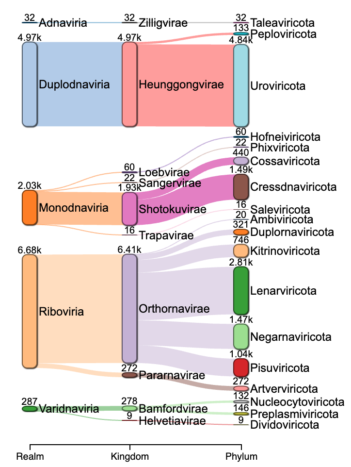
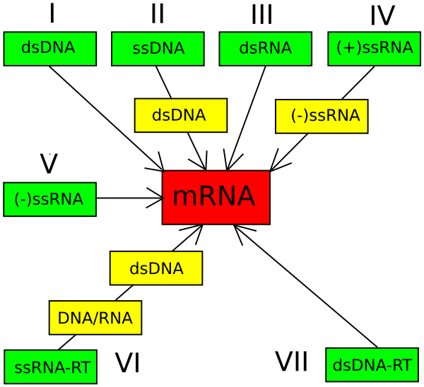
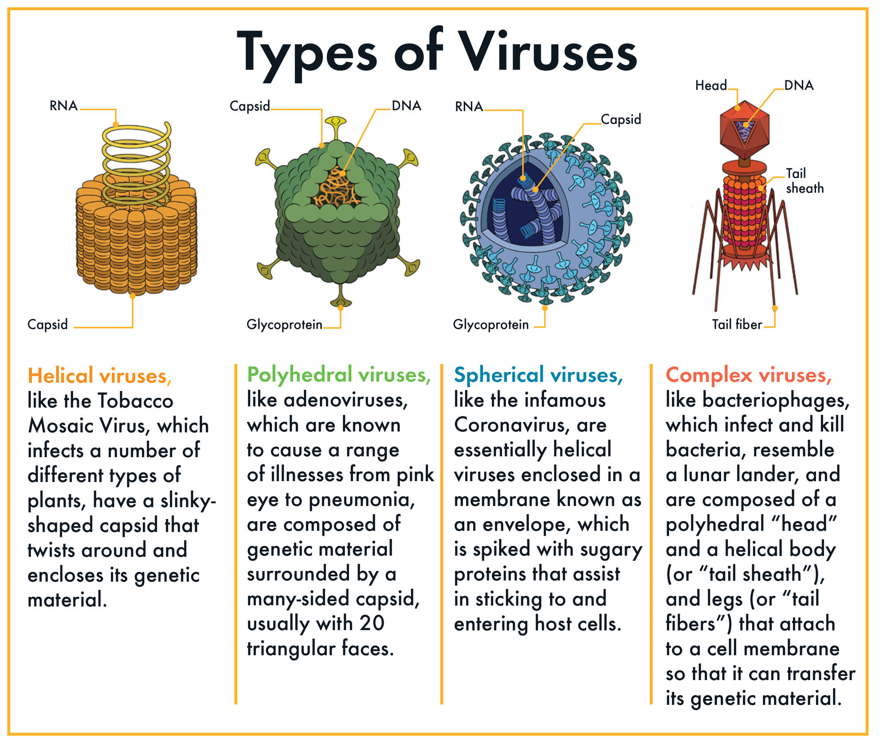
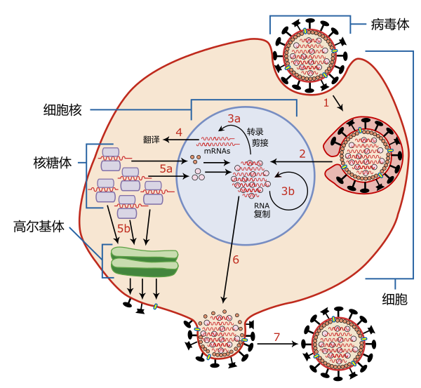

## 什么是病毒？

病毒是一种非常微小的、非细胞结构的病原体，它只能在宿主细胞内生长繁殖。与细菌不同，病毒本身没有完整的细胞结构，也无法进行独立的生命活动（如代谢、繁殖）。它们由遗传物质（DNA或RNA）和蛋白质外壳组成，少数病毒还带有脂质包膜。

- 病毒的基本特征：
1. **结构简单**：病毒的结构通常包括核酸（DNA或RNA）和蛋白质外壳（称为衣壳）。有些病毒外面还有一层由宿主细胞膜衍生来的包膜。
   
2. **寄生性**：病毒必须依赖宿主细胞才能复制。它们入侵宿主细胞后，将自身的遗传物质注入宿主细胞，并利用宿主的代谢系统进行复制。

3. **没有独立的生命活动**：病毒不能独立进行代谢、运动、繁殖等生命活动，必须在宿主细胞内进行复制和增殖。

4. **特异性**：病毒通常具有特异性，即它们只感染某些特定的宿主细胞。例如，某些病毒只感染植物，某些病毒只感染动物，还有些病毒专门感染细菌（称为噬菌体）。

- 病毒的传播：
病毒可以通过多种途径传播，包括空气传播（如流感病毒）、体液传播（如艾滋病毒）、接触传播（如疱疹病毒）、蚊虫叮咬传播（如登革热病毒）等。

- 病毒引发的疾病：
病毒可以引发多种疾病，包括感冒、流感、艾滋病、乙型肝炎、狂犬病、新冠肺炎等。治疗病毒感染通常需要抗病毒药物，而预防病毒感染常用疫苗。

## 分类系统

病毒的分类主要依据以下几个方面：
- **病毒颗粒的特性**：如病毒的形状、大小、是否有包膜等。
- **抗原特性**：指病毒表面蛋白的特性，这些蛋白决定了病毒与宿主细胞的相互作用。
- **生物特性**：包括病毒的基因组类型（DNA或RNA）、复制方式、宿主范围等。

当前，只有一小部分的病毒得到了详细研究。来自人体的病毒样品中，有约20%的序列是未曾发现过的，而从环境（如海水、大洋沉积物等）中采集的病毒样品中，大部分序列都是全新的。这表明我们对病毒世界的了解还非常有限，未来的研究可能会发现更多新病毒，进一步丰富和复杂化现有的病毒分类系统。

### ICTV病毒分类

ICTV于1966年建立了病毒分类的通用系统和统一的命名法则。这个系统是目前唯一一个被广泛接受的病毒分类标准。ICTV是国际微生物学联合会（International Union of Microbiological Societies, IUMS）下属的机构，负责发展、改进和维护这个病毒分类系统。

官方网站：<https://ictv.global/>

- 病毒分类的层次
ICTV的分类系统从最广泛的域（Realm）开始，逐步细化到种（Species）这个最低的分类单元。以下是各个层级及其对应的分类后缀：

1. **域（Realm）**：-viria
2. **亚域（Subrealm）**：-vira
3. **界（Kingdom）**：-viriae
4. **亚界（Subkingdom）**：-virites
5. **门（Phylum）**：-viricota
6. **亚门（Subphylum）**：-viricotina
7. **纲（Class）**：-viricetes
8. **亚纲（Subclass）**：-viricetidae
9. **目（Order）**：-virales
10. **亚目（Suborder）**：-virineae
11. **科（Family）**：-viridae
12. **亚科（Subfamily）**：-virinae
13. **属（Genus）**：-virus
14. **亚属（Subgenus）**：-virus
15. **种（Species）**：通常以[疾病]病毒的形式出现。

我们可以去官网下载文件后看看主要的门类，目前（2024.8.12）共有14,690种有命名的病毒：

```{r eval=FALSE}
library(dplyr)
ICTV=readxl::read_excel("~/database/ICTV_Master_Species_List_2023_MSL39.v3.xlsx",sheet = 2)
ICTV=ICTV[,c("Realm","Kingdom","Phylum", "Class", "Order", "Family", "Genus", "Species","Genome Composition")]

count(ICTV,Realm,Kingdom,Phylum)%>%arrange(-n)%>%na.omit()%>%my_sankey()
```
{width=40%}

以下是主要病毒域及其门类的介绍：

以下是各个病毒域及其主要门类的详细介绍：

- A型DNA病毒域 (Adnaviria)
    - **特征**：包含环状或线状双链DNA病毒，常感染古细菌，具有独特的DNA包装和复制机制。
    - **齐利希病毒界 (Zilligvirae)** 
      - **杆状病毒门 (Taleaviricota)** 

- 双链DNA病毒域 (Duplodnaviria)
    - **特征**: 包含双链DNA病毒，具有独特的DNA包装和复制机制。
    - **香港病毒界 (Heunggongvirae)**：
      - **衣壳病毒门 (Peploviricota)**：具有二十面体衣壳和外膜，附有糖蛋白。
      - **尾噬菌体门 (Uroviricota)**：通过尾状结构将DNA注入宿主。

- 单链DNA病毒域 (Monodnaviria)
    - **特征**：包含单链DNA病毒，通常感染真核生物。
    - **洛布病毒界 (Loebvirae)**：
      - **霍夫奈病毒门 (Hofneiviricota)**
    - **桑格病毒界 (Sangervirae)**：
      - **菲克斯病毒门 (Phixviricota)**
    - **称徳病毒界 (Shotokuvirae)**：
      - **科萨特病毒门 (Cossaviricota)**
      - **单环编码病毒门 (Cressdnaviricota)**：编码复制相关蛋白的环状单链DNA病毒。
    - **特拉帕尼病毒界 (Trapavirae)**：
      - **嗜盐病毒门 (Saleviricota)**

- 核糖病毒域 (Riboviria)
    - **特征**：包含所有RNA病毒，具有单链正负链RNA基因组。
    - **正RNA病毒界 (Orthornavirae)**：
      - **双链RNA病毒门 (Duplornaviricota)**
      - **光滑裸露病毒门 (Lenarviricota)**
      - **黄色病毒门 (Kitrinoviricota)**
      - **负核糖病毒门 (Negarnaviricota)**
      - **小RNA病毒超群门 (Pisuviricota)**
    - **副RNA病毒界 (Pararnavirae)**：
      - **酶录转逆病毒门 (Artverviricota)**

- 核酶病毒域 (Ribozyviria)
    - **特征**：包含单一属的病毒，具有环状RNA，类似核酶的功能。
    - **主要门类**：未列出具体门类。

- 多变DNA病毒域 (Varidnaviria)
    - **特征**：包含多种DNA病毒，具有衣壳基因的广泛变化。
    - **班福病毒界 (Bamfordvirae)**：
      - **核质病毒门 (Nucleocytoviricota)**
      - **质粒前体病毒门 (Preplasmiviricota)**
    - **海尔维蒂病毒界 (Helvetiavirae)**：
      - **分隔病毒门 (Dividoviricota)**

### 巴尔的摩分类法

{width=60%}

巴尔的摩分类法（Baltimore classification）是由美国生物学家戴维·巴尔的摩（David Baltimore）于1971年提出的一种病毒分类方法。与ICTV分类法基于病毒的结构和其他生物特性不同，巴尔的摩分类法主要依据病毒的基因组类型和病毒复制过程中的信使RNA（mRNA）合成方式进行分类。这个分类方法将病毒分为七大类，每一类对应一种特定的基因组类型和复制机制。

- 巴尔的摩分类法的七大类：

1. **I类：双链DNA病毒（dsDNA）**
   - **基因组**：双链DNA。
   - **mRNA合成**：宿主细胞的RNA聚合酶直接转录mRNA。
   - **代表病毒**：腺病毒、疱疹病毒、痘病毒等。

2. **II类：单链DNA病毒（ssDNA）**
   - **基因组**：单链DNA。
   - **mRNA合成**：单链DNA在宿主细胞中形成双链DNA，然后由宿主细胞的RNA聚合酶转录mRNA。
   - **代表病毒**：细小病毒等。

3. **III类：双链RNA病毒（dsRNA）**
   - **基因组**：双链RNA。
   - **mRNA合成**：病毒自带的RNA依赖性RNA聚合酶将双链RNA中的一条链直接转录为mRNA。
   - **代表病毒**：轮状病毒等。

4. **IV类：正义单链RNA病毒（(+)-ssRNA）**
   - **基因组**：正义单链RNA，即直接作为mRNA使用。
   - **mRNA合成**：基因组RNA本身就是mRNA，可以直接被翻译成蛋白质。
   - **代表病毒**：冠状病毒、脊髓灰质炎病毒、黄病毒等。

5. **V类：负义单链RNA病毒（(-)-ssRNA）**
   - **基因组**：负义单链RNA。
   - **mRNA合成**：病毒自带的RNA依赖性RNA聚合酶将负义RNA转录为正义mRNA。
   - **代表病毒**：流感病毒、狂犬病毒、麻疹病毒等。

6. **VI类：反转录RNA病毒（Retroviruses）**
   - **基因组**：正义单链RNA。
   - **mRNA合成**：病毒自带的逆转录酶将RNA逆转录为双链DNA，双链DNA整合到宿主基因组中，宿主细胞的RNA聚合酶再转录mRNA。
   - **代表病毒**：人类免疫缺陷病毒（HIV）等。

7. **VII类：反转录DNA病毒（Pararetroviruses）**
   - **基因组**：部分双链DNA，带有缺口。
   - **mRNA合成**：缺口的双链DNA在宿主细胞内修复成为完整的双链DNA，由宿主的RNA聚合酶转录mRNA。部分mRNA通过逆转录形成DNA，并整合到宿主基因组中。
   - **代表病毒**：乙型肝炎病毒（HBV）等。

### 亚病毒因子

亚病毒因子是指比病毒更简单的病原体，包括类病毒、卫星病毒和朊病毒等。它们通常没有完整的病毒结构，缺乏自身复制所需的酶或结构蛋白，依赖宿主或协助病毒的机制进行繁殖。

- **类病毒**：由单一的环状RNA分子组成，感染植物。
- **卫星病毒**：依赖辅助病毒进行复制。
- **朊病毒**：异常折叠的蛋白质，能导致神经退行性疾病。

这些因子尽管简单，却可能导致严重的疾病。

## 结构



病毒的形态和大小多种多样，大多数病毒直径在10至300纳米之间。某些丝状病毒长度可达1400纳米，但宽度只有约80纳米。病毒的形态主要有以下四种：

1. **螺旋形**：核酸与蛋白质亚基形成螺旋状结构，如烟草花叶病毒。螺旋形病毒的长度取决于核酸的长度。

2. **正二十面体形**：多见于动物病毒，结构为正二十面体，如腺病毒。这种结构具有对称性，可以最小化形成衣壳所需的能量。

3. **包膜型**：包膜由宿主细胞膜改造形成，包裹在核衣壳外，如流感病毒。包膜使病毒能够通过细胞膜与宿主细胞融合，从而不必导致宿主细胞死亡。

4. **复合型**：结构复杂，既非完全螺旋形也非完全正二十面体形，如有尾噬菌体和痘病毒。复合型病毒常有附加结构，如尾部或外壁，参与感染过程。

病毒颗粒（病毒体）由蛋白质组成的衣壳和内部核酸组成。衣壳的形状由病毒基因组编码的蛋白质决定，通常可以自组装形成。某些病毒还有包膜，包膜内含有来自宿主细胞的脂质、糖类和病毒编码的膜蛋白。包膜型病毒的感染性依赖于包膜。病毒形态学研究通常通过电子显微镜和负染色技术进行观察。

## 生命周期



病毒的生命周期分为六个主要阶段，各阶段间的差异取决于病毒类型，但总体流程相似：

1. **附着 (Attachment)**：病毒通过其衣壳蛋白与宿主细胞表面的特定受体结合。这种结合决定了病毒的宿主范围，例如HIV特异性结合人类T细胞的CD4分子。
   
2. **穿入 (Penetration)**：病毒通过受体介导的胞吞或膜融合进入宿主细胞。植物病毒通常通过伤口进入细胞，而噬菌体则通过注入DNA的方式感染细菌。

3. **脱壳 (Uncoating)**：病毒的衣壳在宿主细胞内被酶降解，释放出病毒的核酸。

4. **合成 (Replication)**：病毒基因组在宿主细胞内复制，并利用宿主的酶系统进行转录和蛋白质合成。在这一阶段，病毒的结构成分开始合成，病毒的复制也开始。

5. **组装 (Assembly)**：新合成的病毒核酸与衣壳蛋白组装成新的病毒颗粒。DNA病毒通常在细胞核内组装，而RNA病毒则在细胞质中完成组装。

6. **释放 (Release)**：无包膜病毒通过细胞裂解（lysis）释放，包膜病毒则通过出芽 (budding) 方式离开宿主细胞。在出芽过程中，病毒从宿主细胞膜中获取包膜，包膜上嵌有病毒的表面蛋白。

病毒基因组的复制方式因其遗传物质的类型不同而有所差异：

1. **DNA病毒**：大多数DNA病毒在宿主细胞核内复制。它们依赖宿主细胞的DNA和RNA合成机制，基因组需穿过核膜以控制这些工具。

2. **RNA病毒**：RNA病毒在细胞质内复制，使用自身的RNA复制酶。其复制机制取决于RNA的极性和链数。

3. **反转录病毒**：这些病毒利用反转录酶将RNA模板转化为DNA，或将DNA模板转化为RNA，并将生成的DNA整合入宿主基因组中。

## 功能

病毒在环境生态和人类健康中扮演着复杂而重要的角色：

### 环境生态方面

1. **生态平衡**：病毒可以通过感染和控制微生物种群，帮助维持生态系统的平衡。例如，噬菌体可以调节细菌的数量，从而影响微生物群落的结构和功能。

2. **物质循环**：病毒在环境中可以促进物质循环。例如，海洋中的病毒感染细菌，导致细菌裂解，这释放出有机物质，供其他微生物利用，促进碳循环和营养物质的循环。

3. **遗传变异**：病毒可以通过转导（转移遗传物质）促进基因水平的遗传变异，影响宿主的遗传组成和进化过程。

### 对人类健康方面

1. **疾病**：病毒是许多传染病的病原体，如流感、感冒、艾滋病、肝炎等。它们通过感染宿主细胞，破坏正常的生理功能，引发疾病。

2. **免疫系统**：某些病毒可以引发免疫反应，增强免疫系统的记忆功能。例如，疫苗接种就是利用病毒的无害部分来激发免疫反应，以保护个体免受未来的感染。

3. **基因治疗**：病毒可以作为基因递送工具，将治疗性基因引入患者体内，用于治疗一些遗传性疾病。这些病毒通常经过工程化处理，使其不再引起疾病，同时具备高效的基因递送能力。

4. **肿瘤治疗**：一些病毒具有选择性地感染和杀死癌细胞的能力，这为癌症治疗提供了新的方向。例如，工程化的溶瘤病毒可以专门攻击肿瘤细胞，同时减少对正常细胞的损伤。

总的来说，病毒在生态系统中是关键的调节因子，对环境平衡和物质循环起着重要作用；在医学领域，虽然它们可能引起疾病，但也提供了治疗和基因工程的创新机会。