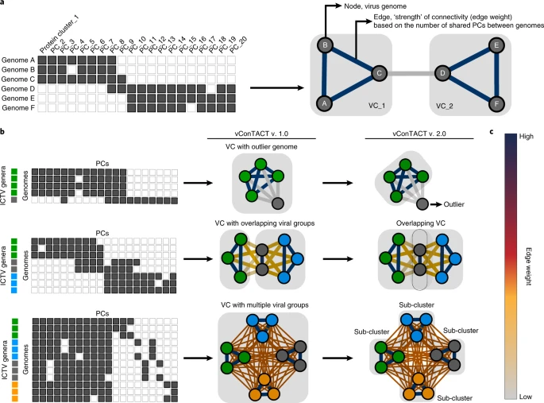
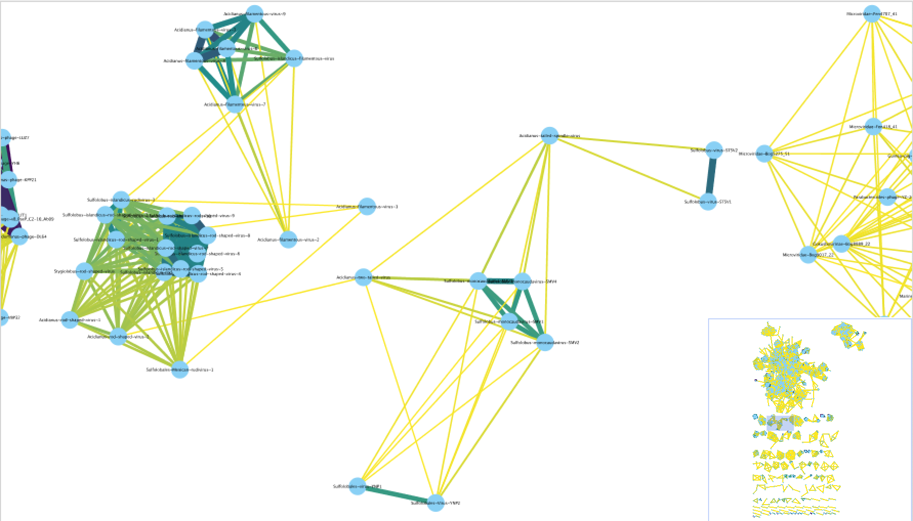
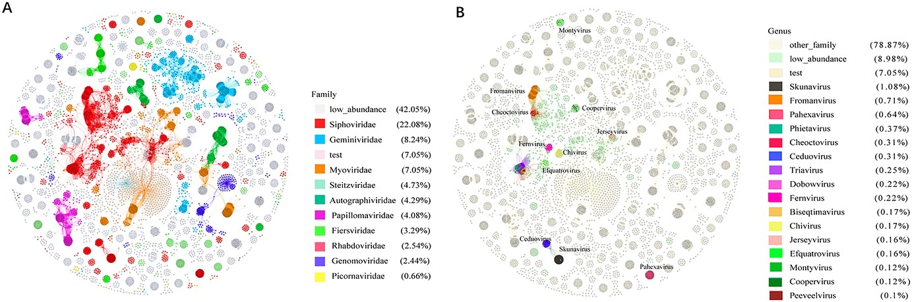

## Introduction

在微生物群落的研究中，分类和注释数量庞大的未培养古细菌和细菌病毒一直是一个难题，主要原因是缺乏统一的分类框架。

目前，用于病毒分类的多种基于基因组的方法已经被提出，主要集中在细菌、古细菌和真核生物病毒的分类上。

1. **蛋白序列比较**：早期方法使用完整基因组的蛋白序列进行配对比较，生成“噬菌体蛋白质树”。但因“镶嵌性”特征影响分类界限，这一方法未被广泛采用。

2. **共享基因的比例**：另一些方法则基于共享基因的比例和同源基因的百分比定义病毒分类。然而，由于病毒进化模式变化大，这些方法未能有效处理所有已知的病毒群体。

3. **GBDP**：基于基因组Blast距离的系统发育算法，如VICTOR工具，结合系统发育和聚类方法进行病毒分类。该方法的可扩展性有限，且对缺乏参考基因组的病毒分类效果有限。

4. **基因共享网络**：基于病毒基因组间共享的蛋白质簇（PCs）构建的基因共享网络，已被证明与ICTV认可的分类基本一致。vConTACT v.1.0应用该方法实现了75%的一致性，并在全球海洋、淡水和土壤研究中用于大规模病毒分类。

尽管这些方法各有优缺点，但基因共享网络逐渐成为病毒分类的重要工具，尤其在缺乏参考基因组的情况下发挥了关键作用。


## vConTACT2

vConTACT v.2.0 提供了一种可扩展的网络化解决方案，通过分析全基因组共享的基因模式，结合层次聚类和置信评分，实现病毒分类。它不仅能够成功复现已有的病毒分类，还可以高效处理大型宏基因组数据集，成为病毒分类的强大工具，适用于各种环境中的病毒研究。文章于2019年发表在Nature Biotechnology上[1]。


在网络为基础的基因组分类算法中，相关的基因组通过多个边紧密连接。vConTACT v.2.0使用了一种新的两步聚类算法，以提高分类的准确性和鲁棒性。首先，基于蛋白质簇（PC）的马尔可夫聚类算法 (MCL) 被用于初步分类。然后，使用ClusterONE替代MCL以定义病毒簇（VC），并通过层次聚类进一步细分网络问题区域。此外，v.2.0 引入了拓扑和分类基础的置信度分数，以帮助识别和优化分类任务。

软件主页：<https://github.com/Hocnonsense/vcontact2>

>注意：由于资助结束，vConTACT2 不再被积极开发，尽管作者仍在修复错误并解决出现的其他问题。

### 安装

```bash
# 注意使用python3.7而不是直接指定python=3，现在python版本太新了会出问题
conda create --name vContact2 python=3.7
source activate vContact2
conda install -y -c bioconda vcontact2 mcl blast diamond
```

再安装一下依赖的cluster_one：

```bash
# 下载聚类软件，移动到conda/bin路径 (可使用win下载代替)
wget -c http://www.paccanarolab.org/static_content/clusterone/cluster_one-1.0.jar
java -jar cluster_one-1.0.jar -h
chmod +x ./cluster_one-1.0.jar
mv ./cluster_one-1.0.jar ~/miniconda3/bin/
```

不然会报错：`ERROR:vcontact2: Could not find ClusterONE java file.`

vContact2自带数据库，在`~/miniconda3/envs/vContact2/lib/python3.7/site-packages/vcontact2/data/`目录下。

### 运行

#### 主要参数：

- **-r RAW_PROTEINS, --raw-proteins RAW_PROTEINS**：输入FASTA格式的蛋白质文件。如果同时提供`--proteins-fn`，vConTACT将从蛋白质簇(PC)生成前开始处理。
- **--rel-mode {BLASTP, Diamond, MMSeqs2}**：选择用于创建蛋白质相似性边文件的方法。默认使用Diamond。
- **-b BLAST_FP, --blast-fp BLAST_FP**：输入BLAST结果文件(CSV或TSV格式)，用于生成蛋白质簇。提供此选项时，将从PC生成步骤开始。
- **-p PROTEINS_FP, --proteins-fp PROTEINS_FP**：提供一个文件，将蛋白质名称与基因组名称链接。如果提供了`--blast-fp`，则从PC生成步骤开始。
- **--db {None, ProkaryoticViralRefSeq85-ICTV, ...}**：选择参考数据库用于去新蛋白质簇生成。默认使用`ProkaryoticViralRefSeq85-ICTV`。
- **--pcs-mode {ClusterONE, MCL}**：选择用于蛋白质簇生成的算法，默认为MCL。
- **--vcs-mode {ClusterONE, MCL}**：选择用于病毒簇生成的算法，默认为ClusterONE。
- **--c1-bin CLUSTER_ONE**：指定ClusterONE可执行文件的路径。
- **--blastp-bin BLASTP_FP**：指定BLASTP可执行文件的路径。
- **--diamond-bin DIAMOND_FP**：指定DIAMOND可执行文件的路径。
- **-o OUTPUT_DIR, --output-dir OUTPUT_DIR**：指定输出目录，默认`vContact_Output`。
- **-t THREADS, --threads THREADS**：设置使用的CPU数量，默认32个。


#### 输入形式：

1. FASTA格式的氨基酸文件。
```
>ref|NP_039777.1| ORF B-251 [Sulfolobus spindle-shaped virus 1]
MVRNMKMKKSNEWLWLGTKIINAHKTNGFESAIIFGKQGTGKTTYALKVAKEVYQRLGHE
PDKAWELALDSLFFELKDALRIMKIFRQNDRTIPIIIFDDAGIWLQKYLWYKEEMIKFYR
IYNIIRNIVSGVIFTTPSPNDIAFYVREKGWKLIMITRNGRQPDGTPKAVAKIAVNKITI
IKGKITNKMKWRTVDDYTVKLPDWVYKEYVERRKVYEEKLLEELDEVLDSDNKTENPSNP
SLLTKIDDVTR
>ref|NP_039778.1| ORF D-335 [Sulfolobus spindle-shaped virus 1]
MTKDKTRYKYGDYILRERKGRYYVYKLEYENGEVKERYVGPLADVVESYLKMKLGVVGDT
PLQADPPGFEPGTSGSGGGKEGTERRKIALVANLRQYATDGNIKAFYDYLMNERGISEKT
AKDYINAISKPYKETRDAQKAYRLFARFLASRNIIHDEFADKILKAVKVKKANADIYIPT
```

2. 一个“基因到基因组”的映射文件，采用tsv（制表符）或csv（逗号）分隔格式。
```
protein_id,contig_id,keywords
ref|NP_039777.1|,Sulfolobus spindle-shaped virus 1,ORF B-251
ref|NP_039778.1|,Sulfolobus spindle-shaped virus 1,ORF D-335
ref|NP_039779.1|,Sulfolobus spindle-shaped virus 1,ORF E-54
ref|NP_039780.1|,Sulfolobus spindle-shaped virus 1,ORF F-92
ref|NP_039781.1|,Sulfolobus spindle-shaped virus 1,ORF D-244
ref|NP_039782.1|,Sulfolobus spindle-shaped virus 1,ORF E-178
ref|NP_039783.1|,Sulfolobus spindle-shaped virus 1,ORF F-93
ref|NP_039784.1|,Sulfolobus spindle-shaped virus 1,ORF E-51
ref|NP_039785.1|,Sulfolobus spindle-shaped virus 1,ORF E-96
```

#### 测试数据：

```bash
git clone https://github.com/Hocnonsense/vcontact2.git
cd vcontact2/test_data
vcontact2 --raw-proteins test_data/VIRSorter_genomes.faa \
    --proteins-fp test_data/VIRSorter_genomes_g2g.csv \
    --db 'ProkaryoticViralRefSeq211-Merged' \
    --output-dir vConTACT2_Results
```

运行时间还挺久的，输入文件有11个病毒contig，共433个gene。给了4核16G内存，结果跑了6485s，平均占用10.6GB内存。

应该要给多一点线程。

### 输出

vConTACT2 生成了很多输出文件，其中大多数是临时或中间文件，对一般用户没有用处。最重要的文件是网络和注释文件。

#### genome_by_genome_overview.csv

包含参考基因组的所有分类信息，以及所有聚类信息（初始 VC (VC_22)、精炼 VC (VC_22_1)）、置信度指标和杂项分数。

一个重要的注意事项是，用户序列不包含分类信息。这意味着每个用户都需要找到他们感兴趣的基因组并检查参考基因组是否位于同一 VC 中。
- 如果用户基因组与参考基因组位于同一 VC 子簇内，则用户基因组属于同一属的可能性非常高。
- 如果用户基因组与参考基因组位于同一 VC 但不在同一子簇中，则两个基因组很可能在大致属亚科水平上相关。
- 如果同一 VC 或 VC 子簇中没有参考基因组，那么它们很可能在属水平上根本不相关。也就是说它们有可能在更高的分类水平上相关（亚科、科、目）。

每列名称：
- 1	Genome	基因组/序列名
- 2-4	Order/Family/Genus	目/科/属
- 5	preVC	初始病毒聚类
- 6	VC Status	病毒聚类状态
- 7	VC	病毒聚类
- 8	VC Size	病毒聚类数
- 9	Quality	质量值
- 10	Adjusted P-value	调整后的P值
- 11	VC Avg Distance	病毒聚类平均距离
- 12	Topology Confidence Score	拓扑学置信度
- 13	Genus Confidence Score	属级分类置信度
- 14-16	VC Orders/Families/Genra	病毒聚类目/科/属数

#### c1.ntw

包含高于显着性阈值的所有基因组对的源/目标/边缘权重信息，该显着性阈值由这两个基因组共享 N 个基因的概率确定。该文件中的最小值必须大于最小显着性阈值（默认值：1）。

要在 Gephi 或 Cytoscape 中创建网络图形，用户需要将此文件导入到他们喜欢的程序中。
导入后，用户可以添加一个“注释文件” ，可以是genome_by_genome_overview.csv。
每个基因组的注释信息将被添加到网络中的每个节点/基因组。然后，用户可以通过注释文件中的任意属性对网络图形进行着色。

>注意：很多时候，用户会注意到他们的基因组连接到网络中的另一个（可能是参考）基因组，但这两个基因组不会位于同一个 VC 子簇中，甚至不会位于同一个 VC 中。这并不意味着它们没有相关性，只是意味着它们的基因共享比例不够大，无法属于同一属。他们在亚科或科层面上可能有很大的关联。

可在<https://dx.doi.org/10.17504/protocols.io.x5xfq7n>找到详细的说明。



## PhaGCN2



PhaGCN2是一种可以快速分类病毒序列的工具，能够在科水平上进行分类，并支持所有科之间关系的可视化。文章于2022年发表在Briefings in Bioinformatics上[2]。

PhaGCN2的性能与其他先进的病毒分类工具（如vConTACT2、CAT和VPF-Class）进行比较显示，PhaGCN2在病毒分类的精度和召回率上大大提高，并且显著增加了可分类病毒序列的数量。它将全球海洋病毒组数据库（Global Ocean Virome）中的可分类序列数量提高了四倍，并且能够对超过90%的肠道噬菌体数据库（Gut Phage Database）进行分类。PhaGCN2使得国际病毒分类委员会数据库（ICTV）的大规模、自动化扩展成为可能。

软件主页：<https://github.com/KennthShang/PhaGCN2.0>

### 安装


```bash
git clone https://github.com/KennthShang/PhaGCN2.0.git
cd PhaGCN2.0
rm supplementary\ file/ __pycache__/ pred/ final_prediction.csv -rf
vi run_KnowledgeGraph.py # 把第169行注释掉，因为不需要再建一次数据库。
conda env create -f environment.yaml -n phagcn2

# 准备数据库
cd database
tar -zxvf ALL_protein.tar.gz
diamond makedb --in ALL_protein.fasta -d database.dmnd
diamond blastp --sensitive -d database.dmnd -q ALL_protein.fasta -o database.self-diamond.tab
awk '$1!=$2 {{print $1,$2,$11}}' database.self-diamond.tab > database.self-diamond.tab.abc
cd ..
```

### 运行

```
$ python run_Speed_up.py -h
usage: run_Speed_up.py [-h] [--contigs CONTIGS] [--len LEN]

manual to this script

optional arguments:
  -h, --help         show this help message and exit
  --contigs CONTIGS
  --len LEN
```

该程序有两个参数：
- `--contigs` 是 contigs 文件的路径。
- `--len` 是您要预测的重叠群的长度。正如我们的论文所示，随着重叠群长度的增加，查全率和查准率也会增加。我们建议您根据需要选择合适的长度。默认长度为 8000bp。支持的最短长度为1700bp。输出文件为final_prediction.csv。此 csv 文件中有三列：“contig_name、median_file_name、prediction”。

#### 示例：

```bash
conda activate phagcn2
export MKL_SERVICE_FORCE_INTEL=1 #要设置一下这个
python run_Speed_up.py --contigs contigs.fa --len 8000
```

**注意，该程序没有指定输出路程，会在当前目录生成，每次重跑会覆盖之前的内容😂，而且因为它的环境路径也不是绝对的，所以只能在PhaGCN2.0目录下跑，所以也不能同时跑多个任务**，作者暂时也没有修改这个问题：<https://github.com/KennthShang/PhaGCN2.0/issues/10>。

所以最好在运行该程序之前先切换到相应的输出目录（把运行文件全部拷贝到该目录），或者每次运行完把结果移动到输出目录。

每次运行完把结果再移动到输出目录的策略还是有不足，会导致无法同时运行多个任务，所以选择前者。

我们可以看一下run_Speed_up.py具体的几个步骤：

1. diamond，blastp 数据库准备，这里只需要运行一遍就好了，不知道为啥要放在run_Speed_up.py里每次都运行，至少还需要几十分钟呢。
2. 把我们输入的contigs分割为每1000条序列一个子文件，过滤掉小于8000的序列，放在Split_files/下。
3. 循环每个子文件：
    1. 把子文件mv到input/下，运行run_CNN.py，会用到CNN_Classifier/目录，得到Cyber_data/contig.F
    2. 运行run_KnowledgeGraph.py，生成中间文件single_contig/，all_proteins/，network/，输出到out/和Cyber_data/
    3. 运行run_GCN.py，得到prediction.csv，
    4. 整理子文件输出，放在pred/，删除中间文件
4. 合并所有子文件输出，运行run_network.py

所以还是选择自己写一个pipeline来跑吧，方便指定输出位置以及同时跑多个任务，不用run_Speed_up.py：

```bash
#!/bin/bash

# 打印帮助信息
usage() {
    echo "Usage: $0 -p <phaGCN_dir> -i <input_file> -o <output_dir>"
    exit 1
}

# 解析命令行参数
while getopts ":p:i:o:" opt; do
    case "${opt}" in
        p)
            phaGCN_dir=${OPTARG}
            ;;
        i)
            input=${OPTARG}
            ;;
        o)
            output=${OPTARG}
            ;;
        *)
            usage
            ;;
    esac
done

# 检查是否提供了所有参数
if [ -z "${phaGCN_dir}" ] || [ -z "${input}" ] || [ -z "${output}" ]; then
    usage
fi

# 将路径转换为绝对路径
phaGCN_dir=$(cd "$(dirname "$phaGCN_dir")" && pwd)/$(basename "$phaGCN_dir")
input=$(cd "$(dirname "$input")" && pwd)/$(basename "$input")
output=$(cd "$(dirname "$output")" && pwd)/$(basename "$output")

# 检查输出目录是否存在且非空
if [ -d "$output" ] && [ "$(ls -A $output)" ]; then
    echo "Error: Output directory $output already exists and is not empty."
    exit 1
fi

# 创建输出目录并进入
mkdir -p "$output"
cd "$output" || exit

# 复制 Python 脚本和 C 相关内容
cp "${phaGCN_dir}"/*.py ./
cp -r "${phaGCN_dir}/C"* ./

# 创建 database 目录的符号链接
ln -s "${phaGCN_dir}/database/" ./

# 创建 input 目录并复制输入文件
mkdir input/
cp "$input" input/

# 运行各个 Python 脚本
echo "Running CNN..."
python run_CNN.py

echo "Running KnowledgeGraph..."
mkdir network
python run_KnowledgeGraph.py

echo "Running GCN..."
python run_GCN.py

echo "All tasks completed."

# 删除拷贝过来的脚本和目录
rm -rf *.py C* database
```

把上面内容拷贝到名为 run_phagcn的文件，注意修改~/biosoft/PhaGCN2.0为自己目录：

```bash
vi run_phagcn
chmod +x run_phagcn
# 链接到环境变量目录
ln -s ~/biosoft/PhaGCN2.0/run_phagcn ~/miniconda3/envs/phagcn2/bin/
```

这样就可以在任意目录运行该程序并指定输出了。

```bash
cd ~/work/test/phagcn2_test
# 注意input不要是contigs.fa，不然会覆盖
cp ~/biosoft/PhaGCN2.0/contigs.fa ./test_contigs.fa
run_phagcn -p ~/biosoft/PhaGCN2.0/ -i test_contigs.fa -o ~/work/test/phagcn2_test/output
```

结果就是prediction.csv文件和network/phage_0.ntw文件，network/phage_0.ntw可以类似上述方法画一个网络图。

## References

1. Bin Jang, H., Bolduc, B., Zablocki, O. et al. Taxonomic assignment of uncultivated prokaryotic virus genomes is enabled by gene-sharing networks. Nat Biotechnol 37, 632–639 (2019). <https://doi.org/10.1038/s41587-019-0100-8>
2. Jing-Zhe Jiang, Wen-Guang Yuan, Jiayu Shang, Ying-Hui Shi, Li-Ling Yang, Min Liu, Peng Zhu, Tao Jin, Yanni Sun, Li-Hong Yuan, Virus classification for viral genomic fragments using PhaGCN2, Briefings in Bioinformatics, 2022;, bbac505, <https://doi.org/10.1093/bib/bbac505>
