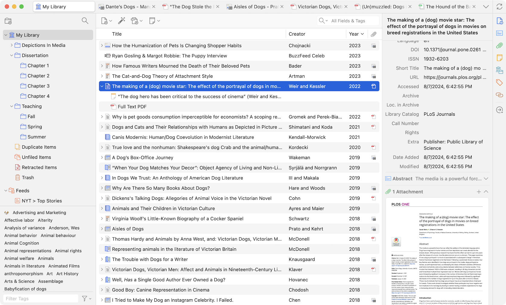
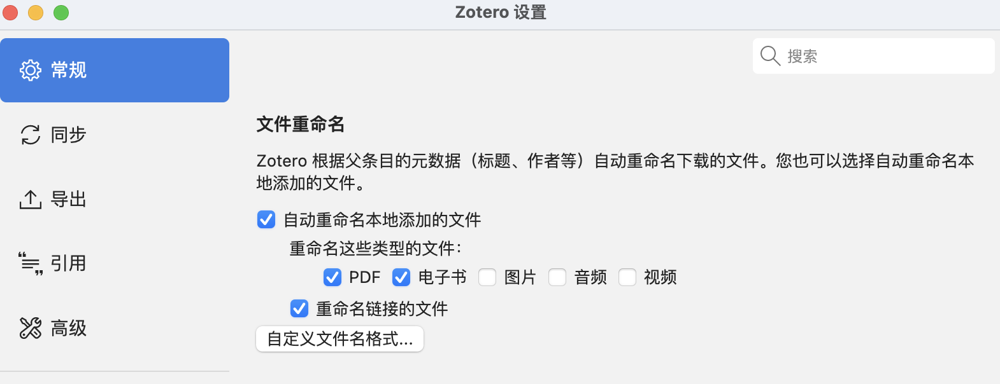
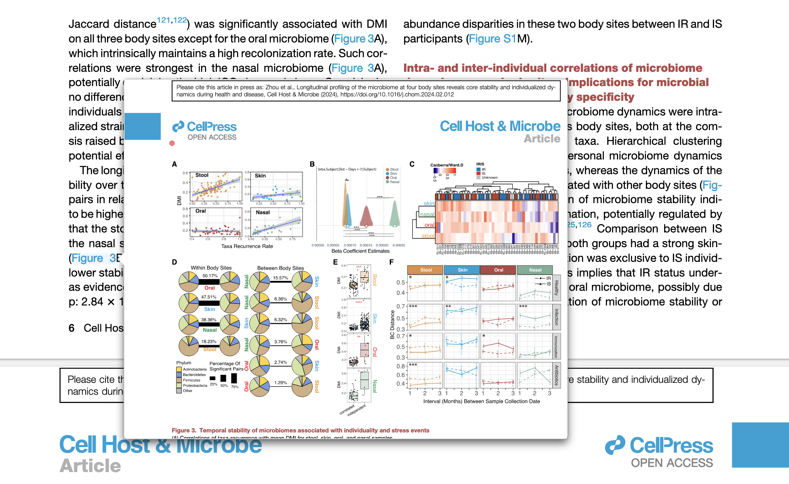

Zotero 7.0 beta 版已经测试好久了，最近终于正式上线了。官方说Zotero 7是Zotero发布18年来最大的一次更新，它在设计、性能和功能性上都有了显著的提升。

如果你已经在使用Zotero，可以通过Zotero内部的“帮助”菜单下的“检查更新...”来升级。
Windows用户建议安装64位Zotero以获得最佳性能。Apple Silicon Mac的用户在从Zotero 6进行应用内升级后，Zotero 7会继续在Rosetta下运行，重新启动后将获得原生性能。

官网下载：<https://www.zotero.org/>

下面介绍一些新功能和好用插件。

## 新功能

### 设计改版
Zotero 7带来了全新的现代化设计，虽然是重新设计，但依然保留了老用户熟悉的界面。

- 新的项目面板：
项目面板是此次改动的重要部分之一，原来的水平标签（如信息、标签、笔记等）被折叠的垂直区域和侧边导航栏取代。这种设计允许在不影响使用性的情况下显示更多信息。此外，插件也可以更方便地创建专属的自定义信息或操作区域。

新的可自定义标题栏可以显示标题、标题/作者/日期，甚至是选择的引用格式的参考文献条目，且在信息部分折叠时，标题栏依然可见。

- 暗黑模式：
Zotero 7的设计中加入了全新的暗黑模式，确保每个部分都在暗黑模式下表现出色。此外，PDF和EPUB内容的基础暗黑模式支持也已经实现，未来还会有更多高级渲染选项。如果需要查看文档的原始状态，可以在阅读器的视图菜单中关闭内容的暗黑模式。

{width=50%}

- 界面密度选择：
Zotero 7现在提供两种界面密度选项：紧凑和舒适。紧凑模式类似于之前的密度，而舒适模式则是新的默认设置，适合新用户或较小的文献库用户，提供了更舒适的使用体验。

- 新的应用图标：
为了配合全新的外观，Zotero 7还设计了一个全新的应用图标。

{width=20%}

### 自定义文件重命名

之前我是用第三方插件 zotfile 来完成附件重命名的，现在 Zotero 7已经原生支持了（zotfile插件也不能用了😂）。

在“设置-常规-文件重命名“里面修改：

默认命名格式是`{{ firstCreator suffix=" - " }}{{ year suffix=" - " }}{{ title truncate="100" }}`

我比较喜欢“年份-期刊-标题”的形式，所以可以参考[官方说明](https://www.zotero.org/support/file_renaming)修改为：
`{{ year suffix=" - " }}{{ journalAbbreviation suffix=" - " }}{{ title truncate="100" }}`

### 智能参考弹窗

这个我觉得很牛，很好用。

现在，悬停在引用或内部链接上时，会自动弹出显示相关参考文献或图表的窗口，不必再来回跳转查找参考内容。

### 性能提升
Zotero 7在整体性能上有了显著提升，并支持Apple Silicon Mac、64位Windows和Windows on ARM，确保在最新硬件上的流畅运行。

这个我感受了一下，不好说进步有多少。我是Mac air M2版本的，之前Zotero 6打开7-8个pdf经常会内存不足，要求我强制退出，现在Zotero 7基本不会，但是内存确实还是占了3-4GB。

### 改进的阅读器
Zotero 7的内置PDF阅读器进行了重大升级，现在它不再仅仅是PDF阅读器，还支持EPUB格式。

- **EPUB支持**：EPUB是目前最流行的电子书格式，许多人更喜欢它的阅读体验。EPUB文档现在可以像PDF一样在Zotero的内置阅读器中打开，可以进行标注并将这些标注添加到笔记中。Zotero还可以自动检索大多数EPUB的元数据，并创建父项目。

- **网页快照**：Zotero保存的网页快照现在可以在新的阅读器中自动打开，使得标注网页变得和标注PDF一样方便。

### 新的标注类型

Zotero 7支持创建墨迹、下划线和文本标注。墨迹标注已经在iOS上支持，现在也可以在桌面应用中使用（在触摸屏PC或手写笔设备上表现最佳）。下划线标注与高亮类似，文本标注则允许直接在页面上添加文本。

{width=50%}

### 更智能的引用

Zotero 7的引用过程变得更快且更直观。引用对话框会自动建议列表中选择的项目或在阅读器中打开的文档。引用你正在查看的内容现在只需点击“添加/编辑引用”并按Enter即可。

这个是挺需要的功能，不然每次还要多一步搜索。

### 其他

- 收藏夹搜索：
你可以在任意文献库中快速找到需要的收藏夹并跳转到它，无需手离键盘。

- 标签菜单：
查看所有标签的垂直列表，输入关键字快速过滤列表，并快速跳转到指定标签。还可以直接从菜单中关闭或重新排列标签。

- 附件预览：
在项目面板中直接预览PDF、EPUB、快照和图片，无需打开阅读器。

- 回收站中的收藏夹和搜索：
被删除的收藏夹和搜索现在会被移到回收站中。如果不小心删除了收藏夹，可以轻松从回收站恢复，所有项目和子收藏夹都会保留。

- “文献库和收藏夹”列表：
项目面板中新增了一个部分，显示当前项目所在的所有收藏夹和文献库。

- 自定义文件重命名：
Zotero一直以来都支持自动重命名文件，现在你可以根据更多选项自定义文件名规则，确保文件名包含所有需要的信息。

- 提高的可访问性：
Zotero 7大大提升了对屏幕阅读器用户的可访问性，并改进了整个应用的键盘导航。未来还会有更多无障碍功能的改进。

- 改进的插件架构：
Zotero 7引入了新的插件架构，支持无缝加载/卸载插件，并内置了常见集成点（项目列表列、项目面板部分、设置面板等）的支持，使得插件更容易编写，并且在Zotero更新时更稳定。

## 插件

Zotero 用户的活跃社区开发了各种插件来提供增强功能、新功能以及与其他程序的接口。
注意有些6.0里的插件在7.0里都失效了，需要重新安装或者寻找替代品。

官方列表：<https://www.zotero.org/support/plugins>，不全，可以去github搜索更多插件，或者用下面的Zotero-Addons查找。

### Zotero-Addons

这是一个用于在 Zotero 7 内浏览和安装插件的 Zotero 7 插件（用插件来管理插件）。

安装后右上角就会出现“插件市场”的图标了，点击它就可以浏览和安装其他插件了（根据star数量排序，看看有哪些大家喜欢的）。

### Translate for Zotero

读文献有时候还是需要借助翻译的。
Zotero PDF Translate是由@windingwind 开发的，用于文献管理软件Zotero的翻译插件。它完全开源、免费，主要功能有：

- 划词翻译（自动/手动）
- 标题、摘要翻译与源文本/翻译结果显示切换
- 批注翻译（自动/手动）
- 支持15+种翻译服务与4+种字典服务
- 自定义翻译侧栏UI，支持同时使用多种翻译引擎

### Better BibTex for Zotero

Better BibTex是一款Zotero的插件，它可以自动生成BibTeX格式的参考文献，并自动更新到文献管理器中。我经常用Rmarkdown写东西，Rstudio和Zotero的连接需要Better BibTex。Latex论文写作时应该也要用到。

### Jasminum

有些时候还是要看一些中文文献的，Jasminum是一个Zotero 中文插件，旨在提升 Zotero 中文用户的使用体验。主要功能有：

- 中文期刊附件（PDF/CAJ）的元数据抓取，支持添加PDF/CAJ时自动抓取元数据功能
- 集成 Zotero 中文社区转换器的下载与更新功能
- 为知网学位论文PDF添加章节书签（依赖于PDFtk）
- 更新中文文献引用次数，核心期刊信息
- 合并/拆分姓，名，识别文献条目语言，下载知网附件，统一日期格式等

### Zotero Reference

Zotero Reference可以将文章中的参考文献展示在侧边栏，方便查阅参考文献。

### Linter for zotero

可以规范化/格式化条目的元数据（字段数据）。可以全部选中跑一遍Lint并修复。

### SciPDF

Sci-Hub 应该不用多介绍。

此插件利用了 Zotero 内自带的 PDF resolvers方案，将 Sci-Hub 的 resolver 自动填入 extensions.zotero.findPDFs.resolvers 字段，以实现在zotero内从sci-hub下载pdf。

### 其他

- Better Notes for Zotero，用的人非常多的一个笔记插件，不过我做笔记太懒了😂。
- Awesome GPT，GPT帮忙读文献，可惜我没有API。
- Ethereal Style，享受阅读文献的乐趣，但是可能会卡顿。
- Actions and Tags，可以使用自定义脚本自动化您的工作流程！
