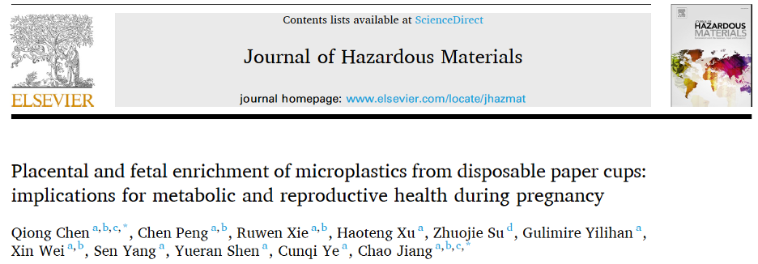
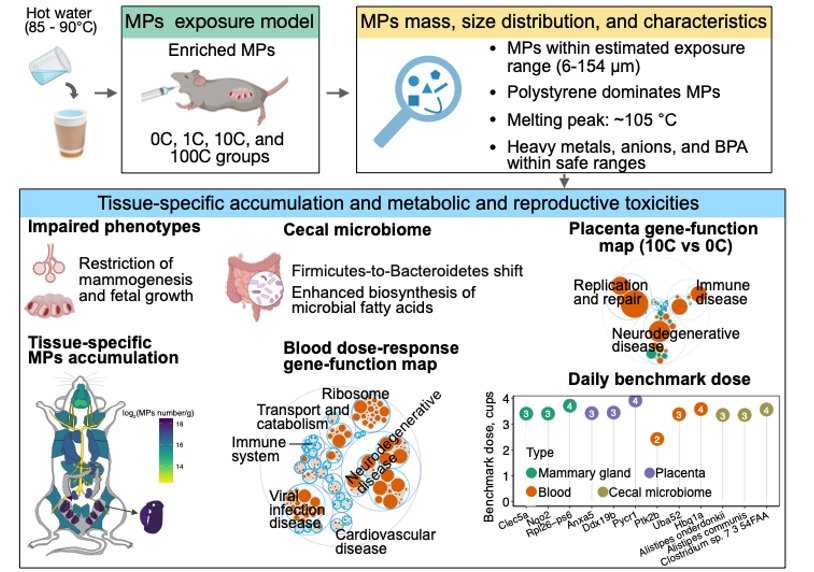
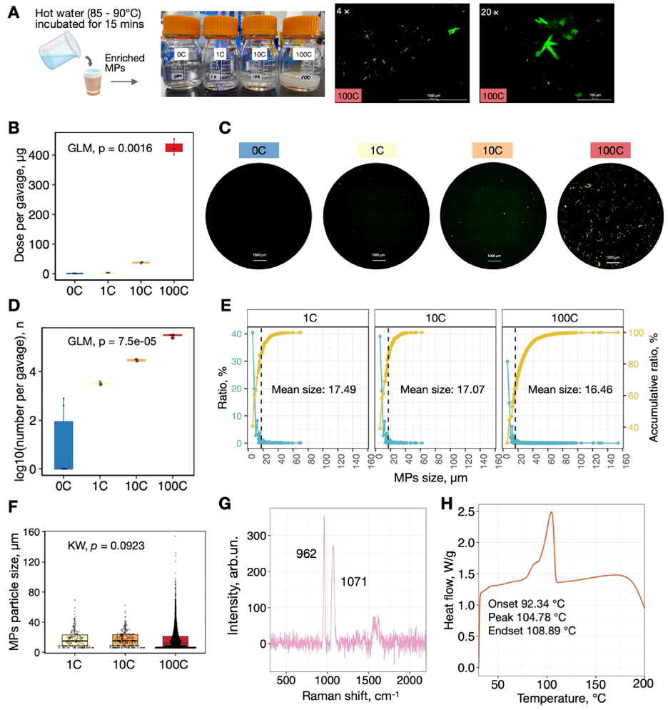
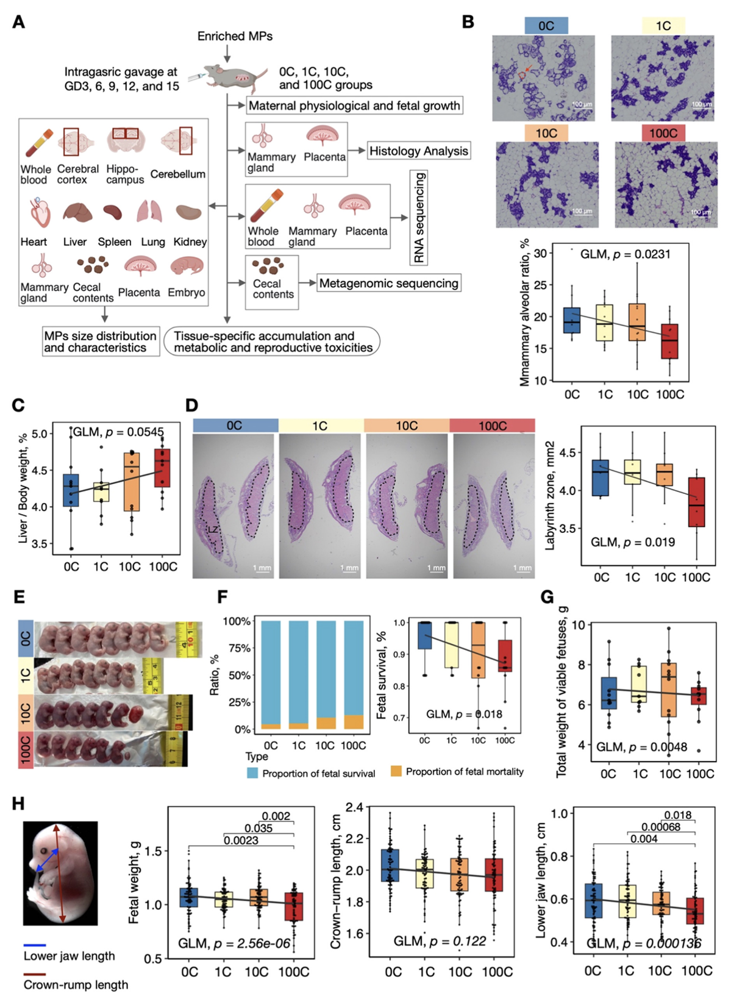
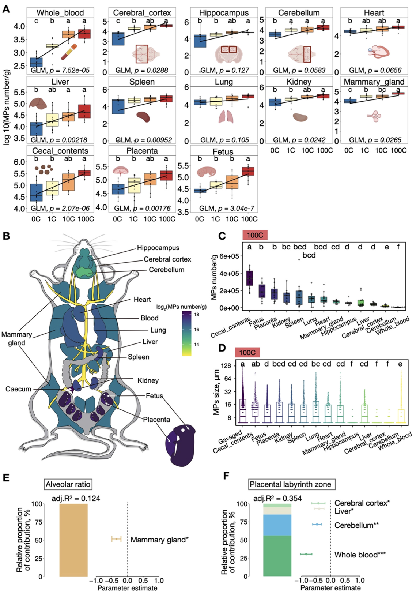
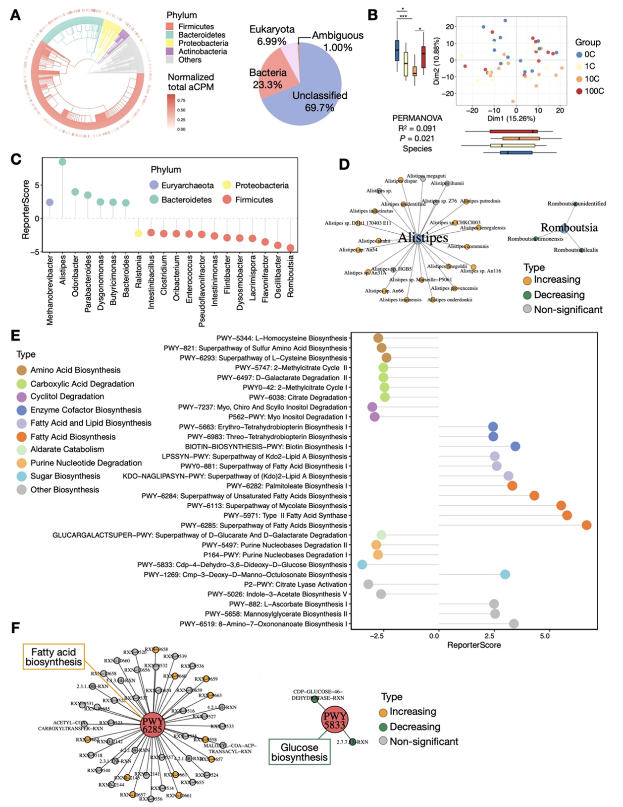
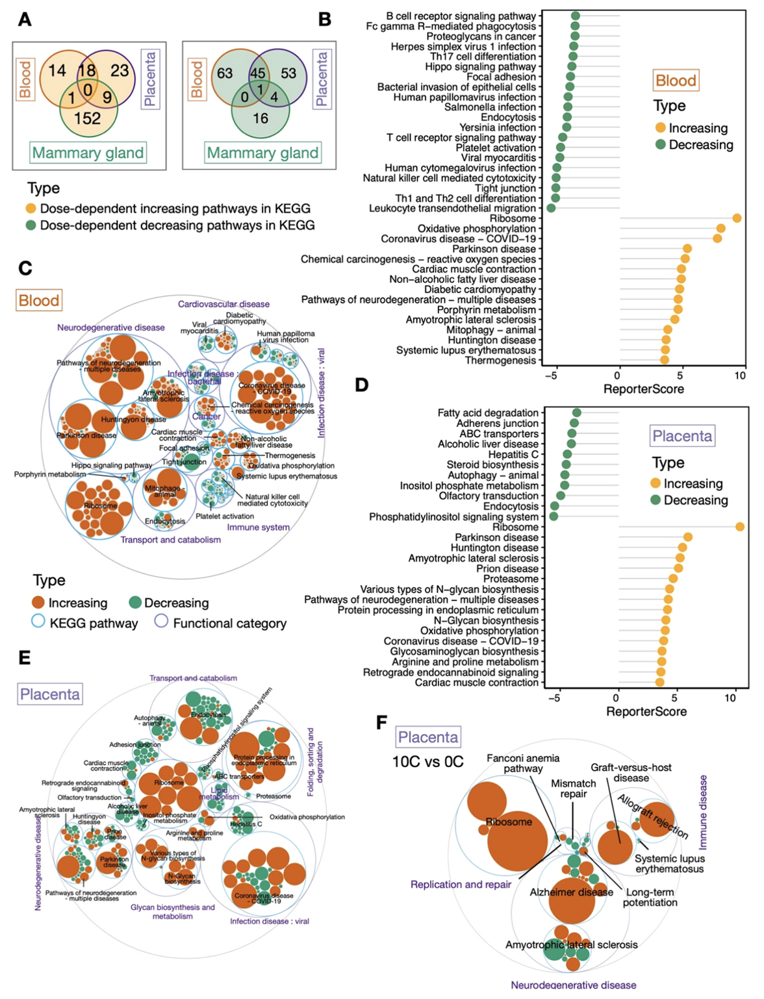
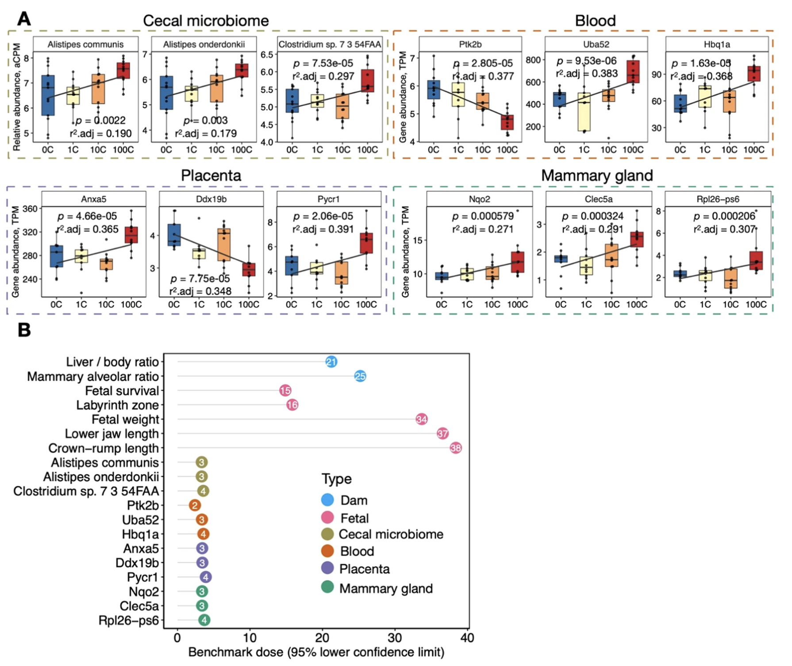

CQ师姐做的一个纸杯微塑料项目，非常有意思，揭示了日常生活中真实来源的孕期微塑料暴露，对生殖和代谢性能的影响和调控机制。我参与了其中的部分实验和分析，学习了养小鼠，灌胃，解剖和部分塑料的定性定量等实验，还画了一个小鼠解剖热图，收获颇丰。

## Paper Info

- 标题：Placental and fetal enrichment of microplastics from disposable paper cups: implications for metabolic and reproductive health during pregnancy
- 期刊：Journal of Hazardous Materials
- 发表时间：2024年8月15日
- 第一作者：陈琼
- 通讯作者：蒋超、陈琼
- 通讯单位：浙江大学生命科学研究院
- 链接：<https://doi.org/10.1016/j.jhazmat.2024.135527>

## 图片摘要

 
## 成果简介

近日，浙江大学生命科学研究院蒋超课题组在环境领域国际著名期刊Journal of Hazardous Materials上在线发表了题为"Placental and fetal enrichment of microplastics from disposable paper cups: implications for metabolic and reproductive health during pregnancy"的研究论文。该工作首次系统揭示了日常生活中真实来源的孕期微塑料暴露，对生殖和代谢性能的影响和调控机制。

## 引言

微塑料(Microplastics, MPs；直径小于5毫米)已成为一种无处不在的环境污染物。人体可通过饮食、呼吸和皮肤接触等多种途径摄入MPs，导致其在多个组织中沉积。尽管MPs的潜在健康风险日益受到关注，但目前的研究仍存在诸多局限性，如仅关注合成的单一大小和性质的MPs，特别是在妊娠期间的影响尚未得到系统研究。

## 图文导读

### DPCs 中浓缩 MPs 的质量、尺寸分布和特征
 

> 图1. DPCs释放的MPs的特征:质量、粒径分布和性质。(A) MPs灌胃溶液。(B) 每次灌胃的MPs质量。(C) MPs代表性荧光复合图像。每个孔的图像由28张使用蒙太奇功能拍摄的图像组成。(D) 每次灌胃的MPs数量。(E) MPs粒径频率分布(蓝色)和累积分布(黄色)。垂直虚线表示平均粒径。(F) MPs粒径分布。(G) MPs的拉曼光谱分析图谱。(H) 从DPCs分离的内层塑料薄膜的热稳定性曲线。

研究团队对五个知名品牌的DPCs进行了筛选,选择了一个释放MPs最多且颗粒最小的品牌进行深入研究。模拟人类日常DPCs使用水平,用热水冲泡纸杯并浓缩富集其中释放的MPs。值得注意的是,即使在最高剂量组中,MPs的质量仍在估计的人体暴露范围内,且相关物质(如重金属、阴离子和双酚A)的浓度均低于世界卫生组织(WHO)和美国环境保护署(USEPA)设定的安全阈值。研究团队创新性地使用BioTek Cytation 3技术对MPs进行了颗粒分布分析,结果显示各组MPs的粒径分布在6至154微米之间,且不同剂量组间的颗粒大小无显著差异。通过拉曼光谱和热稳定性分析,研究团队进一步确认这些MPs主要由聚苯乙烯组成。

### MPs 暴露导致母体生理变化和胎儿生长受限

> 图2. 孕鼠MPs暴露的实验设计及其对母鼠和胎儿的影响。(A) 总体实验设计。GD：妊娠天数。(B) 乳腺HE染色及腺泡占比的定量分析。每组中的N值分别为13（0 C）、11（1 C）、12（10 C）和11（100 C）。(C) 肝脏重量与体重比率。(D) 胎盘HE染色及迷宫区域的定量分析。(E) 胎鼠代表性图像。(F) 胎儿存活率。(G) 每窝胎儿的总重量。(H) 使用不同指标评估胎儿生长情况。

研究团队模拟人类日常DPCs消费水平(相当于每天0、0.33、3.33和33.3个DPCs),以剂量梯度口服灌胃的方式处理孕鼠,分析其对生殖系统的潜在毒性影响。实验结果显示,MPs暴露导致母鼠乳腺腺泡发育受损,表现为腺泡占比降低。同时,肝脏与体重的比率呈现剂量相关增加的趋势,暗示可能出现肝肥大。在胎儿方面,MPs暴露导致胎盘迷宫区面积减小,可能影响胎盘功能。此外,胎儿存活率降低,活产胎儿的总重量减轻,个体生长指标也受到影响。研究指出,MPs暴露可能通过影响母体生理状态,如诱发肝肥大,进而间接影响胎儿的发育和生长。值得注意的是,这些影响呈现出明显的剂量依赖性,即暴露剂量越高,影响越显著。这项研究揭示了MPs暴露对孕期健康的潜在风险,为理解环境污染物对生殖健康的影响提供了重要依据。

### 胎儿-母体组织中 MPs 的组织特异性粒径分布与受损表型相关

> 图3. 胎儿-母体组织中 MPs 组织特异性粒径分布与受损表型相关。(A) 不同组织中MPs的归一化数量。(B) MPs累积在小鼠解剖图示意图；彩色渐变表示不同组织中MPs的密度变化。(C) 100 C组中不同类型组织中积累的MPs。(D) 100 C组中MPs的大小分布。(E和F) 组织沉积的MPs对乳腺腺泡比例(E)和胎盘迷宫区域(F)的贡献比例。

研究团队分析了孕鼠12种不同组织和胎鼠中MPs的粒径分布及其对受损表型的贡献。结果显示，除海马和肺部外，MPs在各组织中的沉积量与暴露剂量呈明显的剂量-响应关系。血液中MPs含量最低，表明MPs可能被其他组织吸收。在最高剂量组(100 C)中，盲肠内容物中MPs数量最高，达356,769 ± 101,087个/克。胎儿(190,436 ± 99,103个/克)、胎盘(171,573 ± 92,071个/克)、肾脏、脾脏、肺和心脏也显示出显著的MPs沉积。

不同生物组织中MPs的大小存在显著差异，在100 C组中，55.16%到90.73%的MPs粒径小于10微米。值得注意的是，研究发现胎儿和胎盘中的MPs数量和粒径分布没有显著差异，表明胎盘对MPs并没有明显的过滤作用，MPs可以直接通过胎盘进入胎儿体内。大脑组织中检测到的MPs最小，可能与血脑屏障有关。拉曼光谱分析确认了这些颗粒与摄入的MPs相似。

多元回归模型表明，各组织中积累的MPs可解释12.4%～35.4%的受损表型。例如，乳腺组织中的MPs沉积对乳腺腺泡比例的降低贡献了12.4%的解释度。血液、小脑、肝脏和大脑皮层中的MPs共同解释了35.4%的胎盘迷宫区变化，其中血液中的MPs贡献最大。这些发现揭示了MPs在体内的组织特异性分布可能对多个器官系统产生影响，特别是对胎儿发育构成潜在风险。

### MPs 暴露引起的微生物组功能紊乱

> 图4. 微生物组成与功能变化的分析。(A) 微生物多样性呈现，外环表示每个物种的丰度。饼图详细展示了微生物群体的总体相对丰度。(B) 物种水平上的PCoA分析，箱线图显示显著性 (C) 棒棒糖图展示暴露剂量依赖性显著富集的属。(D) 网络图表明Alistipes属（随MPs暴露增加；橙色）和Romboutsia属（随MPs暴露减少；绿色）的丰度变化。(E) 棒棒糖图展示不同功能类别中显著富集的代谢途径。(F) PWY6285（脂肪酸生物合成；随MPs暴露增加）和PWY5833（葡萄糖生物合成；随MPs暴露减少）的网络图。

研究团队对各组盲肠内容物进行了宏基因组测序分析，探讨MPs暴露对肠道微生物组的影响及其潜在作用机制。结果显示，不同暴露组在Bray-Curtis距离的主坐标分析(PCoA)中表现出明显分离，尤其是10 C组（相当于每天3.3杯）最为显著。使用课题组前期开发的广义报告得分分析（GRSA）方法，观察到盲肠微生物组从厚壁菌门向拟杆菌门的剂量相关转变。Alistipes属（与炎症和癌症相关）随MPs暴露增加，而Romboutsia属（与肠道稳态相关）则减少。在代谢功能方面，微生物脂肪酸的生物合成途径显著增强，而碳水化合物、氨基酸和核苷酸的代谢途径则下降。

值得注意的是，中等剂量暴露水平（10C组）的微生物组成发生了显著变化，特别是厚壁菌门中参与代谢和免疫调节的属。这包括Parabacteroides、Oscillibacter和Dysosmobacter的增加，以及Turicibacter和Ligilactobacillus的减少。在功能通路方面，10 C组中脂肪酸合成途径显著上调，而氨基酸、核苷酸和能量代谢的生物合成途径则显著下调。特别是腺苷和鸟苷脱氧核糖核苷酸从头生物合成途径的显著下降，表明蛋白质和DNA核苷酸合成系统性下降。这些发现表明，即使是适度使用一次性纸杯，也可能导致肠道微生物组成和功能的显著变化，进而影响宿主的代谢和免疫功能。

### MPs 暴露导致组织特异性转录组畸变，具有潜在的健康影响

>图5. 血液、胎盘和乳腺组织的转录组功能变化的分析。(A) 各组织显著变化的KEGG通路Venn图。(B) 血液中显著变化的KEGG通路。(C) 血液基因-功能整合Maptree，展示功能类别、KEGG通路和基因对应关系。(D) 胎盘中显著变化的KEGG通路 (E) 胎盘基因-功能整合Maptree。(F) 10C组与0C组对比的胎盘基因-功能整合Maptree。

由于MPs在体内呈现组织特异性分布，研究人员推测这可能会导致组织特异性的基因表达改变。为探究MPs暴露对母鼠、胎儿和后代潜在的影响，研究团队对母鼠全血、乳腺组织和胎盘开展了转录组分析。

分析结果显示，在母体血液样本中，多个通路呈现剂量依赖性增加，包括神经退行性疾病、病毒感染、核糖体功能、非酒精性脂肪肝、心肌收缩、氧化磷酸化和氧化应激等途径。与此同时，免疫和炎症相关途径则随剂量依赖性降低。胎盘组织中观察到许多与血液相似的功能变化，如上调的神经退行性疾病、病毒感染、核糖体功能和氧化磷酸化等通路。同时，研究也发现了一些胎盘特异性的变化，如N-糖基化合成的上调，这可能与生殖并发症有关，包括先兆子痫、宫内生长受限和流产风险增加。在乳腺组织中，研究团队观察到感染和免疫相关途径上调，而代谢和能量产生相关途径下调。

值得注意的是，在中等暴露水平（10C组，相当于每天3.3杯）下，各组织均出现了显著的基因表达改变。特别是在胎盘中，复制和修复相关通路下调，而移植排斥和宿主抗移植物病相关通路上调，这可能暗示着流产风险的增加。这些发现揭示了MPs暴露可能通过影响多个组织的基因表达，对母体和胎儿健康产生广泛的影响。即使是适度的暴露水平也可能引起显著的分子水平变化，这强调了进一步研究MPs长期暴露对健康影响的必要性。

### 基因基准剂量模型分析表明怀孕小鼠每日安全剂量为2-4 DPCs

> 图6. 来源于DPCs的MPs暴露BMDL评估。(A) 盲肠微生物、血液、胎盘和乳腺组织的分子标志物。(B) 使用组织特异性生物标志物评估BMDL。

在毒理学和健康风险评估的背景下，建立关于DPCs的安全暴露阈值具有重要的实际生活指导意义。为此，研究团队结合MPs暴露后显著改变的表型数据和组织特异性生物标志物，计算了基准剂量下限（BMDL）。

研究结果显示，尽管生理终点通常具有较高的安全限制（范围在每日15至38杯之间），但盲肠微生物组和基因标志物则指示出更低的安全限制，即每日2至4杯。这一发现突显了将分子水平终点纳入BMDL评估的重要性和敏感性。具体而言，研究发现多个组织特异性基因与炎症、神经退行性疾病和胎儿发育相关，这些基因对MPs暴露呈现剂量响应。例如，盲肠中Alistipes onderdonkii和Alistipes communis的增加与炎症和癌症风险相关。在血液、胎盘和乳腺组织中，Ptk2b、Uba52、Hbq1a、Anxa5、Ddx19b、Pycr1、Nqo2、Clec5a和Rpl26-ps6等基因标志物的变化表明，MPs暴露可能导致神经活动受损、DNA损伤修复能力下降、胎盘稳态受损以及氧化损伤和炎症增加等风险。

## 小结

本研究首次系统揭示了在被普遍认为无害的DPCs消费水平下，MPs在孕鼠体内的组织特异性积累以及对代谢和生殖的毒性影响。研究发现除盲肠外，胎盘和幼鼠是微塑料富集最高的器官组织，且两者之间微塑料的含量和大小分布相差无几，提示胎盘在富集微塑料的同时，并没有明显的过滤作用，无法保护幼鼠免于微塑料暴露损伤。研究还发现，即使是每天3.3杯的适度消耗量，也可能对健康产生显著影响。这一发现尤为重要，因为这个消耗量不仅在一般人群的日常使用范围内，也在BMD评估的安全边际范围内。

研究结果表明，MPs暴露可能对胎儿发育、盲肠微生物群、免疫健康、神经系统、代谢和生殖功能产生不利影响。这些发现可能具有广泛的人类健康意义，特别是对孕妇等高风险人群。这项研究强调了需要进一步评估和应对这些潜在健康危害的重要性。研究结果呼吁制定相应的食品安全法规，特别是针对孕妇等高风险人群。同时，这项研究也为未来探索环境污染物对人类健康长期影响的研究提供了重要的参考框架。

陈琼博士为论文的第一作者，蒋超研究员、陈琼博士为论文的共同通讯作者。参与该研究的还有蒋超实验室的博士生彭晨、谢儒雯、魏昕，本科生徐浩腾、古丽米热·依力汗、沈跃然，西湖大学博士生苏卓杰，以及叶存奇研究员和其博士生杨森。研究课题受中国博士后科学基金和浙江大学生命科学研究院启动资金等项目资助。

## 作者简介

通讯作者：蒋超，现任浙江大学生命科学研究院研究员、博导，兼聘浙江大学附属第一医院。长期致力于环境空气暴露组、微生物组、微生物进化、精准医学研究以及相关的分子实验和生信分析方法开发及应用。以通讯或一作在国际知名期刊Cell、Nature、Nature Protocols、Cell Reports、iMeta、ES&T、Journal of Hazardous Materials、Briefings in Bioinformatics、Cell Discovery、mSystems、STOTEN等杂志发表多篇研究论文，获得国内外专利若干。主持国自然专项等项目。任iMeta、iMetaomics、Scientific Reports、Current Microbiology、Bio-protocols副主编、The Innovation Life编委。

第一作者兼共同通讯作者：陈琼，博士后，2019年博士毕业于浙江大学，研究方向为沙漠生态修复、微塑料暴露、环境空气暴露组、精准医学以及软件开发等。已在国际知名期刊Cell Discovery、Journal of Hazardous Materials、Nutrients、The Journal of Nutrition、Journal of Agricultural and Food Chemistry、Briefings in Bioinformatics等杂志发表多篇研究论文。长期担任Environmental Health Perspective、Current Microbiology、Journal of Food Science、Journal of Health and Pollution等杂志审稿人。
