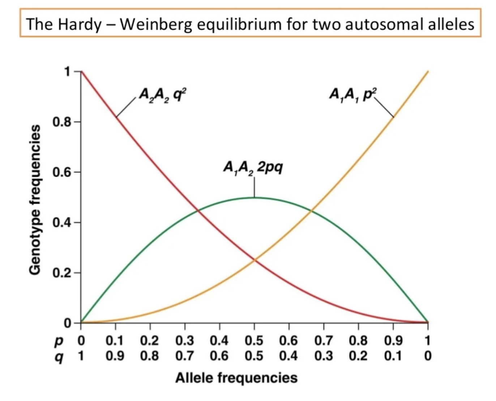

## Introduction

群体遗传学（Population Genetics）是研究在群体水平上基因频率的变化及其影响因素的学科。它结合了遗传学、进化生物学和统计学的方法来分析基因在群体中的分布和变化。

**群体**（Population）指的是一组同一物种的个体，它们生活在同一地理区域内，并能够相互交配和繁殖。这个群体的个体共享一个共同的基因库（gene pool），即所有个体的基因及其等位基因的集合。

**群体**有几个特征：

1.  **物种一致性**：群体中的所有个体属于同一个物种，意味着它们在生物学上能够相互交配并产生具有生殖能力的后代。

2.  **地理相对性**：群体通常指在特定地理区域内的个体集合，虽然不同群体之间可能会有基因交流（如迁移），但通常被认为是相对隔离的。

3.  **基因库**：群体内的个体共享一个基因库，这意味着在群体内部进行的所有交配，都会影响该群体的基因频率和遗传结构。

4.  **交配能力**：群体中的个体能够进行随机或非随机的交配，产生后代，从而使得群体的基因频率在世代之间发生变化。

在群体遗传学研究中，群体的概念是基础，因为研究的主要目标是理解在不同条件下（如自然选择、基因漂变、基因流动、突变等），一个群体的基因频率和基因型频率是如何变化的。

群体遗传学的研究帮助科学家理解进化过程、物种形成、群体间的遗传差异及其对环境变化的适应能力等。

## Concepts

以下是群体遗传学中一些相关概念的简要介绍：

1.  **Locus（基因座）**：指基因或DNA片段在染色体上的特定位置。基因座可以是一个特定基因的位置，也可以是任意DNA序列的位置。

2.  **Variation/Mutation（变异/突变）**：指基因或DNA序列中发生的变化。突变是引起变异的过程，是基因组中遗传信息的永久性改变。

3.  **Indel（插入/缺失）**：指DNA序列中发生的短片段插入或缺失变异。Indel可导致基因功能的变化，尤其是在编码区发生时。

4.  **SNP（单核苷酸多态性）**：指基因组中单个核苷酸的位置上的变异，是一种常见的遗传变异形式。

5.  **Alleles（等位基因）**：指位于同一基因座的不同版本或变体。一个基因座可以有多个等位基因。

6.  **SV（结构变异，Structural Variation）**：指基因组中涉及大片段DNA的变异，通常定义为长度大于50个碱基对的变异。SV包括多种类型的变异，如：

    -   **缺失（Deletion）**：基因组中一段DNA片段的丢失。
    -   **重复（Duplication）**：一段DNA片段的重复。
    -   **倒位（Inversion）**：一段DNA片段在基因组中的方向发生了反转。
    -   **易位（Translocation）**：一段DNA片段从一个位置移动到另一个位置。
    -   **插入（Insertion）**：一段新的DNA片段插入到基因组中。

7.  **CNV（拷贝数变异，Copy Number Variation）**：属于结构变异的一种，指基因组中某段DNA序列的拷贝数发生了变化，导致这段序列的拷贝数多于或少于通常的两个拷贝。CNV可以包括：

    -   **基因扩增（Gene Amplification）**：某段DNA的拷贝数增加。
    -   **基因缺失（Gene Deletion）**：某段DNA的拷贝数减少。

8.  **Haplotypes（单倍型）**：指一组位于同一染色体上的紧密连锁的基因或遗传标记的组合，通常作为一个整体进行遗传。

9.  **Selection（选择）**：自然选择的过程，通过优先传递适应环境的基因，影响群体中基因频率的变化。

    -   **Positive selection（正选择）**：有利于有益突变的传播和保持。
    -   **Negative selection（负选择）**：排除有害突变，维持群体基因组的稳定性。

10. **Genetic drift（基因漂变）**：群体中的等位基因频率由于随机抽样效应而发生的变化，尤其在小群体中更为显著。

11. **核苷酸多样性 (π)** ：测量群体中任意两个个体的基因序列之间平均差异的程度。反映了群体的遗传多样性。

12. **非同义突变率与同义突变率的比值 (dN/dS)** ： 非同义突变率（dN）是引起氨基酸序列变化的突变率，同义突变率（dS）是不引起氨基酸序列变化的突变率。dN/dS比值用于判断是否存在选择压力。

    -   dN/dS = 1：指非同义替代和同义替代发生的概率相等，通常表示该基因区域处于中性进化状态，即没有选择压力，仅靠随机突变率演化。
    -   dN/dS \< 1：指非同义替代的发生率低于同义替代，通常表示负选择（或净化选择，purifying selection）。在这种情况下，非同义突变可能对生物体不利或有害，因此被自然选择淘汰。
    -   dN/dS \> 1：指非同义替代的发生率高于同义替代，通常表示正选择（positive selection）。在这种情况下，非同义突变可能带来有利的适应性优势，因此被自然选择保留下来。

13. **LD（连锁不平衡，Linkage Disequilibrium）**：指在一个群体中，两个或多个位点上的等位基因频率之间存在统计学上的非随机关联。换句话说，在一个群体中，某些等位基因组合比随机预期的频率出现得更多或更少。
  
    -   **完全连锁平衡（LD = 0）**：两个等位基因之间的组合是随机的，意味着它们独立遗传。
    -   **完全连锁不平衡（LD = 1）**：两个等位基因总是一起遗传，意味着它们之间存在强烈的关联。

14. **Tajima's D**：是一个统计量，用于检测群体中核苷酸多样性和序列分化的异常，进而判断是否存在自然选择或其他进化力（如人口扩张、收缩等）。

    -   **Tajima's D = 0**：表示核苷酸多样性和序列分化之间的一致性，通常意味着该群体处于中性进化状态，即没有自然选择作用。
    -   **Tajima's D \> 0**：表示观测到的核苷酸多样性较高，序列间的差异较少，可能表明存在**平衡选择**或**群体结构**（如两个或多个亚群体的混合）。
    -   **Tajima's D \< 0**：表示观测到的核苷酸多样性较低，序列间的差异较大，可能表明存在**正选择**（有利突变的快速扩散）或**人口扩张**。

15. **D'（D-系数）**：衡量两个遗传位点间连锁不平衡（LD）程度的指标，取值范围从0到1。D' = 1 表示完全连锁，D' = 0 表示无连锁。

16. **重组率 (1-D')** ： 重组率用于衡量两个位点之间的重组频率。1-D'表示在连锁不平衡（LD）中，反映了重组事件的相对频率。

17. **Divergence（分歧）**：描述不同种群或物种之间的基因差异程度，反映了进化过程中累积的遗传变化。

18. **Molecular clock（分子钟）**：假设特定DNA序列的突变速率恒定，用于估计不同物种或种群间分歧时间的工具。

19. **Founder effect（奠基者效应）**：小群体从大群体中分离出来形成新的群体时，因最初几个创始者的基因组成差异而导致的新群体基因频率变化。

20. **Bottleneck effect（瓶颈效应）**：指群体经历了急剧的数量减少后，存活个体的基因组成对整个群体基因频率产生显著影响，通常伴随遗传多样性的减少。

### Hardy-Weinberg定律



**Hardy-Weinberg定律**（Hardy-Weinberg Law），又称为哈迪-温伯格平衡定律，是群体遗传学中的一个基本原则。它描述了在一个理想的随机交配的群体中，等位基因和基因型的频率在世代之间保持恒定的状态。这一定律是由英国数学家G.H. Hardy和德国医生Wilhelm Weinberg在1908年独立提出的。

-   Hardy-Weinberg定律的条件

Hardy-Weinberg定律成立的前提条件是：

1.  **无突变**：没有新的等位基因通过突变加入到群体中。
2.  **无自然选择**：所有基因型的生存和繁殖成功率相等，没有选择压力。
3.  **无限大的群体**：群体的大小足够大，以至于基因频率的变化不受随机基因漂变的影响。
4.  **随机交配**：群体中的个体是随机交配的，没有任何形式的非随机交配（如近亲交配或择偶偏好）。
5.  **无基因流**：没有来自其他群体的基因引入，也没有个体迁出群体。

-   Hardy-Weinberg定律的数学表达

假设在一个二倍体群体中，一个基因座有两个等位基因：A和a。我们定义：

-   p：等位基因A的频率（取值范围为0到1）。
-   q：等位基因a的频率（取值范围为0到1）。

根据等位基因频率的定义，有$p + q = 1$。

根据Hardy-Weinberg定律，基因型频率（AA、Aa和aa）的平衡状态可以用等位基因频率来表示：

-   **AA的频率**：$p^2$
-   **Aa的频率**：$2pq$
-   **aa的频率**：$q^2$

这些频率之和也等于1：

\$ p\^2 + 2pq + q\^2 = 1 \$

-   Hardy-Weinberg平衡的应用

1.  **检测选择压力**：通过比较观测到的基因型频率和预期的Hardy-Weinberg平衡频率，可以检测是否存在自然选择或其他进化因素的作用。

2.  **估算等位基因频率**：利用基因型频率来估算等位基因频率，尤其在研究隐性遗传病的频率时。

3.  **基因库的稳定性**：在一定条件下，如果一个群体的基因库符合Hardy-Weinberg平衡，则可以认为该群体的基因库在无外部干扰情况下是稳定的。

-   实际应用中的偏离

在现实中，许多群体不完全符合Hardy-Weinberg平衡条件，可能因为：

-   **自然选择**：不同基因型具有不同的适应性。
-   **小群体效应**：基因漂变在小群体中更为显著。
-   **非随机交配**：如近亲交配或选择性交配。
-   **基因流**：来自其他群体的基因引入。

偏离Hardy-Weinberg平衡可以揭示关于群体演化过程的有价值的信息。

### VCF

VCF（Variant Call Format 是一种用于存储和描述基因组变异（如SNP、插入、缺失等）的文本文件格式。VCF文件广泛用于基因组学研究，尤其是在分析和存储从基因组测序数据中识别出的变异时。

VCF文件由**头部（Header）**和**数据区（Data section）**两部分组成。

1.  头部（Header）

头部部分以“`#`”开头，包含文件的元信息和描述变异的相关注释。常见的头部信息包括：

-   **文件格式版本**：例如，`##fileformat=VCFv4.2`。

-   **样本信息**：例如，`##SAMPLE=<ID=Sample1,Description="Sample description">`。

-   **参考基因组信息**：例如，`##reference=ftp://ftp.1000genomes.ebi.ac.uk/...`。

-   **信息字段的描述**：例如，`##INFO=<ID=DP,Number=1,Type=Integer,Description="Total Depth">`，描述变异的附加信息。

-   **格式字段的描述**：例如，`##FORMAT=<ID=GT,Number=1,Type=String,Description="Genotype">`，描述样本格式信息。

2.  数据区（Data section）

数据区包含实际的变异信息，每行表示一个变异。数据区以一行以“`#CHROM`”开头的字段名称作为标题行，常见的字段有：

-   **CHROM**：染色体号，表示变异所在的染色体。

-   **POS**：位置，表示变异在染色体上的位置（1-based）。

-   **ID**：变异的标识符（若无信息则为“`.`”）。

-   **REF**：参考碱基或参考序列，表示参考基因组中该位置的碱基。

-   **ALT**：替代碱基或替代序列，表示变异后的碱基或序列。

-   **QUAL**：变异的质量得分，通常为Phred质量分数。

-   **FILTER**：变异的过滤信息，描述该变异是否通过了特定的质量过滤标准（如“PASS”表示通过）。

-   **INFO**：附加信息字段，包含与变异相关的各类注释和统计信息。

-   **FORMAT**：样本格式字段，描述以下各列样本数据的格式。

-   **样本数据**：每个样本的变异信息，根据FORMAT字段中的描述显示具体数据，如基因型、覆盖度等。

-   例子

下面是一个简单的VCF文件示例：

```         
##fileformat=VCFv4.2
##source=Example
#CHROM  POS     ID        REF   ALT   QUAL  FILTER  INFO                  FORMAT     Sample1
1       123456  rs123456  G     A     50    PASS    DP=100;AF=0.5         GT:DP      0/1:35
1       789101  .         T     C,G   99    PASS    DP=200;AF=0.25,0.75   GT:DP:AD   1/2:60:10,20
```

在这个例子中：

-   第一个变异在1号染色体的123456位点，参考碱基是G，替代为A，质量得分50，通过了过滤，附加信息显示总深度（DP）为100，等位基因频率（AF）为0.5，样本1的基因型（GT）是0/1，覆盖度（DP）是35。

-   第二个变异在1号染色体的789101位点，参考碱基是T，替代为C和G（多等位基因变异），质量得分99，通过了过滤，附加信息显示总深度（DP）为200，等位基因频率（AF）分别为0.25和0.75，样本1的基因型（GT）是1/2，覆盖度（DP）是60，等位基因深度（AD）分别为10和20。

-   使用场景

VCF文件主要用于： - 基因组变异分析：存储和分析个体或群体的基因变异。 - 临床基因组学：用于个体的基因组测序数据分析，帮助检测可能的致病突变。 - 进化研究：比较不同物种或个体之间的基因组差异。 - 群体遗传学：研究群体中等位基因的分布和频率。

VCF格式标准化且易于扩展，适合存储大规模基因组数据，并支持丰富的注释信息，是基因组学研究中的重要工具。
