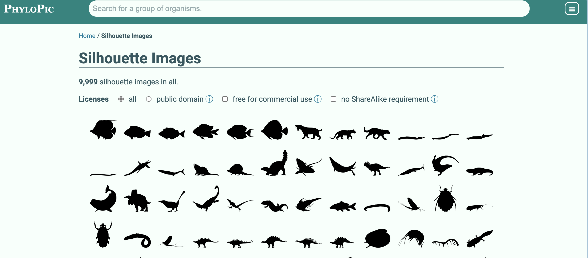

## Introduction

R语言是平时统计分析，科研绘图的利器，除了很多非常严肃标准的可视化外，还经常可以看到一些非常有趣的绘图R包，不得不佩服开发者们的创意。

这里介绍一些我认为比较有趣的绘图R包：

### ggCyberPunk

ggplot画图也可以赛伯朋克，哈哈哈，这个包提供了非常好看的一个主题，绘制的线和面都有朦胧发光感，再加上代码风格字体。

目前只能github安装：

```r
devtools::install_github("delabj/ggCyberPunk")
```

然后我们画一个折线图：

```r
library(tidyverse)
library(ggCyberPunk)

df = data.frame(A=c(1,4,4,6,7,5,1),
               B=c(4,3,5,7,5,6,7),
               Time=c(1,2,3,4,5,6,7)) %>%
pivot_longer(cols = c(A,B),names_to = "group", values_to = "count")

showtext::showtext_auto()
sysfonts::font_add("Aldrich", system.file("fonts", "Aldrich/Aldrich-Regular.ttf", package = "ggCyberPunk"))

df %>%
   ggplot(aes(x=Time, y = count, color = group, fill= group))+
     geom_glowing_area()+
     theme_cyberpunk()+
     scale_color_cyberpunk()+
  ggtitle("geom_glowing_line()", subtitle = "From ggCyberPunk")
```

}}index.en_files/figure-html/unnamed-chunk-2-1.png" width="672" />


### gggibbous

ggplot2的扩展包gggibbous提供了一个月亮的geom，月亮图可作为两组的饼图替代品。

```r
install.packages("gggibbous")
#或
devtools::install_github("mnbram/gggibbous")
```

使用的话，geom_moon和geome_point类似：

```r
library(gggibbous)
ggplot(data.frame(x = 1:5, y = 1, size = 2^(0:4)), aes(x, y, size = size)) +
  geom_moon() +
  geom_point(y = 2) +
  lims(x = c(0.5, 5.5), y = c(0.5, 2.5)) +
  scale_size(range = c(5, 10))
```

}}index.en_files/figure-html/unnamed-chunk-3-1.png" width="480" />

当然，它还多一些美学特征，比如`ratio` 控制要绘制的月亮的比例。它必须介于 0（实际未绘制任何内容的“新月”）和 1（“满月”，即圆形）之间:


```r
ggplot(data.frame(x = 1:5, y = 0, ratio = 0:4 * 0.25), aes(x = x, y = y)) +
  geom_moon(aes(ratio = ratio), size = 20, fill = "black") +
  geom_text(aes(y = y + 1, label = ratio)) +
  lims(x = c(0.5, 5.5), y = c(-1, 1.4)) +
  theme_void()
```

}}index.en_files/figure-html/unnamed-chunk-4-1.png" width="480" />

`right` 接受一个布尔值，控制月亮是“渐盈”还是“渐亏”，即它是从右侧还是从左侧“填充”。
用两种颜色制作“完整”月亮的一种方法是对一种颜色使用 right = TRUE，对另一种颜色使用 right = FALSE，并具有互补比例。 


```r
tidymoons <- data.frame(
  x = rep(1:3, 6),
  y = rep(rep(3:1, each = 3), 2),
  ratio = c(1:9 / 10, 9:1 / 10),
  right = rep(c(TRUE, FALSE), each = 9)
)

ggplot(tidymoons) +
  geom_moon(aes(x, y, ratio = ratio, right = right, fill = right)) +
  lims(x = c(0.5, 3.5), y = c(0.5, 3.5))
```

}}index.en_files/figure-html/unnamed-chunk-5-1.png" width="672" />


我们用moon形状绘制到地图上，展示二分组的一个情况：


```r
dmeladh_adj <- dmeladh
dmeladh_adj$long <- dmeladh$Longitude + c(
  -2, 0, -2, 2, -3, 3, 3, 2, 3, 4, -2.5, -2.5, -1, -2, -2.5, -4, 2.5,
  5, 6, 7, 2, -7, -5.5, -3, 0, -7, -2, 3, 5.5, 0.5, -1, -1.5, -3, 2)
dmeladh_adj$lat <- dmeladh$Latitude + c(
  -2, 2, 0, 1, 0, 0, 0, 2, 0.5, -1, 1, -1.5, 2, 4, 1.5, 0, 2,
  1, -1, -3, -2, 1, -1, -2, -3, -2, -4, -3, -1, 1.5, 2, 2, -2, 0)

moonmap <- ggplot(dmeladh_adj, aes(long, lat)) +
  geom_polygon(
    data = map_data(
      "world", region = "(Australia)|(Indonesia)|(Papua New Guinea)"),
    aes(group = group),
    fill = "gray80"
  ) +
  geom_segment(aes(xend = Longitude, yend = Latitude), color = "gray20") +
  geom_point(aes(Longitude, Latitude), size = 0.75, color = "gray20") +
  scale_size(range = c(4, 10)) +
  coord_map(xlim = c(110, 160), ylim = c(-45, -5)) +
  theme_void() +
  theme(
    legend.position = c(0.05, 0.05),
    legend.direction = "horizontal",
    legend.justification = c(0, 0)
  )

moonmap +
  geom_moon(
    aes(ratio = AdhS / 100, size = N),
    right = FALSE, fill = "gold", color = "gold",
    key_glyph = draw_key_moon_left
  ) +
  geom_moon(
    aes(ratio = AdhF / 100, size = N),
    fill = "forestgreen", color = "forestgreen"
  )
```

}}index.en_files/figure-html/unnamed-chunk-6-1.png" width="672" />

### ggbrick

ggbrick提供了一个有趣的geom_brick，用来绘制砖墙或者华夫饼图：

```r
install.packages("ggbrick")
#或
devtools::install_github("doehm/ggbrick")
```

先画一个普通的柱形图：


```r
library(ggbrick)
showtext::showtext_auto()
df=data.frame(x=factor(strsplit("努力搬砖","")[[1]],strsplit("努力搬砖","")[[1]]),y=10*1:4)
ggplot(df) +
  geom_brick0(aes(x, y), fill = "#BF8285", bricks_per_layer = 2)+
  theme_void()+
  theme(axis.text.x = element_text(size = 20,face = "bold"))
```

}}index.en_files/figure-html/unnamed-chunk-7-1.png" width="672" />

也可以用来画堆积柱形图：


```r
# basic usage
mpg |>
  count(class, drv) |>
  ggplot() +
  geom_brick0(aes(class, n, fill = drv), bricks_per_layer = 2)+
  scale_fill_manual(values = c("#BF8285", "#85BF82","grey"))
```

}}index.en_files/figure-html/unnamed-chunk-8-1.png" width="672" />

### rphylopic

rphylopic 包的目的是允许用户将生物体的轮廓添加到基础 R 和 ggplot2 中生成的绘图中。为此，它使用了 [PhyloPic](https://www.phylopic.org/) 网站提供的剪影。

```r
install.packages("rphylopic")
#或
devtools::install_github("palaeoverse/rphylopic")
```

[PhyloPic](https://www.phylopic.org/) 网站有非常多种类的动物剪影：


`rphylopic`包可以查找物种学名，然后下载相应的剪影：


```r
library(rphylopic)
#获取一个物种的单一图像uuid
uuid <- get_uuid(name = "Canis lupus", n = 1)
# 获取该uuid的图像
img <- get_phylopic(uuid = uuid)
# 但每个物种可能存在多个轮廓。
uuid <- get_uuid(name = "Canis lupus", n = 5)

#我该怎么选？！
#如果不看到图像本身很难，让我们使用：
img <- pick_phylopic(name = "Canis lupus", n = 5)
```


使用add_phylopic和geom_phylopic可以将剪影轮廓用于ggplot2：


```r
library(rphylopic)
# Get image
uuid <- get_uuid(name = "Iris", n = 1)
img <- get_phylopic(uuid = uuid)
#在图后面画一个剪影
ggplot(iris) +
  add_phylopic(x = 6.1, y = 3.2, img = img, alpha = 0.2) +
  geom_point(aes(x = Sepal.Length, y = Sepal.Width))
```

}}index.en_files/figure-html/unnamed-chunk-10-1.png" width="672" />

```r
  
#将轮廓绘制为点
ggplot(iris) + 
  geom_phylopic(aes(x = Sepal.Length, y = Sepal.Width), img = img,
                color = "purple", height = 0.25)
```

}}index.en_files/figure-html/unnamed-chunk-10-2.png" width="672" />

如果你有更多有趣的R包推荐，欢迎在评论区留言。
