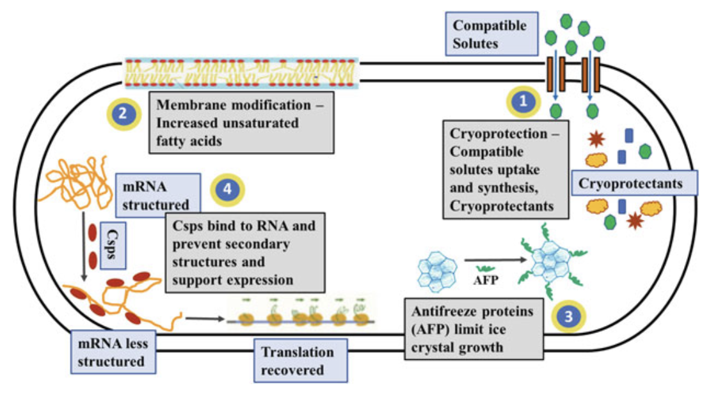
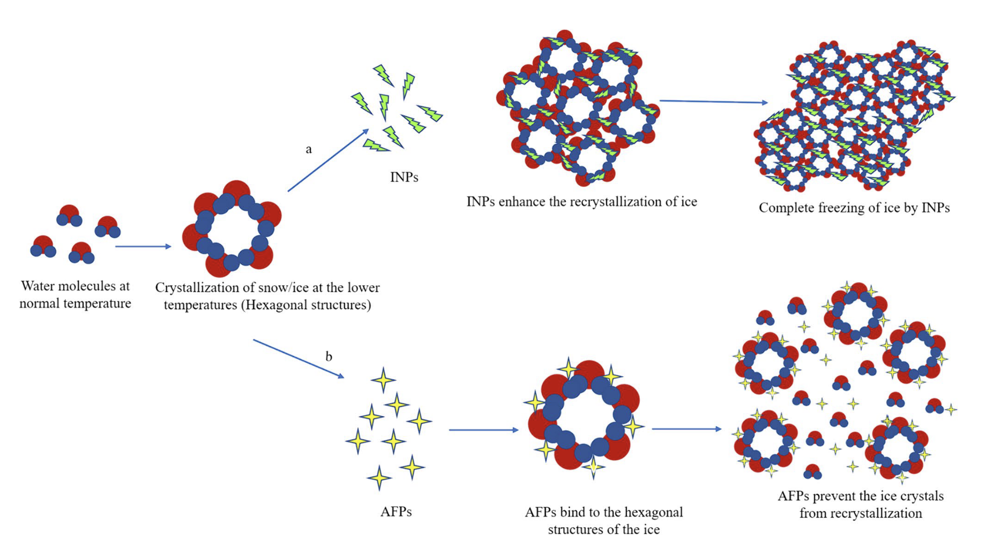
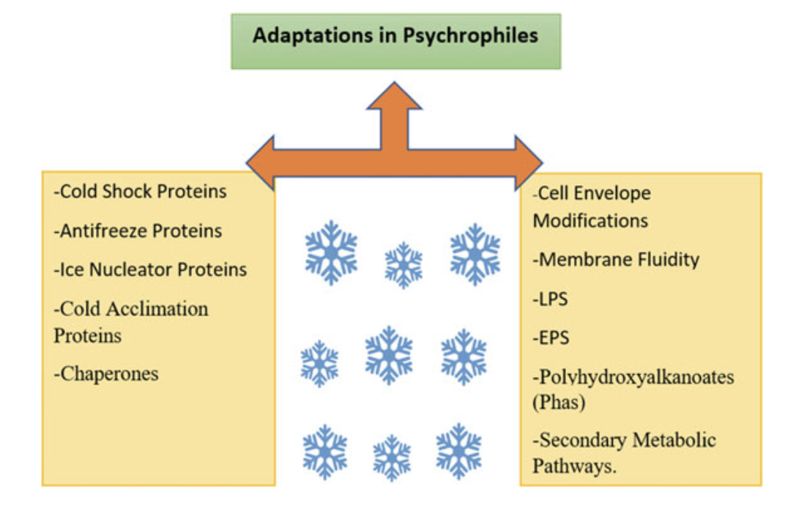

## Introduction

整个太阳系的绝大多数区域，包括地球环境，都以极端温度为特征。值得注意的是，地球生物圈约 80% 的区域周期性或永久寒冷，温度低于 5°C。因此可以认为低温地区是地球上主要的“极端”环境。
这些环境已被称为嗜冷生物或冷适应生物的多种生物成功定殖，主要包括细菌、古菌、酵母菌、蓝藻和原生生物等微生物。嗜冷微生物通过一系列结构和功能适应，克服低温带来的生存限制，使其能够在这种特殊环境中繁衍生息。

自1887年首次发现冷栖生物以来，研究者通过生理学、微生物学和分子生物学等方法研究了它们的适应性、生物地理分布及生态角色。近年来，基因组学、转录组学、蛋白质组学和宏基因组等“组学”技术进一步揭示了其独特的适应机制和关键功能，为冷生态系统的微生物群落结构和功能提供了更全面的视角。

低温环境不仅带来热能降低的问题，还伴随着溶剂粘度增加、氧气及活性氧物质溶解度增加、渗透压增强、冰冻、干燥等多重物理化学限制，同时这些环境通常还具有营养缺乏、高盐、氧化应激等压力。例如，深海和冰下环境的微生物还要承受高压，而高海拔和极地环境则会面临光照极端变化。因此，嗜冷微生物需要多种协同适应策略来应对复杂的环境压力。

嗜冷微生物的低温适应机制包括一系列生理和结构上的精妙适应，这些适应往往具有多功能性，可应对多种环境压力。每种微生物根据其特定需求和环境条件，采用不同的组合策略，而不是使用所有可能的适应工具（表1）。

| 生物产物                | 提出的冷适应功能                                                                                                 |
|-------------------------|---------------------------------------------------------------------------------------------------------------|
| 膜脂肪酸：不饱和脂肪酸，长链多不饱和脂肪酸 (LC-PUFA) | 不饱和脂肪酸：维持膜流动性；长链多不饱和脂肪酸 (LC-PUFA)：维持膜流动性？                     |
| 膜色素：类胡萝卜素       | 维持膜流动性？抗冻保护？                                                                                     |
| 兼容溶质               | 渗透保护：抵御冰冻引起的渗透应激；干燥保护：抵御冰冻引起的干燥；降低冰点；降低胶态玻璃转变温度；稳定蛋白质和膜 |
| 抗冻蛋白               | 冰晶生长抑制（热滞后效应）；冰再结晶抑制；膜稳定性？冰附着？                                               |
| 促冰核蛋白             | 细胞外冰晶核化；防止/减少损害性细胞内冰形成；小冰晶形成？释放结晶潜热？                                    |
| 细胞外聚合物           | 冰晶生长抑制；渗透保护：抵御冰冻引起的渗透应激；干燥保护：抵御冰冻引起的干燥；冰再结晶抑制                 |
| 生物表面活性剂         | 冰再结晶抑制？渗透保护？                                                                                     |
| 冷适应酶               | 维持适当的代谢通量                                                                                           |
| 分子伴侣蛋白           | 促进蛋白质折叠和稳定性；解构RNA/DNA二级结构                                                                  |
| 储存化合物：聚羟基烷酸酯，青藻素 | 克服碳和氮吸收缺陷                                                                                      |

## 细胞被膜

细胞膜及其各种组件发挥着提供形状、支撑和保护以及调节物质进出细胞的运动的关键功能。它保护细胞免受周围环境的影响并抵抗膨胀压力；作为半透膜发挥营养吸收、产物输出和溶质运输的作用；并参与细胞分裂、传感、信号传导和粘附。低温会对细胞膜的特性和功能产生不利影响，导致膜流动性、渗透性和扩散率降低，此外还会降低嵌入蛋白质的流动性和功能，增加膨胀压力，甚至因冰形成和/或冻结而导致物理细胞破裂。虽然细胞膜的冷适应特征早已为人所知，但其他包膜成分、外膜、肽聚糖层甚至外部细胞涂层的适应策略现在也开始被了解。

### 细胞膜

冷适应微生物通过“膜黏度调节”机制，通过改变脂肪酸组成来适应低温。具体来说，它们会增加膜中不饱和脂肪酸、短链、支链或顺式异构脂肪酸的含量，从而降低膜的相变温度，维持膜的流动性和功能。这一策略反映在许多嗜冷微生物基因组中，通常富含脂肪酸合成、去饱和酶及其他参与膜生物合成的基因，帮助细胞在低温下维持正常功能。此外，某些嗜冷微生物上调膜运输蛋白的表达，补偿低温引起的扩散和运输速度下降。

关于长链多不饱和脂肪酸（LC-PUFAs），虽然它们有助于维持膜流动性，但其主要作用可能在于抗氧化保护。LC-PUFAs如EPA、DHA和ARA在冷水生物中含量较高，尤其在低温下生成更多，能够在膜表面形成疏水屏障，减少活性氧进入细胞。除了抗氧化，它们在膜蛋白的稳定、细胞分裂等方面也有潜在功能。

### 膜色素

色素，特别是类胡萝卜素，在调节细胞膜流动性方面也可能具有作用。嗜冷微生物常产生色素，如从冰芯、冰川、海洋表层水和高海拔土壤中分离的样本中均观察到了色素生成。研究发现，一些极地类胡萝卜素在低温下生成量增加，可能通过平衡不饱和脂肪酸的流动性作用来稳定膜。然而，一些研究发现低温下某些极地细菌的色素含量反而减少，说明色素作用可能因环境而异。

这些色素在低温适应中可能具有多种功能，包括光保护（与其他分子如苔藓氨基酸一起抵御强光和紫外线）、抗氧化（对抗低温环境中的活性氧）、光捕获（光合微生物）以及抗菌。同时，它们还可能作为冷冻保护剂，增强冻融循环的耐受性。由于这些多重功能，色素水平的变化在不同环境中可能有所不同，因此需要进一步研究其在冷适应微生物中的确切作用和机制。

### 细胞壁

相较于细胞膜，细胞壁其他成分的冷适应研究相对较少，但最近的一些研究揭示了可能的适应策略。对于细胞壁的适应性变化，一些嗜冷细菌在低温下显示出肽聚糖生物合成基因的上调以及肽聚糖层的增厚。这种增强的肽聚糖层可以形成更强的物理屏障，有助于保护嗜冷菌在冰晶形成、冻融循环或渗透压升高时不受损伤。例如，Planococcus halocryophilus Or1在外细胞表面展现出厚化的外层，这种特有的结构由肽聚糖、碳酸钙和胆碱的疏水性外壳组成，提供了额外的保护。

对于革兰氏阴性细菌的细胞壁外膜，冷适应特征主要表现为脂多糖（LPS）结构的变化。研究表明，许多嗜冷菌在低温下产生的LPS为粗糙型（即缺少特异性O链成分），且其链长较短。尽管仅有少数嗜冷菌的LPS结构已被分析，但这种LPS的变化可能有助于在低温下增加外膜的灵活性和稳定性。此外，与细胞膜相似，LPS中的脂质A成分表现出较高的短链和/或不饱和脂肪酸含量，增强了膜的流动性。而核心寡糖部分的高负电荷则有助于捕获冷环境中常见的二价阳离子。

与其他细胞包膜成分的研究一致，转录组分析显示，在低温下，LPS生物合成相关基因（主要是糖基转移酶）和外膜蛋白的基因表达上调。例如，突变某些核心LPS糖基转移酶基因会降低南极细菌在低温下的生长能力，这进一步证明了LPS结构在低温适应中的关键作用。

## 冷冻保护

零度以下的温度会导致结冰，从而导致冷冻损伤、渗透压、脱水甚至细胞破裂和死亡。在自然环境中，与细胞外部相比，细胞内部结冰的开始通常延迟，因为前者体积较小且密集且高度拥挤。当温度高速下降时，确实会发生细胞内冰晶的形成，这通常对细胞是致命的，但在自然环境中，冷却通常相对缓慢，因此冰的形成主要局限于细胞外空间（Fonseca et al. 2016） ）。细胞外冰的形成可导致物理破坏性膜破裂，其发生是在排除溶质并除去可用液态水的情况下发生的。这导致细胞外溶质浓度升高并引起细胞内/外渗透压失衡。反过来，这会导致与细胞内部渗透收缩和脱水相关的压力，不仅对细胞功能和存活产生负面影响，而且还会阻止细胞内冰的形成，并导致非晶态无定形（胶体玻璃态）状态，从而抑制细胞新陈代谢（Fonseca 等人，2016）。此外，在相对较高的零度以下温度下，在经历冻融循环的部分冷冻环境中以及在温度波动期间，细胞还可能受到有害的冰再结晶应力，这是一种热力学驱动的过程，导致冰晶聚结和大的、以较小的晶体为代价来致命地破坏冰晶（Bar Dolev 等人，2016b）。

### 兼容溶质

兼容溶质是低分子量、无毒的有机渗透调节物质，许多嗜冷微生物的基因组中包含大量的兼容溶质合成、摄取和降解基因，常见的兼容溶质包括甜菜碱、海藻糖、甘油、蔗糖、肌氨酸、甘露醇和山梨醇等。这些溶质在低温环境中可积累至摩尔浓度，有助于恢复渗透平衡，从而抵消冻融过程中因水分流失和细胞收缩带来的影响。此外，兼容溶质可以降低溶液的冰点，并显著降低细胞质的胶体玻璃转变温度（Tg），例如，在细菌细胞中添加甘油可将细胞质的Tg降低达30°C，同时提高解冻后的存活率。

除了渗透平衡的调节外，兼容溶质还可通过自由基清除作用，在低温下保护蛋白质和膜结构。它们能够避免蛋白质聚集，增强蛋白质折叠稳定性，可能是由于其对蛋白质表面的优先排斥作用或水分捕获效应，促进蛋白质的稳定和结构紧致。

### 冰结合蛋白：抗冻蛋白

抗冻蛋白（AFPs），也称为冰结构蛋白或热滞后蛋白，是一种具有非胶体特性的生物抗冻剂，能够结合冰晶并抑制冰的生长和再结晶。这类蛋白最早在南极鱼类的血液中发现，现已在多种细菌、真菌、硅藻、植物、昆虫和甲壳类动物中被发现。自然界中存在多种结构多样的AFPs，通常带有糖基化或脂质修饰，分子量从约2至50 kDa不等。例如，南极细菌Marinomonas primoryensis中存在一种多结构域的冰黏附蛋白，分子量高达1.5 MDa。AFPs通过不可逆地结合特定的冰晶面，阻止次级成核事件，导致冰晶形成独特的形态。由于Kelvin效应，AFPs的吸附导致冰晶表面局部弯曲，从而阻碍冰的进一步生长，形成热滞后（TH）效应，即冻结点低于融解平衡点，生成的热滞后区域内冰晶生长被抑制。

TH活动的温度范围从0.1°C到13°C不等，并且在加入其他AFPs、溶质和离子时可增强。AFPs还是有效的冰再结晶抑制剂（IRI），常以亚微摩尔浓度即能发挥比TH更强的效果。这种IRI作用通常是许多嗜冷微生物分泌AFPs的主要功能，例如南极藻类和冰川冰细菌中的AFPs能有效稳定盐水口袋，维持细胞周围的液态环境。此外，AFPs还可能通过其膜稳定和结构保护作用维持细胞膜的完整性，并可能帮助附着在冰面上，使细胞更好地接近光合区的氧气和营养物质。

### 冰结合蛋白：冰成核蛋白

冰成核蛋白（INPs）是一类大分子膜结合蛋白，能促进冰的形成。它们通过在接近零度以下的高温环境中引发异质性冰结晶，被认为通过提供模板来使水分子按冰状结构有序排列，从而稳定水分子（Lorv et al. 2014; Pandey et al. 2016; Pummer et al. 2015）。这种作用降低了冰形成的活化能，使冰可以在-2°C左右开始结晶（Li et al. 1997）。INPs由多种生物产生，通常以大的胞外重复多聚体形式存在，且更大的复合体表现出更高的成核活性（Bar Dolev et al. 2016a）。

在嗜冷微生物中，INPs被认为通过引导冰的成核至胞外空间来抵御低温损伤（Lorv et al. 2014），从而避免在细胞内形成具有潜在致命破坏力的冰晶。INPs还促进了胞外小冰晶的形成，相较于大冰晶对细胞的损害更小。此外，冰结晶过程中释放的潜热也有助于防止温度的进一步下降（Pummer et al. 2015）。除了在冷适应中的作用，INPs在一些植物病原体中也起到营养挖掘的作用，通过诱发植物的冻害破坏细胞，进而获取植物内部的养分。

### 细胞外聚合物

胞外聚合物物质（EPS）是一类多功能的高分子生物聚合物复合物，由各种生物体分泌到其局部环境中。EPS具有复杂多样的结构，主要由碳水化合物（均一或非均一多糖）构成，但也包含蛋白质和较少量的核酸、脂类、酚类和腐殖质。EPS由多种生物产生，可以附着在细胞表面，也可以释放到周围环境中，形成水合凝胶。这些凝胶在生物膜的形成以及细胞环境的物理、化学和生物特性调节中起着重要作用。它们具有多种功能，包括细胞黏附、养分吸收，还在渗透保护、活性氧清除、胞外蛋白保护及抗冻保护等方面发挥重要作用。有关详细综述，请参考Deming和Young (2017)及Ewert和Deming (2013)等文献。

在冷适应方面，宏基因组研究已在南极和北极冰架池中发现了大量EPS合成相关基因（Varin et al. 2012），且研究发现，冷适应细菌在低温甚至冰点以下会产生高浓度的EPS（Caruso et al. 2018; Feng et al. 2014; Marx et al. 2009; Mykytczuk et al. 2013）。EPS水合凝胶基质被认为通过在细胞周围形成保护性外壳以充当溶质扩散屏障，并物理阻止冰的形成，从而在低温下保护细胞（Caruso et al. 2018; Deming和Young 2017; Ewert和Deming 2013; Krembs et al. 2011）。这种扩散屏障限制了冰冻诱导的渗透压应激和干燥损伤。此外，EPS的凝胶状状态降低了冰成核的自由能，而溶质排斥至周围液相中则抑制了冰晶的生长，从而保护细胞免受冰损伤，并增加了可居住的液态空间。有趣的是，最近研究表明，冷适应生物产生的EPS具有类似抗冻蛋白（AFP）一样的冰结合功能和冰重结晶抑制（IRI）活性（Casillo et al. 2017a）。相比其他冷适应机制，EPS的研究尚不充分，其在应对低温中的重要作用才刚开始被揭示，未来的研究将有助于更好地理解EPS在冷适应中的多种相互关联的生理和生态功能及其与成分和结构的关系。

### 生物表面活性剂

生物表面活性剂是微生物来源的表面活性两亲化合物，可降低液体、固体和气体之间的表面和界面张力。通常，与生物乳化剂例如EPS相比，它们具有低分子量，生物乳化剂往往具有高分子量，并且可以由糖、氨基酸、脂肪酸和/或官能团例如羧酸组成。它们是结构多样的化合物，但最常见的是糖脂（鼠李糖脂、槐糖脂、海藻糖脂和甘露糖赤藓糖醇脂等）、脂肽（表面活性素、伊图林、风霉素、粘胶素等）、磷脂、脂肪酸和中性脂类。在自然界中，它们被认为在增强难溶性疏水底物的生物利用度、调节生物膜结构和表面附着/分离、细菌发病机制和群体感应以及充当抗菌剂和抗真菌剂方面发挥作用。关于冷适应，从南极酵母中分离出的糖脂生物表面活性剂被证明具有 IRI 活性（Kitamoto 等人，2001 年），而生物表面活性剂也被认为具有渗透调节剂的作用（Perfumo 等人，2018 年）。有趣的是，尽管生物表面活性剂的生产似乎在适应寒冷的生物体中广泛存在（Gesheva et al. 2010; Malavenda et al. 2015; Perfumo et al. 2018; Vollú et al. 2014），但调查其在寒冷适应中潜在作用的研究却很少。显然需要进一步的研究来阐明这些化合物是否构成细胞适应寒冷的工具包的一部分，并阐明它们在其中的确切作用和作用机制。

## 酶

低温环境下，冷适应微生物面临的主要挑战之一是低温对反应速率的不利影响。根据阿伦尼乌斯定律，所有反应（包括酶促反应）都受温度影响，温度的降低会导致反应速率呈指数下降（Arrhenius 1889）。事实上，对于大多数未适应的酶，从37°C降低到0°C会导致活性降低16–80倍。相比之下，大多数嗜冷生物产生的酶适应其环境，能够在寒冷的栖息地中保持高特异性活性，以维持适当的代谢速率（Collins et al. 2002a；Collins and Gerday 2017；Fields et al. 2015；Gerday 2013；Santiago et al. 2016；Siddiqui 2015）。

除少数例外（如Oswald et al. 2014；Roulling et al. 2016），大多数研究的冷适应酶在低至中等温度下表现出较高的催化活性，最佳活性温度较低，且相比中温和嗜热同源酶，其稳定性较差。这些“冷酶”通过减少活化焓（ΔH\*）来降低活化能（ΔG\*）和反应的温度依赖性，这意味着在催化循环中断裂的焓相互作用数量和/或强度减少（Lonhienne et al. 2000）。此外，较低的负值活化熵（ΔS\*）暗示着活化过程中的重排更大，同时在活化过程中热容变化更负，这表明地态具有更高的热容和更多的振动模式（Arcus et al. 2016）；而较高的Km值则暗示底物亲和力较低。这些特征共同说明了嗜冷酶的酶-底物复合物（ES）呈现出不稳定的状态，具有更高的自由能，从而导致观察到的较低ΔG*和增强的催化速率。

多项研究利用多种技术调查了嗜冷酶中这种结构不稳定或柔性。值得注意的是，蛋白质的柔性是一种复杂的参数，难以测量。深入的比较研究以表征蛋白质运动的特定幅度、时间框架、涉及区域和温度依赖性将是必要的，且NMR等强有力的技术对更好地理解这一参数至关重要。尽管存在当前的限制，目前普遍接受的观点是，嗜冷酶确实显示出更高的结构柔性，且通过增加特定区域（如催化位点附近）或整个蛋白质的柔性或弹性来克服低温的挑战。这种柔性使得所需的构象变化在低能量成本下得以进行，但也导致稳定性降低。在结构水平上，这种增加的柔性主要通过减少和/或减弱稳定性相互作用（如氢键、盐桥、芳香相互作用、二硫键、离子结合位点等）或减弱疏水核心来实现。此外，还报道了低脯氨酸含量、环状区域甘氨酸含量增加及疏水残基的更高暴露度等特征。这些修饰允许在低温下增加所需的柔性，但也导致嗜冷酶普遍具有较低的稳定性（Collins和Gerday 2017）。重要的是，研究发现不同的酶可能采用不同的结构适应策略，每种酶根据其特性、环境和需求使用独特或组合的修饰方式。

## 分子伴侣

蛋白质和RNA/DNA伴侣蛋白分别促进蛋白质和RNA/DNA的高效折叠，在抗击蛋白质错误折叠和聚集、以及低温下稳定RNA和DNA二级结构方面发挥重要作用。DNA和RNA伴侣蛋白对维持高效的转录、翻译和DNA复制至关重要。它们作为冷休克反应的一部分，在中温和嗜热微生物中短暂产生，但在嗜冷生物中常常持续过表达或在低温下上调（Lim et al. 2000）。与冷适应微生物中的蛋白质伴侣蛋白有关的研究表明，存在持续过表达、生产冷适应变体以及与此相对的未过表达和低温抑制等现象（Ferrer et al. 2003；Godin-Roulling et al. 2015）。

值得注意的是，尽管蛋白质错误折叠和沉淀在低温下通常会大大减少，主要是由于疏水相互作用的减弱，但在温度范围较低的条件下，蛋白质还面临着另一个现象：冷变性（Collins and Gerday 2017；Romero-Romero et al. 2011）。冷变性被认为是由于低温下的优先水合作用和疏水性及离子相互作用的减弱，令人感兴趣的是，嗜冷酶可能比其高温适应的同源酶更容易发生这种情况（D’Amico et al. 2003）。然而，冷变性的潜在机制仍未完全明了，未来的研究应关注这一问题。

## 代谢调整

近期利用现代组学方法，如基因组学、转录组学和蛋白质组学的研究揭示了多种冷适应微生物的共同特征（参见例如Tribelli和Lopez（2018）中的最新综述）。特别是，研究表明低温下有多种代谢调整，包括主要代谢途径的下调，以及用简化或替代的次级代谢途径进行替代，还有储备化合物的积累和代谢。氧化代谢过程，特别是糖酵解、磷酸戊糖途径、TCA循环和/或电子传递链，以及涉及金属离子和钼红酶代谢的途径，在一些嗜冷生物中被报告在低温下被下调（Medigue et al. 2005; Piette et al. 2011; Tribelli et al. 2015）。虽然这一现象尚未完全理解，但研究表明它们被替代为替代/简化途径，如草酰乙酸、甲基乙二醛或2-甲基柠檬酸循环、乙醇氧化途径、醋酸代谢或丙酰-CoA分解代谢（Ayala-del-Río et al. 2010; Tribelli和Lopez 2018），实际使用的替代途径依赖于微生物及其生态位。这样的代谢重编程策略可能通过避免产生ROS的途径来减轻低温固有的氧化应激，同时可能对能量节约和长期生存具有重要作用。

筛选研究表明，冷栖息地中聚羟基烷酸酯（PHA）生产者的含量较高（Ciesielski et al. 2014; Goh和Tan 2012; Pärnänen et al. 2015），许多嗜冷生物能够积累和降解PHA（López et al. 2009; Methé et al. 2005; Ting et al. 2010）和/或类氰藻肽（Duchaud et al. 2007; Methé et al. 2005; Vollmers et al. 2013）化合物。这些化合物可以作为细胞内的碳、氮、还原当量和能量的动态储备，并被认为在克服低温对碳和氮吸收的挑战中起着重要作用。然而，也有研究提出PHA在抗冻保护、抗氧化应激、维持细胞的氧化还原平衡和细胞运动性方面的功能（Methé et al. 2005; Tribelli和Lopez 2018）。

## 参考文献

1. Collins, T., Margesin, R. Psychrophilic lifestyles: mechanisms of adaptation and biotechnological tools. Appl Microbiol Biotechnol 103, 2857–2871 (2019). https://doi.org/10.1007/s00253-019-09659-5
2. Goyal, D., Swaroop, S., Prakash, O., Pandey, J. (2022). Survival Strategies in Cold-Adapted Microorganisms. In: Goel, R., Soni, R., Suyal, D.C., Khan, M. (eds) Survival Strategies in Cold-adapted Microorganisms. Springer, Singapore. https://doi.org/10.1007/978-981-16-2625-8_8
3. Corsaro, M.M., Casillo, A., Parrilli, E., Tutino, M.L. (2017). Molecular Structure of Lipopolysaccharides of Cold-Adapted Bacteria. In: Margesin, R. (eds) Psychrophiles: From Biodiversity to Biotechnology. Springer, Cham. https://doi.org/10.1007/978-3-319-57057-0_13
4. Choudhary, P., Bhatt, S. & Chatterjee, S. From freezing to functioning: cellular strategies of cold-adapted bacteria for surviving in extreme environments. Arch Microbiol 206, 329 (2024). https://doi.org/10.1007/s00203-024-04058-5