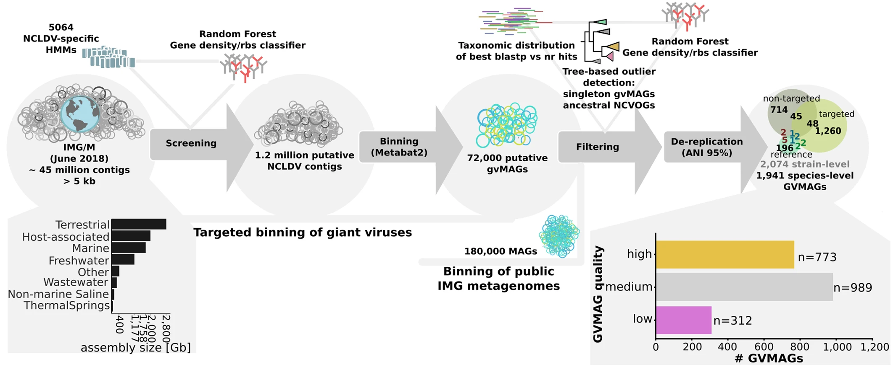
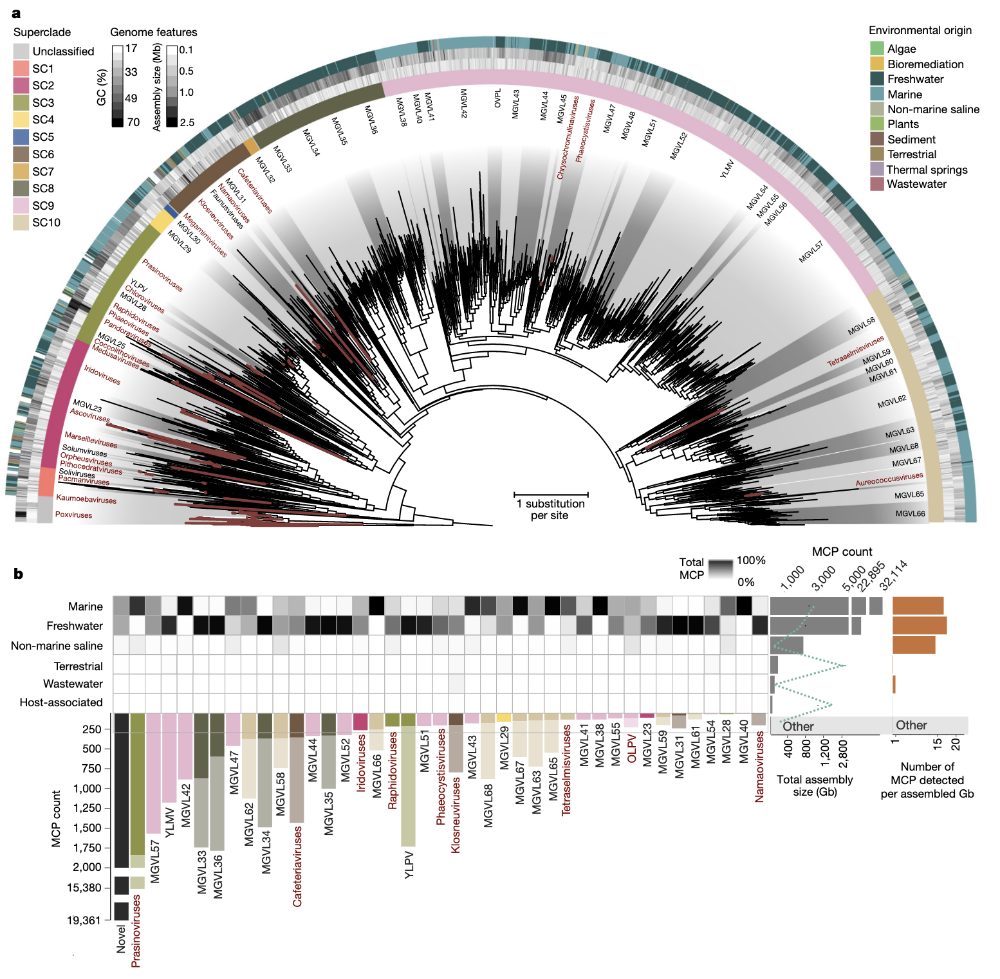
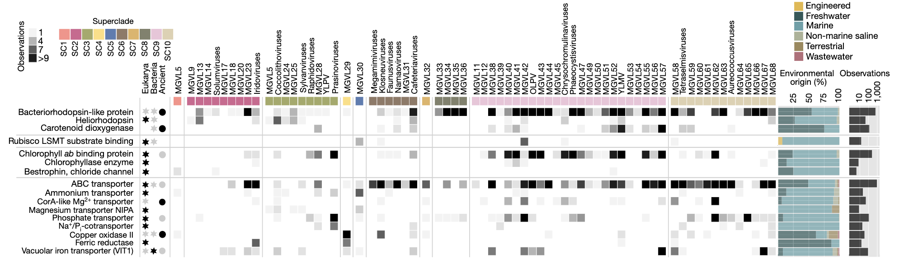
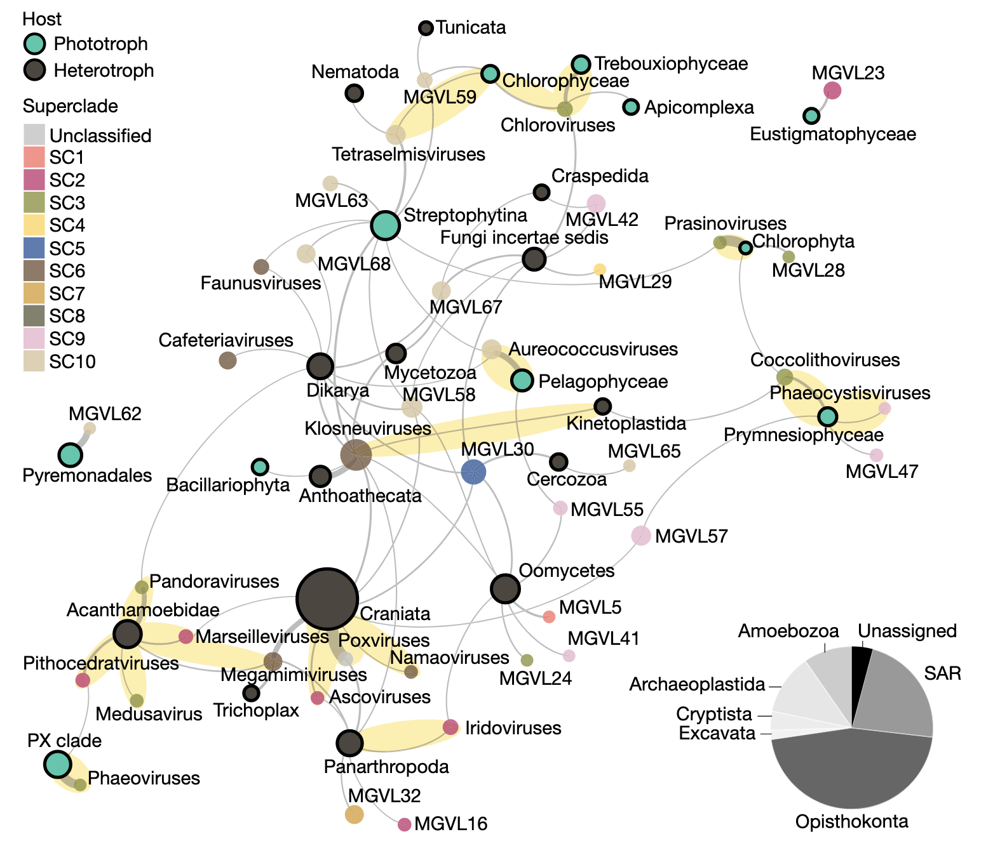
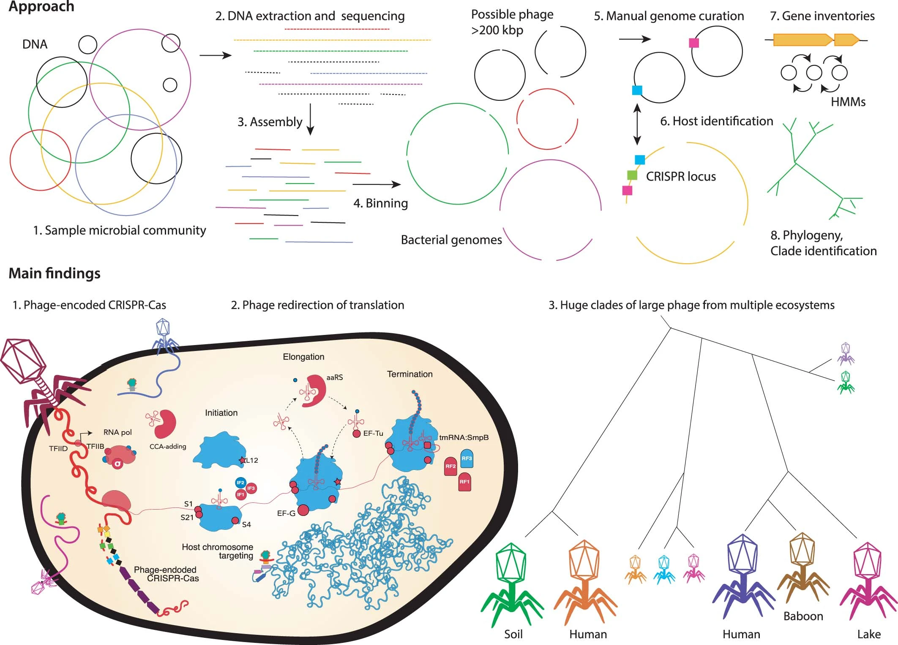
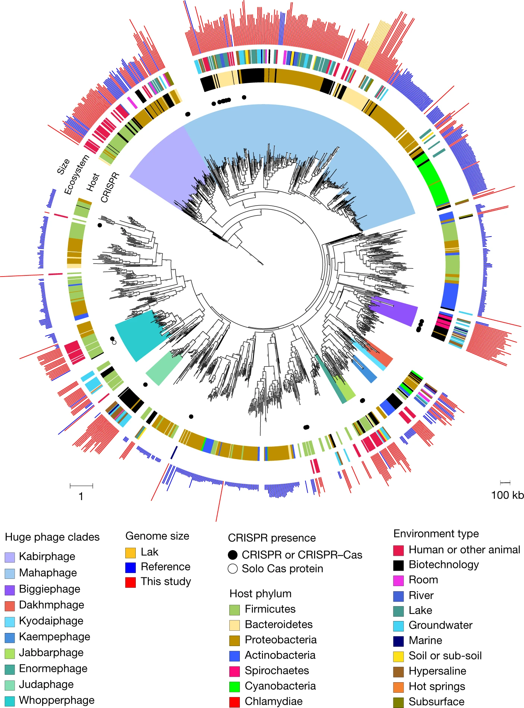
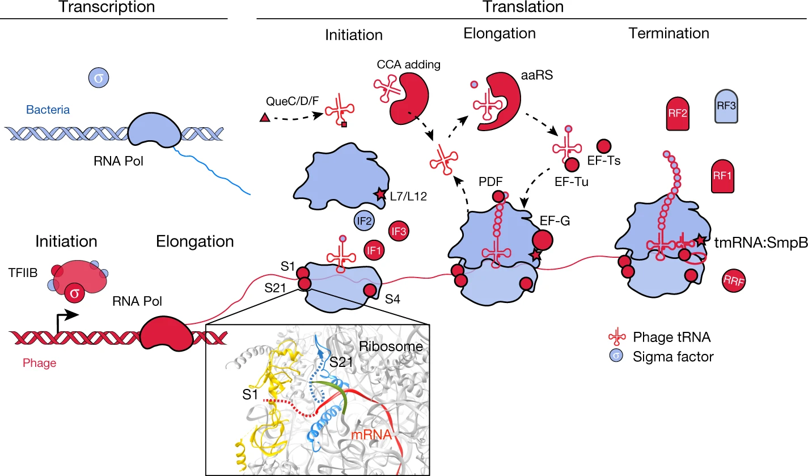
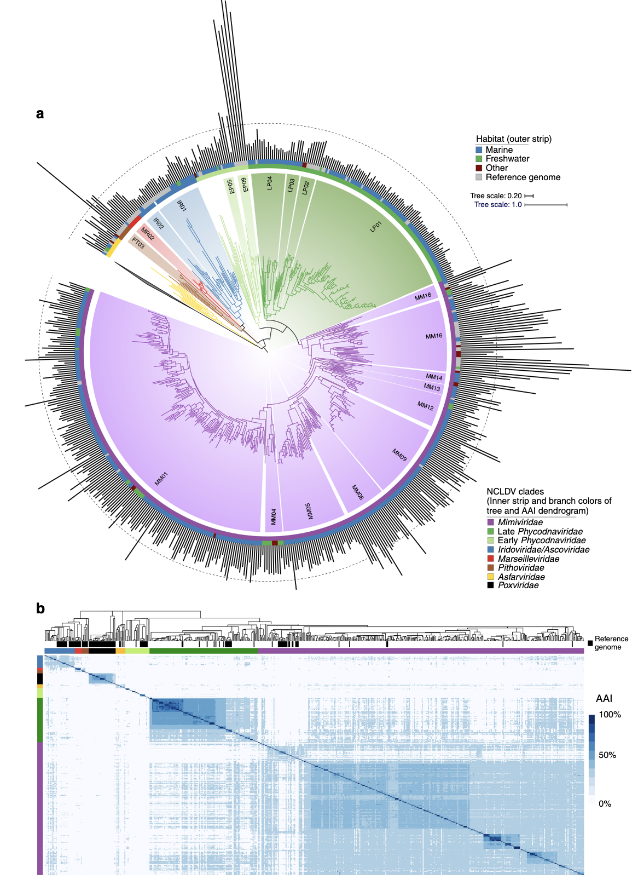
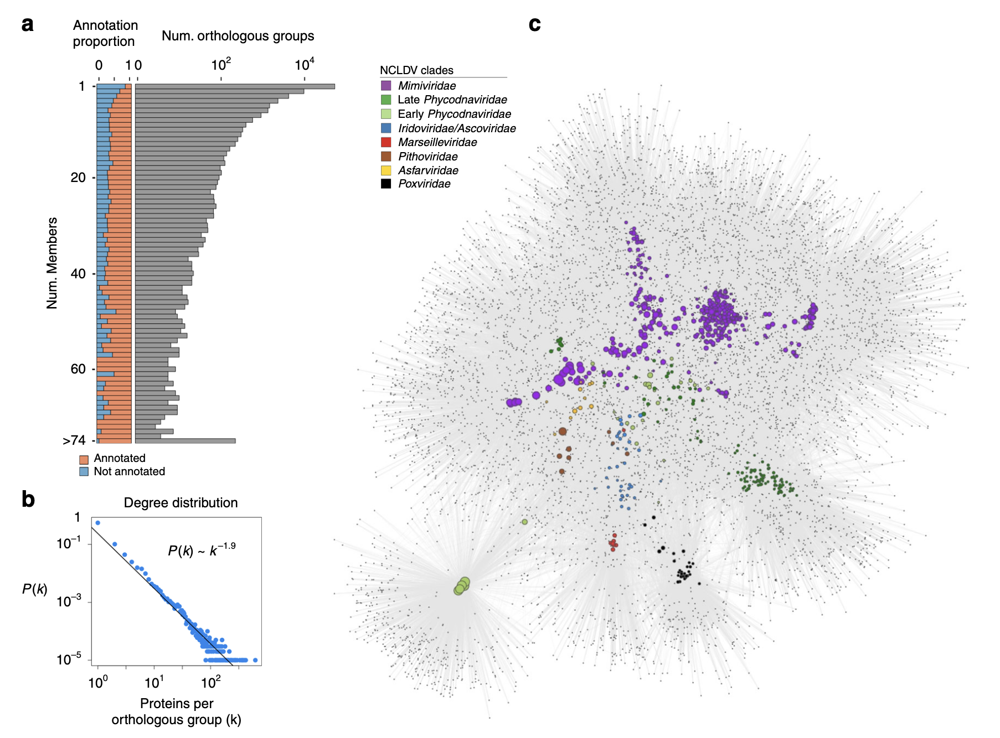
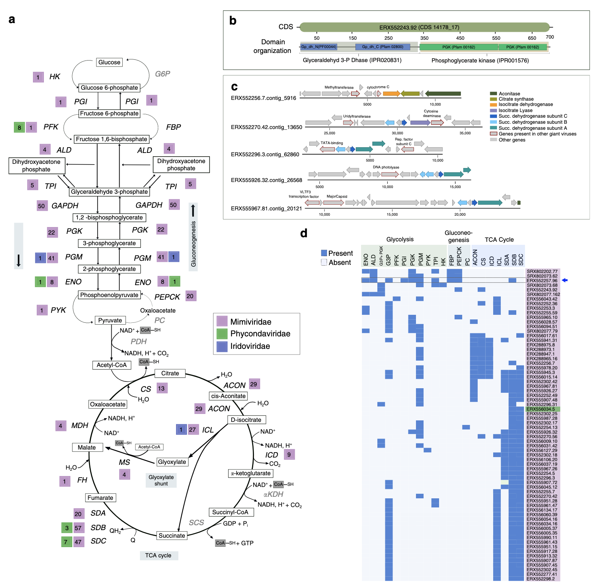

## Introduction

上次已经介绍了[巨型病毒](https://asa-blog.netlify.app/p/giant-virus/)的一些基本内容，也讲到了不依赖培养的方法是从环境样本中发现巨型病毒基因组成的不可或缺的工具。可以通过基因组解析宏基因组学来从环境序列数据中获取 NCLDV 基因组并进行深入研究如功能基因，宿主，进化等等。这次介绍一些基于宏基因组的巨型病毒研究：

## 全球宏基因组学揭示巨型病毒多样性和宿主相互作用

作者利用快速增加的公开宏基因组数据，从全球采样点重建了 2,074 个 NCLDV 基因组。这导致系统发育多样性增加了 11 倍，功能多样性也相应增加了 10 倍。使用宏基因组数据对来自大型和巨型病毒的 58,023 个主要衣壳蛋白进行分析，揭示了这些病毒的全球分布模式和世界性本质。
所发现的病毒基因组编码了多种在光合作用和不同底物运输过程中具有推定作用的蛋白质，表明宿主重编程可能是 NCLDV 中的常见策略。此外，水平基因转移的推论将病毒谱系与不同的真核宿主联系起来。作者预计在此描述的 NCLDV 的全球多样性将使巨型病毒（与大多数主要真核生物谱系相关）成为地球生物群落生态系统中的重要参与者。

作者使用了多步宏基因组数据挖掘、分箱和迭代过滤流程，从 8,535 个公开可用的宏基因组中恢复了代表 2,074 个假定 NCLDV 群体的基因组，置于综合微生物基因组和微生物组 (IMG/M) 数据库。核质病毒直系同源基因（NCVOG）的组装大小、GC含量、编码密度和拷贝数与之前描述的NCLDV基因组相当，支持将这些基因组分类为巨型病毒宏基因组组装基因组（GVMAG）。使用依赖于保守 NCVOG 的方法，作者估计了基因组完整性和污染，从而对 773 个高质量、989 个中等质量和 312 个低质量 GVMAG 进行了分类，符合 MIUViG 建议。

使用 GVMAG 增强现有的 NCLDV 系统发育框架大大增加了该病毒目的多样性（上图a）。由此产生的系统发育树从 205 个病毒基因组扩展到 2,279 个病毒基因组，与之前识别的 20 个属相比，这些病毒基因组现在可以分为 100 个潜在属或亚科水平的单系进化枝，跨越 10 个临时超进化枝。这意味着 NCLDV 的系统发育多样性增加了 11 倍。值得注意的是，新病毒基因组的添加并没有改变 NCLDV 树的基本拓扑结构，而是改变了现有群体（尤其是拟病毒科）对总病毒多样性的贡献。此外，谱系特异性模式中保守的 NCVOG 的存在强化了该病毒群具有共同进化起源的假设。现有分类框架内出现了没有分离株代表的新病毒群（即宏基因组巨型病毒谱系（MGVL））。为了进一步加深对 NCLDV 环境分布模式的了解，作者对所有公共宏基因组数据集的主要衣壳蛋白 (MCP) 进行了调查。作者鉴定了超过 58,000 个该蛋白质的拷贝，其中 67% 可以归属于病毒谱系（上图b）。

病毒感染对其真核宿主的有害影响是众所周知的；然而，最近的一些研究表明，NCLDV 也可能补充其宿主的新陈代谢，例如，通过编码吸收氮等营养物质的转运蛋白或发酵基因。扩展这些初步发现，作者的数据表明，所有 NCLDV 超进化枝的不同谱系都编码在光合作用、不同底物运输过程、光驱动质子泵和视网膜色素中具有潜在作用的酶（上图）。代谢重编程是指细菌病毒从宿主获取基因并维持它们以支持宿主新陈代谢的一种常见现象。结果表明，以类似的方式，NCLDV 介导的宿主重编程可能是增加病毒繁殖力的重要策略，同时使受感染的真核宿主细胞具有短期竞争优势，特别是在营养有限的条件下。

宿主基因的摄取是 NCLDVs进化中的常见机制。使用 HGT 分析，作者将假定的宿主分配给不同的 NCLDV 谱系。对可能经历 HGT 的 2,040 个基因的分析提供了 50 个病毒谱系与 32 组推定真核宿主的连锁信息（上图）。值得注意的是，包含分离病毒基因组的 23 个病毒谱系中有 17 个可以通过 HGT 连接到经过实验验证的天然宿主，例如大多数感染藻类的病毒和感染后生动物的子囊病毒、纳毛病毒和痘病毒，以及将克洛斯新病毒连接到动质体。作者的分析进一步证实棘阿米巴是潘多拉病毒、海象鼠病毒、水母病毒、马赛病毒和巨拟病毒的宿主。值得注意的是，作者的分析没有揭示与人类宿主的联系。作者预计，随着宿主基因组采样的改进，特别是未充分探索的原生生物和藻类的基因组，通过 HGT 进行的宿主关联将产生更全面的 NCLDV 宿主范围和进化历史图景。

## 来自地球生态系统的巨型噬菌体进化枝

噬菌体通常具有较小的基因组，并且依赖于其细菌宿主进行复制。在这里，作者对来自不同生态系统的 DNA 进行了测序，发现了数百个长度超过 200 kb 的噬菌体基因组，其中包括 735 kb 的基因组，据作者所知，这是迄今为止描述的最大的噬菌体基因组。手动整理了 35 个基因组以完成（圆形且无间隙）。扩展的遗传库包括多种先前未描述的 CRISPR-Cas 系统、转移 RNA (tRNA)、tRNA 合成酶、tRNA 修饰酶、翻译起始和延伸因子以及核糖体蛋白。噬菌体的 CRISPR-Cas 系统具有沉默宿主转录因子和翻译基因的能力，可能作为更大的相互作用网络的一部分，拦截翻译以将生物合成重定向到噬菌体编码的功能。此外，一些噬菌体可能会重新利用细菌 CRISPR-Cas 系统来消除竞争噬菌体。作者从系统发育上定义了来自人类和其他动物微生物组以及海洋、湖泊、沉积物、土壤和建筑环境的巨型噬菌体的主要进化枝。作者的结论是，巨大噬菌体的大量基因库反映了保守的生物策略，并且噬菌体分布在广泛的细菌宿主范围和地球生态系统中。

2017 年，仅发表了 93 个基因组长度超过 200 kb 的分离噬菌体。对整个群落 DNA 进行测序可以发现噬菌体衍生的片段；然而，由于碎片化，大基因组仍然可以逃脱检测。最近，根据宏基因组数据集手动整理完成的基因组，描述了人类和动物相关巨噬细胞的一个新分支9。这一发现促使作者对微生物群落进行更全面的分析，以评估具有大基因组的噬菌体的流行率、多样性和生态系统分布。此前，基因组超过 200 kb 的噬菌体被称为“jumbophages”，或者基因组超过 500 kb 的噬菌体被称为megaphages。由于这里重建的集合跨越了两个尺寸范围，作者将它们简单地称为“巨大噬菌体”。上图概述了作者的方法和主要发现。这项研究扩展了作者对噬菌体生物多样性的理解，并揭示了各种生态系统，其中噬菌体的基因组大小可与小细胞细菌相媲美。作者假设这些噬菌体已经进化出一种独特的“生命”策略，其中涉及在复制其巨大基因组时对宿主生物学进行广泛的拦截和增强。

作者重建了 351 个噬菌体序列、6 个类质粒序列和 4 个未知分类序列。排除了被推断为质粒的其他序列，仅保留编码 CRISPR-Cas 位点的序列。由于 CRISPR-Cas 位点的存在，作者纳入了 3 个长度≤200 kb 的噬菌体序列。与噬菌体的分类一致，作者鉴定了多种噬菌体相关基因，包括参与裂解和编码结构蛋白的基因，并记录了噬菌体的其他预期基因组特征。一些预测的蛋白质很大，长度可达 7,694 个氨基酸；有些被暂时注释为结构蛋白。总共有 175 个噬菌体序列被环化，其中 35 个是手动完成的，在某些情况下通过解析复杂的重复区域，揭示其编码的蛋白质（方法和补充表 1）。大约 30% 的基因组显示出明显的 GC 偏差，表明存在双向复制，30% 的基因组具有表明单向复制的模式13。4 个最大的完整、手动管理和环化的噬菌体基因组长度分别为 634、636、642 和 735 kb，据作者所知，它们是迄今为止报道的最大的噬菌体基因组（2020年）。

{width=80%}

一个有趣的问题与具有巨大基因组的噬菌体的进化历史有关。也就是说，它们是否是正常大小噬菌体进化枝内最近基因组扩张的结果，或者大量基因是否是一种既定的、持久的策略。为了研究这一点，作者使用公共数据库中的序列作为背景，构建了大终止酶亚基蛋白（上图）和主要衣壳蛋白的系统发育树。噬菌体基因组中的许多序列在高引导支持下聚集在一起，从而定义了进化枝。对数据库序列的基因组大小信息的分析表明，属于这些进化枝的公共序列来自基因组长度至少为 120 kb 的噬菌体。最大的进化枝，在这里被称为 Mahaphage（Maha 在梵文中是巨大的意思），包括作者所有最大的基因组以及来自人类和动物微生物组的 540-552 kb Lak 基因组。作者还发现了另外九个大型噬菌体簇，并在本文的一些作者的语言中使用“巨大”一词来指代它们。大噬菌体始终被分组为进化枝的事实表明，大的基因组大小是一个相对稳定的特征。在每个进化枝内，噬菌体都是从各种环境类型中采样的，这表明这些巨大噬菌体及其宿主在整个生态系统中的多样化。

为了确定细菌宿主系统发育与噬菌体进化枝的相关程度，作者使用 CRISPR 间隔区从相同或相关样本中的细菌以及正常宿主相关噬菌体基因的系统发育中鉴定了一些噬菌体宿主。作者还测试了噬菌体基因库的细菌分类学隶属关系的预测值，发现在每种情况下，CRISPR 间隔区靶向和系统发育都与门级分类学特征一致。因此，作者使用分类学特征来预测许多噬菌体的细菌宿主门（补充表4）。结果确定了厚壁菌门和变形菌门作为宿主的重要性。与其他环境相比，人类和动物肠道中厚壁菌门感染的巨型噬菌体的患病率较高，这反映了微生物组的潜在宿主组成。值得注意的是，长度超过 634 kb 的 5 个基因组均来自预计会在拟杆菌门中复制的噬菌体，Lak 噬菌体也是如此，并且全部聚集在 Mahaphage 进化枝内。总体而言，系统发育上分组的噬菌体预计会在同一门的细菌中复制。

噬菌体基因组编码的蛋白质预计定位于细菌膜或细胞表面。许多噬菌体具有参与嘌呤和嘧啶的从头生物合成以及核酸和核糖核酸以及核苷酸磷酸化状态的相互转化的基因。这些基因组与具有非常小细胞和假定共生生活方式的细菌的基因组非常相似。
值得注意的是，许多噬菌体的基因具有预测的转录和翻译功能。完整的噬菌体基因组编码多达 67 个 tRNA，其序列与其宿主的序列不同。一般来说，每个基因组的 tRNA 数量随着基因组长度的增加而增加。巨大的噬菌体每个基因组有多达 15 个 tRNA 合成酶，它们也与其宿主的合成酶不同但相关。噬菌体可以利用这些蛋白质为它们自己的 tRNA 变体装载来自宿主的氨基酸。基因组的一个子集具有用于 tRNA 修饰和连接被宿主防御切割的 tRNA 的基因。
许多噬菌体携带与宿主翻译的拦截和重定向有关的基因。这些基因包括起始因子IF1和IF3，以及核糖体蛋白S4、S1、S21和L7/L12（核糖体蛋白最近才在噬菌体中报道17（上图））。 rpS1 和 rpS21 对于细菌中的翻译起始都很重要，这使得它们可能有助于劫持宿主核糖体。对 rpS21 蛋白的进一步分析揭示了 N 末端延伸，富含对 RNA 结合很重要的碱性和芳香残基。作者预测这些噬菌体核糖体蛋白会替代宿主蛋白，并且它们的延伸有助于竞争性核糖体结合或噬菌体 mRNA 的优先启动。

作者鉴定了噬菌体中大多数主要的 CRISPR-Cas 系统类型，包括基于 Cas9 的 II 型、最近描述的 V-I23 型、V-U 型系统的新变体24 和 V-F 型系统的新亚型。 II 类系统（II 型和 V 型）此前尚未在噬菌体中报道过。大多数噬菌体效应核酸酶（用于干扰）具有保守的催化残基，这意味着它们具有功能。
与具有 CRISPR 系统的噬菌体案例相比，几乎所有噬菌体 CRISPR 系统都缺乏间隔区获取机制（Cas1、Cas2 和 Cas4），并且许多系统缺乏可识别的干扰基因。例如，两个相关的噬菌体具有 I-C 型变体系统，该系统缺乏 Cas1 和 Cas2，并具有解旋酶蛋白而不是 Cas3。这些噬菌体还有第二个系统，其中包含新的候选 V 型效应蛋白 CasΦ (Cas12j)，其长度约为 750 个氨基酸（图 4 和补充表 1），出现在 CRISPR 阵列附近。

在某些情况下，缺乏干扰和间隔区整合基因的噬菌体与宿主具有相似的CRISPR重复序列，因此可能使用宿主的Cas蛋白。或者，缺乏效应核酸酶的系统可能会抑制靶序列的转录而不发生裂解。此外，间隔重复引导RNA可能具有类似RNA干扰的机制来沉默宿主CRISPR系统或它们可以杂交的核酸。噬菌体编码的 CRISPR 阵列通常很紧凑，该范围远小于原核基因组中常见的范围。一些噬菌体间隔区针对其他噬菌体的核心结构和调节基因。因此，噬菌体显然增强了宿主的免疫库，以防止竞争性噬菌体的感染。

一些感染假单胞菌的大型噬菌体编码抗 CRISPRs (Acrs) 和蛋白质，这些蛋白质组装成核样区室，将其复制基因组与宿主防御和其他细菌系统隔离开来。作者鉴定了巨大噬菌体基因组中编码的蛋白质，这些蛋白质与 AcrVA5、AcrVA2、AcrIIA7 和 AcrIIA11 聚集在一起，并且可能具有 Acrs 的功能。作者还鉴定了微管蛋白同源物 (PhuZ) 和蛋白质，它们可产生蛋白质噬菌体“细胞核”。最近表明噬菌体核可以通过物理阻止 CRISPR-Cas 系统的降解来保护噬菌体基因组免受宿主防御。

## 全球巨型病毒的基因组进化动态和病毒细胞代谢

真核巨型病毒的发现改变了作者对病毒复杂性极限的理解，但其编码代谢多样性的程度仍不清楚。在这里，作者从全球环境中生成了 501 个核胞质大 DNA 病毒 (NCLDV) 的宏基因组组装基因组，并分析了它们的编码功能能力。作者报告了广泛分布的巨型病毒中代谢基因的显著多样性，包括许多与营养吸收、光捕获和氮代谢有关的基因。令人惊讶的是，许多 NCLDV 编码糖酵解和 TCA 循环的成分，这表明它们可以重新编程宿主中心碳代谢的基本方面。
作者对 NCLDV 代谢基因及其细胞同源物的系统发育分析揭示了病毒序列不同的聚类，形成不同的分支，表明这些基因是病毒特异性的，并且是在遥远的过去获得的。总的来说，作者的研究结果表明，巨型病毒编码复杂的代谢能力，其进化历史很大程度上独立于细胞生命，强烈暗示它们是全球生物地球化学循环的重要驱动因素。

为了解决有关环境中 NCLDV 的基因组多样性、进化关系和病毒细胞代谢的关键问题，作者开发了一个工作流程，从公开的宏基因组数据中生成 NCLDV 的宏基因组组装基因组 (MAG)。作者调查了 1545 个宏基因组，并从大小范围为 100 至 1400 kbp 的单个样本中生成了 501 个新型 NCLDV MAG。作者的工作流程包括去除可能源自细胞生物或噬菌体的重叠群的步骤，以及最大限度地减少每个 MAG 中可能的菌株异质性。为了确保作者的 NCLDV MAG 代表几乎完整的基因组，作者只保留了至少包含 5 个关键 NCLDV 标记基因中的 4 个的 MAG，这些基因已知在这些病毒中高度保守11，并且总长度 > 100Kbp。大多数 MAG 是从海洋和淡水环境中产生的（分别为 444 和 36），但作者还在生物反应器、废水处理厂、油田和土壤样本的宏基因组中发现了 21 个。

作者使用先前用于这些病毒系统发育分析的 5 个高度保守的基因，构建了 NCLDV MAG 的多位点系统发育树以及 121 个参考基因组（上图）。大多数 MAG 属于 Mimiviridae 和 Phycodnaviridae 家族（分别为 350 和 126），但作者还在 Iridoviridae、Asfarviridae、Marseillviridae和 Pithoviridae中鉴定了新基因组。作者的研究中对大量拟病毒科成员的鉴定与之前的分析一致，表明该科在海洋系统中具有高度多样性。
作者的系统发育表明，藻类DNA病毒科是多系的，并且至少由两个不同的单系群组成，其中一个是拟拟病毒科的姐妹群（称为晚期藻类DNA病毒科，108个MAG），另一个是拟拟病毒科-晚期藻类DNA病毒科分支的基础分支（称为“晚期藻类DNA病毒科”）早期藻类DNA病毒科，18 MAG）。尽管最近的一项研究报告了另一种拓扑结构，其中 Asfarviridae 也属于这个更广泛的组，但先前已根据串联标记基因系统发育提出了藻类DNA病毒科和拟菌病毒科组合的单系性。除了系统发育之外，作者还评估了 NCLDV 基因组之间的成对平均氨基酸同一性 (AAI)，以评估基因组差异。 AAI 值提供的结果与作者的系统发育分析基本一致，并显示科内 AAI 值范围为 26% 至 100%（上图b），突出显示即使是同一科内的 NCLDV 基因组之间也存在显著的序列差异。

为了评估 NCLDV 家族中蛋白质家族的多样性，作者计算了 MAG 和 126 个参考基因组之间的直系同源群 (OG)，从而得到 81,411 个 OG。其中，只有 21,927 个 (27%) 与 EggNOG、Pfam、TigrFam 和 VOG 数据库中已知的蛋白质家族具有可检测的同源性，这凸显了在其他研究中观察到的 NCLDV 基因组中存在大量新基因。此外，55,692 (68%) 的 OG 仅存在于一个 NCLDV 基因组（单例 OG）中，总体而言，蛋白质家族成员的程度分布仅揭示了少数广泛共享的蛋白质家族（上图a、b），与一般 dsDNA 病毒所显示的结果一致。为了可视化 NCLDV 中的基因共享模式，作者构建了一个二分网络，其中可以表示基因组和 OG（上图 c）。
对该网络的分析主要揭示了科级聚类，拟菌病毒科以及早期和晚期藻类DNA病毒科彼此靠近，而皮托病毒科、马氏病毒科和痘病毒科分别聚类。有趣的是，虽然潘多拉病毒是早期藻类DNA病毒科分支的成员，但它们独立聚集在一个小子网络中，表明该组中特别大的基因组和新颖的基因组库与所有其他NCLDV不同。这些模式表明，NCLDV 中的基因组内容部分是由进化历史决定的，但基因组内容的大规模增加或减少可能会在短时间内发生，类似于潘多拉病毒中发生的情况。这表明，在漫长的进化时间尺度上，NCLDV 的基因组进化是由垂直遗传和 LGT 混合形成的，在许多方面至少在质量上与细菌和古细菌相似。

引人注目的是，许多 NCLDV 基因组编码参与中心碳代谢的基因，包括大多数糖酵解、糖异生、TCA 循环和乙醛酸分流酶（上图4a）。中心碳代谢通常被认为是细胞生命的基本特征，因此值得注意的是，巨型病毒累积地编码了这些途径的几乎每一步。这些基因在拟菌病毒分支 1、9 和 16 中特别丰富，但其中一些基因也存在于几种藻DNA病毒科成员中。糖酵解酶甘油醛-3-磷酸脱氢酶 (G3P)、磷酸甘油酸变位酶 (PGM) 和磷酸甘油酸激酶 (PGK)，以及 TCA 循环酶乌头酸酶和琥珀酸脱氢酶 (SDH) 特别普遍。此外，作者在 16 个 MAG 中发现了一个编码糖酵解酶 G3P 和 PGK 的融合基因，它们执行糖酵解中的相邻步骤，代表了以前在细胞谱系中未报道过的独特结构域结构。
有趣的是，在许多 MAG 中，TCA 循环基因共定位于病毒重叠群上，这表明这些基因在感染过程中可能存在共同调节（上图c）。值得注意的是，一种 NCLDV MAG (ERX552257.96) 编码了糖酵解 10 个步骤中的 7 个步骤（上图d），这突显了一些巨型病毒可以从宿主中实现高度的代谢独立性。病毒编码不同中央代谢途径的这些成分，这一事实强调了它们通过操纵细胞内碳通量从根本上重新编程病毒细胞代谢的潜力。

病毒历来被视为细胞生命的附属品，因此它们对生物地球化学循环的影响在很大程度上是通过它们对宿主死亡率的影响来看待的，而不是通过它们本身的任何直接代谢活动来看待。作者在这项研究中揭示的 NCLDV 基因组中编码的大量细胞代谢基因揭示了另一种观点，即病毒特异性酶在塑造病毒细胞生理学方面具有直接作用。在全球水生环境中的病毒感染范围内，这提出了病毒酶本身可以大幅改变全球生物地球化学通量的可能性。此外，病毒代谢基因独特的进化谱系表明 NCLDV 是代谢创新的独特驱动力，这与传统观点形成鲜明对比，传统观点认为它们只是细胞基因的偶尔扒手，而不是事实上的进化创新者。总而言之，这些发现表明，正如微生物被认为是塑造全球生物地球化学循环的引擎一样，病毒也应该与它们的细胞对应物一起被视为具有自身编码生理学的代谢流代理。

## References
1. Schulz, F., Roux, S., Paez-Espino, D. et al. Giant virus diversity and host interactions through global metagenomics. Nature 578, 432–436 (2020). https://doi.org/10.1038/s41586-020-1957-x
2. Al-Shayeb, B., Sachdeva, R., Chen, LX. et al. Clades of huge phages from across Earth’s ecosystems. Nature 578, 425–431 (2020). https://doi.org/10.1038/s41586-020-2007-4
3. Moniruzzaman, M., Martinez-Gutierrez, C.A., Weinheimer, A.R. et al. Dynamic genome evolution and complex virocell metabolism of globally-distributed giant viruses. Nat Commun 11, 1710 (2020). https://doi.org/10.1038/s41467-020-15507-2

