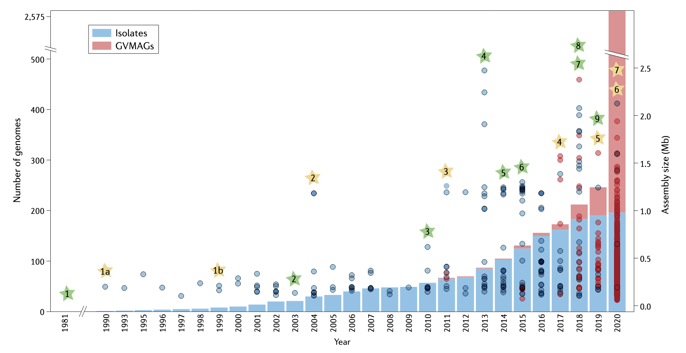
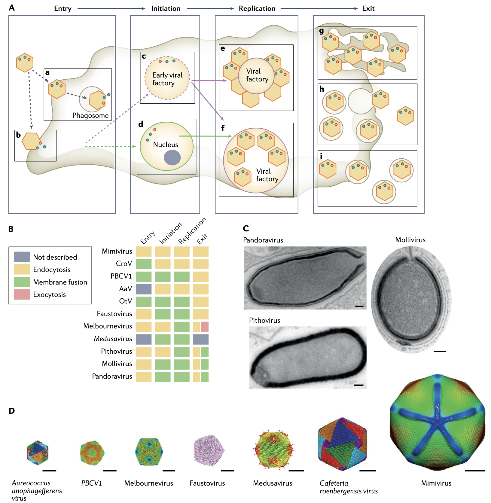
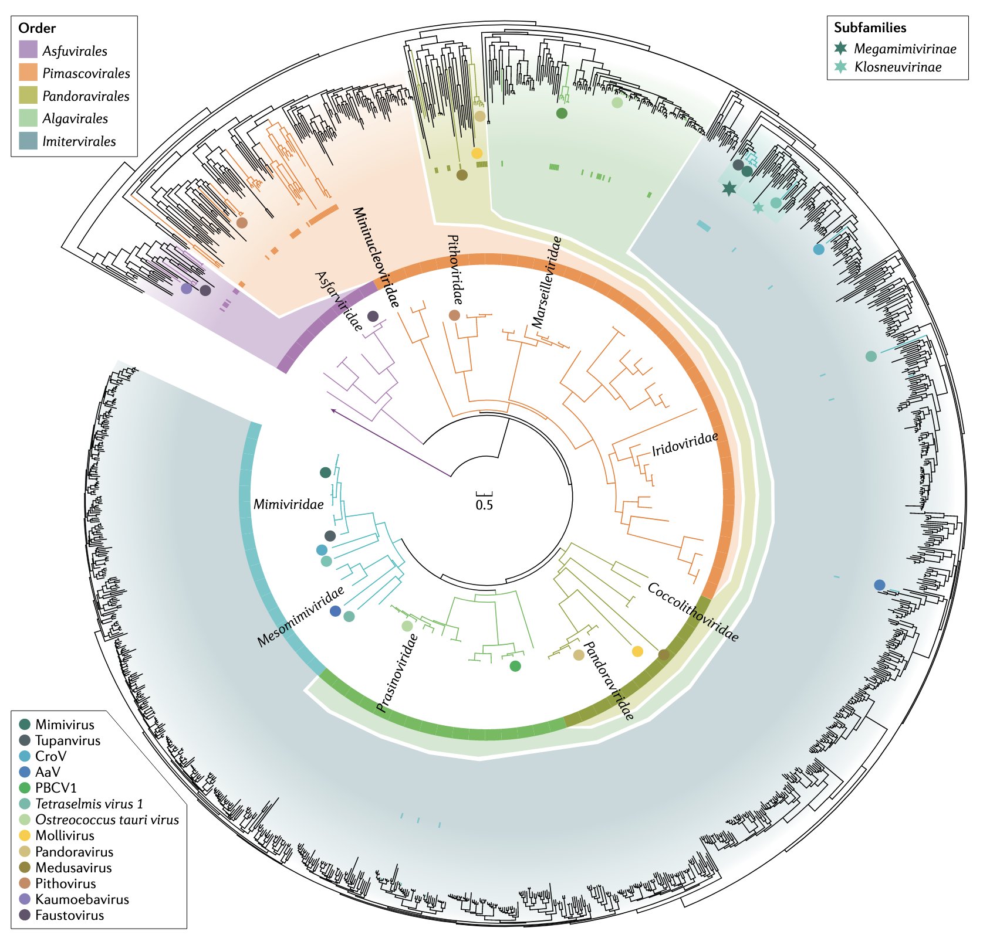
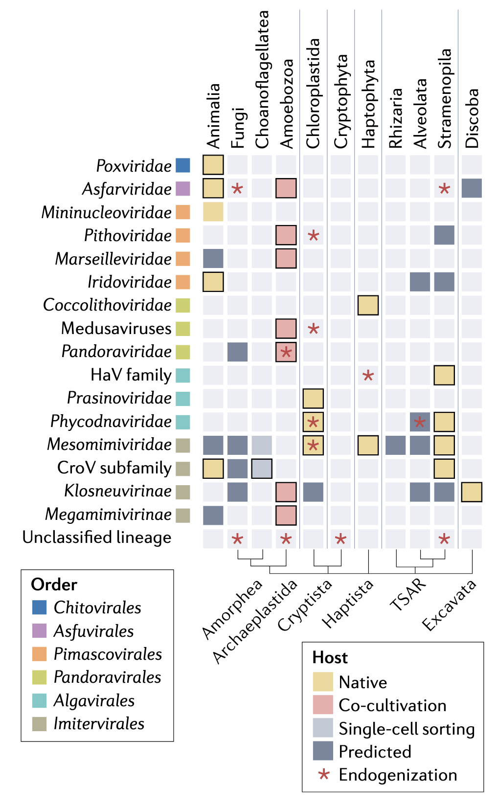
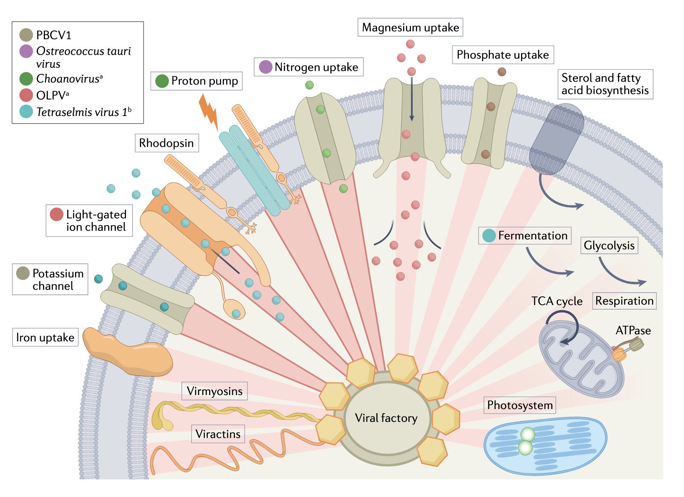

## Introduction

大型和巨型病毒是双链 DNA 病毒的一部分，即**核质大DNA病毒** (NCLDV, nucleocytoplasmic large DNA viruses)，构成病毒门 Nucleocytoviricota。
该门的病毒感染多种真核宿主，从已知最小的单细胞领鞭毛虫到多细胞动物。 NCLDV 通常在宿主细胞质中构建的所谓**病毒工厂**中复制，或使用宿主细胞核复制，有时组装其后代。这些病毒的标志性特征是**基因组范围从 70 kb 到 2.5 Mb 不等，病毒粒子长度可达 2 μm 以上**。 

“巨型病毒”一词最初是在 20 世纪 90 年代创造的，当时感染藻类的病毒明显具有异常大的基因组，此外，在 2000 年代初期，第一个基因组在兆碱基范围内的病毒被发现；最初的光学显微镜观察得出这样的假设：其颗粒对应于变形虫革兰氏阳性细菌病原体。更详细的超微结构分析揭示了典型的二十面体形状的病毒粒子，并且基因组测序产生了 1.2 Mb 的病毒基因组。
这种病毒被命名为“mimivirus”，是“微生物模仿病毒”的缩写，代表了病毒圈中意想不到的新颖性，不仅因为其特殊的颗粒和基因组大小，而且还因为它包含多个具有可能作用的基因，因此具有编码潜力蛋白质生物合成。
自从巨型病毒被发现以来，它们的编码潜力充满了惊喜，并且细胞生命标志基因的存在导致了这样的假设：这些病毒可能代表生命的神秘第四域。同样有趣的是，人们发现更小的病毒（所谓的病毒噬菌体）可以感染一些仅具有细胞质感染周期的 NCLDV；噬病毒体寄生并有时杀死宿主。还发现了第三个伙伴，称为“transpoviron”，它对应于 7kb 双链 DNA 附加体，能够使用巨型病毒和噬病毒体颗粒作为载体进行繁殖。

十多年来，巨型病毒主要通过基于培养的方法进行研究，直到最近，病毒学追随微生物基因组学的脚步，应用不依赖培养的宏基因组学以无与伦比的速度研究这些病毒的进化多样性和代谢潜力。
研究者探索了大量的实验数据，这些数据揭示了对巨型病毒生物学的许多见解，特别是它们的病毒颗粒结构和独特的感染策略。研究者通过整合最新的基于序列的研究来建立这些知识，这些研究扩展了 NCLDV 多样性、生物地理学、编码潜力和假定的宿主范围。此外，研究者讨论了令人信服的证据，表明巨型病毒基因组中存在多种细胞标志基因，使病毒能够重新编程宿主代谢，并且巨型病毒遗传物质整合到宿主基因组中可能会影响真核细胞的生物学和进化。

## 通过分离发现巨型病毒

最早发现的 NCLDV 是痘病毒科，其中包括天花的病原体，是 130 多年前在显微镜下看到的第一个病毒颗粒。感染小球藻绿藻的大型病毒在 20 世纪 80 年代被分离出来。痘苗病毒（一种痘病毒）和草履虫小球藻病毒 1 (PBCV1) 的第一个基因组分别于 20 世纪 90 年代初和 1999 年进行了测序。
此后不久，对痘病毒科的其他基因组进行了测序（图 1），其大小范围从 120 kb 到 360 kb。
随后，发现了感染动物的其他病毒，包括子囊病毒科、虹彩病毒科和阿斯法病毒科的成员，并对它们的基因组进行了测序。这些类群中的病毒基因组相对较小（最多 220kb），最近发现的与虾相关的小核病毒科病毒的基因组更小（70-80kb）。
除了感染动物的 NCLDV 外，2000 年代初期，在各种真核藻类中也检测到了多种 NCLDV，包括叶绿藻、附着藻、深海藻、褐藻和甲藻。这些与藻类相关的 NCLDV 被分类为 Phycodnaviridae 和 Mesomimiviridae，尽管它们的大部分基因组约为 200–500 kb，但 Tetraselmis 病毒和 Prymnesium kappa 病毒 RF01 的基因组为 668 kb和 1.4 Mb。

>**图 1：核质病毒门中依赖于培养和不依赖于培养的重要发现的时间线。** 堆叠柱状图表示每年在NCBI GenBank数据库中发布或可用的核质病毒门（Nucleocytoviricota）成员的病毒分离基因组（蓝色；左y轴）和巨型病毒宏基因组组装基因组（GVMAGs；红色；左y轴）的数量（x轴为年份）。实心圆点表示病毒分离基因组和GVMAGs的组装大小（右y轴）。重要的基于培养的事件以绿色星星标注：(1) 首次分离巨型病毒（Paramecium bursaria chlorella virus 1）。(2) 通过阿米巴共培养分离出mimivirus。(3) 与其宿主Cafeteria roenbergensis一起分离巨型病毒。(4) 分离出基因组大小达2.5 Mb的瓶状pandoravirus。(5) 通过与阿米巴共培养，从一块3万年前的冰芯中恢复出pithovirus。(6) 通过与Vermamoeba vermiformis共培养分离出faustovirus。(7) 分离出Bodo saltans virus，这是Klosneuvirinae亚科中首个具有原生宿主（动力鞭毛虫）的分离成员。(8) 从阿米巴中分离出tupanvirus，目前是基于衣壳直径和长度最大的巨型病毒。(9) 从阿米巴中分离出medusavirus，代表核质病毒门中的一个新的分化谱系。
重要的基因组和宏基因组事件以黄色星星标注：(1) 核质病毒门成员的首批基因组被测序：Vaccinia virus (1a) 和 Paramecium bursaria chlorella virus 1 (1b)。(2) 测序了第一个基因组大小超过1 Mb的巨型病毒：Acanthamoeba polyphaga mimivirus。(3) 首次从南极洲有机湖恢复出GVMAGs。(4) 基于从环境序列数据中恢复的GVMAGs提出了病毒亚科Klosneuvirinae。(5) 利用单细胞基因组学从海洋领鞭毛虫中发现了Choanovirus。(6) 首次大规模全球宏基因组研究，恢复了超过2000个GVMAGs，实现了系统发育多样性增加11倍和功能多样性扩展10倍。(7) 在宿主染色体中检测到完整的巨型病毒基因组整合。

继 2003 年发现拟菌病毒之后，其他具有较大病毒粒子和基因组超过 500 kb 的 NCLDV 也被发现可以感染异养原生生物（主要是变形虫动物门的成员）。十多年来，棘阿米巴菌株主要用作共培养新病毒的宿主，导致经常分离出能够感染这种单细胞宿主的密切相关的巨型病毒。
棘阿米巴属已被证明是许多 Megamimivirinae 和 Marseilleviridae 特别合适的宿主。因此，来自这些分类群的病毒是目前最常培养的 NCLDV 之一，公共数据库中有 30 多个基因组序列，包括新的 Megamimivirinae 谱系 tupanvirus 和 cotonvirus。共培养方法取得了广泛的成功，并且还从不同的 NCLDV 分支中恢复了分离株，促进了 Pithoviruses、Pandoraviruses、molliviruses 和 medusaviruses 的组织和命名。
最近，使用替代宿主，如 Vermamoeba spp.，得到了几种新的 faustovirus 分离株、orpheovirus、pacmanvirus 和 kaumoebavirus 的共同培养——它们都是 Pithovirus、marseillevirus 和 Asfarvirus 的远亲。
新开发的基于高通量共培养的方法使用高内涵筛选显微镜，已被证明是发现和分离巨型病毒的宝贵工具。然而，共培养受到巨型病毒宿主特异性的限制；一些 NCLDV 谱系只能感染特定宿主，例如某些棘阿米巴物种，而其他谱系可能更加通用，表现出更广泛的宿主范围 。考虑到真核生物，特别是微真核生物的巨大多样性，通过分离回收的巨型病毒很可能只反映了野外现存 NCLDV 谱系的一小部分。

## 病毒体结构和感染策略

### 具有核质感染周期的病毒

Chloroviruses是第一个被称为“巨型病毒”的病毒，因为它们具有直径为 190 nm 的大二十面体病毒粒子（T 号 169）（图 2）和高达 370 kb 的基因组。
特别是，PBCV1被广泛研究；它的衣壳有一些从一些衣壳延伸出来的外部纤维，并且在一个顶点存在一个尖峰状结构，以锚定在宿主细胞上（图2）。衣壳被病毒编码的糖基化机器合成的不寻常的寡糖糖基化；该寡糖与主要衣壳蛋白 (MCP；Vp54) 中的非典型序列片段中的天冬酰胺进行 N 连接。
外衣壳层覆盖单个脂质膜，这对于感染性至关重要。Chloroviruses通过使用包装在病毒粒子中的病毒编码酶在细胞壁上创建一个洞，将其基因组传递到藻类宿主中。然后病毒内膜与宿主质膜融合，形成基因组和一些病毒蛋白进入细胞的通道。由于病毒不编码 RNA 聚合酶，因此传入的基因组必须在病毒粒子在细胞质中组装之前在宿主细胞核内转录。病毒粒子在宿主细胞裂解后释放。

>**图2：巨型病毒感染机制和病毒体结构。** A | 巨型病毒通过附着于宿主细胞膜进入宿主细胞，随后通过内吞作用（a）或衣壳开启后的膜融合（b）实现入侵。随后，巨型病毒的转录过程在细胞质或病毒工厂中启动（c；紫色箭头），或在宿主细胞核中启动（d；绿色箭头）。在细胞质病毒工厂的外围，基因组复制和新病毒颗粒的组装随之发生（e），或者新合成的病毒颗粒分散在一个大的细胞质病毒工厂中（f）。最后，病毒颗粒通过宿主细胞裂解（g）、含病毒颗粒的液泡与宿主细胞膜融合（h）或膜包裹的病毒颗粒通过胞吐作用（i）被释放。小彩色圆点表示病毒基因组和病毒蛋白。B| 部分巨型病毒的感染策略。C| 镶嵌在树脂中的非二十面体病毒超薄切片的透射电子显微图。D| 使用冷冻电子显微镜解析的分离巨型病毒结构。注意mimivirus的蓝色星门结构。C和D部分的比例尺为100nm。  
缩写：AaV（Aureococcus anophagefferens病毒），CroV（Cafeteria roenbergensis病毒），OtV（Ostreococcus tauri病毒），PBCV1（Paramecium bursaria chlorella病毒1）。  

其他感染藻类的核质病毒由小病毒颗粒组成。核质病毒门中最小的成员是病毒颗粒直径约为 120 nm 且基因组长达 410 kb 的病毒。体积小对于金牛骨球菌Ostreococcus tauri的感染和复制至关重要，金牛骨球菌是最小的自由生活真核生物之一，细胞大小仅为 0.8μm。病毒感染后，基因组被释放到细胞核中，并且几乎立即开始复制。数小时内，新病毒粒子在细胞质中组装，不到 24 小时，宿主裂解发生。在此期间，宿主细胞核、线粒体和叶绿体保持完整。

具有核质感染周期的较大病毒是变形虫感染的潘多拉病毒pandoraviruses，其双耳瓶形状的病毒体长度可达 1 µm，直径达 500 nm（图 2），基因组可达 2.5 Mb。厚皮层内至少有一层脂质膜，该皮层由三层组成，其中一层由纤维素制成。颗粒通过吞噬作用被吸收，顶端的小孔状结构打开，使内膜与吞噬体膜融合；这导致基因组和必需的蛋白质被递送到宿主细胞质中。尽管潘多拉病毒编码RNA聚合酶，但该酶并未包装在衣壳中，因此，感染病毒依赖宿主细胞进行病毒基因的早期转录。在细胞核内建立的病毒工厂（图 2），新的病毒粒子开始从顶端组装，脂质囊泡被招募到病毒工厂用于病毒粒子组装。新生病毒粒子通过细胞裂解释放，或者如果病毒位于液泡内，则通过与质膜的膜融合的胞吐作用释放。

Molliviruses 具有较小尺寸（约 650 nm）的卵形病毒粒子和 650 kb 的基因组（图 2）；它们与潘多拉病毒有 16% 的基因相同，但三分之二的基因是 ORFans。衣壳似乎被不同长度的原纤维所包围，并且它们呈现出类似于潘多拉病毒的膜内衬外皮。
它们的感染周期也与潘多拉病毒相似，不同之处在于 DNA 似乎被预先包装在细丝中，这些细丝在被加载到成熟的病毒粒子中之前在病毒工厂中积累。通过低温电子显微镜 (cryo-EM)广泛分析了病毒颗粒组装中涉及的膜重塑。

美杜莎病毒Medusaviruses也是棘阿米巴感染病毒。它们的二十面体病毒粒子直径为 260 nm，被从每个衣壳延伸出的球形头尖刺覆盖，并具有包围衣壳内部的脂质膜。通过冷冻电镜确定了低分辨率结构，其返回的 T 值为 277。美杜莎病毒病毒粒子从宿主中进入和离开的机制尚未确定。摄入宿主细胞质后，其 DNA 在宿主细胞核中复制，病毒粒子在细胞质中组装（图 2）。

### 仅具有胞质感染周期的病毒

继 PBCV1 之后，研究最多的第二个病毒是感染阿米巴原虫的拟菌病毒mimivirus。约 700 nm 的病毒体由直径约 500 nm 的二十面体衣壳组成，基因组为 1.2 Mb。细菌型糖由病毒编码的糖基化机制合成，是装饰衣壳周围拟病毒原纤维的复杂 70 kDa 和 25 kDa 多糖结构的组成部分。拟菌病毒衣壳的低分辨率结构已被确定（图2），详细的原子力显微镜提供了对病毒粒子组成的更多见解，进一步强调了衣壳的复杂性。**有两层内部脂质膜，一层位于衣壳内，另一层位于核仁区室中，其中包含基因组和数百种蛋白质，包括 RNA 聚合酶和转录成熟机器**。有人提出，类核中的非结构蛋白是启动病毒感染周期、保护病毒体免受氧化应激和进行早期转录所必需的。初步数据表明，基因组组织在直径为 30 nm 的螺旋核衣壳中，其中包含 GMC 氧化还原酶，该酶也构成衣壳的糖基化原纤维。折叠的基因组排列在核衣壳的外壳上，留下一个可以容纳大蛋白质（包括 RNA 聚合酶）的中央通道。拟菌病毒通过其糖基化原纤维粘附在宿主细胞膜上后触发吞噬作用进入宿主。一旦进入液泡，二十面体一个顶点的特定结构（星门）就会打开，衣壳下的膜被拉出并与液泡膜融合，从而允许类核转移到宿主细胞质中。与拟菌病毒科的其他已知成员类似，拟菌病毒在其宿主的细胞质中复制（图2）。早期转录开始使用病毒编码的转录机制，该机制最初仍局限于类核中。由于活跃的转录和复制而积累的核酸导致病毒工厂的大小增加，新合成的病毒颗粒开始在其外围出芽，回收来自内质网或高尔基体的宿主细胞膜。在将基因组加载到类核中之后，病毒颗粒成熟的最后一步是将原纤维层添加到衣壳中，细胞裂解后释放出数百个新合成的病毒颗粒。

与拟菌病毒相关的几种病毒具有相似的感染周期，但病毒体较小。其中包括 Cafeteria roenbergensis 病毒，它具有直径 300 nm 的二十面体衣壳（图 2），衣壳下面有一层脂质膜。其感染模式尚不完全清楚，但与拟菌病毒类似，已观察到细胞质中的核仁结构和细胞外空衣壳，支持衣壳的外部开口，然后内膜与细胞膜融合，从而允许将类核转移到宿主细胞质中。病毒粒子含有约 150 种蛋白质，它们要么构成二十面体衣壳，要么是启动感染周期所必需的。新生病毒体在感染后期聚集并通过细胞裂解释放。通过冷冻电镜测定的复杂衣壳结构对应于 T 数 499，并为衣壳组装提供了新模型。

拟菌病毒科的另一个成员是博多萨尔坦病毒Bodo saltans virus，它具有类似的二十面体衣壳，直径为 300 纳米。它的衣壳似乎由两层蛋白质层组成，周围环绕着 40 纳米长的原纤维。衣壳的一个顶点存在可能的星门状结构，并且有两层膜，一层位于外部蛋白质壳内，另一层位于包含基因组的核样区室内部。感染周期与拟菌病毒相似，只是宿主的核基因组似乎被降解了。病毒工厂在细胞后极发育，填充了三分之二的细胞空间，将细胞核和细胞器推到一边。脂质囊泡被招募用于病毒粒子组装，该组装发生在病毒工厂的一侧，成熟的病毒粒子在基因组加载后分离并迁移到细胞的后极。细胞裂解后，病毒粒子通过在宿主膜上的囊泡中出芽而释放（图2）。

感染藻类的一些最大的病毒属于拟病毒科，所有这些病毒都具有二十面体衣壳，尺寸范围从无噬金球菌病毒的 150 nm（图 2）到最近描述的 Prymnesium kappa 病毒的 370 nm。 这些病毒还在宿主细胞质中构建病毒工厂，但尚不清楚转录机制是否被加载到衣壳中，从而实现完全细胞质的感染循环。

在核质病毒门中发现的最大的病毒体是 Pithovirus 和 cedratvirus 的病毒体（图 2），它们具有非常大的双耳瓶形衣壳，长度可达 2 µm，宽度可达 600 nm，包裹基因组高达 685kb（表1）。衣壳由软木塞结构（Corks）封闭——Pithovirus有一个（图 2）， cedratvirus两个——这些软木塞结构是由组织成蜂窝状阵列的蛋白质制成的。尽管病毒体形态与潘多拉病毒非常相似，但外皮不同，似乎由平行条带组成，没有纤维素；衣壳似乎覆盖有短而稀疏的原纤维。与其他变形虫感染病毒一样，感染周期通过吞噬作用进行，然后衣壳打开并与吞噬体进行膜融合。对于pithovirus和cedratvirus，病毒粒子中装载的RNA聚合酶在细胞质中开始早期转录，并且宿主细胞核在整个感染周期中保持完整。在成熟过程中，外皮和木塞的储存库在宿主细胞质中积累，并用于构建新的双耳瓶形状的病毒体。然后，新生病毒体通过胞吐作用或细胞裂解离开宿主细胞。

除了拟菌病毒科之外，还有一些较小的阿米巴感染病毒，例如马赛病毒科的成员，其具有直径约 250 纳米的二十面体病毒体（图 2）。最近研究以不同的分辨率显示了该家族两个成员的衣壳结构，揭示了 T 数 309 和复杂的衣壳结构以及许多次要衣壳蛋白。
墨尔本病毒Melbournevirus和马赛病毒科Marseilleviridae的其他成员被吞噬作用吞噬，然后在液泡膜消失后失去二十面体外观，变成球形。
与 Megamimivirinae 类似，它们的基因组保留在细胞质中；然而，RNA 聚合酶并未加载到病毒粒子中。相反，核蛋白被招募到早期病毒工厂，包括执行早期转录的宿主 RNA 聚合酶。细胞核的外观在感染早期发生变化，并通过病毒感染引发的仍未知的机制而发生渗漏。感染 1 小时后，细胞核完整性恢复，病毒编码的 RNA 聚合酶执行中间和晚期转录，二十面体颗粒在病毒工厂内组装（图 2A）。
马赛病毒科病毒编码组蛋白双联体，形成核小体，将基因组包装成病毒体。成熟的衣壳可以聚集在大囊泡中，细胞裂解导致单个病毒体和充满液泡的释放。
正如这些例子所表明的那样，巨型病毒的结构及其感染机制并没有共同的蓝图；这些特征在巨型病毒谱系之间有所不同，并且可能是由宿主生物体决定的。实验表征的巨型病毒的宿主范围仅限于少数变形虫和藻类谱系，仅代表真核生物多样性的一小部分。因此，预计当新病毒与其天然宿主一起被捕获时，将会揭示更多不寻常的病毒颗粒和感染策略。

## 不依赖培养的基因组学

### 序列推断的巨型病毒的流行率和多样性

通过巨病毒的分离和培养，在巨病毒生物学和多样性方面取得了许多重要发现。然而，此类方法受到满足实验室环境中最佳生长要求的限制，并且通常仅限于裂解病毒。事实证明，不依赖培养的方法是从环境样本中发现巨型病毒基因组成的不可或缺的工具。

在宏基因组学的早期，基于单标记基因的调查显示，藻类DNA病毒科和拟病毒科的几种病毒存在于塔拉海洋和马尾藻海探险期间收集的各种海洋宏基因组中，并且这些病毒的光层比真核生物更丰富。在后续研究中，这些调查的数据提出了这样的假设：海洋中的巨型病毒比任何细胞生物体都更加多样化。随后，对 NCLDV 主要衣壳蛋白 (MCP) 的大规模分析（其中在地球生物群落中发现了 50,000 多种此类蛋白质）揭示了巨型病毒的全球传播，包括在陆地生态系统中。

能够发现新型 NCLDV 的其他方法包括单病毒或单细胞基因组学和微型宏基因组学。首先，从海洋样本中分选病毒颗粒，能够检测到先前发现与藻类 Ostreococcus spp 有关的病毒。和球形棕囊藻。这种方法对几个所谓的巨型病毒单扩增基因组进行了测序，其中最大的是属于拟病毒科的 813 kb 基因组，编码元半胱天冬酶，该酶可能使宿主细胞自催化细胞死亡。单细胞方法，包括单个真核细胞的分选和基因组扩增，也被用来鉴定与海洋领鞭毛虫相关的五种巨型病毒并进行基因组测序；与所有其他 NCLDV 基因组的比较基因组学表明，以相似的营养模式（包括宿主栖息地和生活方式）感染宿主的病毒表现出不同的遗传特征。此外，对单个森林土壤样本的小型宏基因组学分析（方框 1）导致富集和发现了 15 种不同的巨型病毒宏基因组组装基因组 (MAG)，其中包括 Klosneuvirinae 的几个成员，这突显了巨型病毒在土壤尚未开发的多样性。

从环境序列数据中获取 NCLDV 基因组的最成功方法是基因组解析宏基因组学。自 2000 年代初以来，这种方法已成为从复杂环境样本中恢复细菌和古细菌基因组的常见做法，但又过了近十年，第一个巨型病毒 MAG (GVMAG) 才出现在公共数据库中（图 1）。尤等人重建了第一个 GVMAG，作为他们对南极洲有机湖宏基因组中的病毒噬菌体进行研究的副产品。
几年后，从美国黄石国家公园黄石湖的环境序列数据中检索到了另外四个可能与藻类相关的 GVMAG；人们发现它们与藻DNA病毒科和拟病毒科病毒科有关，并与同一样本中共存的噬病毒体共享一些基因。
当从宏基因组数据中恢复出拟南芥病毒科亚科（即 Klosneuvirinae）的成员时，用于发现巨型病毒基因组中心序列信息的独立于培养的方法获得了关注。事实上，这些病毒是在来自四个不同大陆的淡水和污水样本的宏基因组中发现的，这一事实表明，这一新的巨型病毒群是世界性的。
随后在深海中发现了 20 多个 GVMAG，其中 15 个属于 Pithoviridae，这表明类 Pithovirus 病毒在海洋中的流行率惊人地高，随后在收集的样本中发现了其他可能与藻类相关来自中国上海滴水湖的淡水巨型病毒。当从不同生物群落收集的数千个样本分析生成的宏基因组数据集中提取了 2,000 多个 GVMAG 时，独立于培养的病毒基因组学和发现方法的独特优势变得最为明显。
此后不久，又重建了主要来自海洋系统的另外 500 个 GVMAG。将 GVMAG 添加到 Nucleocytoviricota 物种树中导致系统发育多样性增加十倍以上，并实现了 Nucleocytoviricota 分类框架的全面更新，其中 Mesomimiviridae 占观察到的三分之一以上多样性（图 3）。新谱系的添加还导致核病毒泛基因组的大小大幅增加，该基因组现在包含超过 900,000 个蛋白质。这转化为广泛扩展的功能基因库，不仅为巨型病毒如何与其宿主和环境相互作用提供了许多新的见解，而且还产生了关于其进化作用的令人信服的新假设。

>**图 3：通过宏基因组学扩展 Nucleocytoviricota 系统发育多样性。** 显示了核质病毒的两个物种树：内部树说明了基于病毒分离株基因组的核质病毒多样性，外部倒转树突出了通过源自培养独立测序方法的基因组扩展物种多样性（黑色分支）。病毒分离株的分支根据分类群的隶属关系进行着色，并推断出外树的扩展多样性。彩色条带显示目级分类，彩色圆圈表示所选巨型病毒的系统发育位置，这些将在文本中进一步讨论。树根为痘病毒科。物种树改编自核质病毒谱系的分类框架。 AaV, Aureococcus anophagefferens virus; CroV, Cafeteria roenbergensis virus; PBCV1, Paramecium bursaria chlorella virus 1。

### 探索巨型病毒的宿主

基因组解析的宏基因组学能够发现数千个病毒基因组，其中许多代表与通过分离或共培养恢复的病毒不同的谱系（图3）。然而，从宏基因组中回收的巨型病毒通常缺乏宿主生物体的信息。克服这一限制的方法是检测同一样本中同时存在的病毒和潜在的真核宿主。此外，病毒及其宿主之间遗传物质的水平转移是一种常见现象，并且可以双向进行，并且对可能通过最近的水平基因转移（HGT）获得的病毒基因进行分析可能会识别宿主生物体。在巨型病毒宏基因组学的早期，基于读段图谱的共现分析显示，一些海洋样本中病毒序列的存在与真核卵菌的序列呈正相关，但尚未发现NCLDV与真核卵菌的序列存在相关性。
在另一项研究中，宏转录组数据的共表达分析揭示了无噬金球菌病毒Aureococcus anophagefferens virus与其藻类宿主之间的紧密联系，并且还表明同一样本中存在的其他拟病毒科可能与金球菌属相关。这种方法还将藻藻DNA病毒科和拟病毒科成员与多种海洋微真核生物联系起来，包括领鞭毛虫、原生藻菌、硅藻、甲藻和尾虫。

在另一项研究中，通过病毒和真核 PolB 编码基因以及真核 18S rRNA 基因高变 V9 区域的共现分析暗示了病毒与宿主的关系。然后将该方法应用于塔拉海洋探险期间收集的一套全面的海洋宏基因组，揭示了属于 Alveolata、Opisthokonta、Rhizaria 和 Stramenopiles 的特定微真核生物与不同的 NCLDV 谱系共存。在一项类似的研究中，在拟病毒科病毒和作为其潜在宿主的海洋金藻植物之间检测到强烈的共现信号。随后对 GVMAG 与金藻基因组和转录组之间假定的 HGT 事件的检测为这种宿主-病毒关系提供了进一步的支持。对 2,000 多个 NCLDV 基因组中存在的 HGT 候选基因（其中大部分是来自全球不同采样点的 MAG）进行的系统分析揭示了数千个可能通过最近的 HGT 引入宿主染色体或源自宿主的基因。基于这些结果，有可能提出 NCLDV 与所有主要真核生物门成员之间的联系。尽管大多数这些预测的宿主尚未被发现被巨型病毒感染，但通过最近的 HGT 事件成功预测了 20 多个先前分离的病毒与宿主关系，强调了这种基于序列推断的宏基因组组装病毒方法的有效性基因组（图 4）。

{width=50%}

>**图 4：经过实验验证和计算预测的核细胞病毒宿主范围。** 显示了通过与天然宿主分离、共培养、单细胞分选和基于计算机水平基因转移的预测而鉴定的宿主谱系。彩色框的黑色轮廓表明经过实验验证的相互作用也已通过计算预测。叶绿体包括链藻门（该组包括一些绿藻）和绿藻门（该组包括大多数绿藻）。 CroV 亚科，拟病毒科中的病毒亚科水平进化枝，包含 Cafeteria roenbergensis 病毒； HaV 科，藻类病毒目中的科级进化枝，含有赤潮异形病毒； TSAR，Telonemia-Stramenopiles-Alveolata-Rhizaria 超群。

尽管基于序列的计算宿主预测提供了一种扩大假定 NCLDV 宿主范围的方法，但这些方法存在一些潜在的挑战和偏差。例如，共现分析依赖于足够的宿主基因组覆盖率来检测宏基因组数据，而 HGT 分析需要宿主基因组序列的可用性。此外，很难从以前的宿主中检测出古老的 HGT。 NCLDV 基因整合到宿主基因组中的分析的另一个限制是所用数据库的质量。例如，GVMAG 在公共数据库中被发现被错误注释为细菌、古细菌或真核生物，这阻碍了使用自动化工具进行正确的 HGT 检测。尽管存在一些局限性，扩大宏基因组衍生的 NCLDV 的假定宿主范围为假定宿主的靶向采样、病毒与宿主共同进化的研究以及确定病毒编码功能以靶向调节宿主代谢提供了基础。然后可以推断病毒及其宿主的基于序列的推论，以评估这种相互作用对全球生态系统的影响。

## 从 HGT 到内生化

病毒与其宿主之间的 HGT 是一种常见现象，一些巨型病毒甚至可以将其整个基因组整合到宿主染色体中（图 4）。这种所谓的内生化是大多数真核病毒观察到的一种机制。 NCLDV 基因阵列偶尔会在真核生物基因组中发现，特别是在藻类、植物和变形虫中。
最近对已发表的真核生物基因组和转录组的一项调查显示，66 种不同的真核生物中存在巨型病毒基因，包括几种棘阿米巴物种、鞭毛虫、纤毛虫、原生藻菌、卵菌、真菌、节肢动物和各种单细胞和多细胞藻类（图 4）。
然而，对于许多真核生物来说，尚未观察到巨型病毒感染。

NCLDV 基因的整合通常表现为高度宿主特异性，在一种真核物种中检测到的病毒基因与在密切相关物种中发现的病毒基因无关。在整合的基因中，有 NCLDV 标志基因，这些基因在某些情况下分散在整个宿主染色体上，而在其他情况下，共同定位在由 100 多个基因组成的岛屿中。拟病毒科的一些成员的完整病毒基因组的整合已被描述；例如，20 多年前，Ectocarpus siliculosus 病毒很可能通过使用整合酶整合到其褐藻宿主中。
相关的球形棕囊藻病毒是一种溶原性病毒，可引起持续感染，这与许多其他已知的NCLDV谱系形成鲜明对比，这些谱系是基于裂解阿米巴宿主而成功分离的。对现有藻类基因组和转录组数据的分析揭示了整个巨型病毒基因组整合到真核宿主染色体中的其他例子。一些区域编码超过 1,500 个病毒基因，占绿藻宿主基因的 10%。一些检测到的病毒基因被注释为在碳水化合物代谢、染色质重塑、信号转导、能量产生和翻译中发挥作用的酶。

目前尚不清楚整合的巨型病毒是否处于休眠状态，对宿主没有任何好处或只有很少的好处，或者宿主细胞是否受益于某些可能提供或微调代谢能力的病毒基因。另一个悬而未决的问题是，整合病毒基因组中是否存在编码机制，可以在转录和翻译一些整合病毒基因后重新激活感染。随后，在宿主复制过程中释放巨型病毒遗传物质并有效传播到新宿主。如果病毒感染没有重新激活，巨型病毒基因会随着时间的推移而衰减，导致重排和假基因化，并使它们的检测变得更具挑战性或不可能。巨型病毒内生化主要是通过分析真核分离基因组发现的，但研究者预计真核生物基因组解析的宏基因组学将进一步促进发现这种现象的许多其他例子。未来对巨型病毒基因整合的研究有望为内生化如何塑造并继续塑造真核生物的进化和生态学提供一些答案。

## 宿主的重编程及其对宿主群体的影响

感染后，病毒会对其宿主细胞进行重新编程，并将其转变为支持病毒复制的所谓病毒细胞。与感染细菌的病毒（包括大型病毒）噬菌体类似，巨型病毒似乎向宿主贡献基因，以增强和/或调节宿主细胞的代谢能力（图5）。

第一个描述的例子是病毒编码的乙酰透明质酸合酶，由小球藻病毒编码，使其藻类宿主能够合成乙酰透明质酸。此外，还发现小球藻病毒编码的活性钾通道在感染过程中整合到宿主膜中。另一个例子是金牛座球菌病毒中源自宿主的氮转运蛋白，它在绿藻宿主感染期间表达。实验表征提供的证据表明，这种转运蛋白可能会增加宿主细胞对氮的吸收。其他研究揭示了 Tetraselmis 病毒基因组中发酵基因的存在，可能对营养有限的海洋系统中宿主的代谢产生影响。对巨型病毒分离株和 MAG 的调查揭示了细胞色素 P450 单加氧酶基因的广泛存在，可能促进或调节复杂的代谢过程，例如甾醇和其他脂肪酸的合成。对霍科病毒独特的细胞色素 P450 进行的宏基因组实验表征并未揭示重组病毒细胞色素 P450 代谢的任何甾醇。

最近研究在 NCLDV 基因组中发现了真核肌动蛋白（“viractins”）和肌球蛋白（“virmyosins”）的远距离同源物，表明这些病毒影响细胞结构、运动性和细胞内运输过程；然而，还需要进一步的功能验证。此外，一种与 Mesomimiviridae 相关的巨型病毒感染异养领鞭毛虫，被发现编码 1 型视紫质以及合成所需色素 β-胡萝卜素的途径。 NCLDV 视紫红质的宏基因组实验表征表明，假定的视紫红质可能起到质子泵的作用，从光中产生能量。在南极洲有机湖的 GVMAG 中发现了一种系统发育独特的 NCLDV 视紫红质，该蛋白质的实验表征表明，它可能充当光门控五聚离子通道，可能影响宿主细胞的离子稳态和趋光性。

此外，通过全局宏基因组学，预测编码各种底物运输过程、通过光产生能量（视紫红质和参与光合作用的基因）、碳固定和糖酵解的基因常见于隶属于核质病毒不同谱系的GVMAG（图5)。更详细的系统发育分析表明，一些编码铁、磷酸盐、镁和铵转运蛋白的辅助代谢基因起源于真核宿主，并且可能最近通过 HGT被巨型病毒获得。然而，编码几种视紫红质、琥珀酸氢化酶、乌头酸酶和甘油醛3-磷酸脱氢酶的其他基因显示出一种模式，表明祖先宿主之一具有病毒起源或共同进化起源。总而言之，代谢基因在不同的 NCLDV 谱系中广泛存在，这意味着增强宿主代谢能力可能是 NCLDV 比最初假设更常用的策略。然而，目前缺乏大多数这些基因和途径的功能和活性及其对宿主细胞的影响的实验证据，需要进一步的实验研究。

代谢重编程对宿主种群结构和动态有直接影响。一个引人注目的例子是世界性的海洋石藻，它形成大量的水华，在全球碳和硫循环中发挥着关键作用。Emiliania huxleyi种群受到球石病毒Emiliania huxleyi viru的持续性但最终裂解性感染。一旦诱导溶解，就会导致藻华终止，大量方解石和营养物质沉积到海洋中，从而增加海洋溶解有机物池。重要的是，病毒感染不仅会导致宿主裂解，还会通过重新连接宿主生理机能，特别是糖的周转以及脂肪酸和脂质的合成来促进病毒复制。人们对宿主群体如何受到通过基因组解析宏基因组学恢复的巨型病毒的影响知之甚少，但考虑到这些病毒的预测宿主，可以想象，类似的原理无处不在，并且正在积极塑造生物群落和生物地球化学循环。

>**图 5：巨病毒衍生病毒细胞的预测代谢重编程以及巨病毒感染对宿主群体的后果。** 一个假设的病毒细胞模型展示了不同巨型病毒在感染宿主过程中可能具备的代谢功能，这些功能基于巨型病毒基因组中辅助代谢基因的存在。更深的红色阴影表示某些功能已通过实验数据得到支持，例如：由Paramecium bursaria chlorella virus 1（PBCV1）编码的钾通道、由Ostreococcus tauri病毒编码的铵转运蛋白、由Choanovirus编码的光驱动质子泵以及从南极Organic Lake Phycodnavirus（OLPV）的宏基因组组装基因组中发现的光门控离子通道。此外，还特别指出Tetraselmis病毒编码的发酵基因。TCA表示三羧酸循环。  a. 尚未在天然病毒宿主系统中进行实验验证。 b. 目前没有这些基因功能的实验证据。  

## 巨型病毒基因组编码细胞生命的标志基因

在巨型病毒基因组中发现的最有趣的特征之一是细胞生命的标志基因，例如 **tRNA 和参与蛋白质生物合成的基因**。这种现象首先是在对拟菌病毒基因组进行测序时描述的。随后的分析揭示了病毒编码的细胞基因在细菌和真核生物之间的系统发育位置，表明其起源很古老。在其他巨型病毒基因组中发现了具有类似深分支模式的其他细胞标志基因，并导致了这样的假设：巨型病毒可能代表生命的第四个域，或者是由还原进化衍生的高度退化的真核细胞的残余物。随后使用更复杂的系统发育模型表明，其中许多基因很可能是从不同的真核宿主获得的。其中一些基因可能代表来自未被发现的真核宿主的古代转移。这一发现为巨型病毒可能是由较小病毒进化而来的假设提供了证据。

然而，其他研究报告了细胞生物体的一些管家基因和其他代谢基因的替代拓扑，包括视紫红质和细胞色素 P450。还有人提出，这些基因可能从祖先巨型病毒转移到过去的真核宿主，甚至原真核生物，这凸显了巨型病毒在真核细胞进化中潜在的不可或缺的作用。此外，一些可能作为真核核心代谢一部分的基因可能是在巨型病毒遗传物质整合到古代真核细胞基因组中时引入的，进一步塑造了真核进化。在新发现的巨型病毒基因组中，已多次记录到氨酰 tRNA 合成酶 (aaRS) 和真核翻译因子基因的存在。

事实上，从宏基因组数据中已经报道了克洛斯新病毒中几乎完整的 20 个 aaRS 集。不久之后，分离出两种图潘病毒tupanviruses，其基因组含有全套 aaRS 和 tRNA7，随后描述了第一个克洛斯新病毒亚科分离株，其中一个也含有全套 aaRS145。特别是在克洛斯新病毒亚科中，具有谱系特异性进化历史的 aaRS 的存在为这些基因源自不同的真核宿主提供了额外的支持。目前，完整aaRS基因组的存在仅限于拟病毒科成员，并且有关巨型病毒aaRS在宿主相互作用中的作用的信息有限；然而，有些已经过实验研究并且确实具有功能。甚至有一些实验证据表明，这些基因在使巨型病毒减少对宿主机器的依赖方面具有潜在作用，例如，在响应病毒感染或其他不利条件而关闭宿主翻译期间。另一方面，通过提供额外的aaRS拷贝以支持宿主翻译来增强病毒翻译的可疑作用尚未得到证实。细胞生命的其他标志基因包括编码四种核心组蛋白的基因以及预计参与能量产生的巨型病毒基因。最近的一项研究报道了马西潘多拉病毒病毒粒子的活跃膜电位以及三羧酸循环基因的几个远程同源物的表达。尽管编码功能最近被认为只存在于细胞生物体中，但**目前没有证据表明巨型病毒在没有宿主来源的核糖体或不依赖于宿主的能量产生的情况下进行蛋白质翻译**。

## Conclusions

近 20 年的巨型病毒分离已经产生了代表高度多样化谱系的病毒分离株。对这些病毒生物学的补充详细研究揭示了病毒体结构和感染策略的许多重要细节。很明显，病毒粒子的大小和结构存在明显差异，尽管这些病毒进入和退出宿主细胞的方式有一些相似之处，但大多数巨型病毒采用不同的策略在宿主细胞内复制和利用宿主细胞。病毒分离株的测序发现了已知最大和最小的核质病毒基因组。

独立于培养的方法加速了核质病毒门中新巨型病毒和其他大型病毒基因组序列的发现，为它们的系统发育多样性和功能潜力提供了新的见解。宏基因组学还表明，这些病毒几乎可以在地球上的任何地方找到，与不同的真核生物有关，并且可能通过代谢重编程改变宿主的生理机能，最终改变环境中宿主群落的结构和功能。与此同时，基于宏基因组数据集中 NCLDV 标志基因的估计表明，迄今为止仅发现了巨型病毒基因组的一小部分，并且巨型病毒的多样性可能远远大于细菌，至少在海洋中。将巨型病毒掺入环境样本中的受控宏基因组分箱实验表明，给定样本中存在的许多巨型病毒的基因组片段可能仍低于检测限，这凸显了超深度宏基因组测序或有针对性的分离工作的必要性。此外，人们对检测与已知病毒相似的巨型病毒存在强烈偏见，因为用于从宏基因组中识别病毒的工具严重依赖于在测序的 NCLDV 基因组中观察到的特征，例如大量保守基因。然而，巨型病毒基因组表现出广泛的可塑性，使得同一进化枝内的病毒迅速分化，并且共享的基因很少。

最近 NCLDV 多样性的一个令人震惊的例子是 yaravirus，它是与其本地阿米巴宿主分离的，但在公共宏基因组数据集中没有检测到密切相关的序列。由于其 90% 以上的基因与公共数据库中的基因缺乏相似性，并且缺乏大多数病毒标志基因，因此将其在 NCLDV 中的定位很困难，并且其在核质病毒中的定位目前仍在争论中。此外，最近的一份预印本描述了基于基因组解析的宏基因组发现了来自海洋系统的 Proculviricetes 和 Mirusviricetes，这可能是 Nucleocytoviricota 中两个类水平的新谱系，缺乏大多数典型的病毒标志基因。总而言之，通过培养和非培养方法观察到的核质病毒中病毒的过度基因新颖性，进一步强调了许多巨型病毒可能隐藏在人们的视线中。

## 其他概念

巨型病毒之所以被称为“巨型”，是因为它们违反了“可过滤性”的特性，自 1892 年分离出烟草花叶病病毒以来，“可过滤性”一直被用来将病毒与其他微生物分开。当今已知的巨型病毒（尚待其他病毒）很可能被忽视，因为人们过早地认为所有病毒都足够小，可以通过标准的消毒过滤器。与这一信念相一致的是，第一个巨型病毒（称为拟菌病毒，拟菌病毒科的原型）的病毒性质在十多年来一直被误认为是寄生细菌之后，直到 2003 年才被人们认识。因此，**根据病毒颗粒（病毒颗粒）的大小（最小尺寸>250 nm），病毒被归类为“巨型”病毒**，这使得它们可以通过标准光学显微镜看到。尽管巨型病毒的颗粒大小和基因组大小之间没有严格的相关性，**但大于 40 万碱基 (kb) 的基因组有时被用作定义巨型病毒的替代阈值**。

病毒工厂：病毒在受感染宿主细胞的细胞质中发育的瞬时细胞器，巨型病毒在其中进行复制和组装。

T数：三角剖分 (triangulation，T) 数描述了二十面体每个面的结构单元数，并计算为两个相邻五重顶点之间距离的平方。

软木塞结构：一些病毒体的独特结构；就 Pithovirus 而言，软木塞位于病毒颗粒的顶端，由排列成六角形蜂窝状阵列、间隔 15 nm 的条纹组成。

## References
1. Schulz, F., Abergel, C. & Woyke, T. Giant virus biology and diversity in the era of genome-resolved metagenomics. Nat Rev Microbiol 20, 721–736 (2022). https://doi.org/10.1038/s41579-022-00754-5
2. Abergel, Chantal et al. Giant viruses. Current Biology, Volume 30, Issue 19, R1108 - R1110
3. https://www.americanscientist.org/article/giant-viruses
4. Frederik Schulz et al. ,Giant viruses with an expanded complement of translation system components.Science356,82-85(2017).DOI:10.1126/science.aal4657
5. Menon T. Athira, Swapna P. Antony, The Tiny Giants: Overview of Giant Viruses, Ecological Genetics and Genomics, Volume 29, 2023, https://doi.org/10.1016/j.egg.2023.100210
