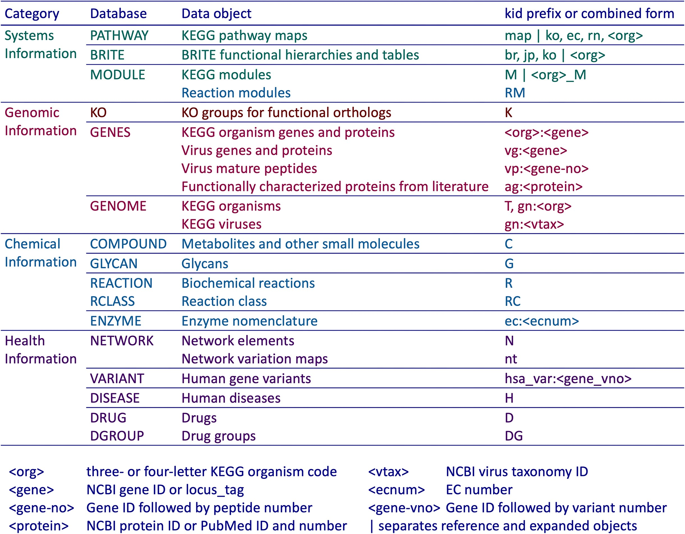
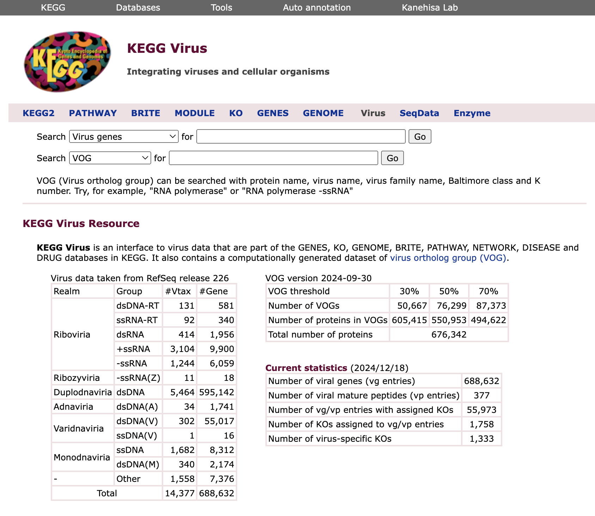
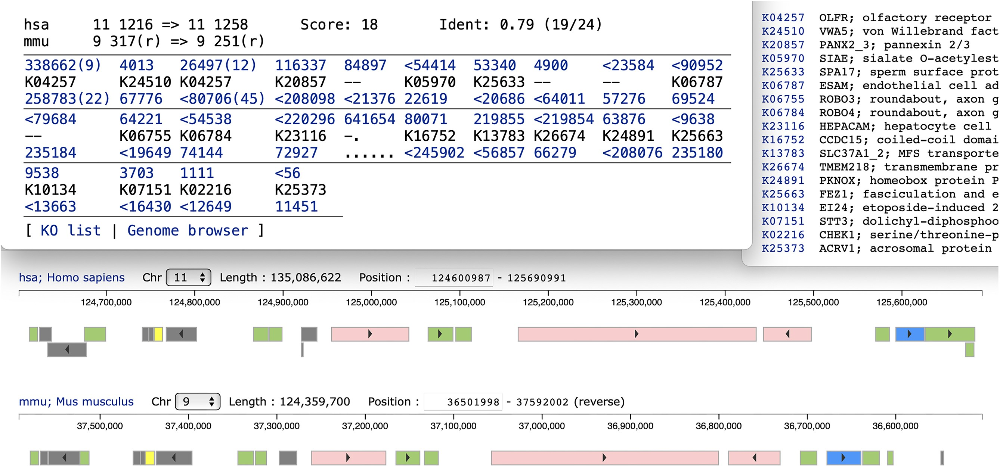
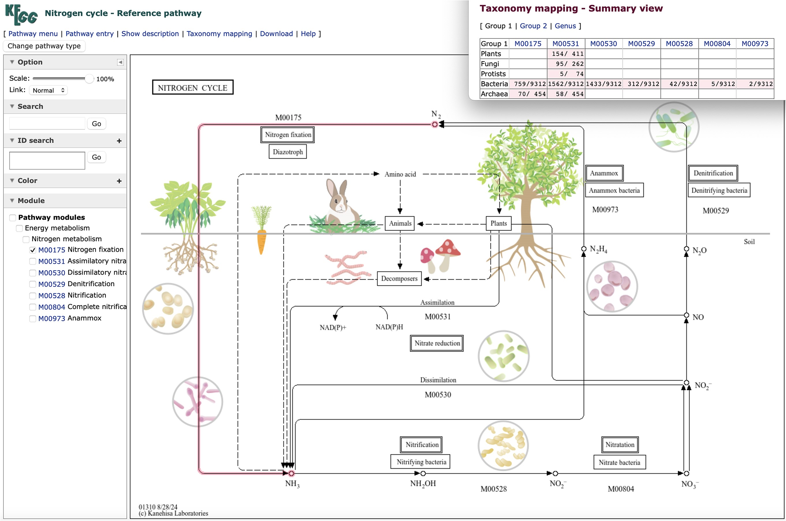

## Introduction

[KEGG](https://www.genome.jp/kegg/)（Kyoto Encyclopedia of Genes and Genomes）是一个广泛使用的生物信息学数据库，用于研究基因组、代谢组、信号通路和生物化学反应等方面的信息。之前也写过推文详细介绍过[KEGG数据库和API](../kegg-api/)，但最近又有一些重要的更新，并在NAR上发表：

Minoru Kanehisa, Miho Furumichi, Yoko Sato, Yuriko Matsuura, Mari Ishiguro-Watanabe, KEGG: biological systems database as a model of the real world, Nucleic Acids Research, 2024;, gkae909, https://doi.org/10.1093/nar/gkae909

KEGG (https://www.kegg.jp/) 是一个用于分析生物系统的数据库资源，主要包含分子相互作用与反应网络的通路图（Pathway maps）。KEGG Orthology (KO) 系统通过 KO 标识将基因和蛋白与通路图及分子网络关联，实现基因组和宏基因组的系统功能解析。KO 还用于物种组内保守基因和基因单元的分析，支持通过分类学映射和基因组序列保守性分析。此外，KEGG 开发了 VOG 数据集（病毒同源群），为跨物种的基因序列比较和多物种生物过程的全局视图构建提供支持。

## KEGG更新

### VOG (virus ortholog group)

VOG（病毒同源群）是通过与KO注释相同的资源计算生成的数据集。KEGG中的所有基因组都会通过SSEARCH程序进行SSDB（序列相似性数据库）计算，涵盖氨基酸序列（编码蛋白基因）和核苷酸序列（RNA基因）。对于每个基因，会生成一个基于物种的相似性邻居列表，并以GFIT表格形式展示，这也是KO注释的基础数据集。在SSDB计算中，vg（病毒基因）类别作为一个单一物种处理，病毒基因之间的相似关系会显示在平行GFIT表中。相似性度量采用修改后的同一性评分，其中重叠区域的身份评分由SSEARCH给出，并根据最小值 min(1, overlap*2/(aalen1 + aalen2)) 加权。所有病毒蛋白的平行GFIT表按表格大小降序处理，通过启发式方法有效地执行单链聚类（single linkage clustering）来生成VOG。实际上，生成了三个VOG数据集，修改后的同一性阈值分别为30%、50%和70%，每个VOG都分配了一个六位数编号，分别以3、5和7开头。这些编号不是稳定的，可能会随着GENES vg类别（来自RefSeq）的更新而变化。此外，所有细胞生物（KEGG物种）的蛋白质会与这三个数据集进行比较，查看是否属于某个VOG。

目前VOG数据集的统计信息可以在KEGG病毒页面查看（<https://www.kegg.jp/kegg/genome/virus.html>）。在使用30%的阈值时，约90%的病毒蛋白属于大小为2或更大的VOG。最大VOG包含了8%的病毒蛋白，而其他组的规模则较小，每组含有0.7%或更少的蛋白。来自RefSeq的大多数病毒蛋白为噬菌体蛋白（80%），最大VOG也以噬菌体蛋白为主（93%）。根据RefSeq注释，最大VOG中的三分之一为假设蛋白，最常见的注释术语是HNH内切酶。当包括细胞生物时，大约5%的5000万个蛋白质与病毒蛋白质有相似性。

### 优化基因顺序比对

基因组比对通常通过比对两组核苷酸序列完成，而这里的方法是将基因组视为由KOs（K编号）或VOGs（VOG编号）表示的基因序列进行比对。由于53%的细胞生物基因和90%的病毒基因分别被分配到KOs和VOGs，这种方法有效简化了基因顺序比对问题。利用Goad和Kanehisa开发的动态规划算法，该工具可发现两个基因组中局部相似基因顺序，避免负分值路径并结合正向与反向路径的逻辑产品修剪。工具已整合至KEGG Syntax工具集中。

该工具在KEGG Syntax工具集中提供，用于比较两个基因组。其功能包括通过动态规划算法找到局部基因顺序相似的区域。比对输出显示两基因组的基因标识符和匹配的K编号，中间使用符号“<”表示互补链。此外，工具支持两种方向（正向和反向）比对，当基因重复时，会合并为单元并标注重复次数。例如，人类和小鼠基因组比较中，显示了嗅觉受体基因（K04257）在不同重复数下的匹配情况，以及后续基因顺序在基因组图谱中的位置。

### 通路图的分类映射

KEGG数据库使用NCBI分类法对细胞生物和病毒进行分类，其中不同版本的分类树作为多个Brite层次文件实现。细胞生物的默认文件（br08611）是根据固定的分类等级：门、纲、目、科、属和种，对三到四个字母的KEGG生物体代码进行分类。病毒的默认文件（br08621）是根据固定的分类等级：域、王国、门、纲、目、科、属和种，对vtax标识符进行分类。

分类映射是将KOs（K编号）、模块（M编号）和VOGs的基因组内容映射到KEGG分类文件的过程。结果通过KEGG分类浏览器显示，这是一个专用的Brite层次查看工具。该浏览器具有缩放功能，可以更改分类等级的底层。此外，最近引入了分类映射的另一种显示方式，即通过简要视图展示每个分类类别中映射的生物或病毒数量。

KEGG通路图的原始概念是手动创建通用的通路图，其中节点由KOs表示，然后通过将KOs转换为特定的基因ID来为每个生物体调整，最终得到特定于生物的通路图。通用（参考）通路图可以应用于一组生物体，而不仅仅是单个生物体，甚至可以应用于多个生物体组。图3展示了新的氮循环通路图（map01310），其本质上与现有的氮代谢通路图（map00910）相同，但更侧重于化学化合物作为生物地球化学循环的转化过程，以及不同生物体群在特定转化过程中的作用。生物体群的参与通过七个KEGG模块的分类映射来表示，每个模块与特定的转化过程相关联。在路径查看器中，选择模块（如氮固定模块M00175）后，相关模块将以红色段显示。

### KO人工矫正

KEGG生物体的数量目前正以每月约80个的速度增加。为了应对这种加速增长，KEGG的KO分配注释流程已进行了简化。首先，新的基因组中的蛋白编码基因通过BLAST与一个小型参考序列数据集进行比对，该数据集与BlastKOALA服务器提供的数据集相同。其次，蛋白质和RNA编码基因通过SSEARCH与整个GENES数据集进行比对，并使用新的KOALA程序进行自动注释。除了基于计算的基因组注释外，还会通过创建序列组来执行手动KO注释，尤其是在新KO定义或现有KO修改时。GENES注释的整体一致性每天都会进行检查，并为人工干预提供额外的候选项和可能的误注释。

### 疾病相关的网络

KEGG MEDICUS 是一个实用资源，将 KEGG 的健康信息类别与日本和美国已上市药物的药品标签整合，通过分配 D 编号标识符进行连接。日本的药品标签来源于 JAPIC（日本药品信息中心），并被整合到 KEGG Oracle 数据库中。美国食品药品监督管理局（FDA）的国家药品代码（NDC）目录用于与 DailyMed 数据库链接，以获取美国的药品标签。与 KEGG 的其他三大类别（分别为细胞、机体和生物圈层面上的分子系统）不同，健康信息类别专注于建模人类分子系统，特别是与人类疾病相关的扰动系统。

在 NETWORK 数据库中，网络变异图展示了参考分子网络如何受到人类基因变异、病毒等因素的扰动，扰动如何与特定疾病相关，以及有哪些药物和靶标可用。网络变异图已经应用于多个代谢和信号网络，且大多数与 KEGG 路径图相关联。因此，越来越多的 DISEASE 数据库条目与网络变异图相关联，目前约 30% 的条目展示了网络与疾病的关联。
