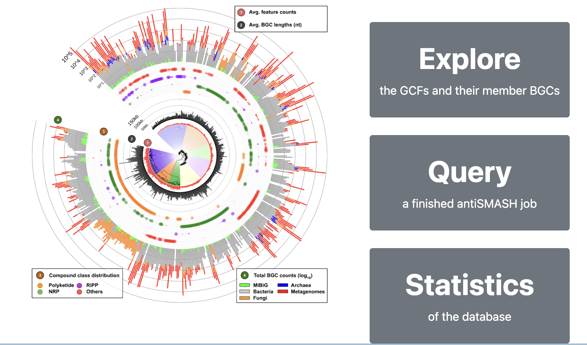
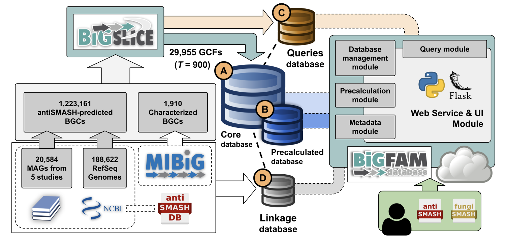
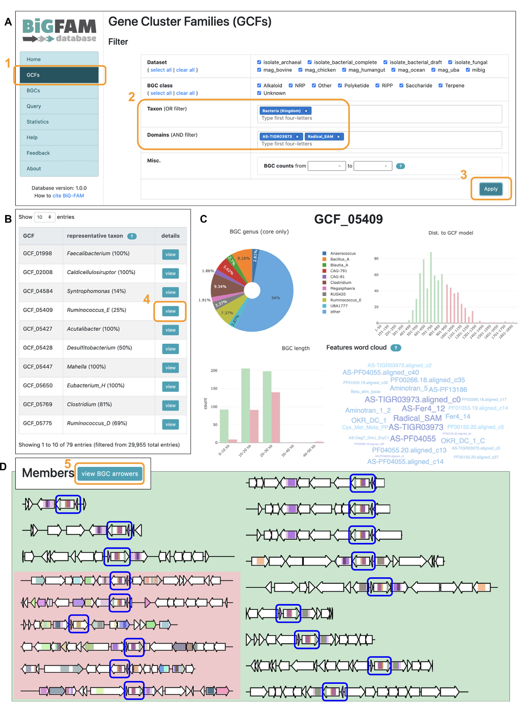
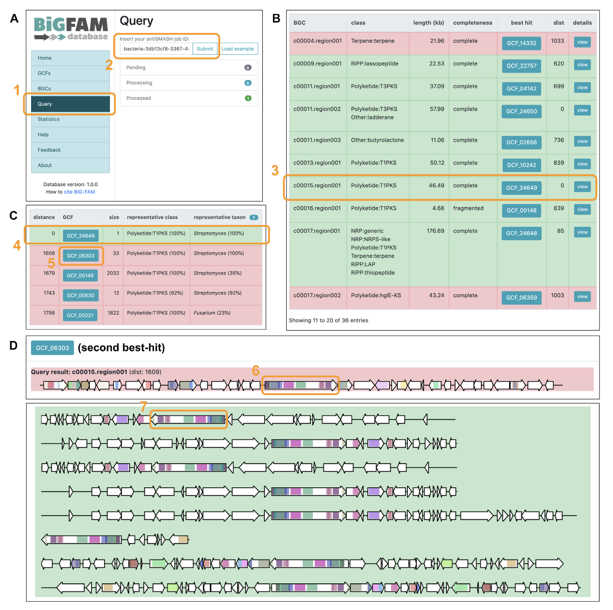

## Introduction

生物合成基因簇 (BGC) 的计算分析通过快速研究微生物基因组序列内的次级代谢潜力，彻底改变了天然产物的发现。将同源 BGC 分组为基因簇家族 (GCF) 有助于绘制其结构和分类多样性，并通过对已知功能的 BGC 进行去重复，提供对假定 BGC 新颖性的见解。

通过将从当前可用的基因组和 MAG 中鉴定出的大规模全球 BGC 集合作为数据源，BiG-FAM 提供了可探索的微生物次生代谢多样性“图集”，以浏览和搜索跨类群的生物合成多样性。 
BiG-FAM 有助于查询假定的 BGC，以便根据公开数据与其他已知和预测的 BGC 的关系，快速找到它们在多样性图上的位置，并更好地了解它们的新颖性或（可能的）功能。

BiG-FAM数据库（2020年）基于从多个公开可用来源获取的 1,225,071 个 BGC 的 GCF 聚类。这项大规模分析是使用 BiG-SLiCE 软件 和任意聚类阈值 (T=900.0) 进行的，结果构建了 29,955 个 GCF 模型，每个模型代表不同的蛋白质结构域和序列特征BGC。

**这个数据库一直没有更新，而最近几年又是宏基因组测序井喷的时候，里面的GCF数量肯定远低于现在已经发现的GCF，但稍微用一下做参考还是可以的（或者有想法可以自己跑一下更多公开数据说不定也是一篇NAR）**

BiG-FAM数据库在线访问：<https://bigfam.bioinformatics.nl>

## 数据库特征

### 超过120万个BGC的GCF数据
BiG-FAM数据库包含29,955个通过BiG-SLiCE 1.0版本计算的GCF，这些数据源自1,225,071个BGC的集合。这些BGC通过antiSMASH v5.1.1从188,622个微生物基因组（包括细菌、真菌和古菌基因组）以及20,584个MAG中预测得到，并补充了来自MIBiG 2.0数据库的实验验证BGC。所有基因组的完整列表及其BGC计数和分类信息见补充表。这些BGC及其对应的GCF涵盖了广泛的生物合成类别和分类群，提供了对微生物次级代谢多样性的全面覆盖。

### 数据库内容的无缝探索
基于BiG-SLiCE 1.0.0生成的核心SQLite3数据存储，作者使用Python Flask库构建了一个功能齐全的Web服务器。为了实现更流畅的浏览体验，特别是在计算密集型的网页中，作者额外实现了一层缓存存储，用于预取复杂SQL查询。此外，这种设置还实现了轻量级的“搜索和过滤”功能，使用户能够根据特定的分类群、来源数据集类型、生物合成类别或蛋白质域来查找BGC或GCF。

### 用户提交BGC的快速GCF定位
使用BiG-SLiCE的一个主要优势在于，每个GCF的共享BGC特征被总结在与底层BGC相同的基于欧几里得距离的特征矩阵中，形成GCF模型。这使得BGC到GCF的线性匹配成为可能，从而可以在几秒钟内将新测序的BGC定位到预计算的生物合成多样性全球图谱中。为了便于使用这一功能，BiG-FAM集成了一个基于Web的“查询”提交系统，用户可以直接提交通过antiSMASH预测的BGC进行GCF分析。生成的BGC到GCF匹配结果将揭示查询BGC的近缘和远缘关系，帮助研究其新颖性、与其他BGC的关系，以及跨分类群的分布和进化。

### 直接链接到BGC和基因组数据库
尽管BiG-FAM存储并展示了许多与BGC相关的有用信息，但它并非旨在成为一个BGC数据库，因此不包含与GCF无直接关联的信息。为了支持需要这些数据的用户，BiG-FAM存储了来自MIBiG和antiSMASH数据库的BGC元数据链接。这些交叉链接可用于获取更多信息，例如BGC产物的核心结构。此外，每个BGC的摘要页面还提供了原始基因组来源的链接，用户也可以从GCF页面下载合并的URL列表。

## 应用示例

### 探索Ranthipeptide BGC的多样性  
Ranthipeptides（曾被称为“SCIFF肽”）是一类核糖体合成并经翻译后修饰的肽（RiPPs），主要存在于梭菌纲（Clostridia）中，尽管GC含量分析表明其生物合成基因可能通过水平转移传播到其他分类群。近期研究表明，这些肽在群体水平调控中发挥重要作用，例如通过群体感应机制。在作者先前绘制120万个BGC全球多样性的研究中，作者捕获了6,800个推定的ranthipeptide BGC，这些BGC在前体肽侧翼的基因邻域表现出多样性。为了探索这种多样性，作者可以使用BiG-FAM的“GCF搜索”功能，并以该BGC类的两个标志性结构域（AS-TIGR03973和Radical_SAM）作为查询条件。搜索结果显示了79个GCF，每个GCF代表了不同的BGC分布模式及其分类学来源。通过点击每个GCF的详情页面链接，可以获取其分类来源、核苷酸长度、计算半径以及GCF内BGC共享的生物合成特征。此外，所有BGC的概览及其序列链接可以以TSV格式下载。多基因比较可视化功能还提供了ranthipeptide前体基因侧翼基因邻域多样性的整合视图。

### 对新测序链霉菌株的GCF分析  
最近，一株从突尼斯薰衣草根际土壤中分离的新链霉菌——Streptomyces tunisialbus的基因组草图被发布。为了展示BiG-FAM如何用于评估新测序BGC的生物合成新颖性并捕捉其远缘关系，作者从ENA下载了该基因组的组装数据，并将其上传至antiSMASH Web服务器，获得了一个唯一的任务ID。该ID可直接用于在BiG-FAM中进行GCF分析。对36个antiSMASH预测的BGC的完整分析在不到一分钟内完成，生成了最佳BGC-to-GCF匹配对的汇总表。其中一个有趣的BGC是来自“Region 15.1”的完整46.5 kb Type-I PKS基因簇，其在ClusterBlast和KnownClusterBlast结果中与公共数据库的基因簇匹配率较低。GCF分析结果显示，该BGC仅与一个单例GCF有显著匹配，进一步检查发现该GCF源自同一基因组的NCBI提交条目。这表明该PKS BGC代表了一种新型BGC，因为它与其他基因组中的GCF成员没有密切关系。通过“追踪”查询BGC的生物合成结构域，可以分析与数百至数千个远缘BGC的关系，展示基因之间的结构域架构相似性。

## Reference

Satria A Kautsar, Kai Blin, Simon Shaw, Tilmann Weber, Marnix H Medema, BiG-FAM: the biosynthetic gene cluster families database, Nucleic Acids Research, Volume 49, Issue D1, 8 January 2021, Pages D490–D497, https://doi.org/10.1093/nar/gkaa812