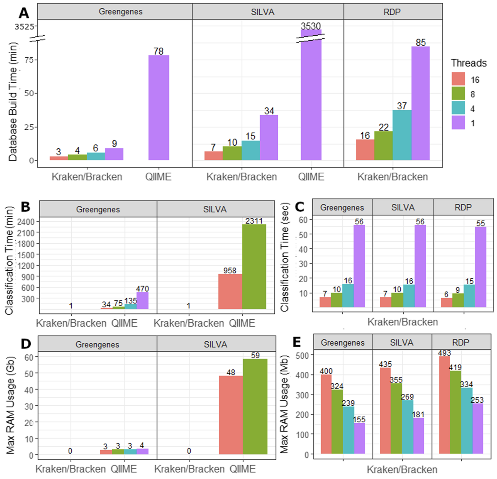
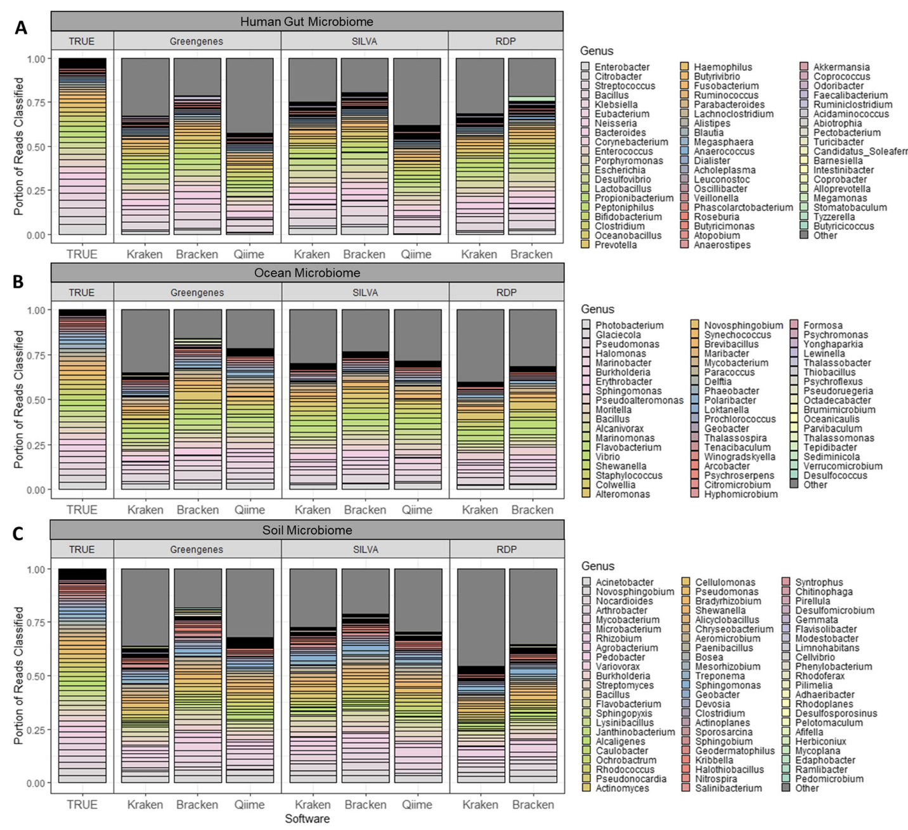
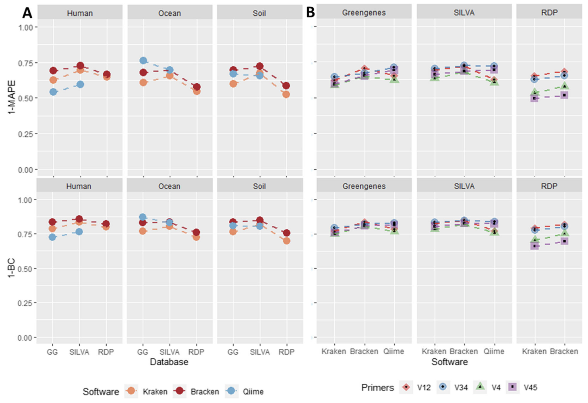

```{r include=FALSE}
knitr::opts_chunk$set(message = FALSE,warning = FALSE,eval = FALSE)
```

## Introduction

上次记录了一下qiime2的[扩增子分析流程](../amplicon-workflow)。但是实际使用时，在最后一步物种注释时卡住了，如果使用常用的`feature-classifier`方法，我尝试使用unite数据库鉴定了100条ITS序列，居然用了半个小时！尴尬的是，我有整整10万条ASV序列，这得跑到猴年马月。我想到做宏基因组时，千万级数量的reads用kraken做物种注释也不需要这么久，肯定有快的方法的。

然后发现Kraken用于16S已经有文章了：
Lu, J., Salzberg, S.L. Ultrafast and accurate 16S rRNA microbial community analysis using Kraken 2. Microbiome 8, 124 (2020). <https://doi.org/10.1186/s40168-020-00900-2>

Kraken 2现在支持16S rRNA数据库，可以直接与QIIME和类似系统进行比较。Kraken 2通过其独特的无对齐算法，能够在极短的时间内完成大量序列的分类，并且支持多线程处理，显著提升了分析效率。此外，Kraken 2还结合了Bracken工具，能够更精确地估计物种的相对丰度，尤其是在处理复杂微生物群落时表现出色。

但是Kraken2要用在ITS上的话目前是官方没有支持的，需要手动构建相应数据库，这个折腾了一会，具体方法放在后面了。

## Kraken效果

### 速度快



Kraken 2在速度上的表现非常突出。根据Lu和Salzberg的研究，Kraken 2在生成16S rRNA数据库时，比QIIME 2快得多。例如，使用单线程时，Kraken 2生成Greengenes数据库仅需9分钟，而QIIME 2则需要78分钟。对于更大的SILVA数据库，Kraken 2仅需34分钟，而QIIME 2则需要超过58小时。在分类速度上，Kraken 2同样表现出色，单线程下仅需1分钟即可完成一个样本的分类，而QIIME 2则需要35分钟（使用16线程时）。对于大规模数据分析，Kraken 2的速度优势尤为明显，能够显著缩短分析时间。

### 更精确



Kraken 2不仅在速度上占优，其分类精度也优于QIIME 2。研究显示，Kraken 2在分类16S rRNA序列时，能够更准确地识别物种，尤其是在处理复杂微生物群落时。Bracken工具进一步提升了Kraken 2的精度，能够更准确地估计物种的相对丰度。通过重新分配Kraken 2在属或更高分类水平上的分类结果，Bracken能够将分类结果细化到种水平，从而提供更精确的物种丰度估计。此外，Kraken 2的每读长分类功能使其能够为每个读长提供详细的分类信息，进一步提高了分析的准确性。



总的来说，Kraken 2和Bracken的组合为16S rRNA数据分析提供了一个快速、高效且精确的解决方案，特别适合处理大规模微生物群落数据。

## Kraken-16S

Kraken2是直接支持16S常用的三大数据库的(greengenes，rdp，silva)，用起来也非常简单：

```{bash}
#直接构建数据库，TYPE可选greengenes，rdp，silva
kraken2-build --db $DBNAME --special TYPE

#构建完成后就可以鉴定了，内存够的话，1min内都有结果
kraken2 rep-seqs/dna-sequences.fasta --db $DBNAME --out kraken_output --threads 4 --report kraken_report.txt -c 0.05

#可以借助taxonkit得到类似qiime2标准注释文件
cut -f3 kraken_output >tmpid
taxonkit lineage tmpid --data-dir $DBNAME/taxonomy/|taxonkit reformat --data-dir $DBNAME/taxonomy/ -P >tmpres

paste kraken_output tmpres |cut -f2,8>kraken_taxonomy
rm tmpid tmpres
```

## Kraken-ITS

ITS一般用Unite数据库注释，但这个kraken2不支持，我尝试将Unite数据库整理为greengenes的格式，然后用`build_gg_taxonomy.pl`生成names.dmp, nodes.dmp, seqid2taxid并建立kraken数据库，最后进行ITS序列鉴定是可行的。

具体步骤如下：
1. Unite官网下载fasta文件，<https://unite.ut.ee/repository.php> ，点击General FASTA release下载解压，我用的是sh_general_release_dynamic_all_04.04.2024.fasta文件。

2. 运行以下命令建立数据库，注意`split_fasta.py`和`build_gg_taxonomy.pl`在后面，记得拷贝过去用。

```{bash}
# 手动构建目录结构
mkdir ~/db/kraken_unite/
pushd ~/db/kraken_unite/
mkdir -p data taxonomy library
pushd data

# 用split_fasta.py把unite数据库提供的fasta格式整理为greengenes的
GG_VERSION=unite_all_04.04.2024
./split_fasta.py -i ../sh_general_release_dynamic_all_04.04.2024.fasta -o ${GG_VERSION}

# 用build_gg_taxonomy.pl进一步生成names.dmp, nodes.dmp, seqid2taxid
perl ../build_gg_taxonomy.pl "${GG_VERSION}_taxonomy.txt"
popd
mv data/names.dmp data/nodes.dmp taxonomy/
mv data/seqid2taxid.map .
mv "data/${GG_VERSION}.fa" library/unite.fna
popd

# 用kraken2-build构建用于注释的数据库
kraken2-build --db ~/db/kraken_unite --build --threads 4
```

3. 鉴定获得output文件

```{bash}
#1秒出结果
kraken2 rep-seqs/dna-sequences.fasta --db ~/db/kraken_unite/ --out kraken_output --threads 4 --report kraken_report.txt -c 0.05
```

4. 借助taxonkit获取标准注释文件，taxonkit这软件也很好用。
```{bash}
cut -f3 kraken_output >tmpid
taxonkit lineage tmpid --data-dir ~/db/kraken_unite/taxonomy/|taxonkit reformat  --data-dir ~/db/kraken_unite/taxonomy/ -P >tmpres

paste kraken_output tmpres |cut -f2,8>kraken_taxonomy
rm tmpid tmpres
```

最后的结果就是类似下面的形式：

```
0229a5c7f887dad960b40a0505cf9776	k__Fungi;p__Ascomycota;c__Saccharomycetes;o__Saccharomycetales;f__Saccharomycetales_fam_Incertae_sedis;g__Candida;s__Candida Candida_albicans
f88d9001e10f6d37672514972e6a199e	k__Fungi;p__Ascomycota;c__Saccharomycetes;o__Saccharomycetales;f__Saccharomycetales_fam_Incertae_sedis;g__Candida;s__Candida Candida_albicans
c3519270e269b92d3577ed450032bbc4	k__Fungi;p__Ascomycota;c__Eurotiomycetes;o__Eurotiales;f__Aspergillaceae;g__Penicillium;s__
```

补充脚本信息：

1.split_fasta.py：
```{python}
#!/share/home/jianglab/pengchen/miniconda3/bin/python3.9
import argparse

def process_fasta(input_file, unite_fa, unite_taxonomy):
    with open(input_file, 'r') as infile, open(unite_fa, 'w') as fa_out, open(unite_taxonomy, 'w') as tax_out:
        for line in infile:
            if line.startswith('>'):
                # Extract information from the header
                header = line.strip()
                parts = header.split('|')
                accession = parts[1]
                taxonomy = parts[-1]
                formatted_taxonomy = taxonomy.replace(';', '; ').replace(' ', '').replace(';', '; ')

                # Write to unite.fa
                fa_out.write(f">{accession}\n")

                # Write to unite_taxonomy.txt
                tax_out.write(f"{accession}\t{formatted_taxonomy}\n")
            else:
                # Write sequence lines to unite.fa
                fa_out.write(line)

def main():
    parser = argparse.ArgumentParser(description="Process a fasta file to generate unite.fa and unite_taxonomy.txt.")
    parser.add_argument("-i", required=True, help="Input fasta file")
    parser.add_argument("-o", required=True, help="Output prefix for unite.fa and unite_taxonomy.txt")
    args = parser.parse_args()

    input_file = args.i
    output_prefix = args.o

    unite_fa = f"{output_prefix}.fa"
    unite_taxonomy = f"{output_prefix}_taxonomy.txt"

    process_fasta(input_file, unite_fa, unite_taxonomy)

if __name__ == "__main__":
    main()
```

2.build_gg_taxonomy.pl : <https://github.com/DerrickWood/kraken2/blob/master/scripts/build_gg_taxonomy.pl>

3.taxonkit: https://github.com/shenwei356/taxonkit

## References
1. Lu, J., Salzberg, S.L. Ultrafast and accurate 16S rRNA microbial community analysis using Kraken 2. Microbiome 8, 124 (2020). https://doi.org/10.1186/s40168-020-00900-2
2. https://github.com/DerrickWood/kraken2/wiki/Manual#custom-databases
3. https://github.com/DerrickWood/kraken2/issues/97