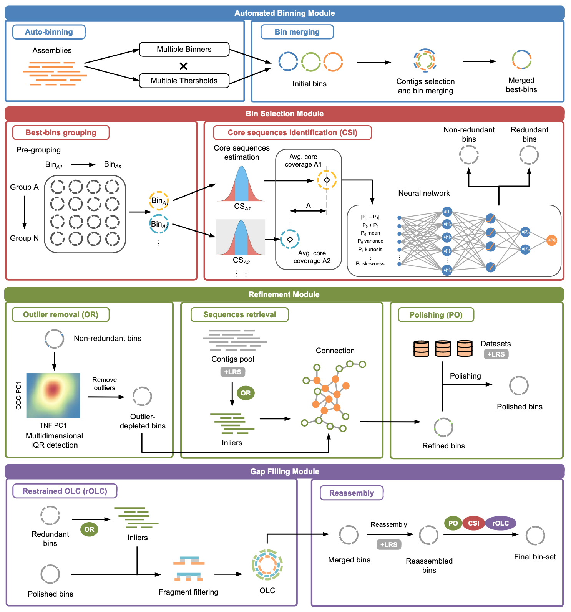
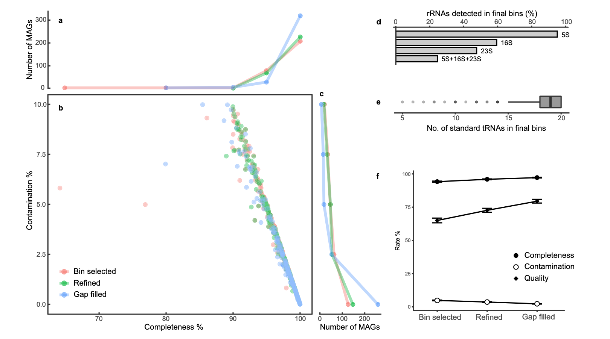
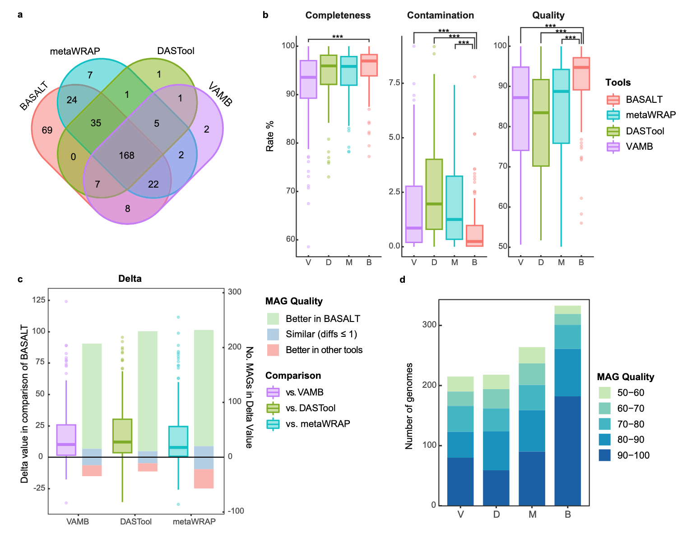
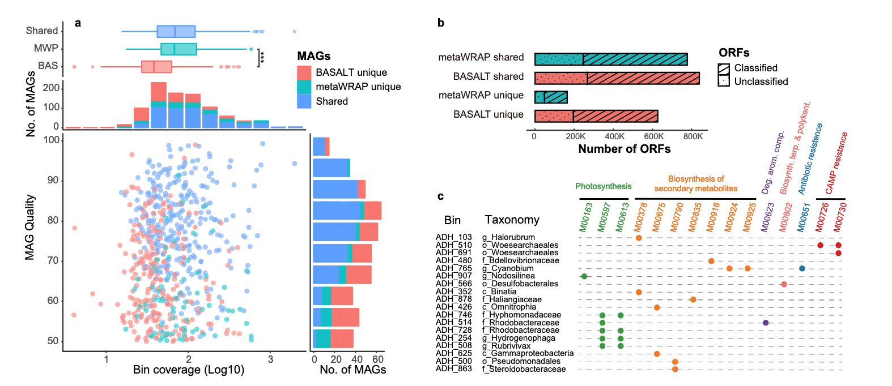
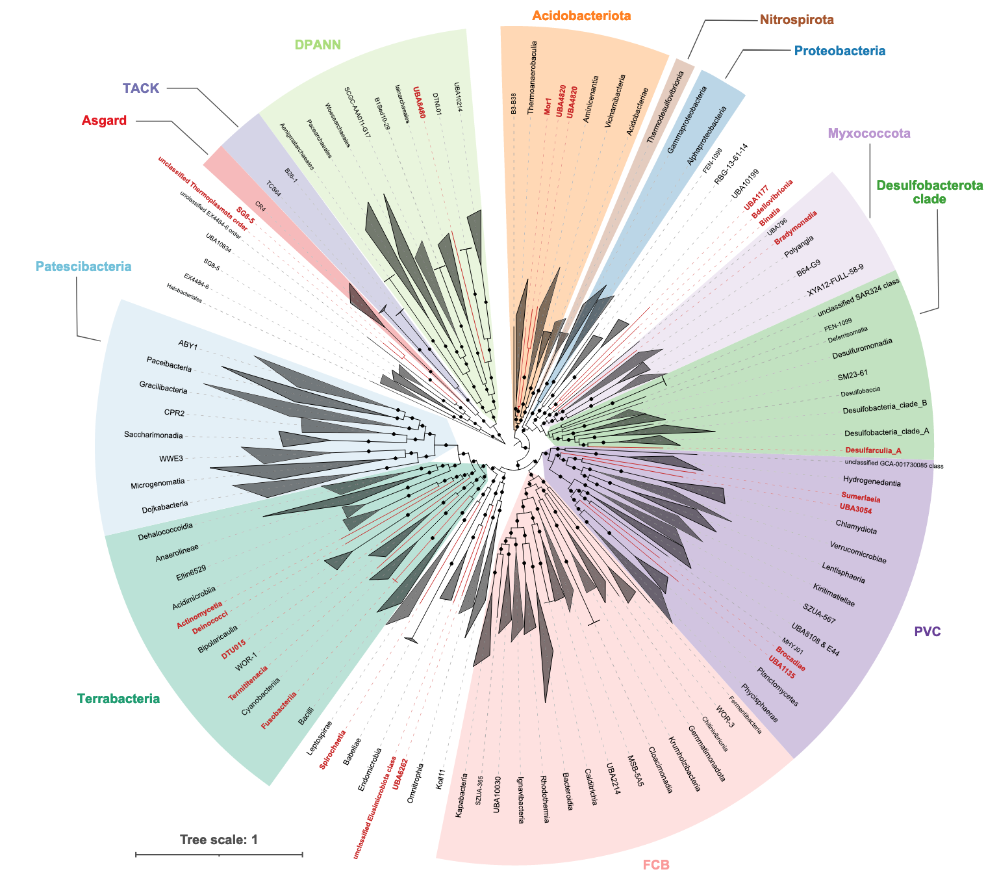
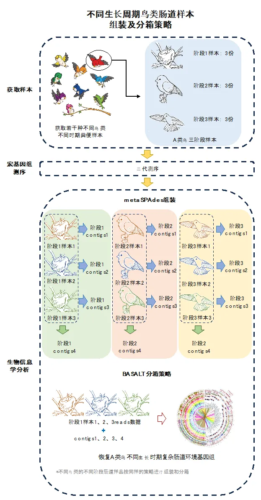

## Introduction

在微生物组学研究中，基因组binning（分箱，即将测序数据中的reads或contigs分类到不同的基因组中）是一个关键步骤。发表于2018年的MetaWRAP一直没有重大更新，这篇文章将介绍一个较新的binning流程：BASALT及其具体使用方法。

BASALT （Binning Across a Series of AssembLies Toolkit）是一个高效的基因组binning工具，旨在处理复杂的微生物组数据，特别是在多个组装（assemblies）之间进行binning时表现出色。它通过整合多个组装结果，提高了binning的准确性和完整性，尤其适用于处理高度复杂的微生物群落数据。

BASALT的文章于2024年发表于Nature Communications，软件主页：<https://github.com/EMBL-PKU/BASALT>。以下是BASALT的主要工作流程模块：



### 功能模块

BASALT由四个模块组成：**自动分箱（Automated Binning）**、**分箱选择（Bin Selection）**、**优化（Refinement）**和**缺口填充（Gap Filling）**。以下是各模块的详细工作流程：

1. **自动分箱模块**  
   首先，通过多个分箱工具（每个工具使用不同的阈值）将组装的contigs分类到不同的bin中，生成初始的binsets。接着，通过识别contig ID，将包含相似contig的bin合并为混合bin（hybrid bins）。然后，基于平均核苷酸一致性（ANI）对这些混合binsets进行分组，并通过覆盖度估计（coverage estimation）识别每组中的核心序列（Core sequence identification, CSI），用于比较组内每对bin中的内部序列（inliers）。随后，使用神经网络算法识别冗余bin，并保留非冗余bin用于后续的**离群值去除（Outlier removal, OR）**。

2. **分箱选择模块**  
   在优化模块中，结合四核苷酸频率（Tetranucleotide Frequency, TNF）和覆盖度相关系数（Coverage Correlation Coefficient, CCC），通过多维内部四分位距（Multidimensional Internal Quartile Range, IQR）检测来识别离群序列（outlier sequences）。接着，通过序列检索步骤（sequence retrieval），利用双端测序（Pair-End, PE）或长读长追踪（Long-Read Tracking）将未分箱的内部序列（un-binned inliers）从短读长（SR）和长读长（LR）contig池中连接并重新迭代，从而生成优化后的bin。成功映射到优化bin的reads会进一步进行抛光（polishing），生成抛光后的bin。

3. **优化模块**  
   在优化模块的最后一步，通过受限的重叠-布局-一致性程序（restrained Overlap–Layout–Consensus program, rOLC），将优化/抛光后的bin与相应的冗余bin进行重叠，然后在短读长（SRS）和长读长（LRS）数据的基础上进行重新组装。重新组装的bin会进一步抛光，并经过另一轮rOLC处理，最终生成最终的bin-set。

4. **缺口填充模块**  
   在缺口填充模块中，长读长测序数据（+LRS）可以用于补充和完善bin中的缺口区域，进一步提高bin的完整性和准确性。


### 效果评估

#### 利用CAMI数据集评估BASALT的性能

采用Critical Assessment of Metagenome Interpretation （CAMI）中的CAMI-high数据。使用二代+三代数据混装产生的组装文件，BASALT可以恢复其中的392个满足完整度 ≥ 50，污染度 ≤ 10的MAGs。经过基因组选择、优化和空缺填补每一个模块处理后，所产生的MAGs无论从完整度（Completeness）、污染度（Contamination）和总质量（完整度-5*污染度）上都有很大的提升。



#### 与其他主流软件的比较

在MAGs（宏基因组组装基因组）的评估中，采用了更为严格的质量标准，即**质量值（完整度 - 5 × 污染度）≥ 50**。通过对比VAMB、DASTool、metaWRAP和BASALT四个软件的处理结果，发现BASALT的表现显著优于其他工具。具体而言，BASALT比VAMB、DASTool和metaWRAP分别多获得了**63.7%**、**61.5%**和**33.3%**的MAGs，其中包括**69个独有的MAGs**（图a）。

在四个软件共同获得的**168个MAGs**中，BASALT生成的基因组质量也显著高于其他软件（图b）。两两比较的结果进一步显示，BASALT生成的MAGs质量普遍优于其他工具。具体来说，BASALT生成的**质量更好的MAGs数量**分别是VAMB的**9.6倍**、DASTool的**14.6倍**和metaWRAP的**6.1倍**（图c）。

此外，在高质量MAGs（质量值 > 90）的获取方面，BASALT的表现同样突出。与VAMB、DASTool和metaWRAP相比，BASALT获得的高质量MAGs数量分别是它们的**2.28倍**、**3.59倍**和**2.02倍**（图d）。




#### 真实数据集评估

除了测试数据集外，作者团队还选用了十个真实数据集，包括**SRS（短读长测序）**、**SRS+LRS（短读长+长读长测序）**以及**LRS（HiFi长读长测序）**数据，涵盖了盐湖沉积物、人类肠道、海水、南极土壤、活性污泥（AS）、鸡肠道、羊肠道、热泉、厌氧反应器（AD）等多种环境类型。以高度复杂的盐湖沉积物微生物群落样本为例（仅使用二代测序数据），BASALT比metaWRAP多获得了**30%的MAGs**，尤其在恢复低丰度MAGs方面表现出显著优势（图a）。在功能注释分析中，BASALT比metaWRAP多获得了47.6%的非冗余开放式阅读框（ORF）序列（图b），使得BASALT恢复的MAGs在功能模块上更加完整（图c）。



从盐湖沉积物样品中，BASALT共获得了**557个MAGs**，涵盖了**54个门**；而metaWRAP仅识别了**392个MAGs**，涵盖**45个门**，且这些门均被BASALT检测到（图5）。此外，BASALT独特地识别出了metaWRAP未能发现的**9个门**，其中包括**21个纲水平上的细菌分支**和**2个目水平上的古菌分支**（红色高亮分支）。这些独特的分支为挖掘复杂环境中未被探索的微生物及其功能元件提供了重要线索，进一步拓展了对微生物多样性和功能潜力的理解。




## 使用方法

### 安装

由于需要安装许多依赖项，推荐使用conda安装和管理BASALT，命令耗时较长，需要耐心等待：

```bash
# 我这里安装到~/biosoft/目录
cd ~/biosoft/
git clone https://github.com/EMBL-PKU/BASALT.git
cd BASALT
conda env create -n BASALT --file basalt_env.yml
```

然后要授权BASALT脚本。一般来说conda BASALT环境位于conda安装的子目录envs中。

```bash
chmod -R 777 ~/miniconda3/envs/BASALT/bin/*
```

然后下载神经网络训练模型，可以直接用1脚本下载，如果网络不好可以手动下载（或者在浏览器下载好再ftp上传到服务器）：

```bash
# 1.脚本下载训练模型
python BASALT_models_download.py

# 2.手动下载训练模型
wget https://figshare.com/ndownloader/files/41093033
mv 41093033 BASALT.zip
mv BASALT.zip ~/.cache
cd ~/.cache
unzip BASALT.zip
```

后续一般会用到checkM，所以也最好按照[上一篇文章](../binning2/#软件数据准备)下载配置一下相应数据库：
```bash
# 设置CheckM数据存储位置
checkm data setRoot ~/db/checkm
```

除上述conda方法外，还可以使用脚本直接安装或是利用singularity运行等方法，可参考<https://github.com/EMBL-PKU/BASALT>。

#### 测试数据

作者团队准备了测试文件以测试BASALT是否成功安装并且可以顺利运行。从<https://figshare.com/articles/dataset/BASALT_demo_files/22323424>下载测试文件（共三个：Data.tar.gz、Final_bestbinset.tar.gz、basalt.sh），然后执行下面的命令运行程序（该过程耗时大约六小时）：

```bash
unzip 22323424.zip
tar zxvf Data.tar.gz
cd Data/
BASALT -a assembly.fa -s sample1.R1.fq,sample1.R2.fq -l sample1.nanopore.fq -t 16 -m 300
```

### 命令参数

```
用法: BASALT [-h] [-a ASSEMBLIES] [-s SR_DATASETS] [-l LONG_DATASETS]  
              [-hf HIFI_DATASETS] [-c HI_C_DATASET] [-t THREADS] [-m RAM]  
              [-e EXTRA_BINNER] [-qc QUALITY_CHECK]  
              [--min-cpn MIN_COMPLETENESS] [--max-ctn MAX_CONTAMINATION]  
              [--mode RUNNING_MODE] [--module FUNCTIONAL_MODULE]  
              [--autopara AUTOBINING_PARAMETERS]  
              [--refinepara REFINEMENT_PARAMTER]  

  -h, --help  
                        显示帮助信息并退出。  
  -a ASSEMBLIES, --assemblies ASSEMBLIES  
                        组装序列文件列表，例如：`as1.fa,as2.fa`。  
  -s SR_DATASETS, --shortreads SR_DATASETS  
                        双端测序数据列表，例如：  
                        `r1_1.fq,r1_2.fq/r2_1.fq,r2_2.fq`（双端数据需使用`/`分隔）。  
                        注意，这里不是随便什么路径，要求一定要在同一个文件夹下。
  -l LONG_DATASETS, --longreads LONG_DATASETS  
                        包含ONT和PacBio长读长数据（不包括HiFi数据）。  
                        例如：`lr1.fq,lr2.fq`。  
  -hf HIFI_DATASETS, --hifi HIFI_DATASETS  
                        HiFi测序数据，例如：`hf1.fq,hf2.fq`。  
  -c HI_C_DATASET, --HIC HI_C_DATASET  
                        Hi-C测序数据列表，例如：`hc1.fq,hc2.fq`。  
  -t THREADS, --threads THREADS  
                        线程数，例如：`64`。  
  -m RAM, --ram RAM  
                        内存大小，最低建议`32G`。  
  -e EXTRA_BINNER, --extra_binner EXTRA_BINNER  
                        额外的分箱工具：  
                        `m`：MetaBinner  
                        `v`：Vamb  
                        例如：`-e m`表示在默认使用MetaBAT2、MaxBin2和CONCOCT的基础上，额外使用MetaBinner进行分箱。  
  -qc QUALITY_CHECK, --quality-check QUALITY_CHECK  
                        选择CheckM版本，默认`checkm`，可指定`checkm2`，例如：  
                        `-qc checkm2`用于质量检查。  
  --min-cpn MIN_COMPLETENESS  
                        过滤保留bin的最小完整度（默认`35`）。  
  --max-ctn MAX_CONTAMINATION  
                        过滤保留bin的最大污染度（默认`20`）。  
  --mode RUNNING_MODE  
                        运行模式：  
                        `new`：新建项目  
                        `continue`：继续运行  
                        例如：`--mode continue` / `--mode new`。  
  --module FUNCTIONAL_MODULE  
                        运行的功能模块（默认运行所有模块）：  
                        `autobinning`：自动分箱  
                        `refinement`：分箱优化  
                        `reassembly`：重新组装  
                        例如：`--module reassembly` 仅运行重新组装模块。  
  --autopara AUTOBINING_PARAMETERS  
                        自动分箱模式：  
                        `more-sensitive`（默认）  
                        `sensitive`  
                        `quick`  
                        例如：`--autopara sensitive`。  
  --refinepara REFINEMENT_PARAMTER  
                        分箱优化参数：  
                        `deep`（默认）  
                        `quick`  
                        例如：`--refinepara quick`。  
```

BASALT支持单一组装文件或多组装文件进行binning；在样品的物种非常相似，但群落中物种丰度不同的情况下，如时间序列样品，多组装文件可大幅度提高binning的效果，但也可能会导致运算时间过长，但作者推荐用多组装文件模式进行分箱分析。如果运算资源不足，推荐使用多组数据进行合并组装的组装文件进行后续的分箱分析。

1. 单独使用二代测序数据进行 binning 及修正，比较常用

```bash
BASALT -a as1.fa,as2.fa,as3.fa -s ds1_r1.fq,d1_r2.fq/d2_r1.fq,d2_r2.fq -t 60 -m 250
```

2. 使用二代测序数据及三代测序数据进行 binning 及修正  

```bash
BASALT -a as1.fa,as2.fa,as3.fa -s ds1_r1.fq,d1_r2.fq/d2_r1.fq,d2_r2.fq -l lr1.fq,lr2.fq -t 60 -m 250
```

3. 使用 HiFi 数据及二代测序数据进行 binning 及修正  

```bash
BASALT -a as1.fa -hf hifi1.fq -s ds1_r1.fq,d1_r2.fq -t 60 -m 250
```

4. 使用 BASALT 进行基因组的获取，并融合已有的基因组数据  

```bash
BASALT -a as1.fa,as2.fa,as3.fa -s ds1_r1.fq,d1_r2.fq/d2_r1.fq,d2_r2.fq -d m_binset -t 60 -m 250
```

5. 使用 BASALT 进行外源数据基因组的去冗余  

**(a) 数据输入（Data feeding）**  
    
```bash
BASALT -s sample1.R1.fq,sample1.R2.fq/sample2.R1.fq,sample2.R2.fq -d mbin,dbin -t 60 -m 250
```

该命令会生成 `Date_feeded` 文件夹，其中包含：
- 修改 index 后的组装文件，如 `500_mbin.fa`  
- 基因组文件夹，如 `500_mbin.fa_BestBinsSet`  
- 覆盖率文件，如 `Coverage_matrix_for_binning_500_mbin.fa.txt`  
- 修改格式后的 reads 文件  

**(b) 基因组去冗余（De-replication）**  
    
```bash
BASALT -b 500_mbin.fa_BestBinsSet,501_dbin.fa_BestBinsSet \
-c Coverage_matrix_for_binning_500_mbin.fa.txt,Coverage_matrix_for_binning_501_mbin.fa.txt \
-a 500_mbin.fa,501_mbin.fa \
-s sample1.R1.fq,sample1.R2.fq/sample2.R1.fq,sample2.R2.fq -t 60
```

该命令输入多个基因组文件夹、组装文件、reads 和覆盖率文件，最终生成去冗余后的基因组文件夹 `BestBinset`。

6. 使用 BASALT 进行基因组的修正  

```bash
BASALT -r BestBinset \
-c Coverage_matrix_for_binning_500_mbin.fa.txt,Coverage_matrix_for_binning_501_mbin.fa.txt \
-a 500_mbin.fa,501_mbin.fa \
-s PE_r1_sample1.R1.fq,PE_r2_sample1.R2.fq/PE_r1_sample2.R1.fq,PE_r2_sample2.R2.fq -t 60
```

该命令会生成 `BestBinset_outlier_refined` 文件夹，存储优化后的基因组。


### 具体示例



#### 项目背景

在鸟类生长的不同阶段，采集了若干种鸟类的粪便样本，通过宏基因组二代测序分析它们的微生物组。每个样本根据鸟类不同的生长周期进行了采集，并使用 **metaspades** 软件对数据进行单个样本的组装。在得到单个样本的组装结果后，进一步对同种鸟类在同一生长周期的多个平行样本的数据进行合并组装，以便获取更丰富的群落信息，辅助后续的分箱处理。

#### 组装策略

1. **单个样本组装**：使用 **metaspades** 对每个鸟类在不同生长周期的粪便样本进行单样本组装。
2. **多样本合并组装**：将同一生长周期、同种鸟类的多个平行样本进行合并组装，以提高组装的完整性和准确性。
3. **分箱处理**：在完成组装后，进行基于二代测序数据的分箱，获取更准确的基因组信息。

以A鸟样本为例

样本数据：
- **A类鸟阶段1样本**：
  - sampleA_s1_1_R1.fq, sampleA_s1_1_R2.fq
  - sampleA_s1_2_R1.fq, sampleA_s1_2_R2.fq
  - sampleA_s1_3_R1.fq, sampleA_s1_3_R2.fq

- **A类鸟阶段2样本**：
  - sampleA_s2_1_R1.fq, sampleA_s2_1_R2.fq
  - sampleA_s2_2_R1.fq, sampleA_s2_2_R2.fq
  - sampleA_s2_3_R1.fq, sampleA_s2_3_R2.fq

- **A类鸟阶段3样本**：
  - sampleA_s3_1_R1.fq, sampleA_s3_1_R2.fq
  - sampleA_s3_2_R1.fq, sampleA_s3_2_R2.fq
  - sampleA_s3_3_R1.fq, sampleA_s3_3_R2.fq

组装结果：
- **阶段1单样品组装结果**：
  - sampleA_s1_1_assembly.fa, sampleA_s1_2_assembly.fa, sampleA_s1_3_assembly.fa
- **阶段2单样品组装结果**：
  - sampleA_s2_1_assembly.fa, sampleA_s2_2_assembly.fa, sampleA_s2_3_assembly.fa
- **阶段3单样品组装结果**：
  - sampleA_s3_1_assembly.fa, sampleA_s3_2_assembly.fa, sampleA_s3_3_assembly.fa
- **阶段1多样品合并组装结果**：
  - sampleA_s1_assembly.fa
- **阶段2多样品合并组装结果**：
  - sampleA_s2_assembly.fa
- **阶段3多样品合并组装结果**：
  - sampleA_s3_assembly.fa

分箱命令：

- **阶段1样品分箱命令**：
```bash
BASALT -a sampleA_s1_assembly.fa, sampleA_s1_1_assembly.fa,sampleA_s1_2_assembly.fa,sampleA_s1_3_assembly.fa \
-s sampleA_s1_1_R1.fq,sampleA_s1_1_R2.fq/sampleA_s1_2_R1.fq,sampleA_s1_2_R2.fq/sampleA_s1_3_R1.fq,sampleA_s1_3_R2.fq \
-t 60 -m 250
```

### 注意事项

#### 输入输出

BASALT的程序输入 -a,-s等参数不是任意文件的路径，而是要把这些文件放置到脚本运行同一文件夹下，因为'/'已经被用作文件之间的分隔符了。并且BASALT还不能设定输出路径，在输出时候自动将结果及重要过程文件输出至当前工作路径下，建议用户将需要分析的文件单独建立文件夹存放和运行BASALT，以免重复输出覆盖原有结果。用起来有点麻烦。

#### 运行速度

在使用单个组装文件时，BASALT的完整流程耗时通常比metaWRAP长，尤其随着样品复杂度的增加，耗时差异会更加显著。然而，文章中也提到，即便不运行gap filling模块，BASALT在基因组质量和数量上通常优于metaWRAP。实际上，在多个组装文件输入模式下，BASALT的效率反而高于metaWRAP，因为BASALT仅需运行一次，且其单独组装、合并组装和去冗余的流程有助于大大提高非冗余基因组的产出。如果用户对基因组的深度挖掘需求不高，且需要加速分箱过程，以下几种策略可能会有所帮助：

1. **使用MetaBAT2 + Semibin2作为初始Binners**：这可以显著加快auto-binning的过程。
2. **只运行auto-binning、bin selection和refinement模块**：跳过gap filling模块可以有效减少运行时间。
3. **仅使用合并组装文件**：在同时输入多个样品时，使用单一的合并组装文件（例如：sampleA1A2A3_assembly.fa）可以减少auto-binning的计算时间，但也可能会减少基因组的产出量。


## References
1. Qiu, Z., Yuan, L., Lian, CA. et al. BASALT refines binning from metagenomic data and increases resolution of genome-resolved metagenomic analysis. Nat Commun 15, 2179 (2024). https://doi.org/10.1038/s41467-024-46539-7
2. https://github.com/EMBL-PKU/BASALT
3. https://mp.weixin.qq.com/s/TlxaiQGjoiE3c0Onqatu8A
