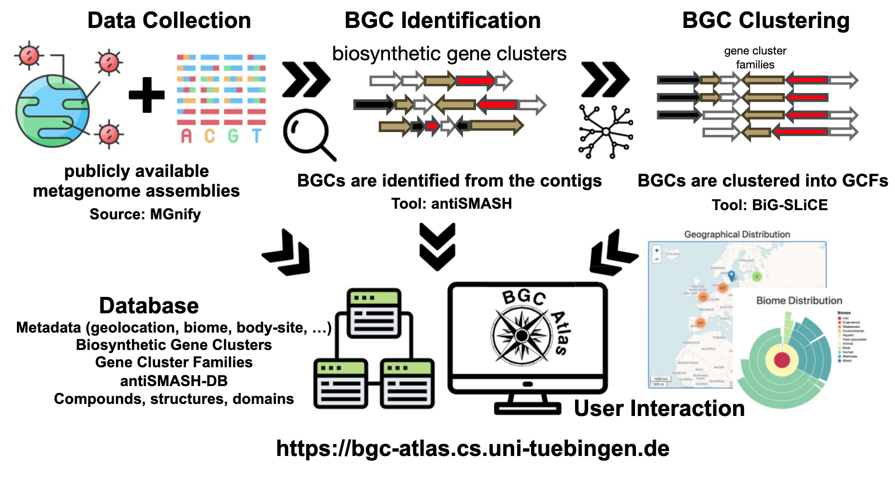
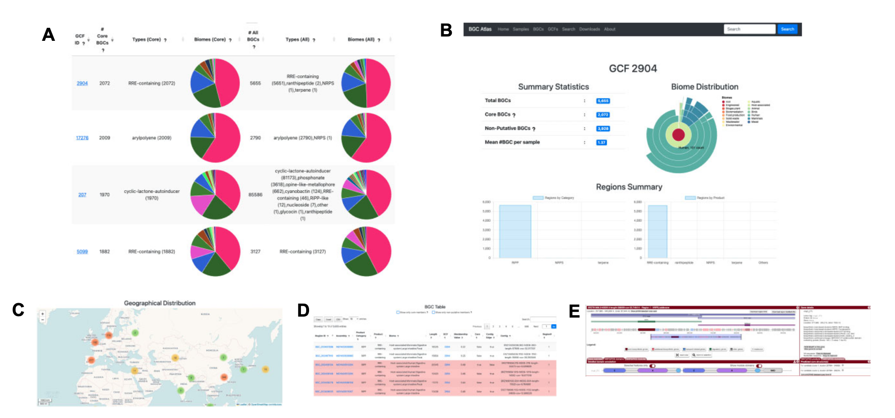

## Introduction

次级代谢产物（Secondary Metabolites）是微生物在生长过程中产生的非必需化合物，尽管对微生物自身的生长发育并非不可或缺，却在生态和生理功能中扮演着重要角色。这些化合物在医药、生物技术和农业领域具有广泛的应用潜力。它们的合成由生物合成基因簇（Biosynthetic Gene Clusters, BGCs）编码，这些基因簇共同指导次级代谢产物的生物合成。随着宏基因组学技术的发展，研究人员能够直接从环境样本中研究BGCs，发现了许多编码全新化学结构的未知基因簇。  

上次介绍过一下生物合成基因簇家族（GCF）相关的[Big-Fam数据库](../gcf-big-fam)，但它的源数据来自培养的微生物基因组或存放在公共存储库中的MAG的数据。而且它不提供相应数据的下载，上传还是AntiSmash的id，想要跟自己宏基因组产生的大量BGCs比较不太可能。

本文介绍一个比较新的名为**BGC Atlas**的网络资源（[https://bgc-atlas.cs.uni-tuebingen.de](https://bgc-atlas.cs.uni-tuebingen.de)），它为探索和分析宏基因组中的BGC多样性提供了便捷的工具。该工具最近发表在了NAR上：

Caner Bağcı, et.al, BGC Atlas: a web resource for exploring the global chemical diversity encoded in bacterial genomes, Nucleic Acids Research, Volume 53, Issue D1, 6 January 2025, Pages D618–D624, https://doi.org/10.1093/nar/gkae953

BGC Atlas从公开数据集中识别并聚类BGCs，提供了一个集中化的数据库和网络界面，支持基于元数据的BGC和基因簇家族（Gene Cluster Families, GCFs）的探索。通过对MGnify平台上超过35,000个数据集的分析，BGC Atlas识别了近180万个BGCs，并将其聚类为GCFs。分析结果显示，核糖体合成并经翻译后修饰的肽类（RiPPs）是最丰富的化合物类别，且大多数GCFs表现出高度的环境特异性。  

## Database

### 数据收集与预处理  

研究者从公共数据库MGnify收集了宏基因组数据集及其对应的元数据。这些数据集涵盖了海洋、土壤、人体相关及其他环境样本。对于每个样本，研究者获取了FASTA格式的组装contigs以及描述样本环境和生物学背景的元数据（上图）。

### BGC识别  
使用antiSMASH（版本7.0.0）识别BGCs，参数设置为`--clusterhmmer --tigrfam --asf --cc-mibig --cb-subclusters --cb-knownclusters --pfam2go --rre --tfbs --genefinding-tool prodigal-m --allow-long-headers`。antiSMASH提供了全面的注释信息，包括次级代谢产物类型、预测的化学结构和功能域，并构建了antiSMASH-DB用于存储和比较BGCs。

### BGC聚类  

使用BiG-SLiCE（版本2.0.0）将BGCs聚类为基因簇家族（GCFs），基于序列相似性和域结构进行分组，形成非冗余的GCFs集合（上图）。聚类过程分为两步：  
1. **初始聚类**：对antiSMASH标注为完整的BGCs进行聚类，距离阈值为0.4，确保核心簇定义明确。  
2. **部分BGCs分配**：将antiSMASH标注为“on contig edge”的部分BGCs和MIBiG数据库中的已知化合物分配到预定义的簇中，距离阈值同样为0.4，保留最佳匹配结果。

### 数据库与网络界面

BGC识别和聚类结果存储在PostgreSQL数据库中，支持复杂查询和高效数据管理。研究者还开发了BGC Atlas的网络界面，基于node.js、express、pug、leaflet和bootstrap构建，提供以下功能：  
- **BGC和GCF探索**：浏览BGCs、查看详细注释及其在不同环境中的分布。  
- **元数据整合**：将BGC数据与环境元数据结合，支持生态和进化分析。  
- **查询功能**：用户可输入BGC序列，使用BiG-SLiCE查询模式在数据库中搜索相似簇，结果以表格形式展示输入BGC与最接近GCF的距离。

BGC Atlas 提供了多种视图和功能，用于探索宏基因组样本、BGCs 和 GCFs。所有视图均支持基于自由文本或元数据特征的搜索和过滤。通过“Filter”菜单，用户可以使用布尔逻辑组合多个条件进行查询，例如搜索来自“Arctic”（地理位置特征）环境的“Marine”（生物群落特征）BGCs。

- **Samples 视图**：展示所有分析样本及其元数据特征，用户可通过antiSMASH界面进一步探索这些样本。  
- **BGCs 视图**：显示数据库中所有BGCs的表格，支持过滤功能以进行更具体的查询。  
- **GCFs 视图**：展示所有GCFs的表格，选择特定GCF后，“BGCs”视图将仅显示该GCF的成员BGCs。  

这种设计使用户能够在不同视图之间切换，结合详细注释和分布信息，深入比较分析BGCs及其所属GCFs，并通过元数据探索其生态学意义（上图）。

## Result

### BGC结构类别的分布  

研究者对MGnify的35,486个数据集进行了初步分析，发现了约185万个BGCs，分布于多种环境样本中。其中，绝大多数（88.7%）BGCs被antiSMASH标注为“on contig edge”，表明它们的不完整性，这主要是由于宏基因组测序通常产生较短的contigs。尽管如此，超过一半（51.7%）的BGCs长度仍超过5 kb，完整BGCs的中位长度约为21 kb。

在分析的BGCs中，**核糖体合成并经翻译后修饰的肽类（RiPPs）**占比最高（52.3%），其中环内酯自诱导物是最常见的产物类型（16.5%）。RiPPs的高比例可能与数据库中宿主相关样本的过度代表性有关。多项研究表明，RiPPs是人类微生物组中最常见的BGC类别，特别是在乳酸菌基因组中，其占比可高达76%。其他显著的结构类别包括**萜类**、**非核糖体肽**和**聚酮类**，这些类别共同构成了宏基因组中观察到的化学多样性。研究者还发现，不同生物群落中产物类别的分布存在显著差异。例如，萜类主要存在于陆地环境样本中，而RiPPs在宿主相关样本中最为丰富。

### 基因簇家族（GCFs）的栖息地特异性  

聚类分析显示，GCFs表现出显著的栖息地特异性，表明某些BGCs适应了特定的环境条件。总体而言，76%的GCFs（至少包含5个BGC成员）仅存在于一种特定栖息地中，这强调了微生物次级代谢的生态专一性。

在MGnify生物群落分类的第一层级（宿主相关、环境、工程和混合）中，几乎所有GCFs都局限于某一特定类别。这种高度特异性在第二层级（如宿主相关样本中的人类、哺乳动物和鸟类）中依然存在，表明大多数GCFs对特定宿主类型具有专一性。在第三层级（如人类样本中的消化系统与皮肤），这种趋势继续延续，表明GCF特异性甚至延伸到宿主体内的不同部位。然而，随着分类的细化，栖息地特异性逐渐减弱。例如，在第四层级（如人类消化系统中的大肠与后肠），GCFs的专一性下降，表明某些GCFs虽然适应了更广泛的环境（如人类消化系统），但也可能存在于更细分的生态位中。

在环境样本中也观察到了类似的模式。这些样本在第一层级被广泛分类，而在第二层级（如水生与陆地）中，大多数GCFs仍然高度特异性于这些不同的环境类型。在第三层级（如水生样本中的淡水与海洋），GCFs仍然主要特异性于特定的水生栖息地。然而，到了第四层级（如淡水样本中的地下水、静水与流水），栖息地特异性开始减弱，表明某些GCFs虽然适应了更广泛的水生环境，但也可能存在于更狭窄的亚栖息地中。

对某些GCFs的详细分析揭示了显著的栖息地特异性模式。例如，**GCF2487**（一种萜类生产簇）仅在全球的河口样本中发现，凸显了其对该特定环境的适应性。另一方面，**GCF12495**（一种长度约50 kb的非核糖体肽合成酶BGC家族）仅在来自欧洲、东南亚和北美的哺乳动物粪便样本中被发现。这些特异性BGCs的生态作用表明，微生物可能采用了特定的适应策略以在其各自环境中繁衍生息。

## Reference

Caner Bağcı, Matin Nuhamunada, Hemant Goyat, Casimir Ladanyi, Ludek Sehnal, Kai Blin, Satria A Kautsar, Azat Tagirdzhanov, Alexey Gurevich, Shrikant Mantri, Christian von Mering, Daniel Udwary, Marnix H Medema, Tilmann Weber, Nadine Ziemert, BGC Atlas: a web resource for exploring the global chemical diversity encoded in bacterial genomes, Nucleic Acids Research, Volume 53, Issue D1, 6 January 2025, Pages D618–D624, https://doi.org/10.1093/nar/gkae953

