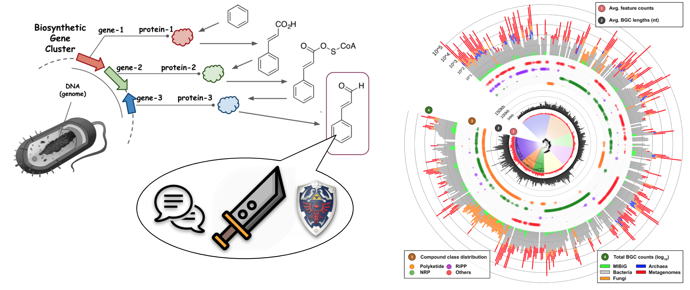
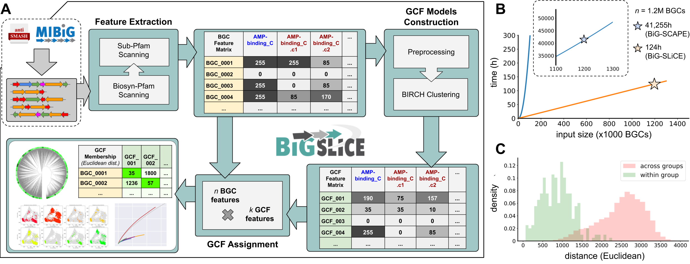
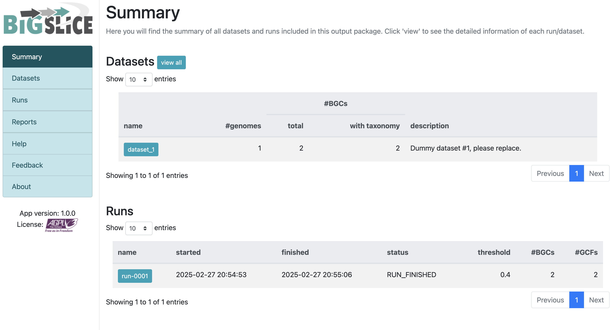

## Introduction

随着基因组挖掘技术的进步，生物合成基因簇（BGCs）的研究已成为天然产物发现的核心环节。目前，超过20万个公开的微生物基因组中蕴藏着丰富的化学多样性信息。然而，现有的工具在处理大规模BGCs时，常因基于网络的聚类方法效率低下而面临瓶颈。

BiG-SLiCE（Biosynthetic Gene clusters - Super Linear Clustering Engine） 应运而生，这是一款专为高效聚类大规模BGCs而设计的工具。它通过将BGCs映射到欧几里得空间，以近乎线性的方式将BGCs分组为基因簇家族（GCFs）。在短短10天内，BiG-SLiCE成功分析了来自209,206个微生物基因组和宏基因组组装基因组（MAGs）的1,225,071个BGCs，并构建了全球次级代谢多样性的分布图谱，揭示了未被开发的生物合成潜力。此外，BiG-SLiCE还提供了“查询模式”，能够快速将新测序的BGCs归类到已有的GCFs中，并配备了强大的可视化引擎，便于用户探索数据。这一工具不仅加速了天然产物的发现，还为构建全球可搜索的BGC网络奠定了基础。

BiG-SLiCE的开源地址：https://github.com/medema-group/bigslice



BGCs（以及GCFs）与催化酶及其编码途径产生的化合物直接相关，因此可以作为探索微生物次级代谢化学空间的代理。通过编目所有已测序微生物基因组中的GCFs，可以全面了解现有的化学多样性，并为未来的先导化合物发现提供方向。例如，可以重点关注具有新颖潜力的物种，或识别已知抗生素生产BGC的天然变体。然而，进行此类全球分析需要能够处理海量数据的聚类算法。尽管过去五年中工具的处理能力有所提升（从2014年的11,000–33,000个BGCs到2019年的73,260个），但与当前可用数据量相比仍显不足。截至2020年3月27日，antiSMASH-DB和IMG-ABC两大BGC数据库共包含565,096个BGCs，预测自85,221个细菌基因组。若考虑未覆盖的基因组和宏基因组，这一数字将更大。例如，NCBI RefSeq数据库中的约180,000个细菌基因组可能产生超过1,000,000个BGCs。

处理如此大规模的数据集，即使是目前最快的工具（如BiG-SCAPE）在36核CPU上也需要约37,000小时运行时间，这在实际中几乎不可行。主要瓶颈在于构建相似性网络和聚类分析时使用的成对BGC比较方法，其时间复杂度为O(n²)。因此，迫切需要一种能够更好适应基因组数据增长的替代方法。为此，研究者开发了**BiG-SLiCE**（Biosynthetic Genes Super-Linear Clustering Engine），它将BGCs映射到欧几里得空间，采用分区聚类算法，时间复杂度接近线性[∼O(n)]，从而能够快速分析大规模BGC数据集，实现真正全球化的GCF分析。



为了实现大规模分析，**BiG-SLiCE**在设计时将**可扩展性和速度**作为首要目标。与之前的工具**BiG-SCAPE**（能够敏感捕捉BGCs之间域结构和序列相似性的细微差异）不同，BiG-SLiCE能够在36核CPU、128GB内存的机器上，以不到一周的时间处理超过120万个BGCs的输入数据，同时保持足够的灵敏度以区分输入BGCs中的关键生物合成“信号”。此外，为了便于用户探索和分析结果，BiG-SLiCE还提供了交互式、易于使用的可视化输出，且对软硬件要求极低。

## Installation

安装方法非常简单，用以下两种选一个即可 

1. **从PyPI安装（稳定版）**  
```bash
pip install bigslice
```

2. **从源码安装（开发版——仅适用于熟悉操作的用户）**  
```bash
pip install git+https://github.com/medema-group/bigslice.git
```

然后下载最新的HMM模型（约271MB压缩文件）  
```bash
download_bigslice_hmmdb
```

如果感觉下载太慢了，也可以手动下载：<https://github.com/medema-group/bigslice/releases/download/v2.0.0rc/bigslice-models.2022-11-30.tar.gz>，下载后重命名为bigslice_models.tar.gz放到`whcih download_bigslice_hmmdb`的统一目录下再运行即可，就会跳过下载步骤。


最后检查安装是否成功  
```bash
bigslice --version
```

成功安装后，将显示如下信息：  
```
==============
BiG-SLiCE version 2.0.0
HMM databases version: bigslice-models-2022-11-30
Biosynthetic-pfam md5: 37495cac452bf1dd8aff2c4ad92065fe
Sub-pfam md5: 2e6b41d06f3c318c61dffb022798091e
==============
```

## Usage

### BiG-SLiCE 运行模式  

#### **[模式1] 聚类分析**  
解析输入数据集，构建GCF模型（BIRCH聚类），并根据指定阈值（T）进行成员分配。  

**参数说明**：  
- `-i|--input_folder <folder_path>`：输入文件夹路径，需包含 `datasets.tsv` 文件及数据集子文件夹。  
- `--resume`：继续上一次的聚类运行（不要与 `--input_folder` 同时使用）。  
- `--complete`：构建GCF模型时，仅使用完整的BGCs（antiSMASH > 4.2 标注为 `on_contig_edge = False` 的BGCs）。  
- `--threshold`：用于GCF模型构建（BIRCH算法）和成员分配的聚类阈值（T）。与 `--threshold_pct` 互斥，使用 `-1` 关闭此参数（默认：300）。  
- `--threshold_pct`：基于数据间成对距离的随机采样计算聚类阈值（T），取第N百分位值作为阈值。与 `--threshold` 互斥，使用 `-1` 关闭此参数（默认：-1）。  

#### **[模式2] GCF查询**  
基于[模式1]生成的GCF模型，从输入文件夹中的BGC GenBank文件中提取特征并进行成员分配。  

**参数说明**：  
- `--query <folder_path>`：输入文件夹路径，需包含所有BGC的GenBank文件（支持antiSMASH4的 `clusterXXX.gbk`、antiSMASH5的 `regionXXX.gbk` 或MIBiG ≥ 2.0的 `BGCXXXXXXX.gbk`）。  
- `--query_name`：为查询运行指定唯一名称，便于在输出可视化中追踪。  

#### **[模式1+2] 通用参数**  
适用于聚类和查询模式的参数。  

**参数说明**：  
- `--run_id`：指定运行ID进行查询（或继续聚类），而非使用最新运行（可在输出可视化中查看运行ID列表）。  
- `--n_ranks <N_RANKS>`：为每个BGC的成员分配过程取N个最佳GCF匹配（默认：5）。  
- `--program_db_folder <PROGRAM_DB_FOLDER>`：HMM库路径（默认：`/mnt/local_scratch/kauts001/general-env/bin/bigslice-models`）。  

#### **CPU/RAM优化**  
- `-t|--num_threads`：并行运行的作业数（默认：56）。  
- `--hmmscan_chunk_size`：将 `biosyn_pfam` 扫描拆分为每组N个BGCs的块（默认：100）。  
- `--subpfam_chunk_size`：将 `sub_pfam` 扫描拆分为每组N个BGCs的块（默认：100）。  
- `--extraction_chunk_size <EXTRACTION_CHUNK_SIZE>`：将特征提取拆分为每组N个BGCs的块（默认：100）。  
- `--scratch`：不将Sqlite3数据库加载到内存中（降低RAM使用，但可能降低速度）。  

#### [Misc] 其他可选参数：
- `-h, --help`
显示帮助信息。
- `--export-tsv <folder_path>`
将现有的预计算输出数据导出为TSV格式文件（指定目标文件夹路径）。
- `--program_db_folder PROGRAM_DB_FOLDER`
指定HMM库的路径（默认路径：/share/home/jianglab/pengchen/miniconda3/envs/antismash_5.2.0/bin/bigslice-models）。
- `--version`
显示BiG-SLiCE的版本信息。

### Example

可以使用提供的示例输入文件夹进行“最小化”测试运行：

下载<https://github.com/medema-group/bigslice/tree/master/misc/input_folder_template>这个文件夹，里面只有1个dataset，1个genome，2个gbk。

```bash
bigslice -i input_folder_template/ test_out/
```

这里我遇到了一个问题：
```
AttributeError: 'pyhmmer.plan7.TopHits' object has no attribute 'query_accession'
```

应该是pyhmmer的版本问题，我尝试安装v0.10.7版本后解决：

```
pip install pyhmmer==0.10.7
```

通过以上步骤，可以轻松安装并运行 BiG-SLiCE，开始大规模 BGC 聚类分析！我测试了运行了2min，消耗内存160MB

### Input files

为了充分利用BiG-SLiCE的强大功能，其输入的BGC文件需要按数据集和基因组的结构进行组织。一个典型的输入文件夹可能如下所示：

```
input_folder/
│
├── datasets.tsv
│
├── dataset_1/
│   ├── genome_1A/
│   │   ├── genome_1A.region001.gbk
│   │   ├── genome_1A.region002.gbk
│   │   └── ...
│   ├── genome_1B/
│   └── ...
│
├── dataset_2/
│   ├── genome_2A/
│   └── ...
│
├── dataset_3/
│   ├── genome_3A/
│   └── ...
│
└── taxonomy/
    ├── taxonomy_dataset_1.tsv
    ├── taxonomy_dataset_2.tsv
    └── ...
```

- datasets.tsv 文件

该文件需要严格命名为 datasets.tsv，并放置在输入文件夹的根目录中。它是一个描述所有BGC元数据的文件，BiG-SLiCE使用它来解析输入文件夹中的所有BGC数据。该文件应该是一个以制表符分隔的文件（.tsv），每一行按以下顺序包含以下内容：
	•	数据集名称
	•	数据集文件夹的路径（相对于输入文件夹根目录的路径）
	•	分类信息文件路径（见 <taxonomy_X.tsv> 文件）
	•	数据集描述

以 # 开头的行将被解析器跳过，因此可以用来定义表头等。可以从代码库下载一个模板 datasets.tsv 文件作为起始点。

- <dataset_X> 文件夹

数据集是BiG-SLiCE中用来分组基因组和BGCs的灵活分类方案。例如，可以根据样本来源将Metagenome-Assembled Genomes（MAGs）归为一个数据集，也可以根据原始文献将基因组和MAGs归类，用于元分析研究。每个数据集文件夹下应直接包含基因组文件夹。

- <genome_X> 文件夹与 <genome_X.regionXXX.gbk> 文件

这些文件夹是由antiSMASH运行产生的输出文件夹，包含 <genome_name>.regionXXX.gbk（antiSMASH 5）或 <genome_name>.clusterXXX.gbk（antiSMASH 4）文件。此外，MIBiG >= 2.0格式的文件（名为 BGCXXXXXXX.gbk，可以通过“Download GenBank summary file”获取）也被BiG-SLiCE接受。请确保不修改这些命名格式，因为BiG-SLiCE依赖它们快速区分集群文件（clustergbks）和常规基因组文件。

- <taxonomy_X.tsv> 文件

虽然可以从antiSMASH 5（和MIBiG >= 2.0）生成的cluster genbank文件中提取分类信息（因为这些文件保留了原始基因组的注释），但这些信息并没有统一的方式来为提供的分类名（通常是分号分隔的 ;）指定等级（如：界、门、纲、目、科、属、种等）。为了确保最佳的注释质量和分析结果，BiG-SLiCE要求用户为每个数据集手动提供分类学元数据（如果可能的话），并以制表符分隔的文件（.tsv）格式包含以下内容（按照此顺序）：
```
Genome folder name (ends with '/')
Kingdom / Domain name
Class name
Order name
Family name
Genus name
Species name
Organism / Strain name
```

为了确保所有数据集中的分类名称一致，建议使用相同的参考数据库为分类名称指定等级。为了帮助用户自动化这一过程，BiG-SLiCE提供了一些Python脚本，可以基于原始输入基因组（而非集群基因组文件）使用GTDB工具包为分类信息赋予等级（此脚本仅适用于完整的古菌和细菌基因组，下载脚本）。如果基因组来自NCBI RefSeq/GenBank（即具有GCF_*或GCA_*号的基因组），可以使用此脚本从GTDB API提取分类信息。

### Output

输出文件夹结构：

```
test_out/
├── app
│   ├── config.py
│   ├── controllers
│   ├── __init__.py
│   ├── __pycache__
│   ├── run.py
│   ├── static
│   └── views
├── LICENSE.txt
├── requirements.txt
├── result
│   ├── cache
│   ├── data.db
│   └── tmp
└── start_server.sh
```

直接这样的输出db文件是很难查看的，新版介绍可以用`--export-tsv`导出表格，

```
bigslice test_out/ --export-tsv test_out/result_tsv
```

但是目前有`AttributeError: 'tuple' object has no attribute 'values'`的报错，官方还没解决。

或者使用用户交互输出：

BiG-SLiCE的输出文件夹包含处理后的输入数据（以SQLite3数据库文件的形式）以及一些脚本，这些脚本支持一个小型的Web应用程序来可视化这些数据。要运行该可视化引擎，按照以下步骤操作：

1.	安装Web应用的依赖包：
首先，确保安装了所需的依赖包。运行以下命令来安装requirements.txt中列出的所有依赖：

```
pip install -r <output_folder>/requirements.txt
```

2.	启动Flask服务器：
然后，通过以下命令启动Flask服务器：
```
bash <output_folder>/start_server.sh <port(可选)>
```
默认情况下，服务器会在端口5000上启动。如果需要自定义端口，可以在命令中指定端口号。

3.	打开浏览器访问：
启动服务器后，浏览器将显示如下信息：

Running on http://0.0.0.0:5000/ (Press CTRL+C to quit)

在浏览器中输入 http://0.0.0.0:5000 即可访问Web应用进行数据可视化。

通过上述步骤，您可以轻松启动BiG-SLiCE的可视化应用，查看处理结果和数据分析图表，如下图所示：




## Reference

Satria A Kautsar, Justin J J van der Hooft, Dick de Ridder, Marnix H Medema, BiG-SLiCE: A highly scalable tool maps the diversity of 1.2 million biosynthetic gene clusters, GigaScience, Volume 10, Issue 1, January 2021, giaa154. https://doi.org/10.1093/gigascience/giaa154

