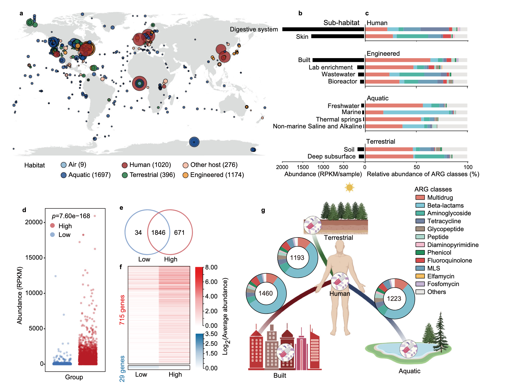
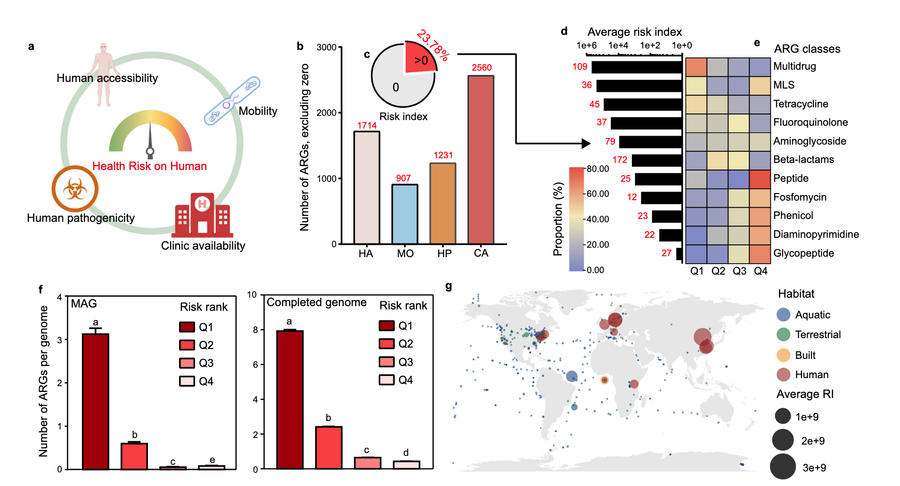
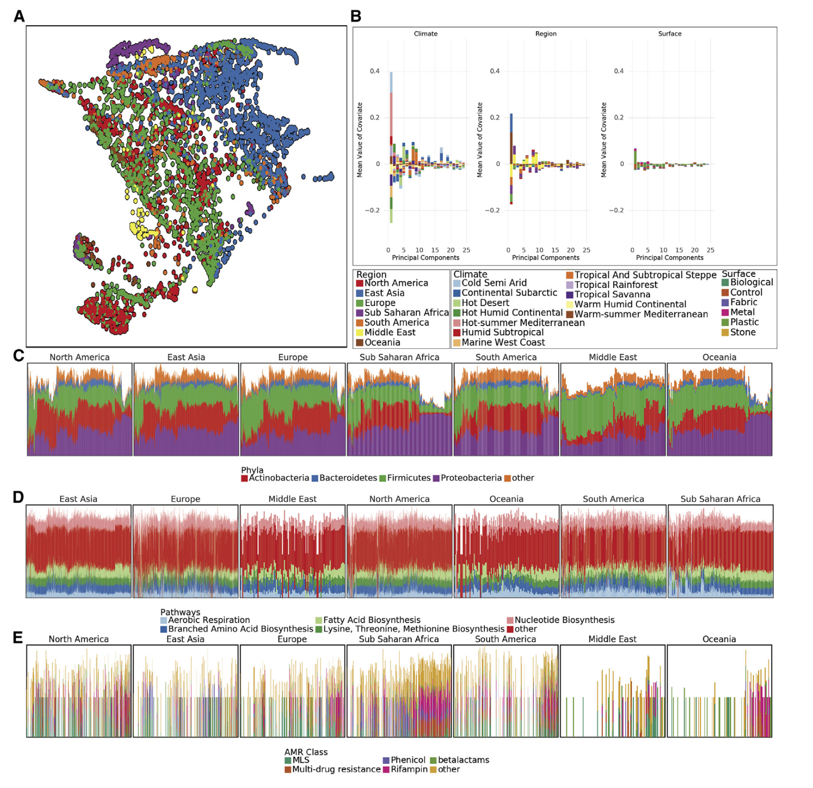
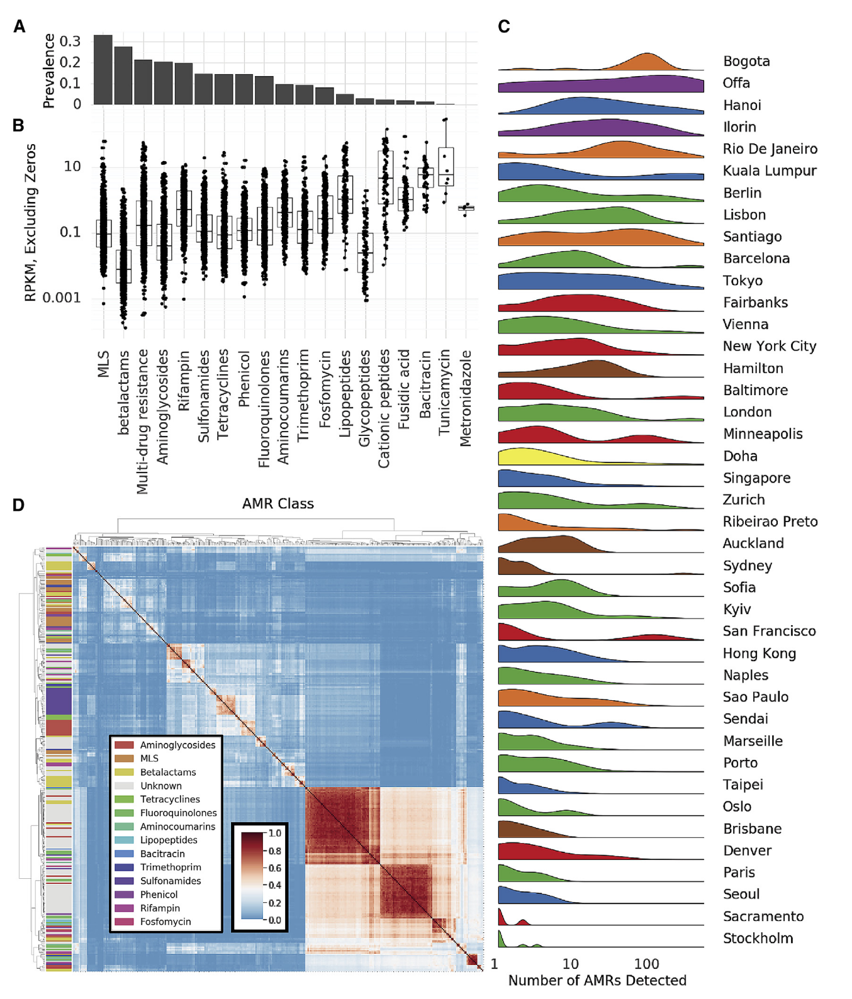
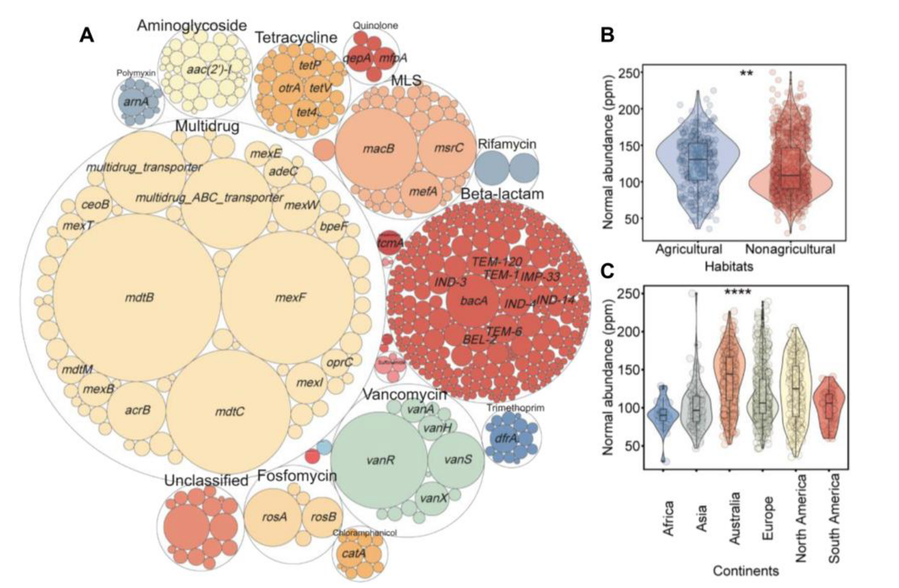
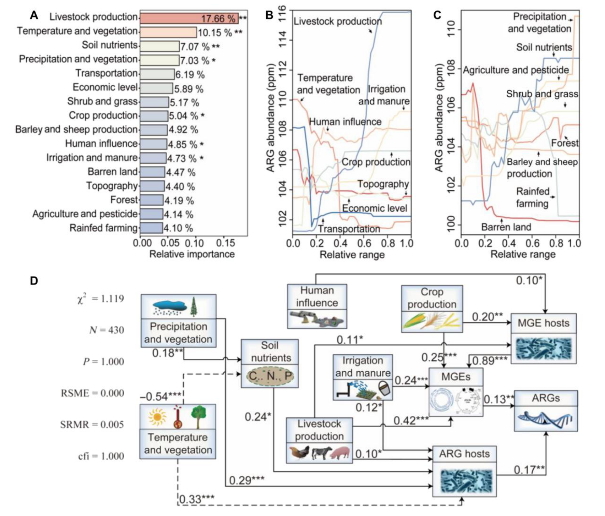

## Introduction

抗生素耐药性是对人类健康和疾病临床治疗日益严重的全球性威胁。在过去十年中，已在所有环境中检测到抗生素抗性基因(ARG)，包括自然、工程和临床及栖息地。包括抗生素的临床使用在内的人为活动，被广泛认为是ARGs传播的主要驱动力。很早之前也写过一篇介绍[抗生素，ARG以及相应生信分析方法](../antibiotics-resistance)的文章，这里想要介绍一下几篇全球尺度的ARG相关研究，他们已经整理好的数据还可以作为自己研究数据的背景参考。

### ARG的全球健康风险评估

这是一篇2022年发表在NC上的文章《Assessment of global health risk of antibiotic resistance genes》，研究者使用4572个宏基因组数据集来揭示2561个ARG及其宿主在全球栖息地的分布和传播。他们实施了一个框架，通过考虑四个指标（人类可及性、流动性、人类致病性和临床可用性）来定量评估每个ARG和样本的健康风险。有23.78%的ARGs对健康构成威胁，尤其是那些具有多重耐药性的ARGs。

这篇NC用来鉴定ARG的方法是RGI工具+CRAD数据库跑reads，应该是比较常见的做法，文章也提供了所有sample的metadata以及鉴定出来的ARG丰度表，都在<https://figshare.com/articles/dataset/Supplementary_Tables/19189652>里，可以搞下来和自己的数据比较。

#### ARG分布的全球模式

研究者用4572个宏基因组样本展示ARG分布全球模式，样本源于空气、水生、陆地、工程、人类和其他宿主六类栖息地。从中依据综合抗生素研究数据库确定2561个ARG，可抵抗24种药物类别抗生素，2401个仅对一种药物耐药，160个对多种药物耐药，25个ARG在超75%样本中被发现，近一半ARGs在不同栖息地共享，表明人为活动对ARGs全球传播很关键。

人为活动影响ARGs传播方面，按总体人口密度将采样点分两组，高强度活动区域ARG总丰度和特定抗性基因显著更高，不同ARGs与人为活动相关性不同影响其对人类健康风险，后续从人类可及性、流动性、人类致病性和临床可用性四个指标评估ARGs健康风险。

在ARGs的人类可及性上，检查人类与其他三个主要栖息地共享的ARG，建筑环境与人类栖息地共享最多，多数为多药和β - 内酰胺类药物抗性，确定人类栖息地中ARG的平均丰度和流行率后计算人类可及性，发现只有一小部分ARGs对人类高度可及并有潜在风险。

对于ARG宿主和移动遗传元件（MGEs）在不同栖息地的分布，实施严格质量标准提高ARGs宿主识别准确性，确定7555个MAG为ARG宿主，个体ARGs宿主在不同生境差异显著，多数宿主特定于一个栖息地，人工和人类相关栖息地宿主不如自然栖息地多样，可能是人为活动选择性压力所致 。

#### ARG的健康风险评估

研究者分析ARGs特征以确定其人类可及性、流动性和人类致病性，进而评估其从环境转移到人类并推动耐药病原体进化的潜力，还通过系统评估ARGs对人类健康的风险确定其临床相关性。全球抗生素使用数据显示青霉素和头孢菌素这两种β - 内酰胺类抗生素使用最多，在检测到的2561个ARG中，对临床可用抗生素耐药性的基因占比较大。

研究者用四个计算指标（人类可及性、流动性、人类致病性和临床可用性）评估每个ARG的整体健康风险，除临床可用性外其他指标仅涵盖约一半ARG ，计算风险指数RI = HA × MO × HP × CA 。结果表明抗生素使用增加了ARGs对人类健康的风险并可能导致临床感染治疗失败，属于Q1的ARG数量显著多于其他等级，Q3和Q4的ARGs很少被病原体基因组携带，证明了健康风险评估工作的有效性。基于四个主要栖息地（水生、陆地、工程、与人类相关）发现与人类相关的栖息地构成抗生素耐药性的最高风险 。

### 城市微生物群落和ARG的全球宏基因组图谱

《A global metagenomic map of urban microbiomes and antimicrobial resistance》，这是一项关于全球公共室内环境（公共交通工具）微生物图谱的重要研究，于2021年发表在Cell上。

研究呈现了一个全球地图集，涵盖60个城市公共交通系统的4728个宏基因组样本，是全球首个系统性城市微生物生态系统目录。该图谱包含注释的微生物菌株地理空间信息、功能特征、抗菌素耐药性标记及遗传元素，有10928种病毒、1302种细菌、2种古菌以及838532种未在参考数据库发现的CRISPR序列。研究发现4246种已知城市微生物，97%的样本中有31种不同于人类共生生物的物种；不同城市抗菌素耐药性基因的类型和密度差异明显；城市因气候和地理差异呈现出独特的微生物分类特征。这些结果构成高分辨率全球宏基因组图谱，有助于发现生物体和基因，凸显公共卫生和法医应用潜力，还为城市抗菌素耐药性负担提供了新的视角。

#### 城市微生物群特征

研究者调查全球城市环境微生物种类分布，发现分类群流行率双峰分布，据此定义亚核心组、外围组和真正核心类群，确定1145种微生物构成亚核心城市微生物群、31种为真正核心微生物群，亚核心群主要是细菌，全球城市常见三个细菌门为变形杆菌、放线杆菌和厚壁菌门。

虽几乎所有样本都有核心城市微生物群，但城市间在分类和定位上有差异，计算Jaccard距离并使用UMAP降维可视化，发现亚群大致对应气候而非地表类型，功能代谢剖面有地理空间差异，时间可能影响分类变化。MAVRIC分析表明城市是影响分类组成的最重要因素，其次是地区，对分类数据进行PCA分析，两个显著主成分与城市气候有关，样本相似性有邻域效应。

全球范围内，多数样品含放线菌门、拟杆菌门、厚壁菌门和变形菌门，不同大陆相对丰度有别，功能途径在各大陆间更稳定，抗菌素耐药性种类因大陆而异。比较样本分类剖面和功能剖面距离，分类图谱平均Jensen-Shannon divergence高于功能。

创建GeoDNA和MetaGraph用于搜索原始序列，训练随机森林分类器预测样本来源，对培训集中未出现的城市特征预测表明城市特异性分类特征可预测样本来源，且城市特有的分类群分布不均，制定分数反映分类群在城市中的流行程度，其分布呈区域和城市双峰分布 。

#### ARG形成了不同的clsuter

抗生素多样性和AMR的量化是全球抗生素管理的关键，仅从基因序列预测抗生素耐药性有挑战，检测准确性取决于抗生素类别。作为全球城市环境中抗生素耐药性调查的第一步，研究者用MegaRES本体和比对软件将reads映射到已知抗生素耐药性基因，用20类抗生素耐药基因的RPKM量化其相对丰度，2210份样本中部分序列与AMR基因对齐，但无一致的AMR基因核心集。

常见抗生素耐药基因类别有大环内酯类等，其中MLS仅在部分样本中发现，还量化了耐药基因的可能机制，常见三种耐药机制在一些样本中未发现。抗生素耐药基因丰度普遍低于功能基因，但一些样本含众多不同AMR基因序列，高AMR多样性集群在城市中分布不均，不同城市情况有差异。

检测到AMR基因的病例平均深度表明整体分布不受读取深度显著影响，训练随机森林模型预测城市分类，其准确率优于随机概率但远低于分类预测器，因AMR基因更具移动性，可能代表较弱的城市特异性特征。此前研究表明质粒可携带大量AMR基因，生态竞争可致同一样本多个类群产生耐药性，在城市环境中研究较少。

研究者鉴定相同样本中出现的AMR基因簇，测量基因对间Jaccard距离并聚类，发现三个大基因群和许多小基因群，这些集群常由多抗性类别基因组成且大型集群基因更多。对数据集中所有抗性基因集进行稀疏分析（泛抗性组），发现其与被检测物种发现率相似，呈现开放斜率，未来分析可能发现更多抗性基因。此外，AMR基因在地理位置相近样本中表现出邻域效应，同一城市样本的AMR基因组间Jaccard距离随距离增大而增大，总体影响微弱但显著 。

### 土壤ARG的全球生物地理学及预测

这是2022年发表在Science Advances上的《Global biogeography and projection of soil antibiotic resistance genes》，该研究生成了一张全球土壤抗生素抗性基因丰度图，其中确定的微生物宿主、农业活动和人为因素解释了印度、东亚、西欧和美国的抗生素抗性基因热点。研究者的结果突显了来自携带抗生素抗性基因的土壤临床病原体的健康威胁，并确定了在全球范围内控制土壤抗生素抗性的重点地区。

这篇文章用的也是比较常用的软件ARG-OAP跑的reads，应该也是可以方便整合自己的数据的。

#### 土壤ARG的空间格局

研究者的1088个土壤观测结果显示，共有23种抗生素抗性基因类型和558个亚型。样本中平均有12.42种基因类型和49.24个亚型，多为编码多重耐药性、MLS、万古霉素和膦胺霉素的基因，最常检测到的亚型是mexF 。抗生素抗性基因归一化丰度平均为121.20 ppm，主要由多重耐药性基因主导。

通过PERMANOVA分析，不同栖息地抗生素抗性基因组成存在显著差异，农业栖息地丰度较高，不同大陆间也有明显差异，澳大利亚最丰富，且从低纬度到极地丰度呈增加趋势。研究者鉴定出9种可移动遗传元件类型和157个亚型，有助于土壤抗生素抗性基因的存在和持久性。其总归一化丰度平均为55.26 ppm，转座酶占主导。抗生素抗性基因归一化丰度与多种可移动遗传元件显著相关。

土壤微生物归一化丰度平均为232,179.53 ppm，细菌是主导分类群，变形菌门在门水平上占优，放线菌门次之 。研究者鉴定出携带抗生素抗性基因或可移动遗传元件的微生物占总物种的20.97%，但归一化丰度仅1.36%。这些微生物宿主涵盖多个分类层级，其组成与土壤微生物群落组成有差异，在各分类水平上都有不同表现，且抗生素耐药微生物组中一些物种是多重耐药基因和转座酶的核心宿主，抗生素抗性基因及其微生物宿主、可移动遗传元件及其微生物宿主之间均呈正相关 。

#### 土壤ARG的地理驱动因素

为研究土壤抗生素抗性基因丰度空间模式的地理机制，研究者将潜在环境约束整合到16个主成分中，抗生素抗性基因丰度变异性主要受与人类活动相关主成分（57.52%）控制，代表人类输入、畜牧业和农业污染的贡献，气候和植被（17.18%）及土壤养分（7.07%）主成分贡献较小，且气候和植被因素影响相互关联。

分析表明抗生素抗性基因丰度与多数人为因素呈正向关联，如畜牧业生产随其丰度增加而显著增加，土壤养分增加在中等范围内会提高丰度，气候参数影响较复杂，温度降低丰度减少，降水增加丰度增加。

通过结构方程模型检查地理属性对抗生素抗性基因归一化丰度的因果效应，发现其影响通过微生物因素介导，人为因素引入携带相关基因和元件的微生物间接提高丰度，气候变量也通过土壤养分等多种因素间接影响。

研究者利用169个空间协变量，基于四种机器学习算法预测土壤抗生素抗性基因归一化丰度，经优化后随机森林最优，构建了0.083°分辨率的归一化丰度图谱，显示西欧、东亚、南亚和美国东部等地丰度最高，高纬度地区也有较高丰度，与纬度梯度一致，应用变异系数量化不确定性，在西伯利亚等地显示较高不确定性，但模型表现稳健。

## References
1. Zhang, Z. et al. Assessment of global health risk of antibiotic resistance genes. Nat. Commun. 13, 1553 (2022).
2. Danko, D. et al. A global metagenomic map of urban microbiomes and antimicrobial resistance. Cell 184, 3376-3393.e17 (2021).
3. Zheng, D. et al. Global biogeography and projection of soil antibiotic resistance genes. Sci. Adv. 8, eabq8015 (2022).
