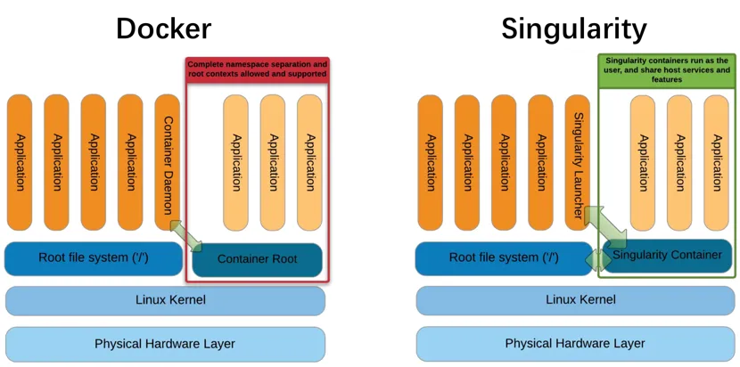

## Introduction

在生物信息学（生信）研究领域，数据处理和分析任务日益复杂，对计算资源的需求也越来越高。为了提高研究效率、确保环境一致性和可重复性，容器技术应运而生。Docker和Singularity作为两种主流的容器解决方案，在生信领域得到了广泛应用。本文将简单介绍这两种容器的基本概念、使用方法，至少在面对一些提供了Docker安装方式的软件（有可能其他安装方法都报错😂）时可以作为使用的一个选择。

容器是一种轻量级的虚拟化技术，它允许在单个操作系统实例上运行多个隔离的应用程序。容器将应用程序及其所有依赖项（如库、配置文件等）打包成一个独立的运行环境，称为容器。这种技术使得应用程序可以在不同的环境中一致地运行，而无需担心底层基础设施的差异。



### 特点

1. **轻量级**：容器共享宿主机的操作系统内核，因此相比传统的虚拟机，容器需要更少的系统资源，启动更快，资源占用更少。
2. **隔离性**：容器提供了一定程度的隔离，每个容器都有自己的运行环境，互不干扰。这种隔离是通过操作系统级别的虚拟化技术实现的，如Linux的cgroups和namespaces。
3. **可移植性**：由于容器包含了运行应用程序所需的所有依赖项，因此可以在不同的环境（开发、测试、生产等）中无缝迁移和部署。
4. **可扩展性**：容器可以快速启动和停止，这使得它们非常适合用于动态扩展应用程序的规模，以应对变化的负载需求。
5. **资源控制**：可以为每个容器分配特定的CPU、内存和存储资源，确保应用程序的性能和稳定性。
6. **版本控制和一致性**：容器镜像可以被视为应用程序的“快照”，可以通过版本控制工具进行管理。这有助于确保在不同环境中部署的应用程序保持一致。


## Docker

Docker是目前最流行的容器技术，广泛应用于云计算和开发测试环境，由Docker公司（原名dotCloud）于2013年推出。Docker通过容器技术，将应用程序及其所有依赖项打包到一个独立的单元中，使其能够在任何环境中一致地运行。它通过Docker镜像和容器的概念，实现了应用的快速部署和管理。然而，Docker在高性能计算（HPC）环境中的应用受到一些限制，如权限管理、资源限制等。

### Docker的基本组件

1. **Docker镜像（Image）**：一个只读的模板，包含运行应用程序所需的所有文件和依赖项。镜像是构建容器的基础。
2. **Docker容器（Container）**：基于镜像创建的可运行实例。容器可以被启动、停止、删除等操作。
3. **Docker仓库（Registry）**：用于存储和分发Docker镜像的地方。Docker Hub是最常用的公共仓库，用户也可以搭建私有仓库。
4. **Docker引擎（Engine）**：Docker的核心组件，负责构建、运行和管理容器。

### 基本使用方法

1. 安装Docker

在安装Docker之前，请确保系统满足Docker的最低要求。以下是在常见操作系统上安装Docker的简要步骤：

- **Ubuntu**：

  ```bash
  sudo apt-get update
  sudo apt-get install docker-ce docker-ce-cli containerd.io
  ```

- **CentOS**：

  ```bash
  sudo yum install -y docker
  sudo systemctl start docker
  sudo systemctl enable docker
  ```

- **macOS**：下载并安装[Docker Desktop for Mac](https://www.docker.com/products/docker-desktop)。

- **Windows**：下载并安装[Docker Desktop for Windows](https://www.docker.com/products/docker-desktop)。

2. 验证安装

安装完成后，可以通过以下命令验证Docker是否安装成功：

```bash
docker --version
```

3. 基本命令

- 拉取镜像

从Docker Hub或其他仓库拉取镜像：

```bash
docker pull ubuntu:latest
```

- 查看本地镜像

列出本地已有的镜像：

```bash
docker images
```

- 运行容器

基于镜像创建并运行一个容器：

```bash
docker run -it --name my_ubuntu ubuntu:latest /bin/bash
```

- `-i`：保持容器的标准输入打开。
- `-t`：分配一个伪终端。
- `--name`：指定容器的名称。

- 查看运行中的容器

列出当前正在运行的容器：

```bash
docker ps
```

查看所有容器（包括停止的）：

```bash
docker ps -a
```

- 停止和删除容器

停止容器：

```bash
docker stop my_ubuntu
```

删除容器：

```bash
docker rm my_ubuntu
```

- 删除镜像

删除本地镜像：

```bash
docker rmi ubuntu:latest
```

4. Dockerfile简介

Dockerfile 是一个用于定义如何构建Docker镜像的文本文件。通过编写Dockerfile，可以自动化构建过程，确保镜像的一致性和可重复性。以下是一个简单的Dockerfile示例：

```dockerfile
# 使用官方Ubuntu镜像作为基础
FROM ubuntu:latest

# 更新包列表并安装常用软件
RUN apt-get update && apt-get install -y \
    python3 \
    python3-pip \
    && rm -rf /var/lib/apt/lists/*

# 设置工作目录
WORKDIR /app

# 复制当前目录下的文件到容器的/app目录
COPY . /app

# 安装Python依赖
RUN pip3 install --no-cache-dir -r requirements.txt

# 暴露端口
EXPOSE 5000

# 设置容器启动时执行的命令
CMD ["python3", "app.py"]
```

5. 构建和运行自定义镜像

在包含Dockerfile的目录下，使用以下命令构建镜像：

```bash
docker build -t my_python_app .
```

- `-t`：指定镜像名称及标签。
- `.`：指定Dockerfile所在的路径。

构建完成后，运行容器：

```bash
docker run -d -p 5000:5000 --name my_running_app my_python_app
```

- `-d`：后台运行容器。
- `-p`：将宿主机的端口映射到容器的端口。

## Singularity

Singularity是一种开源的容器化技术，专为科学计算、高性能计算（HPC）和大规模计算工作流程设计。它允许用户将应用程序、环境和依赖项打包到一个独立的、可移植的单个文件中，称为SIF（Singularity Image Format）容器镜像。这使得用户可以在不同的系统上无缝地运行相同的容器，包括在没有root权限的环境中运行。

### 基本使用方法

1. **安装Singularity**

   Singularity可以通过源码、包管理器或Conda等方式安装。以下是通过包管理器安装的示例：

   ```bash
   # Ubuntu
   sudo apt-get update && sudo apt-get install -y singularity-container

   # CentOS
   sudo dnf install -y singularity
   ```

2. **拉取镜像**

   ```bash
   singularity pull docker://ubuntu:latest
   ```

3. **运行容器**

   ```bash
   singularity run ubuntu_latest.sif
   ```

4. **进入容器交互模式**

   ```bash
   singularity shell ubuntu_latest.sif
   ```

5. **查看容器信息**

   ```bash
   singularity inspect ubuntu_latest.sif
   ```
   
## Docker转化Singularity容器

Docker和Singularity都是流行的容器技术，但在设计目标、使用场景和功能上有一些关键区别。

设计目标
- **Docker**：最初设计用于开发、测试和部署微服务，强调快速部署和资源隔离。Docker广泛应用于企业级应用和开发测试环境。
- **Singularity**：专为高性能计算（HPC）和科学计算设计，强调在无root权限环境下的安全性和可移植性。Singularity广泛应用于HPC中心和大规模计算工作流程。

安全性
- **Docker**：默认以root用户运行容器，存在一定的安全风险。虽然可以通过用户命名空间等技术提高安全性，但配置较为复杂。
- **Singularity**：默认以非root用户运行容器，避免了root权限带来的安全问题。它提供了更强的安全保障，适合在多用户HPC环境中使用。

资源管理
- **Docker**：在资源管理方面较为灵活，但需要用户手动配置资源限制，如内存和CPU的使用。
- **Singularity**：在资源管理方面更加简单直观，支持自动化的资源分配和管理，适合大规模计算任务。

可移植性
- **Docker**：Docker镜像可以在不同的操作系统和平台上运行，但在HPC环境中可能会遇到兼容性问题。
- **Singularity**：Singularity容器具有更高的可移植性，能够在不同的HPC系统和云平台上无缝运行。

使用场景
- **Docker**：适合微服务架构、持续集成和持续交付（CI/CD）、跨平台部署等场景。
- **Singularity**：适合高性能计算（HPC）、科学计算、大规模数据分析和需要高效利用资源的场景。

我们实验室的集群就是不允许使用Docker但能用Singularity的。所以有时候要尝试自己将Docker转化Singularity容器：

将Docker容器转化为Singularity容器是一种常见的操作，因为Singularity提供了更灵活和安全的容器化解决方案，特别是在高性能计算（HPC）环境中。以下是将Docker容器转化为Singularity容器的几种方法：

### 方法一：使用本地现有的Docker镜像

1. **查找Docker镜像ID**：
   - 在运行Docker的主机上，使用`docker images`命令查找所需的Docker镜像ID。

2. **创建Docker镜像的tarball文件**：
   - 使用`docker save`命令将Docker镜像保存为一个tarball文件。例如：
     ```sh
     docker save <IMAGE_ID> -o <IMAGE_NAME>.tar
     ```

3. **拷贝tarball文件**：
   - 使用`scp`或其他文件传输工具将tarball文件拷贝到运行Singularity的主机上。

4. **将tarball转换为Singularity镜像**：
   - 在Singularity主机上，使用`singularity build`命令将tarball文件转换为Singularity镜像。例如：
     ```sh
     singularity build --sandbox <SINGULARITY_IMAGE_NAME> docker-archive://<PATH_TO_TARBALL>
     ```

5. **运行Singularity沙箱镜像**：
   - 使用`singularity shell`或`singularity exec`命令进入Singularity容器并执行命令。

### 方法二：使用Docker容器仓库中的镜像

如果Docker镜像已经上传到Docker Hub或其他Docker托管存储库中，可以直接下载并转化为Singularity容器。

1. **从Docker Hub下载**：
   - 使用`singularity build`命令从Docker Hub下载并构建Singularity镜像。例如：
     ```sh
     singularity build <SINGULARITY_IMAGE_NAME>.sif docker://godlovedc/lolcow
     ```

2. **从Quay下载**：
   - 同样，可以从Quay或其他Docker托管存储库下载并构建Singularity镜像。例如：
     ```sh
     singularity build <SINGULARITY_IMAGE_NAME>.sif docker://quay.io/biocontainers/samtools:1.17--hd87286a_1
     ```

### 方法三：使用Dockerfiles

从Singularity 4.1版本开始，可以直接从Dockerfiles构建OCI-SIF映像。

1. **编写Dockerfile**：
   - 编写一个Dockerfile，定义所需的基础镜像和命令。

2. **构建Singularity镜像**：
   - 使用`singularity build`命令从Dockerfile构建Singularity镜像。例如：
     ```sh
     singularity build --oci <SINGULARITY_IMAGE_NAME>.oci.sif <Dockerfile>
     ```

3. **运行Singularity镜像**：
   - 使用`singularity run`命令运行构建的Singularity镜像。

通过这些方法，可以将Docker容器轻松地转化为Singularity容器，从而在需要更高安全性和灵活性的环境中使用。

## 参考文献：
1. https://cloud.tencent.com/developer/news/1351431
2. https://www.showapi.com/news/article/66c4d6274ddd79f11a08c187
3. https://segmentfault.com/a/1190000044706625

