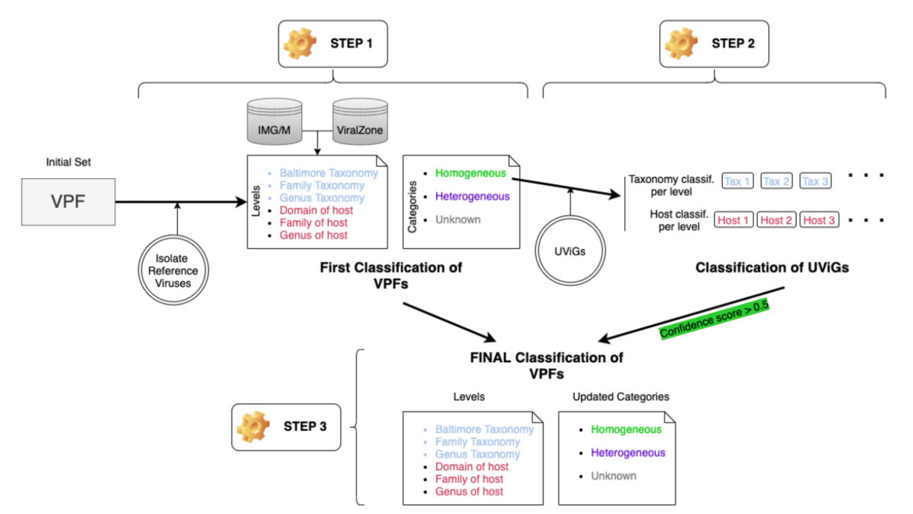

## Introduction

在宏基因组学的研究领域中，对病毒序列宿主的预测已经成为一项极具挑战性但又至关重要的任务。病毒是一种非细胞生命形态的微生物，它们必须依赖宿主细胞才能进行繁殖和生存。然而，在复杂的生态环境中，病毒所感染的宿主往往是未知的。病毒宿主预测就是通过各种技术手段和方法，利用病毒基因组中的信息来推测其可能感染的宿主（如细菌等微生物）的过程。

目前已有的宿主预测方法已经有很多了，比如2022年前就有以下工具：

| 名称 | 模型 | 描述 | 预测水平 |
|--|--|--|--|
| WIsH | 马尔可夫模型 | 针对潜在宿主基因组训练了一个同质的马尔可夫模型，并计算原核生物基因组作为查询病毒宿主的可能性。 | 属 |
| PHP | 高斯混合模型 | 利用 - mers频率（可反映病毒和宿主共享的密码子使用模式）来训练高斯混合模型。 | 属 |
| HoPhage | 深度学习模型和马尔可夫链算法 | 使用每个候选宿主基因组的编码序列（CDS）构建马尔可夫链模型，然后计算查询噬菌体片段感染候选宿主基因组的可能性。还使用深度学习模型，并最终将深度学习模型的结果与马尔可夫模型的结果整合用于宿主预测。 | 属 |
| VPF-Class | 基于序列匹配的模型 | 利用从IMG/VR系统下载的病毒蛋白家族（VPFs）来估计查询病毒与已知宿主病毒之间的相似性。 | 属 |
| RaFAH | 随机森林模型 | 使用MMseqs2生成蛋白质簇并构建轮廓隐马尔可夫模型（HMMs）。然后，使用HMM比对输出的特征训练多类别随机森林模型。 | 属 |
| HostG | 图卷积网络（GCN） | 利用病毒和原核生物之间共享的蛋白质簇创建知识图谱，并训练GCN进行预测。 | 属 |
| PHIST | 基于比对的模型 | 基于病毒和宿主基因组之间的精确匹配来预测病毒的宿主原核生物。 | 种 |
| PredPHI | 卷积神经网络（CNN） | 利用蛋白质序列中的化学成分信息（如氨基酸丰度）训练CNN进行宿主预测。 | 种 |
| PHIAF | 生成对抗网络（GAN）和卷积神经网络（CNN） | 使用来自DNA和蛋白质序列的特征（如 - mers频率和分子量）训练CNN进行宿主预测，并应用GAN从已知的病毒 - 宿主相互作用生成伪病毒 - 宿主对以扩充数据集。 | 种 |
| vHULK | 多层感知机模型（MLP） | 将宿主预测表述为一个多类别分类问题，输入为病毒，标签为原核生物，模型使用的特征是针对噬菌体蛋白家族pVOGs数据库的蛋白质轮廓比对结果。 | 种 |
| DeepHost | 卷积神经网络（CNN） | 设计了一种基因组编码方法，使用 - mers特征将各种长度的基因组编码成3D矩阵，并训练CNN模型进行宿主预测。 | 种 |
| VHM-net | 马尔可夫随机场 | 利用马尔可夫随机场框架，通过结合病毒和原核生物之间的多种特征（如CRISPRs、WIsH的输出得分、BLASTN比对等）来预测病毒是否感染目标原核生物。 | 种 |
| CHERRY | 图卷积编码器和解码器用于链接预测 | 将宿主预测问题表述为多模态图中的链接预测问题，并设计了用于宿主预测的编码器 - 解码器结构。多模态图将不同类型的特征（包括蛋白质组织、CRISPR、序列相似性和 - mers频率）集成到节点和边中，边连接来自标记（训练）和未标记（测试）数据的病毒和原核生物。 | 种 |

### 主要原理

（一）基于比对的方法
1. **基于病毒间相似性或病毒与原核生物基因组相似性**
   - 这类方法主要利用病毒之间或病毒与原核生物基因组之间的相似性来实现宿主识别。例如，VPF - Class方法，它利用从IMG/VR系统下载的病毒蛋白家族（VPFs）。通过计算查询病毒与已知宿主病毒之间的VPFs相似性，根据与VPFs的比对结果，就能对查询的每个病毒片段（contig）给出宿主预测结果。
   - PHIST方法则是利用病毒基因组与原核生物基因组之间的序列匹配来进行宿主预测。它通过识别病毒和原核生物基因组共有的 - mers（长度为k的连续核苷酸序列），从而估计病毒 - 原核生物对形成真实相互作用（即感染关系）的概率。
2. **利用CRISPR的比对预测**
   - 一些原核生物会通过CRISPR（成簇的规律间隔的短回文重复序列）记录病毒感染信息以预防再次感染。部分基于比对的工具利用这一特性来预测宿主。比如使用BLAST（基本局部比对搜索工具）等方法，通过搜索原核生物和病毒之间的短序列匹配来预测宿主。然而，这种方法存在一定的局限性，因为只有2 - 10%的测序原核生物含有CRISPRs，而且很多病毒与原核生物注释或预测的CRISPRs没有比对结果，所以无法利用这一信号进行宿主预测。

（二）基于学习的方法
1. **基于序列特征构建模型**
   - 机器学习和深度学习学习基于学习的方法更加灵活，大多数这类方法是学习基于序列的特征用于宿主预测。
   - 例如，WIsH方法会针对潜在宿主基因组训练一个同质的马尔可夫模型。该模型随后计算一个原核生物基因组作为查询病毒宿主的可能性，并将可能性最高的原核生物指定为宿主。
   - vHULK方法将宿主预测表述为一个多类别分类问题，其中输入是病毒，标签是原核生物。它在其深度学习模型中使用的特征是针对噬菌体蛋白家族pVOGs数据库的蛋白质轮廓比对结果。
   - RaFAH方法不使用公共数据库，而是使用MMseqs2软件生成蛋白质簇并构建轮廓隐马尔可夫模型（HMMs）。然后，它利用HMM比对输出的特征并训练一个多类别随机森林模型。
   - HoPhage是另一个基于多类别分类模型的宿主预测工具，它使用深度学习和马尔可夫链算法。它通过利用每个候选宿主基因组的编码序列（CDS）构建马尔可夫链模型，计算查询噬菌体片段感染候选宿主基因组的可能性，然后还使用一个深度学习模型，并最终将深度学习模型与马尔可夫模型的结果整合以预测宿主。
2. **基于 - mers频率和相关蛋白的特征预测**
   - PHP方法利用 - mers频率，因为它可以反映病毒和宿主共享的密码子使用模式来预测宿主。
   - DeepHost和PHIAF也利用基于 - mers的特征来训练卷积神经网络进行宿主预测。
3. **基于受体结合蛋白（RBPs）的特征预测**
   - Boeckaerts等人构建学习模型时使用从受体结合蛋白（RBPs）提取的特征进行宿主预测。不过，这一方法存在局限性，因为在所有病毒中注释RBPs并不容易，该作者仅收集了与九个宿主相关的RBPs，所以这个工具只能预测非常有限的宿主物种。
4. **构建知识图谱或整合多种特征预测**
   - HostG利用病毒和原核生物之间共享的蛋白质簇创建知识图谱，并训练图卷积网络进行预测。虽然它预测的准确性较高，但只能预测到属水平的主机。VHM - Net结合了病毒和原核生物之间的多种特征，如CRISPRs、WIsH的输出得分、BLASTN比对得分等。


近几年也有更多方法不断被发表出来，很难评判哪个软件最好用最准确，大家可以挑选最适合自己数据和研究问题的工具。这篇文章简要介绍一下几个我用过的软件。

## VPF-Class：基于病毒蛋白家族的病毒分类分配和宿主预测

VPF-Class是一种基于病毒蛋白家族（VPFs）信息的工具，用于对未培养病毒进行分类和宿主预测。它通过将病毒蛋白质分配到已分类的VPFs中，实现了在多个分类级别（包括Baltimore分类系统、病毒科和属）上的自动化分类和宿主预测。VPF-Class在RefSeq数据库中表现出高准确性，属级别的分类准确率接近100%，宿主预测准确率为86.4%。该工具无需下载或选择参考数据库，避免了映射过程中的偏差，使其更易于使用。VPF-Class适用于宏基因组研究、病毒发现和病毒生态学研究，帮助研究人员在没有培养条件的情况下识别新的病毒序列并预测其宿主。



在VPF-Class中，主要步骤包括：

1. **VPFs的分类和宿主预测**：首先，对VPFs进行分类，并根据其与已知病毒的同源关系进行宿主预测。

2. **病毒基因组的分类和宿主预测**：利用分类后的VPFs对未培养病毒基因组进行分类和宿主预测。

3. **交叉验证和VPFs的第二轮分类**：通过比较未培养病毒的分类结果来更新VPFs的分类信息，以提高分类的准确性。

4. **病毒基因组的分类和评分**：为每个病毒基因组提供分类和宿主预测结果，并计算相应的置信度评分。

### 安装使用

在GitHub上的`biocom-uib/vpf-tools`项目中，提供了两种安装方法：使用Docker和从源代码构建（但是我的服务器上直接没有sudo权限，docker也用不了，stack也装不了😂，只能在自己的电脑上安装了）。以下是详细的安装步骤：

方法1：使用Docker

```bash
docker volume create vpf-data

docker run --rm -it \
    -v "vpf-data:/opt/vpf-tools/vpf-data" \
    -v "$PWD/seqs:/opt/vpf-tools/input-sequences:ro" \
    -v "$PWD/outputs:/opt/vpf-tools/outputs:rw" \
    bielr/vpf-tools \
        vpf-class -i seqs/test.fna -o outputs/test-classified
```

我尝试将本地的docker转换为HPC上的singularity来运行：
```bash
# 在 Docker 环境下转换 sif
docker run --rm -v /var/run/docker.sock:/var/run/docker.sock \
    -v $PWD:/output quay.io/singularity/docker2singularity \
    bielr/vpf-tools
docker save -o vpf-tools.tar bielr/vpf-tools
singularity build vpf-tools.sif docker-archive://vpf-tools.tar
mkdir -p $PWD/vpf-data
docker run --rm -v "$PWD/vpf-data:/opt/vpf-tools/vpf-data" bielr/vpf-tools cp -r /opt/vpf-tools/vpf-data/

# 在singularity环境运行
# 把vpf-tools.sif和vpf-data文件夹拷贝到HPC上
singularity exec --bind "$PWD/vpf-data:/opt/vpf-tools/vpf-data" \
                 --bind "$PWD/seqs:/opt/vpf-tools/input-sequences:ro" \
                 --bind "$PWD/outputs:/opt/vpf-tools/outputs:rw" \
                 vpf-tools.sif \
        vpf-class -i seqs/test.fna -o outputs/test-classified
```

方法2：从源代码构建

1. **安装Stack**：
   使用以下命令安装Stack（适用于Mac OS和Linux，未在Windows上测试）：
   ```sh
   curl -sSL https://get.haskellstack.org/ | sh
   ```

2. **克隆仓库**：
   克隆`vpf-tools`仓库：
   ```sh
   git clone https://github.com/biocom-uib/vpf-tools
   cd vpf-tools
   ```

3. **编译工具**：
   使用Stack编译所有目标：
   ```sh
   stack build
   ```
   第一次编译可能需要一些时间，因为Stack还需要安装GHC并编译所有依赖项。

4. **运行工具**：
   编译完成后，可以通过在命令前加上`stack exec --`来运行工具，例如：
   ```sh
   stack exec -- vpf-class --help
   ```

5. **实验性支持OpenMPI**：
   如果需要使用OpenMPI，可以在构建时添加`--flag vpf-class:+mpi`标志，然后像其他程序一样使用`mpirun`运行工具。

补充材料

- **分类文件**：
  可以在这里找到VPF的分类文件，包括`index.yaml`。

- **单个数据文件**：
  可以在这里下载单个数据文件，选择“VPF classification”选项卡。

- **HMMER模型文件**：
  最新的包含VPF HMMER模型的文件可以从IMG/VR下载（注意：链接可能已失效，可以在这里找到一个副本）。将`final_list.hmms`解压到数据目录中，与`index.yaml`相邻。

#### 常见问题

- **HMMERNotFound**：
  确保HMMER安装正确，并且可以通过`$PATH`访问。如果不在`$PATH`中，可以使用`--hmmer-prefix`指定路径。

- **ProdigalNotFound**：
  确保Prodigal已安装，并且可以通过`$PATH`访问。如果不在`$PATH`中，可以使用`--prodigal`指定可执行文件的位置。

- **Stack安装问题**：
  如果在安装过程中遇到问题，请参考Stack文档以确保所有依赖项都满足。（还挺难搞的😂）

- **Conda环境问题**：
  由于一些用户报告了Stack和Conda的问题，建议避免在Conda污染的环境中安装Stack。

## Cherry：图编码器模型准确预测病毒-原核宿主相互作用

在微生物群落中，感染细菌和古菌的**原核病毒**是关键参与者。预测原核病毒的宿主有助于解码微生物之间的动态关系。然而，实验方法无法跟上高通量测序技术产生的噬菌体序列的快速积累，因此需要计算方法来进行宿主预测。尽管取得了一些有希望的结果，但由于已知相互作用的限制和大量测序噬菌体的数量，计算宿主预测仍然是一个挑战。目前最先进的方法在物种水平上的准确率只能达到43%。


在这项工作中，研究者将宿主预测问题表述为一个知识图中的链接预测问题，整合了多种基于蛋白质和DNA的序列特征。研究者实现的工具名为CHERRY，可以应用于预测新发现病毒的宿主，并识别感染目标细菌的病毒。研究者展示了CHERRY在这两种应用中的实用性，并将其性能与其他11种流行的宿主预测方法进行了比较。据研究者所知，CHERRY在识别病毒-原核生物相互作用方面具有最高的准确性。它在物种水平上超越了所有现有方法，准确率提高了37%。此外，CHERRY在短片段上的表现比其他工具更稳定。

### 安装使用

`CHERRY` 是一个用于预测病毒与原核生物基因组相互作用的 Python 库。使用 Conda 安装：

1. **克隆仓库**：
   ```bash
   git clone https://github.com/KennthShang/CHERRY.git
   ```

2. **创建并激活 Conda 环境**：
   ```bash
   cd CHERRY
   conda env create -f CHERRY.yaml -n cherry
   conda activate cherry
   ```

3. **准备数据库**：
   由于 GitHub 文件大小限制，数据库文件被压缩为 `.bz2` 格式。需要解压这些文件：
   ```bash
   cd dataset
   bzip2 -d protein.fasta.bz2
   bzip2 -d nucl.fasta.bz2
   cd ../prokaryote
   gunzip *
   cd ..
   ```

4. **激活环境**：
   每次使用 `CHERRY` 之前，确保激活 `cherry` 环境：
   ```bash
   conda activate cherry
   ```

#### 使用

1. **输入文件**：
   输入文件应该是一个包含病毒序列的 FASTA 文件。研究者提供了一个示例文件 `test_contigs.fa`。

2. **运行命令**：
   使用以下命令进行宿主预测：
   ```bash
   python run_Speed_up.py [--contigs INPUT_FA] [--len MINIMUM_LEN] [--model MODEL] [--topk TOPK_PRED]
   ```
   - `--contigs INPUT_FA`：输入的 FASTA 文件（默认为 `test_contigs.fa`）。
   - `--len MINIMUM_LEN`：仅对长度大于等于指定长度的序列进行预测（默认为 8000）。
   - `--model MODEL`：使用预训练参数或重新训练的参数进行预测（默认为 `pretrain`）。
   - `--topk TOPK_PRED`：输出前 K 个预测结果（默认为 1）。

   示例：
   ```bash
   python run_Speed_up.py --contigs test_contigs.fa --len 8000 --model pretrain --topk 1
   ```

3. **输出文件**：
   输出文件格式为 CSV 文件（`final_prediction.csv`），包含每个病毒的预测结果。列 `contig_name` 是输入文件的访问号。

4. **生成分类树**：
   使用以下命令将预测结果转换为完整的分类树：
   ```bash
   python run_Taxonomy_tree.py [--k TOPK_PRED]
   ```
   需要指定 `k` 来生成树，输出文件为 `Top_k_prediction_taxonomy.csv`。

#### 扩展病毒-原核生物相互作用数据库

如果有比预训练模型更多的病毒-原核生物相互作用信息，可以添加它们来训练自定义模型：

1. **添加病毒基因组**：
   将病毒基因组添加到 `nucl.fasta` 文件中，并运行 `python refresh.py` 以生成新的 `protein.fasta` 和 `database_gene_to_genome.csv` 文件。

2. **添加宿主分类信息**：
   在 `dataset/virus.csv` 中添加宿主分类信息。表头为：
   - Accession（病毒）
   - Superkingdom
   - Phylum
   - Class
   - Order
   - Family
   - Genus
   - Species（必填）

3. **添加原核生物基因组**：
   将原核生物基因组放入 `prokaryote/` 文件夹，并在 `dataset/prokaryote.csv` 中添加条目。

4. **重新训练模型**：
   使用 `retrain` 作为 `--mode` 参数运行程序：
   ```bash
   python run_Speed_up.py --mode retrain
   ```

#### 预测感染特定原核生物的病毒

1. **输入文件**：
   - 将原核生物基因组放入 `new_prokaryote/` 文件夹。
   - 提供一个包含病毒序列的 FASTA 文件。
   - 在 `database/prokaryote.csv` 中添加分类信息。

2. **运行命令**：
   使用以下命令进行预测：
   ```bash
   python run_Speed_up.py [--mode MODE] [--t THRESHOLD]
   ```
   - `--mode MODE`：切换模式为预测病毒或宿主（`prokaryote` 或 `virus`）。
   - `--t THRESHOLD`：预测病毒的置信度阈值，阈值越高，精度越高（默认为 0.98）。

   示例：
   ```bash
   python run_Speed_up.py --contigs test_contigs.fa --mode prokaryote --t 0.98
   ```

3. **输出文件**：
   输出文件格式为 CSV 文件，包含每个病毒的预测结果。列 `prokaryote` 是给定原核生物基因组的访问号，列 `virus` 是可能感染这些基因组的病毒列表。

#### 常见问题

如果程序输出错误（通常是由于机器配置问题）：
```bash
Error: mkl-service + Intel(R) MKL: MKL_THREADING_LAYER=INTEL is incompatible with libgomp.so.1 library.
```
可以尝试在运行 `run_Speed_up.py` 之前执行以下命令：

```bash
export MKL_SERVICE_FORCE_INTEL=1
```

如果不想上面这样安装到本地或者很难运行成功，可以使用作者提供的在线网站phabox（https://phage.ee.cityu.edu.hk/phabox），可以直接上传文件进行预测。还是比较方便且运行较快的。

## IPEV：深度学习鉴定原核/真核病毒衍生序列

上面👆的CHERRY是只能鉴定潜在的原核生物宿主，而IPEV可以准确预测原核/真核病毒，可以作为一个扩充。

通过病毒样颗粒富集获得的病毒组包含原核和真核病毒来源的片段混合物。准确识别和分类这些元素对于理解它们在微生物群落中的作用和功能至关重要。然而，病毒基因组的快速突变率对开发高性能分类工具提出了挑战，可能会限制下游分析。


研究者提出了一种新颖的方法 IPEV，用于区分病毒组中的原核和真核病毒。该方法结合了二维卷积神经网络，利用三核苷酸对的相对距离和频率进行识别。IPEV 的交叉验证评估显示其在独立测试集上的精度处于领先地位，与现有方法相比，在查询病毒与已知病毒序列相似性低于 30% 的情况下，F1 分数显著提高了约 22%。此外，IPEV 在海洋和肠道病毒组样本上的准确性优于基于序列比对注释的其他方法。IPEV 相较于现有方法在同一计算配置下最多减少了 1,225 倍的运行时间。研究者还利用 IPEV 分析纵向样本，发现肠道病毒组比以往观察到的持久个人病毒组展现出更高的时间稳定性，为个体肠道病毒组的韧性提供了新的见解。

IPEV 是一种高性能、用户友好的工具，帮助生物学家在病毒组中识别和分类原核和真核病毒。该工具可在 [IPEV GitHub 仓库](https://github.com/basehc/IPEV) 或 [Docker Hub](https://hub.docker.com/r/dryinhc/ipev_v1) 获取。IPEV 基于 Python3.8.6 和 TensorFlow 2.3.1 构建，通过并行处理和算法优化，能够快速获得计算结果。

### 安装使用

`IPEV` 是一个用于识别病毒组数据中原核和真核病毒序列的深度学习软件工具。以下是安装和使用 `IPEV` 的详细步骤：

方法一：从 GitHub 使用

1. **克隆仓库**：
   ```bash
   git clone https://github.com/basehc/IPEV.git
   ```

2. **创建新环境**（推荐以避免与现有包冲突）：
   - 使用 `Conda`：
     ```bash
     conda create -n your_env_name python=3.8.6
     conda activate your_env_name
     ```
   - 使用 `virtualenv`：
     ```bash
     python3 -m venv /path/to/new/virtual/environment
     source /path/to/new/virtual/environment/bin/activate
     ```

3. **设置操作环境**：
   进入项目目录并安装必要的依赖项：
   ```bash
   cd IPEV
   python -m pip install -r requirements.txt
   ```

方法二：从 Docker Hub 使用

1. **拉取镜像**：
   ```bash
   docker pull dryinhc/ipev_v1
   ```

2. **运行容器**：
   打开一个新的终端窗口并运行以下命令以启动基于镜像的容器：
   ```bash
   docker run -it --rm dryinhc/ipev_v1
   ```

3. **传输数据文件**：
   在新的终端窗口中，将数据文件传输到容器内：
   ```bash
   docker cp data.fasta dryinhc/ipev_v1:/app/tool/
   ```

4. **在容器内运行程序**：
   切换到容器内并运行程序：
   ```bash
   docker exec -it <container_id> /bin/bash
   cd tool
   python run.py data.fasta
   ```

5. **退出容器**：
   按 `Ctrl+D` 或输入 `exit` 退出容器。

#### 使用

1. **基本使用**：
   进入 `IPEV` 目录并运行示例文件：
   ```bash
   cd ./IPEV
   python run.py example.fasta
   ```

2. **去除非病毒序列**：
   `IPEV` 提供了一个功能来过滤掉病毒组数据中的非病毒成分。使用以下命令启用该功能（默认为关闭）：
   ```bash
   python run.py example.fasta -filter yes
   ```

- **序列评分文件**：程序会生成一个 TSV 文件，包含每个序列的最终评分，存储在以当前日期和时间命名的文件夹中。
- **评分直方图**：程序还会创建一个直方图，显示不同评分在 FASTA 文件中序列中出现的频率。

- 为了节省时间，最好将所有序列放在一个单独的 FASTA 文件中，这样程序可以更快地处理。
- 如果需要去除非病毒序列，请确保在运行时使用 `-filter yes` 参数。

## References
1. Joan Carles Pons, David Paez-Espino, Gabriel Riera, Natalia Ivanova, Nikos C Kyrpides, Mercè Llabrés, VPF-Class: taxonomic assignment and host prediction of uncultivated viruses based on viral protein families, Bioinformatics, Volume 37, Issue 13, July 2021, Pages 1805–1813, https://doi.org/10.1093/bioinformatics/btab026
2. Jiayu Shang, Yanni Sun, CHERRY: a Computational metHod for accuratE pRediction of virus–pRokarYotic interactions using a graph encoder–decoder model, Briefings in Bioinformatics, Volume 23, Issue 5, September 2022, bbac182, https://doi.org/10.1093/bib/bbac182
3. Hengchuang Yin, Shufang Wu, Jie Tan, Qian Guo, Mo Li, Jinyuan Guo, Yaqi Wang, Xiaoqing Jiang, Huaiqiu Zhu, IPEV: identification of prokaryotic and eukaryotic virus-derived sequences in virome using deep learning, GigaScience, Volume 13, 2024, giae018, https://doi.org/10.1093/gigascience/giae018
