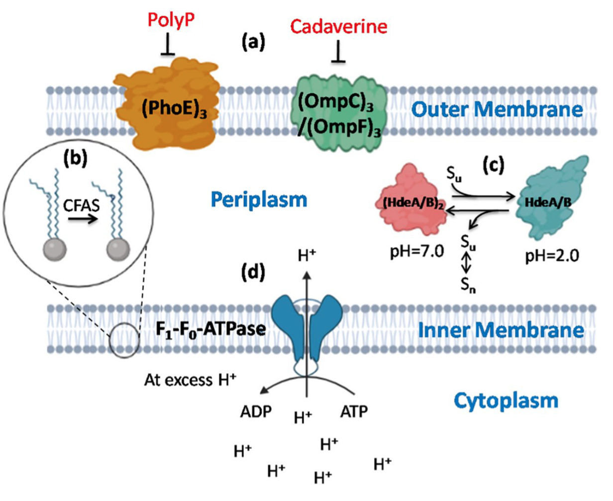
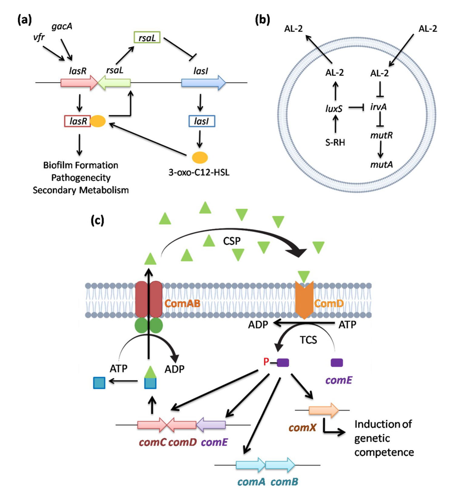
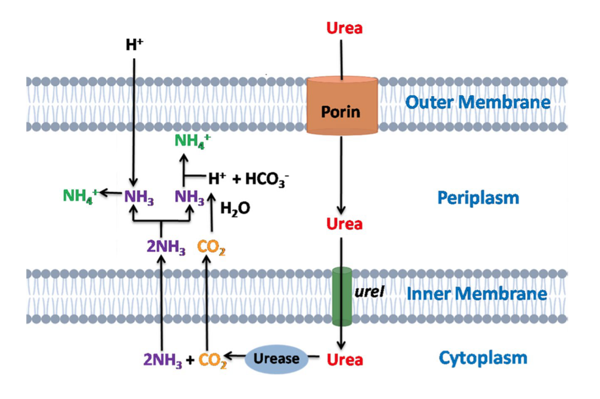
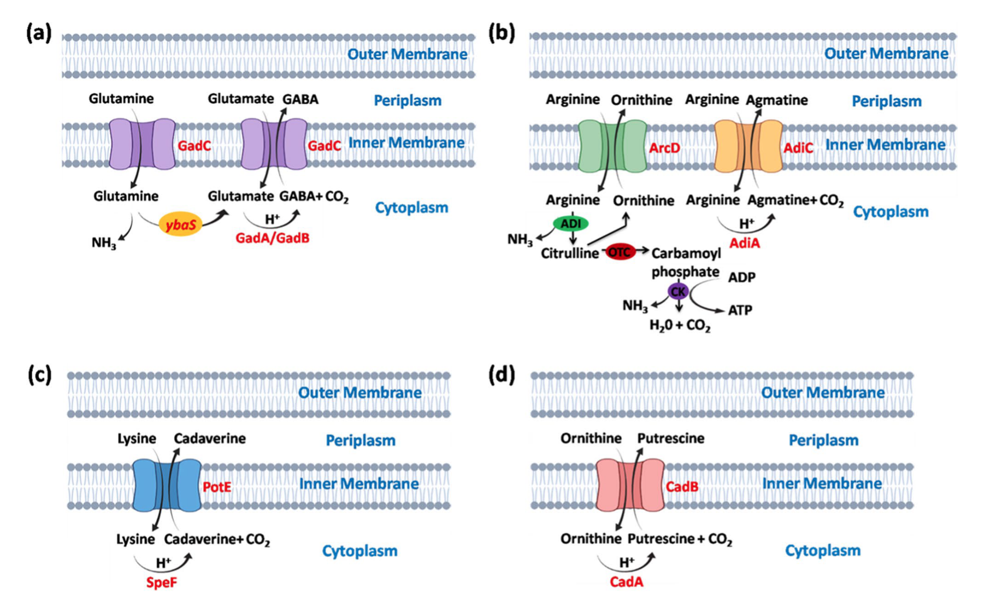

## Introduction

在进化过程中，细菌发展出多种机制以应对不同的环境压力，如酸性、温度和抗生素等。其中，酸性环境是细菌最常面临的极端条件之一。耐酸细菌是一类能够在pH 2.0至5.0（也有说6.0的）的强酸性环境中生存的极端微生物（另外还有生长的最适pH在4以下的微生物叫嗜酸微生物，它们不仅耐酸，还依赖酸性环境生长）。这些酸性环境可能由自然过程（如酸性矿山排水、海洋火山喷口和酸性硫泉）或人类活动（如工业废水排放）形成。工业废水中含有大量有机物、悬浮固体和氨氮，其低pH值为耐酸细菌的生存提供了条件。

耐酸细菌通过多种机制适应酸性环境，包括生理适应、代谢响应和质子消耗机制。在**生理适应**方面，细菌通过改变细胞膜组成和流动性来减少质子的内流。例如，降低不饱和脂质的浓度，并通过环丙烷脂肪酸磷脂合成酶修饰磷脂尾结构。此外，外膜蛋白（OMPs）可通过多磷酸盐或尸胺被阻断，而HdeA和HdeB等伴侣蛋白则能在酸性压力下释放底物蛋白。在大肠杆菌中，Hsp31伴侣蛋白和DNA结合蛋白Dps也在酸性压力下保护DNA的完整性。

在**代谢响应**方面，细菌通过质子外排和质子消耗机制应对酸性压力。例如，大肠杆菌K-12在轻度酸性压力下通过氧化电子传递链介导质子外排。此外，细胞膜在细菌适应极端环境中起关键作用，溶质通过ATP驱动的初级运输或质子动力驱动的次级运输系统跨膜运输。某些耐酸细菌（如大肠杆菌和丙酸杆菌）甚至能在pH 2.5的极端条件下存活数小时，主要通过进入稳定期并激活多种耐酸机制来实现。

耐酸细菌的机制在工业生物过程、有机酸生产、微生物燃料电池和工业废水生物处理中具有广泛应用。工业废水中含有大量有机物和有毒重金属，直接排放会对环境和人类健康造成严重危害。传统的化学处理方法（如混凝、沉淀和氧化）存在污泥产生、副产物生成和化学品消耗高等问题，而生物修复则是一种更环保的替代方案。耐酸细菌通过生物吸附、生物积累、生物降解和生物沉淀等机制修复酸性矿山排水或污染污泥中的重金属和石油烃化合物（如邻二甲苯、苯和甲苯）。

## 非典型环境

耐酸细菌是一类能够在pH 5.0及以下的极端酸性环境中繁衍生息的极端微生物。这些酸性环境可能由自然过程（如酸性矿山排水、海洋火山喷口和酸性硫泉）或人类活动（如工业革命后的工业废水排放）形成。

### 耐酸细菌的非典型环境与生态系统  

耐酸细菌主要存在于硫或黄铁矿氧化形成的pH低于5.0的酸性环境中。硫和亚铁在耐酸细菌的作用下分别被氧化为硫酸和三价铁。酸性黄铁矿区域常见于煤矿和硫矿周围，这些区域通常具有较高的硫化物浓度。由于重金属含量高而有机质含量低，这些区域的pH可低至1.0。参与硫酸盐氧化反应的极端耐酸细菌包括**Sulfobacillus thermosulfidooxidans**、**Thiobacillus acidophilus**和**Thiobacillus thiooxidans**等。此外，海底火山区域和热液喷口释放的大量还原硫也为耐酸细菌提供了适宜的生存环境。在金属氧化物中，锌和铜的硫化物最为丰富，而耐酸细菌如**Acidithiobacillus**、**Ferrimicrobium**、**Sulfobacillus**、**Acidimicrobium**和**Leptospirillum**等能够氧化铁和硫化物矿物。

工业废水、农业用地和市政排放的污染物通常含有高浓度的有机物和无机物（如重金属、异生物质、微塑料以及硝酸盐、磷酸盐和总氮），这些污染物导致废水pH降低，从而形成极端酸性环境。**Acidophilus**、**Brevibacterium**、**Leptospirillum**、**Stenotrophomonas**和**Thermogymnomonas**等极端耐酸细菌能够在低pH废水中生存。研究表明，酸性矿山排水、海洋火山喷口、酸性硫泉和工业废水是耐酸细菌的主要栖息地。

### 耐酸细菌在微生物生态中的作用  

由于酸性环境中溶解有机碳浓度较低，耐酸细菌通常被认为是寡营养型生物。在深矿等无阳光环境中，化能自养型耐酸细菌通过氧化硫化物和铁矿物生存。例如，**Leptospirillum ferrooxidans**在铁循环中起关键作用，它是一种专性化能自养菌，能够好氧氧化铁。在酸性矿山中，**Ferroplasma**、**Leptospirillum**和**Acidithiobacillus**等属的细菌广泛存在，其基因组测序显示存在编码固氮酶的基因。

废水中的重金属是导致低pH的主要原因，而耐酸细菌通过产生脲酶中和酸性环境。脲酶通过生成氨（NH₃）与细胞内质子结合，从而降低细胞内pH。工业废水中的氨去除包括硝化和反硝化两个步骤：化能自养细菌将氨转化为亚硝酸盐（NO₂⁻）和硝酸盐（NO₃⁻），随后硝酸盐通过反硝化过程转化为氮气（N₂）。耐酸细菌的氮源主要包括氨、亚硝酸盐、硝酸盐和其他溶解有机氮化合物。硝酸盐还原为氨的过程涉及两个独立的酶促反应：NADH₂-硝酸还原酶催化NO₃⁻还原为NO₂⁻，铁氧还蛋白-亚硝酸还原酶催化NO₂⁻还原为NH₃，这一过程需要大量能量。

## 耐酸的细胞机制

耐酸细菌在稳定期能够在低pH环境中存活数小时。为了适应极端酸性环境，多种细菌进化出了不同的细胞机制。当细菌暴露于酸性环境时，外膜和周质空间首先受到损害，因为外膜直接接触外部环境。在压力响应下，膜生物能量学、质子渗透和脂质生理学发生改变，从而降低膜的流动性和质子的通透性。细菌的耐酸细胞机制包括细胞膜修饰、F₁F₀-ATPase质子泵、生物膜形成、碱生成（脲酶活性）以及大分子的保护和修复。

### 细胞膜修饰  

外膜结构的改变主要发生在脂肪酸链或头基组成上。通过多磷酸盐或尸胺阻断外膜蛋白（OMPs），可以进一步减少质子的内流。例如，多磷酸盐阴离子（polyP）阻断PhoE3孔蛋白，而尸胺阻断OmpC3和OmpF3孔蛋白。在**Picrophilus oshimae**中，刚性单层膜和庞大的异戊二烯核心使其对质子不渗透。耐酸细菌通过改变脂肪酸的组成或结构来调节膜流动性。例如，环丙烷脂肪酸磷脂合成酶（CFAS）降低不饱和脂质的浓度，并对不饱和磷脂尾进行甲基化。

为维持pH稳态，耐酸细菌利用反向膜电位。在**Acidithiobacillus thioxidans**和**Acidithiobacillus ferrooxidans**中，丰富的次级转运蛋白（如H⁺-ATPase、同向转运蛋白和反向转运蛋白）帮助维持pH稳态。**Picophilus torridus**和**Thermoplasma acidophilum**则通过利用跨膜质子电化学梯度进行主动运输来调节酸性环境。膜通道的大小和通透性也是维持pH稳态的重要机制。例如，在**Acidithiobacillus ferrooxidans**中，当pH从3.5降至1.5时，外膜蛋白Omp40上调，其外部L3环调节孔蛋白入口的大小和离子选择性。

有机酸（如乙酸和乳酸）对耐酸细菌有害，因为这些质子化酸能够轻易通过细胞膜。**Picophilus torridus**的基因组揭示了编码有机酸降解途径的基因，包括丙酰-CoA合成酶、两种乙酰-CoA合成酶和乳酸-2-单加氧酶，这些酶将乳酸转化为丙酮酸。

### 伴侣蛋白与DNA保护  

HdeA和HdeB是两种周质伴侣蛋白，能够耐受酸性压力。HdeA的主要功能是防止酸诱导的蛋白质积累，并帮助蛋白质溶解和复性。HdeB具有类似功能。在大肠杆菌中，热休克伴侣蛋白Hsp31在酸性压力下结合并稳定未折叠的蛋白质中间体，随后允许蛋白质自发复性或依赖ATP的伴侣蛋白辅助复性。在酸性环境中，DNA结合蛋白Dps保护DNA免受损害。

### F₁F₀-ATPase质子泵

质子动力势（PMF）是细胞内质子梯度的体现，由细胞质与外部环境之间的电荷分离产生。依赖PMF的质子泵是细菌耐酸系统的重要组成部分，在维持pH稳态中起关键作用。在酸性环境中，H⁺的积累降低细胞内pH，随后质子泵开始消耗ATP。通过F₁F₀-ATPase进入细胞的质子在末端氧化酶处还原分子氧，导致代谢活动暂停。例如，**Sulfolobus acidocaldarius**通过F₁F₀-ATPase将质子排出细胞，从而在酸性环境中生存。在多种耐酸细菌（如**Streptococcus pneumoniae**和**Lactobacillus acidophilus**）中，F₁F₀操纵子因酸性pH的刺激而被转录。**Streptococcus mutans**则通过上调F₁F₀-ATPase应对酸性压力。因此，耐酸细菌通过F₁F₀-ATPase质子泵催化ATP水解，排出过量H⁺，从而耐受外部酸性环境并维持pH稳态。

### 生物膜形成

许多细菌通过形成生物膜（biofilm）以社区形式附着在表面，从而抵御酸性压力。生物膜形成是一种独特的耐酸机制，涉及细胞群体间的信号交流。在某些细菌中，生物膜对酸性环境具有强耐受性，而其浮游细胞则对酸性敏感。生物膜之所以能够耐受酸性压力，是因为某些蛋白质仅在生物膜形成时表达。例如，在**Pseudomonas aeruginosa**中，**vfr**和**gacA**基因调控**luxR**同源基因**lasR**，后者激活**lasI**表达，生成3-oxo-C12-HSL，与受体蛋白LasR结合形成复合物，从而调控生物膜形成。负调控因子**rsaL**则抑制**lasR**表达。这种LasR蛋白-AHL复合物正向驱动与生物膜形成、致病性和次级代谢相关的多个结构基因的表达。

在**Streptococcus mutans**中，**luxS**合成并分泌AL2，同时抑制**irvA**的转录。然而，当细胞遭遇酸性压力时，**irvA**基因的表达显著增加，进而抑制**mutA**和**mutR**的转录。**Streptococcus mutans**的群体感应系统通过调控生物膜形成实现耐酸性。ABC转运蛋白编码基因**comAB**的产物切割**comC**基因的产物，生成群体感应肽（CSP）。当CSP达到临界浓度时，传感器激酶ComD（由**comD**编码）磷酸化**comE**，启动替代σ因子**comX**的转录。在**Streptococcus pneumoniae**中，磷酸化的**comE**激活两个特异性操纵子**comAB**和**comCDE**，以及**comX**基因，后者诱导遗传竞争性和其他依赖细胞密度的表型。

### 碱生成——脲酶活性

耐酸细菌通过胞外代谢产生碱性化合物来中和酸性环境。脲酶将尿素水解为氨和二氧化碳（CO₂）。脲酶通过生成氨与细胞内的质子结合，从而降低细胞内pH，起到中和酸性的作用。脲酶系统由**ureIABCEFGD**操纵子组成，耐酸细菌通过调控这一系统在pH低至2.5的环境中存活。例如，在**Helicobacter pylori**和**Streptococcus salivarius**中，**ureI**基因帮助将尿素从外部转运至细胞质。因此，脲酶通过生成碱性产物氨，保护细胞免受酸性环境的损害。**Streptococcus sanguis**和**Streptococcus suis**也依赖脲酶活性抵御酸性压力。此外，苹果酸乳酸发酵是**Streptococcus mutans**和**Oenococcus oeni**产生碱的另一种方式，其在细胞质内通过碱生成过程应对酸性压力，同时生成并排出CO₂。因此，碱生成机制是耐酸细菌在酸性环境中生存的有效策略。

### 大分子的保护与修复

在酸性压力条件下，膜蛋白的稳定性至关重要。特定蛋白质在酸性环境中被诱导，以保护DNA和其他蛋白质。例如，**dps**蛋白通过形成笼状结构结合铁并减少过氧化氢的毒性来保护DNA，而**recA**则在DNA修复和激活SOS响应中起关键作用。**Oenococcus oeni**的热休克蛋白Lo18通过减少蛋白质聚集来增强细菌的耐酸性，从而稳定膜结构并保护蛋白质。**Ffh**蛋白参与膜内蛋白质转运途径，并帮助蛋白质向细胞外运输。此外，多种伴侣蛋白（如DnaK、DnaJ、GroEL、GroES、GrpE、Clp蛋白酶和EF-Tu）在酸性压力下作为分子伴侣参与蛋白质修复。

DNA损伤的修复则依赖于**uvrABCD**、DNA聚合酶和DNA连接酶。例如，在**Streptococcus mutans**中，**uvrA**在pH 5.0的酸性压力下修复DNA损伤。**Escherichia coli**的DnaK和**Deinococcus radiodurans**的IrrE也参与酸性压力下的DNA修复机制。在**Bacillus caldontenax**中，**uvrA**和**uvrB**协同识别并修复DNA损伤。

## 耐酸的遗传机制

除了细胞层面的相互作用，耐酸细菌还通过耐酸基因适应酸性环境。这些基因调控的耐酸机制包括四种依赖吡哆醛-5'-磷酸（PLP）的氨基酸脱羧酶酸耐受系统：谷氨酸依赖酸耐受系统（GDAR）、精氨酸依赖酸耐受系统（ADAR）、赖氨酸依赖酸耐受系统（LDAR）和鸟氨酸依赖酸耐受系统（ODAR）。这些系统协同作用，确保耐酸细菌在极端低pH环境中的代谢和生长。

### 谷氨酸依赖酸耐受系统（GDAR）  

GDAR系统由**gadA**和**gadB**基因编码的两种Gad酶以及**gadC**基因编码的谷氨酸/γ-氨基丁酸（GABA）反向转运蛋白组成。GadC将细胞外的质子化谷氨酸转运至细胞内，同时将细胞内的GABA转运至细胞外。通过谷氨酸与GABA的交换，细胞内质子被消耗，从而提高细胞内pH，保护细胞免受酸冲击。在**Lactobacillus reuteri**中，GadC通过交换GABA和谷氨酸发挥作用。此外，GadC还将谷氨酰胺转运至细胞内，在酸激活的**ybaS**基因帮助下转化为谷氨酸和氨。在**Escherichia coli**中，**ybaS**基因编码的谷氨酰胺酶将L-谷氨酰胺转化为L-谷氨酸，并通过生成氨中和H⁺。GDAR系统在pH低至2.0的极端酸性环境中对多种耐酸细菌的生存至关重要。

### 精氨酸依赖酸耐受系统（ADAR）

ADAR系统在酸性条件下（通常pH∼5.0）被最大程度诱导，主要存在于厌氧环境中生长的耐酸细菌中。该系统由**adiA**基因编码的胞质可诱导精氨酸脱羧酶、**adiY**基因编码的调控蛋白以及**adiC**基因编码的反向转运蛋白组成。精氨酸通过AdiC进入细胞，在AdiA的催化下转化为胍丁胺，随后胍丁胺被转运至细胞外。这一交换过程消耗细胞内质子，从而保护细胞。在**Escherichia coli**中，AdiC通过交换精氨酸和胍丁胺发挥作用。此外，ADAR系统还受ArcD反向转运蛋白调控，精氨酸通过ArcD进入细胞，经精氨酸脱亚胺酶（ADI）代谢为氨和瓜氨酸，最终生成ATP。在**Streptococcus pyogenes**中，ADAR系统是抵御酸性压力的主要机制。

### 赖氨酸依赖酸耐受系统（LDAR）  

LDAR系统在pH 5.5的厌氧条件下被诱导，由**cadBA**操纵子组成，包括**cadA**和**cadB**基因，受**cadC**基因产物调控。CadC通过与赖氨酸特异性渗透酶LysP的相互作用诱导**cadBA**操纵子。在**Escherichia coli**中，CadC通过LysP间接感知赖氨酸。赖氨酸通过CadB进入细胞，在CadA的催化下转化为尸胺，随后被CadB转运至细胞外。在**Edwardsiella tarda**中，**cadBA**操纵子帮助细菌在低pH环境中生存。

### 鸟氨酸依赖酸耐受系统（ODAR）  

ODAR系统在低pH条件下诱导**speF**和**potE**基因。鸟氨酸通过PotE进入细胞，转化为腐胺后被转运至细胞外。在**Escherichia coli**中，PotE通过交换鸟氨酸和腐胺发挥作用。这些脱羧酶在特定低pH范围内表现出最佳酶活性，例如**gadA/gadB**在pH 1.7-2.8范围内，**adiA**在pH 4.9-5.2范围内，**ldcI**在pH 5.7，**speF**在pH 6.5。因此，耐酸细菌在pH 4.0-7.0范围内表现出强酸应激响应，酶活性随pH升高而降低。

### 耐酸基因与细菌的进化与多样性 

为适应高度酸性环境，不同耐酸细菌发展出多种耐酸机制。耐酸基因从1924年发现的**Streptococcus mutans**逐渐进化而来。在酸性环境中，细胞质酸化导致蛋白质和DNA结构损伤，进而诱导蛋白修复伴侣DnaK和信号识别基因**ffh**的表达，增加氨基酸代谢和氨生成，并上调H⁺-ATPase和DNA损伤修复蛋白RecA。此外，**Streptococcus mutans**通过群体感应系统**irvA**和**luxS**调控生物膜形成，增强耐酸性。在**Streptococcus pyogenes**中，ADAR系统和F₁F₀-ATPase是主要的耐酸机制。**Salmonella enterica**则通过ADAR和LDAR系统在低pH环境中生存。**cadBA**操纵子在**arc**操纵子之后进化，参与赖氨酸脱羧和精氨酸脱羧机制。近年来，更复杂的耐酸操纵子（如**gad**操纵子）被广泛发现，这些系统通过水平基因转移和重组进化，从简单系统逐渐发展为广泛分布的复杂系统。

## 耐酸细菌在工业与生物修复中的应用

耐酸细菌的耐酸机制在工业生物过程和工业废水处理（如矿山废水和石油泄漏）中具有广泛应用（Feng等，2021）。这些机制还可用于提高有机酸的生产效率。开发有效的工具以增强耐酸机制，对扩大工业耐酸细菌的应用至关重要。

### 工业生物过程与生物发电中的耐酸菌株  

耐酸细菌在工业生物过程中发挥重要作用。例如，在乳酸发酵过程中，**Lactobacillus**通过大分子修复和谷氨酰胺酶依赖的酸耐受系统应对酸性压力。低pH激活谷氨酸脱羧酶系统，增加γ-氨基丁酸（GABA）的生成，从而筛选高效乳酸菌。**Lactobacillus reuteri**通过GadA/GadB将谷氨酸转化为GABA，并由GadC转运至细胞外。此外，**Lactobacillus lactis**通过减少细胞内质子、消耗H⁺和改变细胞膜成分来耐受酸性环境。分子伴侣GroES和GroEL蛋白以及**murG**、**gshA**和**gshB**基因通过遗传工程提高其耐酸性。

在乙酸和丁酸生产中，发酵细菌如**Clostridium tyrobutyricum**和**Acetobacter pasteurianus**通过**gadA**、**gadB**、**gadC**和**uvrA**等基因抵御酸性压力。RNA-Seq转录组学分析揭示了**Acetobacter pasteurianus**通过**yro2**、**mrh1**、**COX20**、**PEP3**和**RTT109**等基因修饰细胞膜并保护细胞。丙酸生产菌**Propionibacteria acidipropionici**则通过GDAR和ADAR系统以及**atpA**基因编码的F₁F₀-ATPase质子泵维持pH稳态，从而提高丙酸产量。

### 废水处理与生物发电  

耐酸细菌广泛用于处理市政污水、农业用地和工业废水。此外，它们还可用于生物发电。微生物燃料电池（MFC）是一种生物电化学装置，利用耐酸细菌催化废水中的可降解化合物生成生物电。在MFC中，耐酸细菌位于阳极室，氧化废水中的有机和无机底物，生成二氧化碳、质子和电子。质子通过质子交换膜传递至阴极，电子通过外部电路传递至阴极，最终还原氧气。**Acidithiobacillus**和**Ferroplasma**等菌株在pH 1.5-3.0范围内以四硫酸盐为电子供体产生生物电。然而，MFC的发电效率受高内电阻限制，需通过系统架构的优化提高电力输出。

### 在生物修复中的应用

耐酸细菌在生物修复中广泛应用，尤其是在酸性压力条件下。生物修复是指细菌将有害有机物质矿化或转化为无毒物质，进而参与自然生物地球化学循环的过程。酸性矿山排水（AMD）含有高浓度的铝、铅、砷和锌等重金属，其高酸性进一步溶解其他金属和类金属，增加矿物溶解。耐酸细菌如**Clostridium spp.** 和**Desulfovibrio spp.** 通过上流式厌氧污泥床反应器修复酸性矿山排水，其中**Desulfovibrio spp.** 利用F₁F₀-ATPase质子泵排出细胞内H⁺以耐受酸性环境。

废水中的有机污染物和有毒重金属可通过耐酸细菌的酶促反应降解。水解酶、脱氢酶、脱卤酶、蛋白酶和脂肪酶等代谢酶将有机污染物转化为无毒代谢物，实现环境友好型降解。耐酸细菌还可通过生物吸附、生物积累、生物转化和生物沉淀等机制修复重金属污染。例如，生物膜形成的耐酸细菌在去除金属方面更为高效，其胞外聚合物（EPS）通过带负电荷的功能基团吸附金属阳离子。**Desulfovibrio desulfuricans**产生的EPS有助于锌的生物吸附和生物沉淀，而**Lysinibacillus sphaericus RTA-01**则通过纳米吸附去除水溶液中的Cr⁶⁺。

硫酸盐氧化和硫酸盐还原耐酸细菌分别参与生物浸出和生物沉淀过程。**Acidithiobacillus ferrooxidans**和**Acidithiobacillus thiooxidans**等细菌通过生物浸出将低品位铁矿石中的金属氧化为低毒可溶性化合物。**Clostridium spp.** 和**Desulfovibrio spp.** 的混合培养物可高效去除铜、镉和镍等重金属。**Pseudomonas aeruginosa**通过产生金属螯合剂（如铁载体）提高金属溶解性。

耐酸细菌还可用于处理工业废水。**Acidophilus**、**Brevibacterium**、**Leptospirillum**和**Stenotrophomonas**等极端耐酸细菌可用于酸性矿山排水的生物处理。**Lysinibacillus sphaericus RTA-01**和**Bacillus pumilus CTO-05**可去除橡胶加工废水中的硝酸盐和磷酸盐。基因复制和耐酸基因的插入有助于提高细菌的生物修复能力。

多环芳烃（PAHs）是酸性废水中的常见污染物。**Acidocella sp.**和**Acidiphilium facilis**可在pH 2.0的极端条件下降解甲苯、萘、菲和蒽等石油烃。**Pseudomonas putida**也可用于降解邻二甲苯、苯和甲苯等化合物。生物修复效率受温度、pH、营养物可用性、溶解氧和电子受体等多种因素影响。**ybaS**、**cfa**、**dnaK**和**rpoS**等耐酸基因在PAHs的降解中起关键作用。因此，提高耐酸基因的表达是增强生物修复和降解效率的关键。

### 通过工程酸耐受性基因提高酸耐受性

通过基因工程技术改造耐酸基因，可显著提高细菌的耐酸性。基因组改组和原生质体融合是高效的技术手段。例如，**Propionibacterium acidipropionici**通过紫外线诱变和原生质体融合，获得耐酸菌株，丙酸产量提高了65%。**Lactococcus lactis**通过表达**Escherichia coli**的谷胱甘肽合成酶和**Propionibacterium freudenreichii**的海藻糖生物合成途径，增强了耐酸性。**Propionibacterium acidipropionici**工程化**atpA**基因，利用F₁F₀-ATPase泵出过量质子，维持细胞内pH；**Propionibacterium jensenii ATCC 4868**引入**arcA**、**arcC**、**gadB**、**gdh**和**ybaS**基因，提高了丙酸生产效率。

耐酸基因的引入为细菌提供了额外的耐酸机制，基因工程菌株在生物修复和有机污染物降解中具有重要应用。未来需进一步探索耐酸基因的作用，并利用先进基因工程技术进行深入表征，以实现工业废水、重金属和有机污染物的高效、可持续生物修复。

## References

1. Mallick, S., Das, S. Acid-tolerant bacteria and prospects in industrial and environmental applications. Appl Microbiol Biotechnol 107, 3355–3374 (2023). https://doi.org/10.1007/s00253-023-12529-w
2. Mirete, S., Morgante, V., González-Pastor, J.E. (2017). Acidophiles: Diversity and Mechanisms of Adaptation to Acidic Environments. In: Stan-Lotter, H., Fendrihan, S. (eds) Adaption of Microbial Life to Environmental Extremes. Springer, Cham. https://doi.org/10.1007/978-3-319-48327-6_9
3. Guan, N., Liu, L. Microbial response to acid stress: mechanisms and applications. Appl Microbiol Biotechnol 104, 51–65 (2020). https://doi.org/10.1007/s00253-019-10226-1
4. Lund PA, De Biase D, Liran O, Scheler O, Mira NP, Cetecioglu Z, Fernández EN, Bover-Cid S, Hall R, Sauer M, O'Byrne C. Understanding How Microorganisms Respond to Acid pH Is Central to Their Control and Successful Exploitation. Front Microbiol. 2020 Sep 24;11:556140. doi: 10.3389/fmicb.2020.556140. PMID: 33117305; PMCID: PMC7553086.