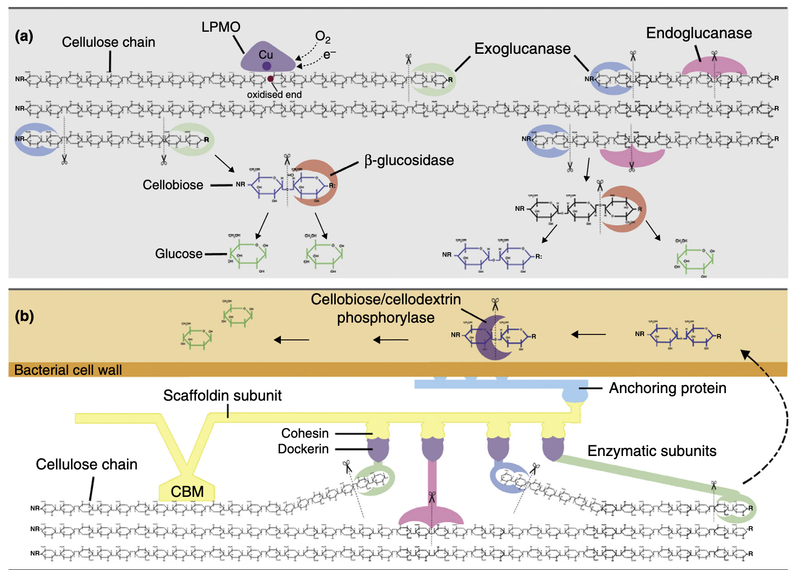
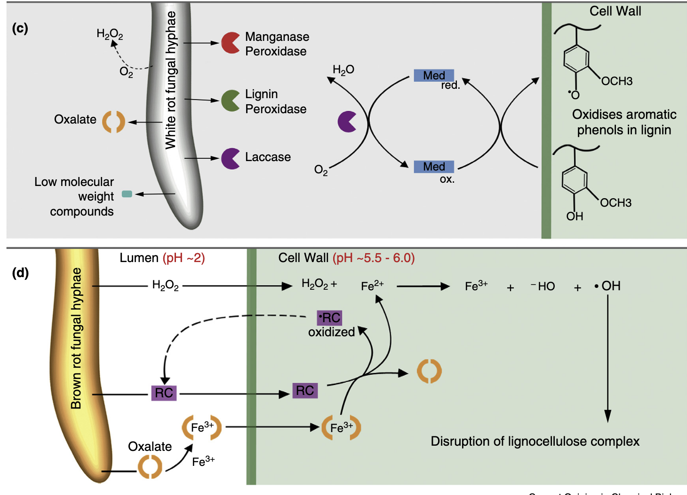
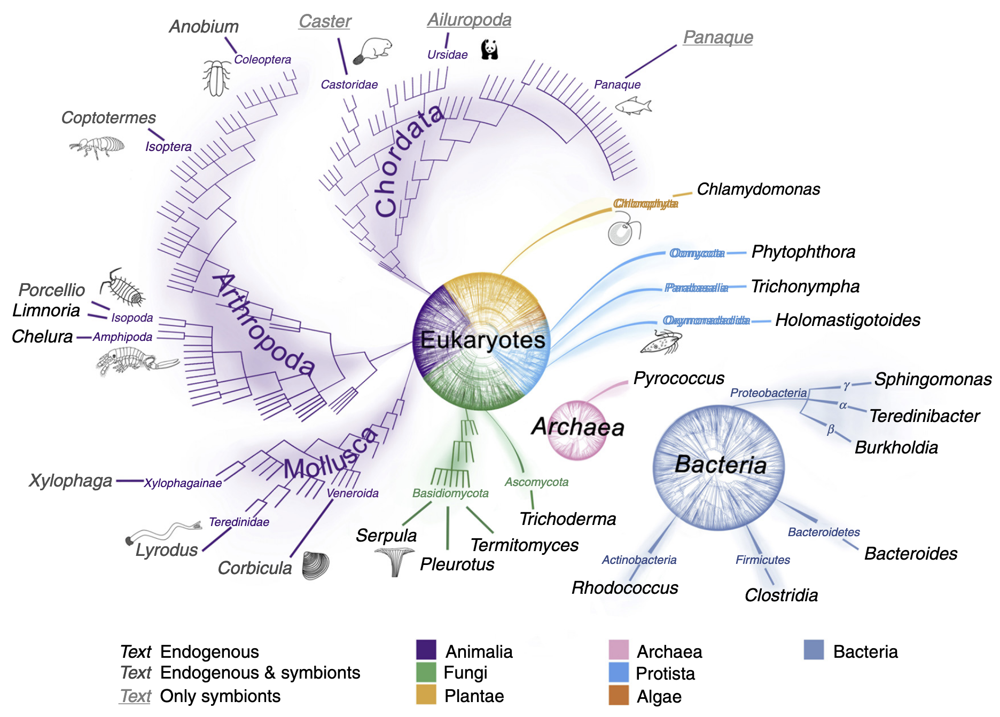

## Introduction

陆生植物将大部分光合作用固定的碳转化为木质纤维素（lignocellulose），这是一种由纤维素（cellulose）、半纤维素（hemicellulose）、果胶（pectin）和木质素（lignin）等聚合物组成的复合物。在植物生命周期中，这种复杂的基质为其提供结构完整性，并抵御植食性动物和病原体的侵害，因此大部分木质纤维素生物质由腐生生物和碎屑食性生物在碎屑食物网中分解。木质纤维素可作为生物燃料生产的原料，但由于纤维素的准结晶性、半纤维素对纤维素微纤维的复杂包覆以及木质素对多糖组分的穿插和包裹，其难以被酶解处理。在工业过程中，通常通过剧烈的化学和物理预处理来克服这种抗降解性，而生物体则能在生理耐受条件下实现木质纤维素的分解。

## 降解机制的多样性  

生物体通过多种方式降解木质纤维素，包括氧化攻击、半纤维素酶的作用以及动物的机械破坏，这些方式降低了木质纤维素的抗降解性，从而为解聚酶提供了更好的作用条件。碳水化合物活性酶及其底物结合蛋白的信息被整合在CAZy数据库中。近年来，肽模式识别技术被用于基于功能预测将糖苷水解酶（GH）和辅助活性酶（AA）家族分类为亚家族，并为挖掘基因组数据中的新酶提供工具。本文重点关注CAZy分类中的糖苷水解酶（GHs）和辅助活性酶（AAs），后者作为氧化还原酶，常与GHs协同作用。  

### 纤维素和半纤维素的酶解

在自然界中，纤维素和半纤维素的降解通过多种碳水化合物活性酶的协同作用实现。糖苷水解酶（GHs）是主要酶类，负责切断纤维素和半纤维素中的糖苷键。多糖酯酶通过去除甲基、乙酰基和酚酯基团辅助GHs发挥作用。在某些情况下，多糖裂解酶也参与解聚过程。不同生物类群中，GH酶的组合因物种、进化压力和环境生态位的不同而存在显著差异。例如，丝状真菌主要产生GH7家族酶，而原核生物则依赖GH48家族酶。尽管GH7家族酶曾被认为仅存在于真菌中，但最新研究表明它们也存在于其他真核生物中。尽管该家族酶在序列和结构上具有高度相似性，但其表面性质可能存在显著差异。其他GH家族则表现出更大的序列和功能多样性。

### 多糖的氧化解聚  
近年来，一种新的氧化酶学机制被发现，用于切断多糖链，这类酶被称为裂解多糖单加氧酶（LPMOs）。其中一些最初被归类为GH61家族纤维素酶，另一些则属于碳水化合物结合模块家族33。目前，降解纤维素的LPMOs被归入AA9家族（主要为真菌酶）和AA10家族（主要为细菌酶）。LPMOs不仅能作用于结晶纤维素，还能降解半纤维素。它们通过平坦活性位点中的铜原子直接氧化攻击聚合物链。此外，非酶解机制如褐腐真菌中的铁依赖芬顿化学反应也能降解纤维素。  

### 木质素的解聚  

木质素是一种异质性烷基芳香族聚合物，由三种甲氧基化程度不同的芳香醇组成。自然界中存在多种木质素修饰策略，但能降解木质素的生物远少于降解纤维素的生物。白腐担子菌和一些木质素降解细菌通过分泌过氧化物酶和漆酶等氧化酶降解木质素，生成一系列异质性芳香族化合物，最终被分泌生物或其他微生物代谢。褐腐真菌虽缺乏木质素降解酶，但利用小分子活性物质解聚木质素，切断丙基侧链并脱甲氧基，随后在其他部位重新聚合，以释放纤维素组分并促进降解。修饰后的木质素不被褐腐真菌代谢，而是残留在土壤中。  

## 木质纤维素降解生物的多样性  

纤维素由多种海洋生物合成，其降解机制可能起源古老。木质素降解的演化则与二叠纪末期有机碳埋藏量的下降同步。陆生植物出现时，生命之树的主要分支已分化，因此木质纤维素降解能力具有多源性，并在生命之树的多个小分支中持续演化。例如，昆虫-原生生物共生关系（促进木质纤维素消化）在侏罗纪晚期出现，而依赖细菌共生的木材消化能力则是双壳类家族Teredinidae和Xylophagainae最后共同祖先的特征。在自然界中，具有互补酶的生物共生体和群落广泛参与生物质的降解。降解过程在多种（有时极端的）环境条件下进行，涉及pH、氧化还原电位、温度和压力的广泛范围，这反映了参与生物的多样性。

### 原核生物

近年来，强大的宏组学技术使得从富含木质纤维素的环境（如堆肥）中挖掘原核生物群落的遗传多样性成为可能，从而发现可能在工业条件下表现优异的新型木质纤维素降解酶。通过比较宏转录组分析，研究人员已识别出在高负荷条件下能够降解稻草的堆肥微生物群落中高表达的基因。利用宏基因组学和宏蛋白质学对复杂群落中木质纤维素降解微生物的研究，揭示了群落成员的结构、功能及其在营养供应等环境条件变化下的遗传和功能响应。  

宏组学还为肠道微生物群落的复杂相互关系提供了新见解。白蚁是消化共生的典型例子。在低等白蚁中，细菌和古菌生活在肠道内吞噬木质颗粒的鞭毛虫的细胞质和表面，也存在于粘稠的肠道液体中。拟杆菌门、厚壁菌门、螺旋体门、变形菌门和Elusibacteria是该微生物群的主要成员，参与将生物质转化为甲烷、氢气和乙酸的代谢途径。在低等白蚁Reticulitermes中，通过16S rRNA探针检测到超过4700种细菌系统型。高等白蚁的后肠仅含有原核生物，这些微生物促进经白蚁酶预处理的木质颗粒的分解。后肠液体的纤维素酶活性较低，但与木质颗粒相关的细菌表现出强纤维素酶活性。  

一些土壤细菌被证实能够氧化木质素，主要属于放线菌门、α-变形菌门或γ-变形菌门，其中一些也存在于白蚁肠道和钻木昆虫中。近年来，原核生物中木质素降解酶的研究取得进展，染料脱色过氧化物酶家族的酶在革兰氏阳性放线菌Rhodococcus jostii RHA1、Amycolatopsis sp. 75iv2和革兰氏阴性γ-变形菌Pseudomonas fluorescens Pf-5中显示出对Mn(II)和β-芳基醚木质素模型化合物的氧化活性。细菌漆酶在链霉菌A3(2)中被证明是酸沉淀木质素生成所必需的。此外，Sphingobium SYK-6中的谷胱甘肽依赖性β-醚酶已被表征，但其在木质纤维素降解中的作用仍需进一步研究。  

古菌也存在于堆肥和白蚁肠道中，但其木质纤维素降解机制研究较少。一些古菌能在高温下降解木质纤维素，例如在Pyrococcus中发现的GH12内切葡聚糖酶。古菌中已鉴定出五个可能氧化木质素的漆酶基因，其中三个属于盐杆菌目，一个属于热变形菌目。  

海洋中的自由生活木质降解原核生物分为隧道细菌和侵蚀细菌，其植物细胞壁降解模式不同。隧道细菌为革兰氏阴性杆菌，侵蚀细菌属于黄杆菌-噬纤维菌群。由于两者均未在纯培养中生长，其独立作用机制尚不清楚，但其降解速率较真菌缓慢，主要降解纤维素和半纤维素，而对木质素的改变较小。深水中的木材会招募特定的耐压细菌群落，这些群落与以木材为食的钻孔动物粪便中的细菌明显不同。

### 单细胞真核生物和原生生物  
一些自由生活的原生生物被发现具有内源性纤维素酶。黏菌Dictyostelium的基因组编码一种推测的GH7纤维二糖水解酶，而绿藻Chlamydomonas则利用内切葡聚糖酶降解胞外纤维素。甲藻Alexandrium产生一种与白蚁共生菌相似的纤维素酶，但其功能可能更倾向于辅助细胞分裂而非消化。然而，致病性卵菌Phytophthora则分泌一系列针对半纤维素和纤维素的细胞壁降解酶，包括GH家族1、5、6、7、10以及AA9和AA10的成员。低等白蚁的肠道中寄宿多达19种鞭毛虫类原生生物，这些原生生物吞噬木质颗粒，并在其消化液泡中含有多种酶，如内切葡聚糖酶、GH7纤维二糖水解酶、β-葡萄糖苷酶、木聚糖酶、甘露糖苷酶和阿拉伯糖苷酶。  

### 真菌  
生物质降解真菌依赖复杂的降解机制，主要包括两类过程：一是直接酶解（如纤维二糖水解酶的作用），二是生成氧化性物质（如自由基）作用于生物质。随着对担子菌门基因组研究的新进展，传统上分类为白腐菌或褐腐菌的真菌可能不再完全符合这些类别，因为其代谢物表达和降解模式存在渐变。然而，在典型的白腐菌降解中，真菌主要采用酶解攻击模式。由于降解酶体积过大，无法穿透完整的细胞壁，白腐菌仅从木质纤维素表面开始攻击。白腐菌使用的酶包括完整的纤维素酶，以及能够氧化木质素成分的酶，如木质素酶、锰过氧化物酶、多功能过氧化物酶或漆酶，或这些酶的组合。一些白腐菌还被发现具有大量LPMO基因。  

褐腐菌从白腐菌的祖先中多次独立演化而来，在这些进化过程中，木质素降解酶系统和关键纤维素酶逐渐丢失。至少三个褐腐菌目（Gloeophyllales、Polyporales和Boletales）演化出螯合剂介导的芬顿（CMF）系统，替代了大部分纤维素酶机制，从而提供了一种高效的生物质解聚和生物修饰途径。CMF系统是生物系统中唯一基于氧自由基化学的底物降解机制，能够在距离生物体数微米的位置进行非酶解降解。CMF系统的高效性被认为使褐腐菌在生态位竞争中占据优势，例如在针叶木材降解中取代了白腐菌。  

一些子囊菌也能降解木材细胞壁，形成沿S2基本纤维方向排列的菱形腔链，导致软腐。软腐真菌已知能产生完整的纤维素酶，但其木质素降解能力存在争议，据报道其分泌的未指定胞外过氧化物酶和氧化酶功能较白腐菌更为有限。

### 动物  
许多无脊椎动物表达内源性纤维素酶。植物寄生线虫、蟑螂和白蚁是最早被证实携带纤维素酶基因的动物，但近年来，这些基因（主要属于GH5、9和45家族）也在其他类群中被明确发现，如其他昆虫、腹足类、甲壳类和环节动物。由于许多昆虫或甲壳类缺乏类似反刍动物和白蚁的大型消化肠道腔室来培养肠道共生微生物，因此这些草食性和碎屑食性动物需要依赖内源性纤维素酶。它们通过口器或外壳对底物进行机械破碎，部分克服了木质纤维素的抗降解性。  

钻木双壳类（如船蛆）通过外壳的研磨作用摄入木质颗粒。它们缺乏显著的肠道微生物群，而是在鳃的特化细胞内寄宿γ-变形菌内共生体。在船蛆Bankia setacea中，这些细菌产生的木质纤维素降解酶被选择性运输到肠道，包括GH家族5、6、9、10、11、45和53以及碳水化合物酯酶家族1、3、4、6和15的代表，以及AA10家族的LPMOs。这种细菌与消化部位的分离可能使宿主能够捕获释放的糖类，而无需与肠道微生物群竞争。内共生细菌还被证明能够在体内固氮，从而补充木材中有限的有机氮源。船蛆的深海近缘类群Xylophagainae具有类似的共生和降解机制，但能够在极端压力下运作。在摄食陆地植物碎屑的双壳类Corbicula的消化腺和晶杆中，也检测到内源性GH9、10和45酶，但其晶杆在高度木质化底物降解中的作用尚待阐明。  

在白蚁中，内源性纤维素酶（由唾液腺和中肠产生）与后肠中鞭毛虫和细菌产生的微生物酶协同作用，后者还通过氧化降解木质素基质部分接触纤维素纤维。其他无脊椎动物中内源性酚氧化酶样酶在木质素降解中的作用尚不明确，但近期研究表明活化血蓝蛋白可能参与酚氧化。甲壳类中被证实具有内源性半纤维素酶（如昆布多糖酶），而在白蚁中，半纤维素酶（如木聚糖酶、半乳聚糖酶）主要来自细菌，尽管甘露聚糖酶活性被归因于白蚁的共生原生生物。  

大多数白蚁依赖肠道微生物群，有时这些微生物甚至存在于鞭毛虫的细胞或细胞核内。而大白蚁亚科则在其巢穴中培养担子菌Termitomyces，该真菌产生多种能够水解复杂多糖的GHs。白蚁工蚁携带能够消化真菌释放的寡糖的细菌。  

食木甲壳类Chelura（端足类）和Limnoria（等足类）产生属于多个CAZy家族的内源性酶，其中GH5、7和9成员在消化腺转录组中最为显著。它们是已知唯一产生GH7酶的后生动物，其消化道缺乏常驻微生物，因此不具备白蚁中复杂的肠道化学结构。这些动物具有类似酶反应器的肠道，为研究酶功能提供了一个不受微生物相互作用干扰的理想模型。  

木质纤维素消化在脊椎动物中是一种罕见的饮食策略，但少数陆生（如河狸、熊猫和豪猪）和水生脊椎动物在其正常饮食中摄入大量木质纤维素。除熊猫外，尚不清楚这是否为专性食木性，而熊猫对其饮食的适应性出人意料地差。目前正在研究促进脊椎动物木质纤维素消化的微生物组。新热带淡水生态系统中的鲶鱼科鱼类（如Panaque spp.）是食木性动物。通过16S rRNA基因分析发现，P. nigrolineatus的胃肠道拥有一个包含纤维素降解和固氮微生物近缘种的微生物群落。该群落中的纤维素降解细菌已被表征，并发现其与固氮菌在脊椎动物胃肠道内共生。

## CAZy数据库

**官网**: [CAZy](http://www.cazy.org/)

CAZy（Carbohydrate-Active Enzymes，碳水化合物活性酶）数据库是一个专门收录与碳水化合物降解、修饰和合成相关酶的综合性数据库。它基于酶的功能和结构特征，将碳水化合物活性酶分为多个家族，包括糖苷水解酶（Glycoside Hydrolases, GHs）、糖基转移酶（Glycosyl Transferases, GTs）、多糖裂解酶（Polysaccharide Lyases, PLs）、碳水化合物酯酶（Carbohydrate Esterases, CEs）以及辅助活性酶（Auxiliary Activities, AAs）。这些酶在木质纤维素降解、生物质转化以及工业生物技术中具有重要作用。  

CAZy数据库通过系统化的分类和注释，为研究人员提供了丰富的基因和酶功能信息。例如，糖苷水解酶（GHs）家族包含多种能够切断纤维素和半纤维素中糖苷键的酶，而辅助活性酶（AAs）家族则包括氧化还原酶，常与GHs协同作用以增强降解效率。CAZy数据库不仅收录了已知酶的序列和结构信息，还提供了基于基因组和宏基因组数据的预测工具，帮助研究人员识别新型碳水化合物活性酶。  

在木质纤维素降解研究中，CAZy数据库被广泛应用于基因功能注释和酶家族分类。通过结合宏基因组学、宏转录组学和宏蛋白质组学数据，研究人员可以挖掘环境中微生物群落的遗传潜力，识别具有工业应用价值的新型酶。例如，利用CAZy数据库，科学家能够快速筛选出参与纤维素、半纤维素和木质素降解的关键酶基因，并进一步研究其功能和应用潜力。

## dbCAN

**官网**: [dbCAN](http://bcb.unl.edu/dbCAN2/)

dbCAN（Database for automated Carbohydrate-active enzyme ANnotation）是一个专门用于自动化注释碳水化合物活性酶（CAZymes）的数据库和工具集。它基于CAZy数据库的分类框架，结合了多种计算方法，能够快速、准确地从基因组、宏基因组或蛋白质组数据中识别和注释CAZymes。dbCAN的目标是为研究人员提供一个高效的工具，帮助他们挖掘和分析与碳水化合物代谢相关的基因和酶。

### 主要特点与功能  
1. **基于CAZy分类框架**  
   dbCAN延续了CAZy数据库的分类体系，将碳水化合物活性酶分为六大类：糖苷水解酶（GHs）、糖基转移酶（GTs）、多糖裂解酶（PLs）、碳水化合物酯酶（CEs）、辅助活性酶（AAs）以及碳水化合物结合模块（CBMs）。这种分类方式便于研究人员快速理解酶的功能和分类。

2. **自动化注释工具**  
   dbCAN提供了一套自动化注释工具，包括：  
   - **HMMER**：基于隐马尔可夫模型（HMM）的搜索工具，用于识别CAZymes家族。  
   - **DIAMOND**：一种快速的序列比对工具，用于初步筛选CAZymes。  
   - **Hotpep**：基于短肽模式的搜索工具，用于补充HMMER和DIAMOND的结果。  
   这些工具可以单独或联合使用，以提高注释的准确性和全面性。

3. **用户友好的在线平台**  
   dbCAN提供了一个在线平台，用户可以通过上传基因组或蛋白质序列文件，快速获得CAZymes的注释结果。平台支持多种输入格式，并生成详细的注释报告，包括酶家族分类、功能预测和序列比对信息。

4. **数据库更新与扩展**  
   dbCAN定期更新，与CAZy数据库保持同步，确保注释结果的准确性和时效性。此外，dbCAN还整合了其他相关数据库的信息，如UniProt和PDB，为用户提供更全面的酶功能信息。

- **基因组与宏基因组分析**：dbCAN广泛应用于基因组和宏基因组数据中CAZymes的挖掘，帮助研究人员识别与碳水化合物降解、修饰和合成相关的基因。  
- **功能驱动研究**：通过dbCAN注释，研究人员可以快速筛选出特定功能的酶家族，进一步研究其催化机制和底物特异性。  

## References
1. Dashora, K. et al. Leveraging multiomics approaches for producing lignocellulose degrading enzymes. Cell. Mol. Life Sci. 79, 132 (2022).
2. Andlar, M. et al. Lignocellulose degradation: an overview of fungi and fungal enzymes involved in lignocellulose degradation. Eng. Life Sci. 18, 768–778 (2018).
3. Cragg, S. M. et al. Lignocellulose degradation mechanisms across the tree of life. Curr. Opin. Chem. Biol. 29, 108–119 (2015).
