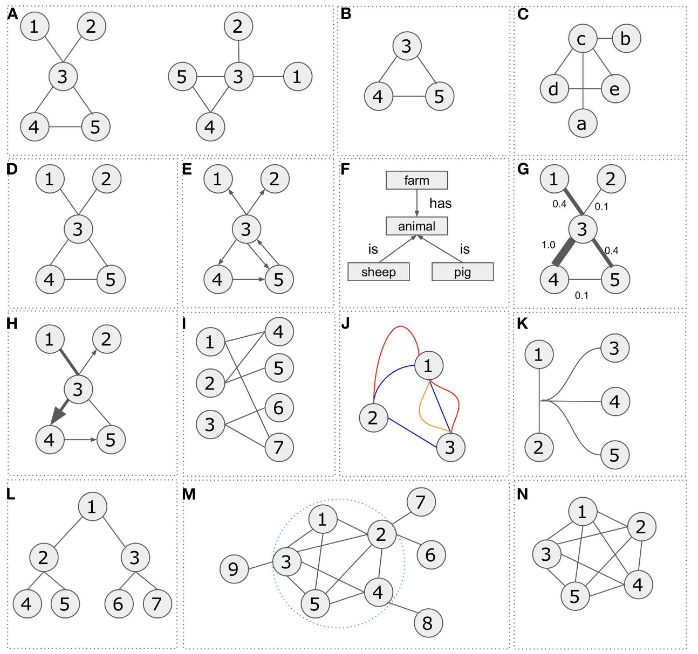
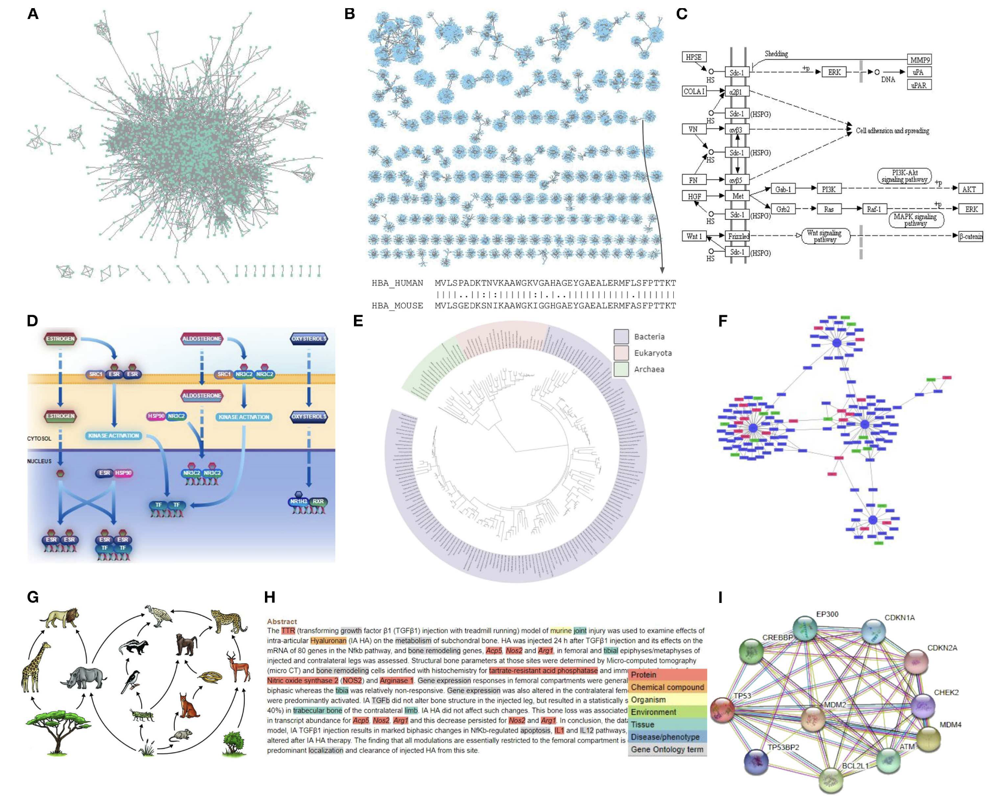

```{r include=FALSE}
devtools::load_all("~/Documents/R/pcutils/")
devtools::load_all("~/Documents/R/MetaNet/MetaNet/")
data(otutab, package = "pcutils")
knitr::opts_chunk$set(message = FALSE,warning = FALSE,cache = T,fig.width = 6)
```

网络分析是各种组学数据分析的重要组成部分。我在刚接触生信时对这类分析还挺感兴趣的，一边学一边写了个R包MetaNet。因为同类型工具有不少，包括在线网站，交互界面等，也就一直没有推广，主要是给自己用的。但现在整着整着感觉也比较系统了，也有一些别的工具不好实现的功能，想发出来让大家用用看。**大家也可以帮忙在github上点点star⭐️**，谢谢🙏

- 软件主页：<https://github.com/Asa12138/MetaNet>
- 详细英文版教程：<https://bookdown.org/Asa12138/metanet_book/>

ps，我是看到"生信益站"有篇推文翻译了一下我的MetaNet的README文件，收获了近2万阅读量😂想起来搞一下这个。最近可能也会先提交一个preprint。

## Introduction

网络（Network）或图（Graph）是用于描述复杂系统中元素间相互关系的数学结构，广泛应用于生物学、计算机科学、社会学等领域。网络由**节点（Node/Vertex）** 和 **边（Edge）** 组成，其中节点代表系统中的实体（如基因、蛋白质、用户），边表示它们之间的连接关系（如相互作用、通信、调控）。  

### 基本类型




- **1. 无向图（Undirected Graph）**  
无向图中的连接没有方向性，节点之间的关系是双向的。例如，在社交网络中，两个人成为好友意味着彼此互为邻居。在生物学中，基因共表达网络就是一种典型的无向图，连接表示两个基因的表达水平具有相关性。  

- **2. 有向图（Directed Graph）**  
有向图中的连接带有方向，表示单向关系。例如，在信号通路中，一个蛋白质可能激活或抑制另一个蛋白质，这种调控关系具有明确的指向性。生物学中常用不同箭头样式表示不同类型的调控作用（如激活、抑制）。  

- **3. 加权图（Weighted Graph）**  
加权图的每条连接都有一个权重值，用于表示关系的强度或重要性。例如，在蛋白质相互作用网络中，权重可以反映实验验证的可靠性；在基因共表达网络中，权重可能代表相关性的大小。  

- **4. 二分图（Bipartite Graph）**  
二分图的节点可以分成两组，连接只存在于不同组的节点之间。例如，在药物-靶点网络中，药物和靶点属于不同的组，连接表示某种药物作用于某个靶点。  

- **5. 多重边图（Multi-edge Graph）**  
多重边图允许同一对节点之间存在多条连接。例如，在知识图谱中，两个实体之间可能有多种不同类型的关系（如基因A既调控基因B，又与基因B有物理相互作用）。  

- **6. 超图（Hypergraph）**  
超图的连接可以同时关联多个节点，适用于描述复杂的高阶关系。例如，在代谢网络中，一个生化反应可能涉及多个底物和产物，超图可以更自然地表示这种多分子参与的相互作用。  

- **7. 树（Tree）**  
树是一种特殊的无向图，其中任意两个节点之间只有一条路径相连，且没有环路。例如，进化树描述物种之间的演化关系，基因本体树则用于表示功能分类的层级结构。  

- **8. 连通图（Connected Graph）**  
在连通图中，任意两个节点之间至少存在一条路径。如果网络不连通，则可能由多个独立子图组成，例如某些微生物群落网络可能包含多个互不关联的物种群体。  

- **9. 完全图（Complete Graph）**  
完全图中每对不同的节点之间都有一条连接。虽然在实际生物网络中较少见，但在某些模拟分析中，完全图可以作为理论参考模型。  

- **10. 团（Clique）**  
团是指无向图中一个节点子集，其中每对节点之间都有连接。在蛋白质相互作用网络中，高度紧密的团可能代表蛋白质复合物或功能模块。  

### 组学应用

在生物医学，尤其是近期的组学研究中，网络可以捕获任何类型的生物实体之间的关联，例如蛋白质，基因，小分子，代谢产物，配体，疾病，药物甚至数据库记录。网络分析提供系统级视角解析复杂机制，覆盖从分子到生态系统的多层次研究，是整合多组学数据的重要方法。



- **1. 蛋白质-蛋白质相互作用网络（PPIs）**
蛋白质-蛋白质相互作用网络通过实验或计算方法揭示蛋白质间的物理结合或功能协作关系，是研究细胞信号转导、复合体形成和疾病机制的重要工具。例如，癌症相关蛋白通常在PPI网络中呈现高度连接性，帮助识别关键调控节点和潜在药物靶点。

- **2. 序列相似性网络（SSNs）**
序列相似性网络基于基因或蛋白质序列的相似性构建，用于分析基因家族进化、功能分化和水平基因转移。通过设定相似性阈值，可聚类同源基因并预测新功能，广泛应用于酶家族分类（如P450超家族）和宏基因组数据分析。

- **3. 基因调控网络（GRNs）**
基因调控网络描述转录因子与靶基因间的调控关系，整合ChIP-seq、RNA-seq等数据以揭示发育、疾病或环境响应中的调控逻辑。例如，干细胞多能性网络中的核心转录因子（如OCT4、SOX2）通过GRN分析被确定为命运决定的关键因子。

- **4. 代谢网络（Metabolic Networks）**
代谢网络以生化反应为基础，节点代表代谢物，边表示酶催化的反应，用于模拟代谢通量并优化生物合成途径。在微生物工程中，此类网络指导设计高产菌株，如抗生素或生物燃料的微生物生产。

- **5. 基因共表达网络（Gene Co-expression Networks）**
基因共表达网络通过转录组数据（如RNA-seq）计算基因表达相关性，挖掘功能模块或生物标记物。例如，WGCNA算法可识别与特定性状相关的共表达模块，如植物抗逆性或肿瘤亚型特征基因群。

- **6. 物种互作网络（Species Interaction Networks）**
物种互作网络（如食物网、共生网络）量化生态系统中物种间的捕食、竞争或互利关系，评估生态稳定性和多样性。网络拓扑分析可预测物种灭绝的级联效应，助力保护生物学研究。

当然还有其他很多很多重要的生物学研究中的网络了。

### 常用工具

- Cytoscape是最流行的生物网络可视化分析平台，支持多种网络类型和插件扩展。
- Gephi是专注于大规模网络可视化的工具，提供多种布局算法和动态网络分析功能。
- igraph是高效的网络分析库，支持R/Python等语言。
- STRING是综合蛋白质相互作用数据库，提供实验验证和预测的相互作用数据。
- BioGRID是全面的PPI数据库，包含超过100万条蛋白质相互作用记录。
- GENIE3基于机器学习算法推断基因调控网络，适用于单细胞RNA-seq数据。
- iRegulon整合ChIP-seq和motif数据预测转录调控网络。KEGG Mapper是基于KEGG数据库的代谢网络分析工具。
- COBRA Toolbox是MATLAB平台的代谢网络建模工具，支持通量平衡分析。
- WGCNA是加权基因共表达网络分析的标准工具。
- EcoNet是专为生态网络设计的分析工具。
- NetworkX是Python的通用复杂网络分析库。
- NetworkAnalyst是在线网络分析平台，支持多种网络类型。

## MetaNet

MetaNet 是一个专注于生物组学（omics）数据的综合性网络分析 R 包。旨在帮助研究人员快速构建、分析和可视化多组学数据的复杂网络，支持高通量数据的处理（如超过 10,000 个节点的网络）。以下是其主要特点：

1. **多组学整合分析**  
   支持多种组学数据（如微生物组、转录组等）的联合网络分析，便于挖掘跨组学关联。

2. **高效计算**  
   • 快速计算相关性网络（如物种间互作），通过并行计算加速分析。  
   • 优化大数据处理能力，适用于大规模网络。

3. **可视化与兼容性**  
   • 提供多种网络布局算法，支持交互式可视化。  
   • 可导出至常用工具（如 Gephi、Cytoscape）或与 `ggplot2` 集成绘图。

4. **拓扑分析**  
   计算丰富的网络拓扑指标（包括生态网络稳定性），适用于复杂网络研究。
   

### 安装

可以从 CRAN 安装稳定版：`install.packages("MetaNet")`  

最新的开发版本可以在 <https://github.com/Asa12138/MetaNet> 中找到：

```r
remotes::install_github("Asa12138/MetaNet", dependencies = T)
```

依赖包 `pcutils`和`igraph`（需提前安装），推荐配合 `dplyr` 进行数据操作。

```r
library(MetaNet)
library(igraph)

# ========data manipulation
library(dplyr)
library(pcutils)
```

### 快速使用

下图是 MetaNet 的整体开发框架，包括数据处理，网络构建，网络分析，网络可视化和其他功能，核心是一个继承igraph的metanet对象：
   


下面以一个微生物共丰度网络为例（是我最早也是做得最多的分析）：

```{r fig.width=8,fig.height=5}
# 加载示例数据（otu表，来自pcutils包）
data("otutab", package = "pcutils")

# 转置数据（微生物组分析通常需要行为样本，列为物种/OTU）
t(otutab) -> totu  # totu: 转置后的矩阵，行=样本，列=物种/OTU

# 计算物种间相关性矩阵（使用Spearman秩相关）
c_net_calculate(
  totu, 
  method = "spearman"  # 可选"pearson"/"spearman"/"kendall"
) -> corr  # corr: 存储相关系数和p值的矩阵

# 构建共现网络（基于阈值筛选）
c_net_build(
  corr,
  r_threshold = 0.65,      # 保留|r| ≥ 0.65的边
  p_threshold = 0.05,     # 保留p < 0.05的边（统计显著性）
  delete_single = TRUE    # 删除无连接的孤立节点
) -> co_net  # co_net: 生成的metanet网络对象

# 添加网络属性（注释节点信息）
co_net <- c_net_set(
  co_net, 
  taxonomy,               # 数据框：物种分类信息（如Phylum列）
  data.frame("Abundance" = colSums(totu)),  # 节点属性：总丰度
  vertex_class = "Phylum", # 用Phylum分类作为节点颜色分组
  vertex_size = "Abundance" # 用Abundance值调整节点大小
)

# 计算网络布局（可视化坐标）
coors <- c_net_layout(
  co_net,
  method = nicely()       # 使用默认美观布局
)

# 绘制网络图（默认显示节点、边和分类颜色）
c_net_plot(co_net, coors = coors) 
```


再来一个多组学网络构建：

```{r fig.width=8,fig.height=5}
data("multi_test", package = "MetaNet")

# build a multi-network
multi1 <- multi_net_build(list(Microbiome = micro, Metabolome = metab, Transcriptome = transc),
  r_threshold = 0.6,      # 保留|r| ≥ 0.6的边
  p_threshold = 0.05)

# set vertex_class
multi1_with_anno <- c_net_set(multi1, micro_g, metab_g, transc_g, 
                              vertex_class = c("Phylum", "kingdom", "type"))
# set vertex_size
multi1_with_anno <- c_net_set(multi1_with_anno,
  data.frame("Abundance1" = colSums(micro)),
  data.frame("Abundance2" = colSums(metab)),
  data.frame("Abundance3" = colSums(transc)),
  vertex_size = paste0("Abundance", 1:3)
)

plot(multi1_with_anno)
```


后续我会发推文具体介绍MetaNet分析流程的每个功能模块，大家也可以先直接看详细英文版教程：<https://bookdown.org/Asa12138/metanet_book/>，我也尽可能为每个函数编写了详细的help文件和examples，欢迎大家提出宝贵意见。


## References
1. Koutrouli M, Karatzas E, Paez-Espino D and Pavlopoulos GA (2020) A Guide to Conquer the Biological Network Era Using Graph Theory. Front. Bioeng. Biotechnol. 8:34. doi: 10.3389/fbioe.2020.00034
2. Faust, K., and Raes, J. (2012). Microbial interactions: from networks to models. Nat. Rev. Microbiol. https://doi.org/10.1038/nrmicro2832.
3. Deng, Y., Jiang, Y., Yang, Y., He, Z., Luo, F., and Zhou, J. (2012). Molecular ecological network analyses. BMC Bioinf. https://doi.org/10.1186/1471-2105-13-113.
4. Girvan, M., and Newman, M.E.J. (2002). Community structure in social and biological networks. Proc. Natl. Acad. Sci. 99, 7821–7826. https://doi.org/10.1073/pnas.122653799.
5. Shannon, P., Markiel, A., Ozier, O., Baliga, N.S., Wang, J.T., Ramage, D., Amin, N., Schwikowski, B., and Ideker, T. (2003). Cytoscape: a software environment for integrated models of biomolecular interaction networks. Genome Res. 13, 2498–2504. https://doi.org/10.1101/gr.1239303.
