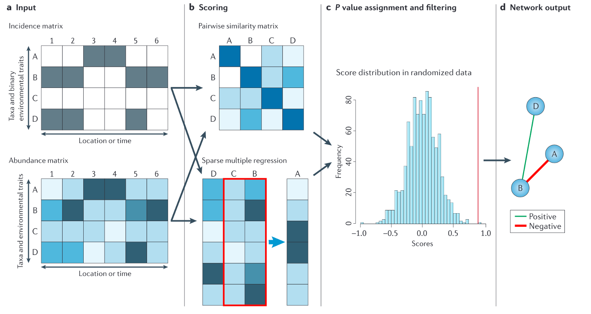
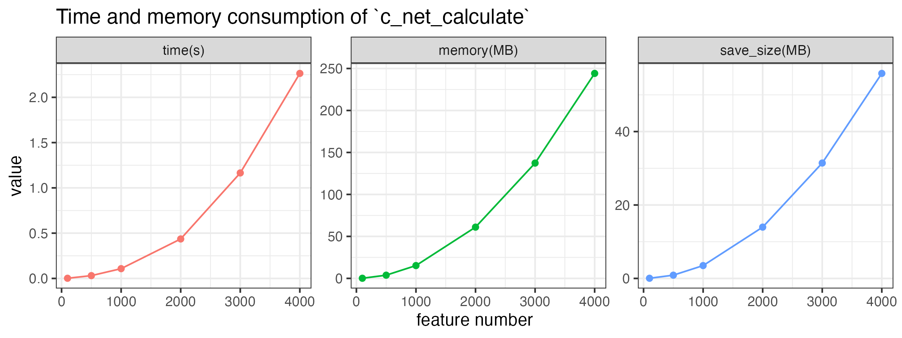
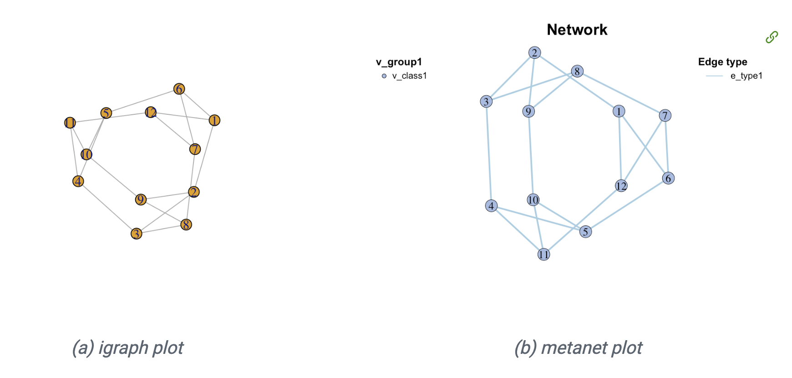

<script src="index.en_files/kePrint/kePrint.js"></script>
<link href="index.en_files/lightable/lightable.css" rel="stylesheet" />


上一篇推文简单介绍了网络基本概念和用于组学网络分析的R包MetaNet，这里我们具体介绍网络分析第一步，网络计算和构建。

- 软件主页：<https://github.com/Asa12138/MetaNet> **大家可以帮忙在github上点点star⭐️**，谢谢🙏
- 详细英文版教程：<https://bookdown.org/Asa12138/metanet_book/>

可以从 CRAN 安装稳定版：`install.packages("MetaNet")`  

最新的开发版本可以在 <https://github.com/Asa12138/MetaNet> 中找到：

```r
remotes::install_github("Asa12138/MetaNet", dependencies = T)
```

依赖包 `pcutils`和`igraph`（需提前安装），推荐配合 `dplyr` 进行数据操作。

```r
library(MetaNet)
library(igraph)

# ========data manipulation
library(dplyr)
library(pcutils)
```

## 预处理

在构建各类组学网络之前，不同组学数据（如微生物组、转录组、代谢组等）需要经过适当的预处理，以确保数据质量并提高网络分析的可靠性。

`trans`函数包含许多归一化方法，适用于预处理不同的组学：


| 方法 | 描述 |
|------|------|
| cpm | 百万分计数 |
| minmax | 线性转换到(min, max)区间 |
| acpm | 百万分计数后进行反双曲正弦转换 |
| log1 | log(n+1)转换 |
| total | 除以总和 |
| max | 除以最大值 |
| frequency | 除以总和并乘以非零项数量，使非零项平均值为1 |
| normalize | 使边际平方和等于1 |
| range | 标准化到(0,1)范围(同minmax(0,1)) |
| rank | 用递增秩替换丰度值，零保持不变 |
| rrank | 类似rank但使用相对秩，最大为1 |
| pa | 将x缩放到存在/不存在尺度(0/1) |
| standardize | 缩放到零均值和单位方差 |
| hellinger | "total"方法的平方根 |
| log | Anderson等(2006)建议的对数变换 |
| alr | 加性对数比('alr')变换(Aitchison 1986) |
| clr | 中心对数比('clr')变换(Aitchison 1986) |
| rclr | 稳健clr('rclr')，允许数据包含零 |


```r
trans(otutab, method = "log1") %>% head()
```

此外，`rm_low()`， `guolv()` ， `hebing()` 函数可以帮助过滤或聚合组学数据，这些函数在数据清洗和特征选择阶段非常有用。

## 成对关系计算



成对关系是网络构建的基础。由于实验数据通常相对稀少，我们主要依赖统计推断来确定成对关系，当然如果你已经有确定的关系了就可以跳过这一部分直接去构建网络即可。目前主要有两种统计方式：

**相似性或相关性**：例如Spearman、Pearson、Bray-Curtis等。可以计算配对特征之间的相似性矩阵，并使用随机化数据重复计算显著性。最终在网络中保留有意义的相似性。
**回归分析**：将特征分为源和目标，使用多元回归计算特征之间的关系。

还有一些工具使用特殊方法来优化网络构建，如SparCC等。

### Correlation

相关性是描述两个变量协调运动程度的统计术语。相关性计算是所有组学网络分析软件的第一步，有许多方法可以获取ρ和p值。然而，随着组学数据规模越来越大，一些方法变得非常耗时且计算资源密集。

MetaNet提供了`c_net_calculate()`函数，可以快速计算单个表或两个表之间的相关性，返回包含ρ和p值的coor对象。


```r
# 单表计算
t(otutab) -> totu
c_net_calculate(totu, method = "spearman") -> corr
corr
```

```
## Correlation table:
## Table dimensions: 485 rows, 485 columns
## Use method:  spearman
```


```r
# 双表计算
metadata[,3:10] -> env
c_net_calculate(totu, env, method = "spearman") -> corr2
corr2
```

```
## Correlation table:
## Table dimensions: 485 rows, 8 columns
## Use method:  spearman
```

对于大型输入表，计算可能需要较长时间，可以保存结果稍后读取：

```r
c_net_calculate(matrix(rnorm(1000*100), ncol=1000), method="spearman") -> corr
save_corr(corr, "../saved_corr1")
read_corr("../saved_corr1") -> corr_new
```

性能测试表明，计算1000个特征的表相关性约需0.2秒，保存的.corr文件大小约6MB。时间、内存消耗和保存文件大小大致随特征数量的平方线性增加。



`c_net_calculate`的计算速度比其他R包快得多，特别是在特征数量很大的情况下：


### Distance

在群落分析中，我们需要理解相异指数(距离)。`vegan::vegdist()`函数提供了基于丰度计算的广泛距离度量。此外，还有一些包含系统发育数据的距离度量，如"unifrac"、"beta_mpd"、"beta_mntd"和"phylosor"等。相似性指数通常是距离指数的倒数或1-distance。

我们也可以使用`c_net_calculate()`来计算距离：

```r
c_net_calculate(otutab, method="bray") -> sim_df
sim_df
```

```
## Similarity (1-Distance) table:
## Table dimensions: 18 rows, 18 columns
## Use method:  bray
```

常用的群落不相似性指数包括：

<table>
 <thead>
  <tr>
   <th style="text-align:left;"> 距离系数 </th>
   <th style="text-align:left;"> 描述 </th>
  </tr>
 </thead>
<tbody>
  <tr>
   <td style="text-align:left;"> Manhattan </td>
   <td style="text-align:left;"> 曼哈顿距离计算每个维度中坐标的绝对差之和。适用于具有分类变量或属性的数据。 </td>
  </tr>
  <tr>
   <td style="text-align:left;"> Euclidean </td>
   <td style="text-align:left;"> 欧几里得距离计算多维空间中两点之间的直线距离。通常用于连续且没有分类属性的数据。 </td>
  </tr>
  <tr>
   <td style="text-align:left;"> Canberra </td>
   <td style="text-align:left;"> 堪培拉距离是曼哈顿距离的加权版本，强调坐标之间微小差异的重要性。常用于生态数据分析。 </td>
  </tr>
  <tr>
   <td style="text-align:left;"> Clark </td>
   <td style="text-align:left;"> Clark距离测量两个样本之间不同非零属性的比例。 </td>
  </tr>
  <tr>
   <td style="text-align:left;"> Bray </td>
   <td style="text-align:left;"> Bray距离基于丰度绝对差异之和计算样本间不相似性。 </td>
  </tr>
  <tr>
   <td style="text-align:left;"> Kulczynski </td>
   <td style="text-align:left;"> Kulczynski距离基于共有属性比例的算术平均值测量样本间相似性。 </td>
  </tr>
  <tr>
   <td style="text-align:left;"> Jaccard </td>
   <td style="text-align:left;"> Jaccard距离基于独特属性的比例测量样本间不相似性。常用于生态学中的二元数据。 </td>
  </tr>
  <tr>
   <td style="text-align:left;"> Gower </td>
   <td style="text-align:left;"> Gower距离是曼哈顿距离的泛化，适用于包括分类和连续变量的混合数据类型。 </td>
  </tr>
  <tr>
   <td style="text-align:left;"> AltGower </td>
   <td style="text-align:left;"> AltGower距离是Gower距离的替代形式，使用替代方法标准化连续变量。 </td>
  </tr>
  <tr>
   <td style="text-align:left;"> Morisita </td>
   <td style="text-align:left;"> Morisita距离基于共享属性的频率测量样本间不相似性，强调稀有属性。 </td>
  </tr>
  <tr>
   <td style="text-align:left;"> Horn </td>
   <td style="text-align:left;"> Horn距离基于共享属性比例的几何平均值测量样本间不相似性。 </td>
  </tr>
  <tr>
   <td style="text-align:left;"> Mountford </td>
   <td style="text-align:left;"> Mountford距离基于共享属性比例的算术平均值的倒数测量样本间不相似性。 </td>
  </tr>
  <tr>
   <td style="text-align:left;"> Raup </td>
   <td style="text-align:left;"> Raup距离基于共享属性的概率测量样本间不相似性。 </td>
  </tr>
  <tr>
   <td style="text-align:left;"> Binomial </td>
   <td style="text-align:left;"> Binomial距离基于观察共享属性的概率测量样本间不相似性。 </td>
  </tr>
  <tr>
   <td style="text-align:left;"> Chao </td>
   <td style="text-align:left;"> Chao距离是Jaccard距离的修正，调整了对稀有物种的欠采样。 </td>
  </tr>
  <tr>
   <td style="text-align:left;"> Cao </td>
   <td style="text-align:left;"> Cao距离是Chao距离的修正，加入了物种丰度信息。 </td>
  </tr>
  <tr>
   <td style="text-align:left;"> Mahalanobis </td>
   <td style="text-align:left;"> Mahalanobis距离考虑变量间相关性，测量多维空间中两个样本的距离。 </td>
  </tr>
  <tr>
   <td style="text-align:left;"> Chisq </td>
   <td style="text-align:left;"> Chisq距离基于分类变量间的卡方距离计算样本间不相似性。 </td>
  </tr>
  <tr>
   <td style="text-align:left;"> Chord </td>
   <td style="text-align:left;"> Chord距离基于多维空间中点之间角度计算样本间不相似性。 </td>
  </tr>
  <tr>
   <td style="text-align:left;"> Hellinger </td>
   <td style="text-align:left;"> Hellinger距离基于平方根转换丰度的平方差之和的平方根测量样本间不相似性。 </td>
  </tr>
  <tr>
   <td style="text-align:left;"> Aitchison </td>
   <td style="text-align:left;"> Aitchison距离是对组成数据的转换，允许在对数比空间中进行欧几里得距离计算。 </td>
  </tr>
  <tr>
   <td style="text-align:left;"> Robust Aitchison </td>
   <td style="text-align:left;"> 稳健Aitchison距离是Aitchison距离的稳健版本，减少了数据中异常值的影响。 </td>
  </tr>
  <tr>
   <td style="text-align:left;"> Unifrac </td>
   <td style="text-align:left;"> Unifrac距离基于系统发育树中的进化距离测量微生物群落间不相似性。 </td>
  </tr>
  <tr>
   <td style="text-align:left;"> Beta MPD </td>
   <td style="text-align:left;"> Beta MPD(平均系统发育距离)基于物种对的平均系统发育距离测量两个群落间的系统发育多样性。 </td>
  </tr>
  <tr>
   <td style="text-align:left;"> Beta MNTD </td>
   <td style="text-align:left;"> Beta MNTD(平均最近分类单元距离)基于平均最近分类单元距离测量两个群落间的系统发育周转。 </td>
  </tr>
  <tr>
   <td style="text-align:left;"> Phylosor </td>
   <td style="text-align:left;"> Phylosor距离基于系统发育树中共享分支的比例测量群落间不相似性。 </td>
  </tr>
</tbody>
</table>


### Others

[**NetCoMi**](https://github.com/stefpeschel/NetCoMi)包中还有一些其他可用于网络构建的方法：

-   Biweight Midcorrelation [`bicor()`](https://rdrr.io/cran/WGCNA/man/bicor.html) from `WGCNA` package

-   CCLasso ([R code on GitHub](https://github.com/huayingfang/CCLasso))

-   CCREPE ([`ccrepe`](https://bioconductor.org/packages/release/bioc/html/ccrepe.html) package)

-   SPRING ([`SPRING`](https://github.com/GraceYoon/SPRING) package)

-   gCoda ([R code on GitHub](https://github.com/huayingfang/gCoda))

-   propr ([`propr`](https://cran.r-project.org/web/packages/propr/index.html) package)

-   Kullback-Leibler divergence (KLD) ([`KLD()`](https://rdrr.io/cran/LaplacesDemon/man/KLD.html) from `LaplacesDemon` package)

-   Jeffrey divergence (own code using [`KLD()`](https://rdrr.io/cran/LaplacesDemon/man/KLD.html) from `LaplacesDemon` package)

-   Jensen-Shannon divergence (own code using [`KLD()`](https://rdrr.io/cran/LaplacesDemon/man/KLD.html) from `LaplacesDemon` package)

## 网络构建

### 手动阈值构建

如果已经完成了`c_net_calculate()`步骤，那么可以通过`c_net_build()`轻松获得网络(metanet对象，继承自igraph对象)。一些常见属性会自动设置。


```r
c_net_build(corr, r_threshold =0.6, p_threshold =0.05, delete_single=T) -> co_net
co_net
```

```
## =================================== metanet ==================================== 
## IGRAPH 179b785 UNW- 483 1513 -- 
## + attr: n_type (g/c), name (v/c), v_group (v/c), v_class (v/c), size
## | (v/n), label (v/c), shape (v/c), color (v/c), id (e/n), from (e/c),
## | to (e/c), weight (e/n), cor (e/n), p.value (e/n), e_type (e/c), width
## | (e/n), color (e/c), e_class (e/c), lty (e/n)
## + edges from 179b785 (vertex names):
## [1] s__un_f__Thermomonosporaceae--s__Actinocorallia_herbida    
## [2] s__un_f__Thermomonosporaceae--s__Kribbella_catacumbae      
## [3] s__un_f__Thermomonosporaceae--s__Kineosporia_rhamnosa      
## [4] s__un_f__Thermomonosporaceae--s__un_f__Micromonosporaceae  
## [5] s__un_f__Thermomonosporaceae--s__Flavobacterium_saliperosum
## + ... omitted several edges
```

```r
plot(co_net)
```

}}index.en_files/figure-html/unnamed-chunk-8-1.png" width="768" />

对于多表分析，可以使用`multi_net_build()`计算和构建网络：

```r
data("multi_test", package="MetaNet")
multi_net_build(list(Microbiome=micro, Metabolome=metab, Transcriptome=transc)) -> multi1
plot(multi1)
```

}}index.en_files/figure-html/unnamed-chunk-9-1.png" width="768" />

### RMT优化

基于相关性的关联网络方法因其简单的计算过程和噪声容限而最常用。然而，大多数涉及关联网络分析的研究使用任意阈值(通常使用r>0.6, p<0.05)，因此构建的网络是主观的而非客观的。


这个问题已经通过基于随机矩阵理论(RMT)的方法部分解决，该方法能够从微阵列数据(以及其他组学数据)中自动识别网络构建的适当阈值。(Y. Deng, Y. Jiang, Y. Yang, Z. He, et al., Molecular ecological network analyses. BMC bioinformatics (2012), doi:10.1186/1471-2105-13-113.)

使用`RMT_threshold()`，我们可以找到一个合适的r_threshold来构建噪声最小的网络。较大的log_LE、较小的log_LW、较小的log_see、较大的p_ks_test表明r_threshold对于有意义的网络构建更好。可以更改阈值范围以进行更精细的计算。（但其实也很难确定一个非常合适的结果，几个指标指示的也不一致😂，有时候还是跟着文献自定义阈值方便）


```r
RMT_threshold(corr, out_dir="../RMT_temp/", min_threshold=0.5, 
             max_threshold=0.9, step=0.02, verbose=T) -> rmt_res
plot(rmt_res)
```


可以在`RMT_threshold()`中设置gif=TRUE并获取gif文件，以观察不同r阈值下特征值间距的分布。


### 边表格

如果已经从其他方法(数据库)获得了数据的成对关系，可以将其形成边列表并使用`c_net_from_edgelist`构建网络：


```r
data("edgelist", package="MetaNet")
dnet <- c_net_from_edgelist(arc_count, direct=T)
plot(dnet)
```

}}index.en_files/figure-html/unnamed-chunk-11-1.png" width="768" />

### 其他

如果已经有其他格式的网络，如pajek、lgl、graphml、dimacs、graphdb、gml和dl，可以使用`c_net_load`将其读取为metanet对象。也可以使用`graph_from_*`函数获取igraph对象，然后使用`c_net_update`将其转换为metanet对象。


```r
g1 <- graph_from_lcf(12, c(5, -5), 6)
class(g1)
## [1] "igraph"
plot(g1)

c_net_update(g1) -> g2
class(g2)
## [1] "metanet" "igraph"
plot(g2)
```




通过本文介绍的方法，可以了解从组学数据预处理到网络构建的流程，为后续的网络分析和生物学解释奠定基础。MetaNet包提供的这些功能使得组学网络分析变得更加高效。下一篇就将介绍如何给我们构建好的网络进行各种操作，包括添加注释和属性，筛选合并等。

## References
1. Koutrouli M, Karatzas E, Paez-Espino D and Pavlopoulos GA (2020) A Guide to Conquer the Biological Network Era Using Graph Theory. Front. Bioeng. Biotechnol. 8:34. doi: 10.3389/fbioe.2020.00034
2. Faust, K., and Raes, J. (2012). Microbial interactions: from networks to models. Nat. Rev. Microbiol. https://doi.org/10.1038/nrmicro2832.
3. Y. Deng, Y. Jiang, Y. Yang, Z. He, et al., Molecular ecological network analyses. BMC bioinformatics (2012), doi:10.1186/1471-2105-13-113.
