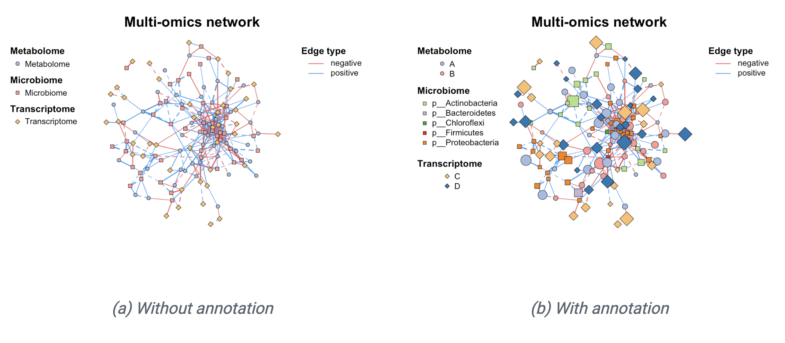
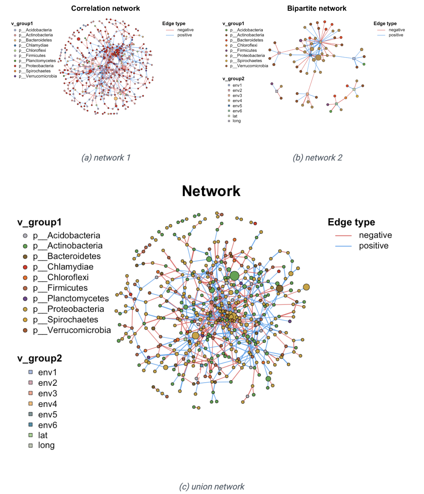
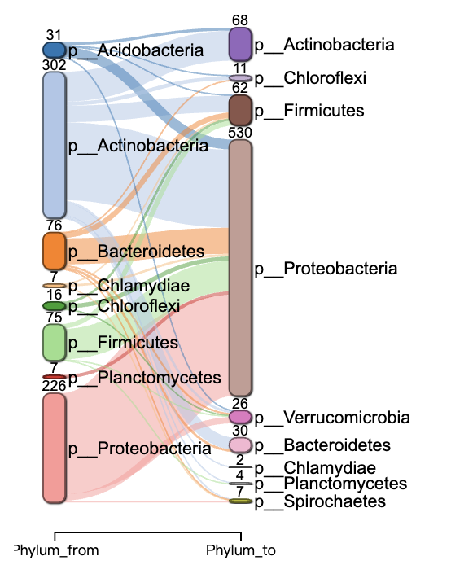

上一篇推文已经介绍了使用R包MetaNet进行网络计算和构建，本文将介绍如何对我们构建好的网络进行各种操作，包括添加注释和属性，筛选合并等。

- 软件主页：<https://github.com/Asa12138/MetaNet> **大家可以帮忙在github上点点star⭐️**，谢谢🙏
- 详细英文版教程：<https://bookdown.org/Asa12138/metanet_book/>

可以从 CRAN 安装稳定版：`install.packages("MetaNet")`  

最新的开发版本可以在 <https://github.com/Asa12138/MetaNet> 中找到：

```r
remotes::install_github("Asa12138/MetaNet", dependencies = T)
```

依赖包 `pcutils`和`igraph`（需提前安装），推荐配合 `dplyr` 进行数据操作。

```r
library(MetaNet)
library(igraph)

# ========data manipulation
library(dplyr)
library(pcutils)
```

MetaNet网络对象(`metanet`)继承自`igraph`类，因此可以使用所有igraph的函数，可以参考[igraph manual](https://r.igraph.org/) 。构建网络的基本流程如下：


```r
# 加载数据
data(otutab, package="pcutils")
t(otutab) -> totu

# 计算相关性
c_net_calculate(totu, method="spearman") -> corr

# 构建网络(设置相关系数阈值0.6，p值阈值0.05)
c_net_build(corr, r_threshold =0.6, p_threshold = 0.05, delete_single=T) -> co_net

# 查看网络类
class(co_net)  
```

```
## [1] "metanet" "igraph"
```

## 网络属性

MetaNet提供了便捷的函数获取网络、节点和边的属性，使用`get_*()`获取属性表格：


```r
# 获取网络整体属性
get_n(co_net)
```

```
##   n_type
## 1 single
```

```r
# 获取节点属性(前5行)
get_v(co_net) %>% head(5)
```

```
##                           name  v_group  v_class size
## 1 s__un_f__Thermomonosporaceae v_group1 v_class1    4
## 2        s__Pelomonas_puraquae v_group1 v_class1    4
## 3     s__Rhizobacter_bergeniae v_group1 v_class1    4
## 4     s__Flavobacterium_terrae v_group1 v_class1    4
## 5         s__un_g__Rhizobacter v_group1 v_class1    4
##                          label  shape   color
## 1 s__un_f__Thermomonosporaceae circle #a6bce3
## 2        s__Pelomonas_puraquae circle #a6bce3
## 3     s__Rhizobacter_bergeniae circle #a6bce3
## 4     s__Flavobacterium_terrae circle #a6bce3
## 5         s__un_g__Rhizobacter circle #a6bce3
```

```r
# 获取边属性(前5行)
get_e(co_net) %>% head(5)
```

```
##   id                         from                            to    weight
## 1  1 s__un_f__Thermomonosporaceae     s__Actinocorallia_herbida 0.6759546
## 2  2 s__un_f__Thermomonosporaceae       s__Kribbella_catacumbae 0.6742386
## 3  3 s__un_f__Thermomonosporaceae       s__Kineosporia_rhamnosa 0.7378741
## 4  4 s__un_f__Thermomonosporaceae   s__un_f__Micromonosporaceae 0.6236449
## 5  5 s__un_f__Thermomonosporaceae s__Flavobacterium_saliperosum 0.6045747
##         cor      p.value   e_type     width   color  e_class lty
## 1 0.6759546 0.0020739524 positive 0.6759546 #48A4F0 e_class1   1
## 2 0.6742386 0.0021502138 positive 0.6742386 #48A4F0 e_class1   1
## 3 0.7378741 0.0004730567 positive 0.7378741 #48A4F0 e_class1   1
## 4 0.6236449 0.0056818984 positive 0.6236449 #48A4F0 e_class1   1
## 5 0.6045747 0.0078660171 positive 0.6045747 #48A4F0 e_class1   1
```

MetaNet网络在构建时会自动设置一些内部属性，这些属性与后续分析和可视化密切相关：

| 属性名称 | 描述 | 可视化关联 |
|---------|------|------------|
| v_group | 节点的大分组(通常一个组学数据产生一个分组) | 节点形状 |
| v_class | 节点的分类或网络模块注释 | 节点颜色 |
| size | 节点的数值属性 | 节点大小 |
| e_type | 边的类型(通常根据相关性分为positive/negative) | 边颜色 |
| width | 边的数值属性 | 边宽度 |
| e_class | 边的第二类型(通常根据节点分组分为intra/inter) | 边线型 |

### 网络注释添加

在微生物组学或多组学分析中，我们经常需要将大量注释表格添加到网络对象中，例如物种丰度表、分类学表格等。

`c_net_annotate` 可以方便添加注释表格，anno_tab是一个dataframe，如果注释节点，需要有一列name对应node name。如果注释边，需要有一列from和to对应边的起点和终点。

#### 添加点注释

注释数据框需要包含行名或"name"列，这些标识需要与metanet网络中的顶点名称匹配。使用`c_net_annotate(mode = "v")`或等效的`anno_vertex()`函数时，系统会自动匹配顶点名称并合并表格。


```r
# 添加分类注释(Phylum级别)
c_net_annotate(co_net, anno_tab = taxonomy["Phylum"], mode="v") -> co_net1
get_v(co_net1) %>% head(5)
```

```
##                           name  v_group  v_class size
## 1 s__un_f__Thermomonosporaceae v_group1 v_class1    4
## 2        s__Pelomonas_puraquae v_group1 v_class1    4
## 3     s__Rhizobacter_bergeniae v_group1 v_class1    4
## 4     s__Flavobacterium_terrae v_group1 v_class1    4
## 5         s__un_g__Rhizobacter v_group1 v_class1    4
##                          label  shape   color            Phylum
## 1 s__un_f__Thermomonosporaceae circle #a6bce3 p__Actinobacteria
## 2        s__Pelomonas_puraquae circle #a6bce3 p__Proteobacteria
## 3     s__Rhizobacter_bergeniae circle #a6bce3 p__Proteobacteria
## 4     s__Flavobacterium_terrae circle #a6bce3  p__Bacteroidetes
## 5         s__un_g__Rhizobacter circle #a6bce3 p__Proteobacteria
```

#### 添加边注释

`c_net_annotate(mode = "e")`或`anno_edge()`函数接受相同格式的注释数据框，但会自动匹配"from"和"to"列，方便用户进行网络连接的统计分析。


```r
# 创建边注释数据
anno <- data.frame("from"="s__un_f__Thermomonosporaceae", 
                   "to"="s__Actinocorallia_herbida", 
                   new_atr="new")

# 添加边注释
c_net_annotate(co_net, anno, mode="e") -> co_net1
get_e(co_net1) %>% head(5)
```

```
##   id                         from                            to    weight
## 1  1 s__un_f__Thermomonosporaceae     s__Actinocorallia_herbida 0.6759546
## 2  2 s__un_f__Thermomonosporaceae       s__Kribbella_catacumbae 0.6742386
## 3  3 s__un_f__Thermomonosporaceae       s__Kineosporia_rhamnosa 0.7378741
## 4  4 s__un_f__Thermomonosporaceae   s__un_f__Micromonosporaceae 0.6236449
## 5  5 s__un_f__Thermomonosporaceae s__Flavobacterium_saliperosum 0.6045747
##         cor      p.value   e_type     width   color  e_class lty new_atr
## 1 0.6759546 0.0020739524 positive 0.6759546 #48A4F0 e_class1   1     new
## 2 0.6742386 0.0021502138 positive 0.6742386 #48A4F0 e_class1   1    <NA>
## 3 0.7378741 0.0004730567 positive 0.7378741 #48A4F0 e_class1   1    <NA>
## 4 0.6236449 0.0056818984 positive 0.6236449 #48A4F0 e_class1   1    <NA>
## 5 0.6045747 0.0078660171 positive 0.6045747 #48A4F0 e_class1   1    <NA>
```

#### 使用igraph方法添加属性

> 如果您有一个向量，并且确定与网络的顶点名称匹配，则可以使用igraph方法来注释（不建议），边注释向量相同。有关更多详细信息，请参阅igraph手册。


```r
# 添加节点属性
V(co_net1)$new_attri <- seq_len(length(co_net1))

# 添加边属性
E(co_net1)$new_attri <- "new attribute"
```

### 网络属性设置

`c_net_set()`函数可以方便地添加多个注释表格并设置网络可视化相关的内部属性。

为网络添加多个注释表格后，可以通过指定列名来设置以下属性：
- `vertex_group`：顶点分组（可指定一个或多个列）
- `vertex_class`：顶点类别  
- `vertex_size`：顶点大小
- `edge_type`：边类型
- `edge_class`：边类别
- `edge_width`：边宽度

系统会自动完成以下设置：
- 颜色方案
- 线条类型  
- 节点形状
- 图例生成

只需使用`plot()`函数即可生成基础网络图。如需进一步自定义可视化效果，下一次会详细介绍网络布局和可视化。


```r
# 加载多组学数据
data("multi_test", package="MetaNet")
data("c_net", package="MetaNet")

# 构建多组学网络
multi1 <- multi_net_build(list(Microbiome=micro, Metabolome=metab, Transcriptome=transc))
plot(multi1)

# 设置节点分类属性
multi1_with_anno <- c_net_set(multi1, micro_g, metab_g, transc_g, 
                             vertex_class=c("Phylum","kingdom","type"))

# 设置节点大小属性
multi1_with_anno <- c_net_set(multi1_with_anno, 
                             data.frame("Abundance1"=colSums(micro)),
                             data.frame("Abundance2"=colSums(metab)),
                             data.frame("Abundance3"=colSums(transc)),
                             vertex_size=paste0("Abundance",1:3))

# 绘制网络
plot(multi1_with_anno)
```




## 网络操作

### 网络过滤/子网络

正确设置网络后，你可能有时候需要分析整个网络的一部分（尤其是在多组学分析中），`c_net_filter()`可以方便地获取子网络，您可以放置大量的过滤条件（例如`dplyr::filter`）并获得所需的子网络。


```r
# 过滤特定组和边类型
multi2 <- c_net_filter(multi1_with_anno, v_group %in% c("Microbiome","Metabolome")) %>% 
          c_net_filter(., e_class=="intra", mode="e")

# 绘制对比图
par(mfrow=c(2,1))
plot(multi1_with_anno, lty_legend=T, main="Before filtering network")
plot(multi2, lty_legend=T, main="After filtering network")
```

}}index.en_files/figure-html/unnamed-chunk-9-1.png" width="768" />

### 网络合并

如果你有多个网络并想将它们组合在一起，你可以使用`c_net_union()`函数：


```r
data("c_net")
plot(co_net)
plot(co_net2)

co_net_union <- c_net_union(co_net, co_net2)
plot(co_net_union)
```



### 网络骨架提取

若需根据分组统计边的来源和目标，`summ_2col`函数提供了简便的实现方式。

参数direct = F表示处理无向关系，此时"a-b"和"b-a"会被合并统计为同一种边类型。


```r
# 添加Phylum分类注释
c_net_annotate(co_net, select(taxonomy,"Phylum"), mode="e") -> co_net1

# 统计Phylum间的连接
df <- get_e(co_net1)[,c("Phylum_from","Phylum_to")]
summ_2col(df, direct=F) %>% arrange(-count) -> Phylum_from_to
```


```r
# 桑基图展示
pcutils::my_sankey(Phylum_from_to, dragY=T, fontSize=10, width=600, numberFormat=",.4")
```




```r
# 环形布局展示
links_stat(co_net1, topN=5, group="Phylum", e_type="all")
```

}}index.en_files/figure-html/unnamed-chunk-13-1.png" width="768" />


```r
# 设置Phylum分类
c_net_set(co_net, select(taxonomy,"Phylum")) -> co_net1

# 提取网络骨架
get_group_skeleton(co_net1, Group="Phylum") -> ske_net

# 绘制骨架图
plot(ske_net, vertex.label=NA)
```

}}index.en_files/figure-html/unnamed-chunk-14-1.png" width="768" />}}index.en_files/figure-html/unnamed-chunk-14-2.png" width="768" />

## 网络保存导出

MetaNet支持多种格式的网络导出：


```r
# 导出为数据框格式
c_net_save(co_net, filename="My_net", format="data.frame")

# 导出为graphml格式(兼容Gephi等软件)
c_net_save(co_net, filename="My_net", format="graphml")

# 从文件加载网络
c_net_load("My_net.graphml")->mynet
```


## References
1. Koutrouli M, Karatzas E, Paez-Espino D and Pavlopoulos GA (2020) A Guide to Conquer the Biological Network Era Using Graph Theory. Front. Bioeng. Biotechnol. 8:34. doi: 10.3389/fbioe.2020.00034
2. Faust, K., and Raes, J. (2012). Microbial interactions: from networks to models. Nat. Rev. Microbiol. https://doi.org/10.1038/nrmicro2832.
3. Y. Deng, Y. Jiang, Y. Yang, Z. He, et al., Molecular ecological network analyses. BMC bioinformatics (2012), doi:10.1186/1471-2105-13-113.
