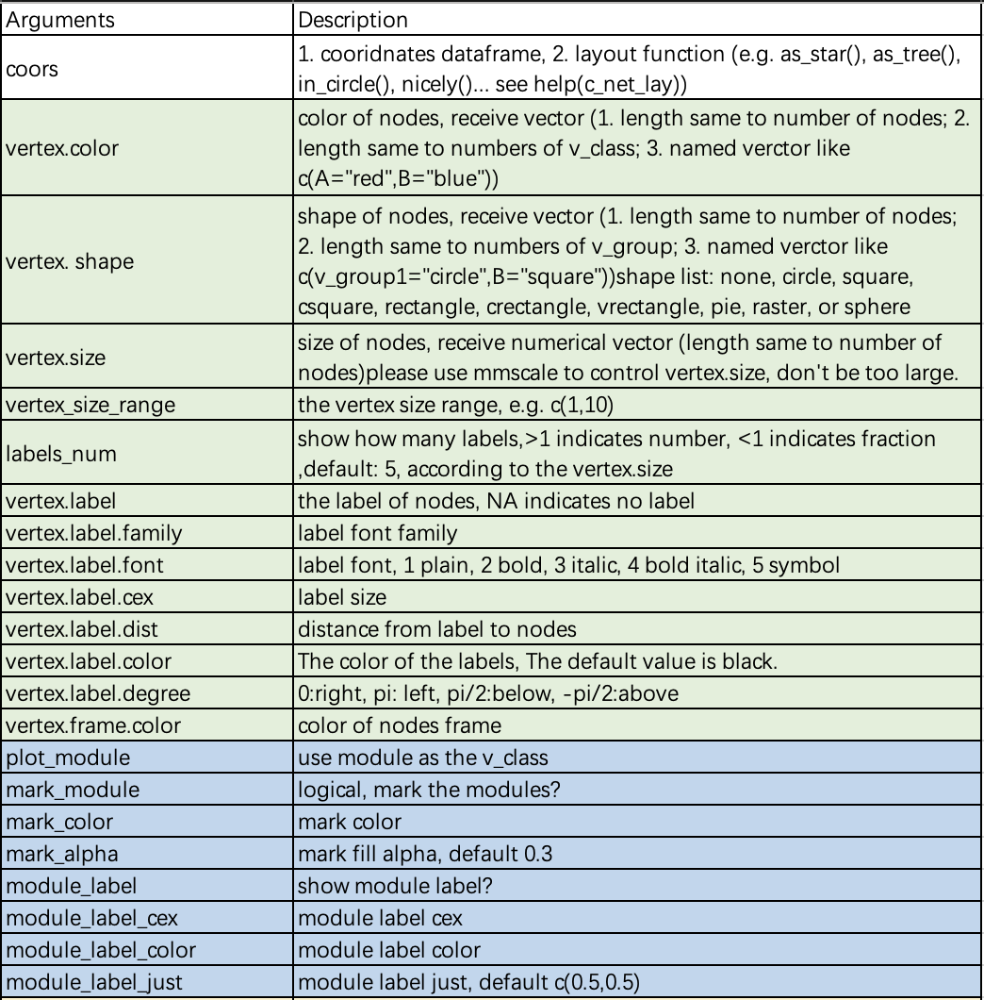

```{r include=FALSE}
devtools::load_all("~/Documents/R/pcutils/")
devtools::load_all("~/Documents/R/MetaNet/MetaNet/")
data(otutab, package = "pcutils")
Packages <- c("dplyr", "pcutils", "kableExtra")
pcutils::lib_ps(Packages)
knitr::opts_chunk$set(message = FALSE,warning = FALSE,cache = T,fig.width=8,fig.height=5)
```

之前已经介绍了网络计算，构建以及各种注释了。本文将详细介绍MetaNet中的各种可视化方法，从基础绘图到高级布局技巧。


- 软件主页：<https://github.com/Asa12138/MetaNet> **大家可以帮忙在github上点点star⭐️**，谢谢🙏
- 详细英文版教程：<https://bookdown.org/Asa12138/metanet_book/>

可以从 CRAN 安装稳定版：`install.packages("MetaNet")`  

最新的开发版本可以在 <https://github.com/Asa12138/MetaNet> 中找到：

```r
remotes::install_github("Asa12138/MetaNet", dependencies = T)
```

依赖包 `pcutils`和`igraph`（需提前安装），推荐配合 `dplyr` 进行数据操作。

```r
library(MetaNet)
library(igraph)

# ========data manipulation
library(dplyr)
library(pcutils)
```

## 绘图设置

在构建网络时，MetaNet已经设置了一些与可视化相关的内部属性。我们可以使用`c_net_set()`函数自定义这些属性以满足研究需求。

```{r echo=FALSE}
data("multi_test", package = "MetaNet")
data("c_net", package = "MetaNet")

# 构建多组学网络
multi1 <- multi_net_build(list(Microbiome = micro, Metabolome = metab, Transcriptome = transc))

# 默认使用v_group分组，绘制三个不同的表格
plot(multi1)

# 设置vertex_class
multi1_with_anno <- c_net_set(multi1, micro_g, metab_g, transc_g, 
                             vertex_class = c("Phylum", "kingdom", "type"))

# 设置vertex_size
multi1_with_anno <- c_net_set(multi1_with_anno, 
                             data.frame("Abundance1" = colSums(micro)),
                             data.frame("Abundance2" = colSums(metab)),
                             data.frame("Abundance3" = colSums(transc)),
                             vertex_size = paste0("Abundance", 1:3))
plot(multi1_with_anno)
```


如果需要更灵活地自定义网络图，可以使用`c_net_plot()`函数，它包含许多灵活的绘图参数：




示例代码，尝试各种设置看看：

```{r}
c_net_plot(multi1_with_anno, 
          labels_num = 5,
          vertex.color = get_cols(11, "col1"),
          vertex_size_range = c(3, 10),
          vertex.label.color = "red",
          edge_width_range = c(0.5, 3),
          edge.color = c("orange", "green4"),
          edge.curved = 0.5,
          legend = T,
          legend_number = T,
          group_legend_order = c("Microbiome", "Metabolome", "Transcriptome"),
          group_legend_title = c("Phylum", "Metabolome", "Transcriptome"),
          edge_legend_title = "Correlation",
          edge_legend_order = c("positive", "negative"),
          size_legend = T,
          size_legend_title = "Abundance",
          width_legend = T,
          width_legend_title = "abs(r)",
          lty_legend = T,
          lty_legend_title = "Omics relationship")
```

### 使用params_list

`params_list`是`c_net_plot()`中的一个特殊参数，它是一个包含参数的列表，可以方便地用于绘制一系列具有相同属性的网络图：

```{r}
node_colors <- setNames(get_cols(9, "col1"), unique(V(multi1_with_anno)$v_class))
params_list <- list(
  labels_num = 5,
  vertex.color = node_colors,
  vertex_size_range = c(3, 10),
  vertex.label.color = "red",
  edge_width_range = c(0.5, 3),
  edge.color = c("orange", "green4"),
  edge.curved = 0.5,
  legend = T,
  legend_number = T,
  group_legend_order = c("Microbiome", "Metabolome", "Transcriptome"),
  group_legend_title = c("Phylum", "Metabolome", "Transcriptome"),
  edge_legend_title = "Correlation",
  edge_legend_order = c("positive", "negative"),
  size_legend = T,
  size_legend_title = "Abundance",
  width_legend = T,
  width_legend_title = "abs(r)",
  lty_legend = T,
  lty_legend_title = "Omics relationship"
)

c_net_plot(multi1_with_anno, params_list = params_list)

# 构建另一个多组学网络
multi1_with_anno2 <- c_net_filter(multi1_with_anno, 
                                 v_group %in% c("Microbiome", "Metabolome")) %>% 
  c_net_filter(., e_class == "intra", mode = "e")
c_net_plot(multi1_with_anno2, params_list = params_list)
```

## 网络布局

布局是网络可视化的重要组成部分，一个好的布局可以清晰地呈现信息。

在MetaNet中，我们使用`coors`对象来存储布局的坐标。`coors`是一个具有"name", "X", "Y"三列的dataframe。

### 基础布局

使用`c_net_layout()`获取特定布局方法的坐标：

```{r}
c_net_layout(co_net2, method = in_circle()) -> coors
c_net_plot(co_net2, coors)
```

可用的基础布局方法包括：

1. igraph布局：`in_circle()`, `nicely()`, `on_grid()`, `on_sphere()`, `randomly()`, `with_dh()`, `with_fr()`, `with_gem()`, `with_graphopt()`, `with_kk()`, `with_lgl()`, `with_mds()`
2. metanet新布局方法：`as_line()`, `as_arc()`, `as_polygon()`, `as_polyarc()`, `as_polycircle()`, `as_circle_tree()`, `as_multi_layer()`, `as_poly_sector()`
3. ggraph布局："auto", "backbone", "centrality", "circlepack", "dendrogram", "eigen", "focus", "hive", "igraph", "linear", "manual", "matrix", "partition", "pmds", "stress", "treemap", "unrooted"

示例代码展示不同布局效果：

```{r eval=FALSE}
go <- erdos.renyi.game(30, 0.25)
# get a metanet
go <- c_net_update(go)

layout_methods <- list(
  as_star(), as_tree(), in_circle(), nicely(),
  on_grid(), on_sphere(), randomly(), with_dh(),
  with_fr(), with_gem(), with_graphopt(), with_kk(),
  with_lgl(), with_mds(), as_line(), as_arc(),
  as_polygon(), as_polyarc(), as_polycircle(3), as_circle_tree(),
  as_multi_layer(2), as_poly_sector()
)
names(layout_methods) <- c(
  "as_star ", "as_tree ", "in_circle ", "nicely ",
  "on_grid ", "on_sphere ", "randomly ", "with_dh ",
  "with_fr ", "with_gem ", "with_graphopt ", "with_kk ",
  "with_lgl ", "with_mds", "as_line", "as_arc",
  "as_polygon", "as_polyarc", "as_polycircle", "as_circle_tree",
  "as_multi_layer", "as_poly_sector"
)

par(mfrow = c(6, 4))
for (i in names(layout_methods)) {
  plot(go, layout_methods[[i]], legend = F, main = i, labels_num = 0)
}
```


对于每种方法，可以在其中额外添加一些参数：

```{r eval=FALSE}
# get a metanet
go <- erdos.renyi.game(30, 0.25)
go <- c_net_update(go)

plot(go, coors = with_fr())
plot(go, coors = with_fr(niter = 99, grid = "nogrid"))
```


`as_polygon()`很有趣，它可以绘制多边形形状的网络，您可以更改多边形的边数:


### 变换布局

使用`transform_comors`可以转换布局，包括缩放，X/Y比，旋转角度，镜像，伪3D效果等：

```{r eval=FALSE}
c_net_layout(multi1_with_anno)->coors
c_net_plot(multi1_with_anno,
           transform_coors(coors,
                           scale = 0.8,
                           aspect_ratio = 0.5,
                           rotation = i,
                           mirror_x = T,
                           shear_x = 1)
           )
```


### 分组布局

除`c_net_layout()`外，我们还为具有分组变量的网络提供了一种高级布局方法：`g_layout()`。
使用`g_layout()`可以轻松控制每个组的位置及其内部布局。`g_layout()`返回的也是`coors`对象，这意味着我们可以继续用`g_layout()`组合，实现疯狂套娃，高度自定义的布局！

`g_layout()`在处理多组学网络或模块网络）时，是布局分组变量网络的极佳选择。

* 首先，指定分组变量group
* 设置组间布局`layout1`，可选：
  1. 数据框或矩阵：行名为组名，两列分别为X和Y坐标
  2. 函数：`c_net_layout()`的各种布局方法（默认：in_circle()）
* 调整`layout1`的缩放比例`zoom1`
* 设置组内布局`layout2`（使用`c_net_layout()`的各种布局方法），
  用一个list，为每个组单独指定布局函数或者直接给一个坐标数据框。
* 调整`layout2`的缩放比例`zoom2`，可用向量分别控制各组缩放
* 设置`show_big_layout = T`可查看`layout1`的分布情况

```{r}
# 为每个组设置圆形布局
g_layout(multi1_with_anno, group = "v_group",
        layout1 = in_circle(), zoom1 = 10,
        layout2 = in_circle(), zoom2 = 5) -> g_coors
plot(multi1_with_anno, coors = g_coors)

# 为每个组设置不同的布局
g_layout(multi1_with_anno, group = "v_group",
        layout1 = in_circle(), zoom1 = 10,
        layout2 = list(in_circle(), with_fr(), as_polygon()),
        zoom2 = 3:5) -> g_coors
plot(multi1_with_anno, coors = g_coors)
```

#### tkplot手动调整大布局

```{r eval=FALSE}
# 首先获取网络骨架
get_group_skeleton(co_net, "v_class") %>% clean_igraph() -> s_net

# 使用tkplot进行手动调整
x <- igraph::tkplot(s_net)
# 在tkplot窗口中移动节点到你喜欢的布局！
da <- igraph::tkplot.getcoords(x)
igraph::tkplot.close(x)

# 将调整后的坐标传递给layout1
g_layout(co_net, group = "v_class",
        layout1 = da, zoom1 = 20,
        layout2 = in_circle(), zoom2 = c(1, 4, 2, 1, 3, 5)) -> g_coors
plot(co_net, coors = g_coors)
```


MetaNet还提供了一些预设的分组布局方法：

1. `g_layout_circlepack()`
2. `g_layout_treemap()`
3. `g_layout_backbone()`
4. `g_layout_stress()`
5. `g_layout_polyarc()`
6. `g_layout_polygon()`
7. `g_layout_polycircle()`
8. `g_layout_multi_layer()` 伪3D效果
9. `g_layout_poly_sector()`

示例代码：

```{r eval=FALSE}
E(co_net)$color <- rep("grey", length(E(co_net)))
plot(co_net, coors = g_layout_circlepack(co_net, group = "v_class"),
    legend = F, labels_num = 0, main = "g_layout_circlepack")
plot(co_net, coors = g_layout_polyarc(co_net, group = "v_class"),
    legend = F, labels_num = 0, main = "g_layout_polyarc")
plot(co_net, coors = g_layout_polycircle(co_net, group = "v_class"),
    legend = F, labels_num = 0, main = "g_layout_polycircle")

g1 <- module_net(3)

plot(g1,
  coors = g_layout_multi_layer(g1, group = "v_class", layout = on_grid()),
  legend = F, labels_num = 0, main = "g_layout_multi_layer"
)
```


## `spatstat` layout

```{r fig.width=12,fig.height=10}
if(!require("spatstat"))install.packages("spatstat")
E(co_net)$color <- rep("grey", length(E(co_net)))

par(mfrow = c(2, 2))
poly_x <- c(0, 2, 2, 0)
poly_y <- c(0, 0, 1, 1)
win_poly <- spatstat.geom::owin(poly = list(x = poly_x, y = poly_y))
plot(win_poly)
coors1 <- spatstat_layout(co_net, win_poly, type = "random", mode = "surface")
plot(co_net, coors = coors1)
coors1 <- spatstat_layout(co_net, win_poly, type = "regular", mode = "surface",order_by="v_class")
plot(co_net, coors = coors1)
coors2 <- spatstat_layout(co_net2, win_poly, type = "random", mode = "boundary")
plot(co_net2, coors = coors2)
```


尝试画个五角星⭐️：

```{r}
library(spatstat.geom)

create_star_window <- function(r_outer = 1, r_inner = 0.4, center = c(0, 0)) {
  # 创建五角星的10个顶点（外、内交替）
  theta <- seq(0, 2 * pi, length.out = 11)[-11]  # 10个点
  theta_outer <- theta[seq(1, 10, 2)]
  theta_inner <- theta[seq(2, 10, 2)]

  x <- c(r_outer * cos(theta_outer),
         r_inner * cos(theta_inner))
  y <- c(r_outer * sin(theta_outer),
         r_inner * sin(theta_inner))

  # 重新排序成首尾相连的路径
  order_index <- c(1,6,2,7,3,8,4,9,5,10)
  x <- x[order_index] + center[1]
  y <- y[order_index] + center[2]

  # 构建 spatstat 的 owin 窗口
  win <- owin(poly = list(x = x, y = y))
  return(win)
}

win_star <- create_star_window()

plot(co_net, coors = spatstat_layout(co_net, win_star, order_by="v_class"))
```

甚至可以画成地图：

```{r}
library(rnaturalearth)
library(sf)

# 获取非洲国家边界（1:50m精度）
africa_sf <- ne_countries(continent = "Africa", scale = 50, returnclass = "sf")

# 可视化
plot(st_geometry(africa_sf), col = "sandybrown", main = "Africa Outline (1:50m)", )

plot(co_net, coors = spatstat_layout(co_net, africa_sf, type = "regular", order_by="v_class"))
```

MetaNet使用的是igraph的绘图方式，R的基础绘图，所以需要用`pdf`,`png`等设备保存图片。下一节介绍MetaNet和其他绘图方式如ggplot2，D3等的转换，以及MetaNet配合Gephi，Cytoscape等交互式软件使用。

## References
1. Koutrouli M, Karatzas E, Paez-Espino D and Pavlopoulos GA (2020) A Guide to Conquer the Biological Network Era Using Graph Theory. Front. Bioeng. Biotechnol. 8:34. doi: 10.3389/fbioe.2020.00034
2. Faust, K., and Raes, J. (2012). Microbial interactions: from networks to models. Nat. Rev. Microbiol. https://doi.org/10.1038/nrmicro2832.
3. Y. Deng, Y. Jiang, Y. Yang, Z. He, et al., Molecular ecological network analyses. BMC bioinformatics (2012), doi:10.1186/1471-2105-13-113.