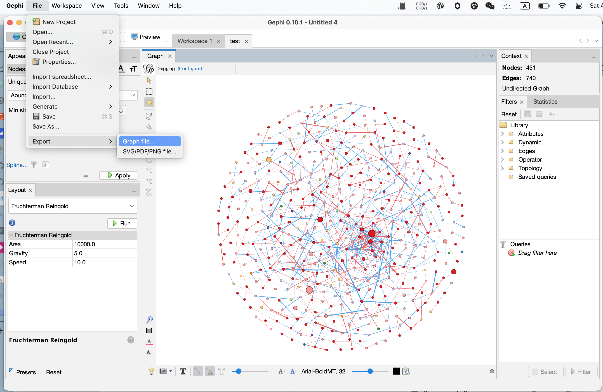
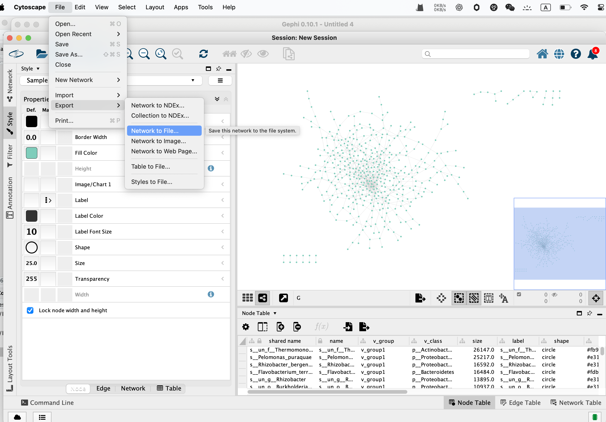
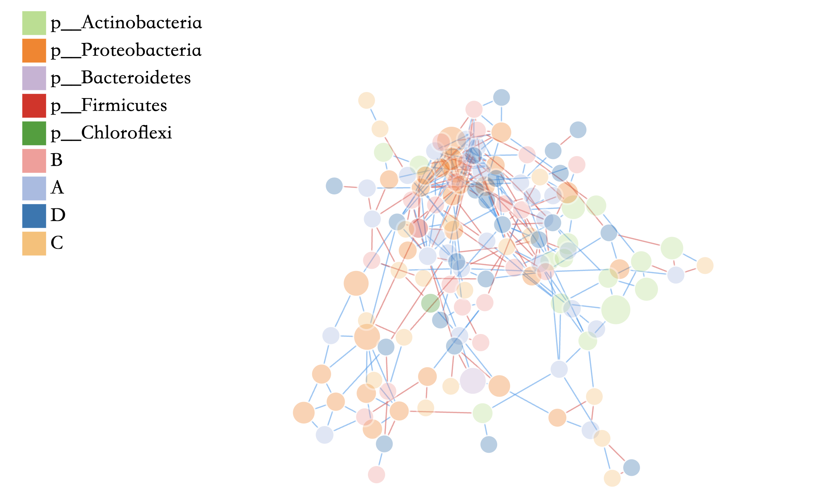

上一篇推文介绍了MetaNet进行网络可视化以及各种布局方法，本文将介绍一些扩展绘图方法以及兼容工具。


- 软件主页：<https://github.com/Asa12138/MetaNet> **大家可以帮忙在github上点点star⭐️**，谢谢🙏
- 详细英文版教程：<https://bookdown.org/Asa12138/metanet_book/>

可以从 CRAN 安装稳定版：`install.packages("MetaNet")`  

依赖包 `pcutils`和`igraph`（需提前安装），推荐配合 `dplyr` 进行数据操作。

```r
library(MetaNet)
library(igraph)

# ========data manipulation
library(dplyr)
library(pcutils)
```

## 兼容工具


### ggplot2风格

如果你更熟悉ggplot2，可以使用`as.ggig()`函数将基础R绘图转换为ggplot2风格：


```r
as.ggig(multi1_with_anno) -> ggig
class(ggig)
```

```
## [1] "ggig" "list"
```

```r
plot(ggig)
```

}}index.en_files/figure-html/unnamed-chunk-3-1.png" width="768" />

这样你就可以使用`labs()`、`theme()`、`ggsave()`和`cowplot::plot_grid()`等函数来制作更好的图形。

### Gephi集成

处理大型数据集时，我推荐使用Gephi进行布局，运行比较快且美观。MetaNet提供了通过graphml格式文件与Gephi的接口：


```r
c_net_save(co_net, filename = "~/Desktop/test", format = "graphml")
```
将test.graphml导入Gephi并进行布局，从Gephi导出graphml文件：test2.graphml，然后在MetaNet中重新绘制：




```r
input_gephi("~/Desktop/test2.graphml") -> gephi
c_net_plot(gephi$go, coors = gephi$coors, 
          legend_number = T, 
          group_legend_title = "Phylum")
```

}}index.en_files/figure-html/unnamed-chunk-5-1.png" width="768" />

### Cytoscape集成

Cytoscape是另一个优秀的网络可视化软件，包含许多插件。将test.graphml导入Cytoscape进行布局，然后导出为cyjs文件，MetaNet可以读取：




```r
input_cytoscape("~/Desktop/test2.cyjs") -> cyto
c_net_plot(co_net, coors = cyto$coors, 
          legend_number = T, 
          group_legend_title = "Phylum")
```

}}index.en_files/figure-html/unnamed-chunk-6-1.png" width="768" />


### NetworkD3交互式可视化

NetworkD3可以生成基于JavaScript的交互式网络图，输出对象是适合网页的htmlwidgets：


```r
netD3plot(multi1_with_anno)
```



## 扩展绘图

### 模块图

使用`mark_module=T`在网络中标记你的模块，下次会具体介绍网络模块分析：


```r
test_module_net <- module_net(module_number = 3, n_node_in_module = 30)
c_net_plot(test_module_net, mark_module = T,module_label = T,module_label_just=c(0.2,0.8))
```

}}index.en_files/figure-html/unnamed-chunk-8-1.png" width="768" />

### pie节点

把网络里的节点直接画成pie图，不用在AI里面一个个拖过去了：


```r
data("otutab")
data("c_net")
hebing(otutab, metadata$Group) -> otutab_G
head(otutab_G)
```

```
##                                     NS        WS        CS
## s__un_f__Thermomonosporaceae 1218.3333 1227.3333 1912.1667
## s__Pelomonas_puraquae        2087.6667  873.5000 1241.6667
## s__Rhizobacter_bergeniae      819.1667  781.3333 1164.8333
## s__Flavobacterium_terrae      816.1667  944.6667  986.5000
## s__un_g__Rhizobacter          821.8333  540.6667  953.3333
## s__un_o__Burkholderiales      972.6667  327.5000  522.6667
```

```r
co_net_f=c_net_filter(co_net,name%in%head(rownames(otutab_G),40))
c_net_plot(co_net_f,pie_value=otutab_G,
           vertex.shape=c("pie"), #把你需要展示pie的节点的shape设置为pie
    pie_legend=T,color_legend=F,vertex_size_range=c(10,18))
```

}}index.en_files/figure-html/unnamed-chunk-9-1.png" width="768" />

### 韦恩图网络

当集合里的点数量合适时，韦恩图网络算是个不错的展示方法


```r
data(otutab, package = "pcutils")
tab <- otutab[400:485, 1:3]

head(tab) #0代表不存在
```

```
##                             NS1 NS2 NS3
## s__un_g__Brevundimonas        0   4   0
## s__un_g__Shinella             0  10  12
## s__Ramlibacter_henchirensis   0   9   6
## s__Cystobacter_gracilis       3   4  17
## s__un_g__Gordonia             0   6  16
## s__un_f__Nannocystaceae       0   6   0
```

```r
venn_net(tab) -> v_net
plot(v_net)
```

}}index.en_files/figure-html/unnamed-chunk-10-1.png" width="768" />

### 两列边列表


```r
twocol <- data.frame(
  "col1" = sample(letters, 30, replace = TRUE),
  "col2" = sample(c("A", "B"), 30, replace = TRUE)
)
twocol_net <- twocol_edgelist(twocol)
c_net_plot(twocol_net, g_layout_polygon(twocol_net),labels_num = "all")
```

}}index.en_files/figure-html/unnamed-chunk-11-1.png" width="768" />

### 网络树


```r
data("otutab", package = "pcutils")
cbind(taxonomy, num = rowSums(otutab))[1:20, ] -> test
df2net_tree(test) -> ttt

par(mfrow = c(1, 2))
plot(ttt, edge_legend = F, main = "Tree network", legend_position = c(left_leg_x = -1.3),
  edge.arrow.size = 1,edge.arrow.width = 1,rescale=T)
plot(ttt, coors = as_circle_tree(), legend = F, main = "Circle tree network",
  edge.arrow.size = 0.5,edge.arrow.width = 1,rescale=T)
```

}}index.en_files/figure-html/unnamed-chunk-12-1.png" width="768" />

### 奥运五环图


```r
olympic_rings_net()
```

}}index.en_files/figure-html/unnamed-chunk-13-1.png" width="768" />

这个也是上次讲的分组布局的应用了，g_layout函数布局，用下面的代码就可以绘制：


```r
r <- 1
pensize <- r / 6
rings_data <- data.frame(
  x = c(-2 * (r + pensize), -(r + pensize), 0, (r + pensize), 2 * (r + pensize)),
  y = c(r, 0, r, 0, r),
  color = c("#0081C8", "#FCB131", "#000000", "#00A651", "#EE334E")
)
g1 <- module_net(module_number = 5, n_node_in_module = 30)
plot(g1,
  coors = g_layout(g1, layout1 = rings_data[, 1:2], zoom1 = 1.2, zoom2 = 0.5),
  rescale = FALSE, legend = FALSE, main = "Olympic Rings", vertex.frame.color = NA,
  edge.width = 0, vertex.color = setNames(rings_data$color, 1:5), vertex.size = 7
)
```


## References
1. Koutrouli M, Karatzas E, Paez-Espino D and Pavlopoulos GA (2020) A Guide to Conquer the Biological Network Era Using Graph Theory. Front. Bioeng. Biotechnol. 8:34. doi: 10.3389/fbioe.2020.00034
2. Faust, K., and Raes, J. (2012). Microbial interactions: from networks to models. Nat. Rev. Microbiol. https://doi.org/10.1038/nrmicro2832.
3. Y. Deng, Y. Jiang, Y. Yang, Z. He, et al., Molecular ecological network analyses. BMC bioinformatics (2012), doi:10.1186/1471-2105-13-113.
