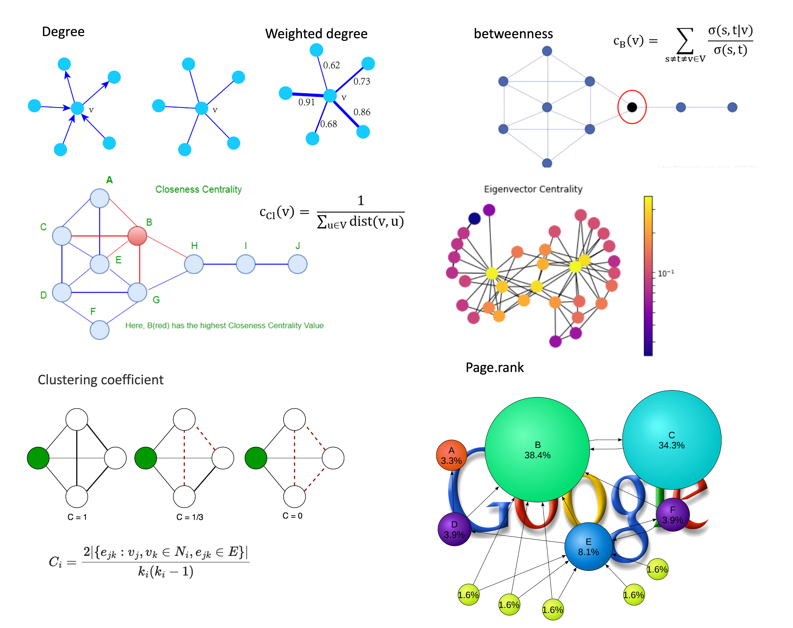
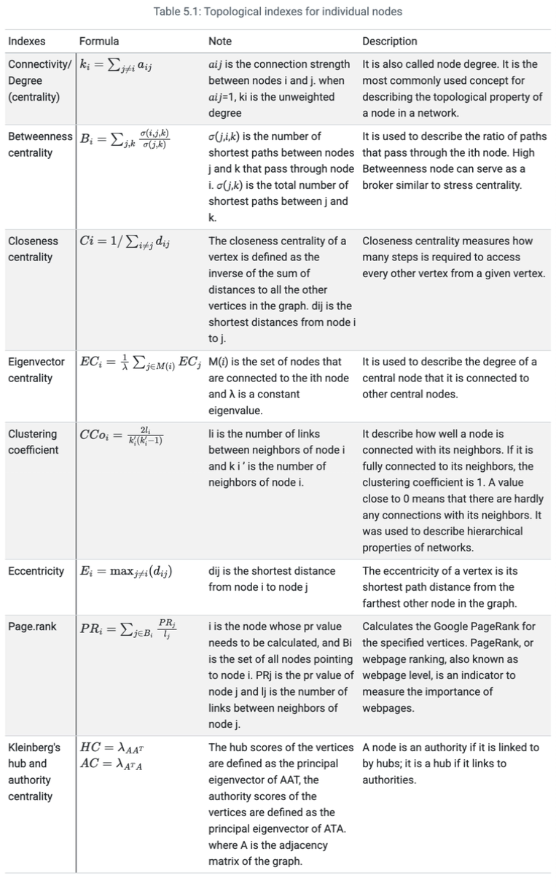
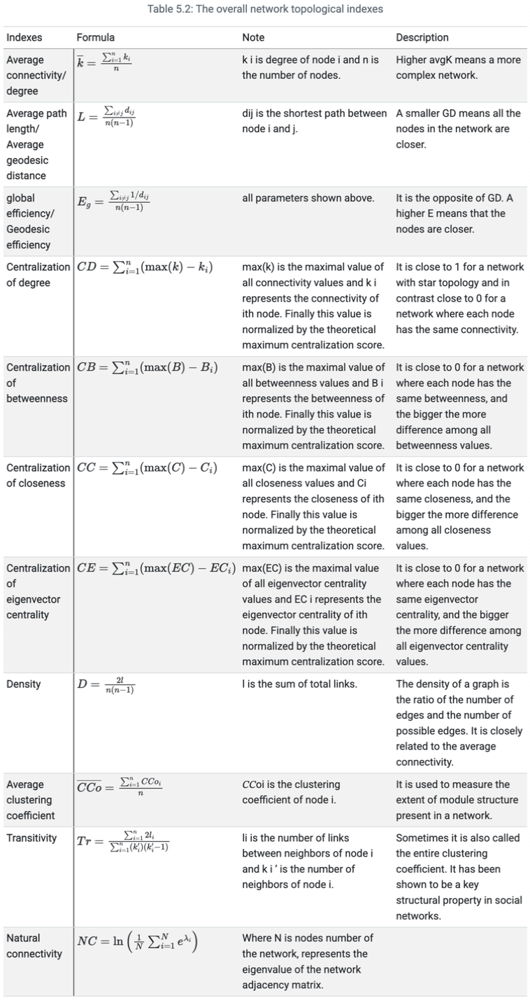
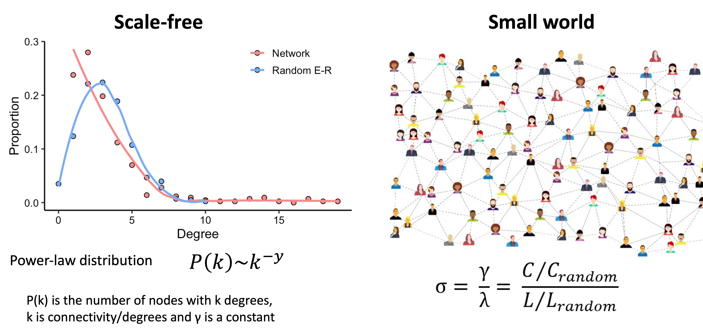
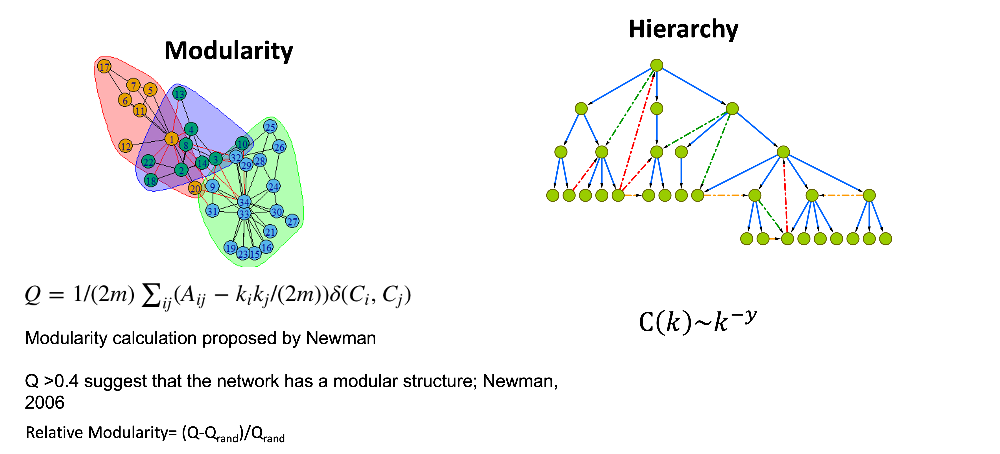
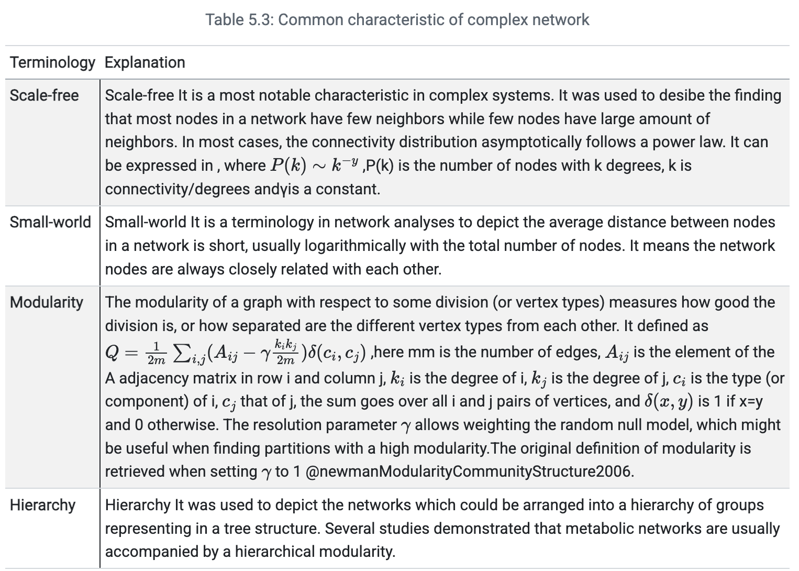

```{r include=FALSE}
devtools::load_all("~/Documents/R/pcutils/")
devtools::load_all("~/Documents/R/MetaNet/MetaNet/")
data(otutab, package = "pcutils")
Packages <- c("dplyr", "pcutils", "kableExtra")
pcutils::lib_ps(Packages)
knitr::opts_chunk$set(message = FALSE,warning = FALSE,cache = T,fig.width=8,fig.height=5)
```

本文我们介绍网络的各种拓扑指标计算和分析。网络拓扑（Network Topology）是指网络中节点与边的连接模式所呈现的全局或局部结构特征。在生物组学研究中，拓扑分析能揭示分子互作网络的功能组织规律，是理解复杂生物系统的关键手段。

- 软件主页：<https://github.com/Asa12138/MetaNet> **大家可以帮忙在github上点点star⭐️**，谢谢🙏
- 详细英文版教程：<https://bookdown.org/Asa12138/metanet_book/>

可以从 CRAN 安装稳定版：`install.packages("MetaNet")`  

依赖包 `pcutils`和`igraph`（需提前安装），推荐配合 `dplyr` 进行数据操作。

```r
library(MetaNet)
library(igraph)

# ========data manipulation
library(dplyr)
library(pcutils)
```

## 拓扑指标

全局拓扑（Global Topology）描述网络整体连接特性，局部拓扑（Local Topology）聚焦单个节点/边的结构重要性，MetaNet可以对构建好的网络进行多种拓扑指标的计算和分析。

### 局部拓扑指标



1. **Connectivity/Degree centrality**  
   衡量节点直接连接数量的基础指标，反映节点的局部影响力。

2. **Betweenness centrality**  
   统计节点出现在所有最短路径中的频率，识别网络中的"桥梁"节点。

3. **Closeness centrality**  
   计算节点到其他所有节点的平均最短距离倒数，体现信息传播效率。

4. **Eigenvector centrality**  
   考虑邻居节点的重要性加权计算，适用于评估依赖高端连接的节点影响力。

5. **Clustering coefficient**  
   量化节点邻居间的连接紧密程度，揭示网络局部模块化特性。

6. **Eccentricity**  
   定义节点到网络中最远节点的距离，反映节点的全局位置特征。

7. **PageRank**  
   基于随机游走模型迭代计算的节点重要性，适用于有向网络（如基因调控网络）。

8. **Kleinberg's hub/authority centrality**  
   双向评价节点价值：hub（指向重要节点）和authority（被重要节点指向）。

更细致的介绍可以看下表，来自MetaNet教程网页：



### 全局拓扑指标

1. **Average connectivity/degree**  
   网络中所有节点连接数的平均值，反映整体连接密度。

2. **Average path length/Average geodesic distance**  
   所有节点对之间最短路径的平均值，衡量网络信息传递效率。

3. **Global efficiency/Geodesic efficiency**  
   节点间最短路径倒数和的标准化值（0-1），值越高表示信息流动越高效。

4. **Centralization of degree**  
   节点度分布的集中程度（0-1），值越高说明网络越依赖少数枢纽节点。

5. **Centralization of betweenness**  
   节点介数中心性的方差，反映网络对"桥梁"节点的依赖程度。

6. **Centralization of closeness**  
   接近中心性的分布偏态，表征网络核心-边缘结构的强度。

7. **Centralization of eigenvector centrality**  
   特征向量中心性的异质性，评估高端连接节点的支配性。

8. **Density**  
   实际边数与最大可能边数的比值（0-1），描述网络的稀疏程度。

9. **Average clustering coefficient**  
   所有节点局部聚类系数的均值，量化网络模块化趋势。

10. **Transitivity**  
    三元闭包比例（三角形结构占比），反映网络局部聚集特性。

11. **Natural connectivity**  
    基于网络特征谱的鲁棒性指标，值越高表示网络越稳定。




**一些潜在的生物网络分析应用场景：**

| 指标类型         | 典型应用场景                  | 计算复杂度 |
|------------------|-----------------------------|------------|
| Degree           | 快速筛选高连接分子            | O(n)       |
| Betweenness      | 发现跨模块调控因子            | O(n²)      |
| PageRank         | 识别关键调控基因              | O(n log n) |


| 指标                          | 典型生物学意义                  | 示例场景                     |
|-------------------------------|--------------------------------|----------------------------|
| Average path length           | 代谢物信号传导速度             | 短路径=快速调控响应         |
| Centralization of degree      | 关键基因的支配性               | 转录因子网络分析            |
| Transitivity                  | 蛋白复合体的形成倾向           | PPI网络功能模块检测         |
| Natural connectivity          | 基因网络抗突变能力             | 疾病相关网络稳定性评估      |


### MetaNet计算

MetaNet提供`net_par()`函数一键计算网络/节点/边三个层级的拓扑指标：

```r
library(MetaNet)
library(igraph)

# 示例1：获取Walther网络的所有指标（返回列表）
make_graph("Walther") %>% net_par(mode = "all")

# 示例2：仅获取网络级全局指标
make_graph("Walther") %>% net_par(mode = "n")
```

**参数说明**：
- `mode`：计算范围
  - `"n"`：网络级指标（如密度、平均路径长度）
  - `"v"`：节点级指标（如度中心性、介数）
  - `"e"`：边级指标（如边介数）
  - `"all"`：全部指标（返回嵌套列表）

也可以通过`c_net_index()`计算并存储拓扑指标到网络中，便于后续分析和可视化：

```{r}
# 生成随机网络
go <- erdos.renyi.game(30, 0.25) %>% c_net_update()

# 计算拓扑指标并存入网络属性
go <- c_net_index(go)

# 查看节点属性表（前6行）
head(get_v(go))  # 包含Degree、Betweenness等列
```

将节点度中心性映射为可视化属性：

```{r}
# get a metanet
go <- erdos.renyi.game(30, 0.25)
go <- c_net_update(go)
par(mfrow = c(1, 2))
plot(go, vertex_size_range = c(5, 20), legend = F, main = "Same size")

# calculate topological indexes and store
go <- c_net_index(go)
head(get_v(go))

# use vertex.size to indicate degree
go <- c_net_set(go, vertex_size = "Degree")
plot(go, vertex_size_range = c(5, 20), legend = F, main = "Size map to degree")
```

## 随机网络

随机网络（Random Network）是网络科学中的一类基础网络模型，其核心特征是网络连接遵循某种随机生成规则。Erdős-Rényi（ER）模型是最著名的代表：

- **定义**：给定N个节点，每对节点以概率p独立连接
- **特性**：
  - 度分布呈泊松分布 $ P(k) \sim e^{-\lambda}\lambda^k/k! $
  - 平均聚类系数：$C \approx p $
  - 平均路径长度：$L \sim \ln(N) $
  
- 生物学意义：
  - 作为"零模型"（null model）用于评估真实生物网络的显著性
  - 帮助识别网络中的非随机结构（如模块、枢纽节点）


MetaNet提供两种随机网络生成方法用于网络分析对比：

1. **单次随机网络生成**  
使用`rand_net()`基于Erdős-Rényi模型生成与目标网络（相同节点数和边数）的随机对照网络：

```{r}
rand_net(co_net) -> random_net
```

2. **批量生成与统计比较**  
通过`rand_net_par()`生成多个随机网络并计算拓扑指标分布，再使用`compare_rand()`进行显著性比较：
```{r}
rand_net_par(co_net, reps = 30) -> randp  # 生成30个随机网络
net_par(co_net) -> pars                   # 计算原网络指标
compare_rand(pars, randp,                 # 指标对比
            index = c("Average_path_length", "Clustering_coefficient"))
```

## 复杂网络

在组学研究中构建的网络大多属于复杂网络，其核心特征包括无标度性、小世界性、模块化和层次性，具体定义如下所示：







1. **无标度性验证**  

使用`fit_power()`函数拟合网络的度分布幂律曲线：

```{r fig.width=5,fig.height=3,out.width='60%'}
data("c_net", package = "MetaNet")
fit_power(co_net)
```

2. **小世界性量化**  
通过`smallworldness()`计算小世界指数σ：

$$
\sigma=\frac{C/C_{random}}{L/L_{random}}
$$
其中C和L分别表示实际网络的聚类系数和平均路径长度，$C_{random}$和$L_{random}$为随机网络对应值。当σ>1时，网络具有小世界特性。

```{r eval=FALSE}
smallworldness(co_net)  # 示例输出：43.09368
```

网络的模块分析下一次介绍。

## References
1. Koutrouli M, Karatzas E, Paez-Espino D and Pavlopoulos GA (2020) A Guide to Conquer the Biological Network Era Using Graph Theory. Front. Bioeng. Biotechnol. 8:34. doi: 10.3389/fbioe.2020.00034
2. Faust, K., and Raes, J. (2012). Microbial interactions: from networks to models. Nat. Rev. Microbiol. https://doi.org/10.1038/nrmicro2832.
3. Y. Deng, Y. Jiang, Y. Yang, Z. He, et al., Molecular ecological network analyses. BMC bioinformatics (2012), doi:10.1186/1471-2105-13-113.