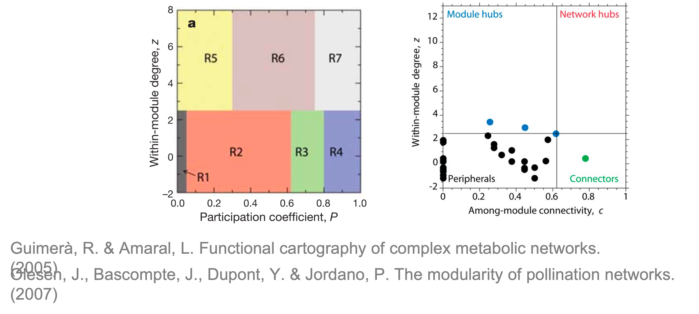

在复杂网络分析中，模块（module）或社区（community）是指网络中连接更为紧密的子图结构。这些模块通常代表功能相关的节点群组，在生物网络中可能对应特定的功能单元或调控模块。MetaNet工具包提供了全面的功能，本文将详细介绍其核心方法和应用场景。

- 软件主页：<https://github.com/Asa12138/MetaNet> **大家可以帮忙在github上点点star⭐️**，谢谢🙏
- 详细英文版教程：<https://bookdown.org/Asa12138/metanet_book/>

可以从 CRAN 安装稳定版：`install.packages("MetaNet")`  

依赖包 `pcutils`和`igraph`（需提前安装），推荐配合 `dplyr` 进行数据操作。

```r
library(MetaNet)
library(igraph)

# ========data manipulation
library(dplyr)
library(pcutils)
```

## 网络模块（module）


模块（module）或社区（community）是指包含节点的子图，其中节点之间的连接密度高于它们与图中其他节点的连接密度。用数学语言表达：当任何子图内部的连接数高于这些子图之间的连接数时，我们就说这个图具有社区结构。

在MetaNet中，可以使用`module_net()`函数生成具有指定模块数的网络：


```r
set.seed(12)
# 生成包含3个模块的网络，每个模块30个节点
test_module_net <- module_net(module_number = 3, n_node_in_module = 30)
plot(test_module_net, mark_module = TRUE)
```

}}index.en_files/figure-html/unnamed-chunk-2-1.png" width="768" />


网络科学领域已开发出多种模块检测算法，各有其优势和适用场景：

1. **短随机游走法**：基于随机游走的动态过程识别社区
2. **社区矩阵的主特征向量法**：利用矩阵特征向量进行谱聚类
3. **模拟退火法**：通过优化模块度指标寻找全局最优解
4. **贪婪模块度优化**：局部搜索算法，计算效率较高
...

MetaNet的`module_detect()`函数集成了这些主流算法，用户可以根据网络特性选择合适的方法。对于大型网络，建议先测试不同算法的运行时间和效果。


```r
# 使用快速贪婪算法检测模块
module_detect(co_net, method = "cluster_fast_greedy") -> co_net_modu
```

### 模块筛选合并

实际分析中，我们常关注特定规模的模块。`filter_n_module()`函数支持多种筛选方式：

• 按节点数筛选：保留节点数超过阈值的模块
• 按模块ID筛选：指定需要保留的特定模块
• 组合筛选：同时应用多种条件


网络布局对模块展示效果至关重要，之前介绍了很多[`g_layout`方法](../metanet-4#分组布局)都可以在这里用上了。`g_layout_circlepack()`可生成基于模块的圆形堆积布局：


```r
par(mfrow = c(2, 2), mai = rep(1, 4))
# module detection
module_detect(co_net, method = "cluster_fast_greedy") -> co_net_modu
get_v(co_net_modu)[, c("name", "module")] %>% head()
```

```
##                           name module
## 1 s__un_f__Thermomonosporaceae     10
## 2        s__Pelomonas_puraquae      9
## 3     s__Rhizobacter_bergeniae      1
## 4     s__Flavobacterium_terrae      3
## 5         s__un_g__Rhizobacter     14
## 6     s__un_o__Burkholderiales      9
```

```r
plot(co_net_modu,
  plot_module = T, mark_module = T,
  legend_position = c(-1.8, 1.6, 1.1, 1.3), edge_legend = F
)
table(V(co_net_modu)$module)
```

```
## 
##  1 10 11 12 13 14 15 16 17 18 19  2 20 21 22 23 24 25 26 27 28 29  3  4  5  6 
## 36 18 35 16 17 12 21 15  6  4  4 24  2  3  2  2  2  2  3  2  3  2 27 23 35 23 
##  7  8  9 
## 33 18 61
```

```r
# 保留节点数≥30的模块和ID为10的模块
co_net_modu2 <- filter_n_module(co_net_modu, n_node_in_module = 30, keep_id = 10)
plot(co_net_modu2, plot_module = T, mark_module = T, legend_position = c(-1.8, 1.3, 1.1, 1.3))

# change group layout
g_layout_circlepack(co_net_modu, group = "module") -> coors
plot(co_net_modu2, coors = coors, plot_module = T, mark_module = T, edge_legend = F)

# extract some modules, delete =T will delete other modules.
co_net_modu3 <- filter_n_module(co_net_modu, n_node_in_module = 30, keep_id = 10, delete = T)
plot(co_net_modu3, coors, plot_module = T)
```

}}index.en_files/figure-html/unnamed-chunk-4-1.png" width="1536" />

看看网络的components，一些太小的sub_graphs会影响模块，如果您不关心这些小型组件，则可以过滤掉它们。


```r
table(V(co_net_modu)$components)
```

```
## 
##   1  10  11  12  13   2   3   4   5   6   7   8   9 
## 418   2   2   2   2   6   4   2   2   3   2   3   3
```

```r
co_net_modu4 <- c_net_filter(co_net_modu, components == 1)

# re-do a module detection
co_net_modu4 <- module_detect(co_net_modu4)
g_layout_circlepack(co_net_modu4, group = "module") -> coors
plot(co_net_modu4, coors, plot_module = T)
```

}}index.en_files/figure-html/unnamed-chunk-5-1.png" width="768" />

`plot_module_tree()`函数可展示模块的树状关系，揭示模块间的层次结构。当模块数量过多时，`combine_n_module()`可将模块合并到指定数量，便于高层次分析。


```r
# 展示模块树状图
p1 <- plot_module_tree(co_net_modu4, label.size = 0.6)

# 将17个模块合并为5个
co_net_modu5 <- combine_n_module(co_net_modu4, 5)
p2 <- plot_module_tree(co_net_modu5, label.size = 0.6)

library(patchwork)
p1+p2
```

}}index.en_files/figure-html/unnamed-chunk-6-1.png" width="672" />

### 模块pattern分析

在生物网络中，模块常对应功能相关的分子集合。我们还可以使用此网络模块指示具有相似表达/丰度的群集。但是我们应该首先过滤正边，因为模块检测仅考虑拓扑结构而不是边缘类型。过滤正相关边和模块检测后，将找到一些模块，很像是WGCNA里的基因模块，我们还可以使用`module_eigen`查看每个模块表达模式。


```r
data("otutab", package = "pcutils")
totu <- t(otutab)
# filter positive edges
c_net_filter(co_net, e_type == "positive", mode = "e") -> co_net_pos
co_net_pos_modu <- module_detect(co_net_pos, n_node_in_module = 15, delete = T)

g_layout_circlepack(co_net_pos_modu, group = "module") -> coors1
plot(co_net_pos_modu, coors1, plot_module = T)
```

}}index.en_files/figure-html/unnamed-chunk-7-1.png" width="768" />

`module_eigen()`和`module_expression()`可计算和可视化模块特征基因及表达模式：


```r
# map the original abundance table
module_eigen(co_net_pos_modu, totu) -> co_net_pos_modu

# plot the expression pattern
p1 <- module_expression(co_net_pos_modu, totu,
  r_threshold = 0.6,
  facet_param = list(ncol = 4), plot_eigen = T
) +
  theme(axis.text.x = element_text(size = 5, angle = 90, vjust = 0.5))

# correlate to metadata
env <- metadata[, 3:8]
p2 <- cor_plot(get_module_eigen(co_net_pos_modu), env) + coord_flip()

p1 / p2 + patchwork::plot_layout(heights = c(2, 1.4))
```

}}index.en_files/figure-html/unnamed-chunk-8-1.png" width="1152" />


```r
# summary some variable according to modules.
p3 <- summary_module(co_net_pos_modu, var = "Phylum") +
  scale_fill_pc()
p4 <- summary_module(co_net_pos_modu, var = "node_eigen_cor") +
  scale_color_pc(palette = "col2")
p3 + p4
```

}}index.en_files/figure-html/unnamed-chunk-9-1.png" width="960" />

使用`links_stat()`对边进行汇总，发现大多数边都是从一个模块到同一个模块的（意味着模块检测正常）。


```r
links_stat(co_net_modu2, group = "module")
```

}}index.en_files/figure-html/unnamed-chunk-10-1.png" width="768" />


## 拓扑角色分析

在我们确定了网络的这些模块后，可以根据Zi-Pi计算每个节点的拓扑角色。

**Within-module connectivity (Zi)**:

$$
Z_i= \frac{\kappa_i-\overline{\kappa_{si}}}{\sigma_{\kappa_{si}}}
$$

其中$κ_i$是节点i到其模块si中其他节点的链接数，$\overline{\kappa_{si}}$是si中所有节点的k的平均值，$\sigma_{\kappa_{si}}$是si中κ的标准偏差。

**Among-module connectivity (Pi)**:

$$
P_i=1-\sum_{s=1}^{N_m}{\left( {\frac{\kappa_{is}}{k_i}} \right)^2}
$$

其中$\kappa_{is}$是节点i到模块s中节点的链接数，$k_i$是节点i的总度数。



参考R. Guimerà, L. Amaral, Functional cartography of complex metabolic networks (2005), doi:10.1038/nature03288.，基于Zi-Pi指标，节点可分为四类拓扑角色：

1. **外围节点(Peripherals)**：Zi<2.5且Pi<0.62
2. **模块枢纽(Module hubs)**：Zi>2.5且Pi<0.62
3. **连接节点(Connectors)**：Zi<2.5且Pi>0.62
4. **网络枢纽(Network hubs)**：Zi>2.5且Pi>0.62

其中除了Peripherals的节点通常被视为网络的关键节点(keystone)，参考
S. Liu, H. Yu, Y. Yu, J. Huang, et al., Ecological stability of microbial communities in Lake Donghu regulated by keystone taxa. Ecological Indicators. 136, 108695 (2022).

使用`zp_analyse`拿到模块角色并存储在顶点属性中，然后我们可以使用zp_plot（）可视化。我们可以看到模块中心是模块的中心，而连接器通常是介导不同模块的连接。


```r
zp_analyse(co_net_modu4) -> co_net_modu4
get_v(co_net_modu4)[, c(1, 16:21)] %>% head()
```

```
##                           name components module original_module Ki         Zi
## 1 s__un_f__Thermomonosporaceae          1      6               6  3  0.4358899
## 2        s__Pelomonas_puraquae          1     11              11 15  1.9019177
## 3     s__Rhizobacter_bergeniae          1      1               1  4  1.0951304
## 4     s__Flavobacterium_terrae          1      3               3  4  1.8027756
## 5         s__un_g__Rhizobacter          1     14              14  1 -1.0488088
## 6     s__un_o__Burkholderiales          1     11              11 17  2.3326783
##          Pi
## 1 0.3750000
## 2 0.3490305
## 3 0.5714286
## 4 0.0000000
## 5 0.0000000
## 6 0.1939058
```

```r
# color map to roles
co_net_modu6 <- c_net_set(co_net_modu4, vertex_class = "roles")
plot(co_net_modu6, coors, mark_module = T, labels_num = 0, group_legend_title = "Roles")
```

}}index.en_files/figure-html/unnamed-chunk-11-1.png" width="768" />


```r
library(patchwork)
zp_plot(co_net_modu4, mode = 1) +
  zp_plot(co_net_modu4, mode = 3)
```

}}index.en_files/figure-html/unnamed-chunk-12-1.png" width="1152" />


## References
1. Koutrouli M, Karatzas E, Paez-Espino D and Pavlopoulos GA (2020) A Guide to Conquer the Biological Network Era Using Graph Theory. Front. Bioeng. Biotechnol. 8:34. doi: 10.3389/fbioe.2020.00034
2. Faust, K., and Raes, J. (2012). Microbial interactions: from networks to models. Nat. Rev. Microbiol. https://doi.org/10.1038/nrmicro2832.
3. Y. Deng, Y. Jiang, Y. Yang, Z. He, et al., Molecular ecological network analyses. BMC bioinformatics (2012), doi:10.1186/1471-2105-13-113.
4. R. Guimerà, L. Amaral, Functional cartography of complex metabolic networks (2005), doi:10.1038/nature03288.
5. S. Liu, H. Yu, Y. Yu, J. Huang, et al., Ecological stability of microbial communities in Lake Donghu regulated by keystone taxa. Ecological Indicators. 136, 108695 (2022).
