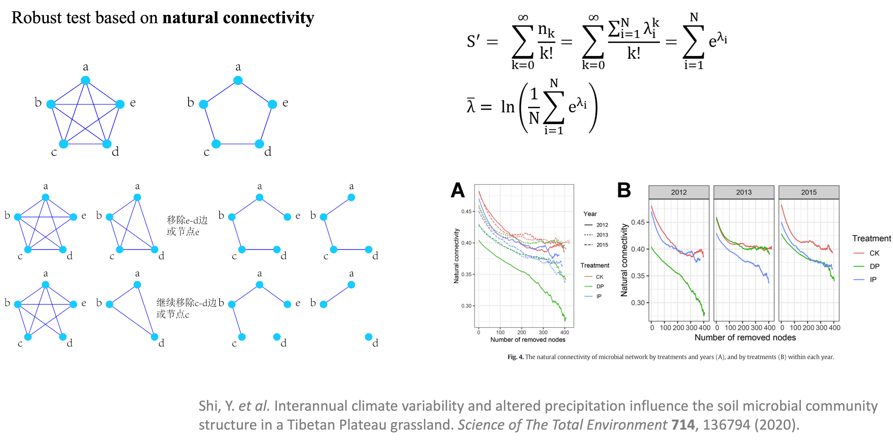
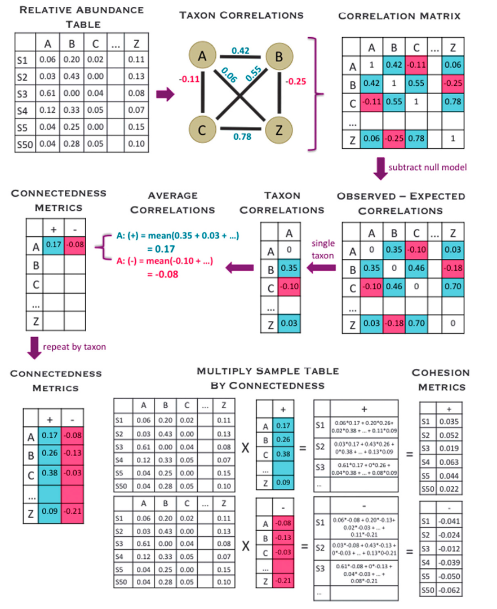
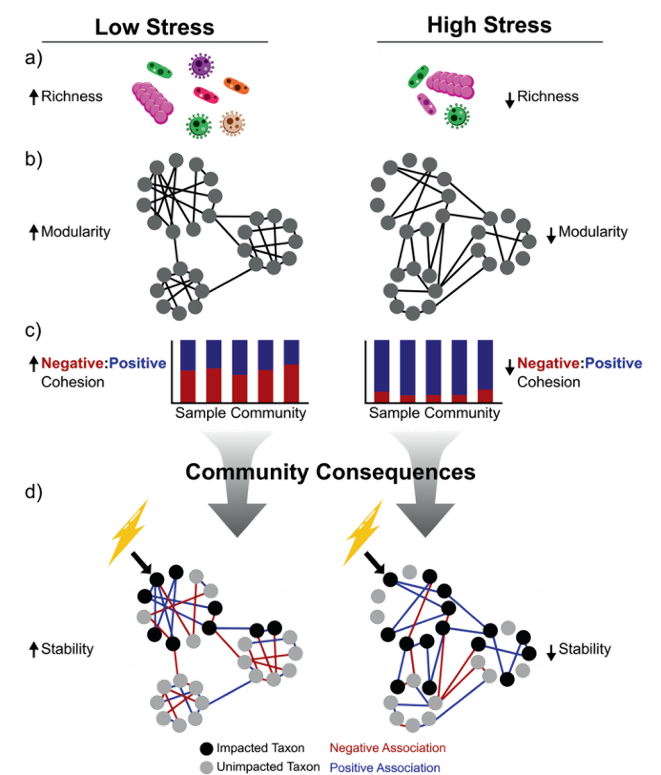

```{r include=FALSE}
devtools::load_all("~/Documents/R/pcutils/")
devtools::load_all("~/Documents/R/MetaNet/MetaNet/")
data(otutab, package = "pcutils")
Packages <- c("dplyr", "pcutils", "kableExtra")
pcutils::lib_ps(Packages)
knitr::opts_chunk$set(message = FALSE,warning = FALSE,eval = FALSE,fig.width=8,fig.height=5)
```

除了之前讲的网络拓扑特征（数学指标）外，网络的稳定性也是生物研究的重点。网络稳定性是理解分子调控，代谢网络，生态系统等稳健性的重要因素。

我们收集了许多方法在MetaNet中来计算和反映网络的稳定性和复杂性，这些算法都是**并行计算**的，这可以快得多。所有网络稳定性计算都提供并行版本，使用`parallel::detectCores()`获取设备核数，并设置`threads >1`使用并行计算。


- 软件主页：<https://github.com/Asa12138/MetaNet> **大家可以帮忙在github上点点star⭐️**，谢谢🙏
- 详细英文版教程：<https://bookdown.org/Asa12138/metanet_book/>

可以从 CRAN 安装稳定版：`install.packages("MetaNet")`  

依赖包 `pcutils`和`igraph`（需提前安装），推荐配合 `dplyr` 进行数据操作。

```r
library(MetaNet)
library(igraph)

# ========data manipulation
library(dplyr)
library(pcutils)
```

## 多组网络构建

比较基于不同组的网络稳定性非常重要。

例如，我们有三组样本：NS、WS、CS，n=6（**在实际研究中，n应该更大才能得到有意义的结果**），我们可以获得每组的网络并进行比较。


```{r}
data("otutab", package = "pcutils")

table(metadata$Group)
# check all rows matched
all(colnames(otutab) == rownames(metadata))
```

- 我们可以从整个网络中提取三组子网:

```{r eval=FALSE}
# extract three-group sub-nets
hebing(otutab, metadata$Group) -> otutab_G
head(otutab_G)

# whole network
t(otutab) -> totu
c_net_calculate(totu) -> corr
c_net_build(corr, r_threshold = 0.65) -> co_net

group_net_par <- extract_sample_net(co_net, otutab_G, save_net = "../Group_subnet")
group_nets <- readRDS("../Group_subnet.RDS")

names(group_nets)
```

- 或者为每个组专门构建一个网络：

```{r eval=FALSE}
data("otutab", package = "pcutils")

totu <- t(otutab)
# check all rows matched
all(rownames(totu) == rownames(metadata))

# Use RMT threshold or not?
rmt <- FALSE
group_nets <- lapply(levels(metadata$Group), \(i){
  totu[rownames(filter(metadata, Group == !!i)), ] -> t_tmp
  t_tmp[, colSums(t_tmp) > 0] -> t_tmp
  c_net_calculate(t_tmp) -> c_tmp
  if (rmt) {
    RMT_threshold(c_tmp, verbose = F, out_dir = "test/") -> tmp_rmt
    r_thres <- tmp_rmt$r_threshold
  } else {
    r_thres <- 0.6
  }
  c_net_build(c_tmp, r_threshold = r_thres, p_threshold = 0.01, delete_single = T) -> n_tmp
  Abundance_df <- data.frame("Abundance" = colSums(t_tmp))
  c_net_set(n_tmp, Abundance_df, taxonomy %>% select("Phylum"), vertex_class = "Phylum", vertex_size = "Abundance")
})

names(group_nets) <- levels(metadata$Group)
```


## 网络稳健测试

参考：M. B. WU Jun, Natural Connectivity of Complex Networks. Chinese Physics Letters. 27, 78902–078902 (2010).

网络的稳健测试（Robust test）是计算自然联通度来进行的，因为它可以反映网络的稳定性。它认为复杂网络的功能和性能取决于当一个网络的部分节点被破坏（或移除）时，该网络保持其连通性的能力。

来看下图，两个闭环网络。两个网络都含有a-e共5个节点，理论上，两个网络中任意节点间都是相通的，也就是从一个节点出发，无论选择怎样的路径，最终都能到达另一节点。
但是当我们进行节点或边的移除，比如删除ed，左边还能ed2条边相连，右边就要5条边才能连上，移除更多的边时右边的网络就会出现孤立节点。

自然连通度从复杂网络的内部结构属性出发，通过计算网络中不同长度闭途径数目的加权和来刻画网络中替代途径的冗余性，其数学形式可以从网络邻接矩阵特征谱直接导出，具有明确的物理意义，但比较复杂。
自然连通度关于移除节点或边是单调减的，这意味着自然连通度能够精确刻画网络抗毁性的细微差别，且对于不连通图仍然有效。

右下角这个例子就是逐步移出网络的节点，观察自然联通度的下降趋势，越平缓的说明稳定性越好



具体来说，我们可以在删除节点后计算自然连接（一次从网络中删除多个节点，直到指定比例的节点消失），
自然连通性的下降趋势水平表明了网络在受到一定程度的破坏后的连通性性能。

```{r eval=FALSE}
#建议“reps”大于99，您可以将“threads>1”设置为使用并行计算。
robust_test(group_nets, partial = 0.5, step = 10, reps = 9, threads = 1) -> robust_res
plot(robust_res, mode = 2)
```


## 网络群落稳定性

群落稳定性可以用各种指标来表征，如鲁棒性（Robustness）、脆弱性(Vulnerability)和凝聚力。

### Robustness

参考 Yuan, M. M. et al. Climate warming enhances microbial network complexity and stability. Nat. Clim. Chang. 11, 343–348 (2021).

作者将网络的鲁棒性（Robustness）定义为网络在随机或有针对性的节点删除后对节点丢失的抵抗力。

为了模拟随机物种去除，随机去除一定比例的节点，为了测试移除的物种对剩余物种的影响，作者计算了节点 i 的丰度加权平均相互作用强度（wMIS）：移除所选节点后，如果 wMISi = 0（与物种 i 相关的所有物种都被移除） ）或 wMISi < 0（物种 i 与其他物种没有足够的互惠关联以使其生存），则节点 i 被视为灭绝/孤立并从网络中删除。整个过程一直持续到所有物种的 wMIS 呈正数为止。 剩余节点的比例被报告为网络鲁棒性。

```{r eval=FALSE}
#建议“reps”大于99，您可以将“threads>1”设置为使用并行计算。
robustness(group_nets, keystone = F, reps = 99, threads = 1) -> robustness_res
plot(robustness_res, p_value2 = T)
```

{width=60%}

### Vulnerability

参考 Yuan, M. M. et al. Climate warming enhances microbial network complexity and stability. Nat. Clim. Chang. 11, 343–348 (2021).

为了评估网络内干扰传播的速度，全局效率被视为所有节点对效率的平均值，其通过成对节点之间的最短路径中的边的数量来计算。

脆弱性(Vulnerability)反映了每个节点对全局效率的相对贡献，由网络中节点的最大脆弱性表示。

$$
Vulnerability=\max\left(\frac{E-E_i}E\right)
$$

其中E是全局效率，Ei是去除节点i及其整个链路后的全局效率。图的全局效率计算为所有节点对效率的平均值：

$$
E=\frac1{n(n-1)}\sum_{i\neq j}\frac1{d(i,j)}
$$
其中d（i，j）是节点i和j之间的最短路径长度。

```{r eval=FALSE}
vulnerability_res <- vulnerability(group_nets, threads = 1)
plot(vulnerability_res)
```

{width=60%}

### Cohesion

参考 C. M. Herren, K. McMahon, Cohesion: A method for quantifying the connectivity of microbial communities (2017), doi:10.1038/ismej.2017.91.

还有一个指标是cohesion凝聚力指数，通过分别表征群落中物种间的正负共现关系，来了解由正/负物种相互作用或由生态位相似性/差异引起群落连通性跨时间、空间或环境梯度的变化。



首先从丰度表构建相关性矩阵，然后对它做零模型消除随机效应，这样对于每一个物种，都有与其他所有物种的相关性，然后把其中的正值负值分开取平均，就能得到每个物种的connectedness，再乘上丰度表，就能得到每一个样本的正负凝聚力了。

$$
\text{Cohesion}=\sum_{i=1}^n\text{abundance}_i\times\text{connectednes}s_i
$$



正Cohesion是由两两正相关产生的，可以反映样本中合作行为的程度，而负Cohesion可以表明群落成员之间竞争行为的程度。然后作者认为负：正Cohesion的绝对值越高的的群落更稳定。（Hernandez, D. J., David, A. S., Menges, E. S., Searcy, C. A. & Afkhami, M. E. Environmental stress destabilizes microbial networks. ISME J 15, 1722–1734 (2021).）


```{r eval=FALSE}
#建议“reps”大于99，您可以将“threads>1”设置为使用并行计算。
Cohesion(otutab, reps = 9, threads = 1) -> cohesion_res
p1 <- plot(cohesion_res, group = "Group", metadata, mode = 1) + theme_bw()
p2 <- plot(cohesion_res, group = "Group", metadata, mode = 2)
p1 + p2
```


## References
1. Yuan, M. M. et al. Climate warming enhances microbial network complexity and stability. Nat. Clim. Chang. 11, 343–348 (2021).
2. M. B. WU Jun, Natural Connectivity of Complex Networks. Chinese Physics Letters. 27, 78902–078902 (2010).
3. C. M. Herren, K. McMahon, Cohesion: A method for quantifying the connectivity of microbial communities (2017), doi:10.1038/ismej.2017.91.
4. Hernandez, D. J., David, A. S., Menges, E. S., Searcy, C. A. & Afkhami, M. E. Environmental stress destabilizes microbial networks. ISME J 15, 1722–1734 (2021).