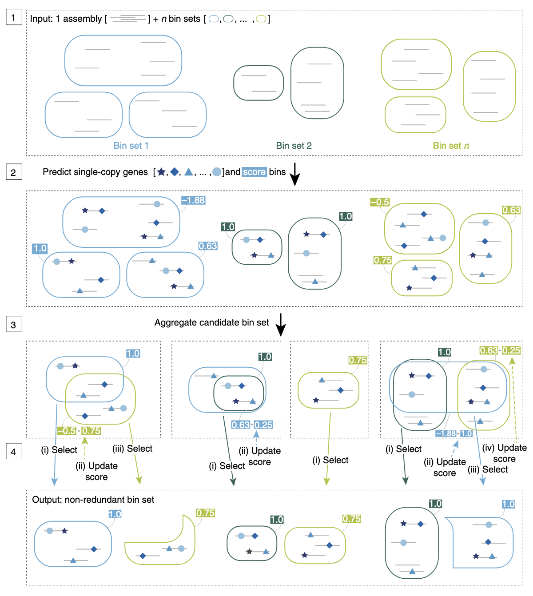
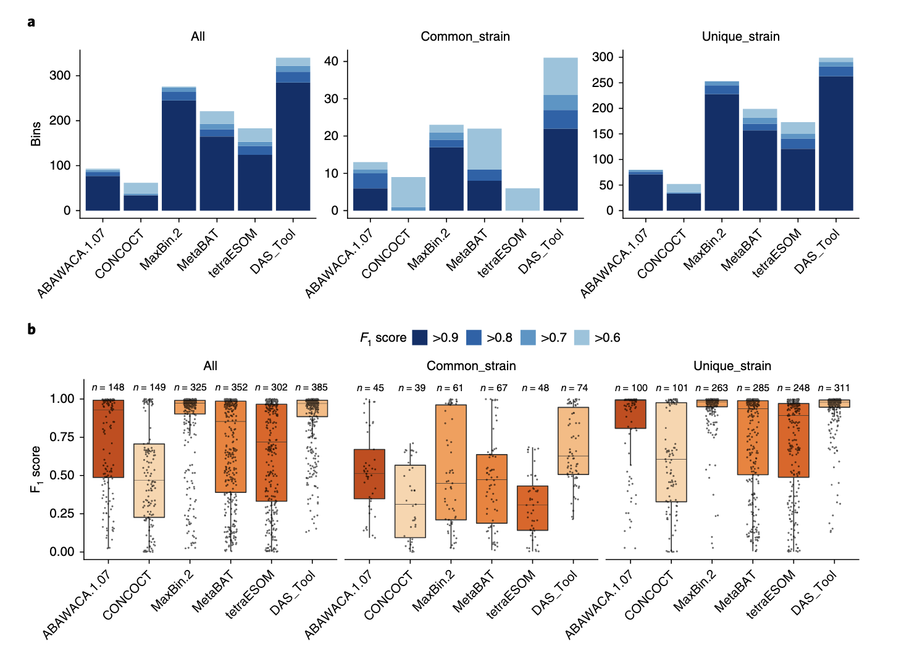
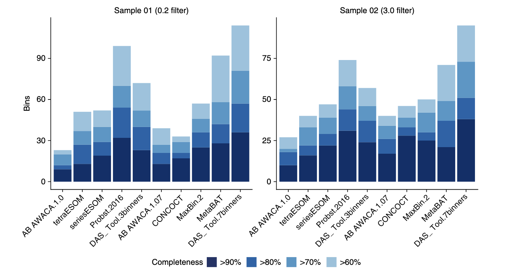

## Introduction

在宏基因组学研究中，准确地将组装后的基因组片段（contigs）归属到各自的微生物基因组中，是解析微生物群落功能和生态关系的关键步骤。然而，很多分箱（binning）方法在面对复杂的微生物群落时，常常难以重建出高质量的基因组，且不同工具在不同样本和生态环境中的表现差异显著。

为了解决这一问题，研究人员开发了DAS Tool（Dereplication, Aggregation and Scoring Tool），这是一种自动化的方法，能够整合多个已有的分箱算法的结果，生成优化的、非冗余的高质量基因组集合。在多个复杂环境样本中，DAS Tool展示了比任何单一分箱工具更强的能力，能够恢复更多接近完整的基因组，包括一些之前未被发现的谱系。本文将介绍使用DAS Tool优化宏基因组分箱结果，提升基因组重建的质量和数量。

{width=60%}

DAS Tool的文章于2018年发表于Nature Microbiology，软件主页：<https://github.com/cmks/DAS_Tool>，logo也很有意思。

### 工作流程



**Step 1｜整合多种分箱结果**  
DAS Tool 的输入包括：一个宏基因组组装（scaffolds）和来自不同 binning 工具的多个 bin 结果（每种颜色表示一个工具的输出）。这些分箱工具可能依据不同特征（如 GC 含量、k-mer 频率或丰度信息）进行聚类。

**Step 2｜识别单拷贝基因并打分**  
DAS Tool 会在 scaffolds 上预测单拷贝标志基因（single-copy marker genes），并以此对每个 bin 进行质量打分（例如完整度和污染度），用于后续筛选。

**Step 3｜合并候选 bin 并去除冗余**  
来自不同工具的 bin 可能存在重叠。DAS Tool 会将这些候选 bin 进行去冗余整合，构建一个统一的候选 bin 集合。

**Step 4｜迭代优化与筛选**  
DAS Tool 通过迭代方式从所有候选 bin 中优先选择得分最高的，并在每轮迭代中更新剩余 bin 的得分（考虑重复和覆盖情况），最终输出一个非冗余、高质量的 bin 集合。

这个流程的关键在于：**充分融合多个 binning 工具的优点**，利用标志基因和打分机制，**自动筛选出最优的 bin 组合**，有效提升基因组重建的质量和覆盖范围。

### 效果评估

#### DAS Tool在模拟微生物群落中的表现验证



为了验证 DAS Tool 的效果，研究者将其应用于 **CAMI challenge** 提供的三种复杂度不同的模拟微生物群落数据集（包含 40、132 和 596 个基因组）。使用五种主流 binning 工具（ABAWACA、CONCOCT、MaxBin 2、MetaBAT、ESOM）分别预测分箱，并用 DAS Tool 进行整合优化。

在高复杂度（596 个基因组）数据集中，DAS Tool 重建的高质量基因组数量（F1 分数 > 0.6）显著高于任何单一工具：  
- **DAS Tool：** 共识菌株 41 个、唯一菌株 299 个  
- **次优 MaxBin 2：** 共识菌株 23 个、唯一菌株 253 个  
- **ESOM：** 虽对唯一菌株效果尚可（173 个），但对存在菌株变异的基因组恢复能力较差（仅 6 个）

此外，DAS Tool 重建的基因组 F1 分数中位数也优于其它工具，尤其在处理菌株变异时展现出更强的能力。不仅在高复杂度样本中表现优越，在中低复杂度数据集上也优于单一方法。


#### DAS Tool在真实环境样本中的应用



Probst 等人曾从高 CO₂ 冷泉系统中构建了一个经过精细人工筛选的基因组分箱集，成为评估 DAS Tool 表现的理想样本。这些数据来自对不同滤膜（3.0 μm 与 0.2 μm）过滤后的样品进行组装，并采用三种 binning 方法 + 人工校正获得结果。

研究者对原始发表的 bins 及不同 binning 工具（ABAWACA 1.0/1.07、ESOM、CONCOCT、MetaBAT、MaxBin 2）与 DAS Tool 的整合结果进行了对比评估。质量评估采用 **CheckM**，高质量定义为 **>90% 完整度且污染率 <5%**。

主要发现如下：

- **使用3种工具整合的 DAS Tool** 已超过任一单一方法的效果，但略低于人工精修结果。
- **使用7种工具整合的 DAS Tool** 成果优于原始发表结果：
  - **0.2 μm 样本：** DAS Tool 重建 36 个近全基因组，高于原始的 32 个；
  - **3.0 μm 样本：** DAS Tool 重建 38 个，高于原始的 31 个；
  - 草稿级基因组数量也全面提升。
- 当适度放宽污染率阈值时，草稿基因组数量进一步增加。

在真实环境样本中，DAS Tool 同样展现出强大整合能力，尤其当结合更多 binning 工具时，不仅能提高高质量基因组的数量，也能有效替代部分人工精修过程。

## 使用方法

### 安装

#### 1. 最简单的安装方式：使用 conda

```bash
conda config --add channels defaults
conda config --add channels bioconda
conda config --add channels conda-forge

conda install -c bioconda das_tool
```

但我发现conda安装好了之后也需要下载github主页的db.zip文件并解压，后续运行需指定db目录，不然默认用当前目录下的db：

```
# 下载并解压缩DASTool.zip存档:
unzip DAS_Tool-1.x.x.zip
cd ./DAS_Tool-1.x.x

# Unzip SCG database:
unzip ./db.zip -d db
```

#### 2. 手动安装（需满足以下依赖项）

- **R (>= 3.2.3)**：https://www.r-project.org  
- **R 包**：  
  - `data.table` (>= 1.9.6)  
  - `magrittr` (>= 2.0.1)  
  - `docopt` (>= 0.7.1)  
- **ruby (>= 2.3.1)**：https://www.ruby-lang.org  
- **Pullseq (>= 1.0.2)**：https://github.com/bcthomas/pullseq  
- **Prodigal (>= 2.6.3)**：https://github.com/hyattpd/Prodigal  
- **coreutils（仅 macOS 需要）**：https://www.gnu.org/software/coreutils  
- **以下三种搜索引擎之一：**
  - **DIAMOND (>= 0.9.14)**：推荐，用于大数据集：https://ab.inf.uni-tuebingen.de/software/diamond  
  - **BLAST+ (>= 2.5.0)**：https://blast.ncbi.nlm.nih.gov/Blast.cgi  
  - **USEARCH (>= 8.1)**：http://www.drive5.com/usearch/download.html  
    > 注意：USEARCH 免费版仅支持最多 4GB 内存，因此推荐使用 DIAMOND 或 BLAST+。
    
```
# 下载并解压缩DASTool.zip存档:
unzip DAS_Tool-1.x.x.zip
cd ./DAS_Tool-1.x.x

# Unzip SCG database:
unzip ./db.zip -d db

# Run DAS Tool:
./DAS_Tool -h
```

```
$ R
> repo='http://cran.us.r-project.org' #select a repository
> install.packages('data.table', repos=repo, dependencies = T)
> install.packages('magrittr', repos=repo, dependencies = T)
> install.packages('docopt', repos=repo, dependencies = T)
> q() #quit R-session
```

#### 3. 使用 Docker

```bash
cd ./DAS_Tool-1.x.x
docker build -t cmks/das_tool .
```

### 参数说明

安装完成后，可以通过 `DAS_Tool -h` 查看可用参数：

```bash
DAS_Tool [选项] -i <contig2bin> -c <contigs_fasta> -o <输出前缀>

主要参数：
  -i, --bins=<contig2bin>                 多个 contig-to-bin 表格文件（以逗号分隔）
  -c, --contigs=<contigs>                 组装后的 contig（FASTA 格式）
  -o, --outputbasename=<前缀>             输出文件名前缀
  -l, --labels=<标签>                     每个 binning 工具的名称（以逗号分隔）
  --search_engine=<搜索工具>             用于识别单拷贝基因的搜索工具（diamond/blastp/usearch）[默认：diamond]
  -p, --proteins=<蛋白文件>               预测蛋白（可选），跳过基因预测步骤（FASTA 格式）
  --write_bin_evals                       输出原始 bin 评估结果
  --write_bins                            输出最终整合的 bin（FASTA）
  --write_unbinned                        输出未归类的 contigs
  -t, --threads=<线程数>                  并行线程数 [默认：1]
  --score_threshold=<阈值>               bin 筛选的得分阈值（0~1）[默认：0.5]
  --duplicate_penalty=<重复惩罚>         单拷贝基因重复的惩罚因子（0~3）[默认：0.6]
  --megabin_penalty=<megabin惩罚>        超大 bin 的惩罚因子（0~3）[默认：0.5]
  --dbDirectory=<数据库路径>             单拷贝基因数据库路径 [默认：db]
  --resume                                使用之前预测过的单拷贝基因结果
  --debug                                 输出调试信息
  -v, --version                           查看版本
  -h, --help                              查看帮助
```

### 输入文件准备

#### 1. 多个 binning 工具的输出 [`--bins`, `-i`]

每个 binning 工具生成的 contig-to-bin 表格，TSV 格式：

```
Contig_1    bin.01
Contig_8    bin.01
Contig_42   bin.02
Contig_49   bin.03
```

> 不是所有 binning 工具都直接生成此格式。可使用官方提供的脚本 `Fasta_to_Contigs2Bin.sh` 进行转换，在github主页上：

```bash
# 示例：将 MaxBin 输出 fasta 文件转为 contigs2bin 表格
~/biosoft/DAS_Tool/src/Fasta_to_Contig2Bin.sh -i /maxbin/output/folder -e fa > maxbin.contigs2bin.tsv
```

> 某些工具如 CONCOCT 输出为 CSV，可用 perl 一行命令转为 TSV：

```bash
perl -pe "s/,/\tconcoct./g;" concoct_clustering_gt1000.csv > concoct.contigs2bin.tsv
```

#### 2. 组装后的 contig 文件 [`--contigs`, `-c`]

FASTA 格式，如：

```fasta
>Contig_1
ATCATCGTCCGCATCGACGAATTCGGCGAACGAGTACCCCTGACCATCTCCGATTA...
>Contig_2
GATCGTCACGCAGGCTATCGGAGCCTCGACCCGCAAGCTCTGCGCCTTGGAGCAGG...
```

#### 3. 可选：预测蛋白序列 [`--proteins`]

若已有 prodigal 预测结果（`.faa` 格式），可跳过基因预测步骤。

### 运行 DAS Tool

基本命令格式如下：

```bash
DAS_Tool -i <binning_results.tsv> -l <binning_labels> -c <scaffolds.fasta> -o <输出前缀>
```

参数说明：

- `-i`：多个 binning 工具的 contigs-to-bin TSV 文件（用逗号连接），注意逗号之间绝对不能有空格，不然会引发Docopt报错
- `-l`：与 `-i` 对应的 binning 工具名称（用逗号连接）
- `-c`：组装后 contigs 的 FASTA 文件
- `-o`：输出文件名前缀

示例：

```bash
DAS_Tool -i bins.tsv -l metabat,maxbin,concoct -c assembly.fasta -o DAS_Tool_output
```

### 输出结果

运行后将生成以下输出文件：

- `*_DASTool_summary.tsv`：输出 bin 的质量与完整性评估汇总
- `*_DASTool_contigs2bin.tsv`：最终 contigs-to-bin 映射表
- `*_allBins.eval`：若启用 `--write_bin_evals`，输出输入 bin 的评估结果
- `DASTool_bins/`：若启用 `--write_bins`，输出整合后的 bin（FASTA 格式）


### 示例数据与测试

使用 GitHub 提供的 `sample_data`：

#### 示例 1：使用 4 个 bin 工具结果运行 DAS Tool

```bash
DAS_Tool -t 4 -i sample_data/sample.human.gut_concoct_contigs2bin.tsv,\
sample_data/sample.human.gut_maxbin2_contigs2bin.tsv,\
sample_data/sample.human.gut_metabat_contigs2bin.tsv,\
sample_data/sample.human.gut_tetraESOM_contigs2bin.tsv \
--dbDirectory ~/db/DAS_Tool_db \
-l concoct,maxbin,metabat,tetraESOM \
-c sample_data/sample.human.gut_contigs.fa \
-o sample_output2/DASToolRun1
```

用了4核，对于一个32M的contig文件，用时1min，内存占用200MB。

#### 示例 2：设置更多参数，跳过基因预测，输出评估结果，输出最终的bins，使用多线程

```bash
DAS_Tool -t 4 -i sample_data/sample.human.gut_concoct_contigs2bin.tsv,\
sample_data/sample.human.gut_maxbin2_contigs2bin.tsv,\
sample_data/sample.human.gut_metabat_contigs2bin.tsv,\
sample_data/sample.human.gut_tetraESOM_contigs2bin.tsv \
--dbDirectory ~/db/DAS_Tool_db \
-l concoct,maxbin,metabat,tetraESOM \
-c sample_data/sample.human.gut_contigs.fa \
-o sample_output2/DASToolRun2 \
--proteins sample_output2/DASToolRun1_proteins.faa \
--write_bin_evals \
--write_bins \
--score_threshold 0.6
```

### 承接MetaWRAP输出结果

MetaWRAP是我们之前介绍过的一个binning流程工具，假如我们一开始已经用MetaWRAP进行了3种工具的binning，现在我们想用DAS_Tool来进行进一步的优化，那么可以用如下命令：

```bash
i=KY01867_1_T006D
metawrap binning -o l -t 2 -m 4 -a contigs/contigs_${i}.fasta \
 --metabat2 --maxbin2 --concoct reads/${i}*.fastq
```
那么在INITIAL_BINNING_${i}文件夹下会有如下文件夹：

INITIAL_BINNING_KY01867_1_T006D/
├── concoct_bins
├── maxbin2_bins
├── metabat2_bins
└── work_files

我们使用DAS_Tool进行整合：

```bash
mkdir DAS_Tool_${i}
#整理list
mkdir tmp/
rm tmp/*
find INITIAL_BINNING_${i}/metabat2_bins/ -type f -name "bin.[0-9].fa" -exec cp {} tmp/ \;
~/biosoft/DAS_Tool/src/Fasta_to_Contig2Bin.sh -i tmp/ -e fa > DAS_Tool_${i}/metabat_contigs2bin.tsv
~/biosoft/DAS_Tool/src/Fasta_to_Contig2Bin.sh -i INITIAL_BINNING_${i}/maxbin2_bins/ -e fa > DAS_Tool_${i}/maxbin_contigs2bin.tsv
rm tmp/*
cp INITIAL_BINNING_${i}/concoct_bins/bin.*.fa tmp/
~/biosoft/DAS_Tool/src/Fasta_to_Contig2Bin.sh -i tmp/ -e fa > DAS_Tool_${i}/concoct_contigs2bin.tsv

#运行DAS_Tool
DAS_Tool -t 4 -i DAS_Tool_${i}/concoct_contigs2bin.tsv,\
DAS_Tool_${i}/maxbin_contigs2bin.tsv,\
DAS_Tool_${i}/metabat_contigs2bin.tsv \
--dbDirectory ~/db/DAS_Tool_db \
-l concoct,maxbin,metabat \
-c INITIAL_BINNING_${i}/work_files/assembly.fa \
-o DAS_Tool_${i}/DASToolRun2 \
--write_bin_evals \
--write_bins
```

## References
1. Sieber, C.M.K., Probst, A.J., Sharrar, A. et al. Recovery of genomes from metagenomes via a dereplication, aggregation and scoring strategy. Nat Microbiol 3, 836–843 (2018). https://doi.org/10.1038/s41564-018-0171-1