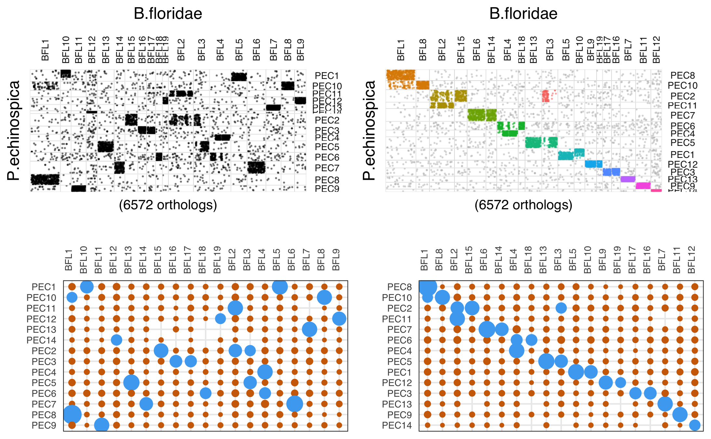
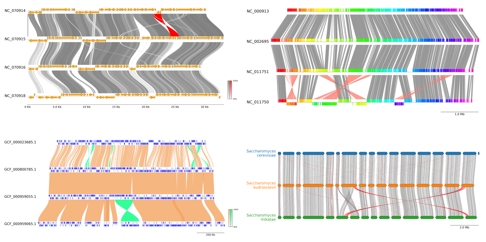
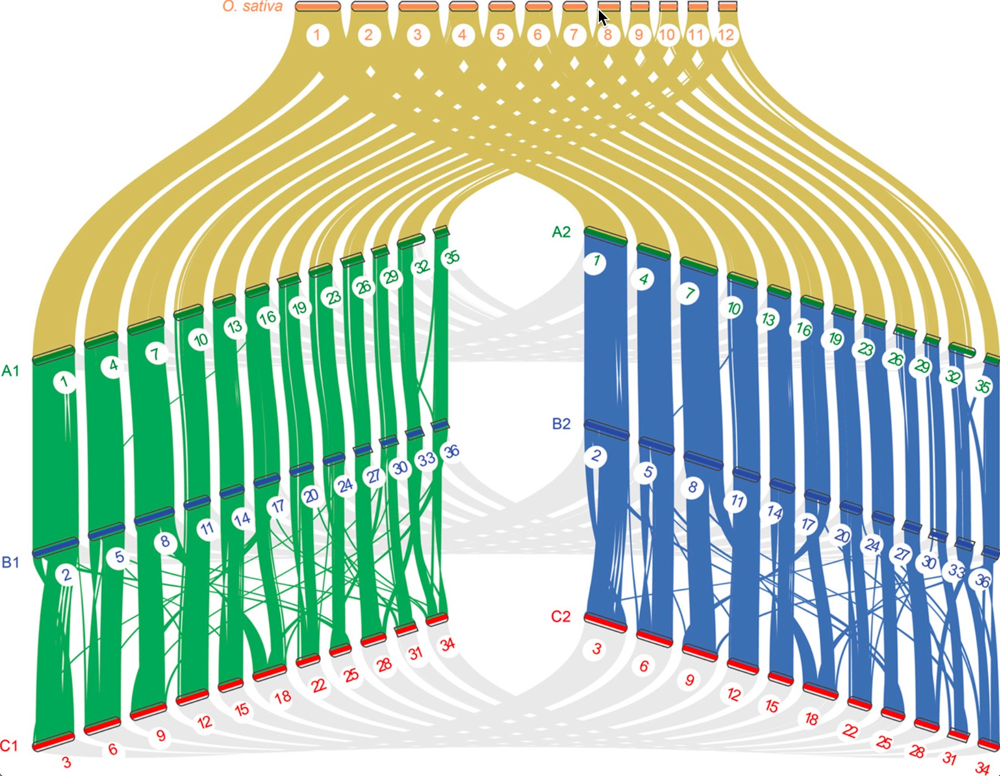

## Introduction

在基因组学研究中，比较基因组学（Comparative Genomics）是一项核心方法，它通过对不同物种或同一物种不同个体的基因组进行比较，揭示基因的功能、结构和进化历史。在这一领域中，“同线性（synteny）”和“共线性（collinearity）”是关键概念，它们在理解基因组结构的保守性和演化过程中起着重要作用。


在基因组比较中，“同线性”和“共线性”常被用来描述不同物种或同一物种不同个体之间基因组结构的保守性。同线性指的是在不同基因组中，一组同源基因位于各自染色体上的相似位置，而不考虑这些基因的排列顺序。共线性则进一步要求这些同源基因在染色体上的排列顺序也保持一致。简而言之，共线性是同线性的一种更严格形式。

根据同线性区域的大小和复杂性，研究人员将其分为“宏同线性（macrosynteny）”和“微同线性（microsynteny）”。宏同线性通常指染色体级别的大尺度保守区域，适用于研究远缘物种之间的基因组结构演化；而微同线性则关注较小的基因簇或基因对之间的保守性，常用于近缘物种或亚种之间的精细比较。

同线性分析在比较基因组学中具有广泛的应用价值：

- **揭示基因组进化历史**：通过识别同线性区域，可以推断物种间的基因组重排事件，如倒位、易位、重复和缺失等，从而重建基因组的进化轨迹。

- **识别同源基因**：同线性分析有助于区分直系同源基因（orthologs）和旁系同源基因（paralogs），这对于功能基因的注释和研究具有重要意义。

- **研究全基因组复制事件**：在植物等多倍体物种中，同线性分析可用于检测和分析全基因组复制（WGD）事件，理解基因组扩张与物种多样性的关系。

- **辅助基因功能预测**：通过比较模型生物与目标物种之间的同线性区域，可以推测未知基因的功能，尤其在缺乏实验验证的情况下尤为重要。

- **评估基因组组装质量**：同线性分析可以作为评估新组装基因组质量的工具，检测可能的组装错误或缺失区域。


随着高通量测序技术的发展，许多生物信息学工具被开发用于同线性分析和可视化，搜索一下就有一大堆，尤其是可视化工具，所以这里只简单提一下我知道的各种工具，大家可以根据喜好自行选择尝试使用。

## 分析软件

同线性分析涉及到全基因组比对，是一个计算密集型的过程。尽管各种软件在输入输出格式上有所差异，但它们的共同目标是识别基因组之间的同线性区块（syntenic blocks），即在不同基因组中保守的基因排列区域。

### MUMmer
<https://github.com/mummer4/mummer>

**简介**  
MUMmer 是一个用于快速比对大型序列的开源软件包。它能够高效地比对整个基因组、基因组组装结果以及部分（草图）基因组序列。MUMmer 的最新版本（4.x）引入了新的后缀树算法，进一步提高了比对效率。

**安装**  
MUMmer 可在其 GitHub 页面上获取

```bash
tar -zxvf mummer-4.0.0beta2.tar.gz
cd mummer-4.0.0beta2
./configure --prefix=/data/tengwenkai/software/MUMmer4.0
make
make install
```

或者conda安装：`conda install bioconda::mummer`

**简单使用**  
MUMmer 提供了多个实用工具，其中 `nucmer` 是最常用的比对脚本，用于标准的 DNA 序列比对。例如，使用 `nucmer` 对两个基因组进行比对后，可以使用 `show-coords` 工具查看比对坐标。此外，`promer` 工具可以基于输入序列的六帧翻译生成比对结果，适用于蛋白质序列的比对。

```bash
nucmer [options] <Reference> <Query>
Reference：参考基因组，含有多条序列的FASTA文件名
Query：要匹配的基因组，含有多条序列的FASTA文件名
    --mum, --mumreference(默认), --maxmatch：与mumer相同
    -b, --breaklen：一个比对尝试延伸的最大距离，默认为200
    -c, --mincluster：一个匹配聚类簇的最短长度，默认为65
    -D, --diagdiff：一个聚类中两个邻接匹配的最大对角差分，默认5
    -d, --diagfactor一个聚类中两个邻接匹配的最大对角差分与gap长度的比值，默认为0.12
    --noextend：不执行聚类簇延长步骤，默认关闭
    -f, --forward：只使用查询序列的正向链
    -g, --maxgap：一个聚类中两个邻接匹配的最大gap长度，默认为90
    -l, --minmatch：一个匹配的最短长度，默认为20
    -L, --minalign：一个聚类延伸后比对的最短长度，默认为0
    -r, --reverse：只使用查询序列的反向互补链
    --nosimplify：不简化比对，当使用序列与自身比对来寻找重复时可以选此选项，默认关闭
    -p, --prefix：输出结果delta文件的前缀，默认为out
    --sam-short：保存SAM短格式到文件路径
    --sam-long：保存SAM长格式到文件路径
    -t, --threads：程序运行使用的核数
```

```bash
# 使用MUMmer进行局部比对（适合低相似度基因组）
nucmer --prefix=out genome1.fna genome2.fna 
delta-filter -q -r out.delta > out.filtered.delta  # 保留唯一最佳比对
show-coords -rcl out.filtered.delta > out.coords   # 输出坐标
```

MUMmer 的高效性能使其成为进行全基因组比对和同线性分析的有力工具，尤其适用于处理大型基因组数据。

### MCScanX

<https://github.com/wyp1125/MCScanX>

**简介**  
MCScanX 是一个用于检测基因组间同线性和共线性关系的工具包。它实现了改进的 MCScan 算法，能够识别同线性区块，并提供多种可视化和分析工具。

**安装**  
MCScanX 可在其 GitHub 页面上获取，下载源代码并按照说明进行编译安装。

```bash
unzip MCscanX.zip
cd MCScanX
make
```

**简单使用**  
MCScanX 的使用需要两个主要输入文件：

1. **BLASTP 比对结果文件（`xyz.blast`）**  
   该文件为标准的 BLASTP 输出，格式为 m8。每行表示一对同源基因的比对结果，包含以下字段：
   ```
   gene1   gene2   identity   alignment_length   mismatches   gap_opens   q_start   q_end   s_start   s_end   e_value   bit_score
   ```
   示例：
   ```
   AT1G50920   AT1G50920    100.00  671     0       0       1       671     1       671     0.0     1316
   ```
   建议使用以下命令生成该文件：
   ```
   blastall -i query_file -d database -p blastp -e 1e-10 -b 5 -v 5 -m 8 -o xyz.blast
   ```
   其中，`-b 5 -v 5` 参数限制每个基因的比对结果为前 5 个，以提高分析的准确性。

2. **基因注释文件（`xyz.gff`）**  
   该文件包含基因在染色体上的位置信息，格式为制表符分隔的四列：
   ```
   chromosome   gene_id   start_position   end_position
   ```
   示例：
   ```
   at1   AT1G01010   3631   5899
   at1   AT1G01020   5928   8737
   ```
   注意事项：
   - `chromosome` 字段应使用两字母的物种缩写加染色体编号，例如 Arabidopsis thaliana 的第二染色体应为 `at2`。
   - 每个基因只能出现一次，重复的基因会导致错误。
   - 该文件可通过解析 GFF3 文件生成。

在进行多个基因组比较时，可将所有物种的 BLAST 输出合并为一个 `xyz.blast` 文件，所有基因注释信息合并为一个 `xyz.gff` 文件。

将 `xyz.blast` 和 `xyz.gff` 文件放在同一目录下，使用以下命令运行 MCScanX：
```
./MCScanX xyz
```

其中，`xyz` 为输入文件的前缀，MCScanX 将自动识别并处理对应的 `.blast` 和 `.gff` 文件。

输出结果解析

运行完成后，MCScanX 会生成以下主要输出：

1. **`xyz.collinearity` 文件**  
   该文本文件包含识别到的同线性区块信息，每个区块以 `## Alignment` 开头，包含区块编号、得分、e-value、基因对数量等信息。示例：
   ```
   ## Alignment 0: score=9171.0 e_value=0 N=187 at1&at1 plus
   0-0: AT1G17240 AT1G72300 0
   0-1: AT1G17290 AT1G72330 0
   ...
   0-186: AT1G22340 AT1G78270 3e-174
   ```
   每行表示一对共线性基因对，最后一列为比对的 e-value。

2. **`xyz.html` 目录**  
   该目录包含多个 HTML 文件，用于可视化同线性区块在染色体上的分布。每个 HTML 文件对应一个参考染色体，展示了该染色体上的基因及其与其他染色体的同线性关系。这些文件可通过网页浏览器查看，便于直观分析。

此外，MCScanX 提供了多种可视化工具，如 dot plot、circle plot 等，便于用户直观地观察基因组间的同线性关系。

### Mugsy

<https://github.com/kloetzl/mugsy>

**简介**  
Mugsy 是一个用于多个完整基因组比对的工具，特别适用于比对密切相关的基因组。它不需要参考基因组，能够处理混合的草图和完整基因组数据，识别包括重复、重排和大规模序列增减等在内的遗传变异。

**安装**  
Mugsy 可在其官方网站上获取

```bash
wget https://sourceforge.net/projects/mugsy/files/latest/download
tar xvzf download

#将Mugsy安装路径加到PATH里
vim ~/.bashrc
export PATH="/picb/evolgen/users/gushanshan/software/mugsy/mugsy_1.2.2:$PATH"
source ~/.bashrc
```

或者conda安装：`conda install bioconda::mugsy`

**简单使用**  
Mugsy 的输入为多组基因组序列（FASTA 格式）。文件要求：
- 一个或多个FASTA文件
- 每个文件应该包括单个物种的所有序列
- FASTA的header中不能包括：或-
- 模糊字符将被转换成N

使用示例命令：

```bash
./mugsy --directory output_dir genome1.fasta genome2.fasta genome3.fasta
```

运行后，Mugsy 会在指定的输出目录中生成多个文件，包括比对结果和同线性区块信息。这些结果可用于进一步的比较基因组分析。

## 可视化软件

可以用来画synteny图的软件就太多了，各种编程语言都有，还有很多在线网站，风格各异，这里推荐一些，可以根据demo效果或者整理input格式的难度挑选一下：

### R

我用来做可视化最多的工具还是R语言，所以优先介绍几个R包了：

#### gggenomes

<https://thackl.github.io/gggenomes/index.html>

gggenomes是用于比较基因组学的多功能图形包。基于ggplot的语法，非常好上手用，主页提供的demo代码也非常好看：

```r
library(gggenomes)

# to inspect the example data shipped with gggenomes
data(package="gggenomes")

gggenomes(
  genes = emale_genes, seqs = emale_seqs, links = emale_ava,
  feats = list(emale_tirs, ngaros=emale_ngaros, gc=emale_gc)) |> 
  add_sublinks(emale_prot_ava) |>
  sync() + # synchronize genome directions based on links
  geom_feat(position="identity", size=6) +
  geom_seq() +
  geom_link(data=links(2)) +
  geom_bin_label() +
  geom_gene(aes(fill=name)) +
  geom_gene_tag(aes(label=name), nudge_y=0.1, check_overlap = TRUE) +
  geom_feat(data=feats(ngaros), alpha=.3, size=10, position="identity") +
  geom_feat_note(aes(label="Ngaro-transposon"), data=feats(ngaros),
      nudge_y=.1, vjust=0) +
  geom_wiggle(aes(z=score, linetype="GC-content"), feats(gc),
      fill="lavenderblush4", position=position_nudge(y=-.2), height = .2) +
  scale_fill_brewer("Genes", palette="Dark2", na.value="cornsilk3")
```


#### syntenyPlotteR

<https://github.com/Farre-lab/syntenyPlotteR>

这个包也是用ggplot画的，但是不是ggplot语法，draw.linear函数输出包含线性样式对齐的图像文件。默认情况下，该函数将文件保存到临时目录，可以使用目录参数（即Directory ="path/to/to/Directory"）覆盖。

```r
library(syntenyPlotteR)
old_wd=getwd()
setwd(system.file("extdata",package = "syntenyPlotteR"))
# example data
draw.linear("example_linear", "example_lengths.txt", "example_alignment_1.txt", "example_alignment_2.txt", "example_alignment_3.txt")
setwd(old_wd)
```


#### macrosyntR

<https://github.com/SamiLhll/macrosyntR>

这是一个用于在全基因组范围内评估同线性保守性的R软件包。它通过读取正交同源基因表和BED格式的基因组注释文件，自动识别显著保守的连锁群，并基于网络贪婪算法将这些连锁群排序展示在牛津网格图或弦图中。

**准备输入数据**  
要开始比较物种，您需要准备以下两类文件：  

1. 正交同源基因表（两列格式）  
   • 包含待比较物种之间的正交同源基因对（每行一对）。  
   • 可通过工具生成，例如：  
     ◦ `rbhxpress` 的输出结果  
     ◦ `OrthoFinder` 的结果

2. BED 格式的基因组注释文件  
   • 列出所有物种的正交同源基因的基因组坐标和序列名称。  
   • 关键要求：  
     ◦ BED 文件中的基因名称必须与正交同源基因表（文件1）的列名匹配。  

```r
library(macrosyntR)

# Load table of orthologs and integrate with genomic coordinates :
my_orthologs_table <- load_orthologs(orthologs_table = system.file("extdata","Bflo_vs_Pech.tab",package="macrosyntR"),
                                     bedfiles = c(system.file("extdata","Bflo.bed",package="macrosyntR"),
                                     system.file("extdata","Pech.bed",package="macrosyntR")))

# Draw an oxford grid :
p1 <- plot_oxford_grid(my_orthologs,
                       sp1_label = "B.floridae",
                       sp2_label = "P.echinospica")
p1

# Automatically reorder the Oxford grid and color the detected clusters (communities):
p2 <- plot_oxford_grid(my_orthologs,
                       sp1_label = "B.floridae",
                       sp2_label = "P.echinospica",
                       reorder = TRUE,
                       color_by = "clust")
p2

# Plot the significant linkage groups :
my_macrosynteny <- compute_macrosynteny(my_orthologs)
p3 <- plot_macrosynteny(my_macrosynteny)
p3


# Call the reordering function, test significance and plot it :
my_orthologs_reordered <- reorder_macrosynteny(my_orthologs)
my_macrosynteny <- compute_macrosynteny(my_orthologs_reordered)
p4 <- plot_macrosynteny(my_macrosynteny)
p4
```



```r
# load data 
my_orthologs_with_3_sp <- load_orthologs(orthologs_table = system.file("extdata","Single_copy_orthologs.tsv",package="macrosyntR"),
                                     bedfiles = c(system.file("extdata","Bflo.bed",package="macrosyntR"),
                                                  system.file("extdata","Pech.bed",package="macrosyntR"),
                                                  system.file("extdata","Pyes.bed",package="macrosyntR")))

# Change the chromosome names to keep only numbers
levels(my_orthologs_with_3_sp$sp1.Chr) <- stringr::str_replace(levels(my_orthologs_with_3_sp$sp1.Chr),"BFL","")
levels(my_orthologs_with_3_sp$sp2.Chr) <- stringr::str_replace(levels(my_orthologs_with_3_sp$sp2.Chr),"PEC","")
levels(my_orthologs_with_3_sp$sp3.Chr) <- stringr::str_replace(levels(my_orthologs_with_3_sp$sp3.Chr),"chr","")

# Plot an automatically ordered chord diagram colored by the linkage groups :
plot_chord_diagram(my_orthologs_with_3_sp,
                   species_labels = c("B. flo","P. ech", "P. yes"),
                   color_by = "LGs") +
  theme(legend.position = "none")

# The linkage groups were automatically computed but you can also get them as a table using :
my_linkage_groups <- compute_linkage_groups(my_orthologs_with_3_sp)
```


### Python

#### plotsr

<https://github.com/schneebergerlab/plotsr>

Plotsr使用了多个染色体级组件之间的基因组结构注释来产生多个基因组之间同义和结构重排的高质量可视化：


示例里面用了minimap2对齐基因组，并使用SamTools索引对齐BAM文件，然后用Syri在基因组之间找到同线性和结构重排，最后用Plotsr做可视化。

#### JCVI

<https://github.com/tanghaibao/jcvi>

JCVI 库是一个基于 Python 的多功能工具库，发在了imeta上面，其模块化设计提供了一系列高效工具，涵盖以下核心功能：  

1. 格式解析与数据操作  
2. 可视化与图形生成  
3. 基因组算法支持  
4. 开发与维护理念  
   
我们关注其synteny图的可视化：


#### pyGenomeViz

<https://github.com/moshi4/pyGenomeViz>

pyGenomeViz 是一款基于 matplotlib 开发的 Python 基因组可视化工具包，专注于 比较基因组学 分析。该工具旨在以简洁美观的方式绘制 多基因组间的特征比对 和 序列相似性关联。  

• 支持输入格式：Genbank / GFF 格式文件  
• 输出格式灵活：可保存为 JPG、PNG、SVG、PDF 或 HTML  
• 交互式可视化：在 Jupyter Notebook 中动态调整与查看  
• 自动化分析集成：可嵌入基因组分析脚本或工作流，实现批量绘图  
（适用于 基因组共线性分析、基因簇比较 和 进化研究 等场景。）

这个工具主页的介绍也非常详细，可以一步一步学习



### Perl

#### circos

<https://circos.ca/>

鼎鼎大名的circos，这个值得有空单独介绍了，能画出来的图很夸张。


网上的教程也非常多，可以跟着官方教程仔细学一遍：<https://circos.ca/support/getting_started/>。
我们可以通过修改配置文件一步一步的画出自己想要的图。


#### GenomeSyn

<https://github.com/jmsong2/GenomeSyn>

这个软件内置了MUMmer帮忙跑分析，属于是一键出图了，我们也可以自己跑MUMmer筛选位点，出的图效果也不错，但主页说的在线服务已经没有了。

```bash
GenomeSyn -t 3 -g1 rice_MH63.fa -g2 rice_ZS97.fa -cf1 rice_MH63vsZS97.delta.filter.coords 
GenomeSyn -t 3 -g1 ../data/rice_MH63.fa -g2 ../data/rice_ZS97.fa -cf1
	../data/rice_MH63vsZS97.delta.filter.coords
```


#### NGenomeSyn

<https://github.com/hewm2008/NGenomeSyn>

NGenomeSyn是于基于多个基因组共线性关系的可视工具，该软件可以添加多个基因组一起进行分析绘图（可超过12个），各基因组顺序可以自由定制以及添加特殊属性。绘图效果规律鲜明，结果易于呈现出各类共线性，大尺度变异，细部标识特殊基因区域等。

这里放两个展示其特点的例子：




### 在线网站

能实现这类可视化的在线网站也有非常多，有些是生物公司的云平台需要注册一下，我这里提几个免费且无需注册的网站：

- pyGenomeViz：<https://pygenomeviz.streamlit.app/> ，简单功能实现
- chiplot：<https://www.chiplot.online/McScanX_synteny_plot.html> ，国产，直接接上McScanX结果可视化
- SynVisio：<https://synvisio.github.io/#/> ，直接接上McScanX结果可视化，各种展示形式
- shinyCircos：<https://venyao.xyz/shinyCircos/> ，画环形弦图的，觉得circos难用可以试试
- ...

## References
1. https://thisvsthat.io/collinearity-vs-synteny
2. Dewey, C.N. (2019). Whole-Genome Alignment. In: Anisimova, M. (eds) Evolutionary Genomics. Methods in Molecular Biology, vol 1910. Humana, New York, NY. https://doi.org/10.1007/978-1-4939-9074-0_4