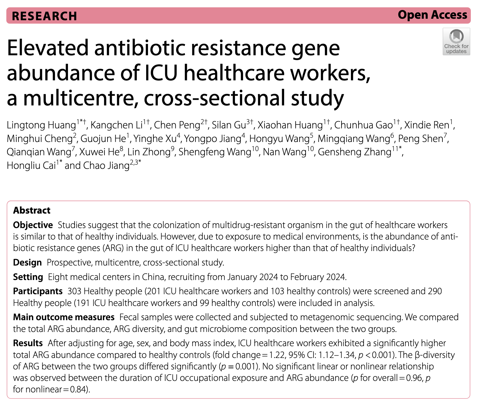
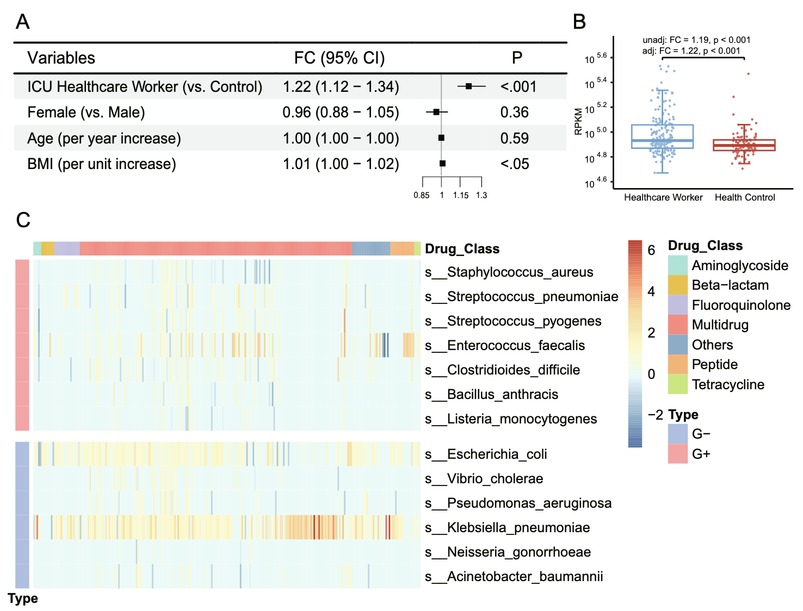
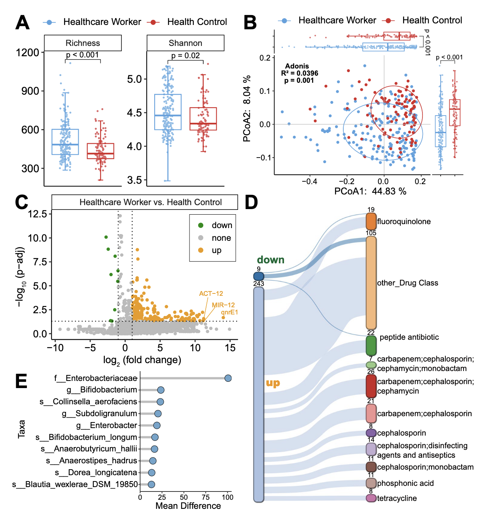
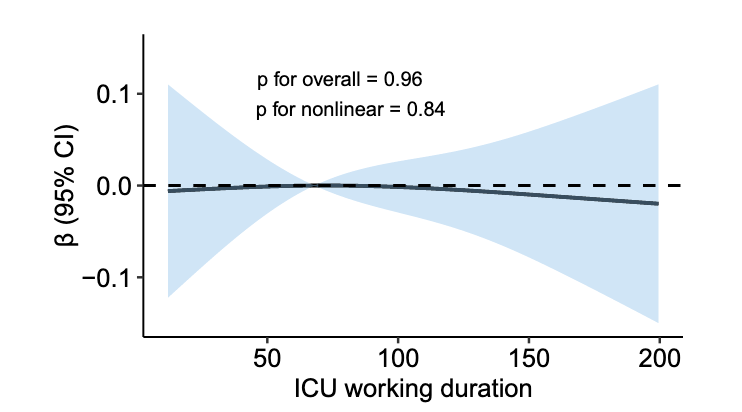
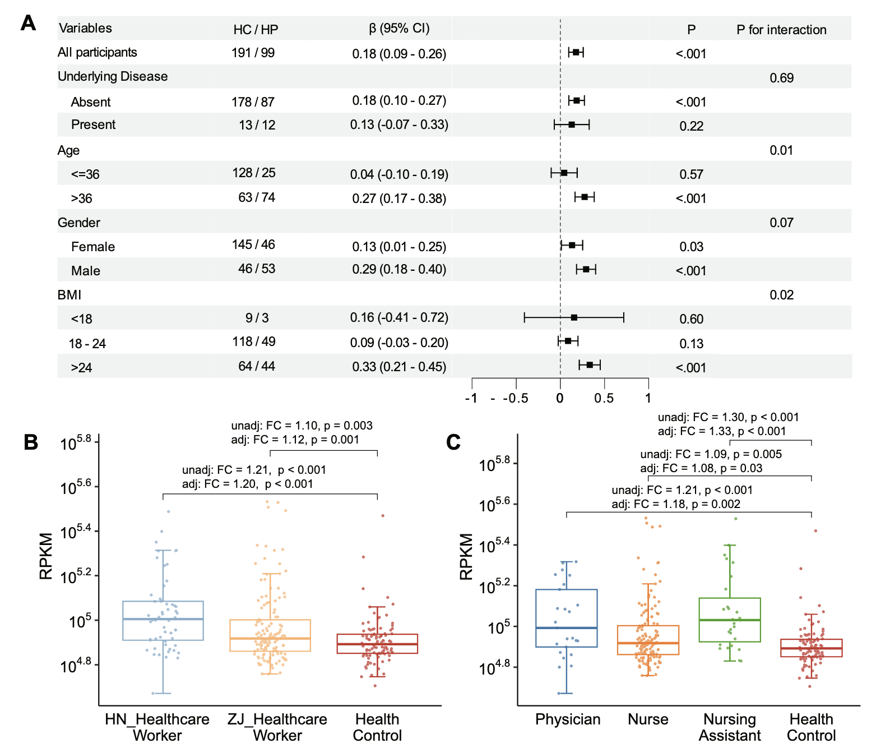

抗生素耐药性（Antimicrobial Resistance, AMR）是21世纪全球公共卫生面临的重大挑战之一。随着抗生素的广泛使用，耐药菌株和抗生素耐药基因（Antibiotic Resistance Genes, ARGs）在医院环境中迅速扩散，尤其是在重症监护病房（ICU）这样高风险的医疗场所。ICU医护人员因长期暴露于高浓度抗生素和耐药菌的环境中，其肠道微生物群是否受到显著影响，成为一个备受关注的研究课题。2025年发表在《Critical Care》期刊上的一篇多中心、跨区域研究通过宏基因组学技术，系统比较了ICU医护人员与健康对照组的肠道ARG丰度及微生物群组成，揭示了ICU医护人员肠道ARG显著升高的现象。

## Paper Info



- 标题：Elevated antibiotic resistance gene abundance of ICU healthcare workers, a multicentre, cross-sectional study
- 译名：多中心横断面研究揭示ICU医护人员抗生素耐药基因丰度升高
- 期刊：Critical Care (IF：8.8)
- 发表时间：2025年4月30日
- 链接：<https://doi.org/10.1186/s13054-025-05408-5>


## 引言

抗生素耐药性被世界卫生组织列为全球十大公共卫生威胁之一。据《Lancet》2024年报道，1990年至2021年间，全球因AMR导致的死亡人数持续上升，预计未来几十年将进一步加剧。医院作为抗生素使用最密集的场所，是ARG传播的主要来源。ICU尤为突出，因其患者病情危重、抗生素使用频繁、耐药菌（如ESKAPE病原体：粪肠球菌、肺炎克雷伯菌等）高发，导致环境中的ARG浓度远高于外部环境。

ICU医护人员每天接触高危患者、污染表面及空气中的耐药菌，面临较高的职业暴露风险。先前的研究表明，医护人员可能通过直接接触、空气传播或交叉污染成为耐药菌的携带者。然而，传统研究多依赖细菌培养技术，样本量小，难以全面揭示ARG的传播动态。宏基因组学技术的兴起为研究ARG提供了更精确的工具，使研究人员能够深入分析医护人员肠道微生物群的耐药基因特征。

该研究提出一个核心问题：ICU医护人员的肠道ARG丰度是否高于健康人群？此外，ICU职业暴露的时长是否与ARG丰度相关？通过多中心、跨区域的样本采集和宏基因组学分析，研究旨在填补这一领域的知识空白，为医院感染防控提供科学依据。

## 研究设计与方法

这项前瞻性、多中心、横断面研究在中国浙江和河南的八家医疗中心开展，时间为2024年1月至2月。研究对象包括191名ICU医护人员（医生、护士、护理助理）和99名健康对照组，共290人。健康对照组来自常规体检人群，无医疗相关工作背景。研究通过粪便样本的宏基因组测序，比较两组的肠道ARG丰度、ARG多样性及微生物群组成。

- **纳入标准**：年龄大于18岁，签署知情同意书。
- **排除标准**：存在胃肠道疾病、恶性肿瘤、精神疾病；近6个月使用广谱抗生素（如万古霉素、头孢吡肟等）；孕妇；健康对照组需无医疗相关工作经历。

研究团队收集粪便样本，提取DNA后使用Illumina NovaSeq X Plus平台进行双末端测序（2×150 bp）。通过Fastp去除低质量读数，Bowtie2过滤人类基因组序列，Kraken2进行分类学分析，RGI结合CARD数据库识别ARG。ARG丰度以每千碱基每百万映射读数（RPKM）标准化，ARG丰富度以识别的ARG总数量化。研究还通过Kraken2和RGI的读数ID匹配，追踪ARG的细菌宿主。

主要结局为比较ICU医护人员与健康对照组的ARG丰度（以RPKM为指标）。使用广义线性模型（GLM）进行分析，矫正了年龄、性别和BMI等混杂因素。次要结局为探索ICU职业暴露时长与ARG丰度的关系，使用限制性立方样条（RCS）模型。亚组分析和敏感性分析进一步验证结果的稳健性，分析工具包括R软件及其相关包（如pctax、rms）。

## 结果

### ICU医护人员肠道ARG丰度显著升高



研究发现，ICU医护人员的总ARG丰度显著高于健康对照组（调整后倍数变化=1.22，95%置信区间：1.12-1.34，p<0.001）。具体而言，来源于粪肠球菌、肺炎克雷伯菌和肠杆菌属（包括大肠杆菌）的ARG丰度在医护人员中显著增加。特别值得注意的是，与喹诺酮类抗生素耐药相关的qnrE1基因（log2倍数变化=14.03，p-adj=0.02）以及与β-内酰胺类抗生素耐药相关的ACT-12（log2倍数变化=11.23，p-adj=0.03）和MIR-12（log2倍数变化=11.17，p-adj=0.04）基因在医护人员中显著上调。

### ARG多样性与微生物群组成差异



ICU医护人员的ARG α多样性（丰富度和Shannon指数）显著高于对照组（p<0.001，p=0.02），β多样性也存在显著差异（Adonis R²=0.0396，p=0.001）。243个ARG在医护人员中显著上调，而仅9个ARG下调。此外，医护人员的肠道细菌组成显示出更高的α多样性（p=0.04）和β多样性（Adonis R²=0.0419，p=0.001），其中克雷伯菌属（如Klebsiella grimontii，log2倍数变化=5.93，p-adj=0.004）和乳酸乳球菌（log2倍数变化=5.78，p-adj=0.009）显著上调。

### 职业暴露时长与ARG丰度无关



出乎意料的是，研究未发现ICU职业暴露时长与ARG丰度之间的显著线性或非线性关系（p for overall=0.96，p for nonlinear=0.84）。这表明ARG丰度的增加可能在医护人员职业生涯的早期即已发生。

### 4. 亚组与敏感性分析



- **性别差异**：男性医护人员的ARG丰度与职业暴露的关联更强（β=0.29，p<0.001）相比女性（β=0.13，p=0.03）。
- **地区差异**：河南的医护人员ARG丰度高于浙江（倍数变化=1.20 vs. 1.12）。
- **职业差异**：护理助理的ARG丰度最高（倍数变化=1.33），其次为医生（1.18）和护士（1.08）。

## 讨论

### 临床意义

1. **感染防控的新视角**：ICU医护人员作为潜在的ARG携带者，可能在医院内外的耐药菌传播中扮演重要角色。研究提示需加强对医护人员的感染防控措施，如优化手部卫生、加强环境消毒。
2. **精准医疗的潜力**：宏基因组学技术为监测ARG提供了高分辨率工具，可用于识别高风险人群和制定针对性的干预措施。
3. **职业健康保障**：医护人员肠道微生物群的变化可能影响其长期健康，需进一步研究这些变化的临床意义。

### 公共卫生意义

研究结果支持“One Health”框架，强调人类、动物和环境健康的互联性。医院作为ARG的“热点”，其防控策略应扩展到医护人员和社区。减少不必要的抗生素使用、加强耐药性监测是应对AMR的关键。

### 局限性

1. **地域局限**：研究仅限于中国人群，结论的普遍性需进一步验证。
2. **因果关系**：作为观察性研究，无法确定职业暴露与ARG升高之间的因果关系。
3. **未测混杂因素**：如旅行史、住院史等可能影响结果。
4. **临床相关性**：ARG的升高是否导致实际感染风险尚不明确。

### 未来研究方向

1. **纵向研究**：通过长期随访，探索ARG丰度变化的动态和影响因素。
2. **全球合作**：开展跨国研究，验证不同地区医护人员的ARG特征。
3. **干预措施**：测试感染防控策略（如益生菌干预、环境净化）对ARG丰度的影响。
4. **健康影响**：研究ARG升高对医护人员健康的潜在影响，如免疫功能或代谢疾病风险。

## 小结

这项多中心研究揭示了ICU医护人员肠道ARG丰度和微生物群多样性的显著升高，提示职业暴露可能是重要驱动因素。尽管未发现暴露时长与ARG丰度的直接关联，但研究强调了医院环境在耐药基因传播中的关键作用。宏基因组学技术的应用为理解AMR动态提供了新视角，未来需进一步探索其临床和公共卫生意义，以优化感染防控策略，保护医护人员和患者的健康。

## CARD数据库中药物类型整理

为了方便分析，我整合了CARD数据库的描述信息到ReporterScore包中，可以通过以下代码调取：


```r
if(!require(ReporterScore))remotes::install_github("Asa12138/ReporterScore")
library(ReporterScore)
CARDinfo <- load_CARDinfo()
head(CARDinfo$ARO_index)
```

```
##         ARO Accession CVTERM ID Model Sequence ID Model ID
## 3005099   ARO:3005099     43314              6143     3831
## 3002523   ARO:3002523     38923              8144     1781
## 3002524   ARO:3002524     38924                85      746
## 3002525   ARO:3002525     38925              4719     1246
## 3002526   ARO:3002526     38926               228     1415
## 3002527   ARO:3002527     38927              5510     2832
##                                                     Model Name
## 3005099 23S rRNA (adenine(2058)-N(6))-methyltransferase Erm(A)
## 3002523                                             AAC(2')-Ia
## 3002524                                             AAC(2')-Ib
## 3002525                                             AAC(2')-Ic
## 3002526                                             AAC(2')-Id
## 3002527                                             AAC(2')-Ie
##                                                       ARO Name
## 3005099 23S rRNA (adenine(2058)-N(6))-methyltransferase Erm(A)
## 3002523                                             AAC(2')-Ia
## 3002524                                             AAC(2')-Ib
## 3002525                                             AAC(2')-Ic
## 3002526                                             AAC(2')-Id
## 3002527                                             AAC(2')-Ie
##         Protein Accession DNA Accession                         AMR Gene Family
## 3005099        AAB60941.1    AF002716.1 Erm 23S ribosomal RNA methyltransferase
## 3002523        AAA03550.1      L06156.2                                 AAC(2')
## 3002524        AAC44793.1      U41471.1                                 AAC(2')
## 3002525        CCP42991.1    AL123456.3                                 AAC(2')
## 3002526        AAB41701.1      U72743.1                                 AAC(2')
## 3002527        CAC32082.1    AL583926.1                                 AAC(2')
##                                                                   Drug Class
## 3005099 lincosamide antibiotic;macrolide antibiotic;streptogramin antibiotic
## 3002523                                            aminoglycoside antibiotic
## 3002524                                            aminoglycoside antibiotic
## 3002525                                            aminoglycoside antibiotic
## 3002526                                            aminoglycoside antibiotic
## 3002527                                            aminoglycoside antibiotic
##                 Resistance Mechanism CARD Short Name length     Drug_Class
## 3005099 antibiotic target alteration  Spyo_ErmA_MLSb    732            MLS
## 3002523      antibiotic inactivation      AAC(2')-Ia    537 Aminoglycoside
## 3002524      antibiotic inactivation      AAC(2')-Ib    588 Aminoglycoside
## 3002525      antibiotic inactivation      AAC(2')-Ic    546 Aminoglycoside
## 3002526      antibiotic inactivation      AAC(2')-Id    633 Aminoglycoside
## 3002527      antibiotic inactivation      AAC(2')-Ie    549 Aminoglycoside
```

注意CARD数据库中Drug Class，一个ARO可以对应很多种药物类型，不是很方便整合，所以我根据《Assessment of global health risk of antibiotic resistance genes》中的规则新增了一列“Drug_Class”。

>ARGs were manually reclassified based on the drugs to which they confer resistance. ARGs referring to penam, cephalosporin, carbapenem, cephamycin, penem and monobactam were grouped into the beta-lactam class. ARGs referring to macrolides, lincosamides and streptogramins were grouped into the MLS class. ARGs referring to more than one drug class were grouped into the multidrug class.


```r
library(pcutils)
gghuan(dplyr::count(CARDinfo$ARO_index,Drug_Class))+
    scale_fill_pc()
```

}}index.en_files/figure-html/unnamed-chunk-2-1.png" width="672" />


