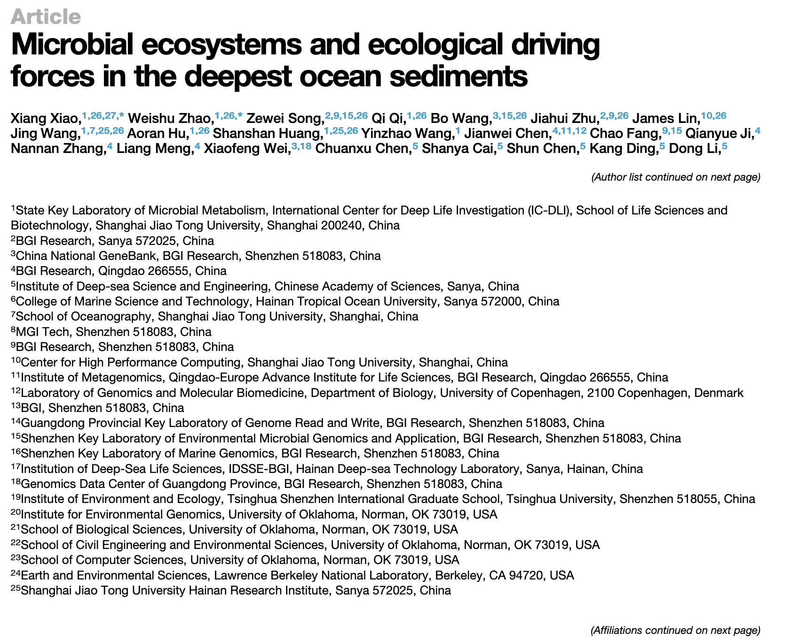
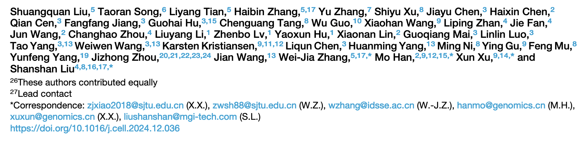
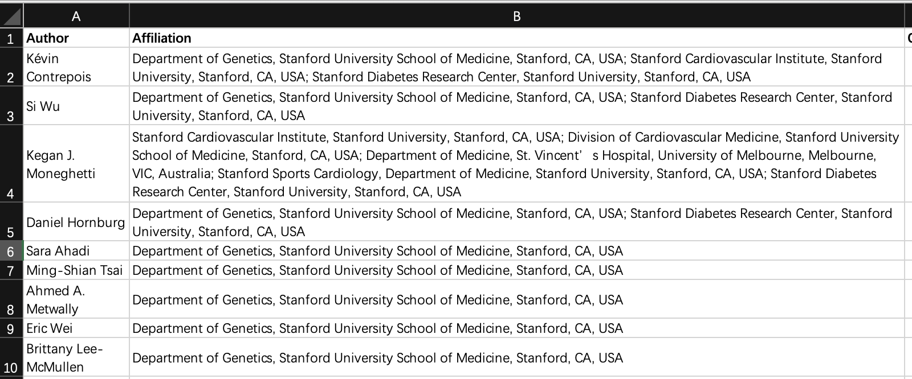
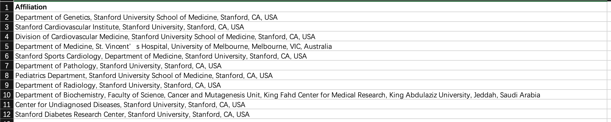
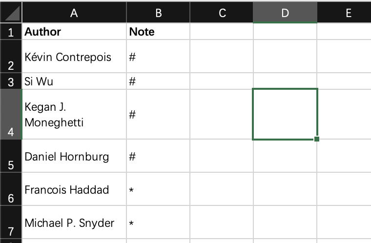
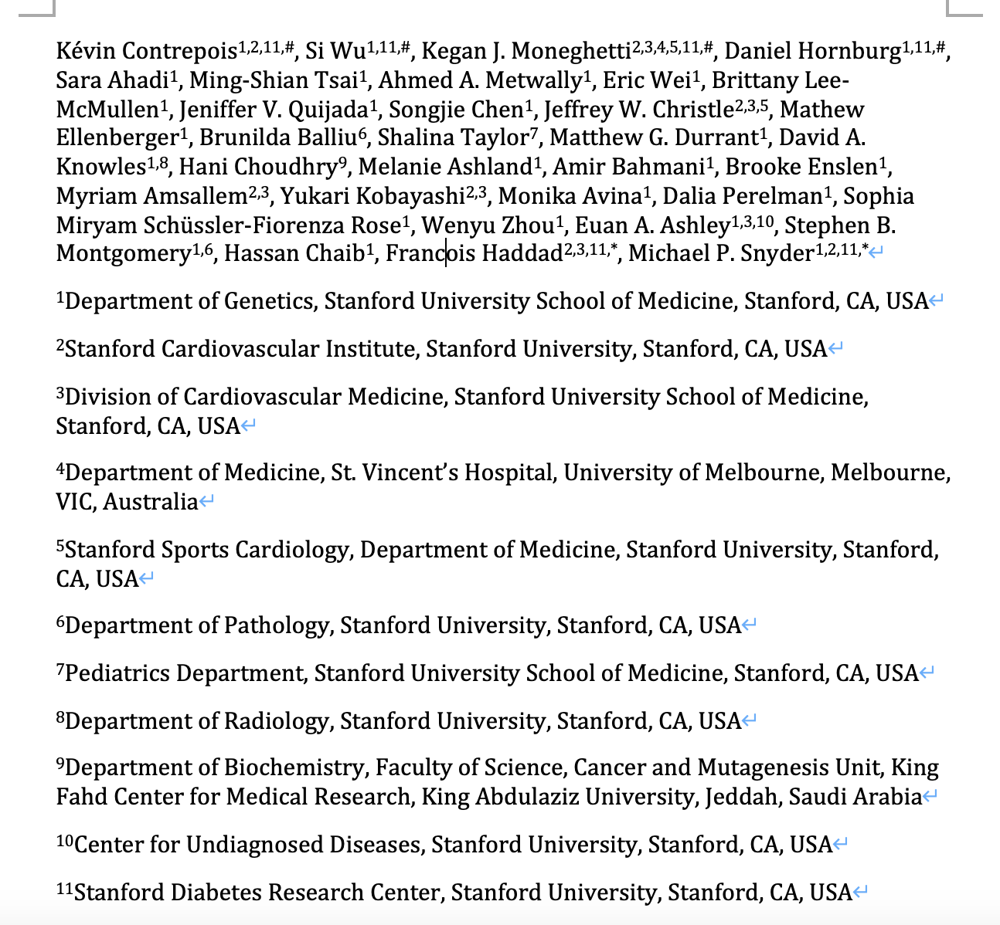
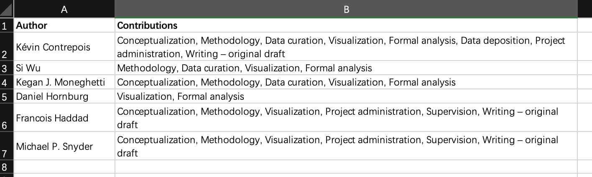

## Motivation

SCI论文投稿时，我们要整理好作者和对应的单位，一般用数字上标对应下面的单位信息，然后用一些特殊符号如“#，*”来代表贡献相同的作者或者通讯作者。

一般一个课题组出来的成果，只有几个作者的情况我们手打一下就好了。但现在的研究更多都是交叉性质的，可能会涉及到很多课题组合作，一些大的研究可能还会有几十个作者和单位，比如下面一篇cell，一页纸都写不完。




一次手打完，不改了就还好，**但这时老师叫你把某个单位顺序改一下，或者新加了个作者和单位，那么上面所有的数字上标都要随之改变，改起来就比较费劲了，还容易出错😂。**

所以我简单写了一个R函数，实现从整理好的作者-单位表格中自动生成符合规范的作者-单位 Rmarkdown文件，然后点击一下knit就可以生成对应的word文件，上标也不需要自己手动设置。如果需要改顺序也是在表格中调整一下重新生成即可，还是比较方便的。

### 作者-单位

拿一篇cell文章《Molecular Choreography of Acute Exercise》做例子。

准备一个表格，至少包含两列列名为Author和Affiliation，注意这里的作者顺序就是文章里想要的顺序，默认的单位顺序是根据作者顺位生成的：


如果要指定单位的顺序，那就再准备一列Affiliation的表格，保持想要的单位顺序：


如果还要添加额外的符号上标，如共一的#和通讯的*，再准备一个两列表格，Author和Note：


```{r eval=FALSE}
# 安装最新版的pcutils
# devtools::install_github("Asa12138/pcutils")
library(pcutils)
df=readxl::read_excel("~/Desktop/test_author.xlsx")
pcutils::generate_and_write_author_rmd(df,file = "~/Desktop/test_author.rmd")

# 如果要指定单位的顺序
affiliation_df=readxl::read_excel("~/Desktop/test_author.xlsx",sheet = 2)
pcutils::generate_and_write_author_rmd(df,file = "~/Desktop/test_author.rmd",
                                       affiliation_df = affiliation_df)

#如果要添加额外的符号上标
author_note=readxl::read_excel("~/Desktop/test_author.xlsx",sheet = 3)
pcutils::generate_and_write_author_rmd(df,file = "~/Desktop/test_author.rmd",
                                       affiliation_df = affiliation_df,
                                       author_note = author_note)
```

此时会输出一个test_author.rmd的文件，然后我们用Rstudio打开后点一下knit键进行编织，就可以得到word文件了：



上标格式也不用自己麻烦一个一个点了，如果要修改顺序也比较方便。

### 作者贡献

CRediT（贡献者角色分类法）是一种高级分类法，该方法将作者的贡献划分为14个类别，并对每个类别的角色详细精确地定义了作者的贡献。

```{r echo=FALSE}
df=tibble::tribble(
       ~`贡献者角色（中文）`,                ~`贡献者角色（英文）`,                                                       ~定义,
             "论文构思",         "Conceptualization",                                    "产生想法，构造或演绎发展主要的研究目的。",
             "数据管理",             "Data curation",                  "为数据的首用和后续复用产生元数据，整理数据，维护研究数据（包括软件或程序）。",
             "形式分析",           "Formal analysis",                           "使用统计、数学、计算或其他形式分析技术分析或合成研究数据。",
             "获取资助",       "Funding acquisition",                                  "为了项目研究成果能够发表而去争取并获得资助。",
             "调查研究",             "Investigation",                          "实施研究和执行调查过程，特别是从事实验研究或收集数据和证据。",
              "方法论",               "Methodology",                                       "开发或设计研究用的方法，建立模型。",
             "项目管理",    "Project administration",                                     "为研究活动的策划和执行进行管理和协调。",
             "提供资源",                 "Resources",                 "提供研究材料、试剂、病例、实验室样品、动物、仪器、计算设备资源或其他分析工具。",
               "软件",                  "Software",                 "编程，研发软件，设计计算机程序，实施执行计算机程序及支持算法，测试已有的程序。",
               "指导",               "Supervision",                       "监督和领导研究活动的策划和执行，包括对核心成员以外的人员进行指导。",
               "验证",                "Validation",            "对研究结果、实验或其他研究输出内容的复制和重现进行核实验证，包括整体的和部分的核实验证。",
            "可视化呈现",             "Visualization",                        "对发表的内容进行准备、创建或表述，特别是内容或数据的可视化展现。",
             "初稿写作",  "Writing – original draft",                       "对发表的内容进行准备、创建或表述，特别是撰写初稿，包括实质性翻译。",
          "审核与编辑写作", "Writing – review & editing", "对原始研究团队提出的发表内容进行准备、创建或表述，特别是评论、注释或修改，包括发表前和发表后所发生的这些工作。"
       )
suppressWarnings(kableExtra::kbl(df,format = "pipe")) 
```

很多期刊都会让我们以CRediT的格式展示作者贡献，一般手打也很方便。但有时候会统一将名称进行缩写，这里也提供一个函数用来生成，准备一个两列表：



```{r}
author_contributions=readxl::read_excel("~/Desktop/test_author.xlsx",sheet = 4)
cat(pcutils::format_credit_contributions(author_contributions, short_name = TRUE))
```
