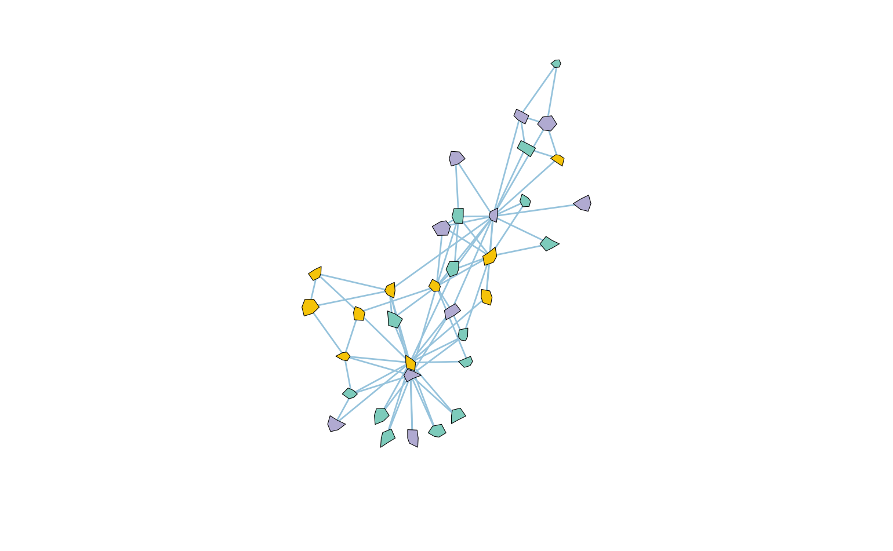

```{r include=FALSE}
devtools::load_all("~/Documents/R/pcutils/")
devtools::load_all("~/Documents/R/MetaNet/MetaNet/")
data(otutab, package = "pcutils")
Packages <- c("dplyr", "pcutils", "kableExtra")
pcutils::lib_ps(Packages)
knitr::opts_chunk$set(message = FALSE,warning = FALSE,eval = TRUE, fig.width=8,fig.height=5)
```

MetaNet默认使用的是`igraph`的绘图系统，其中自带的节点形状是非常有限的，只有`circle`、`square`、`csquare`、`rectangle`、`crectangle`、`vrectangle`、`pie`、`none`这几种形状，MetaNet在此基础上添加了更多常用形状，并且可以根据本文方法添加自定义形状。

- 软件主页：<https://github.com/Asa12138/MetaNet> **大家可以帮忙在github上点点star⭐️**，谢谢🙏
- 详细英文版教程：<https://bookdown.org/Asa12138/metanet_book>

可以从 CRAN 安装稳定版：`install.packages("MetaNet")`  

最新的开发版本可以在 <https://github.com/Asa12138/MetaNet> 中找到：

```r
remotes::install_github("Asa12138/MetaNet", dependencies = T)
```


## igraph节点形状

```{r}
library(igraph)
# all vertex shapes, minus "raster", that might not be available
# 默认只有以下这些
shapes <- c("circle","crectangle","csquare","none","pie","raster","rectangle","sphere","square","vrectangle")
g <- make_ring(length(shapes))
set.seed(42)
plot(g,
  vertex.shape = shapes, vertex.label = shapes, vertex.label.dist = 1,
  vertex.size = 15, vertex.size2 = 15,
  vertex.pie = lapply(shapes, function(x) if (x == "pie") 2:6 else 0),
  vertex.pie.color = list(heat.colors(5))
)
```

可以看到`csquare`、`rectangle`、`crectangle`、`vrectangle`等形状都是矩形的变种，主要是线的连接方式不同，有时候是难以区分的。

sphere是一个三维的球体，还是很好看的，可以模拟STRING 数据库的节点形状。

```{r}
g<-make_graph("Zachary")
plot(g, vertex.shape = "sphere", vertex.label = NA,
  vertex.size = 18, vertex.color= pcutils::get_cols(4)
)
```


## MetaNet节点形状

MetaNet在igraph的基础上添加了更多的形状，主要是`diamond`、`triangle1`、`triangle2`、`star`、`polygon`等形状。

MetaNet的形状默认是跟v_group变量绑定的（查看之前的推文 [3.网络注释与操作](../metanet-3)），所以当设定了多个大分组时，需要一些易于区分的形状来区分不同的组。

默认的形状分配是c("circle","square","diamond","triangle1","triangle2")

```{r}
library(MetaNet)
# 给一些v_group
V(g)$v_group <- sample(paste0("Group",1:5), vcount(g), replace = TRUE)
V(g)$v_class <- sample(letters[1:3], vcount(g), replace = TRUE)
as.metanet(g)->g2
c_net_plot(g2,vertex.color= pcutils::get_cols(4))
```

也可以指定`star`、`ploygon`等形状。 

```{r}
c_net_plot(g2,vertex.color= pcutils::get_cols(4),
           vertex.shape=c("star","polygon"),vertex.norays=5,
           legend = F)
```
`star`、`ploygon`两种形状可以指定边数，vertex.norays参数可以指定边数，默认是5角星和5边形。

```{r}
c_net_plot(g2,vertex.color= pcutils::get_cols(4),
           vertex.shape=c("star","polygon"),
           vertex.norays=sample(4:7,vcount(g2), replace = TRUE),legend = F)
```


## 添加自定义形状

`add_shape` 可用于向igraph/MetaNet添加新的顶点形状，提供新形状的剪切和打印功能即可。也可以在参数中列出剪裁和/或绘图函数可以使用的绘图/顶点/边参数。

拿上述的star做一个例子，构建以下add_metanet_shape_star函数，并运行后，就可以添加上述的star形状了，并且支持color，size，frame.color等参数的修改。

```{r eval=FALSE}
add_metanet_shape_star <- function() {
  mystar <- function(coords, v = NULL, params) {
    vertex.color <- params("vertex", "color")
    if (length(vertex.color) != 1 && !is.null(v)) {
      vertex.color <- vertex.color[v]
    }
    vertex.frame.color <- params("vertex", "frame.color")
    if (length(vertex.frame.color) != 1 && !is.null(v)) {
      vertex.frame.color <- vertex.frame.color[v]
    }
    vertex.frame.width <- params("vertex", "frame.width")
    if (length(vertex.frame.width) != 1 && !is.null(v)) {
      vertex.frame.width <- vertex.frame.width[v]
    }
    vertex.size <- 1 / 150 * params("vertex", "size")
    if (length(vertex.size) != 1 && !is.null(v)) {
      vertex.size <- vertex.size[v]
    }
    norays <- params("vertex", "norays")
    if (is.null(norays)) norays=5
    if (length(norays) != 1 && !is.null(v)) {
      norays <- norays[v]
    }

    # 处理边框宽度和颜色
    vertex.frame.color[vertex.frame.width <= 0] <- NA
    vertex.frame.width[vertex.frame.width <= 0] <- 1 # 避免宽度为0

    mapply(coords[, 1], coords[, 2], vertex.color, vertex.frame.color,
           vertex.size, vertex.frame.width, norays,
           FUN = function(x, y, bg, fg, size, lwd, nor) {
             symbols(
               x = x, y = y, bg = bg, fg = fg, lwd = lwd,
               stars = matrix(c(size, size / 2), nrow = 1, ncol = nor * 2), add = TRUE, inches = FALSE
             )
           }
    )
  }
  igraph::add_shape("star", clip = igraph::shape_noclip, plot = mystar)
}
add_metanet_shape_star()
```

我们当然也可以绘制各种奇怪的多边形：

```{r eval=FALSE}
  new_polygon <- function(coords, v = NULL, params) {
    vertex.color <- params("vertex", "color")
    if (length(vertex.color) != 1 && !is.null(v)) {
      vertex.color <- vertex.color[v]
    }
    vertex.frame.color <- params("vertex", "frame.color")
    if (length(vertex.frame.color) != 1 && !is.null(v)) {
      vertex.frame.color <- vertex.frame.color[v]
    }
    vertex.frame.width <- params("vertex", "frame.width")
    if (length(vertex.frame.width) != 1 && !is.null(v)) {
      vertex.frame.width <- vertex.frame.width[v]
    }
    vertex.size <- 1 / 200 * params("vertex", "size")
    if (length(vertex.size) != 1 && !is.null(v)) {
      vertex.size <- vertex.size[v]
    }
    norays <- params("vertex", "norays")
    if (is.null(norays)) norays=5
    if (length(norays) != 1 && !is.null(v)) {
      norays <- norays[v]
    }

    weird_polygon_coords <- function(x, y, size) {
      theta <- seq(0, 2 * pi, length.out = 7)[-7]  # 6个顶点
      # 每个顶点的半径随机变化（size 的 0.5~1.5 倍）
      random_size <- size * runif(6, min = 0.5, max = 1.5)
      x_coords <- x + random_size * cos(theta)
      y_coords <- y + random_size * sin(theta)
      list(x = x_coords, y = y_coords)
    }

    # 处理边框宽度和颜色
    vertex.frame.color[vertex.frame.width <= 0] <- NA
    vertex.frame.width[vertex.frame.width <= 0] <- 1

    mapply(coords[, 1], coords[, 2], vertex.color, vertex.frame.color,
      vertex.size, vertex.frame.width,
      FUN = function(x, y, bg, fg, size, lwd) {
        coords <- weird_polygon_coords(x, y, size)
        polygon(coords$x, coords$y, col = bg, border = fg, lwd = lwd)
      }
    )
  }
  igraph::add_shape("new_polygon", clip = igraph::shape_noclip, plot = new_polygon)
```


然后用用我们新定义的随机奇怪多边形来绘制网络图：

```{r eval=FALSE}
c_net_plot(g2,vertex.color= pcutils::get_cols(4),
           vertex.shape=c("new_polygon"),
           legend = F)
```



注意，最好是用symbols()或者polygon()函数来绘制形状，其他的绘图函数比如points()也可以这样添加形状，但是这样添加的形状大小缩放的逻辑和默认形状的不一致，所以我最后也是放弃了支持ggplot和graphics默认的形状1-25，但感觉有上述这些大部分形状也够了。

