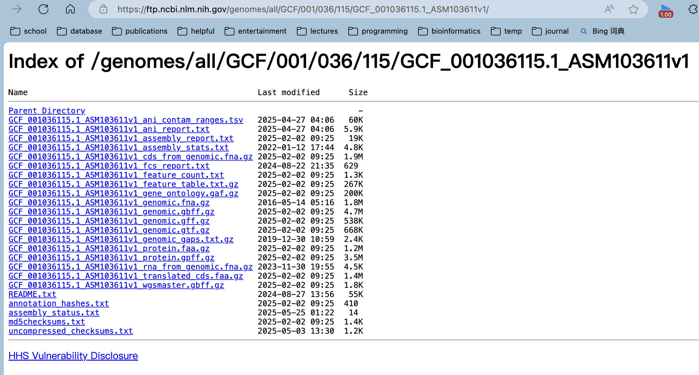

## Introduction

在生物信息学研究中，从NCBI下载基因组数据是一项基础的任务。无论是进行基因组比较分析、注释研究还是构建本地数据库，高效获取目标基因组数据都是第一步。

目前已有一些成熟的工具可以实现这一需求，例如：

- ncbi-genome-download：一个功能强大的Python工具
- NCBI Datasets command-line tools (CLI)：NCBI官方提供的命令行工具

然而，在实际使用中，这些工具经常会遇到网络连接不稳定、下载中断等问题。这里介绍一下自己写的一个函数，可以完成批量根据genome accession id下载相关数据的任务，基本不会有网络问题，只要网页能打开NCBI应该就能下。然后也介绍一下上述已有的轮子，他们的功能还是非常多且强大的。

## download_ncbi_genome_file

这是一个很简单的R函数，具体实现如下：

NCBI的基因组Accession ID具有特定格式，例如：GCF_001036115.1_ASM103611v1，GCA_000005845.2_ASM584v2

其中：

- GCF开头表示RefSeq数据库
- GCA开头表示GenBank数据库
- 中间9位数字是唯一标识符
- .1表示版本号
- 后缀ASM103611v1是组装名称

文件存储结构与下载原理：

NCBI的FTP服务器采用分层目录结构存储基因组数据。例如，GCF_001036115.1对应的完整路径为：
<https://ftp.ncbi.nlm.nih.gov/genomes/all/GCF/001/036/115/GCF_001036115.1_ASM103611v1/>

该目录下通常包含多种文件类型：

genomic.fna：基因组FASTA文件；
genomic.gff：GFF格式注释文件；
genomic.gtf：GTF格式注释文件；
genomic.gbff：GenBank格式文件



实现逻辑：

- 从ID（如GCF_001036115.1）解析出FTP基础路径
- 通过网页爬虫获取完整ID（如GCF_001036115.1_ASM103611v1）
- 拼接出目标文件的完整URL
- 使用wget或curl等工具下载文件

使用示例：

该函数已集成到pcutils R包中，使用非常简便。


```r
library(pcutils)

# 下载基因组FASTA文件（可使用简写ID）
download_ncbi_genome_file("GCF_001036115.1", out_dir = "downloads", type = "fna")

# 下载GFF注释文件（也可使用完整ID）
download_ncbi_genome_file("GCF_001036115.1_ASM103611v1", out_dir = "downloads", type = "gff")

# 批量下载示例
genome_id_list <- c("GCF_001036115.1", "GCA_000005845.2")
for (id in genome_id_list) {
    download_ncbi_genome_file(id, out_dir = "downloads", type = "fna")
}
```

## ncbi-genome-download

软件主页：<https://github.com/kblin/ncbi-genome-download>

ncbi-genome-download 是一个功能强大的Python命令行工具，专门用于从NCBI FTP服务器批量下载基因组数据。它支持：
- 多种生物分类（细菌、真菌、病毒等）
- RefSeq和GenBank两大数据库
- 多种文件格式下载
- 灵活的筛选条件

### 安装方法
```bash
# 使用pip安装（推荐）
pip install ncbi-genome-download

# 或者从源码安装
git clone https://github.com/kblin/ncbi-genome-download.git
cd ncbi-genome-download
python setup.py install
```

```bash
ncbi-genome-download [选项] <分类组>
```
常用参数详解

| 参数 | 说明 | 示例 |
|------|------|------|
| `-h`, `--help` | 显示帮助信息 | - |
| `-s`, `--section` | 指定数据库（默认为refseq） | `-s genbank` |
| `-F`, `--formats` | 指定下载格式（逗号分隔） | `-F fasta,gff` |
| `-l`, `--assembly-levels` | 按组装级别筛选 | `-l complete` |
| `-g`, `--genera` | 按属名筛选（逗号分隔） | `-g "Escherichia,Salmonella"` |
| `-T`, `--taxids` | 按分类ID筛选 | `-T 562` |
| `-o`, `--output-folder` | 指定输出目录 | `-o my_genomes` |
| `-p`, `--parallel` | 并行下载数 | `-p 4` |
| `-v`, `--verbose` | 显示详细日志 | - |

### 实用示例

```bash
# 示例1：下载所有完整组装的细菌基因组（RefSeq）
ncbi-genome-download -l complete bacteria

# 示例2：下载大肠杆菌和沙门氏菌的基因组（GenBank）
ncbi-genome-download -s genbank -g "Escherichia,Salmonella" bacteria

# 示例3：下载特定分类ID的基因组（FASTA+GFF格式）
ncbi-genome-download -T 562 -F fasta,gff -o ecoli_genomes bacteria

# 示例4：并行下载4个真菌基因组
ncbi-genome-download -p 4 fungi
```

## NCBI Datasets command-line tools


NCBI Datasets是NCBI官方推出的新一代数据获取工具，特点包括：
- 官方维护，数据更新及时
- 支持REST API和命令行两种方式
- 可下载基因组、基因、转录本、蛋白等多类数据
- 提供丰富的元数据（JSON格式）

### 安装
方法一：Conda安装（推荐）
```bash
conda create -n ncbi_datasets -c conda-forge ncbi-datasets-cli
conda activate ncbi_datasets
```
方法二：直接下载二进制文件
```bash
# Linux
curl -o datasets https://ftp.ncbi.nlm.nih.gov/pub/datasets/command-line/LATEST/linux-amd64/datasets
chmod +x datasets

# macOS (Intel)
curl -o datasets https://ftp.ncbi.nlm.nih.gov/pub/datasets/command-line/LATEST/mac-amd64/datasets
chmod +x datasets

# Windows (PowerShell)
Invoke-WebRequest -Uri "https://ftp.ncbi.nlm.nih.gov/pub/datasets/command-line/LATEST/win64/datasets.exe" -OutFile "datasets.exe"
```
核心命令结构
```bash
datasets [全局选项] <命令> [命令选项]
```
### 主要子命令

| 命令 | 功能 |
|------|------|
| `download` | 下载数据包 |
| `summary` | 获取数据摘要 |
| `reformat` | 格式转换 |
| `help` | 帮助信息 |

基因组下载详解

```bash
datasets download genome [选项] <参数>
```
常用选项

| 选项 | 说明 | 示例 |
|------|------|------|
| `accession` | 按accession下载 | `accession GCF_000001405.40` |
| `taxon` | 按分类单元下载 | `taxon "Escherichia coli"` |
| `reference` | 仅下载参考基因组 | `--reference` |
| `filename` | 指定输出文件名 | `--filename ecoli.zip` |
| `include` | 指定包含的数据类型 | `--include genome,gff3` |
| `dehydrated` | 仅下载元数据 | `--dehydrated` |

### 实用示例

```bash
# 示例1：下载单个基因组（包含所有文件）
datasets download genome accession GCF_000005845.2 --filename ecoli_k12.zip

# 示例2：下载大肠杆菌所有参考基因组
datasets download genome taxon "Escherichia coli" --reference --filename all_ecoli_refs.zip

# 示例3：自定义下载内容（基因组+注释）
datasets download genome accession GCF_000005845.2 --include genome,gff3,protein --filename ecoli_k12_essentials.zip

# 示例4：获取数据摘要（不下实际文件）
datasets summary genome taxon "Escherichia coli" --reference
```
数据处理流程

```bash
# 解压下载包
unzip ecoli.zip

# 查看内容
ls ncbi_dataset/data/

# 转换格式（如GBFF转FASTA）
datasets reformat gbff --inputfile genomic.gbff --outputfile cds.fasta --fasta
```

高级应用

```bash
# 结合jq处理JSON元数据
datasets summary genome accession GCF_000005845.2 --json | jq '.assemblies[0].assembly.assembly_name'

# 批量下载脚本示例
accessions=("GCF_000005845.2" "GCF_000006945.2" "GCF_000007445.1")
for acc in "${accessions[@]}"; do
    datasets download genome accession "$acc" --filename "${acc}.zip"
done
```
