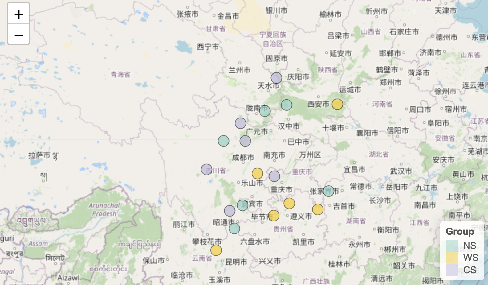
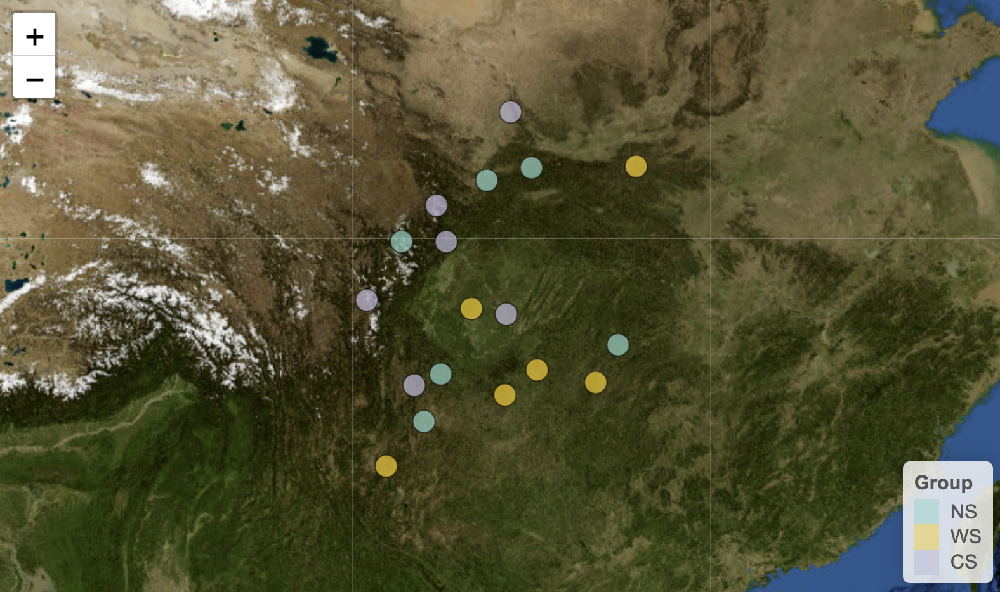

采样地图可以帮助我们直观地展示研究样本的地理分布和采样点信息。我之前也写过一篇[R绘制优美的地图](../r-map)的推文，详细介绍了地图文件，坐标参考系统，绘制地图，注释地图，RasterLayer等内容，但对于一些简单的采样地图绘制，可能不需要那么复杂的步骤。

本文将介绍如何使用`pcutils`包中的`sample_map`函数快速绘制采样地图。

### 函数介绍

该函数用于绘制 **空间采样点分布图**，支持三种可视化模式：
1. **静态基础地图**（`mode=1`）：基于 `ggplot2` + 内置世界地图
2. **自定义地理边界**（`mode=2`）：使用用户提供的GeoJSON/SHP文件
3. **交互式地图**（`mode=3`）：基于 `leaflet` 的动态地图

参数详解

**1. 数据输入**
| 参数 | 类型 | 必填 | 说明 |
|------|------|------|------|
| `metadata` | data.frame | 是 | 必须包含 `Longitude` 和 `Latitude` 列（WGS84坐标） |
| `group` | 字符 | 否 | 指定分组变量（控制点的颜色映射） |
| `label` | 字符 | 否 | 指定点的标签文本列 |

**2. 可视化模式控制**
| 参数 | 选项 | 默认 | 说明 |
|------|------|------|------|
| `mode` | 1/2/3 | 1 | 1=静态图, 2=自定义边界, 3=交互地图 |
| `map_provider` | 字符 | "OpenStreetMap" | 仅`mode=3`有效，可选 `providers$Esri.WorldTerrain` 等 |

**3. 地理数据处理**
| 参数 | 类型 | 默认 | 说明 |
|------|------|------|------|
| `shp_file` | 字符 | NULL | `mode=2` 时指定地理边界文件路径 |
| `crs` | 整数 | 4326 | 坐标参考系统（EPSG代码），4326=WGS84 |
| `xlim`/`ylim` | 数值向量 | NULL | 设置地图显示范围（如 `xlim=c(75,135)`） |

**4. 图形元素定制**
| 参数 | 类型 | 说明 |
|------|------|------|
| `point_params` | list | 传递给 `geom_point()` 的参数（如 `list(size=3, shape=17)`） |
| `map_params` | list | 地图边界样式（`mode=1`控制`geom_polygon`，`mode=2`控制`geom_sf`） |
| `leaflet_pal` | 函数 | `mode=3`专用，如 `leaflet::colorFactor("Set1", domain=metadata$group)` |

**5. 地图装饰元素**
| 参数 | 类型 | 默认 | 说明 |
|------|------|------|------|
| `add_scale` | 逻辑 | TRUE | 是否添加比例尺 |
| `scale_params` | list | 空 | 控制比例尺样式（位置、单位等） |
| `add_north_arrow` | 逻辑 | TRUE | 是否添加指北针 |
| `north_arrow_params` | list | 空 | 控制指北针样式 |

以下是一些示例代码，展示如何使用`sample_map`函数绘制采样地图：

### 自带地图（粗糙）


```r
library(pcutils)
data(otutab)

anno_df <- metadata[, c("Id", "long", "lat", "Group")]
colnames(anno_df) <- c("Id", "Longitude", "Latitude", "Group")
head(anno_df)
```

```
##      Id Longitude Latitude Group
## NS1 NS1  103.4767 26.94422    NS
## NS2 NS2  109.6196 29.08733    NS
## NS3 NS3  104.0361 28.25164    NS
## NS4 NS4  106.8651 33.82415    NS
## NS5 NS5  105.4571 33.51011    NS
## NS6 NS6  102.7832 31.86864    NS
```

使用`mode=1`参数可以绘制一个简单的静态地图，默认使用内置的世界地图：

```r
sample_map(anno_df, mode = 1, group = "Group")
```

}}index.en_files/figure-html/unnamed-chunk-3-1.png" width="672" />

使用xlim和ylim参数可以设置地图的显示范围：


```r
sample_map(anno_df, mode = 1, group = "Group", xlim = c(90, 135), ylim = c(20, 50))
```

}}index.en_files/figure-html/unnamed-chunk-4-1.png" width="672" />


### 自定义地图文件（精细）

自己找一个合适的GeoJSON或Shapefile文件，放在本地，然后指定路径。

网上能够下载到中国地图的地方很多，比如 [GeoJSON.cn](http://www.geojson.cn/)，[yezongyang/china-geojson](https://github.com/yezongyang/china-geojson)等等，而世界上其他区域，不同精度（洲，国家，城市，县...）的地图数据就需要自己按照需求寻找一下，如[GeoJSON Maps of the globe (ash.ms)](https://geojson-maps.ash.ms/)，[georgique/world-geojson](https://github.com/georgique/world-geojson)，[datasets/geo-countries](https://github.com/datasets/geo-countries)等等。

使用`mode=2`参数可以绘制自定义地理边界的地图，指定`shp_file`参数为GeoJSON或Shapefile文件路径：

```r
sample_map(anno_df, mode = 2, group = "Group",
           shp_file = "~/database/china.json",
           label = "Id",xlim = c(90, 135), ylim = c(20, 50),
           point_params = list(size=4),
           label_params = list(check_overlap = F,size=1.5))+
    theme_bw()+
    scale_fill_pc()
```

}}index.en_files/figure-html/unnamed-chunk-5-1.png" width="672" />

### leaflet交互式地图

Leaflet是一个开源的JavaScript库，用于创建交互式地图。R中的Leaflet包提供了一个轻量级的接口，允许在R中创建交互式地图。Leaflet包提供了许多基本的地图操作功能，例如缩放、平移和旋转，同时还允许添加标记、文本注释、多边形、线条和点。


```r
sample_map(anno_df, mode = 3, group = "Group")
```



Leaflet包支持多种地图提供商（如OpenStreetMap、Esri、Stamen等），可以通过`leaflet::providers`函数查看可用的地图提供商列表。

也可以在这个网站预览列表里的各种效果<https://leaflet-extras.github.io/leaflet-providers/preview/index.html>。


```r
sample_map(anno_df, mode = 3, group = "Group",map_provider = "USGS.USImagery")
```


