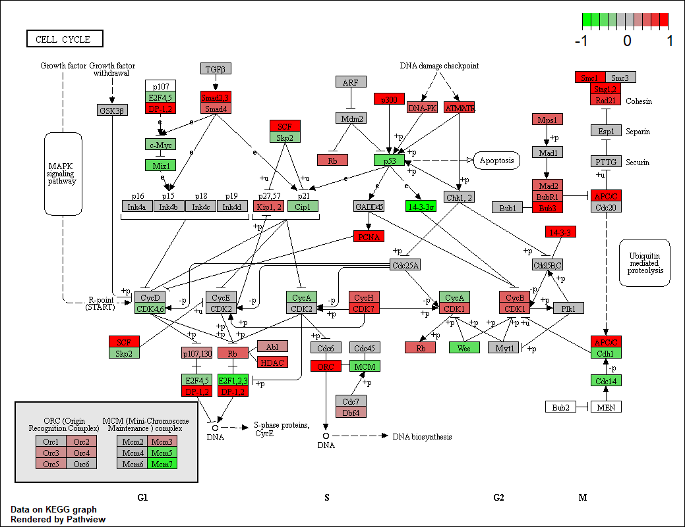

## Introduction

[KEGG](https://www.genome.jp/kegg/)（Kyoto Encyclopedia of Genes and Genomes）是一个广泛使用的生物信息学数据库，用于研究基因组、代谢组、信号通路和生物化学反应等方面的信息。它提供了基因、蛋白质、代谢物和信号通路等生物分子的综合信息，帮助研究人员理解生物体内分子之间的相互作用和功能。

之前的文章详细介绍了[KEGG 数据库及API](../kegg-api)的基础使用。其中KEGG pathway是我们经常需要使用的功能之一，它提供了生物体内代谢通路和信号传导通路的详细信息。

使用KEGG官网提供的绘图功能或者R包`pathview`可以绘制下面这种KEGG通路图，但这些方法通常只能处理单个通路，且绘图功能较为简单：



为了更好地处理和可视化KEGG通路网络，我们尝试获取KEGG pathway的网络结构然后用`MetaNet`绘制，因为涉及到KEGG通路的一些函数我之前已经在`ReporterScore`包中实现了，所以我这次把通路网络的获取和绘图功能放在了`ReporterScore`包中，但背后调用的还是`MetaNet`包的绘图功能。

- 软件主页：<https://github.com/Asa12138/MetaNet> **大家可以帮忙在github上点点star⭐️**，谢谢🙏
- 详细英文版教程：<https://bookdown.org/Asa12138/metanet_book>

可以从 CRAN 安装稳定版：`install.packages("MetaNet")`  

最新的开发版本可以在 <https://github.com/Asa12138/MetaNet> 中找到：

```r
remotes::install_github("Asa12138/MetaNet", dependencies = T)
remotes::install_github("Asa12138/ReporterScore", dependencies = T)
```

## ReporterScore+MetaNet


```r
library(ReporterScore)
library(MetaNet)

tmp_dir <- tempdir()
# 下载KEGG通路XML文件
pcutils::download2("https://rest.kegg.jp/get/ko01521/kgml", file.path(tmp_dir, "ko01521.xml"))
# 读取KEGG通路XML文件
path_net_c <- c_net_from_pathway_xml(file.path(tmp_dir, "ko01521.xml"))
# 绘制KEGG通路网络图
plot_pathway_net(path_net_c)
```

}}index.en_files/figure-html/unnamed-chunk-2-1.png" width="768" />


我们也可以使用`update_pathway_xml_ls()`函数来获取或更新所有的KEGG通路XML文件。这个函数会下载最新的KEGG通路XML文件到指定的目录。

```r
# org参数可以指定组织或物种，默认为NULL，表示获取所有通路
update_pathway_xml_ls(download_dir = "~/Documents/",org = NULL)
# 下载过一次之后，就可以用load_pathway_xml_ls获取KEGG通路
load_pathway_xml_ls()->pathway_xml_ls
```

想要给节点加上注释，并换上不同颜色，大小，布局等参数也非常简单，与之前介绍的`MetaNet`包的`c_net_plot`绘图参数完全一致的，可以查看[3.网络注释与操作](../metanet-3)，[4.布局和可视化](../metanet-4)。


```r
# 调整一下布局
coors=get_v(path_net_c)[,c("name","x","y")]
colnames(coors)=c("name","X","Y")
coors=rescale_coors(as_coors(coors))

coors=transform_coors(coors,aspect_ratio = 0.6) # 调整纵横比

plot_pathway_net(path_net_c,coors=coors, label_cex=0.6,
                 vertex.color=c("#a6cee3", "#78c679"),
                 vertex.frame.width=0.2,
                 arrow_size_cex=2,arrow_width_cex=2,
                 edge.width=0.5)
```

}}index.en_files/figure-html/unnamed-chunk-4-1.png" width="768" />

添加注释文件，比如基因上调和下调信息。


```r
# 添加注释信息
anno_df=data.frame(
  name=V(path_net_c)$name,
  Group=sample(c("Up","None","Down"),vcount(path_net_c),replace = TRUE)
)
path_net_c=c_net_set(path_net_c,anno_df,vertex_class = "Group")

# "#FFFFFF00"是透明色
pal=setNames(c("#92C5DE","#FFFFFF00","#D6604D"),c("Down","None","Up"))

plot_pathway_net(path_net_c,coors=coors, label_cex=0.6,
                 vertex.color=pal,
                 vertex.frame.width=0.2,arrow_size_cex=2,arrow_width_cex=2,
                 edge.width=0.5)
```

}}index.en_files/figure-html/unnamed-chunk-5-1.png" width="768" />

还可以使用`MetaNet`对网络进行各种操作筛选，比如我想获取某个基因的下游网络：


```r
get_v(path_net_c)
```

```
##        name _type     type reaction graphics_name   x    y width height fgcolor
## 1 ko:K04357  from ortholog     <NA>        K04357 155 -247    46     17 #000000
## 2 ko:K08774  from ortholog     <NA>        K08774 155 -271    46     17 #000000
## 3 ko:K05460  from ortholog     <NA>        K05460 155 -530    46     17 #000000
##   bgcolor graphics_type coords xmin xmax   ymin   ymax orig.id pathway_id
## 1 #BFBFFF     rectangle     NA  132  178 -255.5 -238.5      32    ko01521
## 2 #BFBFFF     rectangle     NA  132  178 -279.5 -262.5      20    ko01521
## 3 #BFBFFF     rectangle     NA  132  178 -538.5 -521.5      75    ko01521
##    label size  v_group  shape v_class   color Group
## 1 K04357    1 ortholog square    None #fb9a99  None
## 2 K08774    1 ortholog square    None #fb9a99  None
## 3 K05460    1 ortholog square      Up #fdbf6f    Up
##  [ reached 'max' / getOption("max.print") -- omitted 50 rows ]
```

```r
c_net_neighbors(path_net_c, nodes = "ko:K04456",order=2, mode = "out") -> path_net_c2

plot_pathway_net(path_net_c2,vertex.color=pal)
```

}}index.en_files/figure-html/unnamed-chunk-6-1.png" width="768" />


## ggkegg

但目前MetaNet不支持一些巨大的代谢网络如ko01100，因为其xml文件不是标准网络信息，可以使用更强大的`ggkegg`包来绘制，代码稍微复杂一点：

ggkegg是一个基于`ggplot2`的KEGG通路绘图包，提供了更灵活的绘图功能和更美观的图形输出。它可以处理更复杂的KEGG通路数据，并支持多种自定义样式。

<https://github.com/noriakis/ggkegg>


```r
library(ggkegg)
library(ggfx)
library(igraph)
library(tidygraph)
library(dplyr)

pathway("ko01100") |>
    process_line() |>
    highlight_module(module("M00021")) |>
    highlight_module(module("M00338")) |>
    ggraph(x=x, y=y) +
        geom_node_point(size=1, aes(color=I(fgcolor),
            filter=fgcolor!="none" & type!="line")) +
        geom_edge_link0(width=0.1, aes(color=I(fgcolor),
            filter=type=="line"& fgcolor!="none")) +
        with_outer_glow(
            geom_edge_link0(width=1,
                aes(color=I(fgcolor),
                    filter=(M00021 | M00338))),
            colour="red", expand=5
        ) +
        with_outer_glow(
            geom_node_point(size=1.5,
                aes(color=I(fgcolor),
                    filter=(M00021 | M00338))),
            colour="red", expand=5
        ) +
        geom_node_text(size=2,
            aes(x=x, y=y,
                label=graphics_name,
                filter=name=="path:ko00270"),
            repel=TRUE, family="sans", bg.colour="white") +
        theme_void()
```


## References
1. https://github.com/noriakis/ggkegg
2. https://github.com/datapplab/pathview
