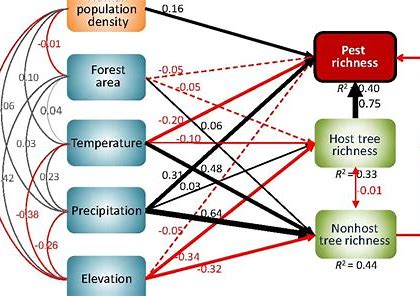

## Introduction

中介分析是一种统计方法，用于研究自变量(X)通过一个或多个中介变量(M)影响因变量(Y)的机制。简单来说，它帮助我们回答”X如何影响Y”而不仅仅是”X是否影响Y”的问题。例如，在教育研究中，我们可能想知道”教师教学水平(X)“是否通过”学生课堂参与度(M)“影响了”学生成绩(Y)“，这就是一个典型的中介分析问题。


中介分析的核心在于识别和量化三种效应：

1.  直接效应：X对Y的直接影响
2.  间接效应：X通过M对Y的影响
3.  总效应：直接效应与间接效应之和

结构方程模型（Structural Equation Modeling，简称SEM）可以被视为中介分析的扩展和泛化，它允许更复杂的模型设定，包括多重中介、调节中介以及各种变量间的交互作用，它们后续能用到的可视化工具也类似。



SEM是一种结合多元统计方法和数学模型的分析技术。它能够帮助研究者探究多个变量之间的关系和影响，包括直接和间接的影响。SEM 可以同时估计多个方程（即多元回归模型），并且允许变量间相互作用，同时还能考虑隐变量（latent variable）和测量误差等因素。

## 中介分析

先看一个简单的中介分析示例，使用R语言中的`mediation`包来进行中介分析。

``` r
# 安装并加载必要的包
library(mediation)

# 示例数据
set.seed(123)
n <- 200
X <- rnorm(n)
M <- 0.5*X + rnorm(n)
Y <- 0.3*X + 0.4*M + rnorm(n)
data <- data.frame(X, M, Y)

# 步骤1: 建立中介模型(M ~ X)
model.m <- lm(M ~ X, data = data)

# 步骤2: 建立结果模型(Y ~ X + M)
model.y <- lm(Y ~ X + M, data = data)

# 步骤3: 进行中介分析
med.sum <- mediate(model.m, model.y, treat = "X", mediator = "M",
                   boot = TRUE, sims = 500)

# 查看结果
summary(med.sum)
```

    ## 
    ## Causal Mediation Analysis 
    ## 
    ## Nonparametric Bootstrap Confidence Intervals with the Percentile Method
    ## 
    ##                Estimate 95% CI Lower 95% CI Upper p-value    
    ## ACME             0.1645       0.0997         0.25  <2e-16 ***
    ## ADE              0.2929       0.1067         0.46  <2e-16 ***
    ## Total Effect     0.4574       0.2682         0.62  <2e-16 ***
    ## Prop. Mediated   0.3596       0.2074         0.64  <2e-16 ***
    ## ---
    ## Signif. codes:  0 '***' 0.001 '**' 0.01 '*' 0.05 '.' 0.1 ' ' 1
    ## 
    ## Sample Size Used: 200 
    ## 
    ## 
    ## Simulations: 500

``` r
# 绘制结果
plot(med.sum)
```

}}index_files/figure-html/unnamed-chunk-2-1.png" width="672" />

ACME stands for average causal mediation effects.间接因果效应，表示X通过M对Y的效应大小
通过`med.sum$d0`和`med.sum$d0.p`可以获得ACME的效应和p值

ADE stands for average direct effects.直接效应，表示X直接对Y的作用大小
通过`med.sum$z0`和`med.sum$z0.p`可以获得ADE的效应和p值

Total Effect stands for the total effect (direct + indirect) of the IV on the DV. X对Y的直接和间接作用总和

Prop. Mediated describes the proportion of the effect of the IV on the DV that goes through the mediator. X通过M对Y的作用的比例

### 中介效应的类型

1.  互补型中介（Complementary Mediation）

定义：间接效应和直接效应都显著且方向一致（例如，均为正或均为负）。

意义：中介变量部分解释了自变量与因变量之间的关系，并增强了总效应。

2.  竞争型中介（Competitive Mediation）

定义：间接效应和直接效应都显著，但方向相反（一个为正，一个为负）。

意义：中介变量的解释部分抵消了直接效应，导致自变量与因变量之间的关系呈现混合效应。

3.  仅间接中介（Indirect-Only Mediation）

定义：间接效应显著，但直接效应不显著。

意义：中介变量完全解释了自变量与因变量之间的关系，即完全中介。

非中介效应的类型

1.  仅直接非中介（Direct-Only Non-Mediation）

定义：直接效应显著，但间接效应不显著。

意义：中介变量在自变量与因变量之间未发挥作用，关系主要通过直接路径发生。

2.  无效非中介（No-Effect Non-Mediation）

定义：直接效应和间接效应均不显著。

意义：自变量与因变量之间不存在关系，无论是否涉及中介变量。

或者使用`psych`包可以进行中介分析并绘制简单的中介图。

``` r
library(psych)

m2=psych::mediate(Y ~ X + (M),data = data,n.iter = 500,plot = FALSE)
psych::mediate.diagram(m2)
```

}}index_files/figure-html/unnamed-chunk-3-1.png" width="672" />

这里的
- c = the total effect of X on Y
- c = c’ + ab
- c’= the direct effect of X on Y after controlling for M;
- c’=c - ab
- ab= indirect effect of X on Y

### 生存数据中介分析

可以再看一个生存数据的中介分析示例，使用`survival`包和`mediation`包来进行中介分析。这里我们使用`lung`数据集作为示例。

``` r
library(survival)
library(dplyr)
# 加载 lung 数据集
data(lung)
# 数据预处理
dat <- lung %>% 
  mutate(status = ifelse(status == 2, 1, 0),
         ph.ecog = ifelse(ph.ecog == 0, 0, 1),
         time = time/30) %>% 
  dplyr::select(ph.ecog, wt.loss, time, status, age, sex) %>% 
  drop_na()
# head(dat)

library(mediation)
# 中介模型
mod_med <- lm(wt.loss ~ ph.ecog + age + sex, data = dat)
# 结局模型
mod_out <- survreg(Surv(time, status) ~ wt.loss + ph.ecog + age + sex, 
                   dist = "weibull", data = dat)
# nonparametric bootstrap置信区间
set.seed(111)
med_res1 <- mediate(model.m = mod_med, model.y = mod_out, 
                    sims = 1000, boot = TRUE, boot.ci.type = "perc",
                    treat = "ph.ecog", mediator = "wt.loss", outcome = "time")
summary(med_res1)   # 结果总结
```

    ## 
    ## Causal Mediation Analysis 
    ## 
    ## Nonparametric Bootstrap Confidence Intervals with the Percentile Method
    ## 
    ##                          Estimate 95% CI Lower 95% CI Upper p-value   
    ## ACME (control)             0.3142      -0.5340         1.70   0.474   
    ## ACME (treated)             0.2087      -0.3880         1.01   0.474   
    ## ADE (control)             -6.7308     -12.6789        -2.24   0.004 **
    ## ADE (treated)             -6.8363     -13.2424        -2.28   0.004 **
    ## Total Effect              -6.5220     -12.3459        -2.01   0.006 **
    ## Prop. Mediated (control)  -0.0482      -0.2847         0.12   0.480   
    ## Prop. Mediated (treated)  -0.0320      -0.1939         0.09   0.480   
    ## ACME (average)             0.2615      -0.4739         1.37   0.474   
    ## ADE (average)             -6.7835     -12.9447        -2.26   0.004 **
    ## Prop. Mediated (average)  -0.0401      -0.2341         0.10   0.480   
    ## ---
    ## Signif. codes:  0 '***' 0.001 '**' 0.01 '*' 0.05 '.' 0.1 ' ' 1
    ## 
    ## Sample Size Used: 213 
    ## 
    ## 
    ## Simulations: 1000

``` r
plot(med_res1)
```

}}index_files/figure-html/unnamed-chunk-4-1.png" width="672" />

结果解释：主要关注以下指标的p值是否显著，及点估计和置信区间估计：
ACME(average)，平均因果中介效应，p=0.474，表明中介效应不显著。
ADE(average)，平均直接效应，p=0.004，表明直接效应显著。
Prop. Mediated (average) ，平均中介比例。
Total Effect，总效应，p=0.006，表明总效应显著。
结论：ph.ecog 直接影响 status，而不是通过 wt.loss 间接影响（中介）。

## 结构方程模型（SEM）

SEM是一个广泛复杂的话题，这里我们只介绍简单的SEM模型示例，使用`lavaan`包来实现。更详细的SEM模型可以参考相关文献或教程。比如<https://mp.weixin.qq.com/s/NEhoOlAau_jyxHPTf7H3ug>这个讲的很详细。

SEM是一个线性模型框架，它对具有潜变量（ latent variables）的同步回归方程进行建模。

线性回归(linear regression)、多元回归(multivariate regression)、路径分析(path analysis)、验证因子分析(confirmatory factor analysis)和结构回归(structural regression)等模型可以被认为是 SEM 的特殊情况。

SEM 中可能存在以下关系：

- 从观察变量到观察变量（observed to observed variables）(γ，e.g., regression)
- 从潜变量到观测变量 （latent to observed variables）
- (λ, e.g., confirmatory factor analysis)
- 从潜变量到潜变量 （latent to latent variables）(γ，β，e.g., structural regression)

### 变量类型划分

1.  **观察变量(Observed Variable)**
    - 又称”显变量”(Manifest Variable)或”指标变量”(Indicator Variable)
    - 实际测量得到的变量，存在于数据集中
    - 示例：问卷项目得分、生理指标测量值等
2.  **潜变量(Latent Variable)**
    - 又称”构念”(Construct)或”因子”(Factor)
    - 无法直接测量，需要通过观察变量间接反映
    - 示例：满意度、焦虑程度、智力等抽象概念

因果关系

1.  **外生变量(Exogenous Variable)**
    - 独立变量，不受模型中其他变量影响
    - 可以是观察变量(x)或潜在变量(ξ)
    - 在路径图中无指向它的箭头
2.  **内生变量(Endogenous Variable)**
    - 因变量，至少有一条因果路径指向它
    - 可以是观察变量(y)或潜在变量(η)
    - 在路径图中有指向它的箭头

测量模型(Measurement Model)

- 描述潜在变量与观察变量之间的关系
- 包含以下要素：
  - **指标(Indicator)**：测量模型中的观察变量
  - **因子(Factor)**：由指标定义的潜在变量
  - **因子载荷(Loading)**：指标与因子间的关联强度

结构模型(Structural Model)

- 描述变量(包括潜在变量)间的因果关系
- 主要元素：
  - **回归路径**：外生变量到内生变量的因果关系
  - **方差/协方差**：外生变量间的相关关系

### lavaan包语法速查表

| 符号 | 含义         | 示例           | 说明                         |
|------|--------------|----------------|------------------------------|
| ~    | 回归关系     | y ~ x          | y对x的回归                   |
| =~   | 潜在变量定义 | f =~ q + r + s | 定义f由q,r,s测量             |
| \~~  | 方差/协方差  | x \~~ y        | x与y的协方差                 |
| ~1   | 截距/均值    | x ~ 1          | 估计x的均值                  |
| 1\*  | 固定参数     | f =~ 1\*q      | 固定q的因子载荷为1           |
| NA\* | 自由参数     | f =~ NA\*q     | 释放q的因子载荷              |
| a\*  | 参数标签     | f =~ a\*q      | 标记q的因子载荷为a，用于约束 |

### 模型设定示例

``` r
# 测量模型示例
measurement_model <- '
  # 潜在变量定义
  f1 =~ q1 + q2 + q3    # f1由q1-q3测量
  f2 =~ q4 + q5 + q6    # f2由q4-q6测量
  
  # 固定第一个指标的载荷为1
  f1 =~ 1*q1
  f2 =~ 1*q4
  
  # 估计指标残差方差
  q1 ~~ q1
  q2 ~~ q2
'

# 结构模型示例
structural_model <- '
  # 回归关系
  y ~ x1 + x2          # y对x1,x2的回归
  f1 ~ f2 + x1         # f1对f2,x1的回归
  
  # 协方差
  x1 ~~ x2             # x1与x2的协方差
'

# 完整SEM模型
full_model <- '
  # 测量模型部分
  f1 =~ y1 + y2 + y3
  f2 =~ y4 + y5 + y6
  
  # 结构模型部分
  f1 ~ f2 + x1
  f2 ~ x1 + x2
  
  # 残差相关
  y1 ~~ y2
'
```

理解这些核心概念和语法是掌握SEM分析的基础。

### SEM测量中介效应

``` r
library(lavaan)

# 定义模型
model <- '
  # 直接效应
  Y ~ c*X
  
  # 中介路径
  M ~ a*X
  Y ~ b*M
  
  # 间接效应(a*b)
  indirect := a*b
  
  # 总效应
  total := c + (a*b)
'

# 拟合模型
fit <- sem(model, data = data,sample.nobs = 500)

# 查看结果
summary(fit, standardized = TRUE, rsq = TRUE)
```

    ## lavaan 0.6.15 ended normally after 1 iteration
    ## 
    ##   Estimator                                         ML
    ##   Optimization method                           NLMINB
    ##   Number of model parameters                         5
    ## 
    ##   Number of observations                           200
    ## 
    ## Model Test User Model:
    ##                                                       
    ##   Test statistic                                 0.000
    ##   Degrees of freedom                                 0
    ## 
    ## Parameter Estimates:
    ## 
    ##   Standard errors                             Standard
    ##   Information                                 Expected
    ##   Information saturated (h1) model          Structured
    ## 
    ## Regressions:
    ##                    Estimate  Std.Err  z-value  P(>|z|)   Std.lv  Std.all
    ##   Y ~                                                                   
    ##     X          (c)    0.293    0.079    3.705    0.000    0.293    0.249
    ##   M ~                                                                   
    ##     X          (a)    0.471    0.075    6.307    0.000    0.471    0.407
    ##   Y ~                                                                   
    ##     M          (b)    0.349    0.068    5.107    0.000    0.349    0.343
    ## 
    ## Variances:
    ##                    Estimate  Std.Err  z-value  P(>|z|)   Std.lv  Std.all
    ##    .Y                 0.923    0.092   10.000    0.000    0.923    0.751
    ##    .M                 0.986    0.099   10.000    0.000    0.986    0.834
    ## 
    ## R-Square:
    ##                    Estimate
    ##     Y                 0.249
    ##     M                 0.166
    ## 
    ## Defined Parameters:
    ##                    Estimate  Std.Err  z-value  P(>|z|)   Std.lv  Std.all
    ##     indirect          0.164    0.041    3.969    0.000    0.164    0.140
    ##     total             0.457    0.077    5.958    0.000    0.457    0.388

``` r
# 参数估计
parameterEstimates(fit)
```

    ##        lhs op     rhs    label   est    se      z pvalue ci.lower ci.upper
    ## 1        Y  ~       X        c 0.293 0.079  3.705      0    0.138    0.448
    ## 2        M  ~       X        a 0.471 0.075  6.307      0    0.324    0.617
    ## 3        Y  ~       M        b 0.349 0.068  5.107      0    0.215    0.483
    ## 4        Y ~~       Y          0.923 0.092 10.000      0    0.742    1.104
    ## 5        M ~~       M          0.986 0.099 10.000      0    0.793    1.179
    ## 6        X ~~       X          0.885 0.000     NA     NA    0.885    0.885
    ## 7 indirect :=     a*b indirect 0.164 0.041  3.969      0    0.083    0.246
    ## 8    total := c+(a*b)    total 0.457 0.077  5.958      0    0.307    0.608

``` r
# 最后可以用`semMediation`包或者`semPlot`包来可视化SEM模型
#devtools::install_github("cardiomoon/semMediation")
semMediation::mediationPlot(fit)
```

}}index_files/figure-html/unnamed-chunk-5-1.png" width="672" />

https://zhuanlan.zhihu.com/p/53206137

## 生物例子

在宏基因组微生物生态学中，研究者通常会测量样品中多个微生物群落的组成和它们所处的环境变量（如温度、pH值等）之间的关系。然而，这些微生物群落之间可能存在相互作用，如竞争、合作等，这些作用可能会影响到它们与环境之间的关系。在这种情况下，SEM可以用来建立微生物群落与环境变量之间的关系网络，同时考虑微生物群落之间的相互作用。

例如，一项研究调查了植物根际微生物群落与土壤性质之间的关系。研究者测量了植物根际中多个微生物群落的组成，以及土壤中的一些物理化学性质，如有机质含量、pH值等。他们使用SEM来建立微生物群落与土壤性质之间的关系网络，并同时考虑微生物群落之间的相互作用。他们发现，微生物群落之间存在着复杂的相互作用，而这些相互作用会影响到微生物群落与土壤性质之间的关系，提高了对微生物群落与环境之间关系的理解。

下面给出一个用R生成模拟数据并实现SEM的例子，假设我们研究一些微生物和它们生长环境之间的关系。其中，环境因子包括pH、温度、盐度，微生物包括细菌、真菌和古菌。

首先，我们需要生成一些符合正态分布的随机数据作为我们的变量。具体代码如下：

``` r
library(mvtnorm)
set.seed(123)

# 生成环境因子数据
n <- 1000
mu_env <- c(pH = 7, temp = 25, salinity = 3)
sigma_env <- matrix(c(1, 0.8, 0.5,
                      0.8, 1, 0.3,
                      0.5, 0.3, 1), ncol = 3)
env <- rmvnorm(n, mean = mu_env, sigma = sigma_env)%>%as.data.frame()

# 生成微生物数据
mu_microbe <- c(bacteria = 20, fungi = 10, archaea = 5)
sigma_microbe <- matrix(c(1, 0.5, 0.3,
                          0.5, 1, 0.2,
                          0.3, 0.2, 1), ncol = 3)
microbe <- rmvnorm(n, mean = mu_microbe, sigma = sigma_microbe)%>%as.data.frame()

# 将生成的数据合并为一个数据框
df <- data.frame(env, microbe)
```

接下来，我们使用sem函数实现SEM。具体代码如下：

``` r
library(lavaan)
model <- '
# 定义测量模型
# bacteria =~ bacteria
# fungi =~ fungi
# archaea =~ archaea

# 定义结构模型
bacteria ~ pH + temp
fungi ~ temp + salinity
archaea ~ pH + salinity

bacteria ~~ fungi
bacteria ~~ archaea
fungi ~~ archaea
'

# 运行SEM
fit <- sem(model, data = df)

# 查看SEM结果
summary(fit)
```

    ## lavaan 0.6.15 ended normally after 22 iterations
    ## 
    ##   Estimator                                         ML
    ##   Optimization method                           NLMINB
    ##   Number of model parameters                        12
    ## 
    ##   Number of observations                          1000
    ## 
    ## Model Test User Model:
    ##                                                       
    ##   Test statistic                                 3.024
    ##   Degrees of freedom                                 3
    ##   P-value (Chi-square)                           0.388
    ## 
    ## Parameter Estimates:
    ## 
    ##   Standard errors                             Standard
    ##   Information                                 Expected
    ##   Information saturated (h1) model          Structured
    ## 
    ## Regressions:
    ##                    Estimate  Std.Err  z-value  P(>|z|)
    ##   bacteria ~                                          
    ##     pH               -0.022    0.047   -0.463    0.643
    ##     temp              0.074    0.048    1.541    0.123
    ##   fungi ~                                             
    ##     temp              0.019    0.033    0.574    0.566
    ##     salinity          0.024    0.029    0.828    0.408
    ##   archaea ~                                           
    ##     pH                0.017    0.036    0.481    0.631
    ##     salinity          0.028    0.034    0.822    0.411
    ## 
    ## Covariances:
    ##                    Estimate  Std.Err  z-value  P(>|z|)
    ##  .bacteria ~~                                         
    ##    .fungi             0.467    0.035   13.496    0.000
    ##    .archaea           0.295    0.032    9.221    0.000
    ##  .fungi ~~                                            
    ##    .archaea           0.183    0.031    5.869    0.000
    ## 
    ## Variances:
    ##                    Estimate  Std.Err  z-value  P(>|z|)
    ##    .bacteria          0.990    0.044   22.361    0.000
    ##    .fungi             0.988    0.044   22.361    0.000
    ##    .archaea           0.948    0.042   22.361    0.000

最后，我们可以使用semPlot函数绘制SEM图形，以便更好地理解SEM模型的结构。具体代码如下：

``` r
library(semPlot)
semPaths(fit, what = "std", nCharNodes = 10, sizeMan = 8,
         edge.label.cex = 1.1, curvePivot = TRUE, fade = FALSE)
```

}}index_files/figure-html/unnamed-chunk-8-1.png" width="672" />

``` r
semMediation::mediationPlot(fit)
```

}}index_files/figure-html/unnamed-chunk-9-1.png" width="672" />

运行上述代码后，我们就得到了一个可视化的SEM模型图，该模型描述了微生物和环境因子之间的关系。

## References

1.  https://mp.weixin.qq.com/s/NEhoOlAau_jyxHPTf7H3ug
2.  https://mp.weixin.qq.com/s/OLr9Xo-GoAAt0Tu8L-c93g
3.  https://mp.weixin.qq.com/s/UhcnqytZUmTHDcSh3mAaOQ
