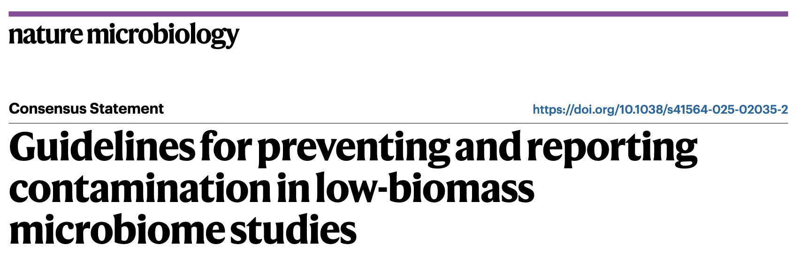
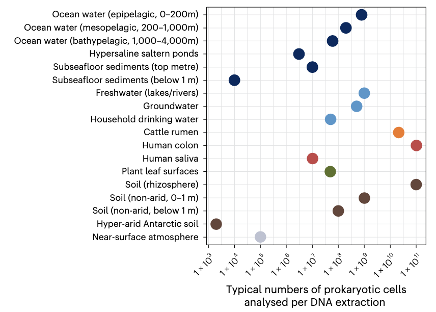
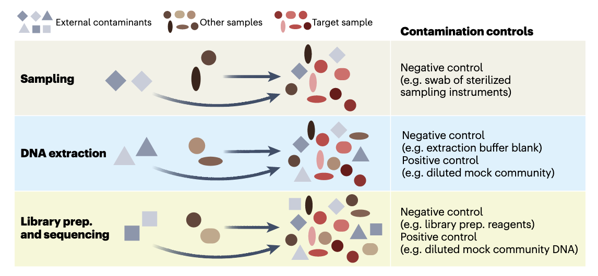
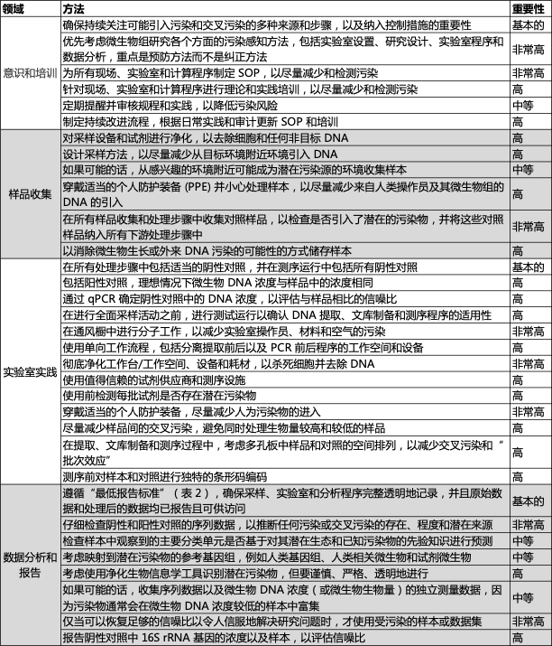
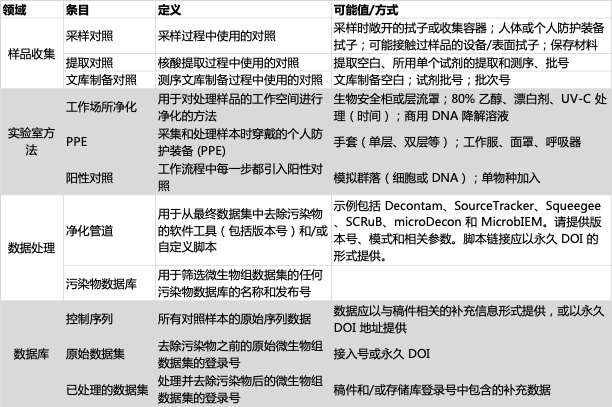
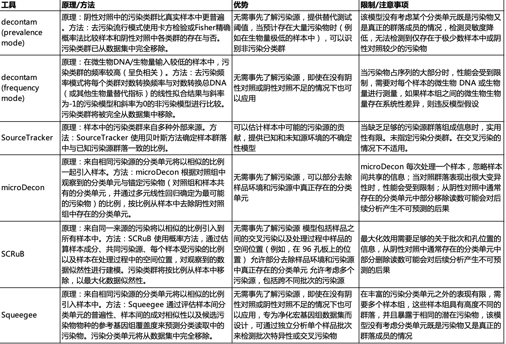

我们实验室经常处理低微生物生物量样本（如宿主相关的呼吸道，阴道等微生物组，或是环境相关的沙子，冻土等微生物组），最近看到Nature Microbiology发表了一篇关于低微生物生物量样本污染的指南。

发布日期：2025年6月20日
原文：<https://doi.org/10.1038/s41564-025-02035-2>

众多重要环境中微生物生物量水平较低，包括某些人体组织、大气环境、植物种子、处理后的饮用水、超干旱土壤以及深层地下环境，部分环境甚至完全不存在常驻微生物群落。这些低微生物生物量环境对基于DNA的标准测序方法提出了独特挑战——当检测工作接近技术极限时，外部污染源的干扰必然成为关键问题。同样地，低生物量样本更容易受到交叉污染的严重影响，适用于高生物量样本的操作流程若直接应用于低微生物生物量样本，很可能导致误导性结果。本共识声明系统阐述了降低污染与交叉污染的应对策略，重点关注标记基因和宏基因组分析领域。我们同时制定了污染物信息报告与去除流程的最低标准规范。从样本采集处理到数据分析报告，研究全流程各环节都必须建立污染防控与识别机制。我们强烈建议研究者在设计、实施和报告微生物组研究（特别是低生物量系统研究）时采纳这些建议方案。

## Introduction

过去二十年，随着非培养方法的普及，微生物组研究迅猛发展。标记基因测序和宏基因组测序已成为探索细菌、古菌、真菌、原生生物及病毒多样性的主流手段。尽管学界已就微生物组研究的最佳实践达成诸多共识，但这些建议主要基于高生物量样本（如表层土壤、污水和人类粪便）的研究经验。此类样本中微生物DNA含量较高，目标信号远强于污染噪声，不易产生假阳性结果。  

然而，许多系统的微生物生物量极低，接近常规DNA测序的检测极限（图1）。由于测序数据的比例特性，微量污染物即可严重影响研究结果，这在低生物量系统研究中尤为突出。这类系统包括：大气、保存不佳的古样本、深层地下环境、超干旱土壤、永久冻土、饮用水、金属表面、岩石、高盐卤水、雪和冰芯等。  

某些宿主相关系统（如人类呼吸道、母乳、胎儿组织、血液，以及植物种子、部分动物肠道等）虽含大量宿主DNA，但微生物DNA含量极低。更有研究报道，人类胎盘、特定动物肠道及极端环境中甚至完全检测不到常驻微生物。

>图 1 | 宿主、自然环境和人工环境系统中原核生物（细菌和古菌）细胞的典型数量（对数尺度）。估算值采用不依赖培养的方法（主要为直接细胞计数）获得，但我们注意到这些是平均近似值，并且从特定环境中采集的样本之间的细胞数量可能存在相当大的差异。细胞数量/计数来自已发表的文献，并根据通常用于 DNA 提取的样本量（体积或重量）进行了调整。详情请参阅补充表 1。图中不同颜色的点表示环境的一般类别。

研究低微生物生物量环境需要严格把控样本采集、实验操作和数据分析各环节，以降低并识别污染物。污染物来源广泛（如人体、采样设备、试剂耗材、实验室环境），可出现在采样、储存、DNA提取、测序等任何阶段。另一个突出问题是样本间交叉污染（如孔间DNA渗漏，图2）。  

虽然已有多种生物信息学去污染方法，但难以准确区分真实信号与污染噪声，尤其对严重污染的测序数据。尽管已有研究提出污染防控指南，但污染问题依然存在，且对照实验的使用率十年未增。这导致学界对部分微生物组研究（特别是低生物量系统研究）的可靠性存疑。操作不当轻则影响研究质量与结果可比性，重则导致错误结论——污染可能扭曲生态与进化特征、造成病原体暴露途径误判，或导致微生物存在的假阳性判定。例如关于"胎盘微生物组"的争议，促使人们重视污染问题与最佳实践。类似争议也存在于人类血液、脑组织、肿瘤组织，以及深层地下环境、高层大气等系统的研究中。  

本文提出一套污染最小化方案及报告标准（经微生物组领域专家共识制定）。这些建议适用于所有微生物组研究（尤其低生物量系统、病原体追踪等易受污染影响的领域），虽以标记基因（如16S rRNA测序）和宏基因组测序为重点，但同样适用于宏转录组、DNA稳定同位素探针、qPCR和培养等方法。遵循这些建议将提升研究质量，有效规避低生物量系统研究中的常见问题。尽管无法完全消除污染，但通过系统防控可将其影响降至最低。

>图 2 | 概念图说明了微生物组研究三个步骤中污染和交叉污染的发生方式，并提出了缓解控制措施。目标样本（红色光滑形状表示）可能被外部污染物（灰色阴影尖锐形状表示）污染。这些外部污染物可能是来自采样群落以外来源的细胞或 DNA（例如，实验室试剂、采样设备）。此外，目标样本也可能受到交叉污染的影响，在采样、实验室处理和/或通过“标签切换”（例如，当条形码读取被错误分配给错误的样本时会发生这种情况）过程中，细胞或 DNA 被无意地与其他样本（棕色阴影光滑形状表示）交换。此外，污染物和交叉污染物会在整个工作流程中累积。准备，制备。

## 低生物量系统的采样策略

污染可能发生在从采样到测序的任何环节（图2）。采样阶段的主要污染源包括操作人员、采样设备及周边环境（如患者血液样本接触皮肤，或沉积物样本混入上层水体）。由于大多数DNA检测方法的非特异性，采样过程中引入的微生物DNA很难与目标样本DNA区分。因此，建议采用污染防控型采样设计，以最大限度减少并识别污染。  

采样时的污染防控措施需根据具体系统调整，但以下核心原则普遍适用：  
1. 全面评估污染源：从原位环境到采样容器，识别样本可能接触的所有污染源，并在采样前后采取防控措施。  
2. 采样前准备：  
   - 确保采样试剂（如保存液）无DNA污染  
   - 通过预实验优化流程并发现问题  
3. 采样过程控制：  
   - 实时监控样本接触的物体和环境  
   - 采用去污染措施或物理隔离阻断污染  
4. 人员培训：对采样人员进行标准化操作培训，确保流程规范执行。  

需特别注意：初始样本的微生物生物量越低，污染对最终测序数据的比例影响越大。建议尽可能采取以下措施（参见表1）：  

### 污染源去污染措施  
所有采样设备、工具、容器及手套均需进行去污染处理。首选一次性无DNA耗材（如拭子与采集管），若需重复使用则须严格消毒：先用80%乙醇灭活污染微生物，再以核酸降解溶液清除残留DNA，这对连续使用同一设备的场景尤为重要。手套需同等处理且在采样前避免接触任何物品。用于采集或储存样本的塑料/玻璃器皿应经过高压灭菌或紫外辐照预处理，并保持密封至采样时刻。需注意无菌状态不等同于无DNA残留——即便活细胞已被清除，游离DNA仍可能存留于处理后的表面。因此建议在安全可行条件下，采用次氯酸钠、UV-C辐照、过氧化氢、环氧乙烷气体或商用DNA清除剂进行深度处理。

### 个人防护装备应用规范  
采样操作应遵循最小接触原则。操作人员需根据环境穿戴防护装备（手套、护目镜、防护服/洁净服及鞋套等），以隔绝呼吸气溶胶、衣物皮屑等人体污染源。航天洁净室与古DNA实验室的防护标准具有示范价值：前者要求全覆盖式防护，后者采用口罩、防护面罩及三层可更换手套的配置。尽管极端场景才需如此严密的防护，但常规研究中适度使用PPE仍是经济高效降低人源污染的关键措施。

### 污染源对照样本采集  
设置采样对照对识别污染来源、评估防控效果及数据校正至关重要。对照类型包括空采集管、环境空气拭子、PPE表面拭子、操作接触面拭子及保存液等分试样等。涉及钻探或切割操作的研究常将工作流体作为阴性对照，部分实验还通过示踪染料标记流体污染。例如胎儿胎粪研究通过采集消毒后产妇皮肤拭子与手术室空气拭子，证实胎粪微生物组与阴性对照无差异。建议每4个样本至少设置1个对照，且所有对照需与实验样本同步经历全流程处理，以便结合DNA提取与建库阶段的阴性对照精准追溯污染环节。所有对照信息均需完整记录并报告（参见表2与框1）。

## 实验室污染防控与识别规范

实验室操作流程（包括DNA提取、PCR扩增、文库构建和测序）既可能引入污染物，也会放大其影响。常见污染源包括试剂耗材（如提取试剂盒、保存液、离心管乃至纯化水）中可扩增的游离DNA或顽固菌种（如Ralstonia、Pseudomonas）残留，以及操作人员、实验室环境或其他样本的交叉污染。研究表明，实验室污染特征会随月份、季节及操作者变化，而样本管间DNA气溶胶扩散或"标签跳跃"现象更会导致数据误判。因此，必须通过实验室分区设计、规范操作和系统对照来防控污染。以下为关键措施（参见表1）：

### 实验室空间管理  
分子实验区应严格划分前处理区（样本制备/DNA提取）与后处理区（PCR/文库构建），并建立单向工作流。所有操作需在生物安全柜内完成，使用专用移液器与滤芯吸头。实验前后需用DNA降解溶液彻底消毒台面，并辅以UV-C辐照。人员须穿戴专用PPE，不同区域设备不得混用，且一次性防护装备应按"洁净区→污染区"单向穿行。定期清洁地面及水平面以控制灰尘污染。

### 试剂质量控制  
优先选用经认证的无DNA试剂，但使用前仍需通过qPCR或测序验证其洁净度。建议将大宗试剂分装为小份，每批次单独设立阴性对照以监控污染。塑料耗材使用前需UV-C灭菌，样本管进入工作区前应彻底表面消毒。若外包测序环节，需确认服务商具备低生物量样本处理经验，并建议进行预实验。

### 对照系统设置  
每个实验批次需同步设置多类型对照：  
1) 采样对照（环境空白、试剂空白等）  
2) 过程对照（无样本DNA提取、无模板PCR等）  
3) 阳性对照（梯度稀释的模拟群落标准品）  
4) 交叉污染监控对照（如掺入特异性寡核苷酸）  
所有对照应与样本同步进行全流程处理并测序，即使阴性对照PCR产物不可见也需测序验证。建议每批次试剂均设立独立对照，因不同批次的污染物谱可能存在差异。

### 样本处理策略  
高低生物量样本应分开处理，96孔板布局时需注意中心孔位更易发生交叉污染。推荐使用双索引纠错条形码，必要时可采用亚硫酸盐转化等化学标记技术，以区分预处理后引入的污染DNA。单管操作虽可降低交叉污染风险，但需权衡通量需求。

## 检测并潜在去除序列数据中的污染物

在分析微生物组测序数据时，污染识别与清除是至关重要的环节，尤其对于低生物量样本。即便采用最严格的采样和实验流程，污染风险仍无法完全消除。通过系统比对阳性/阴性对照与样本中的序列、分类单元或基因，结合专业去污染软件（表3），可评估污染程度并进行针对性处理。但需注意，宏基因组数据因其复杂性较标记基因更难净化，且去污染过程可能导致信息失真。当信噪比过低时，建议直接弃用受污染数据，但保留原始记录（参见表2与框1）以追溯污染来源。  

### 分析测序对照并检查意外分类单元
质量控制阶段应重点分析三类信息：阴性对照中的非目标DNA、阳性对照分类单元在样本中的分布、以及污染物在读段中的占比。标记基因数据可通过比对ASVs与常见污染物数据库进行净化，而宏基因组数据则需将样本读段映射至对照组的MAGs。需警惕那些生态学上不合理的分类单元（如南极高空出现人体共生菌、脑组织中发现光合蓝藻等），这些异常信号往往提示污染存在。  

### 考虑使用净化软件，但要注意其局限性
去污染软件虽能辅助识别外源污染物（如decontam基于检出频率或丰度特征），但对交叉污染识别有限（SCRuB等工具例外）。使用时应考虑其假设前提与适用场景，注意假阳性与假阴性风险。宏基因组分析更需谨慎：即便设置阴性对照，低覆盖度污染物仍可能残留，且近缘物种序列难以区分。建议结合qPCR定量、细胞计数等生物量指标综合判断，同时认识到基于短读长组装的MAGs只能反映部分读段信息这一技术局限。

### 防胜于治：污染防控优先原则

研究者应在开展大规模采样与测序前，投入充分精力优化污染防控方案。尽管微量污染难以避免，但系统性污染可被有效控制——已有研究成功获取了极低生物量生态系统的高质量数据，甚至证实了某些环境不存在常驻微生物。这些成果均依赖于全流程污染防控体系的建立，包括无污染采样流程开发、试剂与水质验证，以及测序数据的严谨分析。通过多维度对照实验，可追溯污染来源（如采样操作、试剂或人员），并据此迭代优化实验方案。

对于已存在显著污染的数据集，事后去污染措施往往收效有限。例如近期一项全球大气微生物组研究中，近半数序列（包括已知试剂污染物如假单胞菌属）被迫剔除，导致群落组成与驱动因素的分析可靠性存疑。任何去污染算法均非完美， retrospective处理可能导致假阳性/假阴性结果。当标记基因或宏基因组数据需剔除大量序列时，应重新评估样本数据的有效性；若污染问题持续且严重，则需质疑整个数据集的可靠性。在关键研究中，跨实验室重复验证仍是确认结果可信度的金标准。

### Conclusion

基于DNA技术的微生物组研究中，特别是在处理低生物量样本时，必须预设交叉污染难以完全避免。为此，研究者应当双管齐下：一方面通过标准化操作最大限度降低污染风险，另一方面设置系统对照以准确评估污染性质与程度。尤为关键的是，必须完整报告三项核心信息：污染防控的具体措施、检出污染物的特征、以及后续分析中对可疑污染数据的处理方案。这种全流程透明化记录将显著提升研究结果的可信度。需要说明的是，本文提出的建议并非强制性操作清单，而是旨在推动学界更系统地审视污染问题。我们相信，通过强化对污染和交叉污染问题的认知与管理，不仅能够提升微生物组研究的整体质量，更有助于解决既往研究中因污染导致的可重复性争议。最终目标是为微生物组科学建立更可靠的方法学基础，使研究成果能够经得起时间和实践的检验。
