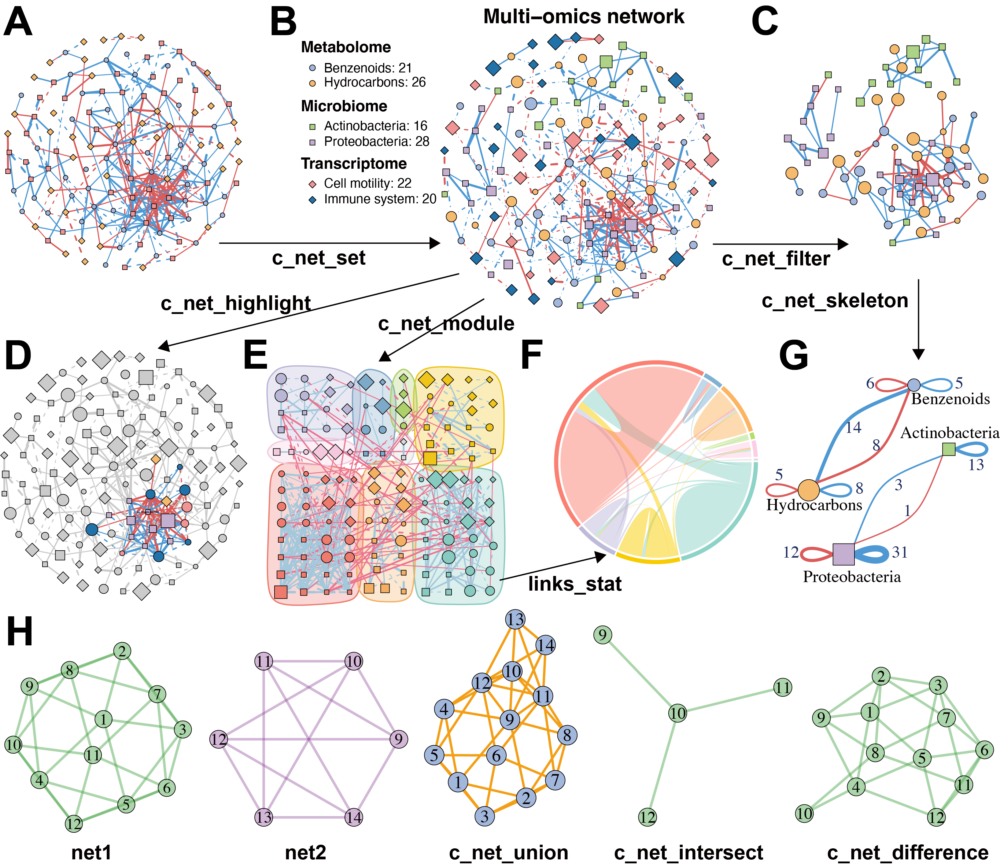
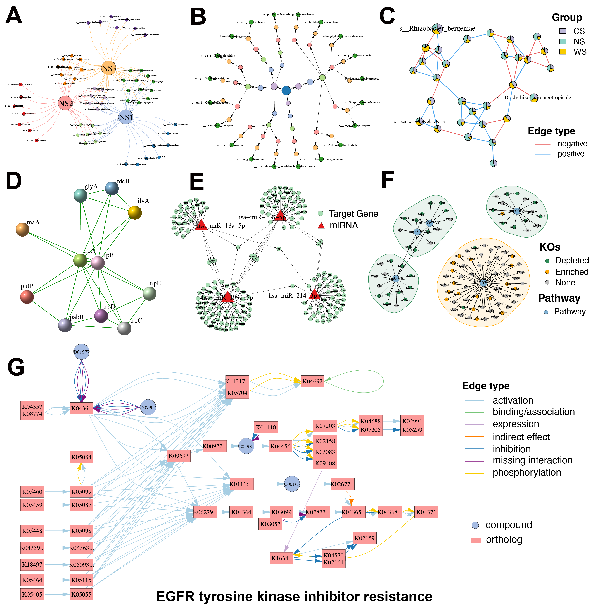
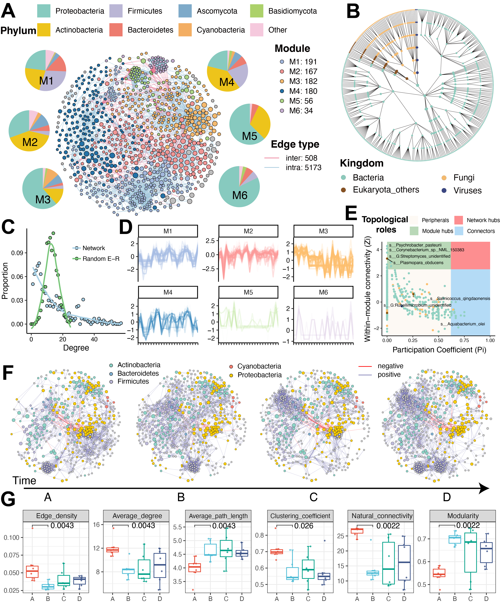

MetaNet是一个用于组学网络分析的R包，提供了多种功能，包括网络构建、可视化、比较和稳定性分析等。最近我把MetaNet的预印本放到了bioRxiv上，欢迎大家阅读和使用。 

- 预印本地址：<https://www.biorxiv.org/content/10.1101/2025.06.26.661636v1>
- 软件主页：<https://github.com/Asa12138/MetaNet> **大家可以帮忙在github上点点star⭐️**，谢谢🙏
- 详细英文版教程：<https://bookdown.org/Asa12138/metanet_book/>

网络分析是揭示高通量组学数据集中复杂关系的有力策略。然而，现有工具通常在可扩展性、灵活性以及多组学整合的原生支持方面存在不足，这为探索复杂生物网络设置了重大障碍。为突破这些限制，我们开发了MetaNet——一个高性能R语言软件包，专为多组学数据集的生物网络构建、可视化与分析而设计。MetaNet支持基于相关性的高效网络构建，可扩展至包含超过10,000个特征的数据集的快速计算，并提供与静态和交互式平台兼容的丰富布局算法与可视化选项。该软件包还包含一套完整的拓扑和稳定性指标，用于深度网络表征。基准测试表明，MetaNet在计算时间上比现有R包快达100倍，内存使用减少达50倍。我们通过两个案例研究展示其实用性：(1) 微生物共现网络的纵向分析揭示了空气微生物组的动态变化；(2) 包含40,000多个特征的暴露组-转录组整合网络，揭示了生物与化学暴露的差异化调控影响。MetaNet通过提供强大、可重复且具有生物学解释力的框架，弥合了网络理论与组学应用之间的鸿沟，支持跨组学平台的大规模、可解释的整合网络分析，推动现代生命科学的系统水平认知。MetaNet已在
CRAN发布(<https://cran.r-project.org/web/packages/MetaNet>)。

## Introduction

网络（或称图论模型）是解析复杂生物系统交互关系的基础工具。这种抽象而信息丰富的表征方式，可跨越分子到生态等多个层次揭示生物特征间的相互作用。网络理论已深刻影响生命科学的多个分支领域——蛋白质互作网络阐明信号传导与药物靶点，基因调控网络描绘发育与疾病的级联控制，代谢网络绘制生物合成与能量通路，而生态网络则揭示物种互作与群落动态。随着宏基因组、转录组、蛋白组和代谢组等高通量组学技术的爆发式发展，基于网络的分析方法已成为处理多维生物大数据的核心策略，能有效识别功能模块、推断关联关系并发现关键调控因子。

现有网络分析工具各具特色：Cytoscape提供分子互作可视化平台，Gephi擅长大规模图布局算法；R/Python生态中的igraph、ggraph和tidygraph包提供灵活的网络功能，WGCNA专注于基因共表达分析，而ggClusterNet、microeco和NetCoMi等工具则针对微生物组分析进行了优化。此外，MENAP、iNAP等在线流程为简单需求提供了快速解决方案。

然而，这些工具难以满足现代组学数据的复杂需求：首先，缺乏多组学整合的原生支持；其次，高维数据相关性网络构建存在计算瓶颈；第三，相关性阈值选择通常依赖主观判断；第四，可视化功能有限，难以生成出版级图表；最后，在线工具的不可复现性问题突出。这些局限严重制约了组学尺度网络分析的可靠性。

为此，我们开发了MetaNet——专为组学数据设计的可扩展R包。该工具通过四大创新突破现有局限：(1) 采用并行优化算法，实现万级特征的高效网络构建；(2) 引入随机矩阵理论实现数据驱动的相关性阈值筛选；(3) 集成40余种布局算法，支持与ggplot2/Gephi/Cytoscape的交互；(4) 提供拓扑分析与稳定性评估的全套指标。通过微生物组时序共现网络和暴露组-转录组整合网络两个案例，我们验证了其在复杂生物大数据解析中的卓越性能。

## Methods

### MetaNet设计与开发  
MetaNet是基于R语言的多组学网络分析工具包，兼容Windows、MacOS和Linux系统（需R 4.0以上版本），核心功能基于igraph包实现。其架构包含八大模块（图1A）：计算、操作、布局、可视化、拓扑分析、模块分析、稳定性分析和数据读写，支持从网络构建到分析可视化的全流程。核心数据结构为扩展自igraph的"metanet"对象，兼容所有基础igraph操作，并可转换为tbl_graph对象与ggraph/tidygraph生态交互。所有功能函数均以"c_net_"前缀统一命名，便于记忆和使用。
 
1. **数据预处理**  
   - 提供"trans"函数支持CPM、log转换、aCPM等十余种标准化方法（表S1）  
   - 内置"guolv"（过滤）和"hebing"（合并）函数用于原始数据清洗  

2. **网络构建**  
   - 支持四种构建方式：  
     - 从原始数据计算（`c_net_calculate` + `c_net_build`）  
     - 导入graphml/pajek格式文件（`c_net_load`）  
     - 通过边列表生成（`c_net_from_edgelist`）  
     - 升级现有igraph对象（`c_net_update`）  

3. **网络操作**  
   - 注释管理：`c_net_set`/`c_net_annotate`实现属性标注  
   - 子网提取：`c_net_filter`/`c_net_neighbors`支持局部网络分析  
   - 集合运算：`c_net_union`/`c_net_intersect`实现网络比较  

4. **可视化与布局**  
   - 集成40余种布局算法（`c_net_layout`）  
   - 支持几何变换（缩放/旋转/3D投影等）  
   - `c_net_plot`函数提供出版级绘图参数控制  

5. **拓扑分析**  
   - `c_net_index`计算17种拓扑指标  
   - `c_net_stability`评估网络鲁棒性（特别适用于微生物生态网络）  

### 性能对比  
在Apple M2芯片上的基准测试显示（图1C）：  
- 计算速度：较WGCNA、NetCoMi等工具提升最高100倍（p<0.001）  
- 内存占用：降低达50倍（特征数=1000时）  
- 优势源于：向量化矩阵运算与t分布解析法求p值  

### 案例应用  
1. **微生物共现网络**  
   - 数据集：6名受试者24个时间点的微生物组数据  
   - 筛选：保留出现频率>10%的914个物种  
   - 构建：Spearman相关性（|ρ|>0.6且FDR<0.05）  
   - 分析：  
     - 快速贪婪算法识别功能模块  
     - 时序子网拓扑指标计算（连通性/中心性等）  

2. **暴露组-转录组整合网络**  
   - 关联分析：  
     - 化学暴露-转录组：|ρ|>0.6且FDR<5e-4  
     - 生物暴露-转录组：|ρ|>0.5且FDR<5e-4  
   - 功能注释：ReporterScore包进行KEGG/GO富集分析  

### 获取方式  
- CRAN/GitHub/Gitee平台开源  
- 附在线手册（https://bookdown.org/Asa12138/metanet_book/）  

## Results
### 高效且可扩展的网络计算可以分析更大的omics数据集

MetaNet实现了高效可扩展的网络计算能力，能够处理大规模组学数据集分析。该工具提供多种标准化策略（表S1），支持微生物组、转录组、蛋白组和代谢组等不同组学数据的预处理。网络构建基于Spearman、Pearson和Bray-Curtis等相似性计算方法，通过随机化检验和多重检验校正保留显著关联。相比现有工具，MetaNet采用优化的向量化矩阵算法，将计算速度提升100-10,000倍（p<0.001），在1000个特征规模下仅需0.2秒和100MB内存（图1D），且资源消耗随特征数呈平方级增长（图1E）。

针对相关性网络阈值选择的主观性问题，MetaNet整合随机矩阵理论（RMT），通过数据驱动方式自动确定最优相关性阈值（图S1A-B），有效减少虚假边的影响。除相关性方法外，该工具还兼容互信息和偏相关等非线性关系分析方法的输出结果，为复杂组学网络构建提供灵活解决方案。

>Figure 1. Overview of the MetaNet workflow and its high-efficiency computation.
(A) Functional modules of MetaNet, as visualized using MetaNet.
(B) Detailed workflow of MetaNet. Green boxes indicate data objects, blue and red boxes represent MetaNet-specific objects, and gray boxes denote core functions.
(C) MetaNet logo and its code repositories and platforms.
(D) Line plots comparing memory usage and runtime for correlation-based network construction across different R packages. Comparisons were capped at 1000 features because some packages required too many resources and time to process larger networks. Error bars represent standard deviation (SD).
(E) Line plots showing MetaNet’s performance on increasingly larger datasets in terms of memory usage and runtime. Error bars represent SD.

### 网络注释、操作与比较的集成化功能工具

MetaNet提供完整的网络操作功能体系。通过"get_*"系列函数可快速获取网络、节点和边的属性表，支持数据检查和统计汇总。"metanet"对象完全兼容igraph基础操作，并可转换为tbl_graph对象实现与ggraph/tidygraph生态的无缝对接。  

在多组学研究中，网络注释常需整合丰度谱、分类学或临床元数据等外部信息。"c_net_set"函数支持批量添加注释表并自动配置可视化参数（图2B），包括颜色映射、线型设置、节点形状及图例生成。针对特定研究需求，"c_net_filter"可基于组合条件提取子网络（图2C），而"c_net_highlight"则能高亮显示关键节点或边（图2D）。  

对于复杂网络中的功能模块识别，"c_net_module"集成多种社区发现算法（图2E），检测结果可通过弦图或桑基图展示模块间关联（图2F）。通过"c_net_skeleton"函数可实现组间连接的统计汇总，显著提升多条件或时序数据的可解释性（图2G）。  

跨网络比较分析方面，MetaNet提供集合运算功能（图2H），支持通过交集、并集和差集运算揭示实验组间差异边或保守子网，为进化分析和差异比较建立标准化框架。

>Figure 2. MetaNet supports flexible and intuitive network manipulation.
(A) Initial multi-omics network constructed without annotations.
(B) Annotated multi-omics network using the "c_net_set" function. Node shape indicates the types of omics data, color represents the subtypes of omics data, size denotes average abundance, edge color indicates positive or negative correlation, edge type (solid or dashed) distinguishes intra- and inter-omics connections, and edge width reflects the absolute value of the correlation coefficient.
(C) Subnetwork filtered from intra-omics interactions between the Microbiome and Metabolome layers using "c_net_filter".
(D) Highlighted nodes centered on "Dongia_mobilis" and its neighbors using "c_net_highlight".
(E) Community detection and modular visualization using "c_net_module".
(F) Chord diagram displaying the proportion of edges between modules.
(G) Skeleton network across omics subtypes at a grouped level using "c_net_skeleton".
(H) Operations among networks: "c_net_union" merges net1 and net2, "c_net_intersect" extracts shared nodes and edges, and "c_net_difference" isolates net1-specific nodes and edges. All networks shown are based on simulated data and are for illustrative purposes only.

### 进阶网络布局与可视化功能

网络布局是可视化的重要环节，直接影响网络结构的可解释性。MetaNet采用灵活的"coors"对象存储布局坐标，支持布局设置的便捷控制与复用。"c_net_layout"函数集成40余种布局算法（图3A），既包含经典布局也创新开发了"spatstat_layout"方法——该方法支持在用户自定义多边形内或边缘生成节点分布，例如实现星形排布（图3B）或地理映射（图3C）。系统还支持与Gephi、Cytoscape等工具的布局互操作。

针对分组网络，"g_layout"函数提供高级布局接口，允许分别定义各组的空间配置策略。通过嵌套调用可构建多级复合布局，例如人体各部位微生物共现网络的高效排布（图3D）。该功能特别适用于模块化结构展示："g_layout_circlepack"生成紧凑的圆形包块布局（图3E），而"g_layout_multi_layer"则创建突出模块关系的伪3D多层表达（图3F）。

可视化方面，"c_net_plot"提供丰富的参数定制选项（表S2），精确控制节点、边、模块与图例的视觉呈现。系统默认采用igraph的基础绘图体系，同时通过"as.ggig"函数支持转换为ggplot2对象，可进一步应用"labs"、"theme"等函数优化图表（图S3A）。此外，MetaNet支持导出至NetworkD3、Gephi等工具实现扩展可视化流程（图S3B-D）。

>Figure 3. MetaNet enables diverse and powerful network layout strategies.
(A) The application of 24 out of more than 40 built-in layout algorithms from "c_net_layout" on the Zachary Karate Club network was provided by the igraph package.
(B) Layout generated within a star using "spatstat_layout".
(C) Layout generated within the map of Australia using "spatstat_layout".
(D) Grouped network layout consisting of four subgroups arranged with "with_fr()", "on_grid()", "as_polycircle(3)", and "as_polygon(3)" within a human-body schematic. All visualization elements were rendered with MetaNet without manual adjustments.
(E) Modular network visualized using "g_layout_circlepack".
(F) A three-layer modular structure visualized using "g_layout_multi_layer". All networks shown are based on simulated data.

### 专业生物网络与数据库的扩展支持

MetaNet原生支持多种生物信息学专用网络类型。通过构建Venn式网络（图4A），可突破传统维恩图的局限，直观展示样本组间的集合关系与连接结构。针对分类学或基因本体等树状数据，内置"as_circle_tree"布局能紧凑呈现层级关系（图4B）。特有的饼图节点设计（图4C）支持将多组学丰度等多元注释直接编码于网络结构中。

该工具深度整合生物数据库资源：可导入STRING数据库的蛋白质互作网络（图4D）和miRTarBase验证的miRNA-靶基因调控网络（图4E），并支持自定义布局与注释。通过与ReporterScore包的无缝衔接，能直接可视化KEGG同源基因与通路的关联网络（图4F），更支持通过KEGG ID实时渲染全注释通路图（图4G）。这些功能使MetaNet成为整合生物知识库与多组学分析的强大平台。

>Figure 4. Diverse specialized network visualizations by MetaNet.
(A) Venn-style network: Large nodes represent groups, while smaller nodes denote individual elements within each group, enabling visualization of shared and unique components.
(B) Hierarchical tree network: Nodes are organized based on classification hierarchy. Node color corresponds to the taxonomic or categorical level.
(C) Pie-node network: Each node is displayed as a pie chart, where slice colors indicate relative abundance across different groups.
(D) Protein–protein interaction (PPI) network: Extracted from the STRING database, showing experimentally validated and predicted molecular interactions among proteins.
(E) miRNA–gene regulatory network: Sourced from the miRTarBase database, illustrating experimentally supported regulatory relationships between miRNAs and their target genes.
(F) KEGG KO–pathway association network: The network shows KEGG orthologs (KOs) involved in selected biological pathways. Small nodes represent KOs, and large nodes represent pathways. KO nodes are colored by their expression trend. Shaded regions surrounding pathways indicate whether the pathway is globally up-regulated (orange) or down-regulated (green).
(G) KEGG pathway-specific network: Network representation of the “EGFR tyrosine kinase inhibitor resistance” pathway. Rectangular nodes denote KEGG orthologs, circular nodes indicate compounds, and edge colors reflect interaction types.

### 全面的网络拓扑与稳定性分析

MetaNet提供全面的网络拓扑分析功能，涵盖全局和局部两个维度。全局指标包括网络密度、平均连接度、聚类系数、平均路径长度等（表S3），可量化生物网络的冗余性、鲁棒性等特征。例如平均路径长度能反映代谢或基因调控网络中的信号传递效率。局部指标则用于评估节点/边的重要性（表S4），可识别关键调控因子或瓶颈节点。

系统支持通过Erdős–Rényi模型生成随机网络作为参照（图S4A），用于检测生物网络普遍具有的无标度、小世界等特征。"fit_power"函数可验证度分布的幂律特性（图S4B），而"smallworldness"则计算小世界指数σ。针对生物网络典型的模块化结构，通过"c_net_module"函数实现多种社区发现算法（图S4C），并支持分析模块内的表达或丰度模式（图S4D）。基于Zi-Pi方法将节点划分为外围节点、连接节点、模块枢纽和网络枢纽四种拓扑角色（图S4E-F），为功能解析提供新视角。

在稳定性分析方面，MetaNet集成多种生态与结构稳定性算法。结构鲁棒性测试通过逐步移除节点计算自然连通性变化（图S5A），其下降速率反映网络抗干扰能力。鲁棒性评估则模拟节点删除并跟踪基于丰度的交互强度（图S5B）。脆弱性分析揭示节点对网络通信效率的贡献（图S5C），而正负凝聚指数则量化微生物群落的合作与竞争关系（图S5D-E）。所有分析均支持多核并行加速。

### 案例1：微生物共现网络的时序动态分析

为展示MetaNet在多组学整合分析中的灵活性，我们将其应用于一项个体水平的多组学纵向研究数据。该研究通过可穿戴采样器获取19名受试者在特殊环境暴露下的化学与生物暴露组时序数据。我们重点分析了空气微生物组的动态变化，其中时间点A代表自然环境基线，B-D为暴露环境阶段。

构建的全局微生物共现网络包含871个物种（图5A），覆盖四个分类界（图5B）。通过贪婪模块优化算法识别出六个功能模块，其度分布符合幂律特征（图5C），呈现典型复杂系统特性。模块内物种丰度分析显示，如M3模块成员随时间推移持续下降。拓扑角色分类鉴定出13个模块枢纽和19个连接节点，这些关键物种可能维持网络整体性。

针对各时间点的细菌子网络分析（图5F）发现，部分微生物物种（灰色标记）的存在与丰度发生显著变化。拓扑指标比较显示，从时间点A到B出现重大转变（图5G）：暴露后网络的模块化程度和平均路径长度增加，而全局效率、聚类系数和自然连通性下降。这些变化暗示微生物群落发生功能解离——模块化增强反映亚群落间交流受限，聚类效率降低表明细菌互作网络受损，共同指向特殊暴露条件下空气微生物组的生态稳定性丧失。该发现与既往关于环境压力导致微生物网络脆弱性增加的研究结论一致。

>Figure 5. Modularity and temporal dynamics of the microbial co-occurrence network.
(A) Species-level microbial co-occurrence network constructed from all microbial exposure samples, showing six modules (M1 to M6). Node color indicates module membership, node size reflects relative abundance, and edge color distinguishes intra- versus inter-module connections.
(B) Phylogenetic relationship network of all species in panel A, arranged using the "as_circle_tree" layout.
(C) Comparison of degree distribution between the empirical network in panel A and a randomized network with the same number of nodes and edges.
(D) Temporal abundance profiles of species within each module. The y-axis represents the scaled abundance of species, while the x-axis represents individual samples sorted by time point 
(E) Key microbial taxa identified based on topological role classification using the Zi-Pi framework.
(F) Subnetwork dynamics across four exposure stages. Node color represents bacterial phylum, node size reflects relative abundance, and gray nodes denote non-core species with presence or abundance changes over time.
(G) Changes in global network topological metrics across different stages. P-values for comparisons between timepoints A and B were calculated using the Wilcoxon rank-sum test.

### 案例2：多组学整合网络揭示生物与化学暴露组对转录组的差异化影响

基于同一纵向多组学数据集，我们进一步构建了暴露组（生物与化学）与宿主转录组的整合网络。该分析共纳入35,587个转录组基因、2,955个微生物物种和3,729种化学暴露物（图6A），发现590个微生物分类单元与1,983个基因存在显著关联（以正相关为主），而245种化学暴露物与1,026个基因的关联则以负相关为主导。最强关联子网络可视化显示（图6B），微生物暴露与基因表达呈正向关联，而化学暴露则倾向负相关（图6C）。关键环境因子包括：微生物中的Microbacterium lacticum和Aureobasidium melanogenum，化学物中的(SR)-4-甲基-2,3-戊二醇、吲哚等。

功能富集分析揭示显著差异：微生物暴露关联基因主要富集于免疫负调控通路（图6D），如唾液链球菌与炎症信号枢纽HMGB1的正相关，提示潜在免疫调节机制；而化学暴露则显著关联神经退行性疾病（帕金森病、阿尔茨海默病等）和DNA损伤应答通路（图S6），其中苯系物和多环芳烃等已知神经毒物与认知功能障碍相关基因的负相关尤为突出。

本案例证实MetaNet能有效解析多组学交互网络，揭示生物与化学暴露通过差异化的基因-环境互作机制影响健康结局——微生物暴露可能通过免疫调节通路发挥作用，而化学暴露更倾向于通过神经毒性和遗传毒性途径产生影响。

>Figure 6. Integrated Network Analysis of Exposome–Transcriptome Interactions.
(A) Spearman correlation-based multi-omics network linking all microbial and chemical exposures to transcriptomic data.
(B) Spearman correlation-based multi-omics network showing the most prominent associations. Links with |ρ| > 0.7 (for chemical–transcriptome pairs) or > 0.6 (for biological–transcriptome pairs) are included. Only the top 10 ranked node labels are shown. Node size reflects degree centrality.
(C) Skeleton structure of the network in panel B, highlighting the core architecture of microbial and chemical associations with genes.
(D) Network representations of significantly correlated genes and enriched pathways for biological exposures. Bar charts on either side indicate the number of positively and negatively correlated connections for each exposure.

## Discussion

本研究推出的MetaNet是一个可扩展、灵活且具有生物学解释力的R语言工具包，专为组学与多组学网络分析设计。通过将网络构建、可视化、拓扑分析和跨组学整合集成至统一的可复现流程，该工具解决了现有方法的多个关键局限。其处理上万特征的能力、支持多样化网络类型以及生成高质量可定制可视化结果的特点，使其特别适用于现代系统生物学研究。两个案例研究证实了MetaNet从复杂数据中提取生物学洞见的价值，基准测试则验证了其计算性能优势，模块化设计则保障了功能的可扩展性。

当前网络分析工具生态呈现多元化发展：Cytoscape擅长可视化扩展，Gephi支持大规模动态布局，igraph提供跨语言高性能计算，WGCNA专注基因共表达分析，而NetCoMi等工具则聚焦微生物生态网络。面对高通量技术产生的海量多维组学数据，MetaNet通过四大核心优势推动领域发展：(1) 基于相关性的超高效网络构建；(2) 多组学数据的无缝整合；(3) 覆盖40余种布局算法的可视化引擎；(4) 拓扑与稳定性分析的完整指标体系。该工具尤其适用于微生物生态网络、多组学互作网络等需要精确复现的研究场景，并能对接KEGG、STRING等生物知识库。

尽管取得显著进展，MetaNet仍存在若干局限：当前主要优化相关性网络，对非线性关系的解析能力有待加强；随着数据规模扩大，布局算法与拓扑分析效率需持续提升；此外，生物网络分析领域普遍存在的标准化缺失问题（如阈值选择、零模型构建等）也亟待解决。未来发展方向包括：(1) 整合贝叶斯网络等新型推断方法；(2) 深化与生物知识库的融合；(3) 扩展单细胞组学数据支持；(4) 增加生态网络专用指标。通过持续优化与社区共建，MetaNet有望发展成为多组学网络分析的核心平台。

