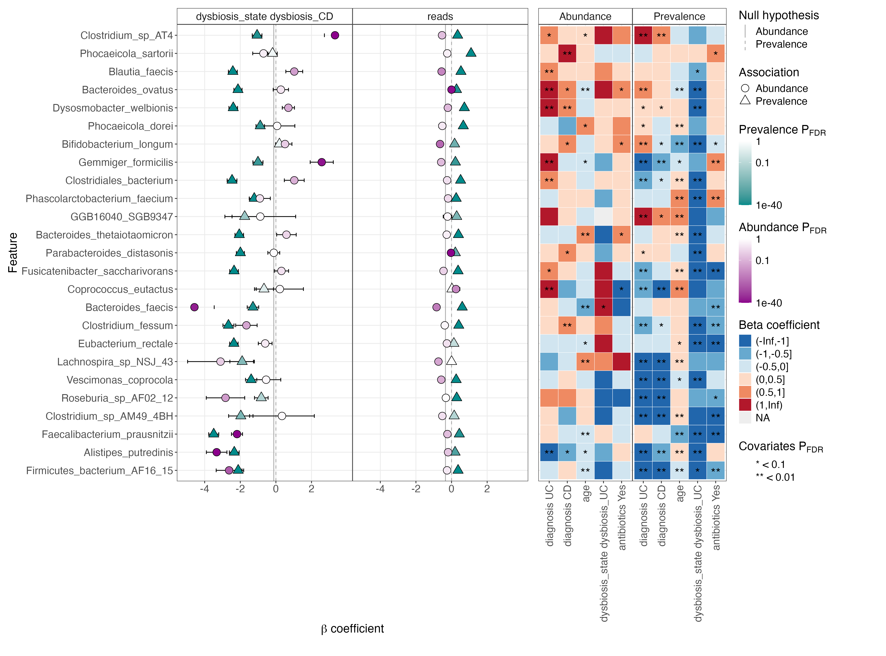

## Introduction

微生物组研究的一个核心问题是识别与特定表型（如健康状况或环境条件）相关的微生物特征。然而，微生物组数据具有**稀疏性**、**组成性**和**异方差性**等特点，使得统计分析面临巨大挑战。近期发表在bioRxiv上的论文《MaAsLin 3: Refining and extending generalized multivariable linear models for meta-omic association discovery》提出了一个强大的解决方案。

## MaAsLin 3文章简介

MaAsLin3 (Microbiome Multivariable Associations with Linear Models) 是哈佛大学Huttenhower C.大佬团队开发的微生物组多变量关联分析R包工具，相比前代主要有三大突破：

1. **同时检测丰度和存在性关联**
   - 传统方法只能检测微生物相对丰度的变化
   - MaAsLin 3通过分步建模，分别检测：
     * 存在/缺失（Prevalence）
     * 非零时的丰度变化（Abundance）


2. **创新的组成性校正方法**
   - 通过中位数系数比较策略推断绝对丰度变化
   - 支持实验性绝对定量数据（如spike-in）

3. **扩展的分析能力**
   - 支持混合效应模型
   - 新增有序预测变量分析
   - 支持特征特异性协变量（如宏转录组中的DNA丰度）

### 性能表现

在模拟数据测试中，MaAsLin 3展现出显著优势：
- 在50个以上样本时F1分数最高
- 平均精确度≥0.82，优于同类工具
- 系数估计偏差最小（仅-12%）


### 在IBD研究中的新发现

应用MaAsLin 3分析HMP2炎症性肠病(IBD)数据库时发现：
- 77%的显著关联是存在性（而非丰度）变化
- 确认了成人IBD中Enterocloster spp.的富集
- 首次发现Dysosmobacter welbionis在IBD中的存在性降低


### 实际应用建议

1. **数据类型选择**：
   - 优先使用spike-in或qPCR绝对定量数据
   - 相对丰度数据需启用中位数校正

2. **模型设定**：
   ```R
   # 基础模型
   maaslin3(
     input_data = features,
     input_metadata = metadata,
     normalization = "TSS",
     transform = "LOG",
     analysis_method = "LM"
   )
   ```

3. **结果解读**：
   - 关注q-value<0.1且|β|>1的关联
   - 区分丰度与存在性变化的生物学意义

## 使用教程

官方教程：<https://github.com/biobakery/biobakery/wiki/MaAsLin3>

### 安装MaAsLin 3

最新开发版的MaAsLin 3可通过devtools工具包从GitHub安装。

稳定版MaAsLin 3可通过BiocManager安装：
```R
if (!require("BiocManager", quietly = TRUE))
    install.packages("BiocManager")
BiocManager::install("remotes")
BiocManager::install("biobakery/maaslin3")
```
运行前需加载依赖库：
```R
for (lib in c('maaslin3', 'dplyr', 'ggplot2', 'knitr', 'kableExtra')) {
    suppressPackageStartupMessages(require(lib, character.only = TRUE))
}
```

### 使用MaAsLin 3进行微生物组关联分析

运行MaAsLin 3需要提供以下数据：
- 样本特征丰度表（需保留零值）
- 样本元数据表
- 指定元数据与特征存在率（特征出现概率）及丰度（存在时的数量级）关系的公式或固定效应（可添加随机效应）

输出结果包括：
- 关联分析表（含每个特征-元数据组合的效应量及p值）
- 可视化文件夹（含显著关联的摘要图及诊断图）

#### 输入文件要求

需准备两个输入文件：

1.特征丰度数据框
- 格式1：列=特征，行=样本
- 格式2：行=特征，列=样本（转置格式亦可）
- 特征类型：分类单元或基因（支持相对丰度或绝对计数）
- 可接受制表符分隔的文件路径

2.元数据数据框
- 格式1：列=变量，行=样本
- 格式2：行=变量，列=样本（转置格式亦可）
- 变量类型：性别、年龄等
- 可接受制表符分隔的文件路径

注意事项：
1. 允许存在仅出现在一个文件中的样本，分析时会自动剔除不匹配样本
2. 两个文件的样本顺序无需一致，程序会自动对齐
3. 含NA值的样本在模型拟合时会被排除，建议在随机缺失假设下预先剔除或使用多重插补处理

示例文件说明：
示例数据来自人类微生物组计划2（HMP2），存放于MaAsLin 3源码的inst/extdata目录或教程文件库：
- HMP2_taxonomy.tsv：物种丰度子集（行=样本，列=物种）
- HMP2_metadata.tsv：元数据子集（行=样本，列=变量）

数据读取与预处理：
```{r}
# 读取物种丰度表
taxa_table_name <- system.file("extdata", "HMP2_taxonomy.tsv", package = "maaslin3")
taxa_table <- read.csv(taxa_table_name, sep = '\t', row.names = 1)

# 读取元数据表
metadata_name <- system.file("extdata", "HMP2_metadata.tsv", package = "maaslin3")
metadata <- read.csv(metadata_name, sep = '\t', row.names = 1)

# 分类变量因子化（用于IBD与健康对照比较）
metadata$diagnosis <- 
  factor(metadata$diagnosis, levels = c('nonIBD', 'UC', 'CD'))
metadata$dysbiosis_state <- 
  factor(metadata$dysbiosis_state, levels = c('none', 'dysbiosis_UC', 'dysbiosis_CD'))
metadata$antibiotics <- 
  factor(metadata$antibiotics, levels = c('No', 'Yes'))

# 查看数据结构
taxa_table[1:5, 1:5]
metadata[1:5, 1:5]
```

#### 运行MaAsLin 3分析  
MaAsLin 3的运行需要指定以下参数：  
- 丰度表（`input_data`）  
- 元数据表（`input_metadata`）  
- 输出目录（`output`）  
- 分析模型（可通过公式或变量向量指定）  

**模型构建方式**  
1. **公式法**：  
   - 遵循lme4语法规范，可包含：  
     - 固定效应  
     - 随机效应
     - 交互项
     - 多项式项  
   - 分类变量作为固定效应时，各水平将与首个因子水平对比  
   - 支持特殊声明：  
     - `group(variable_name)`：分组预测变量  
     - `ordered(variable_name)`：有序预测变量  
     - `strata(variable_name)`：配对样本的条件逻辑回归  

2. **向量法**：  
   - 通过以下参数指定变量：  
     - `fixed_effects`：固定效应  
     - `random_effects`：随机效应  
     - `group_effects`：分组变量  
     - `ordered_effects`：有序变量  
     - `strata_effects`：配对变量  
   - 注意事项：  
     - 需使用列名而非`$`符号引用变量  
     - 分类变量需预先因子化，或通过`'变量,参考水平;...'`格式指定（如`diagnosis,nonIBD;antibiotics,No`）  

**重要建议**  
- 当存在测序深度数据时，应将其作为协变量纳入模型（`reads`参数），以避免因测序深度差异导致的假阳性关联  

#### HMP2数据实战示例  

以下代码演示如何分析微生物物种与IBD诊断的关联，同时控制抗生素使用、年龄和测序深度的影响：  
```{r eval=FALSE}
set.seed(1)
fit_out <- maaslin3(
    input_data = taxa_table,
    input_metadata = metadata,
    output = 'hmp2_output',
    formula = '~ diagnosis + dysbiosis_state + antibiotics + age + reads',
    normalization = 'TSS',       # 总丰度标准化
    transform = 'LOG',           # 对数转换
    augment = TRUE,              # 启用数据增强（解决逻辑回归线性可分问题）
    standardize = TRUE,          # 连续变量Z-score标准化
    max_significance = 0.1,      # FDR阈值设为0.1
    median_comparison_abundance = TRUE,  # 丰度系数与中位数比较（应对组成性效应）
    median_comparison_prevalence = FALSE,# 存在率系数与0比较
    max_pngs = 250,              # 最大可视化结果数
    cores = 1                    # 单核运行
)
```

**关键参数解析**  
1. **标准化与转换**  
   - `TSS`+`LOG`组合是推荐配置，其他选项详见`?maaslin3`  

2. **统计检验策略**  
   - 丰度关联：默认与特征的中位数系数比较（`median_comparison_abundance=TRUE`），适用于相对丰度数据  
   - 存在率关联：默认与0比较（`median_comparison_prevalence=FALSE`）  

3. **适用场景建议**  
   - 关闭中位数比较的情况：  
     - 研究相对丰度关联  
     - 假设总绝对丰度不变时的绝对关联分析  
     - 使用spike-in或未标准化丰度数据时  

4. **输出控制**  
   - 默认输出详细日志，可通过`verbosity = 'WARN'`减少输出  

**中位数比较机制详解**

当启用`median_comparison`时：  
- **丰度系数**：与所有特征在该元数据上的中位数系数对比，抵消组成性效应  
   - 仅影响p值/q值计算（除非设置`subtract_median=TRUE`才会修正系数值）  
- **存在率系数**：通常保持与0比较，因其不受组成性影响  

该设计确保了：  
1. 相对丰度数据可推断绝对丰度变化  
2. 避免因技术偏差（如测序深度）导致的假关联  

3.3 MaAsLin 3 输出结果解析  
MaAsLin 3的输出包含数据文件和可视化图表两类，完整示例可参考教程文件库中的HMP2分析结果。

#### 核心结果文件  

**1. 显著性关联表 (`significant_results.tsv`)**  
按q值升序列出所有通过显著性检验的关联，字段说明：  

| 字段 | 说明 | 示例值 |  
|------|------|--------|  
| `feature` | 微生物特征名 | Phocaeicola_sartorii |  
| `metadata` | 元数据变量名 | reads |  
| `coef` | 效应量系数 | 1.095 |  
| - 丰度模型：表示元数据每增加1单位，特征相对丰度的2^coef倍变化  
| - 存在率模型：表示对数几率（log-odds）的变化量 |  
| `null_hypothesis` | 零假设值（0或中位数） | 0 |  
| `qval_individual` | 个体检验FDR校正q值 | 1.06E-40 |  
| `qval_joint` | 联合检验q值（基于Beta(1,2)分布计算） | 1.14E-40 |  
| `model` | 模型类型（abundance/prevalence） | prevalence |  


#### 完整输出文件结构  
**数据文件**  
| 文件/目录 | 内容 |  
|-----------|------|  
| `all_results.tsv` | 全量关联结果（含错误信息） |  
| `features/` | 处理后的特征表（过滤→标准化→转换） |  
| `models_*.rds` | 模型对象（需`save_models=TRUE`） |  
| `residuals_*.rds` | 模型残差（线性模型为普通残差，逻辑模型为偏差残差） |  
| `maaslin3.log` | 完整运行日志（含参数设置与报错信息） |  

**可视化文件**  
1. **摘要图 (`summary_plot.pdf`)**  
   - 左：系数热图（*表示q<0.1，**表示q<0.01）  
   - 右：显著关联的效应量排序图  
   


2. **关联详图 (`association_plots/`)**  
   - 连续变量：散点图（丰度）或箱线图（存在率）  
   - 分类变量：箱线图（丰度）或网格图（存在率）  
   - 图表右上角标注：q值、总样本数、非零样本数  


#### 诊断与验证要点  
1. **错误排查**  
   - 检查`all_results.tsv`的`error`列：模型拟合失败会标记错误  
   - 启用`warn_prevalence=TRUE`时，存在率关联可能受丰度影响（需通过可视化验证）  

2. **有效性验证**  
   - 分类变量：每组至少10个样本（丰度模型）且存在/缺失样本均≥10（存在率模型）  
   - 连续变量：通过散点图检查异常值影响  
   - 超大系数（|coef|>15）：需验证：  
     - 样本量充足（建议样本数≥10×变量数）  
     - 元数据无多重共线性  
     - 随机效应设置合理  

3. **多重检验校正**  
   - 默认对所有关联进行FDR校正，若需聚焦特定变量，可单独校正目标p值  


#### 结果重绘功能

通过`maaslin_plot_results_from_output`可重新生成图表（无需原始R对象）：  

```R
# 示例：指定热图与系数图的元数据变量
maaslin_plot_results_from_output(
    output_dir = "hmp2_output",
    heatmap_vars = c("diagnosis", "dysbiosis_state"),
    coef_plot_vars = c("age", "reads")
)
```

更多高级功能，请查看<https://github.com/biobakery/biobakery/wiki/MaAsLin3#4-advanced-topics>

## References
1. Nickols, W.A., Kuntz, T., Shen, J., Maharjan, S., Mallick, H., Franzosa, E.A., Thompson, K.N., Nearing, J.T., and Huttenhower, C. (2024). MaAsLin 3: refining and extending generalized multivariable linear models for meta-omic association discovery. Preprint at bioRxiv, https://doi.org/10.1101/2024.12.13.628459 https://doi.org/10.1101/2024.12.13.628459.
2. https://github.com/biobakery/biobakery/wiki/MaAsLin3