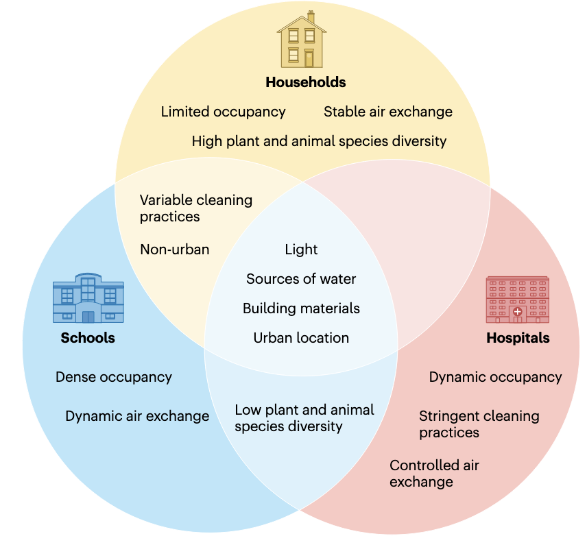

## Introduction

在现代社会，人们平均有超过90%的时间在室内度过——无论是家中、办公室，还是学校或医院。然而，我们很少意识到，这些封闭空间并非“无菌”环境，而是充满了肉眼看不见的微生物群落，它们构成了复杂的室内微生物组（Indoor Microbiome）。

从地板上的灰尘到空调系统的滤网，从厨房台面到浴室的水龙头，微生物无处不在。它们有些来自人体（如皮肤和肠道菌群），有些通过空气、物品或宠物进入室内，还有些在建筑材料和管道中顽强生存。近年来，科学研究逐渐揭示，这些微小的生命不仅影响我们的健康——从免疫系统的发育到过敏和感染的风险——还可能通过“微生物-环境-宿主”的互动，塑造我们的长期福祉。

随着城市化进程加速和建筑密闭性提高，室内微生物组的平衡变得愈发重要。本文介绍一些关于室内微生物组的研究进展，探讨它们对人类健康的潜在影响。

## 室内微生物组与健康

Gilbert, J.A., Hartmann, E.M. The indoors microbiome and human health. Nat Rev Microbiol 22, 742–755 (2024). https://doi.org/10.1038/s41579-024-01077-3

先看一篇比较新的发表在《Nature Reviews Microbiology》的综述文章对室内微生物有个整体的概念。这篇文章探讨了建筑环境——人类大部分时间居住的地方——的微生物生态对免疫、内分泌和神经健康的影响，还提出了利用室内微生物组来改善健康的策略。

### 室内微生物组

室内微生物组与室外环境存在显著差异，主要受人类活动和建筑特性的影响。室内环境通常干燥且营养匮乏，微生物大多来自人体和环境输入。人类皮肤相关的细菌如葡萄球菌和链球菌在频繁接触的表面占主导，而建筑管道内部则以环境菌为主。不同场所的微生物特征各异：农场家庭富含动物粪便相关菌种，医院环境则常见致病菌如假单胞菌。每个人每小时会向周围释放大量微生物颗粒，使得每个室内空间都形成独特的微生物群落。空气流通和建筑材料选择会显著影响微生物定植，例如厨房台面的微生物组成与居民对食品安全的重视程度相关，而浴室则容易滋生肠道相关菌群。即使在严格消毒的医院，耐甲氧西林金黄色葡萄球菌等病原体仍可能持续存在，凸显了室内微生物管理的重要性。

### 室内微生物生态学

要实现健康的室内环境，必须将微生物组研究与室内环境质量概念相结合。早期的研究主要集中于阐述室内空间中的细菌和真菌的分类多样性。随着技术进步，研究者开始对包括古菌和病毒在内的广义微生物多样性进行特征阐述，并探索它们的功能代谢特性。全面了解室内微生物组的真实功能和分类多样性，将使我们更接近实现健康建筑设计的崇高目标。

#### 抗菌耐药性

室内微生物组中抗菌耐药性基因的分布是一个重要研究领域。多个研究发现抗菌化学品和清洁实践与室内尘埃中的抗菌耐药性基因存在关联。医院环境尤其值得关注，研究表明高流量诊所地面上存在比其他环境更多的临床相关抗菌耐药性基因。患者与环境之间可能存在抗菌耐药性基因的交换，这种现象在新生儿重症监护环境中尤为明显。

建筑管道系统是另一个值得关注的区域。淋浴软管和喷头中的微生物组受到管道材料类型和水源的影响，而水槽排水口由于接收药物和个人护理产品残留，其抗菌耐药性问题尤为突出。

#### 细菌和真菌的生存能力和代谢

室内微生物的生存能力和代谢活动受到多种因素影响：
- 设计因素：如照明和材料选择会影响微生物种类及其生存时间
- 湿度条件：不同程度的湿润可以诱导真菌生长，使用"湿润时间"框架可以对其进行定量建模
- 水的存在：在持续潮湿环境（如建筑管道）中，微生物群落的丰度和多样性受到水流速率的强烈影响

值得注意的是，在遭受湿气问题的建筑物内部，发霉材料与相连空间之间的物理距离会影响表面真菌的分布。实验室模拟中还观察到细菌与真菌之间的代谢互动。

#### 病毒和古菌

1. 病毒动态：
- 托儿所的病毒组呈现季节性变化，冬季以人源病毒为主
- 病毒来源多样，包括人类、宠物、植物及外部环境
- 噬菌体在调节细菌群体方面具有重要作用，可能成为控制耐药菌的工具

2. 古菌特征：
- 传统检测方法可能低估了古菌存在
- 最新研究表明古菌确实存在于室内尘埃中，且可能具有生存能力
- 产甲烷古菌等严格厌氧菌在特定条件下仍可在室内传播

#### 人类与建筑之间的微生物交换

人类是室内微生物的主要来源：
- 新医院研究表明高接触环境中皮肤相关微生物占主导
- 这一现象在其他环境（飞机舱、交通系统等）中也得到证实
- 研究显示健康成人的微生物组也会受到建筑环境的影响
- 肠道来源的严格厌氧菌（包括某些古菌）在特定条件下仍可在室内存活

这些发现突显了人-环境微生物交换的双向性，为健康建筑设计提供了重要依据。

### 室内微生物组对人类健康的影响

室内微生物组通过多种途径影响人类健康。微生物暴露不仅可能导致感染性疾病，还会影响免疫系统发育，并与多种慢性疾病的发生发展相关。城市化进程带来的微生物多样性降低，可能与抑郁症、肥胖、过敏性疾病等健康风险的增加存在关联。

#### 感染性疾病
建筑环境在疾病传播中扮演重要角色，这在COVID-19大流行中得到充分印证。医院获得性感染尤其值得关注，其本质是患者、医护人员与医院微生物环境互动的结果。值得注意的是，某些常见共生菌（如金黄色葡萄球菌）在医院环境中可能演变为耐药菌株（如MRSA）。消毒剂和抗菌材料的广泛使用可能通过选择压力促进耐药性的产生，这一现象在家庭环境中同样存在。儿童因免疫系统发育不完善，更容易受到环境病原体的影响。

#### 代谢性疾病
城市化带来的生活方式改变显著影响了人类微生物组。肠道菌群通过调节能量代谢和脂肪储存，在肥胖发生中起关键作用。研究表明，户外活动时间的减少和自然环境接触的匮乏，可能导致肠道菌群多样性下降，进而增加代谢疾病风险。虽然直接证据有限，但室内微生物多样性降低可能是推动肥胖流行的重要因素之一。

#### 心理健康
建筑环境可能通过"肠-脑轴"影响心理健康。现代建筑环境中微生物暴露模式的改变，加上城市生活压力，可能导致肠道菌群失调，进而影响神经递质产生、诱发炎症反应，最终增加抑郁和焦虑风险。这一领域的研究尚处于起步阶段，但已显示出微生物-神经-免疫互作的重要性。

#### 过敏性疾病
著名的"卫生假说"为理解微生物暴露与过敏的关系提供了框架。阿米什人与赫特莱特儿童的对比研究显示，丰富的农场微生物暴露可显著降低哮喘风险。室内环境中的微生物代谢产物（如脂多糖）通过调节Th1/Th2免疫平衡影响过敏发生。生命早期接触特定细菌（如厚壁菌门）对预防过敏至关重要，而建筑潮湿等问题可能促进致敏微生物的生长。

这些发现突显了建筑环境设计在维护健康方面的重要性，需要平衡感染防控与有益微生物暴露的关系。

### 创建健康建筑

在建筑创新浪潮中，"健康建筑"理念正成为连接人居环境与生态健康的重要纽带。这一理念超越了传统建筑标准，将微生物组管理纳入整体设计框架，创造性地平衡了健康效益与可持续性目标。

现代健康建筑通过三大核心要素重塑人居环境：
1. **生物友好设计**：采用透气性建材和动态通风系统，促进有益微生物定植
2. **智能调控系统**：实时监测温湿度等参数，优化微生物生长条件
3. **自然融合设计**：通过垂直绿化和室内园艺增加环境微生物多样性

尽管前景广阔，健康建筑的推广仍面临显著障碍：
- **成本瓶颈**：初期建设费用比传统建筑高出15-30%
- **改造难题**：现有建筑结构限制创新技术的整合应用
- **标准缺失**：全球范围内缺乏统一的微生物安全评估体系

前沿研究正在探索三种突破性干预路径：

1. **城市再野化**
通过立体绿化系统和生态走廊设计，将自然微生物群落引入城市空间。研究显示，接触多样化环境微生物可使儿童过敏风险降低40%。

2. **活性建材开发**
- 3D打印生物材料成功包埋枯草芽孢杆菌孢子
- 智能水凝胶材料可特异性激活对抗病原菌
- 自修复混凝土利用微生物矿化作用延长建筑寿命

3. **微生物组精准调控**
- 益生菌清洁剂重建表面微生物平衡
- 噬菌体涂层有效控制医院耐药菌传播
- 空气循环系统选择性富集有益气溶胶微生物

随着合成生物学进步，下一代健康建筑可能实现：
- 动态响应型微生物群落调控
- 个性化微生物环境定制
- 建筑-人体微生物组双向调节

这种创新范式正在重新定义建筑与健康的边界，为城市化进程中的公共卫生挑战提供全新解决方案。尽管仍需克服技术标准化和长期安全性评估等障碍，健康建筑已展现出改变人类生活方式的巨大潜力。

## 住宅区四季室内外空气微生物组

Indoor/outdoor airborne microbiome characteristics in residential areas across four seasons and its indoor purification (2024). Environ. Int. 190, 108857. https://doi.org/10.1016/j.envint.2024.108857.

发表在Environment International（IF=9.7）的一篇文章，这个研究系统调查了中国广州6个典型住宅区室内外空气微生物组在四季中的分布特征、影响因素及健康风险，并评估了空气净化器的去除效果。研究通过高通量测序和培养方法，揭示了微生物群落结构、粒径分布及其与环境因素的关联。

### 核心发现

1. 微生物浓度与粒径分布
- **季节性差异**：夏季微生物浓度最高（细菌64-905 CFU/m³，真菌4-580 CFU/m³），冬季PM2.5浓度最高（室内68.42μg/m³）。
- **粒径特征**：74.6%的微生物为可吸入颗粒（<4.7μm），其中1.1-4.7μm占比最高（秋季达87.5%），易沉积于肺泡区。

2. 微生物群落组成
- **优势菌群**：室内外均以*Anoxybacillus*（细菌）和*Cladosporium*（真菌）为主，后者冬季占比高达65.8%。
- **功能预测**：室内微生物含人类肠道相关基因，且医院环境中耐药基因（如MRSA）丰度显著高于其他场所。

3. 环境驱动因素
- **关键关联**：温度与*Peanibacillus*正相关（r>0.6, p<0.05），PM2.5促进*Stenotrophomonas*生长；臭氧（O₃）影响细菌代谢。
- **来源解析**：中性模型显示细菌扩散随机性高于真菌（R²=0.694-0.846），秋季随机分布最显著。

4. 健康风险
- **暴露评估**：儿童吸入剂量（ADD）高于成人，秋季风险最高；但危害商数（HQ）均<1，属可接受范围。
- **致病潜力**：检出机会致病菌如*Rhodococcus*（肺脓肿）和*Stenotrophomonas*（耐药性强）。

5. 净化效果
- **空气净化器**：对1.1-4.7μm细菌去除率最高（秋季达49.4%），革兰阴性菌去除优于阳性菌；但对真菌效果有限。

### 研究意义与局限
1. **实践价值**：为湿热气候区住宅微生物污染控制提供数据支持，建议结合通风与净化策略。
2. **创新点**：首次系统量化净化器对微生物粒径选择性去除效应。
3. **局限性**：样本量较小（6个住宅），未考虑居民行为对微生物的直接影响。

## 室内空气微生物的高度分辨率分析

Shen, F., Wang, M., Ma, J., Sun, Y., Zheng, Y., Mu, Q., Li, X., Wu, Y., and Zhu, T. (2024). Height-resolved analysis of indoor airborne microbiome: comparison with floor dust-borne microbiome and the significance of shoe sole dust. Environ. Sci. Technol. 58, 17364–17375. https://doi.org/10.1021/acs.est.4c06218.

发表在Environmental Science & Technology（IF=11.3）的一篇文章，通过创新的被动采样方法，系统分析了室内空气中微生物群落在不同高度（天花板附近H1、成人呼吸高度H2、地面附近H3）的垂直分布特征，并与地板灰尘微生物组进行比较。研究首次量化了鞋底灰尘对室内空气微生物的贡献，揭示了传统地板灰尘样本作为空气微生物替代指标的局限性。

### 核心发现

1. 空气微生物的垂直分层现象
- **多样性梯度**：细菌和真菌的α多样性（如Chao1指数）随高度降低而增加（H1<H2<H3），但香农指数无显著差异，表明物种分布不均匀。

- **群落差异**：细菌在H1与H3间存在弱分层（ANOSIM R=0.07），真菌分层更明显（R=0.18）。中高度（H2）细菌群落变异最大，可能与人类活动扰动相关。

2. 空气与地板灰尘微生物组的显著差异
- **组成差异**：空气中以变形菌门（41.4%）为主，地板灰尘中厚壁菌门（31.4%）更丰富。芽孢杆菌属（空气）与葡萄球菌属（灰尘）分别为优势菌。

- **功能差异**：空气微生物代谢相关基因（如脂质代谢、异生物质降解）更活跃，而灰尘微生物的遗传信息处理通路更丰富（图5）。

3. 鞋底灰尘的关键作用
- **贡献量化**：鞋底灰尘贡献4%空气细菌和14%空气真菌，与地板灰尘贡献相当（细菌4.3% vs 真菌12.6%）。对地板灰尘的贡献更高（细菌25.5%、真菌52.7%）。

- **生态过程**：随机过程（如扩散限制）主导微生物群落构建（>80%），鞋底灰尘通过漂变过程（drift）显著影响真菌群落（贡献79%）。

4. 健康暴露启示
- **采样方法革新**：矿物油被动采样器实现长期连续采样，克服传统主动采样噪音干扰，更贴近真实暴露场景。
- **风险评估**：地板灰尘不能准确代表可吸入微生物，需开展高度分辨研究（如儿童爬行区与成人呼吸区差异）。

### 创新点与局限
1. **方法创新**：
   - 首次采用多高度同步被动采样
   - 建立鞋底灰尘贡献的定量模型（FEAST算法）

2. **实际意义**：
   - 为"再野化"室内微生物组提供新思路（通过鞋底引入有益环境微生物）
   - 提示需关注鞋底作为病原传播载体的风险

3. **研究局限**：
   - 未比较主动/被动采样器的捕获效率
   - 样本量较小（5个场所）
   - 未评估室外空气影响

## 新加坡食品中心微生物组

Teo, J.J.Y., Ho, E.X.P., Ng, A.H.Q., How, S.H.C., Chng, K.R., Ateş, Y.C., Fau’di, M.T., Aung, K.T., and Nagarajan, N. (2024). City-wide metagenomic surveillance of food centres reveals location-specific microbial signatures and enrichment of antibiotic resistance genes. Preprint at medRxiv, https://doi.org/10.1101/2024.07.28.24310840 https://doi.org/10.1101/2024.07.28.24310840.

这项研究首次对新加坡16个食品中心(又称小贩中心)进行了城市规模的宏基因组监测(n=240样本)，旨在了解这些高人流环境中微生物(细菌、古菌、真菌、病毒)和非微生物DNA的分布特征。食品中心作为亚洲许多大城市主要的食品消费场所，其微生物组成可能对公共卫生有重要影响，特别是在全球食源性和污染物相关疾病发病率上升的背景下。研究重点关注了食品中心特有的微生物特征、抗生素抗性基因(ARGs)的富集情况，以及与食品相关的微生物特征。

研究团队在两个时间点(2019年3月和2022年7月)采集了样本，采用MetaSUB协议对食品中心桌面进行拭子采样，使用Isohelix DNA Buccal Swabs收集样本。DNA提取后进行了深度shotgun宏基因组测序(平均每样本2000万reads)。数据分析使用了Kraken 2和Bracken进行分类分析，并采用多种统计和机器学习方法进行特征分析。

### 主要发现

1. 食品中心特有的微生物特征
研究发现食品中心宏基因组中富含与食品相关的DNA特征，这些特征可以部分解释观察到的微生物谱(解释了44%的变异)。研究发现了特定的食物-微生物关联，如肠杆菌科与鱼类之间的关联。

2. 位置特异性微生物特征
通过机器学习分析，研究确定了22种微生物物种可以作为不同食品中心高度准确(>80%)的位置特异性标志，其中一些标志在3年后仍然存在。这些标志性微生物的平均相对丰度为4.5%，表明它们是宏基因组中的非优势物种。

3. 抗生素抗性基因富集
食品中心显示出相对于其他非医疗环境(>2.5倍)和医院环境(某些病原体高出1个数量级)的抗生素抗性基因(ARGs)富集。特别是，粘菌素抗性在食品中心最为富集(>1.5倍)。

4. 病原体富集情况
研究发现了高优先级ESKAPE病原体(如肺炎克雷伯菌、肠杆菌属等)在食品中心显著富集(>3倍)，甚至比医院环境还要高。

这项研究首次大规模应用shotgun宏基因组方法对食品中心环境进行监测，证明了该方法在追踪环境中微生物和相关关注基因方面的实用性。研究发现食品中心具有独特的微生物特征，这些特征既反映了食品来源的变化，也反映了地理位置和相关环境因素的影响。研究结果强调了食品中心环境作为抗生素抗性监测重要节点的公共卫生意义，并为未来旨在降低感染风险的各种清洁和行为干预策略研究提供了基础。

## References
1. Gilbert, J.A., Hartmann, E.M. The indoors microbiome and human health. Nat Rev Microbiol 22, 742–755 (2024). https://doi.org/10.1038/s41579-024-01077-3
2. Indoor/outdoor airborne microbiome characteristics in residential areas across four seasons and its indoor purification (2024). Environ. Int. 190, 108857. https://doi.org/10.1016/j.envint.2024.108857.
3. Shen, F., Wang, M., Ma, J., Sun, Y., Zheng, Y., Mu, Q., Li, X., Wu, Y., and Zhu, T. (2024). Height-resolved analysis of indoor airborne microbiome: comparison with floor dust-borne microbiome and the significance of shoe sole dust. Environ. Sci. Technol. 58, 17364–17375. https://doi.org/10.1021/acs.est.4c06218.
4. Teo, J.J.Y., Ho, E.X.P., Ng, A.H.Q., How, S.H.C., Chng, K.R., Ateş, Y.C., Fau’di, M.T., Aung, K.T., and Nagarajan, N. (2024). City-wide metagenomic surveillance of food centres reveals location-specific microbial signatures and enrichment of antibiotic resistance genes. Preprint at medRxiv, https://doi.org/10.1101/2024.07.28.24310840 https://doi.org/10.1101/2024.07.28.24310840.
