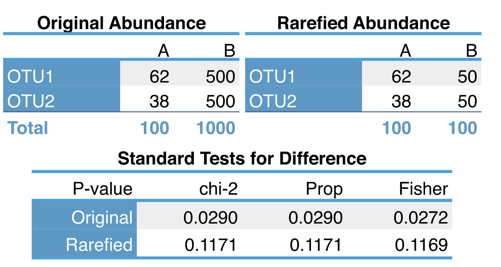
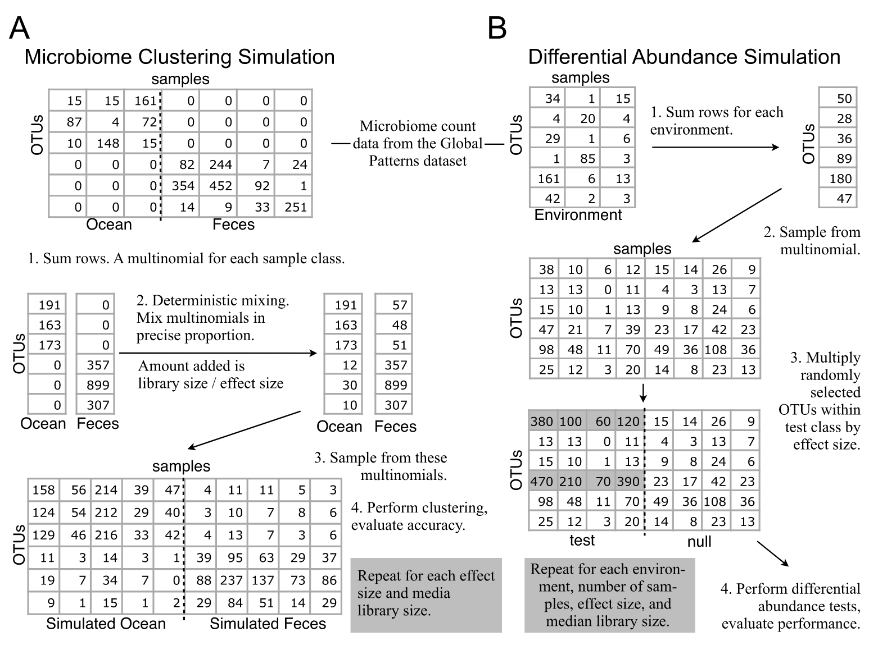
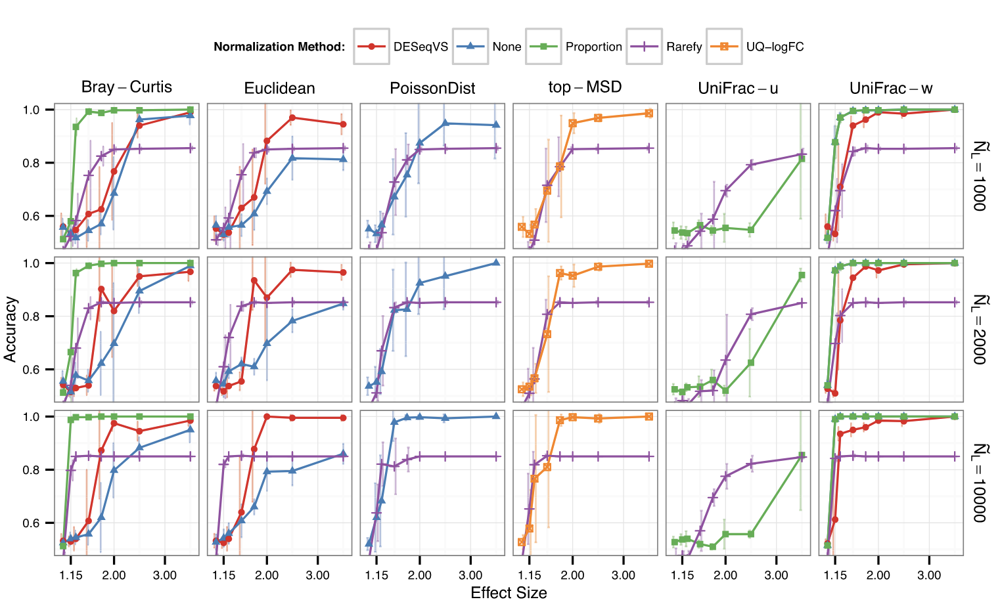
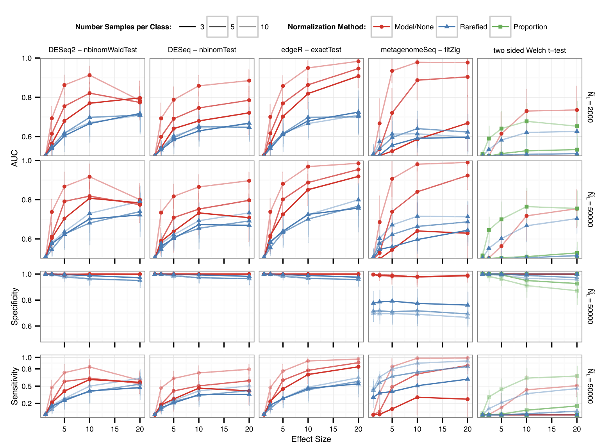

## Introduction

最近有审稿人的comments中建议阅读大佬Susan Holmes (2014) 的经典论文《Waste Not, Want Not: Why Rarefying Microbiome Data Is Inadmissible》，参考在自己的分析中。这篇文章深入探讨了微生物组数据分析中常用的稀释（rarefying）方法的缺陷，并提出了更合适的统计模型。虽然这篇文章已经发表了10多年，但其观点仍然具有重要的参考价值。

## 🌱 微生物组测序的统计挑战

高通量 DNA 测序技术让微生物组研究进入爆发期。通过测定来自不同环境或样本（如人体肠道、土壤、水体）的 16S rRNA 序列或宏基因组原始读数，研究者可以获得一个 OTU（操作分类单位，又可视作微生物“物种”）在各样本中的丰度矩阵。

但一个关键问题是：不同样本之间测序深度存在显著差异——每个样本的读数（library size）可能相差一个数量级。这样直接比较 OTU 计数会导致误导。为此，研究者常用两种“归一化”方式：

1. **按比例（proportion）处理**：将各 OTU 计数除以总读数。
2. **稀释抽平（rarefying）**：随机抽取每个样本相同数量的读数（即归到最小 library size）。

然而，McMurdie 和 Holmes 指出，这两种方法都存在严重统计缺陷。作者主张，应该使用更先进的统计模型，比如基于负二项分布的差异表达分析方法（edgeR、DESeq），这些方法能更好地处理 library size 差异和数据方差结构。

## 稀释法的两个主要问题

### 损失统计能力（statistical power）

论文通过例子演示了 rarefying 带来的信息损失，例如样本 B 从 1000 个读数降到 100 后，估计微生物丰度比例的方差显著增加，导致对显著性差异的检验能力下降。即使两个样本在真实生态差异上有明显变化，稀释后信号可能被掩盖。

### 丢弃样本

在 rarefying 流程中，通常设定一个最小读数阈值，低于阈值的样本被剔除。例如，如果用 500 读数标准化，而一个 sample 只有 300，则该 sample 会被完全删除。论文中指出，这可能导致有效样本被剔除，从而降低聚类分析或差异检测的结果质量。

## 替代方案：基于负二项分布的混合模型

论文提出将微生物组计数数据视作负二项分布（Negative Binomial, NB）的一种表现：

* 样本 j 的总体读数可视为 Poisson 随机变量。
* OTU i 在样本 j 的计数 $K\[i,j] \~ NB(mean = s\_j × μ\_i, dispersion = φ\_i)$，其中 $s\_j$ 是 library size 缩放因子，$μ\_i$ 是 OTU 的相对丰度，$φ\_i$ 捕捉 biological variability 和过度离散性。

这种模型有三个优点：

1. 统计理论支持：standard 方法来自 RNA-Seq 领域（edgeR、DESeq）。
2. 变异估计更准确：考虑方差随着丰度增长而变化，避免样本深度不同导致的 heteroscedasticity。
3. 没丢样本：所有样本保留，避免信息丢失。

此外还提及另一种方法，zero-inflated Gaussian 模型（metagenomeSeq），适合候选 OTU 零计数很多的情况，但在生物重复较少时假阳性率仍然较高。

## 模拟实验

McMurdie 和 Holmes 为了系统地评估不同归一化和统计分析方法的性能，精心设计了两类模拟实验，分别聚焦于 **样本聚类准确性** 与 **差异丰度检出能力**。这些实验通过真实数据构造，并在可控的干预条件下测试各方法的稳健性与准确度，具有非常强的说服力。

### A:样本聚类的准确性（Clustering Accuracy）

作者从真实的微生物组数据集中（如“soil”和“ocean”数据）选取样本，构建两个组成明显不同的样本群体，并在这些群体中模拟不同的测序深度（library size），例如一个样本有 10,000 reads，而另一个只有 1,000 reads，反映现实中常见的不平衡情况。

接着，他们使用不同的归一化方式处理这些样本，包括：

* **稀释（rarefying）**：所有样本统一稀释至相同深度。
* **比例归一化（proportions）**：每个 OTU 相对其样本总数转换为相对丰度。
* **基于模型的方法（edgeR / DESeq）**：使用负二项分布估计归一化因子并建模。
* **metagenomeSeq**：使用零膨胀正态模型（zero-inflated Gaussian）。

归一化后，再对 OTU 表进行距离计算（Bray-Curtis 或 UniFrac），最后进行聚类（如 PAM 或 hierarchical clustering）以观察样本是否能准确归类。

* **稀释法准确率最低**，尤其当稀释程度较高（即大部分样本初始 read 数远高于稀释阈值）时，稀释过程导致数据大幅减少，聚类准确率明显下降；
* **比例归一化方法略好但仍不稳定**，尤其在物种丰富度差异大时，常低估丰度低但重要的 OTU；
* **edgeR 和 DESeq 准确率最高且最稳定**，能有效识别样本之间真实的结构差异；
* **metagenomeSeq 表现介于中间**，在某些条件下表现尚可，但 replicates 少时不稳定。

这说明：**基于模型的方法不仅能保留样本完整性，还能在复杂多变的测序深度下维持稳定的聚类表现**。

### B:差异丰度检测能力（Differential Abundance Detection）

作者构建了一个 OTU 表，其中一部分 OTU 被设定为“差异丰度 OTU”——它们在组 A 与组 B 中的丰度存在系统性差异（如增加 2 倍或 5 倍），而其余 OTU 丰度一致不变。

通过不同方法处理这些数据并检测差异 OTU，然后使用 **ROC 曲线和 AUC（Area Under Curve）** 来衡量每种方法检出真实差异 OTU 的能力与假阳性控制水平。

edgeR 与 DESeq 明显优于其他方法，具体表现为：

* **AUC 高达 0.95–0.98**，说明检出真正差异 OTU 的能力极强；
* 假阳性率控制良好，尤其在样本数较多时尤为明显；
* **稀释法表现最差**，不仅灵敏度低（漏检多），而且假阳性率高，尤其当稀释阈值较低时更严重；
* metagenomeSeq 在 replicates 较多时接近 edgeR，但在 n=2\~3 样本时性能急剧下降。

此外，作者强调，**稀释法带来的最大问题是“有效样本数的减少”**——本来可以使用 10,000 个 reads 做差异分析，稀释后只剩 1,000 个，等效于用更小的样本重复去估计参数，导致功效大幅下降。

McMurdie & Holmes 在文中总结如下：

* **明确反对 rarefying**：既浪费数据又带来分析偏差，是 inadmissible 的 normalization 方法。
* **推荐基于统计混合模型的方法**：借用 RNA-Seq 的 edgeR、DESeq，甚至 metagenomeSeq。作者还将这些方法整合进 R 包 phyloseq 中，方便微生物组分析。
* **树立统计意识**：研究者应理解 library size、overdispersion 的本质，并采用合适的 GLM（Generalized Linear Model）模型或经验贝叶斯方法，而不是简单采样。

这篇论文自 2014 年发布后对微生物组数据分析流程影响深远：
* 推动了差异丰度分析方法的演进，例如 ANCOM、ALDEx2、Songbird 等工具开始强调 compositional data 和统计模型。
* 2024 年，Schloss 又在 mSphere 中重访 rarefying，提出一些更新观点，可视为对这篇论文的回应和延伸。
* 微生物组数据本质是**成分数据（compositional）**，总和约束 → 需要特殊方法处理，而 NB 模型正是合理起点之一。

## References
1. McMurdie, P.J., and Holmes, S. (2014). Waste not, want not: why rarefying microbiome data is inadmissible. PLOS Comput. Biol. 10, e1003531. https://doi.org/10.1371/journal.pcbi.1003531.

