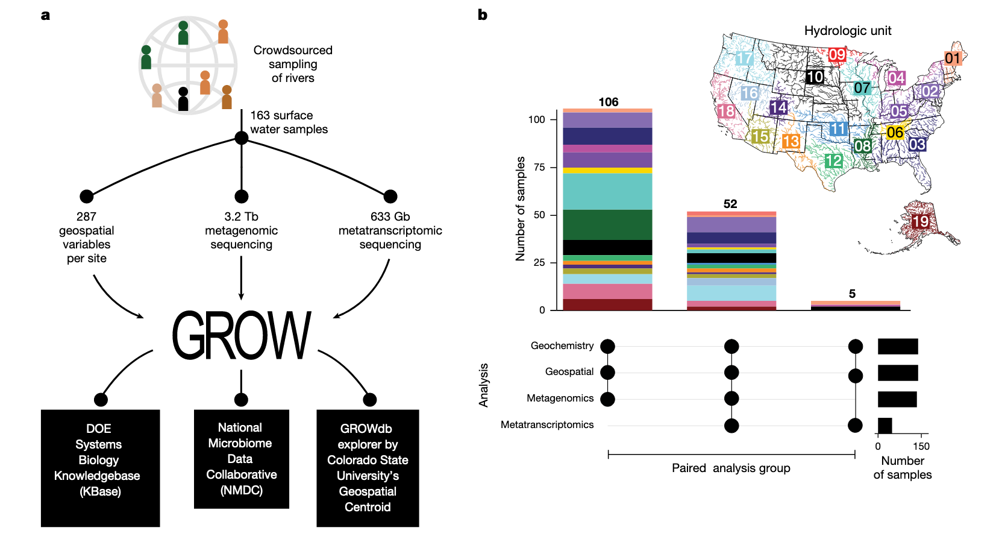
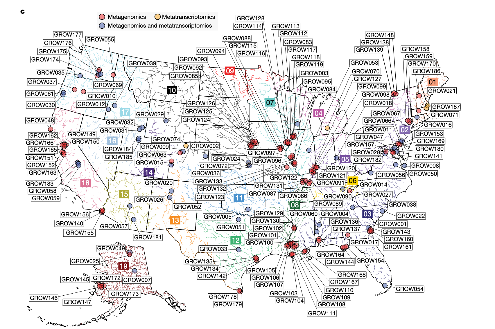
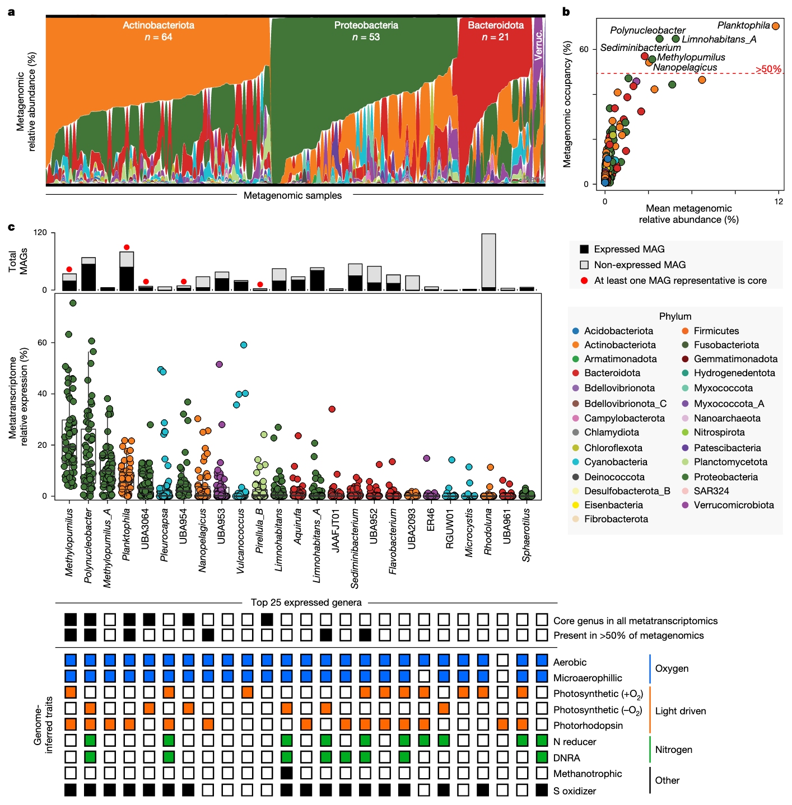
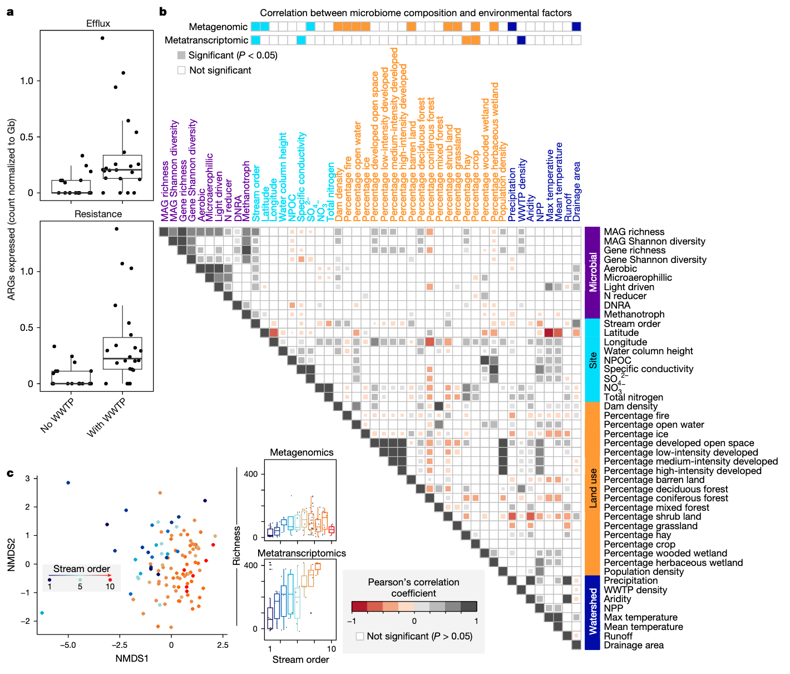
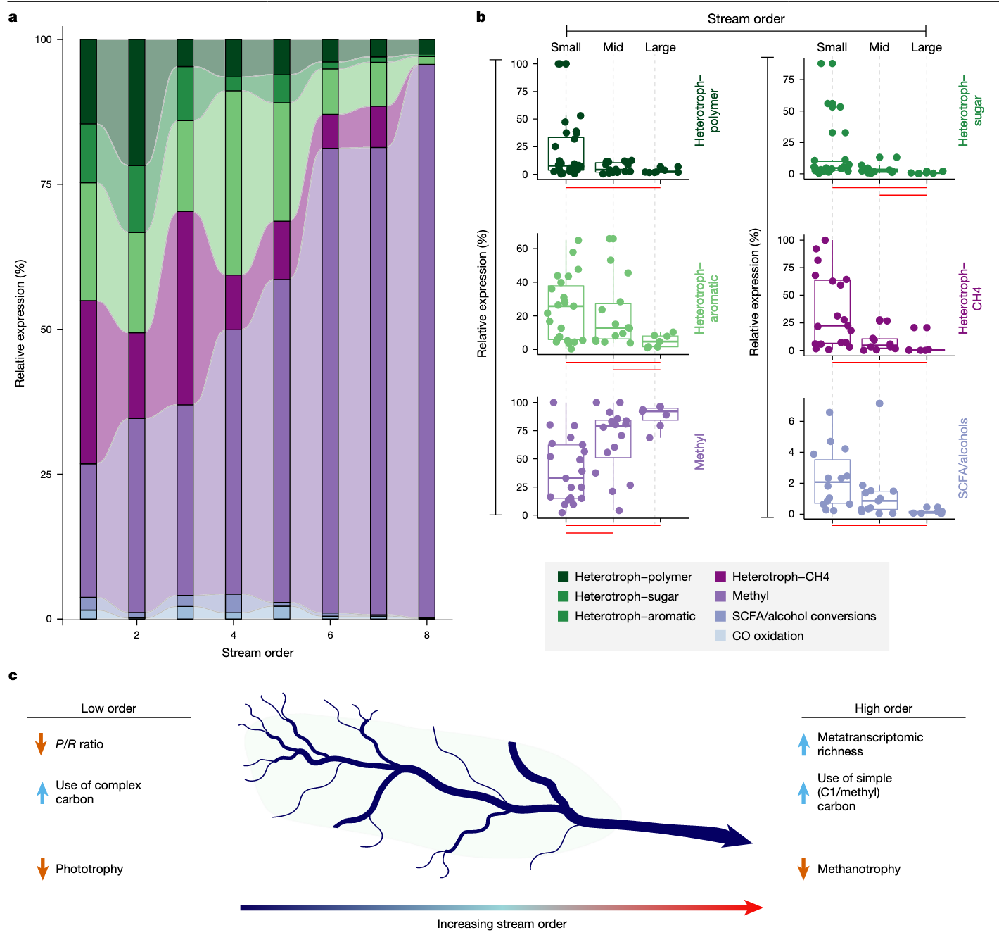

学习一些2025年最新的Nature环境微生物研究文章，了解一下当前较新的研究思路和方法。

1. Borton, M.A., McGivern, B.B., Willi, K.R., Woodcroft, B.J., Mosier, A.C., Singleton, D.M., Bambakidis, T., Pelly, A., Daly, R.A., Liu, F., et al. (2025). A functional microbiome catalogue crowdsourced from north american rivers. Nature 637, 103–112. https://doi.org/10.1038/s41586-024-08240-z.

这篇文章跟上一篇那个类似，采样贡献很大，同时有数据资源性贡献。然后测了宏基因组+宏转录组（所以可以自信的说功能数据库），还提出了河流连续体概念（这种思想可以借鉴）。最终也是没有做验证实验发表在Nature上。

## 北美河流微生物组功能数据库（GROWdb）

在全球气候变化与人类活动加剧的背景下，河流生态系统作为陆地与水生环境的关键连接点，其微生物群落的结构与功能对元素循环、水质维持及生态系统稳定性具有决定性作用。该文章通过创新的众包采样模式与基因组解析技术，构建了首个覆盖北美大陆尺度的河流微生物组功能数据库（GROWdb），为理解河流微生物的生物地理学特征与生态功能提供了突破性视角。

河流是地球表层物质循环的核心枢纽，承担着营养传输、碳氮转化等关键生态功能，同时直接影响人类的水资源安全与生态健康。尽管海洋微生物组已通过全球联盟（如Tara Oceans）得到深入研究，但河流微生物组的研究仍存在显著不足：多数研究依赖16S rRNA基因测序，难以解析功能潜力；宏基因组研究较少恢复宏基因组组装基因组（MAGs），掩盖了未知类群的贡献；采样范围局限于单一河流或流域，缺乏跨系统的普适性结论。

针对这些缺口，本研究旨在通过**众包协作**与**基因组分辨率分析**，构建一个覆盖北美主要流域的河流微生物组功能数据库（GROWdb）。其核心目标包括：（1）解析河流微生物的分类与功能多样性，识别核心类群及其代谢潜力；（2）揭示微生物群落结构与功能的空间驱动因素（如地理、土地利用、溪流等级）；（3）验证河流连续体概念（RCC）在微生物功能层面的适用性；（4）建立微生物组与新兴污染物转化的关联，为水质管理提供依据。

### 研究方法

#### 众包采样与数据整合
研究采用“网络中的网络”模式，联合超过100个团队在北美106个站点采集163个表层水样本，覆盖美国90%的流域（21个水文单元），涵盖不同生态区、溪流等级与流域规模。采样同步记录287项地理空间参数（如土地利用、溪流等级、流域面积）和地球化学数据（如水温、营养盐浓度），确保环境变量的全面性。

#### 测序与分析技术
对样本进行宏基因组和宏转录组测序，获得约3.8Tb数据。通过三种组装方法（MEGAHIT、IDBA-UD、metaSPAdes）生成重叠群，结合MetaBAT2进行分箱，最终获得3825个中高质量MAGs，去重后保留2093个（99%序列一致性）。采用GTDB-tk进行分类注释，DRAM进行功能注释，并通过Bowtie2将测序 reads 映射到MAGs以量化丰度与表达量。

#### 数据库构建

GROWdb通过多平台开放访问：NCBI存储原始测序数据与MAGs；国家微生物组数据协作网（NMDC）链接多组学数据；KBase提供基因组注释与代谢模型；GROWdb Explorer提供交互式可视化工具，实现跨学科数据复用。

### GROWdb的核心特征

GROWdb包含2093个去重MAGs，覆盖27个门，其中10个科、128个属为新分类单元，大量类群仅通过字母数字命名（如未培养细菌UBA类群），凸显河流微生物的未知多样性。与现有淡水MAGs对比，河流与湖泊微生物组成差异显著，且河流样本的基因组覆盖率更高，表明GROWdb填补了河流微生物基因组资源的空白。

通过分析全球266,764个公开宏基因组数据，发现GROWdb的MAGs存在于90%的河流样本和46%的淡水样本中，且在废水、土壤等环境中也有检出，印证了河流作为“景观整合者”的角色——其微生物群落整合了陆地、水生等多源输入。

### 核心河流微生物组的功能特征

宏基因组分析显示，放线菌门（Actinobacteriota）、变形菌门（Proteobacteria）、拟杆菌门（Bacteroidota）和疣微菌门（Verrucomicrobiota）为优势类群，占所有样本相对丰度的主导地位。其中，*Planktophilia*属（放线菌门）在70%的样本中存在，平均相对丰度达12%，是分布最广且最丰富的类群；*Limnohabitans_A*、*Polynucleobacter*等5个属也存在于50%以上的样本中。

宏转录组分析进一步识别出25个高表达属，其中*Methylopumilus*、*Polynucleobacter*、*Planktophilia*等6个属在所有转录组样本中均有活性（核心活性属）。这些类群普遍具备**有氧呼吸**（编码电子传递链复合体）和**光驱动代谢**（光合系统、视紫红质）能力，部分还能降解硫、甲烷或参与氮还原，体现了代谢冗余——这是河流微生物应对环境波动的关键策略。

硝化作用是河流氮循环的核心环节，GROWdb识别出1个*Nitrosomonas*属MAG（氨氧化）和2个*Nitrospiraceae*科MAG（亚硝酸盐氧化），均编码抗紫外线损伤和抗氧化应激的基因（如光解酶、超氧化物歧化酶），适应表层水环境。此外，检测到17个*Patescibacteria*门MAGs，虽为专性发酵菌（无法呼吸），但在表层水中通过生物膜或低氧微生境存活，且其丰度随河流规模增加而降低，暗示与河床交换的关联。

### 新兴污染物的微生物响应

河流作为人类活动的“受体”，持续暴露于抗生素、微塑料等新兴污染物。GROWdb分析显示，54.3%的MAGs（1135个）编码25类抗生素抗性基因（ARGs），其中糖肽抗性基因（*van*）数量最多（1219个），但多数不位于典型抗性基因簇中，功能待验证。30%的ARGs在转录组中表达，且污水处理厂（WWTP）影响的站点中，外排泵和ARGs的表达量显著更高，表明人类活动驱动抗性基因的活跃传播。

此外，微生物还编码微塑料（如 terephthalate）、氟化物等污染物的转化基因。例如，*Limnohabitans_A*表达PET降解通路的下游基因，*Polynucleobacter*表达脱卤酶（参与脱氟），且这些基因的表达与城市用地比例正相关，揭示微生物对人为污染的适应性代谢潜力。

### 大陆尺度的微生物地理模式

通过Mantel检验与方差分解分析，发现**溪流等级**（反映河流规模）是微生物组成的最强驱动因素，其影响超过纬度、总碳等传统变量。宏基因组和宏转录组组成均随溪流等级显著变化：基因组丰富度在6级溪流达到峰值，转录组丰富度随等级升高持续增加，表明功能活性的调控机制与基因存在性不同。

温度也是关键驱动因素，光驱动代谢（如光合系统、视紫红质）的基因表达与流域最高温度显著相关，核心类群（如*Methylopumilus*）通过光捕获适应温度变化，暗示气候对河流微生物功能的潜在影响。

微生物群落组成在Omernik生态区和水文单元（HUC）尺度上存在显著分异——干旱草原区与湿润亚热带区的群落结构差异明显，印证了陆地输入对河流微生物的“接种”效应。但功能组成未表现出地理分异，表明分类水平的变化被功能冗余补偿，这为跨区域的微生物管理指标开发提供了依据。

### 河流连续体概念的功能扩展

河流连续体概念（RCC）预测：随河流规模增大，陆地输入影响减弱，生物多样性先增后减。本研究首次将RCC扩展至微生物功能层面：

- **多样性模式**：基因组丰富度在6级溪流达峰，符合RCC中“中等规模河流生物多样性最高”的预测；但转录组丰富度随等级升高而增加，反映功能活性对河流规模的独特响应。
- **碳利用策略**：低等级溪流中，微生物高表达聚合物、芳香族化合物降解基因（依赖陆地输入）；高等级河流中，甲基营养基因（如甲醇氧化）表达增强（依赖自生源碳），印证RCC中“陆地碳输入随河流规模降低”的预测。
- **光代谢梯度**：高等级河流中光驱动代谢基因表达显著增加，与RCC中“大型河流光照更充足”的特征一致，且光合/呼吸（P/R）比在6-8级溪流最高，支持RCC的能量流动模型。

### 研究结论

GROWdb通过众包模式与基因组解析，首次系统揭示了北美河流微生物的功能多样性与地理驱动机制，其创新点包括：（1）建立首个跨大陆尺度的河流微生物基因组资源，填补分类与功能研究的缺口；（2）阐明微生物对新兴污染物的代谢潜力，为水质监测提供生物标志物；（3）验证RCC在微生物功能层面的适用性，为生态预测模型提供框架。

未来研究可基于GROWdb探索：（1）长期气候变化对河流微生物功能的影响；（2）污染物转化基因的水平转移机制；（3）跨大陆河流微生物的对比分析。作为开放数据库，GROWdb为 watershed 预测模型与微生物组管理实践提供了基础，助力应对水资源可持续性与环境变化的挑战。
