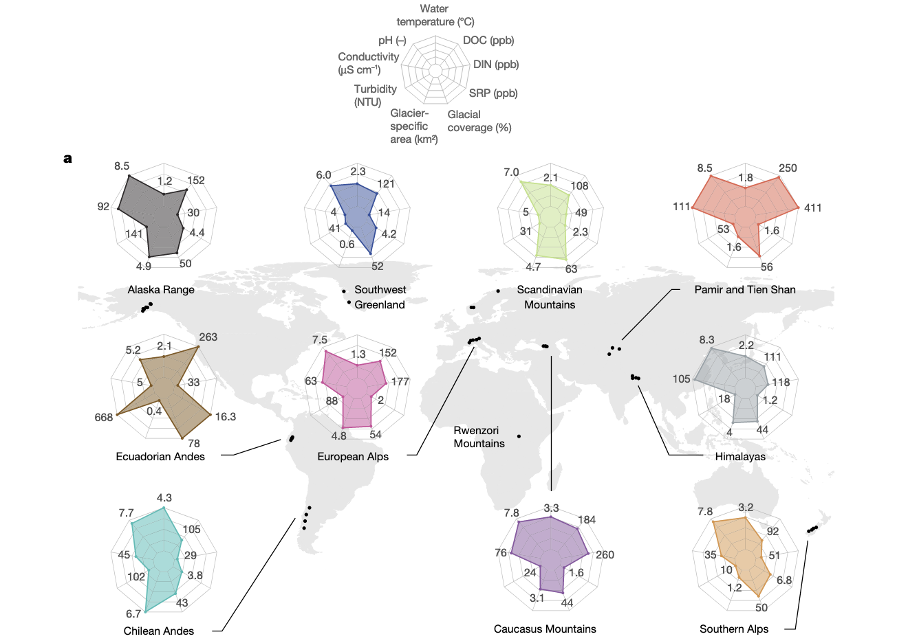
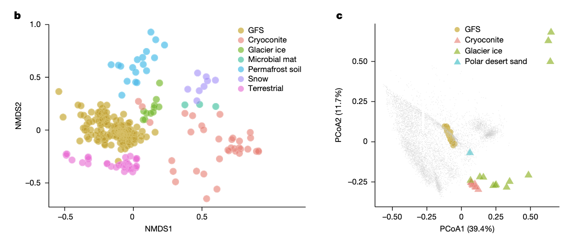
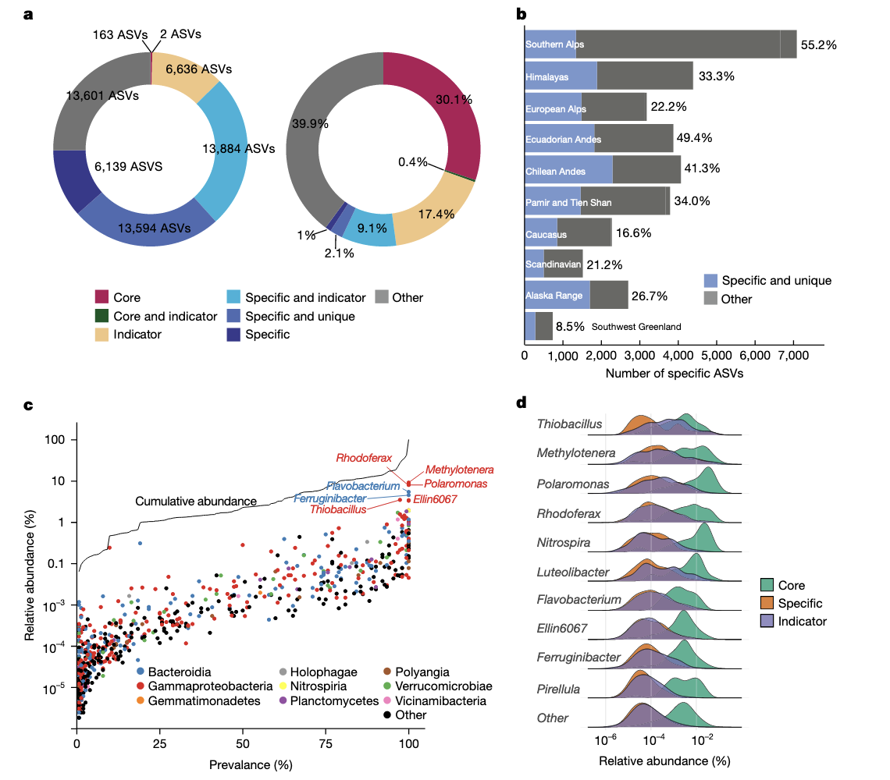
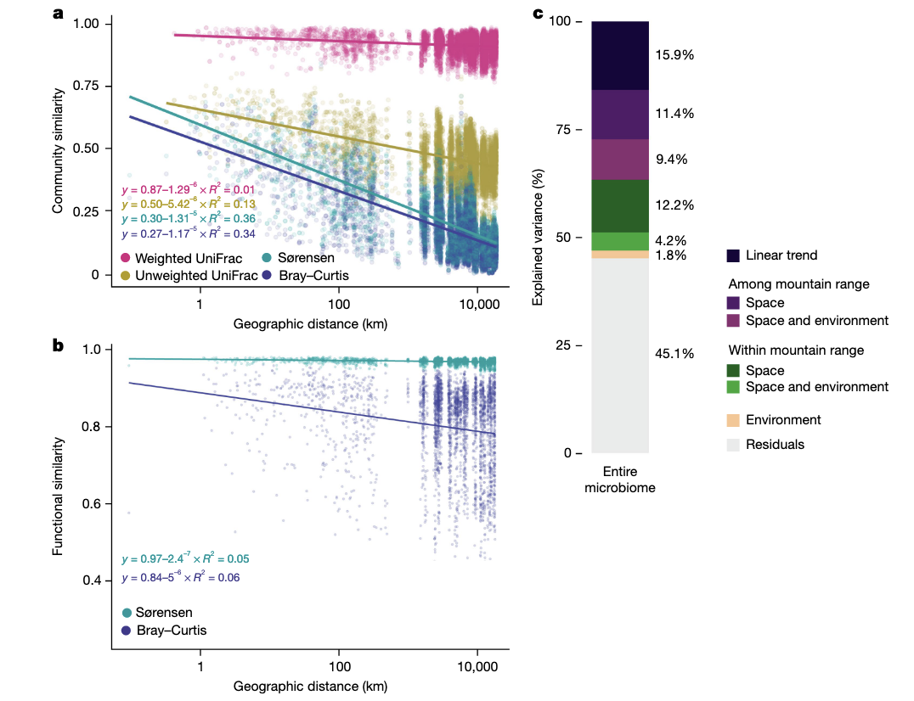
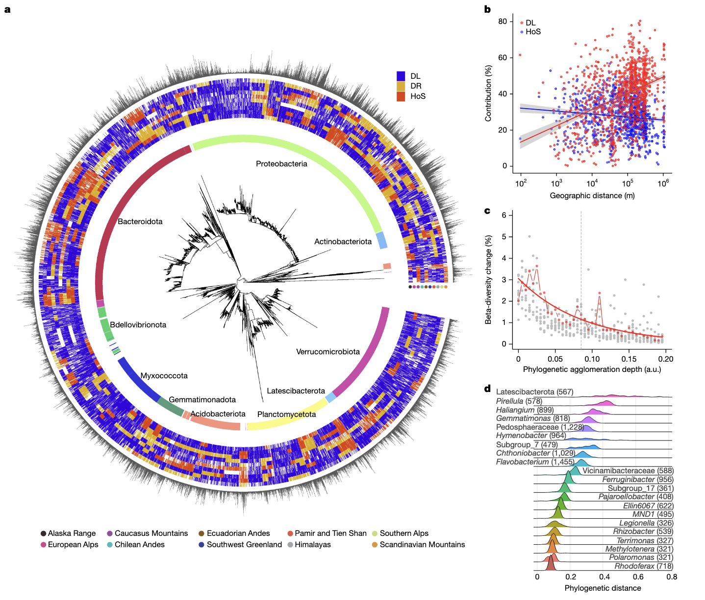

学习一些2025年最新的Nature环境微生物研究文章，了解一下当前较新的研究思路和方法。

1. Ezzat, L., Peter, H., Bourquin, M., Busi, S.B., Michoud, G., Fodelianakis, S., Kohler, T.J., Lamy, T., Geers, A., Pramateftaki, P., et al. (2025). Diversity and biogeography of the bacterial microbiome in glacier-fed streams. Nature, 1–9. https://doi.org/10.1038/s41586-024-08313-z.

这篇文章采样贡献很大，全球尺度的，然后冰川补给溪流（Glacier-fed Streams, GFSs）在讲故事时和气候变化联系起来，还有一些生态方面的讨论，最终也是没有做实验发表在Nature上。

## 冰川补给溪流中细菌微生物组的多样性和生物地理学

气候变化正以前所未有的速度改变着地球的生态系统，其中山地冰川的快速融化尤为显著。冰川补给溪流（Glacier-fed Streams, GFSs）作为受冰川融化直接影响的生态系统，正面临着深刻的变革。GFSs 是寒冷、寡营养且不稳定的生态系统，其中生命主要由微生物生物膜主导。然而，在过往很长一段时间里，我们对 GFSs 微生物组的了解犹如雾里看花，极为匮乏。这种认知的不足严重阻碍了我们准确理解其对冰川退缩的响应机制。因此，开展一项全面且系统的全球范围调查，揭示 GFSs 微生物群的生物多样性和生物地理分布特征，以及驱动其形成的生态和进化过程，显得尤为迫切。这不仅有助于我们深入认识这一独特生态系统的内在运行规律，更能为应对气候变化对 GFSs 生态系统的影响提供关键的科学依据。

### 研究方法

为了达成研究目标，研究团队踏上了一场跨越全球的科研征程。他们从地球上主要山脉的 152 个 GFSs 采集底栖微生物组样本，这其中涵盖了新西兰、俄罗斯高加索、喜马拉雅、帕米尔、天山、非洲、欧洲、阿拉斯加、格陵兰、厄瓜多尔和智利等地的山脉。在采集微生物样本的同时，研究人员还仔细记录了溪流水化学、冰川特性和地理等多方面的互补数据。回到实验室后，运用宏条码和宏基因组学等先进技术对样本进行分析。通过这些技术，能够精准地识别和分析微生物的种类及基因信息。随后，利用基于距离的冗余分析（db - RDAs）和多尺度方差分配等多种模型对数据进行深入挖掘，以探究微生物组组成与环境因素、空间因素之间的复杂关系。

### GFSs 的环境特征

GFSs 拥有一系列独特的环境特征。其水温常年接近冰点，这对大多数生物来说是一个极具挑战性的低温环境。沉积物由于受到冰川融水的强大冲刷力影响，结构松散且不稳定。夏季时，冰川融水携带大量泥沙等颗粒物，使得水体浑浊不堪，光照难以穿透，严重限制了光自养生物的光合作用。而到了冬季，冰和雪的覆盖进一步减少了光照时间和强度，让这里成为一个近乎黑暗的世界。不仅如此，GFSs 整体处于寡营养状态，有机碳和无机营养物质极度匮乏，微生物在这样的环境中面临着食物短缺的严峻考验。不过，不同区域的 GFSs 也存在一定差异，流域地质及相关的沉积矿物学在区域尺度上会对溪流水的地球化学特性产生影响，包括 pH 值和离子组成等，这些因素又会进一步影响微生物的氧化还原反应和生存策略。

### 细菌微生物组的特性

研究发现，GFSs 细菌微生物组在分类和功能上与其他冰冻圈微生物组（如冰川冰尘、冰前湖和永久冻土土壤中的微生物组）有着显著差异。从功能潜力来看，基于 KEGG 通路分析，GFSs 微生物组在生物膜形成相关通路方面表现突出，例如分泌系统和双组分系统。这些通路对于细菌在 GFSs 中生存至关重要，它们帮助细菌对抗水流的侵蚀，以及在资源稀缺的环境中更好地获取和利用有限资源。在能量获取和代谢途径上，GFSs 中的细菌展现出了多样化的能力。它们能够在春季和秋季藻类渗出物脉冲期间，通过氨基酸、糖类和异生物质化合物的降解以及硫和氮代谢等途径，抓住短暂的资源丰富期，为自身的生存和繁衍积累能量。

### 生物多样性模式

在全球多样性方面，研究人员在 GFSs 中发现了跨越 44 个门的细菌，其中存在大量未分类的物种，这表明 GFSs 中蕴含着丰富的未知细菌多样性。尽管 GFSs 资源可用性低，但令人意外的是，其 alpha 多样性指标（观察到的丰富度和 Shannon H 值）介于其他冰冻圈生态系统和全球分布土壤之间，这意味着 GFSs 沉积物能够支持与这些系统相似水平的细菌多样性。进一步研究发现，ASV 丰富度随海拔升高和冰川覆盖度增加而降低，然而功能多样性却并未遵循这一海拔梯度变化规律，这可能是由于冰川影响下复杂且独特的环境选择压力所致。从群落间差异来看，GFSs 细菌微生物组的 β 多样性在山脉内部和之间均较高，细菌组成呈现出明显的生物地理格局。南方和北方半球间的细菌组成存在显著分离，不同山脉间的聚类也十分明显，这种差异主要是由众多指示 ASV 驱动的。但有趣的是，功能组成的空间格局并不明显，这暗示着 GFSs 细菌微生物组的结构与功能潜力可能存在解耦现象。

### 微生物组的特异性与核心

研究深入探究了 GFSs 细菌微生物组的特异性。通过严谨的数据预处理和去噪方法，确定了 62.2% 的 ASVs 为山脉特异性，尽管它们的相对丰度较低，仅占 9.0%，但对 beta 多样性的贡献却高达 20.9%，这充分凸显了它们在整体 GFSs 细菌生物多样性中的重要地位。此外，25.2% 的 ASVs 被认定为 “独特” 的，即仅在一个 GFSs 的多个沉积样本中发现，其中 6.4% 的独特 ASVs 出现在某一特定 GFSs 的所有沉积样本中。这种特异性在不同地区的分布并不均匀，新西兰南阿尔卑斯山和厄瓜多尔安第斯山脉的特异性最高，这一现象符合岛屿生物地理学理论，深刻反映了空间隔离、选择压力及长期气候稳定性对物种形成和特有性的重要影响。尽管 GFSs 细菌微生物组存在高度的山脉间及内部相异性，但研究人员还是成功识别出 165 个核心 ASVs，它们仅占总 ASVs 数量的 0.42%，但相对丰度却达到了 28.3%。这表明即使是在小核心微生物组中，也存在着相对丰富的分类单元。这些核心分类单元在竞争中可能具有明显优势，并且与特定和指示 ASVs 在分类学上存在重叠，主要由假单胞菌门、拟杆菌门、疣微菌门以及丛毛单胞菌科、甲基嗜菌科和几丁质杆菌科主导，在属水平上则以甲基营养菌属、极单胞菌属和红游动菌属为主。这些属不仅在 GFSs 中广泛存在，在其他冰冻圈生态系统中也能发现它们的身影，彰显了它们强大的适应极端环境的能力。

### 微生物组组成的驱动因素

GFSs 微生物组在空间上呈现出明显的结构化特征，距离衰减模式（DDPs）清晰可见，这表明即使在相距遥远的 GFSs 之间，也存在着系统发育相似的类群，反映出少数分类单元在其中占据主导地位。通过基于距离的冗余分析（db - RDAs）和多尺度方差分配等分析手段，研究揭示了 GFSs 细菌微生物组组成的 54.9% 可被解释，其中空间过程（地理隔离和扩散限制）对 β 多样性的影响占比高达 23.6%，而纯且空间结构化的环境过程占 15.4%，这有力地强调了地理隔离和扩散限制在塑造 GFSs 微生物组结构中的关键作用。此外，流域地质与大气过程对 GFSs 细菌的影响也不容忽视，这进一步说明了地球多样性（地质、地貌和水文过程）在山区生物多样性形成中扮演着重要角色。与 GFSs 细菌组成相比，其功能潜力（以 KOs 表示）并未显示出强烈的生物地理模式，这在一定程度上支持了群落层面功能冗余的观点，但仍需要更多的研究，特别是借助蛋白质组学等技术，深入探讨细菌基因组的进化变化如何影响其功能冗余，以进一步验证这一结论。

### 微生物组的系统发育地理

对 GFSs 细菌微生物组的系统地理学分析，为我们揭示了其进化和生态特征中确定性与随机性装配过程的作用。研究明确指出，扩散限制是最主要的装配过程，在群落对中占比高达 59.4%，其次是生态漂变（30.0%）和同质选择（11.7%）。扩散限制不仅广泛影响系统发育树上的多个支系，而且在每个山脉范围内，其对相对丰度的贡献约为 45.4%。受同质选择影响的支系在不同山脉间的贡献差异较大，例如在高加索山脉和新西兰分别贡献了 43.9% 和 30.4% 的相对丰度，而在智利安第斯山脉和西南格陵兰则分别为 16.6% 和 18.8%。这些支系中既包含全球分布的甲基营养菌属和极单胞菌属，也有较少见的皮雷拉属和铁细菌属。尽管同质环境选择的作用在地理距离上保持相对稳定，但在同一山脉内，随着地理距离的增加，扩散限制的重要性愈发凸显。此外，β 多样性主要发生在系统发育树末端密切相关的类群间，一些属存在微多样性，这种微多样性对生态位空间的优化以及生物地理格局的形成都有着重要贡献。

### 研究结论

这项研究全面而深入地揭示了 GFSs 细菌微生物组在分类和功能上的独特性，以及其高度的区域特异性和局部独特性。其结构主要受扩散限制和环境选择的双重影响，核心微生物组虽小但相对丰富。生物地理格局的形成源于少数优势但微多样的类群内变化，功能冗余可能是细菌应对环境波动的重要策略。然而，令人担忧的是，随着全球气候变暖，冰川退缩的速度不断加快，这一独特的微生物组正面临着前所未有的威胁。许多特定的 ASV 可能会因为环境的改变而消失，这将对 GFSs 生态系统的结构和功能产生深远影响。因此，本研究不仅为我们理解 GFSs 生态系统中的微生物提供了全新的视角，更为未来针对正在消失的 GFSs 生态系统的气候变化微生物学研究提供了宝贵的全球性参考，也为保护这一脆弱的生态系统敲响了警钟，呼吁我们尽快采取行动，探索其遗传潜力，以应对气候变化带来的挑战。
