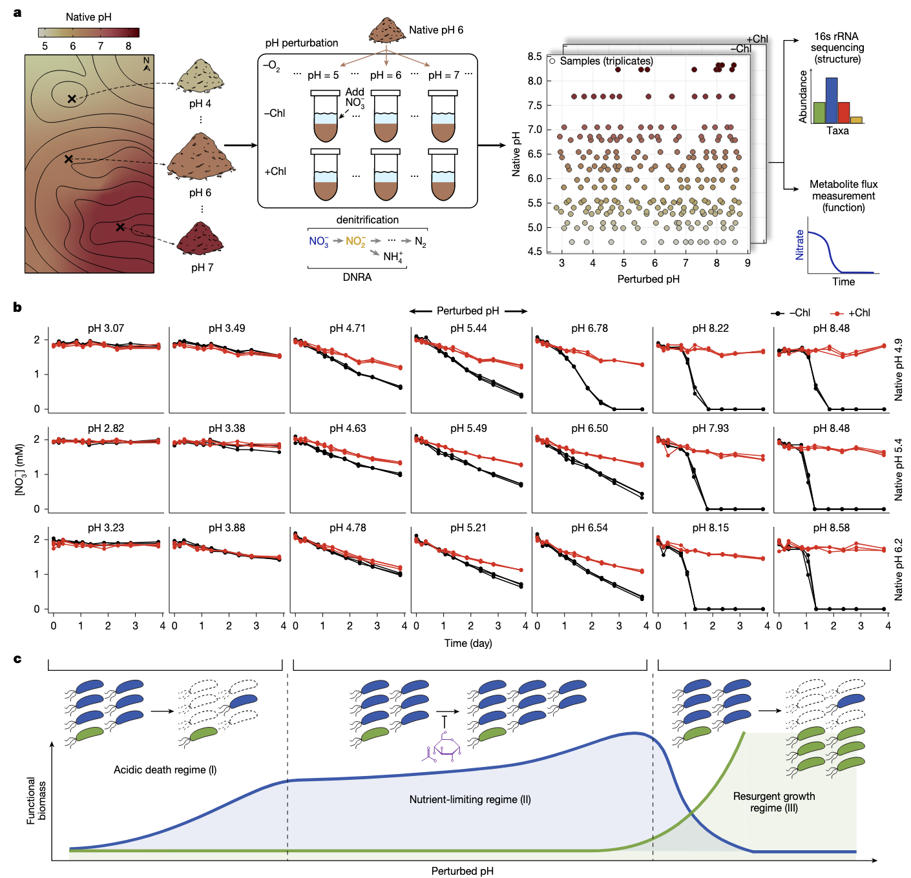
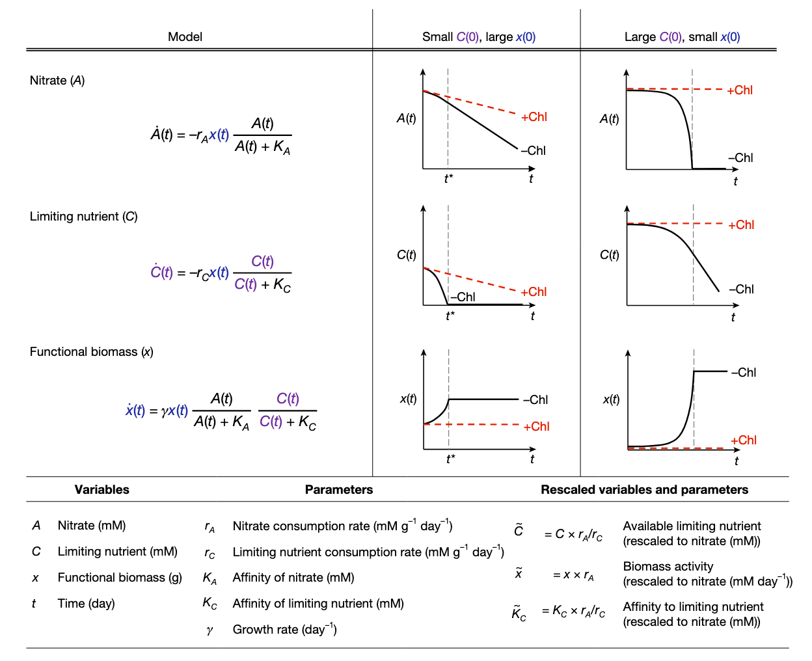
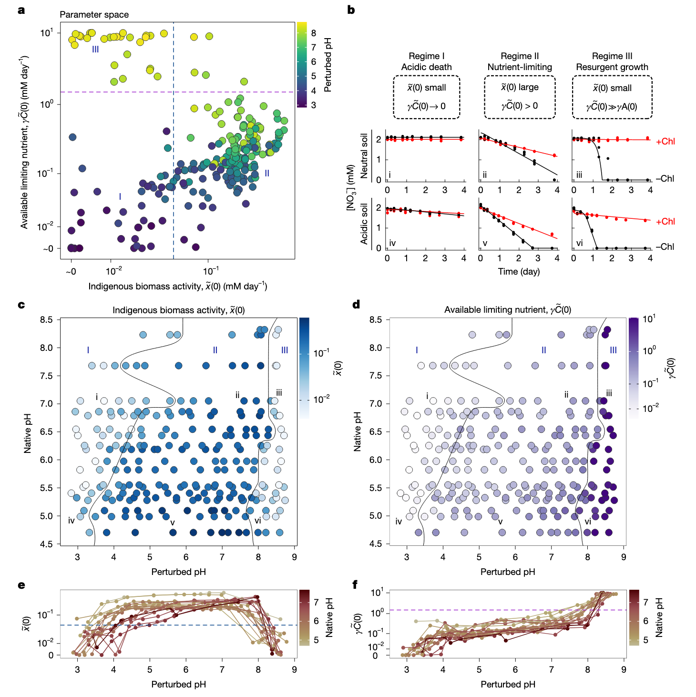
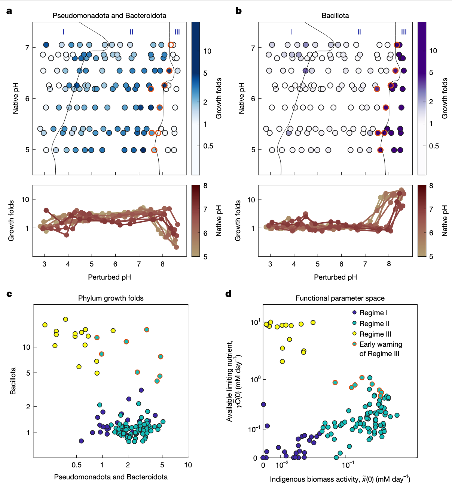
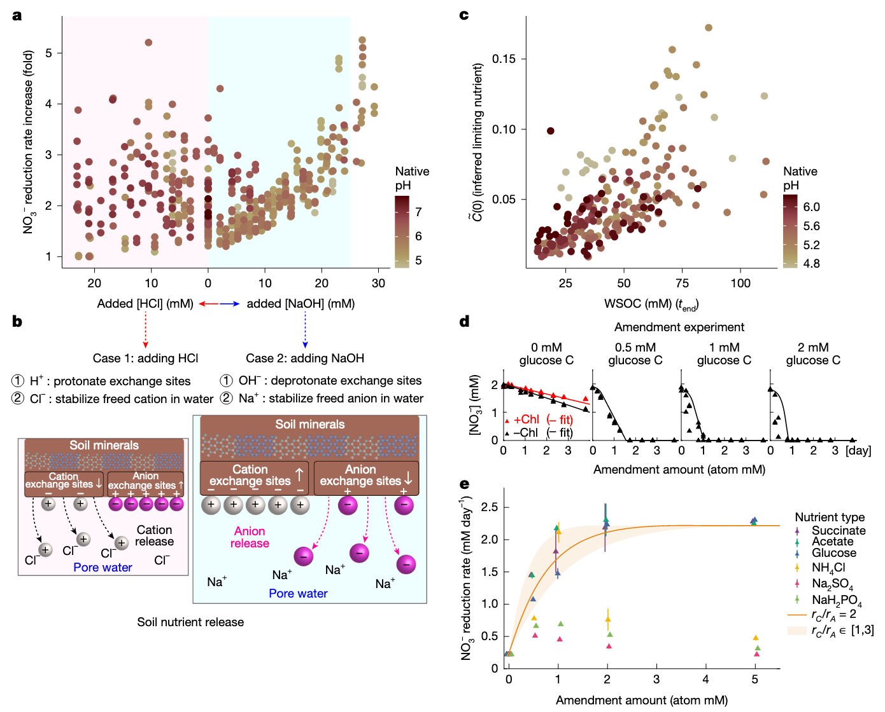
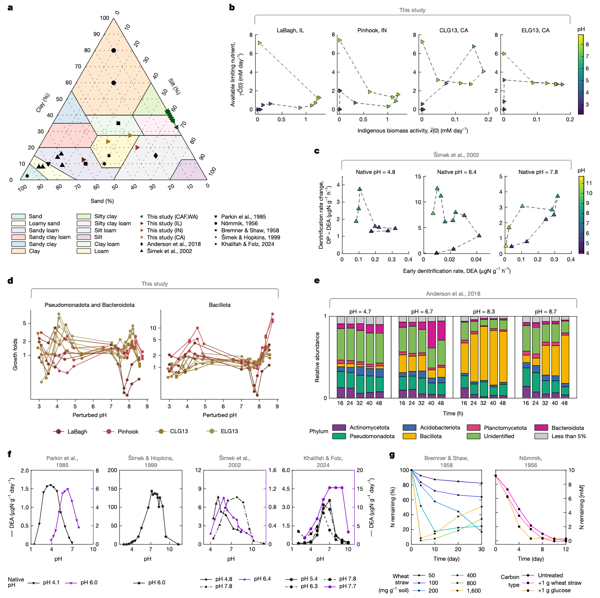

学习一些2025年最新的Nature环境微生物研究文章，了解一下当前较新的研究思路和方法。

1. Lee, K.K., Liu, S., Crocker, K., Wang, J., Huggins, D.R., Tikhonov, M., Mani, M., and Kuehn, S. (2025). Functional regimes define soil microbiome response to environmental change. Nature, 1–11. https://doi.org/10.1038/s41586-025-09264-9.

这篇文章做了大量的土壤微宇宙（microcosms）扰动实验，测量硝酸盐利用和微生物组，工作量很大。还在此基础上构建了数学模型并实验验证，为理解复杂微生物群落如何应对环境扰动提供了新视角。

## 功能机制定义土壤微生物组对环境变化的响应

土壤微生物组的代谢活动在全球养分循环中起着核心作用。理解土壤代谢活动如何响应气候驱动的环境扰动是一个关键挑战。然而，土壤的生态、空间和化学复杂性阻碍了本文对这些群落如何响应扰动的理解。微生物组代谢响应环境变化的机制问题，由于自然微生物组的复杂性而变得尤为困难。这种复杂性在土壤中表现得最为明显，土壤具有巨大的分类多样性、空间异质性和化学多样性环境。

传统的大规模调查方法通过量化野外环境变化、群落组成和代谢过程之间的相关性来研究这个问题。虽然调查揭示了稳健的相关性，但它们在揭示决定群落对环境变化响应的机制方面面临两个挑战：首先，调查无法控制混杂因素；其次，很难在野外大规模量化代谢动态。因此，调查在确定控制自然群落对环境变化代谢响应的机制方面能力有限。

## 研究方法与实验设计

为了控制混杂因素并获得机制性见解，研究团队采用了土壤微宇宙实验方法。这种方法消除了相关的环境波动，并允许在实验室中进行受控扰动。研究选择了美国华盛顿州Cook Agronomy Farm(CAF)的土壤作为研究对象，该地点表现出较大的自然pH变化，但其他环境因素变化最小。重要的是，土壤微宇宙能够高通量量化对环境扰动的代谢物动态。

研究团队采集了20个表层土壤样品，这些样品的原生pH值从4.7到8.3不等。通过创建土壤-水混合物（浆液），并添加2mM硝酸盐和不同水平的强酸或强碱来扰动每个土壤的pH值至3到9之间的13个不同值。为了将预先存在的硝酸盐利用者的活性与每种条件下的生长分开，研究包括了用氯霉素处理的对照组，氯霉素抑制蛋白质合成。

图1a显示了在长期pH梯度(n=20个土壤，pH 4.7至8.3)上进行短期pH扰动(n=13)的实验室条件下野外采样示意图。图1b展示了3种不同原生pH土壤在酸性或碱性pH扰动下的硝酸盐浓度随时间变化。图1c是功能机制的示意图。

### 三种功能机制的发现

通过测量分析，研究发现了三种不同的硝酸盐利用机制：

1. **酸性死亡机制(Regime I)**：在强酸性扰动(pH≤4)下，氯霉素处理和未处理条件下的硝酸盐还原都很小，表明几乎没有预先存在的硝酸盐还原生物量，也没有生长。

2. **养分限制机制(Regime II)**：在接近原生pH的pH水平(4≤pH≤8)下，即使是非氯霉素样品中，硝酸盐也呈线性下降，但速率比氯霉素处理的对照组快。这表明在非氯霉素条件下发生了一些生长，但可能受到硝酸盐以外的养分缺乏的抑制。

3. **复苏生长机制(Regime III)**：在强碱性条件下(pH>8)，非氯霉素样品显示硝酸盐还原加速，而氯霉素处理的样品显示很少的活性。这表明土著硝酸盐利用种群很小，但这个稀有种群迅速扩大，在非氯霉素条件下耗尽硝酸盐。

图2左列展示了描述群落水平代谢的消费者-资源模型，包括单一功能生物量(x)、硝酸盐浓度(A)和限制性养分浓度(C)。中间和右列展示了两种机制下x(t)、A(t)和C(t)的动态。

### 模型建立与验证

为了描述硝酸盐动态，研究团队使用了消费者-资源模型。该模型将土壤微生物组的生态复杂性归结为单一有效生物量，而不是明确考虑多种类群及其相互作用。模型包括三个变量：功能性硝酸盐利用生物量(x)、硝酸盐浓度(A)和碳养分(C)，以及五个参数：消耗速率(rA和rC)、亲和力(KA和KC)和生物量生长速率(γ)。

模型有两个关键特性：首先，硝酸盐利用率(Ạ)与功能生物量(x)的数量成正比，即使在没有生长的情况下也是如此；其次，功能生物量对A和C的吸收遵循共同限制的Monod形式，因此任何一种资源的耗尽都会停止生长。这些特性意味着当C耗尽时，生长停止，硝酸盐(A)以与x成正比的恒定速率被消耗。

研究团队将这个模型拟合到所有20种土壤和13种pH扰动的硝酸盐利用动态中，无论是否使用氯霉素处理。通过固定生长率γ和亲和力参数(KA和KC)，并改变两个重新调整的参数：x̃(0)=x(0)rA和γC̃(0)=γC(0)rA/rC，这些参数保留了与x和C相同的解释：x̃(0)反映了在给定条件下所有可以进行硝酸盐还原的类群的土著代谢活性，γC̃(0)反映了可用的限制性养分。

图3a展示了从所有样品的硝酸盐动态推断出的两个模型参数——土著生物量活性(x̃(0))和限制性养分浓度(γC̃(0))的散点图。图3b展示了每种机制下中性和酸性土壤的硝酸盐动态示例。图3c和3d分别展示了不同原生pH和扰动pH值下土著生物量和限制性养分的热图。

### 分类学模式与机制验证

为了开始确定控制跨机制代谢变化的主导机制，研究团队通过测序量化了组成变化。研究测量了在氯霉素处理和未处理条件下孵育四天后的绝对丰度，计算了门水平的生长倍数，并使用非负矩阵分解(NMF)来分解所有土壤和pH扰动下门水平生长的变化。

分析表明，大多数生长可以用两个变化轴来捕捉：一个轴包括假单胞菌门和拟杆菌门的组合，另一个轴仅包括芽孢杆菌门。在机制II中，假单胞菌门和拟杆菌门随着pH的增加而增加生长，随后在机制III开始附近下降。这与模型在机制II中揭示的土著生物量活性(x̃(0))的行为相匹配。芽孢杆菌门直到pH阈值在7到8.5之间才开始生长，这与机制III中指数硝酸盐利用动态的开始相匹配。

图4a和4b分别展示了假单胞菌门和拟杆菌门组合以及芽孢杆菌门在不同pH条件下的生长倍数。图4c展示了假单胞菌门和拟杆菌门与芽孢杆菌门生长倍数的散点图。图4d展示了x̃(0)与γC̃(0)的散点图，其中标出了机制，红色轮廓表示接近机制III边界的机制II条件。

### 机制II中碳释放促进生长

在养分限制机制II中，无论是否使用氯霉素，硝酸盐还原速率都保持恒定，但在不使用药物时速率更高。模型将无药物时速率增加归因于养分(C(0))的快速初始利用。此外，随着扰动pH的增加，无氯霉素条件下的硝酸盐还原速率增加。模型提出，随着pH增加的限制性养分可用性(γC̃(0))推动了增加硝酸盐还原速率的生长。

pH增加可以通过粘土颗粒上离子交换位点的取代反应增强土壤中有机碳的可用性。由于养分是通过交换反应释放的，研究假设生物量的增加，因此硝酸盐还原速率应该与添加到系统中的酸或碱的量成正比。在所有土壤中都观察到了这一趋势，表现为硝酸盐还原速率随NaOH一致增加（浅蓝色区域）。如果硝酸盐利用率随NaOH增加是由于限制性养分可用性(γC̃(0))增加推动了硝酸盐还原者的生长，那么预计它们的丰度会随着NaOH的增加而上升。正如预期的那样，通过16S rRNA扩增子测序测量的绝对丰度与添加到系统中的NaOH量呈线性关系。

图5a展示了硝酸盐还原速率（无氯霉素/氯霉素处理）随添加到土壤中的NaOH量的变化。图5b展示了养分释放的假设机制示意图。图5c展示了模型推断的可用限制性养分(C̃(0))与测量的水溶性有机碳(WSOC)的散点图。图5d和5e展示了在养分限制机制下未扰动pH(5.4)土壤的修正实验结果。

### 机制I中生物量减少与细胞死亡相关

在酸性pH扰动响应中，模型显示土著生物量活性(x̃(0))减少和限制性养分可用性降低。为了测试土著生物量活性(x̃(0))随pH下降是否与细菌丰度相关，研究计算了在氯霉素处理条件下每个门终点绝对丰度相对于初始时间点T0的倍数变化("存活倍数")。存活倍数反映了在没有生长的情况下丰度的变化，因此本文将其视为死亡的代理。

除了芽孢杆菌门外，所有门在酸性扰动下都表现出存活倍数的一致下降。存活倍数与x̃(0)近似线性下降，表明生物量活性的降低可能与细胞死亡有关。然而，存活倍数的变化也可能源于pH依赖性残留DNA的降解。为了测试细胞死亡减少机制I中生物量活性的假设，研究使用了从本文的土壤或代表图4中三个门的菌株集合中分离的菌株。使用这些分离株，测量了pH值从3到7范围内的DNA降解和细胞死亡率。结合这些速率和模型使本文能够得出结论，通过测序测量的丰度变化必须至少部分源于细胞死亡。

图6a展示了土壤质地（沙、粘土和淤泥的比例）的三元图。图6b展示了来自LaBagh(IL, USA)、Pinhook(IN, USA)和Sedgwick CLG13和ELG13(CA, USA)土壤样品的拟合模型参数(x̃(0)和γC̃(0))的散点图。图6c展示了来自捷克共和国三种土壤的早期反硝化速率(反硝化酶活性(DEA，等同于x̃(0)))和DEA与长期反硝化速率(反硝化潜力(DP，等同于γC̃(0)))差异的散点图。图6d展示了来自LaBagh(IL)、Pinhook(IN)和Sedgwick CLG13和ELG13(CA)土壤样品在不同pH水平下芽孢杆菌门以及假单胞菌门和拟杆菌门组合的生长倍数。图6e展示了Anderson等人研究中pH扰动后门水平相对丰度随时间变化。图6f展示了来自四项研究的土壤在酸性或碱性pH扰动下土著生物量活性(x̃(0))下降。图6g展示了先前研究中土壤在接近原生pH下氮利用的恒定速率。

### 长期pH对机制边界的影响

研究观察到，土壤的原生(长期)pH决定了在机制之间转变的pH阈值，酸性土壤在比中性土壤更小的酸性扰动后从机制II转变为机制I。这种行为可能是由群落过去暴露于pH波动所塑造的。虽然本文缺乏历史pH波动的直接记录，但本文可以使用滴定曲线来描述土壤对pH扰动的响应。

在所有土壤中，这些曲线显示出一致的形状：在高(pH 9)和低(pH 3)pH值处的平台由陡峭的非线性转变连接。土壤的原生pH决定了其在无扰动时沿曲线的位置。酸性土壤位于较低平台附近，因此对pH变化有很强的缓冲作用。相比之下，更多的中性土壤位于陡峭区域，在那里小的酸或碱添加会导致大的pH变化。本文推测这种缓冲能力的差异使得来自酸性土壤的群落对pH波动的耐受性较差，这可能解释了它们在更小的扰动后从机制II转变为机制I。

此外，本文的测序数据支持微生物组组成反映对原生pH的特定适应，有助于解释跨土壤的机制边界变化。在更酸的土壤中，假单胞菌门和拟杆菌门在较低pH下表现出更大的存活率。相反，芽孢杆菌门开始在机制III中生长的pH随原生土壤pH增加而增加。此外，在机制III中生长的菌株的身份预测了土壤的原生pH。这些发现表明，长期暴露于特定的pH条件会选择特定的类群，可能塑造群落转变功能机制之间的pH阈值。

## 讨论与展望

这项研究对理论微生物生态学和微生物组代谢的实证研究具有重要意义。首先，本文的模型将整个群落抽象为单一有效生物量的成功与捕捉许多相互作用物种的复杂生态系统模型形成鲜明对比。这种对比表明，自然群落可能更适合通过粗粒度描述来理解，这种描述捕捉了群落中少数代谢相关的群体或行会。这种生态系统的低维图景尊重潜在机制，并与群落可观察的功能特性紧密相连。将这一成功扩展到更复杂的代谢过程，并将有效生物量变量如x̃与基础丰度动态联系起来，是未来工作的关键方向。

其次，理解微生物群落代谢如何响应环境扰动仍然是应用微生物组科学的核心问题。这一挑战源于由许多具有不同代谢特征和生态相互作用的物种组成的群落的复杂性，这些相互作用发生在化学复杂的环境中。群落的复杂性促使测量越来越复杂，从宏基因组学和转录组学到单细胞代谢组学和定量稳定同位素探针。然而，将这些数据与群落代谢及其对环境扰动的响应联系起来仍然很困难。本文的研究结果表明，与其单独关注微观过程，不如首先进行定量、系统级的观察，如硝酸盐通量，并使用简单模型描述这些通量。然后，模型提出组织群落代谢的机制，如养分限制或生物量活性的变化。反过来，可以研究这些提出的机制的生理、化学或生态起源。

本文的分析揭示了与功能机制相关的保守门水平关联。在强碱性扰动下，稀有芽孢杆菌门扩大，而优势假单胞菌门和拟杆菌门在接近原生pH下茁壮成长。这些模式表明，适应瞬时胁迫的稀有类群和适应稳定条件的优势类群，突出了波动在维持多样性中的作用。理解这些分类学模式需要将动态与生理学联系起来。尽管最近的工作已经对平衡生长的生理学产生了定量见解，但本文对波动在决定微生物特征中的作用的理解仍然有限。即使在缺乏生理学见解的情况下，本文的方法也能够从测序和养分测量中预测硝酸盐动态。使用从16S数据推断的硝酸盐还原酶基因丰度和WSOC测量，本文训练了回归来预测模型参数x̃(0)和γC̃(0)。这使本文能够仅从pH、WSOC和扩增子数据预测硝酸盐通量，证明功能机制即使在复杂群落中也能连接结构和功能。

本文的研究有几个局限性。首先，土壤浆液缺乏完整土壤的物理结构和自然环境波动；特别是，原位硝酸盐利用发生在动态变化条件下。其次，自然pH变化通常很小(小于1个单位)，这意味着大多数土壤可能保持在机制II，除非在肥料或尿液输入等大型外源扰动下。第三，尽管本文的土壤合理地涵盖了全球分类多样性，但它们对高度碱性(pH>8)或强酸性(pH<4)土壤的代表性不足。高度缓冲的碱性土壤可能完全抵抗pH诱导的机制转变。

