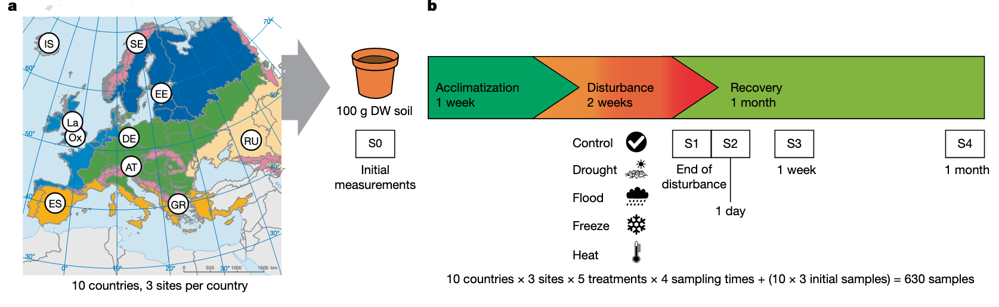
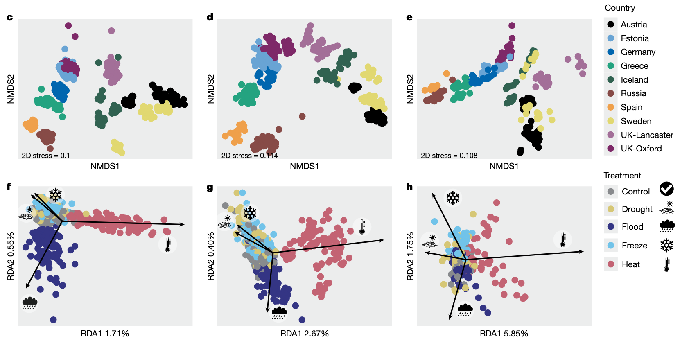
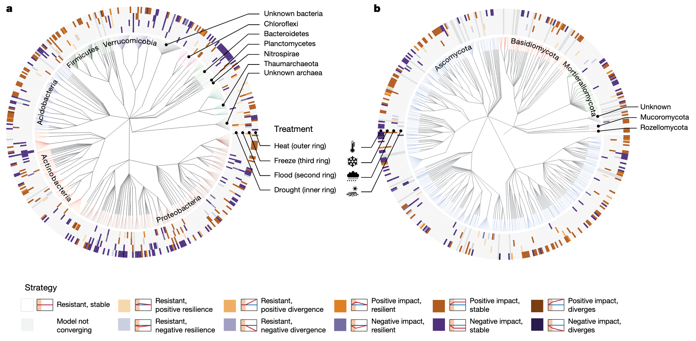
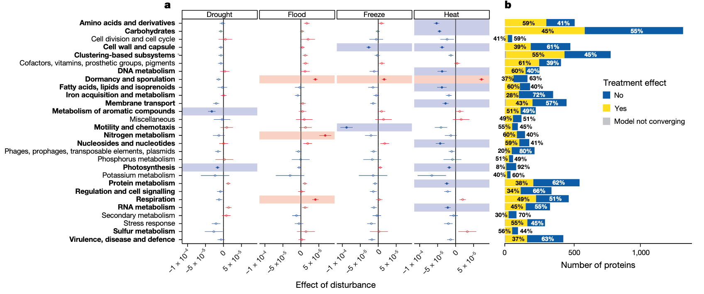
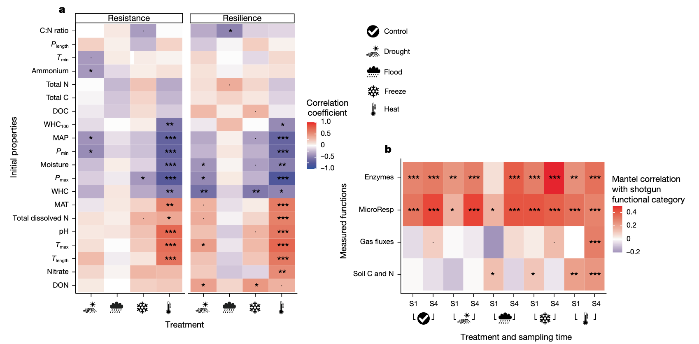

学习一些2025年最新的Nature环境微生物研究文章，了解一下当前较新的研究思路和方法。

1. Knight, C.G., Nicolitch, O., Griffiths, R.I., Goodall, T., Jones, B., Weser, C., Langridge, H., Davison, J., Dellavalle, A., Eisenhauer, N., et al. (2024). Soil microbiomes show consistent and predictable responses to extreme events. Nature 636, 690–696. https://doi.org/10.1038/s41586-024-08185-3.

这篇文章通过统一设计的大规模模拟实验，在草地土壤中施加干旱、洪水、冻结和高温等极端气候事件，系统比较微生物群落的结构与功能响应，发现其响应具有高度一致性和系统发育保守性，并提出微生物响应强度可由土壤原生环境预测，建立了土壤微生物对极端气候冲击的普适响应框架。

## 土壤微生物组对极端气候事件的响应模式

随着全球气候变迁，极端气候事件（Extreme Climatic Events, ECEs）发生频率显著增加，对陆地生态系统功能带来前所未有的挑战。土壤微生物作为生态系统功能的核心，其对极端事件的响应机制仍不清晰。本研究统一实验设计，在欧洲10个国家的30个草地土壤中模拟干旱、洪水、冻结和热浪，系统评估微生物群落的结构和功能变化。结果显示微生物响应具有高度一致性，并受系统发育约束。这一发现为全球尺度预测极端气候对微生物群落和生态功能的影响提供了理论基础。

极端气候事件正以前所未有的频率和强度冲击地表生态系统。在陆地生态系统中，土壤微生物群落通过有机质分解、碳氮循环等过程维持生态功能。然而，我们尚不清楚：这些微生物是否存在通用的应对模式？是否可以通过系统发育特征或环境背景来预测群落响应？

为回答上述问题，本研究设计了一项大规模跨气候区实验，在严格控制条件下施加四种典型极端气候事件，系统比较微生物响应的一致性、系统发育保守性和可预测性。

## 研究设计与方法

研究采集自欧洲30个草地土壤（涵盖高山、温带、地中海、寒带等气候区），每个土壤样本在实验室中分别接受五种处理：对照、干旱、洪水、冻结和高温（热浪）。处理持续时间依据生态学合理尺度设定。随后，对样品进行宏基因组测序和代谢活性检测，以揭示微生物群落的组成和功能变化。

## 微生物群落响应的整体趋势

所有四类极端气候事件都能显著改变微生物群落结构，特别是高温和干旱处理。高温引起α多样性降低，β多样性增大，群落组成趋于简化和重组。通过主坐标分析（PCoA）和距离分析，研究者发现同类事件下不同土壤样本的微生物变化方向高度一致，说明响应具有普遍性和可预测性。

其中，高温处理不仅改变了群落结构，还显著增强了孢子形成菌（如芽孢杆菌、放线菌）的相对丰度，而洪水和冻结引发的变化则相对温和。

*展示不同极端事件下土壤微生物群落组成、β多样性和代谢基因群的变化趋势。*

## 微生物响应具有系统发育保守性

群落组成变化中，具有相近系统发育位置的微生物对同一事件表现出相似的响应。例如，在高温处理中，某些放线菌门和芽孢杆菌表现出显著富集，暗示其具备特有的耐热机制。
将响应信号投射到系统发育树中，发现微生物的响应具有明显的系统发育保守性：亲缘关系近的物种对同一事件表现出相似反应。例如，在热浪处理中，许多革兰氏阳性菌表现出一致的耐受或优势扩张趋势，而革兰氏阴性菌（如变形菌门）则整体下调。这种保守性使得基于系统发育信息可以对不同微生物类群的响应趋势进行合理预测。

*展示微生物群落中不同门类的响应差异及其系统发育树状图对比。*

## 功能响应：热胁迫引发“休眠化”

高温处理显著上调了与休眠和孢子形成相关的基因表达，如**spo0A、sigF、relA**等。这种“休眠化”策略降低了微生物的代谢活跃度，同时也可能限制其生态功能输出。

代谢多样性分析显示，干扰事件总体降低了群落功能多样性，尤其是高温处理，表明微生物进入功能压制状态以应对胁迫。

*展示关键应激基因表达热图、代谢通路富集分析结果等。*

## 响应强度与原生环境有关

土壤历史气候背景和理化性质能部分预测其对某类事件的响应强度。例如，地中海气候土壤对干旱反应较弱，而寒带土壤对高温异常敏感。

构建响应强度与环境因子之间的回归模型，发现年均降水、气温波动性、有机质含量等是重要预测因子。

*展示响应强度与历史气候和土壤特性之间的相关性图表、建模残差分析等。*

## 结论与展望

本研究首次在泛欧洲尺度上、通过统一设计系统考察土壤微生物群落对极端气候事件的响应，揭示出如下关键发现：

* **响应一致性强**：不同地点、不同背景的土壤微生物群落对同类事件反应方向一致；
* **系统发育保守性**：群落变化受微生物亲缘关系影响，具备进化学上的一致模式；
* **功能趋同**：高温诱导休眠与代谢抑制是主要功能响应路径；
* **敏感性可预测**：土壤历史环境决定其对未来气候冲击的敏感度。

这些发现为未来构建气候事件风险图谱、开展生态恢复和土地管理提供了科学基础。下一步研究可进一步结合代谢组学、稳定同位素追踪等手段，以更全面揭示“微生物–生态功能”之间的耦合响应机制。
