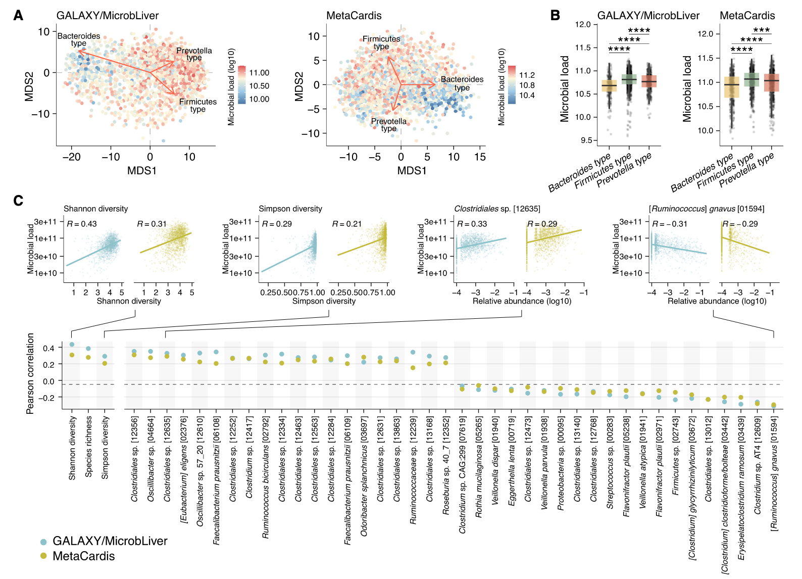
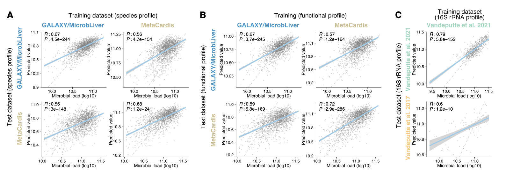
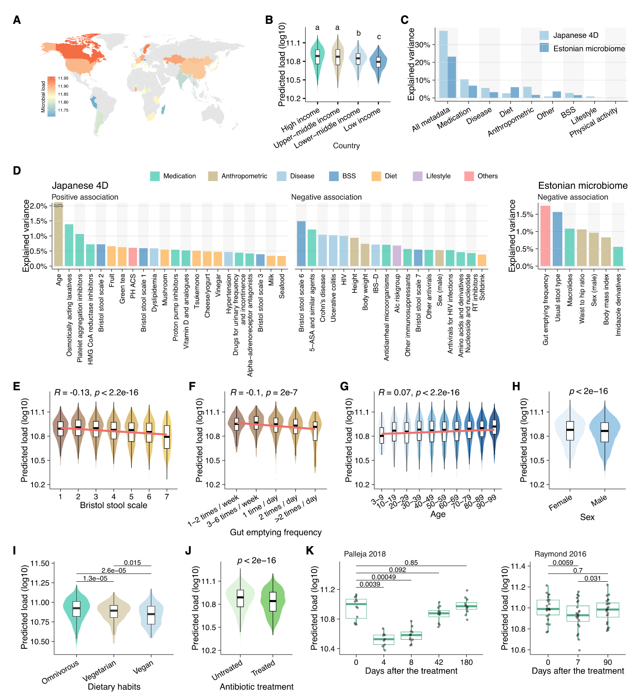
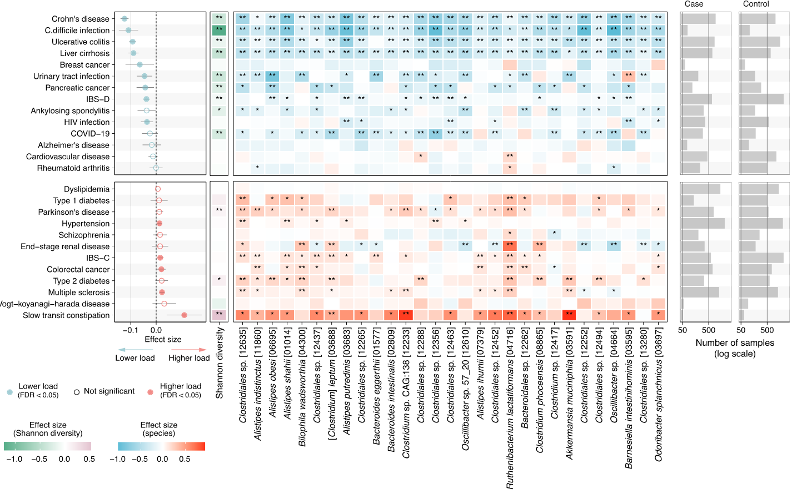
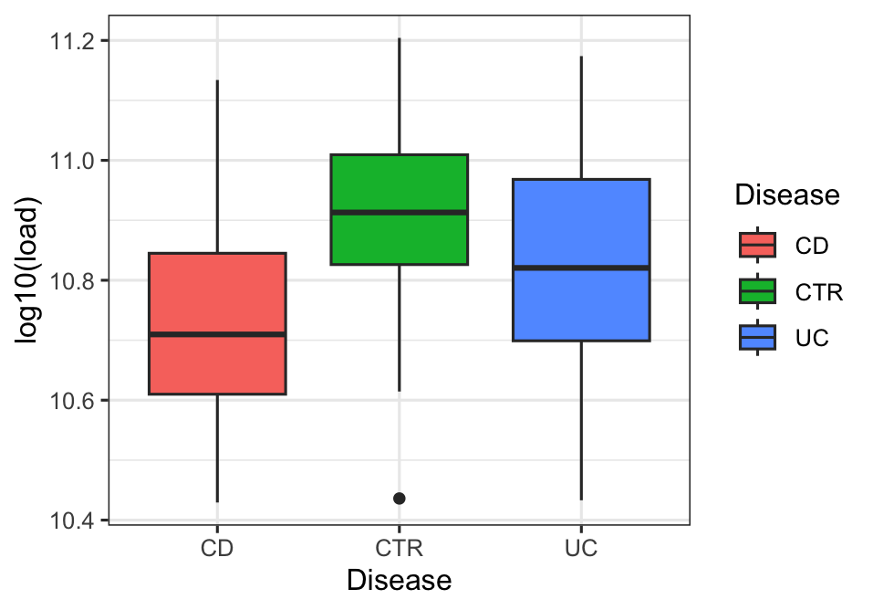

## Introduction

宏基因组测序能够深入揭示肠道微生物群的组成、功能以及与宿主健康的关系。然而，由于测序结果本质上是成分性数据（compositional data），只能反映相对丰度，往往会导致假阳性或假阴性，从而干扰对生物学意义的正确解读。特别是，宏基因组测序无法直接提供 **微生物负荷（microbial load）** 信息，而这一指标与群落多样性、代谢潜力乃至疾病关联都密切相关。

传统上，研究者常依赖流式细胞术、定量 PCR 或内部标准（spike-in）等方法来获得负荷信息，但这些实验手段需要额外的成本和时间，难以在大规模研究中广泛应用。

《Cell》发表的一篇研究 “Fecal microbial load is a major determinant of gut microbiome variation and a confounder for disease associations” 提出了一个新的解决方案。作者开发了基于机器学习的工具 MLP（microbial_load_predictor），能够在无需额外实验的情况下，仅通过宏基因组测序的相对丰度数据来预测人类粪便样本的微生物负荷。

我们这里简单介绍一下这篇文章以及工具MLP的使用方法。

## 文章介绍

这篇发表于 *Cell* 的研究 (*“Fecal microbial load is a major determinant of gut microbiome variation and a confounder for disease associations”*) 建立并验证了一种基于机器学习的模型，用于从宏基因组测序的相对丰度数据，预测粪便中微生物的绝对负荷（每克样本中的微生物细胞数）。

研究使用了 34,539 个宏基因组样本，证明微生物负荷是影响肠道微生物组变异的主要因素，并且与宿主年龄、饮食、用药等诸多因素显著相关。此外，在多种疾病情境下，相较于疾病本身，微生物负荷的改变对肠道微生物组的影响更为显著；在校正该效应后，以往许多被认为是疾病相关的物种显著性明显下降。这些发现表明，粪便微生物负荷是微生物组研究中的一个关键混杂因子，对理解微生物组在健康与疾病中的变异性至关重要。

### 微生物负荷与肠道微生物组的分类学和功能谱密切相关

研究基于GALAXY/MicrobLiver和MetaCardis两个独立人群样本，发现微生物负荷与肠道微生物组的分类及功能特征显著相关。_Firmicutes_（_Ruminococcus_）肠型的微生物负荷最高，其次为_Prevotella_和_Bacteroides_肠型。微生物组多样性指数（如Shannon指数）与负荷呈正相关。部分 Firmicutes 门物种（如_Oscillibacter_、_Faecalibacterium_）与负荷正相关，而疾病相关物种（如_Ruminococcus gnavus_、_Flavonifractor plautii_）及口腔来源物种（如_Streptococcus_）与负荷负相关。功能上，脂多糖生物合成基因在低负荷样本中富集，鞭毛组装和趋化相关基因则与高负荷相关。



### 微生物负荷可通过微生物组谱稳健预测

基于物种水平分类谱训练的XGBoost回归模型，在GALAXY/MicrobLiver和MetaCardis人群中内部交叉验证的Pearson相关系数分别为0.67和0.68，跨人群验证为0.56。功能谱（KEGG orthology）和16S rRNA基因谱也能有效预测负荷，16S模型内部验证相关系数达0.79。模型在不同疾病亚型（如肝病、糖尿病）、技术重复及纵向样本中均表现稳健，且样本间生物学差异大于技术差异，表明其适用于大规模研究。



### 预测的微生物负荷与多种宿主因素显著相关

在34539个样本的大规模分析中，预测负荷与宿主因素密切关联。高收入国家样本负荷显著高于低收入国家；女性较男性高3.5%，70岁以上人群较30岁以下高9.7%。布里斯托尔粪便量表评分与负荷负相关，排便频率亦呈负相关。饮食方面， omnivore 负荷高于素食者和纯素食者，高淀粉饮食可增加负荷。抗生素（如磺胺类、头孢菌素）显著降低负荷，且停药后需90-180天恢复。药物、疾病、生活方式等65种因素在日本4D队列中与负荷显著相关。



### 微生物负荷是疾病关联的重要混杂因素

26种疾病中14种与预测负荷显著相关，如克罗恩病、溃疡性结肠炎等与负荷负相关，慢传输型便秘则呈正相关。调整负荷后，27种疾病中21种的微生物关联物种数量减少，例如肝硬化相关物种从203个降至74个，2型糖尿病从118个降至51个。这表明微生物负荷变化可能是疾病相关微生物组改变的重要驱动因素，提示未来研究需纳入负荷校正以避免误判。



## MLP 使用教程

MLP（microbial\_load\_predictor）是一个基于 R 语言开发的预测工具，可以使用宏基因组学的相对丰度数据预测粪便微生物负荷，并进一步转换为定量微生物组配置（QMP），无需额外实验。

此外，研究者还提供了一个在线版本的MPL<https://microbiome-tools.embl.de/mlp/>，可供直接输入profile使用，不需要进行下列步骤。

### 1. 准备与安装

* **环境要求**：R 语言版本 ≥ 4.3.1，同时需安装 `vegan` 和 `tidyverse` 包。
* **获取源码与安装**：

  ```r
  git clone https://github.com/grp-bork/microbial_load_predictor.git
  devtools::install()
  library("MLP")
  ```

### 2. 输入文件与数据要求

* **支持的输入类型**：

  * **物种水平的宏基因组（shotgun metagenome）**：支持格式包括 mOTUs v2.5 / v3.0、MetaPhlAn3、MetaPhlAn4（多个版本）。
  * **16S rRNA 基因（通用门级）**：支持 DADA2 + RDP (`rdp_train_set_16`)。
* 输出文件包括预测的微生物负荷（load）以及 QMP（定量微生物组profile）。

### 3. 使用主函数

MLP 对外提供了主要函数：

```r
out <- MLP(input, profiler, training_data, output)
```

* `input`：读取的输入 taxonomic profile 数据框。
* `profiler`：选择你使用的 taxonomic profiler，如 `"motus25"`、`"metaphlan3"`、`"rdp_train_set_16"` 等。
* `training_data`：模型训练所使用的数据集，可选 `"galaxy"` 或 `"metacardis"`。
* `output`：输出类型， `"load"` 获取负荷预测值，`"qmp"` 获取定量丰度数据。

示例代码：

```r
# 读取并转置示例数据
input <- read.delim("test_data/Franzosa_2018_IBD.motus25.tsv", header = TRUE, row.names = 1)
input <- data.frame(t(input), check.names = FALSE)

# 使用 MetaCardis 模型预测
load <- MLP(input, "motus25", "metacardis", "load")

# 计算 QMP（定量丰度）
qmp <- MLP(input, "motus25", "metacardis", "qmp")

# 可视化（示例）
md <- read.delim("test_data/Franzosa_2018_IBD.metadata.tsv", header = TRUE, row.names = 1)
df <- data.frame(md, load = load$load)
library(ggplot2)
ggplot(df, aes(x = Disease, y = log10(load), fill = Disease)) +
  theme_bw() + geom_boxplot()
```



## References
1. Nishijima, S., Stankevic, E., Aasmets, O., Schmidt, T.S.B., Nagata, N., Keller, M.I., Ferretti, P., Juel, H.B., Fullam, A., Robbani, S.M., et al. (2025). Fecal microbial load is a major determinant of gut microbiome variation and a confounder for disease associations. Cell 188, 222-236.e15. https://doi.org/10.1016/j.cell.2024.10.022.
2. https://github.com/grp-bork/microbial_load_predictor/

