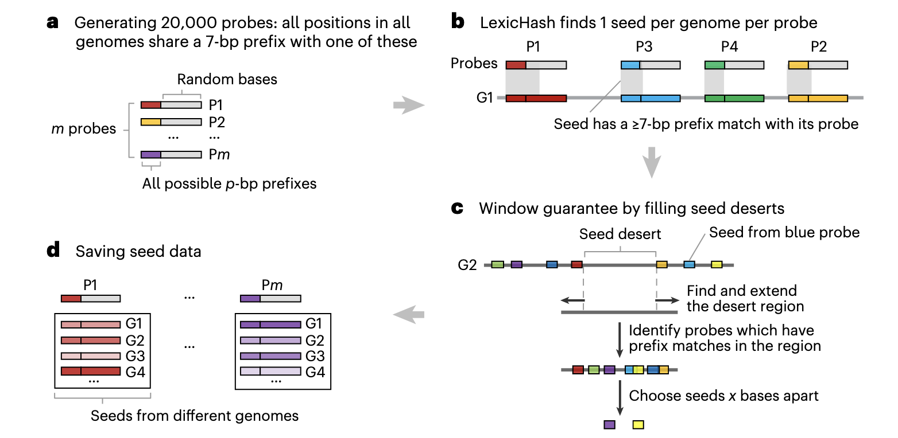
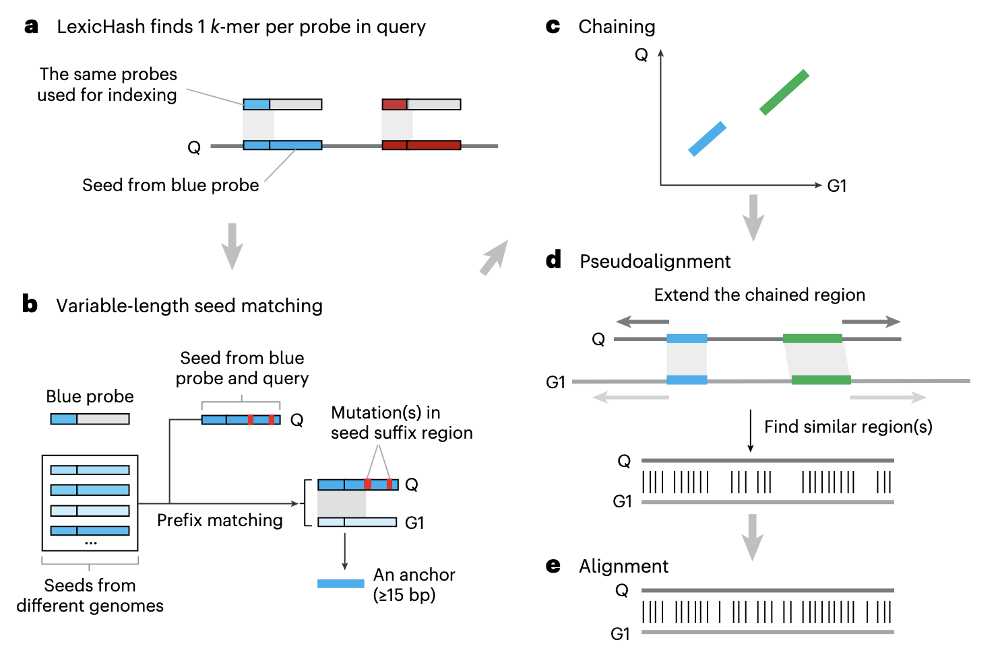
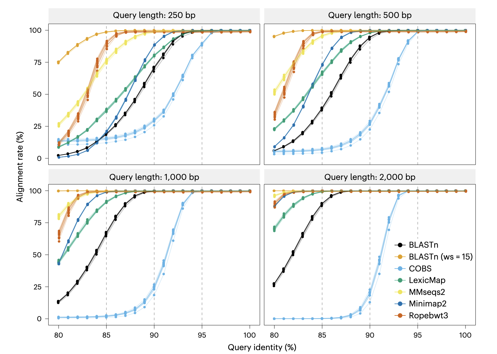
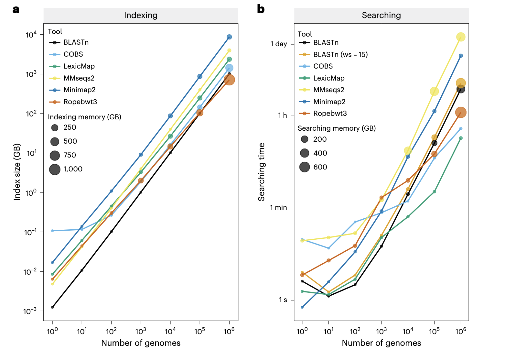

## Introduction

序列比对是生物信息学研究的基础操作，从基因功能注释、病原体溯源到进化分析，都离不开将查询序列与参考基因组数据库进行比对。然而，随着高通量测序技术的飞速发展，公共数据库中的原核生物基因组数量呈指数级增长——GenBank与RefSeq联合数据库已包含超过234万个原核生物基因组，AllTheBacteria高质量数据集也收录了185万余个细菌基因组。

传统序列比对工具在此背景下面临严峻挑战：BLASTn虽准确性高，但对百万级基因组数据库需超过2000GB内存，普通服务器根本无法运行；MMseqs2、Minimap2等工具虽在速度上有提升，却难以平衡内存消耗与结果完整性；基于“预过滤+比对”的策略（如Phylign）则在序列分歧度较高时出现敏感性下降。

《Nature Biotechnology》发表的研究 “Efficient sequence alignment against millions of prokaryotic genomes with LexicMap” 提出了突破性解决方案。研究者开发的LexicMap工具，通过创新的种子设计与索引策略，实现了对百万级原核生物基因组的快速、低内存比对，同时保持与主流工具相当的准确性，为大规模基因组分析提供了新选择。

这里简单介绍一下这篇文章，并提供LexicMap工具的使用教程。

## 文章介绍

发表于《Nature Biotechnology》的这项研究，针对大规模基因组比对的核心痛点，设计了一套兼顾速度、内存与准确性的解决方案。研究团队通过优化序列草图生成、种子匹配与索引构建流程，开发出LexicMap工具，并在多个百万级基因组数据集上验证了其性能优势。

### 序列比对工具面临的规模化挑战

当前主流序列比对工具在处理大规模基因组数据时，主要存在三大瓶颈：
1. **内存消耗过高**：传统工具（如BLASTn、Ropebwt3）对100万个基因组建库时，内存需求可达数百甚至上千GB，远超普通计算设备的承载能力；
2. **速度与敏感性难以平衡**：基于k-mer的比对工具（如COBS）虽速度快，但仅能返回匹配基因组，无法提供关键的位置信息；而“预过滤+比对”工具（如Phylign）在序列分歧度超过10%时，预过滤步骤会大量丢失有效匹配；
3. **结果完整性不足**：部分映射工具（如Minimap2）仅返回相似度最高的匹配，忽略了基因组中多拷贝基因或片段化匹配，影响下游分析的全面性。

为解决这些问题，LexicMap从算法底层进行创新，核心目标是在“大规模”，“高准确性”，“低资源消耗”三者间找到最优平衡。

### LexicMap的核心设计与创新
LexicMap的优势源于四项关键技术创新，形成了从“种子生成”到“结果输出”的完整优化流程：



#### 1. 基于LexicHash的精准种子生成
LexicMap改进了序列草图工具LexicHash，通过生成2万个31-mer“探针”（probe）覆盖所有可能的7-mer前缀——这意味着数据库中每个基因组的任意250-bp窗口，都会包含至少2个（实际中位数为5个）与探针前缀匹配的k-mer（称为“种子”）。这种设计确保了种子在基因组上的均匀分布，避免了传统工具中“种子荒漠”（seed desert）导致的比对缺失问题。

#### 2. 前缀+后缀双匹配策略
为提升对序列突变的耐受性，LexicMap不仅支持种子的前缀匹配，还新增了后缀匹配功能：将种子反向互补后，与探针进行二次前缀匹配，相当于实现了后缀匹配。这种双匹配策略使工具能有效识别包含插入、缺失或碱基替换的序列，尤其在序列分歧度较高（如80%-90%）时，敏感性显著优于固定长度k-mer匹配工具。



#### 3. 分层索引与批量建库
针对百万级基因组的存储与查询需求，LexicMap采用“批量建库+分层索引”策略：
- **批量建库**：将基因组按5000-25000个为一批次分别建库，每批内将基因组的多条contig用1kb N序列连接，减少索引复杂度，最后合并所有批次索引，大幅降低单批次内存消耗；
- **分层索引**：种子数据按探针分组存储，每组内通过varint-GB算法压缩，同时建立“目录式”索引（类似字典目录），查询时可快速定位种子位置，避免全库扫描。

#### 4. 伪比对+Wavefront精确比对
LexicMap采用“两步比对”流程保证结果准确性：
1. **伪比对（Pseudoalignment）**：对种子匹配后的区域进行扩展，通过2-mer匹配快速筛选出高相似度区域，减少后续精确比对的计算量；
2. **Wavefront精确比对**：使用Wavefront算法进行碱基级比对，计算并输出与BLASTn一致的关键指标（如qcovGnm、pident、evalue、bitscore），确保结果的可解释性与兼容性。

### LexicMap的性能优势与准确性验证

研究团队在三个大规模数据集（GTDB r214：40万个原核基因组；AllTheBacteria：185万个细菌基因组；GenBank+RefSeq：234万个原核基因组）上，将LexicMap与BLASTn、MMseqs2、Minimap2、Ropebwt3等工具进行全面对比，结果显示其在“速度”“内存”“准确性”上均表现突出。





#### 1. 规模化比对的速度与内存优势
在100万个基因组的数据库中，LexicMap的优势尤为显著：
- **索引构建**：内存消耗仅75GB，远低于Ropebwt3（1013GB）、COBS（382GB），虽略高于MMseqs2（20GB），但索引大小仅为Minimap2的1/8；
- **查询速度**：对1.3kb标记基因（secY）的比对仅需3分06秒，是MMseqs2（89倍慢）、Minimap2（39倍慢）的数十倍，且内存消耗仅3.97GB，而BLASTn在此规模下无法运行；
- **长期稳定性**：在234万个基因组的GenBank+RefSeq数据集上，LexicMap可稳定运行，单查询内存不超过15GB，而其他工具要么内存溢出，要么查询时间超过数小时。

#### 2. 准确性与敏感性验证
通过模拟含不同突变率（0%-20%）的序列（长度250bp-2000bp）进行验证，LexicMap的准确性表现如下：
- **高相似度序列（≥95%）**：所有工具的比对率均接近100%，LexicMap与BLASTn（word size=15）、MMseqs2的结果完全一致；
- **中低相似度序列（80%-93%）**：对于250bp短序列，LexicMap在88%相似度以下的比对率超过Minimap2，在93%相似度以下超过默认参数的BLASTn（word size=28）；
- **实际数据验证**：对53kb质粒、16S rRNA基因及1033个抗生素抗性基因（AMR）的比对显示，LexicMap能准确识别多拷贝基因（如基因组中的多个16S rRNA拷贝），且低相似度匹配（<80%）的假阳性率低于BLASTn和MMseqs2。

### LexicMap在生物学研究中的应用价值

LexicMap的设计充分考虑了实际研究需求，可广泛应用于以下场景：
1. **病原体溯源与流行病学分析**：快速比对临床样本中的耐药基因或质粒，定位其在全球基因组数据库中的分布，追踪传播路径（如霍乱弧菌耐药质粒的跨地区传播）；
2. **微生物生态学研究**：对环境样本中的长读长序列（如Nanopore reads）进行比对，识别低丰度物种或新型菌株，避免传统工具因敏感性不足导致的物种遗漏；
3. **功能基因挖掘**：批量比对未注释基因组中的功能基因（如代谢酶基因），通过比对结果预测基因功能，尤其适用于未被收录在参考数据库中的新基因；
4. **进化分析**：通过比对不同物种的同源基因，计算序列分歧度，构建进化树，LexicMap的双匹配策略可有效处理进化距离较远的序列。

研究还特别指出，LexicMap返回的“基因组级查询覆盖率”（qcovGnm）指标，对环状序列（如质粒、病毒基因组）的比对结果解读至关重要——可区分完整匹配与片段化匹配，避免将环状序列的线性比对误判为不完整匹配。

## LexicMap 使用教程

LexicMap提供Linux、Windows、MacOS（x86/arm架构）的预编译二进制文件，无需依赖其他软件，安装与使用流程简洁。同时支持在线比对（部分功能）与本地部署，满足不同规模的分析需求。

### 1. 安装准备
#### 环境要求
- 操作系统：Linux（CentOS 7+/Ubuntu 18+）、Windows 10+、MacOS 12+；
- 硬件配置：最低8GB内存（适用于10万个基因组以下数据库），建议32GB以上内存（百万级基因组数据库）；
- 存储：根据数据库规模，需预留100GB-10TB空间（如234万个基因组的索引约5.46TB），推荐使用SSD以提升查询速度。

#### 安装方式
LexicMap支持三种安装方式，推荐使用二进制文件或conda安装，步骤如下：

##### 方式1：二进制文件安装
1. 下载对应系统的二进制文件：访问[LexicMap GitHub Release页面](https://github.com/shenwei356/LexicMap/releases)，下载最新版本（如v0.7.0）的压缩包（例：`lexicmap_v0.7.0_linux_amd64.tar.gz`）；
2. 解压并配置环境变量：
   ```bash
   # 解压
   tar -zxvf lexicmap_v0.7.0_linux_amd64.tar.gz
   # 移动到可执行目录（如/usr/local/bin）
   sudo mv lexicmap /usr/local/bin/
   # 验证安装
   lexicmap --version
   ```

##### 方式2：conda安装
通过bioconda频道快速安装，适用于已配置conda环境的用户：
```bash
conda install -c bioconda lexicmap
# 验证安装
lexicmap --help
```

##### 方式3：源码编译
需安装Go 1.20+环境，适合需要自定义功能的用户：
```bash
git clone https://github.com/shenwei356/LexicMap.git
cd LexicMap
go build -o lexicmap ./cmd/lexicmap/
./lexicmap --version
```

### 2. 输入文件与数据要求
LexicMap支持多种输入格式，核心是“基因组数据库”与“查询序列”，具体要求如下：

#### 基因组数据库输入
- **格式**：FASTA格式（支持.gz、.xz、.zstd等压缩格式），每个基因组单独一个FASTA文件，或多个基因组合并为一个FASTA文件（需确保序列ID唯一）；
- **命名规则**：文件名建议包含基因组ID（如`GCF_000005845.2.fasta`），便于后续结果关联；
- **输入方式**：可通过目录（`-I`参数）、文件列表（`-X`参数，每行一个FASTA文件路径）或单个文件（`-i`参数）指定。

#### 查询序列输入
- **格式**：FASTA格式（支持压缩），单个或多个查询序列（如基因、质粒、长读长）；
- **长度要求**：推荐≥250bp，最短支持100bp（短于100bp时敏感性可能下降）；
- **特殊类型**：支持环状序列（如质粒、病毒），LexicMap会通过`qcovGnm`指标识别完整匹配。

#### 输出结果格式
LexicMap默认输出制表符分隔的TSV文件，包含以下关键列（与BLASTn兼容，便于后续分析）：
| 列名        | 含义                                  | 示例值          |
|-------------|---------------------------------------|-----------------|
| query       | 查询序列ID                            | secY_Efaecalis  |
| qlen        | 查询序列长度                          | 1299            |
| sgenome     | 匹配的基因组ID                        | GCF_000392875.1 |
| sseqid      | 匹配的基因组序列ID（如contig）        | NZ_KB944588.1   |
| qcovGnm     | 查询序列在基因组中的整体覆盖率        | 100.000         |
| pident      | 序列相似度（百分比）                  | 98.701          |
| evalue      | 期望值（越小越可靠）                  | 1.93e-63        |
| bitscore    | 比特值（越大越可靠）                  | 253             |
| sstart/send | 匹配在基因组中的起始/终止位置         | 228637/229935   |
| sstr        | 匹配链方向（+：正链，-：负链）        | +               |

此外，可通过`-a/--all`参数输出CIGAR字符串、比对序列等详细信息，或通过`--format blast`输出BLAST风格的 pairwise 比对结果。

### 3. 核心功能使用（建库与比对）
LexicMap的核心命令是`index`（构建数据库索引）与`search`（执行序列比对），以下为完整流程示例。

#### 步骤1：构建基因组数据库索引
以“将AllTheBacteria数据集的1万个基因组构建索引”为例，命令如下：

```bash
# 基本建库命令
lexicmap index \
  -I /path/to/allthebacteria_10k/  # 基因组FASTA文件所在目录
  -O allthebacteria_10k.lmi         # 输出索引目录（自动创建）
  --batch-size 5000                 # 每批次处理5000个基因组（默认5000）
  --threads 48                      # 使用48线程（根据CPU核心数调整）
```

- **关键参数说明**：
  - `--batch-size`：批次大小影响内存消耗，内存充足时可增大（如25000），内存有限时减小（如1000）；
  - `--force`：强制覆盖已存在的索引目录；
  - `--resume`：恢复中断的建库过程（适用于大规模建库）。

建库完成后，索引目录`allthebacteria_10k.lmi`包含以下文件：
- `index.meta`：索引元信息（如基因组数量、探针数量）；
- `seed.chunk.*`：种子数据文件（按探针分组）；
- `genome.info`：基因组信息（长度、序列ID等）。

#### 步骤2：执行序列比对
以“查询1个16S rRNA基因（rrsB_Ecoli.fasta）”与“批量查询1033个AMR基因（amr_genes.fasta）”为例，展示两种常见场景的使用方法。

##### 场景1：单查询序列比对（16S rRNA基因）
```bash
lexicmap search \
  -d allthebacteria_10k.lmi         # 索引目录
  -i rrsB_Ecoli.fasta               # 查询序列文件
  -o rrsB_search_results.tsv        # 输出结果文件
  --min-qcov-per-genome 70          # 基因组级查询覆盖率≥70%（过滤低覆盖匹配）
  --min-pident 80                   # 序列相似度≥80%
  --top-n-genomes 0                 # 0表示返回所有匹配（默认0）
  --threads 48
  --progress                        # 显示进度条
```

##### 场景2：批量查询序列比对（AMR基因）
批量查询时，可通过`--split-query`参数将查询序列拆分到多个线程，提升速度：
```bash
lexicmap search \
  -d allthebacteria_10k.lmi
  -i amr_genes.fasta
  -o amr_search_results.tsv
  --split-query 48                  # 按48个线程拆分查询序列
  --min-qcov-per-hsp 50             # 单个HSP（高得分片段）的覆盖率≥50%
  --evalue 1e-10                    # 过滤evalue>1e-10的匹配
  --threads 48
```

#### 步骤3：结果可视化与二次分析
LexicMap提供实用工具命令`lexicmap utils`，支持结果筛选、序列提取与格式转换，示例如下：

##### 提取高相似度匹配的基因组序列
```bash
# 筛选pident≥95%、qcovGnm≥90%的结果
lexicmap utils filter \
  -i rrsB_search_results.tsv \
  -o high_similarity_results.tsv \
  --pident 95 \
  --qcovGnm 90

# 从索引中提取匹配区域的序列（FASTA格式）
lexicmap utils subseq \
  -d allthebacteria_10k.lmi \
  -f high_similarity_results.tsv \
  -o high_similarity_sequences.fasta
```

##### 转换为BLAST风格的 pairwise 比对格式
```bash
lexicmap utils 2blast \
  -i rrsB_search_results.tsv \
  -o rrsB_blast_style.txt \
  --kv-file-genome genome_id_to_species.map  # 可选：基因组ID与物种名的映射文件
```

### 4. 常见问题与优化建议
#### 问题1：建库时内存不足
- **解决方案**：减小`--batch-size`参数（如从5000改为1000），或使用`--tmp-dir`指定临时目录（避免内存交换）；
- **示例**：`lexicmap index -I ./genomes -O ./index --batch-size 1000 --tmp-dir /mnt/tmp`。

#### 问题2：查询速度慢
- **优化方向**：
  1. 使用SSD存储索引目录（随机读取速度提升10-100倍）；
  2. 对非必需的低相似度匹配进行过滤（如`--min-pident 85`、`--evalue 1e-20`）；
  3. 批量查询时增大`--split-query`参数（如设为线程数的2倍）。

#### 问题3：未找到预期匹配
- **排查步骤**：
  1. 检查查询序列格式是否正确（FASTA头是否完整，有无特殊字符）；
  2. 降低过滤阈值（如`--min-pident 80`、`--min-qcov-per-genome 50`）；
  3. 使用`lexicmap utils index-info`查看索引是否包含目标基因组：
     ```bash
     lexicmap utils index-info -d ./index | grep "目标基因组ID"
     ```


## References
1. Shen, W., Lees, J.A. & Iqbal, Z. (2025). Efficient sequence alignment against millions of prokaryotic genomes with LexicMap. *Nature Biotechnology*. https://doi.org/10.1038/s41587-025-02812-8
2. LexicMap 官方文档：https://bioinf.shenwei.me/LexicMap/introduction/
3. LexicMap GitHub 仓库：https://github.com/shenwei356/LexicMap
4. AllTheBacteria 数据集：https://github.com/AllTheBacteria/AllTheBacteria
5. GTDB 数据库：https://gtdb.ecogenomic.org/
