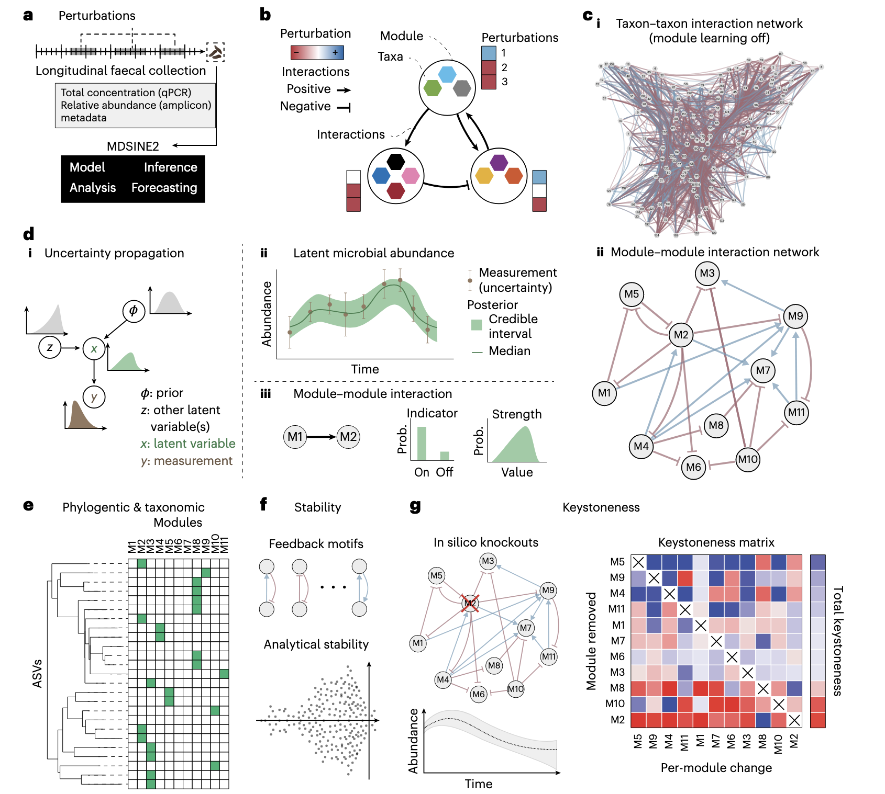
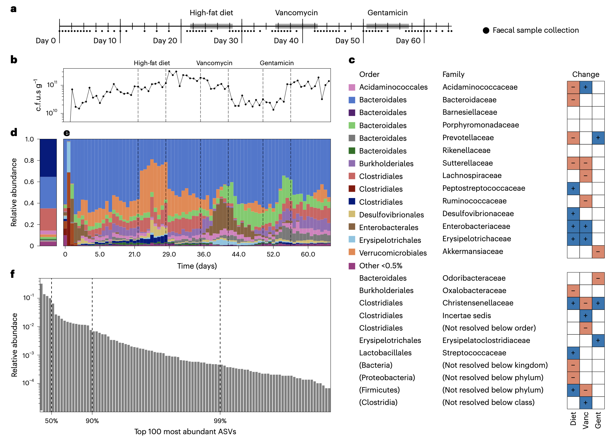
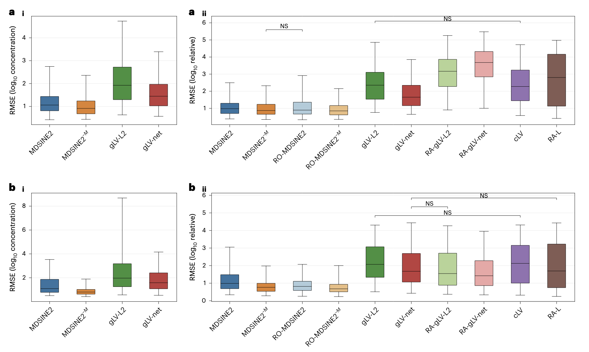
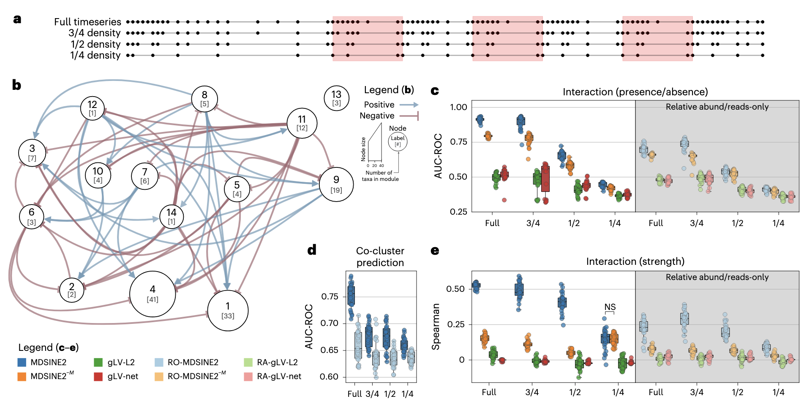
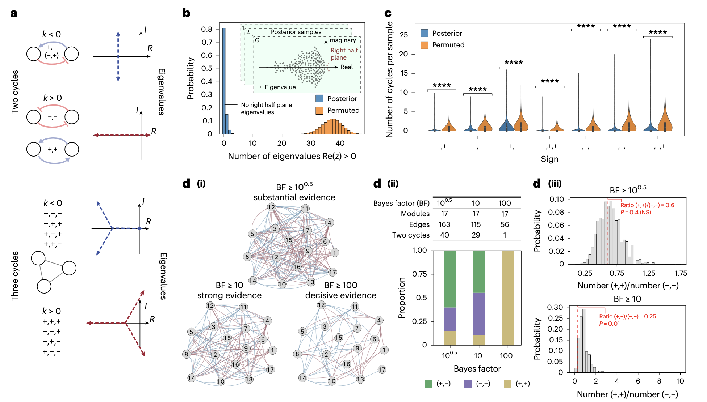

## Introduction

微生物组是一个动态变化的生态系统，其组成与功能会随时间推移受微生物间相互作用、宿主饮食、抗生素干预等因素影响。揭示这些动态变化规律，对理解肠道菌群稳态维持、疾病发生机制及干预策略设计至关重要。然而，传统研究方法面临诸多局限：要么无法捕捉时间维度上的因果关系，要么在处理高复杂度微生物网络时因参数爆炸导致模型难以解释，要么忽略测序数据中的噪声干扰，难以准确推断生态系统级的动态特征。

《Nature Microbiology》发表的研究 “Learning ecosystem-scale dynamics from microbiome data with MDSINE2” 提出了创新性解决方案。研究者开发的MDSINE2（Microbial Dynamical Systems Inference Engine 2）工具，基于贝叶斯框架和广义Lotka-Volterra（gLV）模型，能从微生物组时序数据中学习紧凑且可解释的生态系统尺度动态模型，同时解决了规模化、准确性与可解释性的核心矛盾。

本文简单介绍下这篇研究，并提供MDSINE2工具的完整使用指南。


## 文章介绍

发表于《Nature Microbiology》的这项研究，针对微生物组动态建模的问题，通过创新的“模块学习”“噪声建模”与“稳定性分析”策略，构建了从数据输入到生物学解读的完整分析流程。研究团队不仅开发了MDSINE2工具，还生成了两个高时间分辨率的微生物组时序数据集，为领域提供了重要的方法学与数据资源。

### 微生物组动态研究的核心挑战

当前微生物组动态分析工具在应用中面临三大核心瓶颈，限制了对生态系统级规律的深入探索：
1. **模型复杂度与可解释性失衡**：传统gLV模型需建模所有微生物间的两两相互作用，参数数量随微生物种类增加呈平方级增长（如141个分类单元需建模近2万个相互作用），导致模型难以训练且结果难以解读；
2. **数据噪声与完整性问题**：宏基因组测序数据存在复杂噪声（如低丰度物种检测偏差），且仅能提供相对丰度信息，缺乏总细菌浓度数据，导致动态模型推断准确性下降；
3. **时间分辨率与扰动设计不足**：多数时序研究采样间隔过宽，无法捕捉扰动后的瞬态响应；且实验设计中缺乏针对性扰动，难以解析微生物间的相互作用机制。

为解决这些问题，MDSINE2从模型结构、数据整合、实验设计三方面同步创新，核心目标是实现“大规模微生物网络的动态推断”与“生物学意义的精准解读”。

### MDSINE2的核心设计



#### 1. 基于Dirichlet过程的交互模块自动学习
MDSINE2扩展了传统gLV模型，引入“交互模块”（interaction module）概念——即具有相似交互模式（如被同一类微生物促进或抑制）和相同扰动响应（如对抗生素的敏感性一致）的微生物群组。通过Dirichlet过程先验（Dirichlet Process Prior），模型可从数据中自动学习模块数量与成员构成，无需用户预先设定。

这种模块化设计将模型参数数量从“分类单元数量的平方级”降至“模块数量的平方级”（如141个分类单元可聚类为17个模块，参数从19740个降至272个，减少72倍以上），大幅降低计算复杂度，同时提升结果可解释性。

#### 2. 全贝叶斯框架与多模态数据整合
MDSINE2采用全贝叶斯概率模型，实现两项关键优化：
- **噪声建模**：针对测序数据（计数型）和qPCR数据（总细菌浓度）分别设计噪声模型——测序计数用负二项分布（捕捉过度离散特征），qPCR数据用对数正态分布（反映测量误差），有效校正数据噪声对模型推断的影响；
- **不确定性量化**：通过马尔可夫链蒙特卡洛（MCMC）算法生成参数后验样本，计算贝叶斯因子（Bayes Factor, BF）量化交互作用或扰动效应的置信度（如BF≥100代表“决定性证据”，BF≥10代表“强证据”），为后续分析提供可靠的统计依据。

此外，MDSINE2支持多模态数据输入：既可以整合“测序相对丰度+qPCR总浓度”的完整数据，也可在仅有测序数据时通过先验分布估算总细菌浓度，提升工具的适用性。

#### 3. 随机动态与扰动响应建模
为更真实地模拟微生物组动态，MDSINE2引入两项关键机制：
- **随机动态**：在gLV模型中加入几何布朗运动项（ multiplicative stochastic process），捕捉未测量因素（如宿主代谢波动）导致的微生物丰度随机变化；
- **模块特异性扰动响应**：建模扰动（如高脂饮食、抗生素）对不同模块的特异性影响，通过二元指示变量（z值）判断扰动是否作用于某一模块，并量化其效应强度（γ值），从而解析扰动对生态系统的调控机制。

#### 4. 生态系统稳定性与关键类群分析工具
MDSINE2提供完整的下游分析功能，助力生物学意义解读：
- **稳定性分析**：通过计算交互矩阵的特征值分布，判断生态系统的稳定性（特征值实部均小于0表示系统稳定）；
- **关键模块分析（Keystoneness）**：通过“模块移除模拟”量化每个模块对生态系统的影响——正关键值（promoter）表示该模块移除后其他微生物丰度下降，负关键值（suppressor）表示该模块移除后其他微生物丰度上升；
- **网络拓扑分析**：识别交互网络中的反馈环（如互利共生“+,+”、竞争“-,-”、寄生“+,-”），解析生态系统稳定性的维持机制。

### MDSINE2的性能验证与数据支撑

研究团队通过“模拟数据+真实数据”双重验证，结合自主生成的高时间分辨率数据集，全面验证MDSINE2的性能优势：




#### 1. 高时间分辨率的人类源化小鼠数据集
为提供高质量的动态推断数据，研究团队构建了两个“人类源化无菌小鼠” cohort：
- **健康 cohort**：4只小鼠移植健康人粪便 microbiota，3周适应期后依次接受高脂饮食（HFD）、万古霉素、庆大霉素三种扰动，65天内每只小鼠平均采集76个粪便样本（共304个样本）；
- **dysbiotic cohort**：5只小鼠移植溃疡性结肠炎患者粪便 microbiota，实验设计同健康 cohort，共采集382个样本。

所有样本同时进行16S rRNA基因扩增子测序（获取相对丰度）和qPCR（获取总细菌浓度），最终获得健康 cohort 141个ASV、dysbiotic cohort 121个ASV的高分辨率时序数据，为动态模型推断提供了理想的数据资源。



#### 2. 模拟数据与真实数据的性能验证
在模拟数据与真实数据中，MDSINE2均显著优于主流对比工具（如gLV-L2、gLV-net、CLV等）：
- **预测准确性**：在“留一法”交叉验证中，MDSINE2对微生物丰度的预测误差（RMSE）显著低于传统gLV模型，且模块化版本（MDSINE2）与非模块化版本（MDSINE2⁻ᵐ）预测性能接近（仅微小差异），证明模块化设计在降低复杂度的同时未损失准确性；
- **参数恢复能力**：在半合成数据（基于真实数据推断的模型模拟生成）中，MDSINE2能准确恢复交互作用的存在性（AUC-ROC=0.91）与强度（Spearman相关系数=0.53），而传统gLV模型几乎无法恢复真实交互模式；
- **噪声鲁棒性**：即使在数据下采样（如仅保留25%时间点）或缺乏qPCR数据的情况下，MDSINE2仍能保持较高的推断准确性，显著优于仅使用相对丰度的对比工具。

### MDSINE2的生物学发现与应用价值



研究团队将MDSINE2应用于健康小鼠 cohort 数据，揭示了肠道微生物组生态系统的关键动态规律，展示了工具的生物学解读能力：

#### 1. 模块化交互网络与关键模块功能
MDSINE2从141个ASV中自动识别出17个交互模块，其中两个关键模块具有明确的生态功能：
- **正向关键模块M3**：富集瘤胃球菌科（Ruminococcaceae），其所有输出交互均为促进作用，可促进拟杆菌科（Bacteroidaceae）、毛螺菌科（Lachnospiraceae）等模块的生长。该模块与另外两个正向关键模块（M11、M12，含淀粉降解菌如Ruminococcus bromii、产丁酸菌如Faecalibacterium）形成“交叉喂养链”，符合“ specialists分解复杂底物→支持generalists生长”的已知肠道生态机制；
- **负向关键模块M4**：含多种混合分类单元，其输出交互均为抑制作用，可抑制M3、M11等正向关键模块，以及拟杆菌门为主的模块，可能在维持生态系统平衡中发挥“调控者”作用。



#### 2. 生态系统稳定性机制解析
稳定性分析显示，MDSINE2推断的动态模型稳定概率比随机模型高80%，其稳定性源于两点关键网络特征：
- **反馈环结构**：生态系统中寄生型反馈环（+,−）占比高，而互利共生（+,+）与竞争（−,−）型反馈环占比低，符合“寄生型交互促进稳定性，互利/竞争型交互降低稳定性”的理论生态学规律；
- **低网络密度与合理交互比例**：模块间交互网络密度低（仅56个“决定性证据”交互），且互利共生与竞争的比例（MCR）显著低于随机网络，进一步保障系统稳定性。

#### 3. 扰动响应的模块特异性
MDSINE2能准确解析不同扰动对模块的特异性影响：
- **高脂饮食（HFD）**：显著促进含脂肪降解菌的模块（如Erysipelotrichaceae），抑制依赖复杂碳水化合物的模块（如Ruminococcaceae）；
- **万古霉素**：特异性抑制革兰氏阳性菌模块（如Firmicutes门），对革兰氏阴性菌模块（如Bacteroidetes门）影响较小；
- **庆大霉素**：主要抑制需氧菌模块（如Enterobacteriaceae），对厌氧菌模块影响较弱。

这些发现与已知生物学机制高度一致，验证了MDSINE2解析扰动响应的准确性。

## MDSINE2 使用教程

MDSINE2（Microbial Dynamical Systems INference Engine 2）是一个用于学习微生物动力学的贝叶斯模型Python包，基于广义Lotka-Volterra（gLV）模型扩展，支持通过Python库和命令行接口（CLI）使用。

### 1. 安装

**方式1：pip安装（简单快速）**

```bash
# 克隆仓库
git clone https://github.com/gerberlab/MDSINE2
# 进入目录并安装
cd MDSINE2
pip install .
```

**方式2：conda环境安装**
```bash
# 克隆仓库
git clone https://github.com/gerberlab/MDSINE2
cd MDSINE2
# 创建conda环境（自动安装所有依赖）
conda env create -f conda_recipe.yml
# 激活环境
conda activate mdsine2
```

### 2. 输入文件与数据要求
MDSINE2需输入5类制表符分隔（TSV）文件，涵盖微生物丰度、时间信息、扰动记录等核心数据，具体格式如下：

| 文件类型                | 作用                                  | 格式要求                                                                 |
|-------------------------|---------------------------------------|--------------------------------------------------------------------------|
| 类群信息表（taxa.tsv）  | 记录每个ASV/OTU的ID与分类学注释      | 列：taxa_id, sequence, kingdom, phylum, class, order, family, genus, species |
| 计数表（counts.tsv）    | 每个样本中各ASV的测序reads数          | 行：样本ID；列：taxa_id；值：reads数                                      |
| 时间信息表（times.tsv） | 每个样本的采集时间与对应个体          | 列：sample_id, subject_id, time（单位：天）                               |
| qPCR表（qpcr.tsv）      | 每个样本的总细菌浓度（可选，推荐提供）| 列：sample_id, concentration（单位：CFU/g），可含技术重复                  |
| 扰动表（perturbations.tsv） | 记录扰动类型、时间与作用个体       | 列：perturbation_id, name（如HFD、vancomycin）, start_time, end_time, subject_id |

#### 数据预处理注意事项
- **测序数据过滤**：建议使用DADA2或QIIME2处理原始测序数据，生成ASV表，并过滤低丰度类群（如平均相对丰度<0.01%的ASV）；
- **qPCR数据标准化**：若提供qPCR数据，需确保浓度单位统一（如CFU/g），技术重复取平均值；
- **时间格式统一**：所有时间需转换为“天”（如第1天记为1.0，第1.5天记为1.5），确保时间连续性。

### 3. 核心功能使用
MDSINE2的核心分析流程包括：**数据解析→负二项参数推断→MCMC模型推断→结果可视化→下游分析**，支持Python API和命令行（CLI）两种方式，以下以CLI为例（更适合批量分析），关键步骤附Python示例。

#### （1）步骤1：数据解析（Parse）
将输入TSV文件转换为MDSINE2的核心数据结构`Study`（Python对象，保存为.pkl文件），便于后续分析。

**命令行示例**：
```bash
mdsine2 parse \
  --name "healthy_mouse_study" \  # 研究名称
  --reads counts.tsv \            # 计数表
  --taxa taxa.tsv \               # 类群信息表
  --times times.tsv \             # 时间信息表
  --qpcr qpcr.tsv \               # qPCR表（可选）
  --perturbations perturbations.tsv \  # 扰动表
  --output study.pkl              # 输出Study对象路径
```

**Python示例**：
```python
import mdsine2 as md2

# 解析数据
study = md2.dataset.parse(
    name="healthy_mouse_study",
    reads="counts.tsv",
    taxa="taxa.tsv",
    times="times.tsv",
    qpcr="qpcr.tsv",
    perturbations="perturbations.tsv"
)
# 保存Study对象
study.save("study.pkl")
```

#### （2）步骤2：推断负二项参数（Infer NegBin）
MDSINE2的测序噪声模型基于负二项分布，需先从数据中学习其离散参数（d0和d1），提高后续模型推断准确性。

**命令行示例**：
```bash
mdsine2 infer-negbin \
  --input study.pkl \             # 步骤1生成的Study对象
  --output negbin_params.pkl \    # 输出负二项参数
  --n-samples 10000               # MCMC采样次数（推荐≥10000）
```

**Python示例**：
```python
import mdsine2 as md2
from mdsine2 import config

# 加载Study对象
study = md2.Study.load("study.pkl")

# 配置负二项推断参数
negbin_config = config.NegBinConfig(
    n_samples=10000,  # 采样次数
    burnin=5000       # 燃烧期（前5000次采样丢弃，避免初始值影响）
)

# 构建并运行MCMC
mcmc = md2.negbin.build_graph(
    params=negbin_config,
    graph_name=study.name,
    subjset=study
)
md2.negbin.run_graph(mcmc)

# 保存参数
mcmc.save("negbin_params.pkl")
```

#### （3）步骤3：MDSINE2模型推断（Infer）
核心步骤：基于gLV框架，通过MCMC采样推断模块分类、互作强度、扰动响应等所有模型参数，输出后验样本（保存为.pkl或.h5文件）。

**命令行示例**：
```bash
mdsine2 infer \
  --input study.pkl \             # Study对象
  --negbin-params negbin_params.pkl \  # 步骤2生成的负二项参数
  --output mcmc_results/ \        # 输出目录（保存后验样本）
  --n-samples 20000 \             # MCMC采样次数（推荐≥20000）
  --burnin 10000 \                # 燃烧期
  --learn-modules True            # 开启模块学习（默认True）
```

**Python示例**：
```python
import mdsine2 as md2
from mdsine2 import config

# 加载数据
study = md2.Study.load("study.pkl")
negbin_params = md2.BaseMCMC.load("negbin_params.pkl")

# 配置MDSINE2模型参数
mdsine2_config = config.MDSINE2ModelConfig(
    n_samples=20000,
    burnin=10000,
    learn_modules=True,  # 开启模块学习
    num_threads=4        # 并行线程数（根据CPU调整）
)

# 初始化并运行MCMC
mcmc = md2.initialize_graph(
    params=mdsine2_config,
    graph_name=study.name,
    subjset=study,
    negbin_params=negbin_params.graph
)
md2.run_graph(mcmc)

# 保存后验结果（含所有参数的采样轨迹）
mcmc.save("mcmc_results/mcmc.pkl")
# 保存HDF5格式（便于后续提取特定参数）
mcmc.save_hdf5("mcmc_results/mcmc.h5")
```

#### （4）步骤4：结果可视化（Visualization）
MDSINE2提供多种可视化工具，直观展示后验分布、模块互作网络、动态预测结果等。

##### ① 可视化后验参数分布
展示关键参数（如模块互作强度、生长率）的后验分布，评估推断可信度。
```bash
mdsine2 visualize-posterior \
  --chain mcmc_results/mcmc.pkl \  # 后验样本
  --section posterior \            # 分析“后验”阶段（排除燃烧期）
  --params interactions growth_rates \  # 需可视化的参数（互作强度、生长率）
  --output posterior_plots/        # 输出图片目录
```

##### ② 可视化模块互作网络
将模块间互作关系导出为Cytoscape格式（.json），或直接生成网络图。
```bash
# 导出Cytoscape文件
mdsine2 interaction-to-cytoscape \
  --input mcmc_results/mcmc.pkl \
  --output module_network.json \
  --bf-threshold 100  # 仅保留BF≥100的“决定性证据”互作
```

##### ③ 可视化动态预测结果
对比模型预测的微生物丰度轨迹与真实观测值，评估预测准确性。
```bash
mdsine2 forward-simulate \
  --chain mcmc_results/mcmc.pkl \
  --study study.pkl \
  --subject-id "mouse_1" \  # 特定小鼠ID
  --output simulation_plots/ \
  --plot all  # 绘制所有类群的预测vs真实轨迹
```

#### （5）步骤5：下游分析（Downstream Analysis）
##### ① 关键模块（Keystoneness）分析
量化每个模块对生态系统的影响，识别核心调控模块。
```bash
# 提取初始条件（如第19天的丰度）
mdsine2 extract-abundances \
  --study study.pkl \
  --time 19 \  # 提取第19天的丰度作为初始条件
  --output initial_abundances.tsv

# 计算关键度
mdsine2 evaluate-keystoneness \
  --chain mcmc_results/mcmc.pkl \
  --study study.pkl \
  --initial initial_abundances.tsv \
  --output keystoneness_results.tsv \
  --n-days 100  # 模拟移除模块后100天的生态系统变化
```

##### ② 稳定性分析
评估生态系统的稳态概率，判断其抗扰动能力。
```python
import mdsine2 as md2
import numpy as np

# 加载后验样本
mcmc = md2.BaseMCMC.load("mcmc_results/mcmc.pkl")

# 计算每个后验样本的特征值（判断稳定性：特征值实部>0则不稳定）
stable_counts = 0
total_samples = len(mcmc.graph["interactions"].posterior)

for i in range(total_samples):
    # 提取第i个后验样本的互作矩阵
    interaction_matrix = mcmc.graph["interactions"].posterior[i]
    # 计算特征值
    eigenvalues = np.linalg.eigvals(interaction_matrix)
    # 统计稳定样本（无特征值实部>0）
    if np.all(eigenvalues.real <= 0):
        stable_counts += 1

# 输出稳定概率
stable_prob = stable_counts / total_samples
print(f"生态系统稳定概率：{stable_prob:.2%}")
```

## References
1. Gibson, T.E., Kim, Y., Acharya, S. et al. (2025). Learning ecosystem-scale dynamics from microbiome data with MDSINE2. *Nature Microbiology*. https://doi.org/10.1038/s41564-025-02112-6
2. MDSINE2 官方GitHub仓库：https://github.com/gerberlab/MDSINE2
3. MDSINE2 论文配套仓库（含教程与数据集）：https://github.com/gerberlab/MDSINE2_Paper
