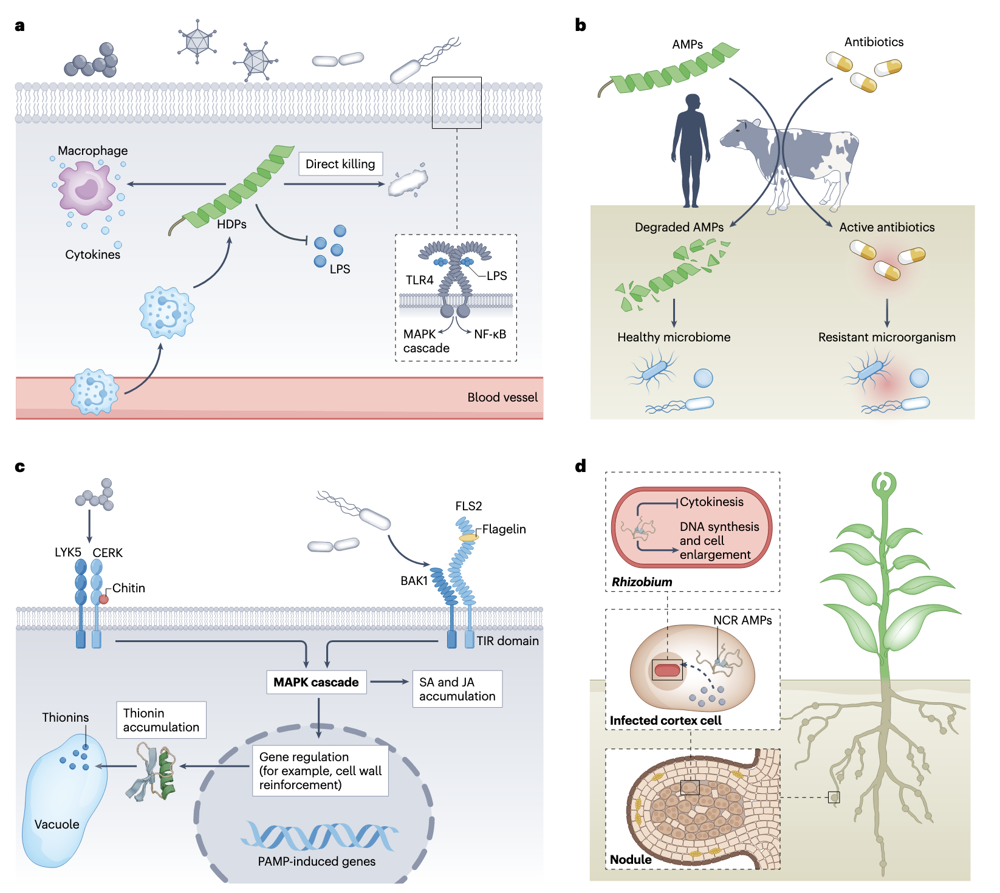
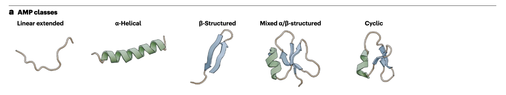
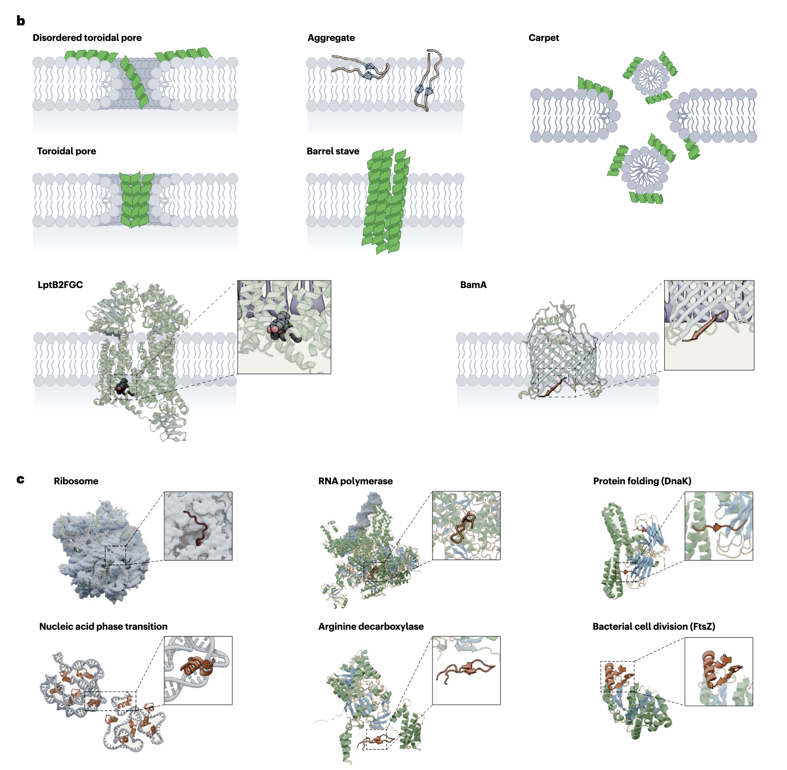
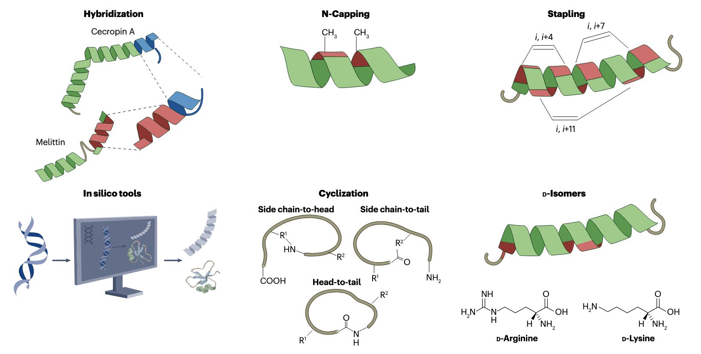
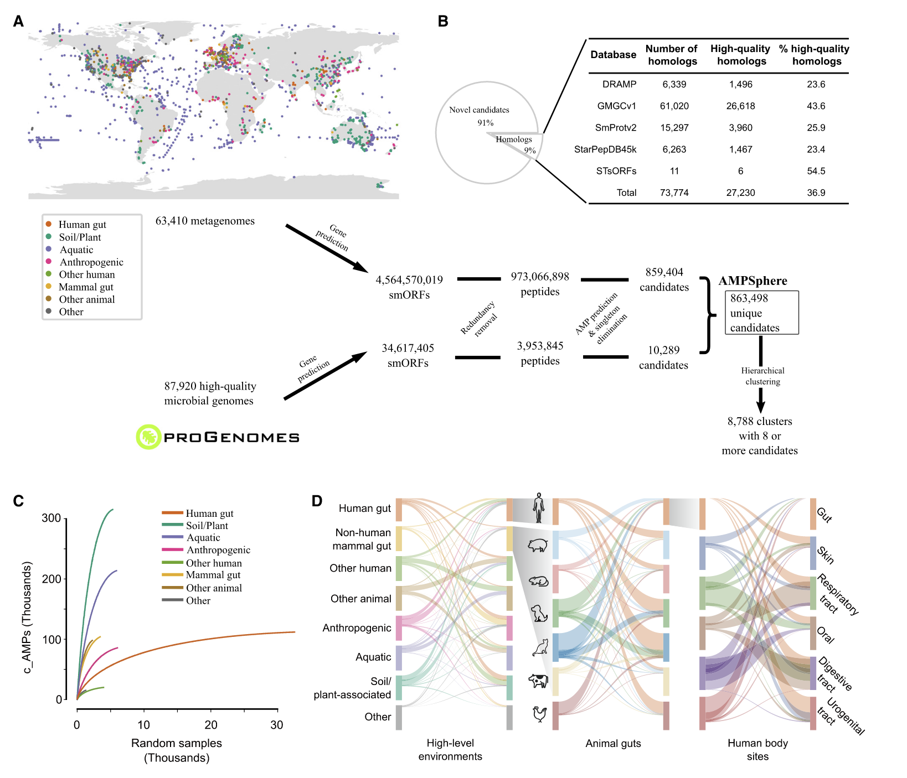
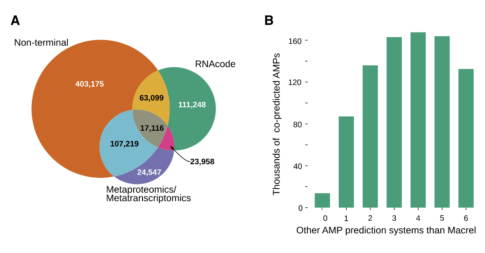
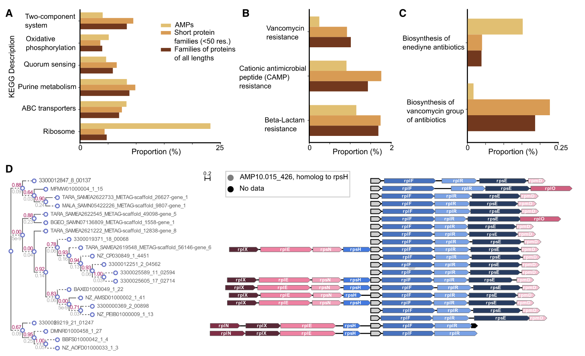
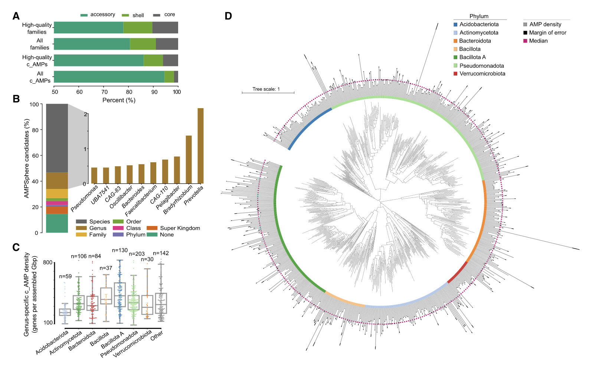
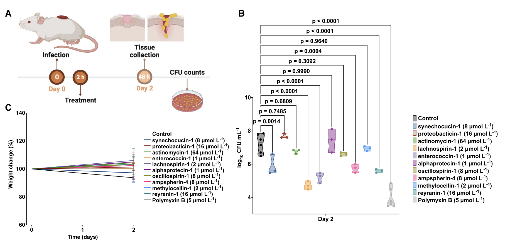

## Introduction

在人类与病原体的长期对抗过程中，微生物耐药性已发展为全球性公共卫生挑战。传统抗生素的不合理使用导致大量致病菌产生耐药性，而抗菌肽（Antimicrobial Peptides, AMPs）凭借独特的分子结构与作用机制，成为新一代抗感染治疗策略的重要研究对象。

AMPs 广泛存在于各类生物体内，长度多在 10-100 个氨基酸残基之间，主要通过破坏细菌细胞膜完整性发挥作用，且耐药性进化率低、与传统抗生素交叉耐药性弱。

这里我们先介绍一篇最新的AMP相关综述，然后介绍一下相关数据库和生信预测方法。

## 抗菌肽：结构、功能与转化应用

2025年发表于《Nature Reviews Microbiology》的综述文章，系统阐述了抗菌肽的结构多样性、作用机制及转化应用潜力，为解决微生物耐药问题提供了重要理论依据与研究方向。

抗菌肽在动植物宿主感染过程中扮演着复杂且关键的角色，如图1所示。在动物体内，当机体受到病原体入侵时，抗菌肽作为先天免疫的重要组成部分，会迅速被诱导表达，在感染部位发挥作用。它们不仅能直接杀灭病原体，还能调节免疫反应，招募免疫细胞到感染部位，增强机体的抗感染能力。

在植物体内，抗菌肽同样是重要的防御物质。当植物受到病原菌攻击时，抗菌肽会在感染部位积累，抑制病原菌的生长和扩散。例如，植物中的硫堇（thionins）能有效抑制多种植物病原菌的生长，保护植物免受感染。

此外，抗菌肽在环境中也能对微生物的分布和数量产生影响，间接参与宿主的抗感染过程。它们可以通过调节环境中的微生物群落结构，减少有害微生物的数量，为宿主创造一个更有利的生存环境。

### 抗菌肽的结构特征

抗菌肽拥有丰富多样的结构，这是其发挥多样功能的基础。从简单的线性肽链到复杂的环化结构，不同结构赋予了抗菌肽不同的理化性质和作用能力。

部分抗菌肽以α-螺旋结构为主，这种结构使其能更好地与微生物细胞膜相互作用，例如蜂毒素（melittin），其α-螺旋结构有助于插入细胞膜形成孔道，破坏膜的完整性。还有一些抗菌肽呈现β-折叠结构，如防御素（defensins），通过β-折叠形成的稳定结构，使其在与靶点结合时具有较高的特异性和亲和力。

除了常见的二级结构，抗菌肽还存在多种高级结构构象。一些抗菌肽会形成环化结构，如植物环肽（cyclotides），通过肽键的环化以及半胱氨酸之间的二硫键，形成了稳定的“环胱氨酸结”结构，这种结构不仅增强了抗菌肽的稳定性，还能提高其对蛋白酶降解的抵抗力。

此外，抗菌肽还能自组装形成多种结构，如图4所示的自组装结构多样性。这些自组装结构包括纳米纤维、纳米颗粒等，不同的自组装结构可能影响抗菌肽的作用范围和效率，例如自组装形成的纳米颗粒可以更有效地聚集在微生物表面，增强抗菌效果。

### 抗菌肽的作用机制与靶点

抗菌肽通过多种独特的机制发挥作用，并且针对微生物的不同靶点，有效抑制或杀灭病原体。

#### 作用机制

1. **破坏细胞膜完整性**：这是许多抗菌肽最主要的作用机制。抗菌肽凭借其两亲性结构，能够与微生物细胞膜结合，插入膜中形成孔道，导致细胞内容物泄漏，最终使微生物死亡。例如，短杆菌肽A（gramicidin A）能在细胞膜上形成跨膜通道，允许离子自由通过，破坏膜电位平衡。
2. **干扰核酸功能**：部分抗菌肽可作用于微生物的核酸，影响其复制、转录和翻译过程。有研究表明，吲哚杀菌素（indolicidin）能与双链DNA结合，改变DNA的结构，从而抑制DNA的复制和转录，如图2中对相关机制的展示。
3. **抑制蛋白质合成**：一些抗菌肽靶向微生物的核糖体，干扰蛋白质的合成。如哺乳动物抗菌肽Bac7(1–16)能结合在细菌核糖体的出口通道处，阻止新生肽链的释放，进而抑制蛋白质合成，这一作用过程在图2中也有体现。
4. **诱导核酸相变**：最新研究发现，抗菌肽还能诱导细菌核酸发生相变，这是一种全新的抗菌机制。这种相变会改变核酸的结构和功能，影响微生物的正常生理活动，最终导致其死亡。

#### 独特靶点
抗菌肽的作用靶点具有多样性和特异性，除了常见的细胞膜、核酸、核糖体等，还包括一些关键的酶和蛋白质。例如，抗菌肽pyrrhocoricin能抑制细菌热休克蛋白DnaK的ATP酶活性，而DnaK在细菌蛋白质折叠过程中至关重要，该酶活性被抑制会导致细菌蛋白质无法正确折叠，影响细菌的生存。另外，还有抗菌肽可作用于细菌的细胞壁合成相关酶，阻止细胞壁的正常合成，使细菌因无法维持细胞形态而裂解。

### 抗菌肽的耐药性与交叉耐药性
尽管抗菌肽具有显著的抗菌效果，但微生物仍可能产生耐药性，同时还存在交叉耐药性问题，这对其应用构成了一定挑战。

#### 耐药性机制
1. **细胞膜修饰**：微生物可通过改变细胞膜的组成和结构来降低对抗菌肽的敏感性。例如，沙门氏菌（Salmonella enterica）能通过PmrA-PmrB调控系统修饰脂多糖（LPS），减少抗菌肽与细胞膜的结合，从而产生耐药性。
2. **外排泵激活**：一些微生物会激活外排泵系统，将进入细胞内的抗菌肽排出体外，降低细胞内抗菌肽的浓度。如肺炎克雷伯菌（Klebsiella pneumoniae）中的KexD外排泵，可主动排出抗菌肽，使其在细胞内无法达到有效杀菌浓度。
3. **产生降解酶**：部分微生物能产生蛋白酶等降解酶，将抗菌肽分解为无活性的片段。例如，金黄色葡萄球菌（Staphylococcus aureus）可分泌蛋白酶降解人类抗菌肽LL-37，使其失去抗菌活性。
4. **形成生物膜**：微生物形成的生物膜能为其提供保护屏障，阻止抗菌肽渗透到细胞内部。生物膜中的 extracellular polymeric substances（EPS）会与抗菌肽结合，降低其对生物膜内微生物的作用。

#### 交叉耐药性
研究发现，抗菌肽与传统抗生素之间可能存在交叉耐药性。例如，对某些抗生素耐药的菌株，可能同时对特定的抗菌肽也表现出耐药性。这是因为一些耐药机制具有通用性，如外排泵不仅能排出抗生素，也能排出抗菌肽。不过，也有研究表明，合理搭配使用抗菌肽和抗生素，可在一定程度上减少交叉耐药性的发生，甚至能逆转部分菌株的耐药性。

### 抗菌肽的设计与优化策略

为了提高抗菌肽的活性、稳定性，降低毒副作用，并克服耐药性，研究人员开发了多种设计与优化策略：

1. **结构修饰**：通过对氨基酸序列进行修饰，如引入D-型氨基酸或非天然氨基酸，可提高抗菌肽对蛋白酶的抗性，延长其在体内的半衰期。例如，在抗菌肽中引入D-型氨基酸后，其被蛋白酶降解的速率显著降低，同时仍能保持较好的抗菌活性。此外，对肽链进行环化修饰，如通过酶催化环化（如butelase 1介导的环化），也能增强抗菌肽的稳定性和抗菌活性。
2. **计算机辅助设计**：随着计算机技术的发展，机器学习、分子对接等方法被广泛应用于抗菌肽的设计。例如，ProT-Diff策略通过整合蛋白质语言模型和扩散模型，能从头生成具有潜在抗菌活性的肽序列。利用分子对接技术，可预测抗菌肽与靶点的结合模式，从而优化肽序列，提高其与靶点的结合亲和力。
3. **杂交肽设计**：将不同抗菌肽的活性片段拼接，形成杂交肽，可融合各片段的优势，提高抗菌效果和广谱性。例如，一种由pleurocidin和dermaseptin活性片段组成的杂交肽，不仅对革兰氏阳性菌和革兰氏阴性菌都有较好的抑制作用，还能有效对抗一些耐药菌株。
4. **纳米载体递送**：将抗菌肽负载到纳米载体中，如脂质体、聚合物纳米颗粒等，可提高抗菌肽的溶解度和稳定性，减少其在体内的非特异性分布，降低毒副作用。同时，纳米载体还能实现抗菌肽的靶向递送，使其更精准地作用于感染部位。

### 抗菌肽的转化应用前景
抗菌肽凭借其独特的优势，在临床治疗、农业、食品工业等领域具有广阔的转化应用前景。

在临床治疗方面，抗菌肽可用于治疗多种耐药菌引起的感染，如耐甲氧西林金黄色葡萄球菌（MRSA）、碳青霉烯耐药鲍曼不动杆菌（carbapenem-resistant A. baumannii）等。一些抗菌肽已进入临床试验阶段，例如SAAP-148，它能有效清除多重耐药菌、生物膜和持留菌，且产生耐药性的潜力较小，为解决抗生素耐药性问题提供了新的希望。

在农业领域，抗菌肽可作为饲料添加剂，替代传统抗生素，减少抗生素在动物体内的残留，降低动物产品的安全风险。同时，抗菌肽还能提高动物的免疫力，促进动物生长。例如，重组抗菌肽Epinephelus lanceolatus piscidin作为饲料添加剂，能改善肉鸡的生长性能和免疫反应。此外，抗菌肽还可用于植物病害的防治，减少化学农药的使用，保护环境。

在食品工业中，抗菌肽可作为天然防腐剂，延长食品的保质期。由于其具有高效、安全、无残留等特点，在肉类、水产品、乳制品等食品的保鲜中具有很大的应用潜力。

不过，抗菌肽在转化应用过程中仍面临一些挑战，如生产成本较高、部分抗菌肽存在一定的毒副作用、在体内的稳定性有待进一步提高等。未来，需要通过技术创新和工艺优化，解决这些问题，推动抗菌肽在各个领域的广泛应用。

## 抗菌肽相关数据库

### APD6

抗菌肽数据库（Antimicrobial Peptide Database，APD）是抗菌肽研究领域的重要资源平台，由美国内布拉斯加大学医学中心埃普利研究所负责维护和更新。

网址：<https://aps.unmc.edu/AP/>

1. **发展历程与数据规模**：2003年上线，截至2025年9月10日，APD6版本已收录5680条肽，涵盖3351条天然抗菌肽、1733条合成抗菌肽和329条预测抗菌肽。天然抗菌肽来源广泛，涉及细菌、古菌、原生生物、真菌、植物和动物六个生命王国 。
2. **数据分类**
    - **按功能分类**：包括抗菌、抗生物膜、抗耐甲氧西林金黄色葡萄球菌（MRSA）、抗结核、抗内毒素、抗病毒、抗真菌等多种功能类别，满足不同研究和应用需求。
    - **按来源分类**：在天然抗菌肽中，动物来源的宿主防御肽占比较大，有1806条脊椎动物和803条无脊椎动物的抗菌肽有已知活性，还详细区分了人类、哺乳动物、两栖动物、鱼类等不同类群的数量 。
3. **三维结构信息**：APD6中含有534个独特的三维结构，统一分为α -螺旋（如两栖动物的magainin II ）、β -折叠（如牛乳铁蛋白肽）、αβ结构（如植物的PsD1）和非αβ结构（如牛吲哚杀菌素）四类，有助于研究人员从结构角度理解抗菌肽的功能机制。
4. **搜索功能**：数据库具备强大的搜索引擎，支持通过APD ID、肽名称、来源生物、生命领域/王国、氨基酸序列等多种方式进行搜索，方便研究人员快速定位所需信息。
5. **研发助力工具**：新型抗菌肽信息管道（AMPIP）旨在推动先进人工智能预测器的开发，以研发更有效的肽类抗生素。用户在“附加信息”中输入相关搜索词，就能获取所需数据。
6. **应用领域**：APD支撑了多个领域的研究。在药物开发方面，可筛选针对特定病原体的候选肽段；生物信息学研究中，为相关分析提供基准序列；分子进化研究里，帮助发现不同物种抗菌肽的同源性；合成生物学领域，基于数据库设计的抗菌肽可提升抗菌效果。 

### DBAASP

抗菌活性和肽结构数据库（Database of Antimicrobial Activity and Structure of Peptides，DBAASP）是一个人工精心整理的数据库，为抗菌化合物的研发提供信息与分析资源。

网址：<https://www.dbaasp.org/home>

1. **数据库基本信息**：2014年创建，由格鲁吉亚的伊万·贝里塔什维利实验生物医学中心负责维护。目前版本为v3.0，提供免费开放访问服务 。
2. **数据规模与类型**：截至目前，数据库收录了超过15700条记录，包括14500多条单体肽、近400条同源和异源多聚体肽。单体抗菌肽中，合成肽超12000条、核糖体合成肽约2700条、非核糖体合成肽约170条。此外，还包含23288条单体、420条多聚体、236条多链肽数据，以及786条具有协同活性的数据记录。
3. **数据内容**
    - **结构信息**：涵盖肽的氨基酸序列、化学修饰（如N和C末端的化学基团、特殊氨基酸修饰等）以及三维结构等详细信息。
    - **活性信息**：记录了肽对特定目标物种的抗菌活性，还提供溶血（细胞毒性）活性数据，以及评估活性时的实验条件 。
    - **协同活性数据**：展示数据库中特定肽与其他肽或抗菌剂针对特定目标菌株的联合活性，用分级抑菌浓度指数（FICI）值量化 。
4. **功能与优势**
    - **助力构效关系研究**：为研究肽的结构与抗菌活性之间的关系提供全面数据支持，帮助科研人员揭示影响抗菌活性和治疗指数的关键理化参数。
    - **预测抗菌潜力**：依据输入的氨基酸序列，预测查询肽的抗菌潜力，辅助设计新型抗生素，提高预测准确性，降低生产成本。
    - **靶向搜索与结果排序**：支持按特定目标物种搜索肽的活性，并以活性值排名列表展示结果，方便快速筛选有效抗菌肽。
    - **机器学习设计新抗生素**：可构建针对特定目标物种的经实验验证的阳性（抗菌肽）或阴性（非抗菌肽）肽集，为基于机器学习的新抗生素设计提供有效方法 。 

## 机器学习助力发现全球微生物组中抗菌肽

近日，一项发表于《Cell》的多方合作研究，借助机器学习技术，从全球微生物组中成功预测并发现大量新型抗菌肽，为抗生素研发开辟新路径。

### 数据整合与机器学习预测体系

#### 1. 数据来源与预处理
研究团队整合了全球范围内的微生物组数据，包括63,410个公开宏基因组样本（覆盖土壤、水生、人体肠道等72种生境）和87,920个高质量原核生物基因组（来自ProGenomes2数据库）。为解决smORF预测难题，采用改良版Prodigal软件（可识别30-300 bp的短序列），从宏基因组组装 contig 及原核基因组中共预测出45.99亿个smORF，为后续AMP筛选奠定数据基础。

#### 2. 机器学习预测工具与流程
选用Macrel作为核心预测工具，该工具基于随机森林算法，以AMP的理化特性（如电荷、等电点、两亲性）和序列特征为训练参数，侧重预测精度的优化。具体流程包括：
- 初筛：通过Macrel从45.99亿个smORF中筛选出551.83万个候选AMP基因；
- 去冗余：去除仅在单一样本中出现的序列（除非与已知AMP数据库DRAMP 3.0存在高同源性，即氨基酸一致性≥75%且E值≤10⁻⁵），最终获得863,498条非冗余候选抗菌肽（c_AMPs）；
- 质量控制：通过多维度验证（如与独立宏转录组/宏蛋白质组数据比对、跨预测工具验证），筛选出80,213条高质量c_AMPs（占总候选序列的9.2%），其中172,840条（20%）可在公开转录/翻译数据中检测到表达证据。

#### 3. 实验验证设计
为验证预测结果，研究团队从AMPSphere中随机选取100条c_AMPs进行合成，通过体外抑菌实验（针对临床常见ESKAPE耐药致病菌，如肺炎克雷伯菌、肠杆菌属等）和体内抗感染实验（小鼠皮肤脓肿模型）评估活性。同时，采用圆二色谱分析肽分子二级结构，通过荧光染料标记法检测其对细菌细胞膜的破坏作用，明确抗菌机制。

### 主要结果

#### 1. AMPSphere的规模与分子特征

构建的AMPSphere数据库包含863,498条非冗余c_AMPs，平均长度为37±8个氨基酸残基，具备典型AMP的理化特性：正电荷（4.7±2.6）、高等电点（10.9±1.2）、高两亲性（疏水矩0.6±0.1）及较强的膜结合潜力（Boman指数1.14±1.1）。与已知AMP数据库对比发现，仅0.7%（6,339条）c_AMPs与DRAMP 3.0中的实验验证AMP同源，8.5%（73,774条）可在SmProt2（小蛋白数据库）、GMGCv1（全球微生物基因目录）等数据库中找到同源序列，表明AMPSphere显著拓展了AMP的序列空间。

#### 2. c_AMPs的生境特异性与稀有性
- 生境分布：c_AMPs广泛分布于8个高等级生境组，其中土壤/植物生境占比最高（36.6%），其次为水生环境（24.8%）和人类肠道（13%）；除人类肠道外，多数生境的c_AMPs发现仍处于不饱和状态（稀释曲线呈陡峭上升趋势），提示未来仍有大量AMP待挖掘。
- 稀有性特征：83.97%的c_AMPs仅在<1%的样本中检测到，跨生境共享的c_AMPs比例仅为10.8%（93,280条），显著低于随机分配预期（7.25倍），即使在同一高等级生境组内，跨具体生境的共享比例也远低于随机水平（2.4-192倍），表明c_AMPs具有极强的生境特异性。

#### 3. c_AMPs的进化起源与基因组特征

- 进化机制：约7%（61,020条）c_AMPs与全长蛋白质同源，其中27%与同源蛋白质共享起始密码子，提示可能通过全长基因早期终止突变（如无义突变导致转录提前终止）产生；此外，38.9%的c_AMPs（在不同基因组中存在≥2个同源物）与已知功能基因存在保守基因组上下文，其中23.6%与核糖体相关基因相邻，1,951条c_AMPs与邻近基因具有相同KEGG直系同源组注释，暗示基因复制可能是另一重要起源途径。

- 泛基因组定位：在ProGenomes2数据库的416个物种中，仅5.9%的c_AMPs家族属于核心基因组（存在于≥95%的物种基因组中），其余均为附属基因组成员，表明c_AMPs可能是微生物适应特定生境的“适应性分子”，而非基础生命活动必需基因。

#### 4. 实验验证结果

- 体外活性：100条合成c_AMPs中，79条表现出体外抑菌活性，其中63条可有效抑制至少一种ESKAPE致病菌，最小抑菌浓度（MIC）与临床常用抗生素相当（部分低至8 μg/mL）；
- 作用机制：活性c_AMPs主要通过破坏细菌细胞膜发挥作用，可导致细胞膜去极化和通透性增加，且多数（68%）可形成α-螺旋或β-折叠二级结构，这一结构特征与其膜破坏能力直接相关；
- 体内效果：选取10条高活性c_AMPs进行小鼠实验，其中6条可显著降低皮肤脓肿模型中的细菌载量（降幅≥1个数量级），且无明显毒副作用（对小鼠肝细胞和红细胞的溶血率<5%）。

### 展望机器学习驱动的AMP研发新方向
该研究通过机器学习与微生物组大数据的结合，为抗生素耐药性危机提供了创新性解决方案。未来研究可聚焦三方面：
1. 生境拓展：加强极端环境（如深海热泉、高盐土壤）和未充分研究生境（如植物内生菌、昆虫肠道）的宏基因组采样，挖掘更多新型AMP；
2. 功能挖掘：结合转录组学和代谢组学，探索c_AMPs在非抗菌领域的功能，如调节宿主免疫、抑制生物膜形成等；
3. 定向优化：基于AMPSphere的序列特征，通过机器学习预测肽分子的稳定性、毒性及耐药性风险，实现AMP的理性设计与改造，加速临床转化。

此外也有很多新的软件工具开发，比如在Cell Reports发表的题为Unveiling the evolution of antimicrobial peptides in gut microbes via foundation-model-powered framework开发了一项由人工智能驱动的AMP-SEMiner模型框架。该AI框架基于蛋白语言模型（Protein Language Models, PLMs），结合序列、结构和进化多模态信息，成功在宏基因组中高通量发现并解析数百万条潜在抗菌肽。

## References
1. Oliveira Júnior, N.G., Souza, C.M., Buccini, D.F., Cardoso, M.H., and Franco, O.L. (2025). Antimicrobial peptides: structure, functions and translational applications. Nat. Rev. Microbiol., 1–14. https://doi.org/10.1038/s41579-025-01200-y.
2. Santos-Júnior, C.D., Torres, M.D.T., Duan, Y., Rodríguez del Río, Á., Schmidt, T.S.B., Chong, H., Fullam, A., Kuhn, M., Zhu, C., Houseman, A., et al. (2024). Discovery of antimicrobial peptides in the global microbiome with machine learning. Cell. https://doi.org/10.1016/j.cell.2024.05.013.
3. Li, W., Huang, B., Guo, M., Zeng, Z., Cai, T., Feng, L., Zhang, X., Guo, L., Jiang, X., Yin, Y., et al. (2025). Unveiling the evolution of antimicrobial peptides in gut microbes via foundation-model-powered framework. Cell Rep. 44. https://doi.org/10.1016/j.celrep.2025.115773.
